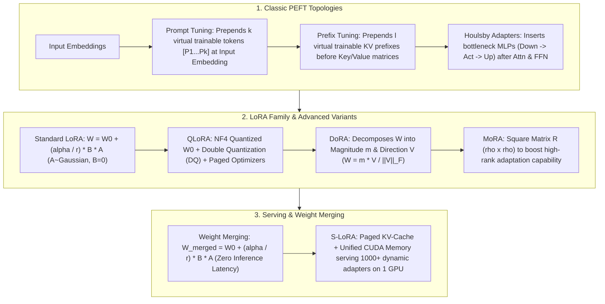

# 🌐 Parameter-Efficient Fine-Tuning (PEFT): LoRA, QLoRA, DoRA, Prefix/Prompt Tuning, Adapters & MoRA/ReLoRA

> **Core Executive Summary**: As Large Language Models (LLMs) scale to hundreds of billions of parameters, Full Fine-Tuning becomes computationally prohibitive. **Parameter-Efficient Fine-Tuning (PEFT)** techniques freeze the pre-trained base weight $W_0$ and train a tiny subset of incremental parameters ($<1\%$), matching full fine-tuning accuracy. This guide provides an exhaustive analysis of **LoRA** low-rank math, **QLoRA** NF4 4-bit quantization and paged memory management, **DoRA** magnitude-direction decomposition, **Prefix/Prompt Tuning** virtual token mechanisms, **Houlsby Adapters**, and SOTA extensions like **MoRA/ReLoRA/S-LoRA**.

---

## 💡 Interactive Mermaid Architecture Flowchart



---

## 💡 Classic Interview Followups & Core Cheatsheet

* **Key Topic 1**: Derive the LoRA low-rank matrix decomposition formula and explain why matrix A is Gaussian-initialized while matrix B is zero-initialized.
  * *Standard Answer*: Given pre-trained weights $W_0 \in \mathbb{R}^{d \times k}$, LoRA decomposes parameter update $\Delta W$ into the product of two low-rank matrices:
    $$\Delta W = \frac{\alpha}{r} (B \times A)$$
    where $A \in \mathbb{R}^{r \times k}$, $B \in \mathbb{R}^{d \times r}$, with rank $r \ll \min(d, k)$ (e.g. $r=8, d=4096$). Parameter $\alpha$ is a scaling constant.
    * **Why $A \sim \mathcal{N}(0, \sigma^2)$ and $B = 0$**: At step $t=0$, forward pass requires exact identity mapping ($\Delta W = 0$) matching the base model. If both $A$ and $B$ were non-zero random, initial predictions would be corrupted; if both were 0, symmetry would prevent gradient flow. Setting $B = 0 \implies \Delta W = \frac{\alpha}{r} (0 \times A) = 0$ preserves initial model output while allowing non-zero $A$ to break symmetry for smooth gradient updates into the low-rank subspace.

  * *30-second Oral Answer*: "Conclusion: LoRA factors the weight update ΔW into the product of two low-rank matrices A and B; B must be zero-initialized and A Gaussian, so the starting point matches the base model exactly while gradients can still flow. Why: ΔW=(α/r)·B·A with rank r far below the matrix dimension (r=8 vs d=4096) cuts trainable parameters to ~0.1%; with B=0, ΔW=0 and the first forward pass is identical to the pretrained model; if both A and B were zero, gradient symmetry would freeze both; a nonzero A breaks symmetry and lets gradients enter the low-rank subspace. Example: a 4096×4096 matrix holds 16.7M parameters; LoRA (r=8) trains only ~65K, about 0.4% — roughly 350MB of extra parameters for a 7B model."

* **Key Topic 2**: What specific VRAM bottlenecks are resolved by QLoRA 4-bit NormalFloat (NF4), Double Quantization (DQ), and Paged Optimizers?
  * *Standard Answer*: QLoRA slashes 65B model fine-tuning VRAM from > 780GB to under 48GB on a single GPU via three innovations:
    * **4-bit NormalFloat (NF4)**: Information-theoretically optimal quantile quantization for normally distributed weights $\mathcal{N}(0, \sigma^2)$, preserving maximum information density with near-zero precision loss compared to FP4/INT4.
    * **Double Quantization (DQ)**: Quantizes the first-stage quantization constants (FP32 scales) using FP8, reducing scale overhead from 0.5 bit/param to ~0.127 bit/param—saving 3GB VRAM on a 65B model.
    * **Paged Optimizers**: Uses NVIDIA Unified Memory to page out optimizer states to CPU RAM during activation gradient spikes, preventing OOM crashes.

  * *30-second Oral Answer*: "Conclusion: QLoRA's three pieces each solve one bottleneck — NF4 quantizes the weights (780GB→48GB), Double Quantization re-compresses the quantization constants (saving 3GB more), and Paged Optimizers prevent OOM. Why: pretrained weights are roughly normal, so NF4's quantile-based non-uniform quantization packs more information than uniform FP4/INT4; the first-stage FP32 scales are re-quantized to FP8, dropping per-parameter overhead from 0.5 bit to ~0.127 bit; optimizer states page out to CPU RAM during activation spikes. Example: full fine-tuning of 65B needs 780GB+; QLoRA runs on a single 48GB GPU, and DQ alone saves ~3GB at 65B — this is the realistic path to fine-tuning 70B models on consumer hardware."

* **Key Topic 3**: How does DoRA (Weight-Decomposed Low-Rank Adaptation) improve weight updates compared to standard LoRA?
  * *Standard Answer*: Full FT independently modifies weight **Magnitude** and **Direction**. Standard LoRA forces magnitude and direction updates to be highly correlated, restricting capacity.
  **DoRA** decomposes $W$ into scalar column magnitude $m \in \mathbb{R}^{1 \times k}$ and directional matrix $V \in \mathbb{R}^{d \times k}$:
  $$W = m \odot \frac{V}{\|V\|_F} = m \odot \frac{W_0 + \frac{\alpha}{r} B A}{\|W_0 + \frac{\alpha}{r} B A\|_F}$$
  Direction $V$ uses LoRA low-rank updates while magnitude $m$ is trained independently, breaking correlation and matching full fine-tuning performance while retaining zero inference latency weight merging.

  * *30-second Oral Answer*: "Conclusion: DoRA explicitly splits weights into 'magnitude m + direction V' as independent variables — the direction uses LoRA low-rank updates while the magnitude is fully trainable, breaking the magnitude-direction coupling that limits LoRA. Why: full fine-tuning can independently resize and re-angle weights, but LoRA's ΔW=BA forces the two to be highly correlated; DoRA column-normalizes the weight into a direction and multiplies by a scalar magnitude, which is small (1×k) yet independently trainable. Example: at equal budget DoRA typically beats LoRA by 1-3 points on commonsense/math benchmarks, and it still merges into a single matrix at inference with zero latency — one of the accuracy ceilings of PEFT today."

* **Key Topic 4**: Compare Prefix Tuning, Prompt Tuning (Soft Prompts), and LoRA in terms of target layers and KV-Cache VRAM overhead.
  * *Standard Answer*:
    * **Prompt Tuning**: Prepends $k$ trainable virtual tokens at the **Input Embedding layer** only. Lightweight, but eats into the sequence context window.
    * **Prefix Tuning**: Prepends $l$ trainable virtual KV prefixes $[K_{\text{prefix}}; K]$ and $[V_{\text{prefix}}; V]$ at **every Transformer layer**. Higher capacity, but increases inference KV-Cache VRAM consumption.
    * **LoRA**: Modifies **linear weight matrices** ($W_q, W_v, W_{\text{gate}}$). Zero context window loss, zero KV-cache overhead, and zero inference latency after weight merging ($W = W_0 + \Delta W$).

  * *30-second Oral Answer*: "Conclusion: the three methods act at different levels — Prompt Tuning touches only the input embedding, Prefix Tuning touches every layer's KV, LoRA touches the weight matrices; KV-cache overhead ranks Prefix > Prompt > LoRA (zero). Why: Prompt Tuning prepends k trainable virtual vectors, lightweight but consuming context window; Prefix Tuning prepends l virtual KV prefixes per layer, more expressive but the cache must store them; LoRA never touches the sequence — it modifies weights themselves and fuses to zero overhead. Example: in an 8K window, Prompt Tuning with 100 virtual tokens leaves only 7.9K for real text; Prefix Tuning stores l extra KVs at every layer; a merged LoRA runs at exactly the base model's speed — which is why production prefers LoRA."

* **Key Topic 5**: How does LoRA achieve Zero Inference Latency during deployment, and what precautions are needed during weight merging?
  * *Standard Answer*: Linear layer output $y = h W_0 + h \Delta W = h \left( W_0 + \frac{\alpha}{r} B A \right)$.
  Prior to deployment, perform **Offline Weight Merging**:
  $$W_{\text{merged}} = W_0 + \frac{\alpha}{r} (B \times A)$$
  The resulting weight matrix replaces $W_0$, matching base model inference speed 100% with no runtime adapter overhead.
  * **Precaution**: If $W_0$ is quantized (e.g. QLoRA INT4), dequantize $W_0$ to FP16/BF16 before adding $\Delta W$, then re-quantize to avoid severe precision degradation.

  * *30-second Oral Answer*: "Conclusion: LoRA achieves zero inference latency through offline weight merging — add α/r·BA back into W0 as a single weight file, so the deployed path is identical to the base model. Why: the distributive law y = h(W0 + (α/r)BA) makes the dual-path forward mathematically equivalent to the single fused-path forward, so outputs agree bit-for-bit and no runtime branch is needed. Example: in the demo the pre/post-merge output difference is 0.0 (at the 1e-16 level); caution — under QLoRA, W0 is INT4, so you must dequantize to FP16, add ΔW, then re-quantize; mixing precisions directly collapses accuracy, the most common engineering pitfall."

---

## 📚 Section 1: Comprehensive PEFT Topology Matrix

### 1.1 PEFT Methods Comparison Matrix

| PEFT Method | Location | Trainable Parameters | Context Window Loss | Inference Latency Impact |
| :--- | :--- | :--- | :--- | :--- |
| **Prompt Tuning** | Input Embedding | $< 0.01\%$ | Consumes $k$ tokens | 0 (only prefix FLOPs) |
| **Prefix Tuning** | Per-layer Attn KV | $0.1\% \sim 1\%$ | Consumes $l$ KV spaces | Slight VRAM & KV Cache overhead |
| **Houlsby Adapters** | Serial MLPs in Attn/FFN | $0.5\% \sim 3\%$ | **0** | Sequential MLP forward delay |
| **BitFit** | Bias terms only | $< 0.1\%$ | **0** | **0** (Bias fused) |
| **LoRA** | Linear Weights $W_q, W_v$ etc | $0.01\% \sim 0.5\%$ | **0** | **0** (Fused weights) |
| **QLoRA** | NF4 4-bit Quantized Weights | $0.01\% \sim 0.5\%$ | **0** | 4-bit dequantization latency |
| **DoRA** | Magnitude + Direction | $0.05\% \sim 0.6\%$ | **0** | **0** (Fused weights) |
| **MoRA** | Square Matrix $R$ | $0.01\% \sim 0.5\%$ | **0** | **0** (Fused weights) |

How to read this table: scan the Location column to assign families — methods touching embeddings are Prompt/Prefix, methods touching weights are the LoRA family, methods inserting modules are Adapters; then look at the last two columns: LoRA is all zeros for both context loss and latency, which is why it became the industry standard.

> 💡 **Intuition**: PEFT means "serve a small extra meal": the base weights stay frozen and only a tiny slice of parameters learns the task. Three families — the 'prefix' camp (Prompt/Prefix Tuning, stitching virtual tokens onto inputs or KVs), the 'weight' camp (LoRA/DoRA/MoRA, low-rank side paths), and the 'module' camp (Adapters, bottleneck MLPs inserted between layers). Which method eats sequence length and which adds latency is all visible in this table.
>
> 🎤 **Interview Answer**: "Conclusion: three PEFT families — prefixes eat sequence length, weights (LoRA) cost nothing, modules (Adapter) add sequential latency; LoRA wins on accuracy + zero latency, so it is most common. Why: Prompt Tuning touches the input layer (light but eats window), Prefix Tuning touches per-layer KV (better capacity, more cache), LoRA modifies weight matrices (zero overhead); BitFit is cheapest (biases only), QLoRA runs LoRA on 4-bit weights for VRAM-constrained GPUs. Example: LoRA (r=16) on a 7B model trains ~3.5M parameters, about 0.05% — easy on a 24GB GPU; the same full fine-tune needs 60GB+."

---

## ⚡ Section 2: LoRA Mathematics & Hyperparameter Engineering

### 2.1 Rank $r$ and Scaling Factor $\alpha$ Tuning Guidelines

1. **Rank $r$ Selection**: $r \in [8, 16]$ for standard SFT; $r \in [32, 64]$ for deep domain knowledge injection (Medical, Code).
2. **Scaling Factor $\alpha$**: Set $\alpha = 2 \times r$ or $\alpha = r$. Keeping $\alpha$ constant scales learning rate automatically when tuning $r$.
3. **Target Modules**: Applying LoRA to **all linear layers** ($W_q, W_k, W_v, W_o, W_{\text{gate}}, W_{\text{up}}, W_{\text{down}}$) significantly outperforms tuning $W_q, W_v$ with higher rank.

> 💡 **Intuition**: All three rules share one principle — 'you train very few parameters, so spend them where they count'. Rank r sets the side-path capacity (domain-knowledge injection wants a wide path, general instruction tuning is fine at 8-16); α and r jointly set the step size, and with α fixed, changing r rescales updates automatically so the learning rate needs no retuning; the modern consensus is to attach LoRA to every linear layer — opening a small door on every matrix beats opening one door wider.
>
> 🎤 **Interview Answer**: "Conclusion: three rules — use r=8~16 for general SFT and r=32~64 for heavy knowledge injection; set α=2r; attach LoRA to all linear layers. Why: too-low rank cannot hold domain knowledge, too-high rank overfits with diminishing returns; in ΔW=(α/r)BA, fixing α and changing r rescales the update like auto-tuning the LR; full-layer coverage offers more adjustable space than cranking one layer's rank. Example: medical QA SFT uses r=64, α=128; general chat r=16, α=32; experiments show all-layer LoRA beats q/v-only by ~2-4 points on MMLU."

---

## 🐍 Section 3: Pure Numpy Handwritten LoRA Linear Layer

The LoRALinear below demonstrates the core idea of 'two paths during training, one path at deployment': unmerged forward computes both base and lora paths; `merge_weights()` adds $\frac{\alpha}{r} B A$ back into W0, after which forward takes a single path. The tests verify two facts: at initialization the output difference versus W0-only forward is exactly 0 (identity mapping), and the pre/post-merge outputs match (zero-latency deployment).

```python
import numpy as np

class PureNumpyLoRALinear:
    def __init__(self, in_features: int, out_features: int, r: int = 8, lora_alpha: float = 16.0):
        self.in_features = in_features
        self.out_features = out_features
        self.r = r
        self.lora_alpha = lora_alpha
        self.scaling = lora_alpha / r
        
        self.W0 = np.random.randn(out_features, in_features) * 0.02
        self.lora_A = np.random.randn(r, in_features) / np.sqrt(r)
        self.lora_B = np.zeros((out_features, r))
        self.is_merged = False
        
    def forward(self, x: np.ndarray) -> np.ndarray:
        if self.is_merged:
            return x @ self.W0.T
        else:
            base_out = x @ self.W0.T
            lora_out = (x @ self.lora_A.T @ self.lora_B.T) * self.scaling
            return base_out + lora_out
            
    def merge_weights(self):
        if not self.is_merged:
            delta_w = (self.lora_B @ self.lora_A) * self.scaling
            self.W0 = self.W0 + delta_w
            self.is_merged = True
            print("✅ Successfully merged LoRA weights into W0!")

if __name__ == "__main__":
    np.random.seed(42)
    x = np.random.randn(4, 512)
    layer = PureNumpyLoRALinear(512, 1024, r=8, lora_alpha=16.0)
    out_init = layer.forward(x)
    diff = np.max(np.abs(out_init - (x @ layer.W0.T)))
    print(f"1. Initial Output Diff (should be 0.0): {diff:.6f}")
    
    layer.lora_B = np.random.randn(1024, 8) * 0.1
    out_before = layer.forward(x)
    layer.merge_weights()
    out_after = layer.forward(x)
    diff_merge = np.max(np.abs(out_before - out_after))
    print(f"2. Pre/Post Merge Output Diff (should be 0.0): {diff_merge:.6e}")
```

> 💡 **Intuition**: Two lines worth memorizing: `lora_B = np.zeros((out_features, r))` corresponds to 'B must be zero-initialized', and `lora_A = np.random.randn(r, in_features) / np.sqrt(r)` corresponds to 'A Gaussian scaled by $1/\sqrt{r}$'. The heart of `merge_weights()` is one line — `W0 = W0 + scaling * (B @ A)`; `unmerge_weights()` subtracts it back for experiments.
>
> 🎤 **Interview Answer**: "Conclusion: LoRA forward = base path + side path, and after merging only one path remains, so latency is zero. Why: with B=0 initially the side path outputs 0 and the model behaves exactly like the pretrained one; merging is a single matrix addition after which the inference path is identical to a normal linear layer. Example: in the demo with a 4×512 input and r=8, the side path only computes small 512×8 matmuls; the max pre/post-merge output difference is ~1e-16, proving the merge is mathematically exact."

---

## 🚀 Key Takeaways & Best Practices

1. **Primary Recommendation**: Prefer **DoRA** or **LoRA** targeting ALL linear layers ($r=16, \alpha=32$). For VRAM-constrained setups, use **QLoRA (NF4 + DQ)**.
2. **Deployment**: Always execute `merge_weights()` for zero inference latency in production. Use **S-LoRA** for multi-tenant dynamic adapter serving.
3. **Target All Modules**: Never restrict LoRA to $W_q, W_v$; apply to $W_q, W_k, W_v, W_o, W_{\text{gate}}, W_{\text{up}}, W_{\text{down}}$ for maximum parameter capacity.