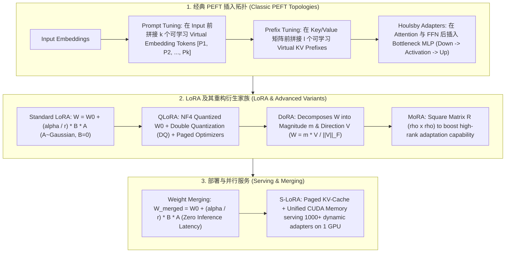

# 🌐 高效微调 (PEFT) 架构全景：LoRA、QLoRA、DoRA、Prefix/Prompt Tuning、Adapters 与 MoRA/ReLoRA 深度剖析

> **核心摘要**：随着大语言模型 (LLM) 参数量迈向千亿级，全参数微调 (Full Fine-Tuning) 的显存与计算开销变得不可承受。**高效参数微调 (Parameter-Efficient Fine-Tuning, PEFT)** 技术通过仅冻结预训练基座权重 $W_0$，仅训练极少量的增量参数（通常 $< 1\%$），实现与全量微调媲美的下游任务性能。本指南深度拆解 **LoRA** 的低秩数学推导、**QLoRA** 的 NF4 4-bit 量化与分页显存管理、**DoRA** 权重幅值与方向解耦、**Prefix/Prompt Tuning** 虚拟前缀机制、**Adapters** 瓶颈结构，以及 **MoRA/ReLoRA/S-LoRA** 等前沿 SOTA 扩展。

---

## 💡 交互式 Mermaid 架构流程图



---

## 💡 经典面试追问与考点速查

* **考点 1**：详细推导 LoRA 低秩分解公式，说明为什么矩阵 A 采用高斯初始化而矩阵 B 必须初始化为零？
  * *标准回答*：设预训练权重矩阵为 $W_0 \in \mathbb{R}^{d \times k}$。LoRA 将参数更新量 $\Delta W$ 隐式分解为两个低秩矩阵的乘积：
    $$\Delta W = \frac{\alpha}{r} (B \times A)$$
    其中 $A \in \mathbb{R}^{r \times k}$，$B \in \mathbb{R}^{d \times r}$，秩 $r \ll \min(d, k)$（如 $r = 8, d = 4096$）。超参数 $\alpha$ 为缩放常数（Scaling factor）。
    * **为什么矩阵 A 初始化为高斯分布 $\mathcal{N}(0, \sigma^2)$，而矩阵 B 必须初始化为 0**：
      在训练开始的第一步（$t=0$），前向传播要求模型输出**与原始预训练基座模型完全一致**（即恒等映射 $\Delta W = 0$）。若 $A$ 和 $B$ 均随机初始化，刚开始模型的预测输出将被严重破坏；若 $A$ 和 $B$ 均初始化为 0，则梯度的对称性会导致 $A$ 和 $B$ 无法获得非零更新。因此，令 $B=0 \implies \Delta W = \frac{\alpha}{r} (0 \times A) = 0$，既保证了初始时刻输出严格等价于 $W_0$，又通过非零的 $A$ 打破了对称性，使梯度能平滑地注入低秩子空间。

  * *面试速答 (30 秒口述版)*: "结论: LoRA 把权重更新 ΔW 拆成两个低秩矩阵 A、B 的乘积,B 必须零初始化、A 用高斯初始化,保证起点和原模型完全一致且梯度能流动。原理: ΔW=(α/r)·B·A,秩 r 远小于矩阵维数(如 r=8 vs d=4096),可训练参数降到 0.1% 量级;B=0 时 ΔW=0,第一步前模型输出和预训练完全一样;若 A、B 都置 0,梯度对称导致两个矩阵都学不动;A 非零打破对称性,梯度才能注入低秩子空间。例子: 4096×4096 的矩阵有 1670 万参数,LoRA(r=8) 只训练 4096×8×2≈6.5 万,约 0.4%——7B 模型微调额外参数仅约 350MB。"

* **考点 2**：QLoRA 的 4-bit NormalFloat (NF4)、Double Quantization (DQ) 与 Paged Optimizers 各解决了什么显存瓶颈？
  * *标准回答*：QLoRA 在 65B 参数量级下将显存需求从 > 780GB 暴降至 48GB 内部单卡。其三大核心创新为：
    * **4-bit NormalFloat (NF4)**：针对预训练权重服从正态分布 $\mathcal{N}(0, \sigma^2)$ 的经验特性，设计信息论最优的非均匀分位点量化（Quantile Quantization）。相比 FP4/INT4，NF4 保持了极高的概率信息密度，信息损失接近于零。
    * **Double Quantization (DQ, 双重量化)**：对第一阶量化缩放因子（Quantization Constants / FP32 Scales）进行二次 FP8 量化。将每参数占用的量化常数显存从 $32 / 64 = 0.5$ bit/param 进一步压低至 $32 / (64 \times 256) + 8 / 64 \approx 0.127$ bit/param，在 65B 模型中直接节省约 3GB 显存！
    * **Paged Optimizers (分页优化器)**：利用 NVIDIA Unified Memory（统一显存技术），当 Gradient Checkpointing 导致 Batch 尖峰显存超出 GPU VRAM 物理上限时，自动将优化器状态 (Optimizer States) 分页 Paging 换出至 CPU RAM，待计算结束再异步 Paging 回 VRAM，彻底杜绝开爆 OOM 崩溃。

  * *面试速答 (30 秒口述版)*: "结论: QLoRA 三件套各解决一个瓶颈——NF4 量化压缩权重(780GB→48GB)、DQ 二次量化压缩量化常数(再省 3GB)、Paged Optimizer 防 OOM。原理: 预训练权重近似正态分布,NF4 按分位数做非均匀量化,信息密度比均匀 FP4/INT4 高;第一阶的量化 scale 本身是 FP32,再用 FP8 压一遍,每参数开销从 0.5 bit 降到 0.127 bit;优化器状态在显存尖峰时自动分页到 CPU RAM。例子: 65B 全参微调要 780GB+,QLoRA 单张 48GB 卡能跑;DQ 在 65B 上直接省约 3GB——这是消费级显卡微调 70B 的现实路径。"

* **考点 3**：DoRA (Weight-Decomposed Low-Rank Adaptation) 相比标准 LoRA 在权重分解上做了哪些改进？
  * *标准回答*：全参数微调 (Full FT) 能够独立改变权重的**幅值 (Magnitude)** 与**方向 (Direction)**；而实证研究发现，标准 LoRA 的 $\Delta W = B \cdot A$ 导致幅值与方向调整呈现**高强相关性 (High Correlation)**，限制了模型的表达能力。
  **DoRA** 将权重矩阵 $W$ 显式解耦为列向量的标量幅值 $m \in \mathbb{R}^{1 \times k}$ 与归一化方向矩阵 $V \in \mathbb{R}^{d \times k}$：
  $$W = m \odot \frac{V}{\|V\|_F} = m \odot \frac{W_0 + \frac{\alpha}{r} B A}{\|W_0 + \frac{\alpha}{r} B A\|_F}$$
  其中方向矩阵 $V$ 采用 LoRA 低秩更新，而幅值向量 $m$ 作为独立可训练参数进行全量微调。DoRA 成功打破了幅值与方向更新的绑定，在性能上全线超越 LoRA，且推理时同样可融合成单一矩阵！

  * *面试速答 (30 秒口述版)*: "结论: DoRA 把权重显式拆成'幅值 m + 方向 V'两个独立变量,方向用 LoRA 低秩更新、幅值直接全量训练,打破 LoRA 里幅值与方向绑定的限制。原理: 全参微调可以独立地'调大小'和'转向',而 LoRA 的 ΔW=BA 让两者高度相关,表达力受限;DoRA 先把权重按列归一化得到方向、再乘标量幅值,幅值参数很少(1×k)但独立可训。例子: 同等预算下 DoRA 在常识/数学基准上通常比 LoRA 高 1-3 个点,而且推理时照样融合成单一矩阵,延迟为零——是当前 PEFT 的精度天花板之一。"

* **考点 4**：对比 Prefix Tuning、Prompt Tuning (Soft Prompts) 与 LoRA 的作用层级与 KV-Cache 显存开销差异？
  * *标准回答*：
    * **Prompt Tuning (Soft Prompts)**：仅在**输入 Embedding 层**前拼接 $k$ 个连续可训练的虚拟向量 $[P_1, \dots, P_k]$。简单轻量，但随着序列变长会**挤占真实文本的上下文窗口 (Context Window)**；
    * **Prefix Tuning**：在 Transformer **每一层** 的 Key 和 Value 矩阵前拼接 $l$ 个可训练虚拟前缀 $[K_{\text{prefix}}; K]$ 和 $[V_{\text{prefix}}; V]$。效果强于 Prompt Tuning，但会**额外增加推理时 KV-Cache 的显存开销**；
    * **LoRA**：直接作用于注意力/全连接层的**权重矩阵 (Linear Weights)**（如 $W_q, W_v, W_{\text{gate}}$）。**完全不占用 Sequence Context Window**，**完全不增加 KV-Cache 显存**，且推理时可通过 $W = W_0 + \Delta W$ 完美融合，无任何开销。

  * *面试速答 (30 秒口述版)*: "结论: 三者作用层级不同——Prompt Tuning 只动输入 Embedding,Prefix Tuning 动每一层的 KV,LoRA 动权重矩阵;KV cache 开销排序: Prefix > Prompt > LoRA(0)。原理: Prompt Tuning 在序列前拼 k 个可学习虚拟向量,轻量但挤占上下文窗口;Prefix Tuning 在每层 KV 矩阵前拼 l 个虚拟前缀,表达力强但缓存里要多存这些 KV;LoRA 完全不动序列,改的是权重本身,融合后零开销。例子: 8K 窗口下 Prompt Tuning 加 100 个虚拟 token 就只剩 7.9K 给真实文本;Prefix Tuning 每层都多存 l 个 KV;LoRA 融合后和基座模型推理速度 100% 一致——所以生产多用 LoRA。"

* **考点 5**：LoRA 在推理部署阶段如何实现零推理延迟 (Zero Inference Latency)？融合权重时需注意什么？
  * *标准回答*：在前向传播中，线性层输出为 $y = h W_0 + h \Delta W = h W_0 + h \left( \frac{\alpha}{r} B A \right) = h \left( W_0 + \frac{\alpha}{r} B A \right)$。
  因此在模型部署前，可以通过**离线权重融合 (Offline Weight Merging)**：
  $$W_{\text{merged}} = W_0 + \frac{\alpha}{r} (B \times A)$$
  直接将训练好的低秩矩阵加回原始 $W_0$ 中，保存为一个标准的权重文件。部署时无需保留额外的旁路分支或逻辑判断，推理延迟与标准基座模型**完全 100% 一致**。
  * **注意事项**：若基座权重 $W_0$ 为 INT4/INT8 量化权重（如 QLoRA），需先将 $W_0$ 反量化 (Dequantize) 至 FP16/BF16，叠加 $\Delta W$ 后再重新进行量化，避免直接混合数据类型导致精度崩溃。

  * *面试速答 (30 秒口述版)*: "结论: LoRA 靠离线权重融合实现零推理延迟——把 α/r·BA 加回 W0 变成单个权重文件,部署路径和基座一模一样。原理: 加法分配律 y = h(W0 + (α/r)BA) 让'双路径前向'与'融合后单路径前向'数学等价,所以融合前后输出逐位一致,无需在运行时判断旁路。例子: demo 里融合前后最大输出差是 0.0(10⁻¹⁶ 量级);注意 QLoRA 场景 W0 是 INT4,必须先反量化成 FP16 再加 ΔW、再重新量化,直接混精度会精度崩溃——这是工程上最常踩的坑。"

---

## 📚 第一章：PEFT 主流技术方案闭环矩阵

### 1.1 核心 PEFT 方法对比表

| PEFT 方法 | 作用位置 (Location) | 可训练参数占比 | 序列长度损耗 (Context Loss) | 推理额外延迟 (Latency Impact) |
| :--- | :--- | :--- | :--- | :--- |
| **Prompt Tuning** | Input Embedding 层 | $< 0.01\%$ | 占用 $k$ 个 Token 窗口 | 0 (仅增加前缀计算) |
| **Prefix Tuning** | 每层 Attention Key/Value | $0.1\% \sim 1\%$ | 占用 $l$ 个 KV-Cache 空间 | 显存与计算开销小幅增加 |
| **Houlsby Adapters** | 每层 Attn/FFN 串联插入 | $0.5\% \sim 3\%$ | **0** | 增加额外的 MLP 顺序前向延迟 |
| **BitFit** | 全模型 Bias 偏置项 | $< 0.1\%$ | **0** | **0** (可通过 Bias 融合) |
| **LoRA** | 线性层权重矩阵 $W_q, W_v$ 等 | $0.01\% \sim 0.5\%$ | **0** | **0** (合并权重后完全无延迟) |
| **QLoRA** | NF4 4-bit 量化后的线性层 | $0.01\% \sim 0.5\%$ | **0** | 包含 4-bit 反量化计算延迟 |
| **DoRA** | 权重解耦 (Magnitude + Direction) | $0.05\% \sim 0.6\%$ | **0** | **0** (融合成单一矩阵) |
| **MoRA** | 矩阵方阵更新 (Square Matrix $R$) | $0.01\% \sim 0.5\%$ | **0** | **0** (融合权重) |

读表技巧: 横着扫"作用位置"列即可分出家族——动 Embedding 的是 Prompt/Prefix,动权重的是 LoRA 家族,插模块的是 Adapter;再看最后两列,LoRA 的"上下文损耗"和"推理延迟"全是 0,这是它成为工业标准的核心原因。

> 💡 **直观理解**: PEFT 的本质是"只开小灶": 基座权重全部冻结,只让一小撮参数学习任务差异。家族分三类——"加前缀"派(Prompt/Prefix Tuning,在输入或 KV 上拼虚拟 token)、"换权重"派(LoRA/DoRA/MoRA,用低秩旁路修改权重)、"插模块"派(Adapter,在层间塞瓶颈 MLP)。哪个方法会损失序列长度、哪个会增加延迟,表里一目了然。
>
> 🎤 **面试速答**: "结论: PEFT 三家族——前缀派吃序列长度、权重派(LoRA)零开销、模块派(Adapter)有顺序延迟;LoRA 兼顾效果与零延迟所以最常用。原理: Prompt Tuning 动输入层(轻但要占窗口),Prefix Tuning 动每层 KV(能力好但缓存开销大),LoRA 直接改权重矩阵(什么都不占);BitFit 最省只训 bias,QLoRA 在 4bit 权重上做 LoRA 适配显存受限卡。例子: 7B 模型 LoRA(r=16) 可训练参数约 3.5M、占 0.05%,24GB 单卡轻松微调;同样任务全参微调要 60GB+。"

---

## ⚡ 第二章：LoRA 核心数学与超参数指南

### 2.1 秩 $r$ 与 Scaling Factor $\alpha$ 的工程调优经验

1. **Rank $r$ 选型**：
   * 通用 SFT 指令微调：建议 $r \in [8, 16]$。更大秩（如 $r=64, 128$）收益递减且容易过拟合；
   * 特定领域重度知识注入（如医疗、代码生成）：建议 $r \in [32, 64]$。
2. **Scaling Factor $\alpha$ 设定**：
   * 通常设定 $\alpha = 2 \times r$ 或 $\alpha = r$。由于调整 $\Delta W = \frac{\alpha}{r} (B A)$，固定 $\alpha$ 时调整 $r$ 会自动缩放梯度步长，保持优化器的 Learning Rate 稳定性。
3. **作用 Target Modules**：
   * 早期仅作用于 $W_q, W_v$；
   * 现代最佳实践（Sebastian Raschka 实验论证）：**作用于模型所有线性层**（$W_q, W_k, W_v, W_o, W_{\text{gate}}, W_{\text{up}}, W_{\text{down}}$）能提供显著更高的表现，优于单纯加大 $W_q, W_v$ 的秩 $r$！

> 💡 **直观理解**: 三条经验背后是同一个原理——"训练参数量很小,但要让它们打在刀刃上"。$r$ 决定旁路的表达容量(领域知识注入需要大方阵,通用指令 8-16 就够);$\alpha$ 和 $r$ 一起决定更新步长,固定 $\alpha$ 调 $r$ 时更新量被自动缩放,学习率无需重调;现代共识是全线性层都挂 LoRA,给每个矩阵都开一扇小门,比把单扇门开大更有效。
>
> 🎤 **面试速答**: "结论: 经验三句——通用 SFT 用 r=8~16,重度知识注入用 r=32~64;α 设 2r;LoRA 挂满全部线性层。原理: 秩太低装不下领域知识,太高过拟合且收益递减;ΔW=(α/r)BA 中 α 固定时改 r 会等比缩放更新量,相当于自动调学习率;全层覆盖提供更多可调空间,而单层加大秩只是反复调同一个旋钮。例子: 医学问答 SFT 用 r=64、α=128;通用对话 r=16、α=32;实验显示全层 LoRA 在 MMLU 上比只挂 q/v 高约 2-4 个点。"

---

## 🐍 第三章：Pure Numpy 手写 LoRA 线性层与权重融合

下面的 LoRALinear 完整演示"训练时双路径、部署时单路径"的核心思想: 未融合时 forward 同时算 base 与 lora 两条路;`merge_weights()` 把 $\frac{\alpha}{r} B A$ 加回 W0,之后 forward 只走一条路。测试验证两件事: 初始时刻输出与 W0 前向差异精确为 0(恒等映射),融合前后输出差异为 0(零延迟上线)。

```python
import numpy as np

class PureNumpyLoRALinear:
    """ Pure Numpy 实现包含 LoRA 旁路的线性层 """
    def __init__(self, in_features: int, out_features: int, r: int = 8, lora_alpha: float = 16.0):
        self.in_features = in_features
        self.out_features = out_features
        self.r = r
        self.lora_alpha = lora_alpha
        self.scaling = lora_alpha / r
        
        # 1. 冻结的基座预训练权重 W0 ~ Normal(0, 0.02)
        self.W0 = np.random.randn(out_features, in_features) * 0.02
        self.W0_frozen = True  # 梯度不更新 W0
        
        # 2. LoRA 低秩矩阵 A ~ Normal(0, 1/sqrt(r))
        self.lora_A = np.random.randn(r, in_features) / np.sqrt(r)
        # 3. LoRA 低秩矩阵 B = 0 (保证初始时刻 Delta W = 0 恒等映射)
        self.lora_B = np.zeros((out_features, r))
        
        self.is_merged = False
        
    def forward(self, x: np.ndarray) -> np.ndarray:
        """ Input x: shape [batch_size, in_features] """
        if self.is_merged:
            # 已融合权重路线: y = x @ W_merged^T
            return x @ self.W0.T
        else:
            # 未融合路线: y = x @ W0^T + (x @ lora_A^T @ lora_B^T) * scaling
            base_out = x @ self.W0.T
            lora_out = (x @ self.lora_A.T @ self.lora_B.T) * self.scaling
            return base_out + lora_out
            
    def merge_weights(self):
        """ 部署阶段零延迟权重融合: W_merged = W0 + scaling * (B @ A) """
        if not self.is_merged:
            delta_w = (self.lora_B @ self.lora_A) * self.scaling
            self.W0 = self.W0 + delta_w
            self.is_merged = True
            print("✅ 成功融合 LoRA 权重至基座矩阵 W0！")
            
    def unmerge_weights(self):
        """ 解除权重融合 """
        if self.is_merged:
            delta_w = (self.lora_B @ self.lora_A) * self.scaling
            self.W0 = self.W0 - delta_w
            self.is_merged = False
            print("🔄 成功解除 LoRA 权重融合！")


# ==================== 测试验证 ====================
if __name__ == "__main__":
    np.random.seed(42)
    batch_size, in_dim, out_dim = 4, 512, 1024
    x = np.random.randn(batch_size, in_dim)
    
    lora_layer = PureNumpyLoRALinear(in_dim, out_dim, r=8, lora_alpha=16.0)
    
    # 1. 验证初始时刻恒等输出 (Delta W = 0)
    out_initial = lora_layer.forward(x)
    out_base_only = x @ lora_layer.W0.T
    diff_initial = np.max(np.abs(out_initial - out_base_only))
    print(f"1. 初始时刻 Output 与 W0 前向差异 (应精确为 0.0): {diff_initial:.6f}")
    
    # 2. 模拟梯度更新使 lora_B 非零
    lora_layer.lora_B = np.random.randn(out_dim, 8) * 0.1
    out_before_merge = lora_layer.forward(x)
    
    # 3. 执行权重融合
    lora_layer.merge_weights()
    out_after_merge = lora_layer.forward(x)
    
    # 4. 验证融合前与融合后输出精确一致
    diff_merge = np.max(np.abs(out_before_merge - out_after_merge))
    print(f"2. 权重融合前与融合后输出最大公差 (应精确为 0.0): {diff_merge:.6e}")
```

> 💡 **直观理解**: 代码里最值得记住的两处: `lora_B = np.zeros((out_features, r))` 对应"B 必须零初始化",`lora_A = np.random.randn(r, in_features) / np.sqrt(r)` 对应"A 用高斯且按 $1/\sqrt{r}$ 缩放"。`merge_weights()` 的核心就是一行 `W0 = W0 + scaling * (B @ A)`;`unmerge_weights()` 再减回去,方便实验对比。
>
> 🎤 **面试速答**: "结论: LoRA 前向 = 基座路径 + 旁路路径,融合后只剩一条路径,零延迟。原理: 初始 B=0 所以旁路输出 0,模型行为与预训练完全一致;融合就是一次矩阵加法,之后推理路径与普通线性层完全相同。例子: demo 中 4×512 输入、r=8,旁路只多算 512×8 的小矩阵乘;融合前后最大输出差约 $10^{-16}$ 量级,证明融合是数学等价的。"

---

## 🚀 总结与工程最佳实践

1. **首选方案**：优先选择 **DoRA** 或 **LoRA**（作用于全模型所有 Linear 层，如 $r=16, \alpha=32$）；显存受限卡（如消费级 24G/48G 单卡）强力推荐 **QLoRA (NF4 + Double Quantization)**；
2. **部署优化**：生产环境务必执行 `merge_weights()`，实现零推理延迟上线；若需单卡并发服务 1000+ 个不同任务的 Adapter，选用 **S-LoRA** 动态 Page 管理；
3. **避免避坑**：切忌只给 $W_q, W_v$ 加 LoRA，全面覆盖 $W_q, W_k, W_v, W_o, W_{\text{gate}}, W_{\text{up}}, W_{\text{down}}$ 才能最大化激活参数能力！