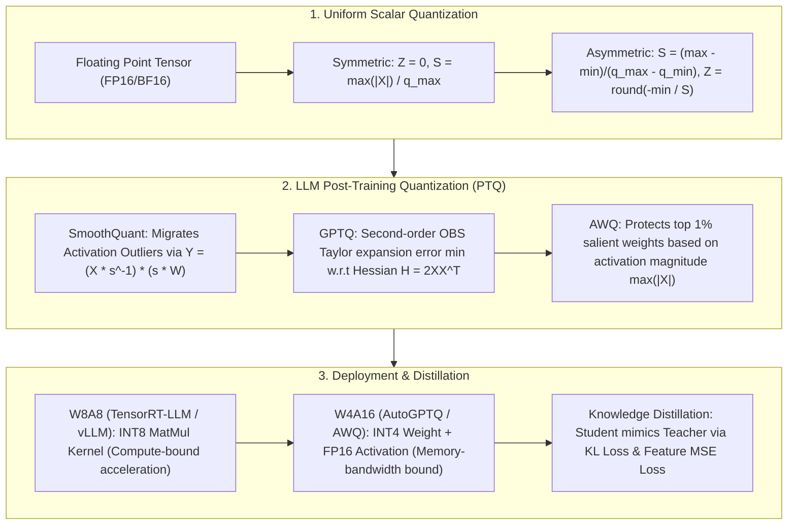

# 🌐 LLM Quantization & Model Compression: INT8/INT4 Mapping, SmoothQuant Outliers, GPTQ Hessian & AWQ/Distillation

> **Core Executive Summary**: As LLM parameter counts scale into tens to hundreds of billions, FP16/BF16 VRAM consumption and memory bandwidth become severe latency bottlenecks. **Model Quantization** maps continuous high-precision floating-point numbers into low-precision integers (INT8, INT4), slashing VRAM footprint by 50%~75% while boosting throughput. This guide dissects asymmetric and symmetric quantization math, **SmoothQuant** outlier migration, **GPTQ** second-order Hessian matrix column compensation, **AWQ** 1% salient weight protection, and **Knowledge Distillation** techniques.

---

## 💡 Interactive Mermaid Architecture Flowchart



---

## 💡 Classic Interview Followups & Core Cheatsheet

* **Key Topic 1**: Derive the mathematical Scale and Zero-Point formulas for Asymmetric vs Symmetric Uniform Quantization.
  * *Standard Answer*:
    1. **Asymmetric Quantization**: Maps $[x_{\text{min}}, x_{\text{max}}]$ to $[q_{\text{min}}, q_{\text{max}}]$.
       * **Scale $S$**: $S = \frac{x_{\text{max}} - x_{\text{min}}}{q_{\text{max}} - q_{\text{min}}}$
       * **Zero-Point $Z$**: $Z = \text{round}\left( \frac{-x_{\text{min}}}{S} \right) + q_{\text{min}}$
       * **Quantization & Dequantization**: $x_q = \text{clip}\left( \left\lfloor \frac{x}{S} \right\rceil + Z, q_{\text{min}}, q_{\text{max}} \right)$, $\hat{x} = S \cdot (x_q - Z)$
    2. **Symmetric Quantization**: Forces Zero-Point $Z = 0$, mapping $[-x_{\text{max}}, x_{\text{max}}]$ to $[-q_{\text{max}}, q_{\text{max}}]$.
       * **Scale $S$**: $S = \frac{\max(|x_{\text{min}}|, |x_{\text{max}}|)}{q_{\text{max}}}$
       * **Quantization & Dequantization**: $x_q = \text{clip}\left( \left\lfloor \frac{x}{S} \right\rceil, -q_{\text{max}}, q_{\text{max}} \right)$, $\hat{x} = S \cdot x_q$

  * *30-second Oral Answer*: "Conclusion: quantization is mapping a float range onto integer grid points with a ruler — Scale sets the grid width, Zero-Point anchors where real 0 lands. Why: asymmetric quantization fits the tensor's actual min/max, which suits skewed distributions like ReLU-activated weights, but needs an extra subtract-Z operation; symmetric quantization forces Z=0 and saves that step, so it is faster on hardware. Example: mapping [0.0, 10.0] to INT8 [0,255] gives S=10/255≈0.039; the same data symmetrically gives S=max(|x|)/127≈0.079 with grid cells twice as coarse — asymmetric is more accurate, symmetric is faster, that is the entire tradeoff."

* **Key Topic 2**: Why do activation outliers break standard INT8 activation quantization in LLMs? What is the SmoothQuant diagonal scaling formula?
  * *Standard Answer*:
    * **Outlier Problem**: LLMs exceeding 6.7B parameters exhibit systematic **activation outliers** (up to 100x larger in magnitude, concentrated in specific channels). Standard per-tensor INT8 quantization forces the scale $S$ to inflate, crushing 99%+ normal features into tiny discrete bins.
    * **SmoothQuant Solution**: Uses associative property $Y = X W = (X \cdot \text{diag}(s)^{-1}) \cdot (\text{diag}(s) \cdot W)$ to migrate activation quantization difficulty to weights.
    * **Diagonal Factor Formula**: $s_j = \frac{\max(|X_j|)^\alpha}{\max(|W_j|)^{1-\alpha}}$ with $\alpha \in [0, 1]$ (typically $\alpha = 0.5$).

  * *30-second Oral Answer*: "Conclusion: a few activation channels hold values 100x larger than normal features, inflating the INT8 scale and crushing everything else into a few bins; SmoothQuant migrates the outliers onto the weights with a diagonal scaling matrix, then quantizes. Why: associativity gives XW=(X·s⁻¹)(s·W) — activations divided by s shrink, weights multiplied by s grow, and both become easy to quantize because weight distributions are uniform; the factor s_j = max|X_j|^α / max|W_j|^(1-α) with α controlling which side absorbs the difficulty. Example: a channel with activation max 100 and weight max 0.1, α=0.5, gives s=√(100/0.1)≈31.6 — activations divided by 31.6 lose the outlier, and INT8 accuracy recovers from collapse."

* **Key Topic 3**: Derive the GPTQ weight update compensation formula based on the second-order Hessian matrix ($H = 2XX^T$) in Optimal Brain Surgeon (OBS).
  * *Standard Answer*:
    1. **Second-Order Expansion**: Minimizes output error $E = \|W X - W_q X\|_2^2$. Expanding around $W$ with $\nabla E = 0$ yields $E(W + \delta W) \approx E(W) + \frac{1}{2} \delta W^T H \delta W$, where Hessian $H = 2 X X^T$.
    2. **OBS Compensation**: When quantizing column $q$ with error $\delta w_q = w_{q, \text{quant}} - w_q$, remaining unquantized weights update via:
       $$\delta W = - \frac{w_{q, \text{quant}} - w_q}{[H^{-1}]_{qq}} H^{-1}_{:, q}$$
    3. **GPTQ Acceleration**: Uses Cholesky decomposition inverse and Block Lazy Updates to reduce complexity from $O(d^3)$, quantizing 175B LLMs in hours.

  * *30-second Oral Answer*: "Conclusion: GPTQ uses a second-order Hessian to measure how much quantizing one weight hurts the whole model, then lets other weights compensate for its error, column by column. Why: the objective is output error ||WX−W_qX||²; after a second-order expansion the Hessian H=2XXᵀ encodes how weights are coupled; the OBS formula δW = −(w_q−w)/[H⁻¹]_qq · H⁻¹_:,q literally says 'the mistake you make is carried by the columns most coupled to you'. Example: when quantizing column q, a small [H⁻¹]_qq means high sensitivity and a larger compensation; Cholesky inversion plus block lazy updates cut complexity from O(d³), so a 175B model gets INT4 weights in hours — this is what AutoGPTQ runs under the hood."

* **Key Topic 4**: How does AWQ identify the top 1% salient weights? Why is it more efficient than full fine-tuning?
  * *Standard Answer*:
    * AWQ observes that weights corresponding to channels with large activation magnitude $\max(|X|)$ are critical.
    * Instead of backprop, AWQ protects them by per-channel scaling $W' = W \odot \text{diag}(s)$ ($s > 1$). Protecting only 1% of weights retains model accuracy without full retraining.

  * *30-second Oral Answer*: "Conclusion: AWQ identifies the weight columns of the top-1% channels by activation magnitude and protects only those, with no backprop. Why: not all weights matter equally — importance is determined by the activations feeding them, because errors in weights on high-activation channels get amplified; AWQ multiplies those critical columns by a scale s>1 to reduce their relative rounding error in INT4, then folds the scale back into the FP16 scale so the math stays exact. Example: protecting just ~1% of weight columns keeps 7B models near-FP16 accuracy at INT4; versus QAT which retrains the whole model, AWQ needs only a few minutes of calibration data — the '1% leverage' is its core insight."

* **Key Topic 5**: Compare hardware deployment bottlenecks across W8A8, W4A16, and W4A4.
  * *Standard Answer*:
    * **W4A16**: Memory-Bandwidth Bound (Decode phase). Slashes VRAM transfer overhead from HBM to SRAM by 75%, boosting decode token generation by 2~3x.
    * **W8A8**: Compute-Bound (Prefill phase / Large batch). Leverages INT8 Tensor Core GEMM operators for 2x TFLOPS throughput.
    * **W4A4**: Extreme edge/NPU deployment, requiring QAT to prevent accuracy collapse.

  * *30-second Oral Answer*: "Conclusion: decoding is bandwidth-bound so W4A16 wins (weights 75% smaller), prefill is compute-bound so W8A8 wins (INT8 Tensor Cores double the FLOPs), and W4A4 is the extreme edge-device option. Why: every autoregressive step must stream all weights from HBM into SRAM, so weight size directly sets decode speed; prefill is one big GEMM, so FLOPs are the bottleneck and INT8 mma.sync instructions double effective throughput; W4A4 also cuts activations to 4 bits, which collapses accuracy without QAT support. Example: a 7B model needs 14GB in FP16 but only 3.5GB in INT4, fitting an 8GB consumer GPU; on the same card, W8A8 prefill throughput is about 2x FP16 — so pick the format by the phase."

---

## 📚 Section 1: Quantization Methods Comparison Matrix

| Quantization Algorithm | Type | Weights/Act | Calibration Required | Key Principle | Target Deployment |
| :--- | :--- | :--- | :--- | :--- | :--- |
| **Absmax / Zero-Point**| Uniform Scalar | W8A8 / W4A16 | No | Linear mapping $S, Z$ | General baseline |
| **SmoothQuant** | PTQ | **W8A8** | Yes | Outlier smoothing $s_j = \frac{\max(|X_j|)^\alpha}{\max(|W_j|)^{1-\alpha}}$ | High-concurrency Serve |
| **GPTQ** | PTQ | **W4A16 / W3A16** | Yes | Second-order Hessian $H^{-1}$ OBS update | Single GPU VRAM-limited |
| **AWQ** | PTQ | **W4A16 / W3A16** | Yes | Protects top 1% salient weights | Fast Decode / vLLM |
| **QLoRA (NF4)** | Quant/PEFT | W4A16 (NF4) | No (In training) | Quantile quantization + Double Quant | Low VRAM Fine-tuning |
| **Knowledge Distillation** | Model Comp | Any | Yes (Full data) | $T^2 \cdot D_{\text{KL}}(P_{\text{teacher}}^T \parallel P_{\text{student}}^T)$ | Model size reduction (70B->8B) |

How to read this table: column 3 (bits) decides "how much is saved" — W8A8 halves VRAM, W4A16 cuts 75%; column 4 (calibration data) is the dividing line between naive quantization and PTQ, a favorite interview contrast.

> 💡 **Intuition**: Think of the quantization family in three camps: the baseline camp (Absmax/Zero-Point, no data, direct math), the PTQ camp (SmoothQuant/GPTQ/AWQ, small calibration set, surgical fixes, no training), and the PEFT camp (QLoRA merging quantization with fine-tuning). One-liner to memorize: 'naive quantization needs no data, GPTQ/AWQ need data but no gradients, QLoRA needs gradients'.
>
> 🎤 **Interview Answer**: "Conclusion: three selection rules — single-GPU/edge decoding uses W4A16 (AWQ/GPTQ), high-concurrency serving prefill uses W8A8 (SmoothQuant), low-VRAM fine-tuning uses QLoRA NF4. Why: decode is bandwidth-limited so shrink the weights, prefill is compute-limited so use INT8 Tensor Cores, fine-tuning must keep gradients so NF4 with double quantization. Example: a 70B model needs 140GB in FP16 but only 35GB at W4A16 — one 48GB GPU is enough; distillation instead compresses a 70B teacher into an 8B student, with the T² factor keeping gradient scales stable."

---

## ⚡ Section 2: Mathematical Formulas & Distillation Losses

Response-based Distillation loss with temperature $T$: first, why 'heating' is needed — a Teacher's output probabilities are usually overconfident (e.g. [0.99, 0.01]), so a student learns nothing from hard labels; dividing the logits by $T$ before softmax softens the distribution to something like [0.7, 0.3] that reveals the Teacher's 'thinking tendencies' — which wrong answer is closer to right. The total loss is the cross-entropy on true labels plus a temperature-weighted KL divergence between Teacher and Student.
$$\mathcal{L}_{\text{KD}} = (1 - \gamma) \mathcal{L}_{\text{CE}}(y, P_{\text{student}}) + \gamma T^2 \cdot D_{\text{KL}}\left( P_{\text{teacher}}^T \parallel P_{\text{student}}^T \right)$$

> 💡 **Intuition**: Temperature is an information amplifier: high $T$ lets the Teacher's runner-up answers leak through (e.g. which of the near-misses it found closest), so the student learns "why the teacher errs"; the $T^2$ factor is the accounting correction — softmax's gradient with respect to logits carries a $1/T$, and multiplying by $T^2$ keeps gradient magnitudes stable as $T$ changes. Feature KD is the same idea on steroids: the student's intermediate representations align directly with the teacher's.
>
> 🎤 **Interview Answer**: "Conclusion: distillation trains the student on both the true labels and the Teacher's softened probabilities; higher T carries more information and T² keeps the gradient scale stable. Why: hard labels only say right or wrong, while the softened distribution says 'which wrong answer is closer' — that is where the knowledge lives; the T² weighting cancels the 1/T in the softmax gradient. Example: distilling a 70B teacher into an 8B student typically uses T=2-4; the same 8B architecture trained by distillation beats training from scratch by ~10-15% on math/code — the most common model-compression tool in practice."

---

## 🐍 Section 3: Pure Numpy Handwritten Quantizer & SmoothQuant Operator

The code below demonstrates two threads: `pure_numpy_asymmetric_quantize` walks the full Scale/Zero-Point/quantize/dequantize loop; `pure_numpy_smoothquant_scale` reproduces SmoothQuant's diagonal factor — the test deliberately amplifies channel 5 by 100x to inject an outlier and shows how its smoothing factor compares with a normal channel.

```python
import numpy as np

def pure_numpy_asymmetric_quantize(x: np.ndarray, bits: int = 8) -> tuple[np.ndarray, float, int]:
    qmin = 0
    qmax = (1 << bits) - 1
    xmin, xmax = float(np.min(x)), float(np.max(x))
    scale = (xmax - xmin) / float(qmax - qmin)
    if scale == 0:
        scale = 1.0
    zero_point = int(np.round(-xmin / scale)) + qmin
    zero_point = int(np.clip(zero_point, qmin, qmax))
    x_q = np.clip(np.round(x / scale) + zero_point, qmin, qmax).astype(np.uint8)
    return x_q, scale, zero_point

def pure_numpy_dequantize(x_q: np.ndarray, scale: float, zero_point: int) -> np.ndarray:
    return (x_q.astype(np.float32) - zero_point) * scale

def pure_numpy_smoothquant_scale(X: np.ndarray, W: np.ndarray, alpha: float = 0.5) -> np.ndarray:
    max_act_per_channel = np.max(np.abs(X), axis=0)
    max_weight_per_channel = np.max(np.abs(W), axis=0)
    s = (max_act_per_channel ** alpha) / (np.maximum(max_weight_per_channel, 1e-5) ** (1 - alpha))
    return s

if __name__ == "__main__":
    np.random.seed(42)
    data = np.random.randn(4, 8) * 10.0
    q_data, scale, zp = pure_numpy_asymmetric_quantize(data, bits=8)
    deq_data = pure_numpy_dequantize(q_data, scale, zp)
    max_error = np.max(np.abs(data - deq_data))
    print("1. INT8 Quantization Complete!")
    print(f"   Scale: {scale:.6f}, Zero-Point: {zp}, Max Error: {max_error:.6f}")
    
    X_dummy = np.random.randn(32, 64)
    X_dummy[:, 5] *= 100.0
    W_dummy = np.random.randn(128, 64)
    s_factors = pure_numpy_smoothquant_scale(X_dummy, W_dummy, alpha=0.5)
    print("\n2. SmoothQuant Scale Computation Complete!")
    print(f"   Outlier Channel 5 Scale: {s_factors[5]:.4f} (Normal Channel 0: {s_factors[0]:.4f})")
```

> 💡 **Intuition**: Details worth noticing in the code: dequantization `(x_q - zero_point) * scale` mirrors the formula one-to-one; `np.clip` prevents overflow and `np.round` rounds to nearest; `np.maximum(max_weight, 1e-5)` is division-by-zero protection in SmoothQuant. The test deliberately creates an outlier channel: s[5] clearly exceeds s[0], showing channel 5 is being "specially handled" — visible evidence of outlier smoothing.
>
> 🎤 **Interview Answer**: "Conclusion: handwritten quantization is three lines — compute scale, compute zero_point, clip+round; SmoothQuant is one line — s_j = max|X_j|^α / max|W_j|^(1-α). Why: scale is the ruler from float range to integer range, zero_point anchors real 0 precisely; the smoothing factor divides activation outliers per channel and multiplies the weights, making both easy to quantize. Example: after channel 5 is amplified 100x, s[5]≈31.6×s[0] at α=0.5, and dividing the activations erases the outlier — naive INT8 activation quantization would collapse; smoothed, it recovers."

---

## 🚀 Key Takeaways & Best Practices

1. **Single GPU Decode / Edge Deployment**: Use **AWQ** or **GPTQ (INT4/W4A16)** to minimize HBM memory bandwidth bottleneck and boost decode speed.
2. **High Concurrency Serving**: Use **SmoothQuant (INT8/W8A8)** to trigger Tensor Core INT8 matrix multiplication for maximum throughput.
3. **Avoid Common Pitfalls**: Never apply standard INT8 activation quantization without SmoothQuant outlier migration, or activation outliers will crash model perplexity.