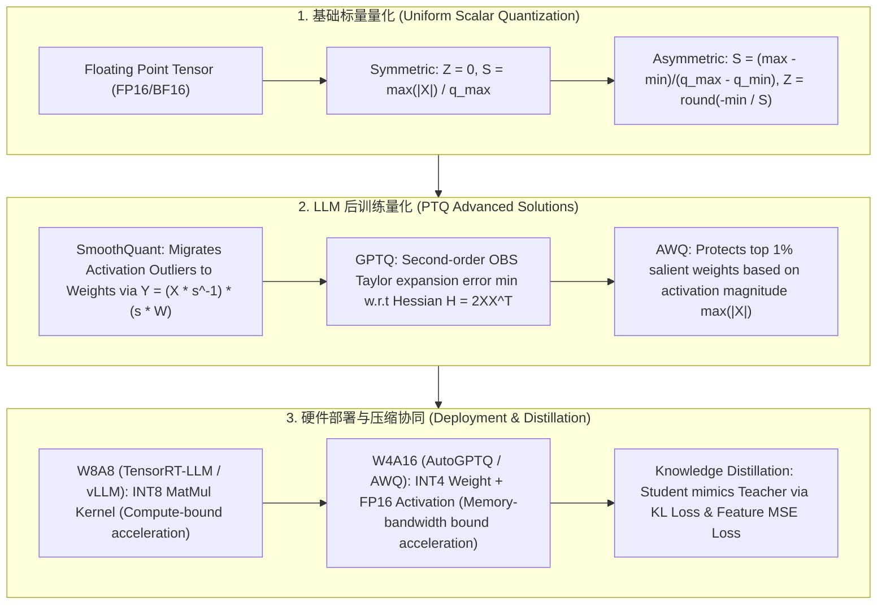

# 🌐 大模型量化与模型压缩全景：INT8/INT4 映射、SmoothQuant 异常值平滑、GPTQ 二阶 Hessian 优化与 AWQ/知识蒸馏剖析

> **核心摘要**：随着大语言模型 (LLM) 参数量达到百亿至千亿级，全精度 FP16/BF16 模型的显存占用与访存带宽成为实时低延迟推理的致命瓶颈。**模型量化 (Quantization)** 技术通过将连续高精度浮点数映射为低精度整数（如 INT8、INT4），在显存占用缩减 50%~75% 的同时实现显着的吞吐量提升。本指南系统剖析非对称与对称量化数学映射、**SmoothQuant** 激活值异常值平滑机制、**GPTQ** 基于二阶 Hessian 逆矩阵的逐列最优补偿、**AWQ** 1% 关键激活感知量化，以及**知识蒸馏 (Knowledge Distillation)** 等模型压缩前沿技术。

---

## 💡 交互式 Mermaid 架构流程图



---

## 💡 经典面试追问与考点速查

* **考点 1**：详细推导非对称量化 (Asymmetric Quantization) 与对称量化 (Symmetric Quantization) 的 Scale 与 Zero-Point 计算公式？
  * *标准回答*：
    1. **非对称量化 (Asymmetric Uniform Quantization)**：将实数区间 $[x_{\text{min}}, x_{\text{max}}]$ 映射到整数区间 $[q_{\text{min}}, q_{\text{max}}]$（如 INT8 范围 $[-128, 127]$ 或 $[0, 255]$）。
       * **Scale 缩放因子 $S$**：
         $$S = \frac{x_{\text{max}} - x_{\text{min}}}{q_{\text{max}} - q_{\text{min}}}$$
       * **Zero-Point 零点 $Z$**（确保实数 $0$ 精确映射为整数 $Z$）：
         $$Z = \text{round}\left( \frac{-x_{\text{min}}}{S} \right) + q_{\text{min}}$$
       * **量化与反量化公式**：
         $$x_q = \text{clip}\left( \left\lfloor \frac{x}{S} \right\rceil + Z, q_{\text{min}}, q_{\text{max}} \right), \quad \hat{x} = S \cdot (x_q - Z)$$
    2. **对称量化 (Symmetric Uniform Quantization)**：强制设置 Zero-Point $Z = 0$，将对称区间 $[-x_{\text{max}}, x_{\text{max}}]$ 映射到整数区间 $[-q_{\text{max}}, q_{\text{max}}]$（如 INT8 范围 $[-127, 127]$）。
       * **Scale 缩放因子 $S$**：
         $$S = \frac{\max(|x_{\text{min}}|, |x_{\text{max}}|)}{q_{\text{max}}}$$
       * **量化与反量化公式**（无 $Z$ 偏移，矩阵乘法效率显著更高）：
         $$x_q = \text{clip}\left( \left\lfloor \frac{x}{S} \right\rceil, -q_{\text{max}}, q_{\text{max}} \right), \quad \hat{x} = S \cdot x_q$$

  * *面试速答 (30 秒口述版)*: "结论: 量化就是'按比例尺把浮点区间映射到整数格子',关键两个参数——Scale 决定格子多宽,Zero-Point 决定实数 0 落在哪个格子。原理: 非对称量化用 min/max 定区间,适合分布不对称的权重(如 ReLU 后全正的激活),但多一步减 Z 的运算;对称量化强制 Z=0,矩阵乘法少一个偏移项,硬件更快。例子: 数据在 [0.0, 10.0] 映射到 INT8 [0,255] 时 S=10/255≈0.039;同样的数据对称量化 S=max(|x|)/127≈0.079,格子粗一倍——非对称更准、对称更快,这就是两者的全部权衡。"

* **考点 2**：LLM 激活值异常值 (Outliers) 为何会导致传统 INT8 激活量化精度崩溃？SmoothQuant 的对角平滑缩放公式是怎样的？
  * *标准回答*：
    * **激活值异常值痛点**：在百亿级以上 LLM 中，通道维度上会出现系统性的**强激活异常值 (Activation Outliers)**（值比普通特征大 100 倍以上，但高度集中在某些固定通道中）。若对激活值做 Tensor-wise 或 Token-wise INT8 量化，巨大的异常值会导致 Scale $S$ 极度放大，使 99% 以上的正常特征值被压缩重叠到同一离散区间（量化阶步过粗），导致模型输出 Perplexity 彻底崩溃！
    * **SmoothQuant 解决数学原理**：利用矩阵乘法的结合律 $Y = X W = (X \cdot \text{diag}(s)^{-1}) \cdot (\text{diag}(s) \cdot W)$，将激活值 $X$ 中难以量化的异常值按通道进行平滑缩小，同时将难度转移给权重 $W$（因为权重 $W$ 的分布极度均匀，更容易量化）。
    * **对角平滑缩放因子公式**：第 $j$ 个通道的平滑因子 $s_j$ 计算公式为：
      $$s_j = \frac{\max(|X_j|)^\alpha}{\max(|W_j|)^{1-\alpha}}$$
      其中 $\max(|X_j|)$ 为输入激活在第 $j$ 通道上的最大绝对值，$\max(|W_j|)$ 为权重第 $j$ 列的最大绝对值。超参数 $\alpha \in [0, 1]$ 调节激活与权重的难度迁移平衡（推荐设定 $\alpha = 0.5$）。

  * *面试速答 (30 秒口述版)*: "结论: 激活里少数通道的值比普通特征大 100 倍,INT8 量化的 scale 被异常值撑爆,普通值全挤进几个格子;SmoothQuant 用对角矩阵把异常值'分摊'给权重再量化。原理: 利用结合律 XW=(X·s⁻¹)(s·W)——激活除以 s 变小、权重乘 s 变大,两边都变得好量化;平滑因子 s_j = max(|X_j|)^α / max(|W_j|)^(1-α),α 决定难度往哪边移,权重分布均匀所以能扛。例子: 某通道激活最大 100、权重最大 0.1,α=0.5 时 s=√(100/0.1)≈31.6,激活除以 31.6 后异常值变 ~3,INT8 精度从崩溃恢复;这是 W8A8 服务端方案的核心。"

* **考点 3**：推导 GPTQ 算法基于 Optimal Brain Surgeon (OBS) 的二阶 Hessian 矩阵 ($H = 2XX^T$) 权重更新补偿公式？
  * *标准回答*：
    1. **二阶泰勒展开目标**：GPTQ 旨在最小化量化后权重 $W_q$ 与原始权重 $W$ 在输入激活 $X$ 下的平方输出误差 $E = \|W X - W_q X\|_2^2$。对误差在 $W$ 处进行二阶泰勒展开：
       $$E(W + \delta W) \approx E(W) + \nabla E^T \delta W + \frac{1}{2} \delta W^T H \delta W$$
       由于在局部极小点梯度 $\nabla E = 0$，Hessian 矩阵为 $H = 2 X X^T$。
    2. **OBS (Optimal Brain Surgeon) 最优补偿**：当固定第 $q$ 个权重 $w_q$ 被量化为 $w_{q, \text{quant}}$ 时，其量化误差为 $\delta w_q = w_{q, \text{quant}} - w_q$。为使总体平方误差增量最小化，其余尚未量化的权重必须进行联合补偿更新。利用拉格朗日乘子法求解带约束的二阶优化，导出其余权重的**最优补偿更新向量**：
       $$\delta W = - \frac{w_{q, \text{quant}} - w_q}{[H^{-1}]_{qq}} H^{-1}_{:, q}$$
       其中 $H^{-1}_{:, q}$ 表示 Hessian 逆矩阵的第 $q$ 列，$[H^{-1}]_{qq}$ 表示对角元素。
    3. **GPTQ 块级/延迟批处理加速**：GPTQ 引入 Cholesky 分解求逆与 Block Lazy Updates，将算法复杂度从 $O(d^3)$ 暴降，使得 175B 大模型能在数小时内完成高质量 INT4 量化。

  * *面试速答 (30 秒口述版)*: "结论: GPTQ 用二阶 Hessian 衡量'量化某个权重会害全模型多少',然后让其他权重补偿它的错误,逐列量化。原理: 目标是最小化量化后输出误差 ||WX−W_qX||²,二阶泰勒展开后 Hessian H=2XXᵀ 编码了权重之间的耦合;OBS 公式 δW = −(w_q−w)/[H⁻¹]_qq · H⁻¹_:,q 的意思是'你犯的错,由和你耦合最深的列来背'。例子: 量化第 q 列时,[H⁻¹]_qq 越小(该列越敏感)补偿越大;用 Cholesky 求逆 + 分块延迟更新把复杂度从 O(d³) 降下来,175B 模型几小时就能出 INT4——这也是 AutoGPTQ 的底层算法。"

* **考点 4**：AWQ (Activation-aware Weight Quantization) 如何定位仅占 1% 的关键显著权重？为什么它比全量微调更高效？
  * *Standard Answer*：
    * **关键显著权重定位 (Salient Weights Identification)**：AWQ 发现，并非所有权重对模型输出都同等重要。通过观察输入激活值 $X$ 的平均绝对幅值，只有在**输入激活幅值最大 $(\max(|X|))$ 的前 1% 通道上对应的权重列**，才是决定模型推理能力的**关键显著权重**。
    * **保护与优化机制**：AWQ 并不需要像 QAT 那样进行昂贵的反向传播训练，而是通过缩放保护：
      $$W' = W \odot \text{diag}(s)$$
      对这 1% 的关键列乘上放因子 $s > 1$（如 $s = \mathbf{S}_X^\gamma$），降低其在后续 INT4 量化中的相对舍入误差。由于仅保护 1% 参数且无需反向梯度更新，AWQ 能够在极其轻量的耗时下保持甚至超越全量微调（QAT）的精度！

  * *面试速答 (30 秒口述版)*: "结论: AWQ 找到'激活幅值最大的前 1% 通道对应的权重列',只保护它们,不做反向传播。原理: 不是所有权重都重要——权重的重要性由喂给它的激活决定,激活大的通道对应的权重误差会被放大;AWQ 给这些关键列乘一个 s>1 的缩放,降低它们在 INT4 里的相对舍入误差,并把缩放吸收进 FP16 scale,精度不变。例子: 7B 模型只需保护约 1% 的权重列,INT4 精度就能接近 FP16;对比 QAT 要重训一遍模型,AWQ 只要少量校准数据算几分钟——'1% 的杠杆'是它的核心洞察。"

* **考点 5**：对比 W8A8、W4A16 与 W4A4 在推理硬件部署时的性能瓶颈（Memory-Bandwidth Bound vs Compute-Bound）？
  * *标准回答*：
    * **W4A16 (如 AWQ / AutoGPTQ / ExLlamaV2)**：权重为 INT4，激活值为 FP16。在 LLM 自回归 Decode 阶段（Batch Size 较小），主要瓶颈是 **GPU 显存带宽 (Memory-Bandwidth Bound)**。W4A16 将显存权重体积压低 75%，极大地减少了从 HBM 显存搬运权重到 SRAM 的开销，使 Decode 速度提升 2~3 倍；
    * **W8A8 (如 SmoothQuant / TensorRT-LLM INT8)**：权重与激活均为 INT8。在 Prefill 阶段或大 Batch Size 场景下，主要瓶颈是 **GPU 算力瓶颈 (Compute-Bound)**。W8A8 可直接调用 NVIDIA Tensor Core 的 INT8 硬件矩阵乘法算子（如 `mma.sync`），使得算力 TFLOPS 翻倍，提升高并发吞吐；
    * **W4A4 (极端超低比特)**：权重与激活均为 INT4。能够在极其受限的边缘设备（手机/NPU）上运行，但激活值的 INT4 强切会导致严重的精度损失，目前尚需 QAT 训练支持。

  * *面试速答 (30 秒口述版)*: "结论: Decode 阶段是带宽瓶颈所以 W4A16 快(权重小 75%),Prefill 阶段是算力瓶颈所以 W8A8 快(INT8 Tensor Core 算力翻倍),W4A4 是边缘设备的极端方案。原理: 自回归每步都要把全部权重从 HBM 搬进 SRAM,权重体积直接决定 decode 速度;而 Prefill 是大矩阵乘,瓶颈在 FLOPs,INT8 的 mma.sync 指令把有效算力翻倍;W4A4 连激活也砍到 4bit,精度崩得厉害,得靠 QAT 撑着。例子: 7B FP16 权重 14GB,INT4 只要 3.5GB,8GB 显卡就能本地跑;同一张卡 W8A8 的 prefill 吞吐约为 FP16 的 2 倍——这就是'先看阶段再选格式'。"

---

## 📚 第一章：量化与模型压缩全景对比矩阵

### 1.1 主流量化算法特性矩阵

| 量化算法 | 类型 | 量化比特 (Weight/Act) | 是否需要校准集 (Calibration Data) | 核心算法原理 | 适用硬件部署场景 |
| :--- | :--- | :--- | :--- | :--- | :--- |
| **Absmax / Zero-Point**| 基础 Uniform | W8A8 / W4A16 | 否 | 线性标量映射 $S, Z$ | 通用基础算子 |
| **SmoothQuant** | PTQ | **W8A8** | 是 (少量 Prompt) | 异常值平滑 $s_j = \frac{\max(|X_j|)^\alpha}{\max(|W_j|)^{1-\alpha}}$ | 高并发 Serve / TensorRT-LLM |
| **GPTQ** | PTQ | **W4A16 / W3A16** | 是 (128 个样本) | Hessian 逆 $\mathbf{H}^{-1}$ OBS 逐列补算 | 单卡显存受限 / AutoGPTQ |
| **AWQ** | PTQ | **W4A16 / W3A16** | 是 (少量样本) | 1% 激活感知显著权重防护 | Edge/vLLM 高速 Decode |
| **QLoRA (NF4)** | PEFT/Quant | W4A16 (NF4) | 否 (在训练中) | 分位数非均匀量化 + 双重量化 | 低显存微调训练 |
| **Response KD** | 知识蒸馏 | 任意架构 | 是 (全量数据) | $T^2 \cdot D_{\text{KL}}(P_{\text{teacher}}^T \parallel P_{\text{student}}^T)$ | 模型结构压缩 (70B \to 8B) |

读表技巧: 第三列(比特配置)决定"省多少"——W8A8 省一半显存、W4A16 省 75%;第四列(是否要校准集)是朴素量化和 PTQ 的分水岭,也是面试对比常考点。

> 💡 **直观理解**: 量化家族分三类: 基础派(Absmax/Zero-Point,无数据直接算)、PTQ 派(SmoothQuant/GPTQ/AWQ,用少量校准数据做外科手术)、PEFT 派(QLoRA 把量化和微调合体)。一句话记忆: '朴素量化无数据,GPTQ/AWQ 有数据无梯度,QLoRA 有梯度'。
>
> 🎤 **面试速答**: "结论: 选型三原则——单卡/端侧 Decode 用 W4A16(AWQ/GPTQ),高并发服务端 Prefill 用 W8A8(SmoothQuant),低显存微调用 QLoRA NF4。原理: Decode 带宽受限所以压权重体积,Prefill 算力受限所以上 INT8 Tensor Core,微调要保留梯度所以 NF4 + 双重量化。例子: 70B FP16 要 140GB 显存,W4A16 只要 35GB,单张 48GB 卡就能跑;蒸馏则把 70B 老师压成 8B 学生,温度 T² 是保梯度量纲的关键系数。"

---

## ⚡ 第二章：量化映射与 SmoothQuant/GPTQ 数学推导

### 2.1 知识蒸馏 (Knowledge Distillation) 损失函数推导

先解释为什么蒸馏要"加热": Teacher 的输出概率往往太自信(如 [0.99, 0.01]),学生只学 hard label 什么都学不到;用温度 $T$ 把 logits 除以 $T$ 再 softmax,概率变软成 [0.7, 0.3] 这种分布,里面才藏着 Teacher 的"思考倾向"——哪个次优答案更接近正确答案。蒸馏总损失 = 真实标签的交叉熵 + 加权后的 Teacher-Student KL 散度。

在响应级蒸馏 (Response-based Distillation) 中，Teacher 与 Student 模型在 Temperature $T$ 下的软化概率分布为：
$$P_i^T = \frac{\exp(z_i / T)}{\sum_j \exp(z_j / T)}$$
蒸馏总损失由 Cross-Entropy 真实标签损失与 Soft Targets 散度损失加权组合：
$$\mathcal{L}_{\text{KD}} = (1 - \gamma) \mathcal{L}_{\text{CE}}(y, P_{\text{student}}) + \gamma T^2 \cdot D_{\text{KL}}\left( P_{\text{teacher}}^T \parallel P_{\text{student}}^T \right)$$
其中 $T^2$ 因子用于在前向与反向传播中抵消温度 $T$ 对 Logits 求导时的梯度缩放影响（因为 $\frac{\partial P_i^T}{\partial z_i}$ 带有 $\frac{1}{T}$ 因子）。

> 💡 **直观理解**: 温度是"信息放大器": 高 $T$ 让 Teacher 的次优答案也透露出来(比如它觉得猫和狗之外谁更接近),学生才能学到"老师为什么会错";$T^2$ 因子则是账本校正——softmax 对 logits 的梯度自带 $1/T$,乘 $T^2$ 让梯度量级不随温度漂移。Feature KD 是同一思路的加强版: 让学生的中间层特征直接对齐老师的。
>
> 🎤 **面试速答**: "结论: 蒸馏 = 让学生同时拟合真实标签和 Teacher 的软化概率,高 T 信息更丰富,T² 保证梯度量级稳定。原理: 硬标签只告诉学生对错,软化概率告诉学生'哪个错误答案更接近'——这是知识的主要载体;KL 项用 T² 加权抵消 softmax 梯度里的 1/T。例子: 70B Teacher 蒸馏 8B Student 常用 T=2~4;同样 8B 参数,蒸馏出来的模型在数学/代码上通常比从头训练高 10-15%,这也是模型压缩里最常用的手段。"

---

## 🐍 第三章：Pure Numpy 手写 INT8/INT4 量化器与 SmoothQuant 算子

下面的量化器演示两条主线: `pure_numpy_asymmetric_quantize` 完整走一遍 Scale/Zero-Point/量化/反量化闭环;`pure_numpy_smoothquant_scale` 复现 SmoothQuant 的对角因子计算——测试里故意把第 5 通道放大 100 倍注入异常值,观察它的平滑因子和普通通道差多少。

```python
import numpy as np

def pure_numpy_asymmetric_quantize(x: np.ndarray, bits: int = 8) -> tuple[np.ndarray, float, int]:
    """ Pure Numpy 非对称量化器 """
    qmin = 0
    qmax = (1 << bits) - 1
    xmin, xmax = float(np.min(x)), float(np.max(x))
    
    scale = (xmax - xmin) / float(qmax - qmin)
    if scale == 0:
        scale = 1.0
    zero_point = int(np.round(-xmin / scale)) + qmin
    zero_point = int(np.clip(zero_point, qmin, qmax))
    
    x_q = np.clip(np.round(x / scale) + zero_point, qmin, qmax).astype(np.uint8)
    return x_q, scale, zero_point

def pure_numpy_dequantize(x_q: np.ndarray, scale: float, zero_point: int) -> np.ndarray:
    """ Pure Numpy 反量化器 """
    return (x_q.astype(np.float32) - zero_point) * scale

def pure_numpy_smoothquant_scale(X: np.ndarray, W: np.ndarray, alpha: float = 0.5) -> np.ndarray:
    """
    Pure Numpy 实现 SmoothQuant 对角因子平滑计算
    X shape: [batch_size, num_channels]
    W shape: [out_features, num_channels]
    """
    # 计算通道级最大绝对值
    max_act_per_channel = np.max(np.abs(X), axis=0)  # [num_channels]
    max_weight_per_channel = np.max(np.abs(W), axis=0)  # [num_channels]
    
    # s_j = (max(|X_j|)^alpha) / (max(|W_j|)^(1-alpha))
    s = (max_act_per_channel ** alpha) / (np.maximum(max_weight_per_channel, 1e-5) ** (1 - alpha))
    return s

# ==================== 测试验证 ====================
if __name__ == "__main__":
    np.random.seed(42)
    data = np.random.randn(4, 8) * 10.0
    
    # 1. INT8 量化测试
    q_data, scale, zp = pure_numpy_asymmetric_quantize(data, bits=8)
    deq_data = pure_numpy_dequantize(q_data, scale, zp)
    max_error = np.max(np.abs(data - deq_data))
    print("1. INT8 量化与反量化运行成功！")
    print(f"   Scale: {scale:.6f}, Zero-Point: {zp}, 最大量化保真误差: {max_error:.6f}")
    
    # 2. SmoothQuant 算子测试
    X_dummy = np.random.randn(32, 64)
    X_dummy[:, 5] *= 100.0  # 在第 5 通道注入强异常值 Outlier
    W_dummy = np.random.randn(128, 64)
    
    s_factors = pure_numpy_smoothquant_scale(X_dummy, W_dummy, alpha=0.5)
    print("\n2. SmoothQuant 平滑因子计算完成！")
    print(f"   第 5 通道异常值平滑因子 s[5]: {s_factors[5]:.4f} (对比普通通道 s[0]: {s_factors[0]:.4f})")
```

> 💡 **直观理解**: 代码里值得注意的细节: 反量化 `(x_q - zero_point) * scale` 与公式一一对应;量化时的 `np.clip` 防溢出、`np.round` 四舍五入;SmoothQuant 的 `np.maximum(max_weight, 1e-5)` 是除零保护。测试故意造异常值通道: s[5] 会明显大于 s[0],说明第 5 通道被"重点照顾"——这就是异常值平滑的直观证据。
>
> 🎤 **面试速答**: "结论: 手写量化就三行——算 scale、算 zero_point、clip+round;SmoothQuant 就一行——s_j = max|X_j|^α / max|W_j|^(1-α)。原理: scale 是浮点区间到整数区间的比例尺,zero_point 保证实数 0 在整数域有精确位置;平滑因子把激活异常值按通道'除以大数'、把权重'乘大数',两边都好量化。例子: demo 中第 5 通道放大 100 倍后 s[5]≈31.6×s[0](α=0.5),激活除完异常值消失——直接 INT8 激活量化误差崩盘,平滑后恢复正常。"

---

## 🚀 总结与工程最佳实践

1. **消费级单卡/端侧 Decode 场景首选**：直接采用 **AWQ** 或 **GPTQ (INT4/W4A16)** 量化（配合 AutoGPTQ / vLLM），最大化降低 HBM 显存带宽搬运开销，提升 Decode Token 生成速度；
2. **高并发服务器端吞吐场景首选**：采用 **SmoothQuant (INT8/W8A8)**，结合 TensorRT-LLM 激活高效 INT8 矩阵乘法 Tensor Core 算子，显著提升并发 Capacity；
3. **量化避坑指南**：切忌直接对未平滑的激活值做普通 INT8 量化，必须引入 SmoothQuant 因子平滑，否则异常值通道会导致推理 Perplexity 严重崩溃！