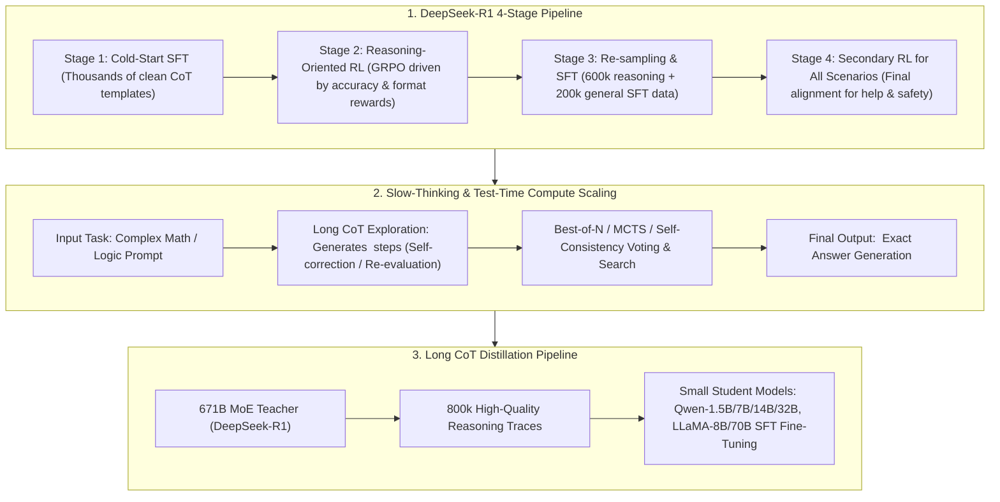

# 🌐 Reasoning LLMs & Slow-Thinking: DeepSeek-R1 Pure RL, Aha Moment, Long CoT Distillation & OpenAI o1/o3

> **Core Executive Summary**: Traditional intuitive generation models (System 1 / Fast Thinking) rely on pattern matching for one-shot answers, suffering from logic gaps in complex math, code, and reasoning. **Reasoning LLMs (System 2 Slow-Thinking)** introduce **Long Chain-of-Thought (CoT)** and **Test-Time Compute Scaling**, empowering models to plan, self-check, backtrack, and reflect. This guide dissects **DeepSeek-R1-Zero** pure RL, **DeepSeek-R1** 4-stage pipeline, **OpenAI o1/o3** test-time scaling laws, long CoT distillation, and **Context Engineering**.

---

## 💡 Interactive Mermaid Architecture Flowchart



---

## 💡 Classic Interview Followups & Core Cheatsheet

* **Key Topic 1**: Detail the emergence of the Aha Moment in DeepSeek-R1-Zero pure RL and why a 4-stage pipeline is needed for language consistency.
  * *Standard Answer*:
    1. **DeepSeek-R1-Zero & The Aha Moment**: Trained via GRPO directly on base model without SFT, using simple **Accuracy Reward** (rule-based evaluation) + **Format Reward** (`<think>` tags). After thousands of steps, the model spontaneously learned the **Aha Moment**—pausing, re-reading questions, and outputting *"Wait, let me re-evaluate this step..."* to backtrack when detecting errors. This proves reasoning and self-correction can emerge purely from RL without SFT labels!
    2. **Why 4-Stage Pipeline in DeepSeek-R1**: R1-Zero suffered from language mixing (switching zh/en mid-thought) and poor readability. R1 solves this via: **Stage 1 Cold-Start SFT** (clean CoT templates); **Stage 2 Reasoning RL**; **Stage 3 Re-sampling & SFT** (600k reasoning + 200k general data); **Stage 4 All-Scenario RL**.

  * *30-second Oral Answer*: "Conclusion: R1-Zero skips SFT entirely and runs GRPO on the base model with only two rewards — answer correctness and format tags — and after thousands of steps spontaneously develops the 'Aha Moment': pausing, re-reading the question, and outputting 'Wait, let me re-evaluate this step' to backtrack. But pure RL outputs are messy — mixed languages and bad formatting — so R1 adds a 4-stage pipeline. Why: rule-based rewards (judge correctness + <think> tags) are the only signal; the group-relative advantage amplifies the gradient of paths that tried self-correction and succeeded, so reflection behavior sticks; cold-start SFT with tens of thousands of clean long-CoT templates fixes language and format. Example: LeetCode judging and LaTeX numeric comparison provide the accuracy reward; the 800k resampled data = 600k reasoning + 200k general to keep the model both strong and general."

* **Key Topic 2**: How does Test-Time Compute Scaling differ fundamentally from Pre-training Scaling Laws in OpenAI o1 and DeepSeek-R1?
  * *Standard Answer*:
    * **Pre-training Scaling Law**: Performance scales with model size $N$ and data $D$ during pre-training.
    * **Test-Time Compute Scaling**: Keeps model weights fixed and spends **more inference FLOPs/time (more reasoning tokens)** to solve harder problems. Scales accuracy exponentially via long CoT generation and search (Best-of-N, MCTS).

  * *30-second Oral Answer*: "Conclusion: pre-training scaling means 'add parameters and data'; test-time scaling means 'weights frozen, spend more inference compute' — more reasoning tokens or more searched paths — to buy accuracy. Why: after pre-training, per-token inference cost is fixed and hard problems stay unsolved; test-time scaling lets the model emit thousands of hidden reasoning tokens on hard problems, or sample N paths in parallel with Best-of-N/MCTS and pick the best — accuracy rises roughly exponentially with inference compute. Example: o1's AIME math scores climb as think-token budgets grow; R1 with long CoT plus majority voting gains another 5-10 points as votes go from 1 to 64 — this is 'buying accuracy with inference compute'."

* **Key Topic 3**: How does GRPO drive models to learn explicit self-correction with only rule-based rewards (accuracy + format)?
  * *Standard Answer*: For a prompt $x$, GRPO samples $G$ responses. If one sample attempts self-checking and hits the right answer ($r=1.0$) while others fail ($r=0.0$), the relative advantage $\hat{A}_i = \frac{r_i - \text{mean}(r)}{\text{std}(r)}$ gives massive positive gradient updates to reflection keywords (*"Wait"*, *"Let me double check"*), driving self-correction emergence.

  * *30-second Oral Answer*: "Conclusion: GRPO never teaches the model how to think — it only rewards right/wrong plus format, and the group-relative advantage selects and amplifies paths that tried self-correction and succeeded. Why: sample G responses per prompt; if one happens to re-examine the question and answers correctly (r=1) while the others fail (r=0), group normalization gives that path the largest advantage A_i=(r_i−mean)/std, so gradients push up the probability of reflection tokens like 'Wait' and 'Let me double check'; after many iterations the reflection behavior is cemented. Example: with G=8 and 7 failures, the winning path's advantage is A=(1−0.125)/0.35≈2.5, far above the group average — that is the RL essence of the 'Aha Moment'."

* **Key Topic 4**: How to distill 800k long CoT reasoning traces from a 671B model into smaller 1.5B-32B models? Why does distillation beat direct RL on small models?
  * *Standard Answer*:
    * **Distillation**: SFT fine-tunes base student models on 800k long CoT traces generated by DeepSeek-R1.
    * **Why Distillation > Direct RL on Small Models**: Small models (1.5B-7B) lack base capacity to spontaneously discover long CoT reasoning in pure RL (sparse rewards). Distilling pre-generated reasoning patterns directly teaches student models *how to think*, transferring 90%+ reasoning performance.

  * *30-second Oral Answer*: "Conclusion: distillation means directly SFT-ing small models on the 800k long-CoT traces the 671B model produced; small models cannot trigger the Aha Moment in pure RL because random exploration is too sparse and rewards are almost never collected. Why: small models lack the base capacity to spontaneously discover correct long chains — GRPO rewards are nearly always zero, so nothing learns; but the 671B traces already encode the 'how to think' prior, and SFT on them simply teaches the student the pattern. Example: R1-Distill-Qwen-7B beats many 70B-class vanilla models on math benchmarks, while the same 7B run with pure RL never develops long chains — 'the big model thinks first, the small model learns' — at an order of magnitude lower cost."

* **Key Topic 5**: How do Context Engineering strategies resolve Context Poisoning and Context Distraction in long-horizon reasoning?
  * *Standard Answer*:
    * **Tool-Result Clearing**: Removes raw tool logs after extracting key structured facts.
    * **Progressive Disclosure**: Dynamically retrieves context just-in-time rather than dumping all documents into 128K context.
    * **State Isolation**: Uses sub-agents to isolate intermediate reasoning sandboxes.

  * *30-second Oral Answer*: "Conclusion: context poisoning is 'errors amplified by attention on every later step', context distraction is 'irrelevant documents diluting the key signal'; Context Engineering counters with three moves — compacted notes, progressive disclosure, and state isolation. Why: if one early reasoning step is wrong, every later attention step keeps looking at that error and it snowballs; stuffing hundreds of pages into a 128K window dilutes softmax weights so the needle vanishes; the fixes are keeping only structured notes after tool calls, JIT-retrieving context on demand, and running intermediate derivation in sub-agent sandboxes. Example: with 1000 pages in a 128K window, needle-in-a-haystack accuracy collapses and recovers after keeping only 3 distilled notes; a 200KB tool log compressed to a 500-word summary keeps the main context clean."

---

## 📚 Section 1: Reasoning LLMs Comparison Matrix

| Architecture | Training Mechanism | CoT Style | Pros | Target Scenario |
| :--- | :--- | :--- | :--- | :--- |
| **DeepSeek-R1-Zero**| Pure RL (GRPO) no SFT | Spontaneous long CoT | Zero human labels, Aha Moment | Academic RL research |
| **DeepSeek-R1** | 4-Stage Pipeline | Structured `<think>` CoT | Rigorous logic, clean formatting | SOTA frontier reasoning |
| **OpenAI o1 / o3** | Test-time scaling | Private hidden CoT | Outperforms dense models on AIME | Proprietary API |
| **R1 Distill (1.5B-32B)**| SFT Long CoT Distillation| Inherited R1 CoT style | Lightweight, single GPU deployable | Local edge inference |
| **PRM Step Supervision**| Step-by-Step RM | Per-step evaluation | Precise credit assignment | High-cost math verifiers |

How to read this table: the first column splits into two arcs — the R1 family (training-mechanism driven) and o1/distillation (inference-time driven); then read the CoT Style column: R1-Zero is spontaneous, R1 is formatted, o1 is private, distillation inherits.

> 💡 **Intuition**: Three schools of reasoning models: R1-Zero is the 'self-taught wild card' (pure RL emergence), R1 is 'trained by masters' (cold start + RL + resampling), o1 is 'use more scratch paper at exam time' (test-time compute), and distillation is 'copy the top student's notes' (long-CoT SFT). The CoT Style column is each school's 'scratch-paper style'.
>
> 🎤 **Interview Answer**: "Conclusion: four reasoning routes — pure RL (R1-Zero, emergent but messy), engineered pipeline (R1, clean 4 stages), inference-time scaling (o1, hidden CoT + search), and distillation (R1-Distill, small models inherit). Why: pure RL emerges reflection from rule rewards but mixes languages; cold-start SFT fixes format; o1 buys accuracy with inference compute; small models cannot self-discover long chains so they copy the big model's traces. Example: R1-Distill-Qwen-32B approaches the 671B R1 on AIME, while o1's reasoning-token cost is an order of magnitude above a normal GPT — accuracy versus cost is your call."

---

## ⚡ Section 2: Rule-Based Reward Verification

Reward function in pure reasoning RL:
$$R(x, y) = R_{\text{accuracy}}(x, y) + \lambda_{\text{format}} \cdot R_{\text{format}}(y)$$

> 💡 **Intuition**: This reward has only two terms yet suffices — accuracy is 'factual right or wrong' (a judge), format is 'format discipline' (<think>/<answer> tags), and $\lambda_{\text{format}}$ weighs the discipline (usually 0.1-0.3). Every training signal in pure RL comes from here — no learned reward model, so it is reproducible and never drifts.
>
> 🎤 **Interview Answer**: "Conclusion: R1's reward = accuracy reward + λ×format reward, both rule-based operators, no RM. Why: accuracy is judged by graders or numeric comparison, format is verified by regex over the closed <think>...</think><answer>...</answer> tags, and λ balances them (about 0.2); the signal is stable, which is why pure RL can converge. Example: 6×7 outputting 42 with full format scores 1.0+0.2=1.2, wrong answer with format scores 0.2, no format and no answer scores 0 — the reward-hacking space is squeezed to near zero."

---

## 🐍 Section 3: Pure Numpy Handwritten R1 Reward Verifier

The verifier below implements R1's two rule-based rewards with regex: `verify_format` checks the <think>/<answer> tag closure (full 1.0, tags only 0.5), `verify_accuracy` extracts the <answer> content and compares it to the target; `compute_rewards` sums accuracy with weight 1 plus format weighted by λ. The three test samples stand for 'perfect, wrong answer, no format'.

```python
import re
import numpy as np

class PureNumpyR1RewardVerifier:
    def __init__(self, format_weight: float = 0.2):
        self.format_weight = format_weight
        
    def verify_format(self, completion: str) -> float:
        pattern = r"^<think>.*?</think>\s*<answer>.*?</answer>$"
        if re.search(pattern, completion, re.DOTALL):
            return 1.0
        elif "<think>" in completion and "</think>" in completion:
            return 0.5
        return 0.0
        
    def verify_accuracy(self, completion: str, target_answer: str) -> float:
        match = re.search(r"<answer>(.*?)</answer>", completion, re.DOTALL)
        if not match:
            return 0.0
        extracted_answer = match.group(1).strip()
        return 1.0 if extracted_answer == target_answer.strip() else 0.0
        
    def compute_rewards(self, completions: list[str], target_answer: str) -> np.ndarray:
        rewards = []
        for c in completions:
            f_score = self.verify_format(c)
            a_score = self.verify_accuracy(c, target_answer)
            rewards.append(a_score + self.format_weight * f_score)
        return np.array(rewards, dtype=np.float32)

if __name__ == "__main__":
    verifier = PureNumpyR1RewardVerifier(format_weight=0.2)
    target = "42"
    sample_completions = [
        "<think>6 * 7 = 42.</think><answer>42</answer>",
        "<think>6 * 7 = 42</think><answer>40</answer>",
    ]
    rewards = verifier.compute_rewards(sample_completions, target)
    print("✅ DeepSeek-R1 Reward Verifier Complete!")
    print("Rewards:", rewards)
```

> 💡 **Intuition**: Note the non-greedy match `re.search(r"<answer>(.*?)</answer>", ...)` — it extracts only the content between the first tag pair; the 0.5 intermediate grade in `verify_format` means 'partial format still earns something', preventing the model from abandoning format entirely. This is the entire supervision signal of pure RL training — simple enough to reproduce exactly.
>
> 🎤 **Interview Answer**: "Conclusion: the R1 verifier is two regexes — one checks format, one checks the answer — combined into a reward. Why: the format reward matches tag closure with a non-greedy regex, the accuracy reward extracts the answer tag and string-compares, total = accuracy + λ×format. Example: the three demo samples score 1.2, 0.2, 0.0 — right format and answer is highest, right format wrong answer half price, no format zero; GRPO drives reflection emergence from exactly this signal."

---

## 🚀 Key Takeaways & Best Practices

1. **Local & Edge Deployment**: Use **DeepSeek-R1 Distill Models (Qwen-1.5B to 32B)** for lightweight slow-thinking capabilities.
2. **RL Training Avoid Pitfalls**: Avoid pure RL on raw base models without SFT; adopt the **DeepSeek 4-stage pipeline** to ensure clean formatting.
3. **Context Engineering**: Implement **Tool-Result Clearing** and **Context Compaction** to prevent context poisoning during long reasoning loops.