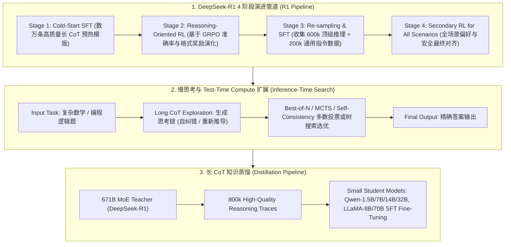

# 🌐 推理大模型与慢思考全景：DeepSeek-R1 纯 RL 自进化、Aha Moment 顿悟、长 CoT 蒸馏与 OpenAI o1/o3 慢思考范式

> **核心摘要**：传统的直觉式生成模型（System 1 / Fast Thinking）倾向于依赖模式匹配单向输出答案，在复杂数学、代码推导与逻辑解密中极易出现逻辑断层。**推理大模型 (Reasoning LLMs / System 2 Slow-Thinking)** 通过引入**长思维链 (Long Chain-of-Thought, CoT)** 与**推理阶段算力扩展 (Test-Time Compute Scaling)**，赋予了模型主动规划、自我校验、回溯重试（Backtracking）与反思的能力。本指南系统剖析 **DeepSeek-R1-Zero** 纯 RL 演化历程、**DeepSeek-R1** 4 阶段工程落地架构、**OpenAI o1/o3** 慢思考扩展定律、长 CoT 数据蒸馏技术，以及解决长推理上下文崩溃的 **Context Engineering** 策略。

---

## 💡 交互式 Mermaid 架构流程图



---

## 💡 经典面试追问与考点速查

* **考点 1**：详细剖析 DeepSeek-R1-Zero 纯 RL 训练中顿悟时刻 (Aha Moment) 的涌现机制，以及为何需要通过 4 阶段 Pipeline 解决语言混杂问题？
  * *标准回答*：
    1. **DeepSeek-R1-Zero 纯 RL 演化与 Aha Moment**：
       DeepSeek-R1-Zero 放弃了任何 SFT 监督微调初始，直接在基座模型上应用 **GRPO 强化学习**。奖赏函数极其简洁：仅仅由 **Accuracy Reward（结果对错：如 LeetCode 判题或 LaTeX 数值比对）** 与 **Format Reward（强制输出 `<think>` 和 `</think>` 标签）** 构成。
       在训练数千 steps 后，模型自发涌现出了令人惊叹的 **Aha Moment（顿悟时刻）**：模型在遇到难题时，学会了主动暂停输出、重新审题、评估先前的解题路线是否正确，并在发现错误后输出 *“Wait, let me re-evaluate this step...”* 强行自我回溯重试！这证明了**复杂的推理逻辑与自我修正能力可以通过强化学习从简单规则奖励中被内生性地打磨触发**。
    2. **为何演化为 DeepSeek-R1 的 4 阶段 Pipeline**：
       R1-Zero 虽然推理能力极强，但存在严重缺陷：思考链中频繁出现**中英文乱跳（Language Mixing）**、格式可读性差以及缺乏通用人设。因此 DeepSeek 团队设计了 4 阶段方案：
       * **Stage 1 冷启动 (Cold-Start)**：注入数万条格式极其优雅的长 CoT 样本做预热 SFT，规避乱码与语言混杂；
       * **Stage 2 推理 RL**：专门强化数学/代码逻辑；
       * **Stage 3 重采样与全量 SFT**：用 Stage 2 训练的模型大规模生成 600k 推理数据并加入 200k 通用任务数据做联合微调；
       * **Stage 4 全场景 RL**：加入人类偏好（Helpfulness & Safety），实现全能对齐。

  * *面试速答 (30 秒口述版)*: "结论: R1-Zero 完全不 SFT,直接在基座上跑 GRPO,只奖励'答案对'和'格式对',几千步后模型自发涌现'等等,让我重算一下'的自我回溯——这就是 Aha Moment;但纯 RL 输出中英混杂、格式乱,所以 R1 加了 4 阶段管道。原理: 规则奖励(判题器对错 + <think> 标签)是唯一信号,组内相对优势把'尝试自我纠错并成功'的路径梯度放大,反思行为被固化;冷启动 SFT 用数万条干净长 CoT 模板规范语言和格式。例子: LeetCode 判题 + LaTeX 数值比对是 accuracy 奖励;800k 重采样数据 = 600k 推理 + 200k 通用,保证模型既强又不失全能。"

* **考点 2**：推理阶段算力扩展定律 (Test-Time Compute Scaling) 与预训练 Scaling Law 有何本质不同？OpenAI o1 / DeepSeek-R1 如何在推理期提升准确率？
  * *标准回答*：
    * **传统 Pre-training Scaling Law**：性能提升依赖于**加大模型参数量 $N$** 与**训练 Data Tokens $D$**（即通过耗费数百万 GPU 时长的预训练获得强模型）。但预训练完成后，对于每一个输入的 Token，推理计算开销是固定的；
    * **Test-Time Compute Scaling (推理阶段算力扩展)**：在模型权重 $N$ 保持冻结的前提下，**通过在推理阶段投入更多的 FLOPs/时间（消耗更多的 Reasoning Tokens）** 线性或指数级提高最终回答的准确率！
    * **实现机制**：
      1. **长 Token 思考链 (Long CoT Generation)**：让模型生成数千乃至数万字隐藏的 `<think>` 推理步骤，赋予模型寻找解题空间的时间；
      2. **搜索算法 (Best-of-N / Beam Search / MCTS)**：在推理期并行采样 $N$ 条思考路径，结合 Process Reward Model (PRM) 或 Verifier 筛选最优回答。

  * *面试速答 (30 秒口述版)*: "结论: 预训练 scaling law 是'加参数加数据',推理期 scaling 是'权重冻结、多花推理算力'——多生成思考 token 或多搜几条路径,换准确率提升。原理: 预训练完成后单次推理算力固定,难题答不对没办法;test-time scaling 让模型在难题上生成几千上万字思考链,或用 Best-of-N/MCTS 并行探索多条路径再选优,准确率随推理算力近似指数提升。例子: o1 在 AIME 竞赛数学上的分数随 think token 增加明显爬升;R1 用长 CoT + 多数投票,同一模型投票数从 1 到 64,准确率还能再涨 5-10 个点——这就是'用推理算力买精度'。"

* **考点 3**：GRPO 如何在仅依赖规则奖励（准确率奖励 + 格式奖励）的条件下驱动模型学会显式自我纠错与长链探索？
  * *标准回答*：在传统 RLHF 中，模型生成一条短回答并获得标量打分，难以分配中间 token 的信用。
  **GRPO 驱动长 CoT 探索的机制**：对于同一 Prompt $x$，GRPO 采样 $G$ 个不同的回答 $\{y_1, \dots, y_G\}$。如果其中某条回答偶然尝试了“重审题目”并成功解答，其结果准确率奖励 $r_{\text{acc}} = 1.0$；而其余未尝试自我纠错的回答可能全错 ($r_{\text{acc}} = 0.0$)。
  组内标准化后的优势 $\hat{A}_i = \frac{r_i - \text{mean}(r)}{\text{std}(r)}$ 会对这条成功尝试了“自我纠错特征”的采样路径给予巨大的正向梯度刺激，使得模型在自回归预测时大幅提升“反思/回溯”关键词（如 *"Wait"*, *"Alternatively"*, *"Let me double check"*) 的概率概率，从而演化出深度的长链思考能力！

  * *面试速答 (30 秒口述版)*: "结论: GRPO 不教模型怎么思考,只给'对错 + 格式'奖励,靠组内相对优势让'尝试自我纠错并成功'的路径被选中、被放大。原理: 同一个 prompt 采样 G 个回答,其中一条偶然重审题目答对了(r=1),其他全错(r=0),组内标准化后这条路径的优势 A_i=(r_i−mean)/std 最大,梯度推高 'Wait'、'Let me double check' 这类反思 token 的概率;多轮迭代后反思行为被固化下来。例子: G=8、7 条全错时,成功路径的优势 A=(1−0.125)/0.35≈2.5,远超组内平均——这就是'顿悟时刻'的强化学习本质。"

* **考点 4**：如何将 671B 庞大推理模型的 800k 长 CoT 思考链高质量蒸馏至 1.5B/7B/14B/32B 小模型？为什么蒸馏比直接 RL 效果更好？
  * *Standard Answer*：
    * **蒸馏流程**：直接使用 Stage 3 中筛选出的 800k 包含顶级 `<think>` 思考过程的合成数据集，对开源开源基座模型（如 Qwen-2.5-Math 或 LLaMA-3）进行标准的 Supervised Fine-Tuning (SFT) 监督微调；
    * **为什么蒸馏比在小模型上直接跑纯 RL 效果更好**：小模型（如 1.5B/7B）由于基础表达能力与知识储备不足，直接跑纯 RL 时极其难以自发触发“Aha Moment”探索出正确的长思维链（即无法从极稀疏的随机探索中获得正向 Reward）；而直接将 671B 强模型探索出的**高质量思维链模版与推理范式作为先验知识进行蒸馏**，相当于直接教会了小模型“如何正确思考”，能以极低的计算成本让小模型继承 90% 以上的跨级推理表现！

  * *面试速答 (30 秒口述版)*: "结论: 蒸馏 = 用 800k 条 R1 生成的顶级长 CoT 数据直接 SFT 小模型;小模型直接纯 RL 很难触发顿悟,因为随机探索太稀疏、奖励几乎拿不到。原理: 小模型能力弱,从零探索出正确长链的概率极低,GRPO 的奖励几乎总是 0,学不动;而 671B 的思考链已经把'怎么想'的先验写进数据,小模型 SFT 照着学就行。例子: R1-Distill-Qwen-7B 在数学基准上超过不少 70B 级别的普通模型,而同样 7B 直接跑纯 RL 基本学不出长链——这就是'先有大模型想,再有小模型学'的范式,成本差一个数量级。"

* **考点 5**：长上下文推理中的 Context Poisoning (上下文毒化) 与 Context Distraction (注意力分散) 痛点如何通过 Context Engineering 解决？
  * *标准回答*：
    * **Context Poisoning (上下文毒化)**：在多轮推理或 Agent 交互中，如果早期生成了错误的推导步骤或工具调用输出，后续注意力机制会不断关注并放大了该错误信息，形成恶性循环；
    * **Context Distraction (注意力分散)**：将成百上千页无关文档全部丢入 128K 窗口，导致 Softmax 注意力概率被无关词稀释，引发现场失忆（Needle In A Haystack 提取失效）；
    * **Context Engineering 解决方案**：
      1. **Tool-Result Clearing / Compaction**：中间步骤执行完成后，仅保留提炼后的结构化笔记 (Structured Notes)，清除冗余的原生 Tool 返回日志；
      2. **Progressive Disclosure (渐进式披露)**：避免一次性注入全量上下文，通过动态检索 (JIT Retrieval) 逐层按需补充相关背景信息；
      3. **State / Artifact Isolation (状态隔离)**：利用独立 Sub-agents 隔绝中间推导沙盒上下文，主 Agent 仅接收校验后的纯净结果。

  * *面试速答 (30 秒口述版)*: "结论: 上下文毒化是'错误被注意力反复放大',注意力分散是'无关文档稀释关键信息';Context Engineering 三招——压缩笔记、渐进披露、状态隔离。原理: 多轮推理里早期一步算错,后续每步注意力都在看这个错,越滚越大;窗口塞满几百页无关文本,softmax 权重被稀释,关键信息(针)找不到了;解法是工具调用完只留结构化笔记、按需 JIT 检索补上下文、中间推导放子 agent 沙盒。例子: 128K 窗口塞 1000 页文档时 needle-in-a-haystack 准确率会崩,只保留 3 条提炼笔记后恢复;Agent 的 200KB 工具日志压缩成 500 字总结,主上下文保持干净。"

---

## 📚 第一章：推理大模型与慢思考全景矩阵

### 1.1 主流 Reasoning / CoT 算法特性表

| 推理架构 / 方案 | 训练机制 | 思考链形式 | 优势 | 局限性 / 适用场景 |
| :--- | :--- | :--- | :--- | :--- |
| **DeepSeek-R1-Zero**| 纯 RL (GRPO) 无 SFT | 原生自发涌现长 CoT | **0 人工标注**，涌现 Aha Moment 顿悟 | 存在中英混杂与格式紊乱问题 |
| **DeepSeek-R1** | 4 阶段 (Cold SFT+RL+ReSFT+RL) | 格式化 `<think>` 思考链 | 逻辑极其严密，跨语言一致性好 | 顶级 SOTA 推理旗舰模型 |
| **OpenAI o1 / o3** | Test-Time Compute 扩展 | 隐藏私有思考步骤 | 数学代码极大超越 Dense 模型 | 闭源 API 形式，推理 Token 成本较高 |
| **R1 Distill (1.5B~32B)**| SFT 长 CoT 蒸馏 | 继承 R1 思考范式 | **极轻量**，单卡即跑高阶推理 | 依赖大模型导出的思考数据集 |
| **PRM 过程监督** | Step-by-Step 奖励模型 | 步骤级别评分 | 精准 Credit Assignment | 步骤标定成本极高 |

读表技巧: 第一列分两条主线——R1 系列(训练机制驱动)和 o1/蒸馏(推理期驱动);再看"思考链形式"列,R1-Zero 是自发、R1 是格式化、o1 是私有隐藏、蒸馏是继承。

> 💡 **直观理解**: 推理模型三个流派: R1-Zero 是"野路子自学成才"(纯 RL 涌现),R1 是"名师带教"(冷启动 + RL + 重采样),o1 是"考试时多用草稿纸"(test-time compute),蒸馏是"抄优等生笔记"(长 CoT SFT)。"思考链形式"一列就是每家的"草稿风格"。
>
> 🎤 **面试速答**: "结论: 推理模型四条路线——纯 RL(R1-Zero,涌现但脏)、工程管道(R1,四阶段干净)、推理期扩展(o1,隐藏 CoT + 搜索)、蒸馏(R1-Distill,小模型继承)。原理: 纯 RL 靠规则奖励涌现反思但语言混杂;冷启动 SFT 解决格式;o1 靠多花推理算力;小模型自己学不动就抄大模型的思考链。例子: R1-Distill-Qwen-32B 在 AIME 上逼近 671B R1 的水平,而 o1 的推理 token 成本是普通 GPT 的十几倍——精度和成本由你选。"

---

## ⚡ 第二章：规则奖励验证器与推理阶段 Sampling 公式

在纯 RL 驱动的推理训练中，奖励函数由解析规则算子构成：
$$R(x, y) = R_{\text{accuracy}}(x, y) + \lambda_{\text{format}} \cdot R_{\text{format}}(y)$$
其中 $R_{\text{format}}(y) = 1.0$ 当且仅当输出严格满足包含 `<think>...</think><answer>...</answer>` 闭合标签。

> 💡 **直观理解**: 这条奖励函数只有两项,但已经够用——accuracy 是"事实对错"(判题器),format 是"格式纪律"(<think>/<answer> 标签),$\lambda_{\text{format}}$ 控制纪律的权重(通常 0.1-0.3)。纯 RL 的全部训练信号都来自这里,没有学出来的 reward model,所以可复现、不漂移。
>
> 🎤 **面试速答**: "结论: R1 的奖励 = 准确率奖励 + λ×格式奖励,两项都是规则算子,不需要 RM。原理: 准确率用判题器/数值比对判断对错,格式用正则验证 <think>...</think><answer>...</answer> 闭合,λ 平衡两者(约 0.2);信号稳定,纯 RL 才收敛得动。例子: 6×7 输出 42 且格式完整得 1.0+0.2=1.2 分,答案错格式对得 0.2 分,没格式没答案得 0 分——reward hacking 空间被压到最小。"

---

## 🐍 第三章：Pure Numpy 手写 R1 规则奖励验证器与多路径探索验证器

下面的验证器用正则实现 R1 的两条规则奖励: `verify_format` 检查 <think>/<answer> 标签闭合(完整 1.0、只有标签 0.5),`verify_accuracy` 提取 <answer> 内容和标准答案比对;`compute_rewards` 汇总时 accuracy 权重为 1、format 乘 λ。测试的 3 条样本分别代表"完美、答案错、无格式"三档。

```python
import re
import numpy as np

class PureNumpyR1RewardVerifier:
    """ Pure Numpy / Pure Python 实现 DeepSeek-R1 纯 RL 规则奖励算子 """
    def __init__(self, format_weight: float = 0.2):
        self.format_weight = format_weight
        
    def verify_format(self, completion: str) -> float:
        """ 验证输出格式是否规范包含 <think>...</think><answer>...</answer> """
        pattern = r"^<think>.*?</think>\s*<answer>.*?</answer>$"
        if re.search(pattern, completion, re.DOTALL):
            return 1.0
        elif "<think>" in completion and "</think>" in completion:
            return 0.5
        return 0.0
        
    def verify_accuracy(self, completion: str, target_answer: str) -> float:
        """ 提取 <answer> 内容并核对准确性 """
        match = re.search(r"<answer>(.*?)</answer>", completion, re.DOTALL)
        if not match:
            return 0.0
        extracted_answer = match.group(1).strip()
        return 1.0 if extracted_answer == target_answer.strip() else 0.0
        
    def compute_rewards(self, completions: list[str], target_answer: str) -> np.ndarray:
        rewards = []
        for c in completions:
            f_score = self.verify_format(c)
            a_score = self.verify_accuracy(c, target_answer)
            # Total Reward = Accuracy + format_weight * Format
            total = a_score + self.format_weight * f_score
            rewards.append(total)
        return np.array(rewards, dtype=np.float32)


# ==================== 测试验证 ====================
if __name__ == "__main__":
    verifier = PureNumpyR1RewardVerifier(format_weight=0.2)
    target = "42"
    
    sample_completions = [
        "<think>Let me calculate: 6 * 7 = 42.</think><answer>42</answer>",  # Perfect: 1.0 + 0.2 = 1.2
        "<think>6 * 7 = 42</think><answer>40</answer>",                       # Wrong answer: 0.0 + 0.2 = 0.2
        "The answer is 42.",                                                    # No format: 0.0 + 0.0 = 0.0
    ]
    
    rewards = verifier.compute_rewards(sample_completions, target)
    print("✅ DeepSeek-R1 规则奖励验证器算子测试完成！")
    for i, r in enumerate(rewards):
        print(f"   Sample {i+1} Reward: {r:.2f}")
```

> 💡 **直观理解**: 值得注意 `re.search(r"<answer>(.*?)</answer>", ...)` 的非贪婪匹配——只提取第一对标签中间的内容;`verify_format` 给的 0.5 中间档是为了"部分格式也算分",防止模型完全放弃格式。这就是纯 RL 训练的全部监督信号,简单到可以完全复现。
>
> 🎤 **面试速答**: "结论: R1 验证器就两个正则——一个查格式、一个对答案,组合出奖励。原理: 格式奖励用非贪婪正则匹配标签闭合,准确率奖励提取 answer 标签做字符串比对,总奖励 = 准确率 + λ×格式。例子: demo 里三条样本分别得 1.2、0.2、0.0 分——格对答对最高,格对答错半价,无格式零分;GRPO 就靠这个信号驱动反思行为涌现。"

---

## 🚀 总结与工程最佳实践

1. **端侧与轻量级推理部署首选**：直接采用 **DeepSeek-R1 蒸馏模型 (DeepSeek-R1-Distill-Qwen-1.5B 至 32B)**，以低开销享受高阶慢思考能力；
2. **纯 RL 训练避坑指南**：切勿直接在裸基座上跑纯 RL 训练，推荐使用 **DeepSeek 4 阶段 Pipeline**，引入冷启动 (Cold-Start) 样本彻底规避中英混杂与格式紊乱；
3. **Context Engineering**：长链推理务必做好 **Tool-Result Clearing** 与 **Compaction 压缩**，规避上下文毒化 (Context Poisoning)。