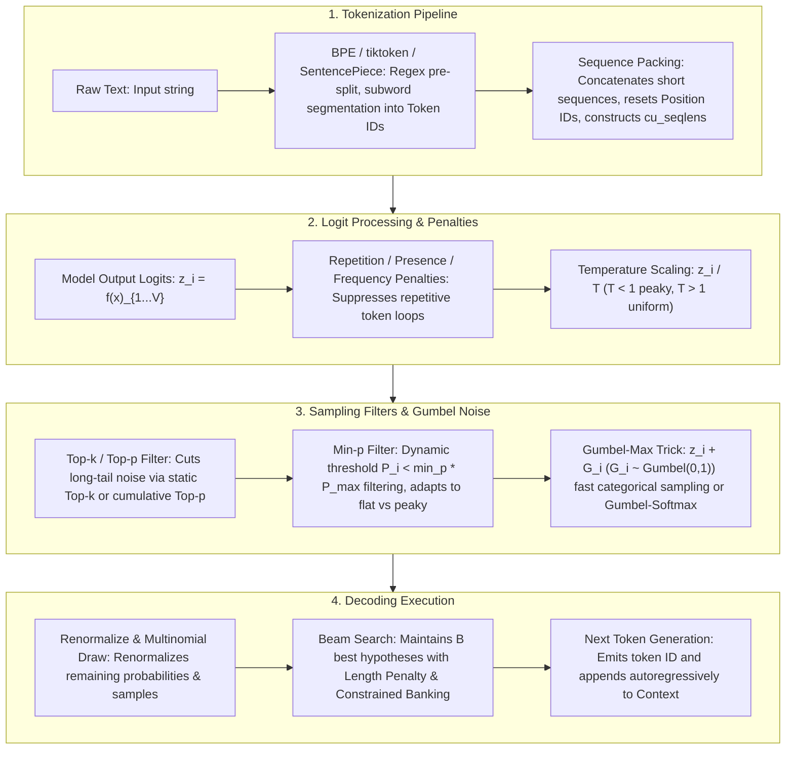

# 🌐 Tokenizer & Decoding Strategies: BPE, WordPiece, SentencePiece, Temperature, Top-k/p, Min-p, Gumbel-Max, Repetition Penalty & Sequence Packing

> **Core Executive Summary**: The text processing pipeline of Large Language Models (LLMs) spans three stages: **Front-end Tokenization**, **Mid-end Autoregressive Logit Prediction**, and **Back-end Probability Sampling & Decoding**. This guide dissects BPE, WordPiece, Unigram, and SentencePiece algorithms; derives Beam Search (with Length Penalty and Constrained Banking), Repetition/Presence Penalties, Temperature scaling, Top-$k$, Top-$p$ (Nucleus), SOTA **Min-$p$** dynamic cutoff sampling, and differentiable **Gumbel-Softmax** sampling; and analyzes **Sequence Packing** architecture with FlashAttention `varlen` `cu_seqlens` CUDA pointers.

---

## 💡 Interactive Mermaid Architecture Flowchart



---

## 💡 Classic Interview Followups & Core Cheatsheet

* **Key Topic 1**: What are the fundamental differences in merge/pruning criteria between BPE, WordPiece, and Unigram?
  * *Standard Answer*:
    * **BPE (Byte Pair Encoding)**: Bottom-Up. Starts with character/byte vocabulary, merges the most **frequent consecutive token pair $\text{count}(A, B)$** each iteration. Byte-level BPE (GPT-2/3/4 `tiktoken`) uses Rust-accelerated regex pre-tokenization for **zero OOV**.
    * **WordPiece**: Bottom-Up. Merges based on **Mutual Information / Likelihood Ratio**:
      $$\text{Score}(A, B) = \frac{\text{count}(A, B)}{\text{count}(A) \times \text{count}(B)}$$
      Prioritizes pairs that maximize language model likelihood. Used by BERT & RoBERTa.
    * **Unigram**: Top-Down. Starts with a massive candidate vocabulary, computes corpus marginal likelihood. Prunes candidates causing the smallest **Loss Drop $\Delta \mathcal{L}$** when removed. Supports **Subword Regularization** for SFT data augmentation.

  * *30-second Oral Answer*: "Conclusion: the three tokenizers differ only in their merge/prune scoring — BPE uses absolute frequency, WordPiece uses a likelihood ratio, Unigram uses the loss increase from removal. Why: BPE is bottom-up and greedily merges the most frequent adjacent pair; WordPiece is also bottom-up but divides by count(A)×count(B) to reject spurious co-occurrence; Unigram is top-down — start with a huge vocabulary and prune the words whose removal hurts loss the least. Example: 'love'+'ly' co-occur 300 times with 5000 and 8000 solo counts — BPE just counts 300, WordPiece asks whether 300/(5000×8000) is significant, Unigram measures how much corpus loss rises if 'lovely' is deleted."

* **Key Topic 2**: Derive the mathematical limit states of Softmax probability distributions as Temperature $T \to 0$ and $T \to \infty$.
  * *Standard Answer*: Softmax probability $P(x_i) = \frac{\exp(z_i / T)}{\sum \exp(z_j / T)}$. Let $z_{\text{max}} = \max(z_i)$.
    * **As $T \to 0^+$**: Multiply numerator and denominator by $\exp(-z_{\text{max}} / T)$. For non-max logits $z_i < z_{\text{max}}$, $\frac{z_i - z_{\text{max}}}{T} \to -\infty \implies \exp(\dots) \to 0$. Only $z_i = z_{\text{max}}$ yields $\exp(0) = 1$. Distribution polarizes into a **One-Hot Distribution**, collapsing into **Greedy Decoding**.
    * **As $T \to \infty$**: $\frac{z_i}{T} \to 0 \implies \exp(z_i / T) \to 1$. Denominator approaches $V$. Each probability $P(x_i) \to \frac{1}{V}$, collapsing into a **Uniform Distribution** across the entire vocabulary.

  * *30-second Oral Answer*: "Conclusion: as T→0 the distribution collapses to one-hot (equivalent to greedy), as T→∞ it becomes uniform (pure randomness). Why: temperature divides into the exponent — T<1 amplifies logit gaps, T>1 flattens them; at T→0 every non-max logit's exponential goes to 0 so the max takes probability 1; at T→∞ every exp(z_i/T)→1 so each token gets 1/V. Example: with V=1000 and T→∞ each token has probability 0.001; at T=0.5 a logit gap of 2 behaves like a gap of 4, making generation aggressive — low temperature for code/math, high temperature for creative writing."

* **Key Topic 3**: How do Top-p (Nucleus) and Min-p sampling behave differently in Flat vs Peaky probability landscapes?
  * *Standard Answer*:
    * **Top-p (Nucleus)**: Accumulates sorted probabilities until $\sum_{i \in S} P(x_i) \ge p$. In **Peaky** distributions ($P_1 = 0.95, p=0.9$), Top-p stops at 1 token. But in **Flat** distributions (e.g. 1000 tokens with $P_i = 0.001$), Top-p must collect 900 candidates to hit $p=0.9$, introducing long-tail noise and hallucinations.
    * **Min-p**: Sets a dynamic threshold relative to top probability $P_{\text{max}}$: $\text{Threshold} = \text{min\_p} \times P_{\text{max}}$. Only tokens with $P(x_i) \ge \text{Threshold}$ are kept. In peaky distributions ($P_{\text{max}} = 0.9, \text{min\_p}=0.05 \implies \text{Threshold}=0.045$), low-prob tokens are instantly cut. In flat distributions ($P_{\text{max}} = 0.08 \implies \text{Threshold} = 0.004$), the gate scales down adaptively, solving Top-p noise issues!

  * *30-second Oral Answer*: "Conclusion: Top-p cuts by cumulative probability while Min-p cuts by a dynamic threshold relative to P_max, and Min-p avoids long-tail noise in flat distributions, which is why it is replacing Top-p. Why: Top-p must collect tokens until the probability sum reaches p, so flatter distributions pull in more low-quality tokens; Min-p's threshold = min_p × P_max adapts to the landscape — as P_max shrinks the gate lowers, but it still keeps only relatively competitive candidates. Example: in a peaky distribution with P_max=0.9 and min_p=0.05, the threshold is 0.045 and almost everything else is cut instantly; in a flat one with P_max=0.08 the threshold drops to 0.004, keeping viable candidates instead of Top-p(0.9) sweeping in hundreds of garbage tokens."

* **Key Topic 4**: Derive the mathematical mechanics of Gumbel-Max Trick and Gumbel-Softmax differentiable sampling.
  * *Standard Answer*: To sample a discrete category $k$ from $P(X = k) = \frac{\exp(z_k)}{\sum \exp(z_j)}$, standard sampling is non-differentiable.
  **Gumbel-Max Trick** proves that adding i.i.d. standard Gumbel noise $g_k \sim \text{Gumbel}(0, 1)$ ($g_k = -\log(-\log U_k), U_k \sim \text{Uniform}(0, 1)$) to logits yields:
  $$y = \arg\max_{k \in \{1, \dots, V\}} (z_k + g_k)$$
  where $P(y = k)$ is **exactly equal** to $\text{Softmax}(z_k)$! Replacing $\arg\max$ with continuous temperature-scaled Softmax produces **Gumbel-Softmax**:
  $$y_k = \frac{\exp((z_k + g_k) / T)}{\sum \exp((z_j + g_j) / T)}$$
  enabling backpropagation via the reparameterization trick in RLHF and discrete VQ-VAEs.

  * *30-second Oral Answer*: "Conclusion: Gumbel-Max adds Gumbel noise to each logit and takes argmax; the resulting distribution is exactly the softmax distribution, and the reparameterization makes the sample path differentiable. Why: the noise moves randomness from the sampling operation into the input, so gradients flow through; replacing argmax with a temperature-scaled softmax gives Gumbel-Softmax, and annealing the temperature from high to low during training bridges continuous relaxation and discrete sampling. Example: logits=[2,1,0] give softmax probabilities ≈[0.665,0.245,0.090]; adding Gumbel(0,1) noise and taking argmax picks token 1 with exactly that 66.5% chance — this is the trick behind differentiable policy optimization over discrete tokens in RLHF."

* **Key Topic 5**: Why must Position IDs be reset in Sequence Packing, and how does FlashAttention eliminate padding via `cu_seqlens` in CUDA?
  * *Standard Answer*: In Sequence Packing, if 3 short sequences (lengths 100, 200, 300) are concatenated into a 4096 window without position resets, later sequences would falsely start at $pos=100$ and $pos=300$, corrupting **RoPE positional embeddings**. Thus `position_ids` must be reset to `[0, 1, ..., N-1]` per sub-sequence.
  Furthermore, FlashAttention `flash_attn_varlen_func` receives a 1D cumulative sequence length array **`cu_seqlens`** (e.g. `[0, 100, 300, 600]`). CUDA kernels compute memory offsets directly from `cu_seqlens` without creating 3D attention mask tensors, physically eliminating 100% of padding FLOPs!

  * *30-second Oral Answer*: "Conclusion: Sequence Packing must reset position_ids or RoPE relative positions break; FlashAttention's cu_seqlens cumulative-length array removes the 3D mask and all padding waste. Why: if the second packed sequence starts counting at pos=100, every relative distance inside it is shifted by 100 and attention is distorted; cu_seqlens=[0,100,300,600] lets the CUDA kernel compute memory offsets and boundaries directly without materializing an attention mask. Example: three sequences of length 100/200/300 packed into a 4096 window — without reset the second starts at pos=100 and the third at pos=300; with reset each starts at 0, and varlen FlashAttention computes only the valid spans."

---

## 📚 Section 1: Tokenization Algorithms (BPE, WordPiece, Unigram, SentencePiece)

### 1.1 Tokenizer Comparison Matrix

| Algorithm | Direction | Criterion | Landmark Models | Whitespace & OOV Handling |
| :--- | :--- | :--- | :--- | :--- |
| **BPE** | Bottom-Up | Pair frequency $\text{count}(A, B)$ | GPT-2/3/4, LLaMA, Qwen | Byte-level BPE maps text to 256 bytes, **0 OOV** |
| **WordPiece** | Bottom-Up | Likelihood ratio $\frac{\text{count}(A,B)}{\text{count}(A) \cdot \text{count}(B)}$ | BERT, RoBERTa | Uses `##` subword prefix, requires whitespace pre-split |
| **Unigram** | Top-Down | Loss drop $\Delta \mathcal{L}$ on vocabulary pruning | XLNet, ALBERT | Supports probabilistic Subword Regularization |
| **SentencePiece** | Framework | Supports BPE or Unigram | T5, LLaMA-2/3 | Replaces whitespace with `_`, **direct raw byte processing** |

How to read this table: focus on column 3, the criterion — it is the only essential difference between the three algorithms: BPE counts frequency, WordPiece counts a ratio, Unigram computes a loss delta. Start any "difference" interview answer from that column.

> 💡 **Intuition**: Think of building a parts factory. BPE is "build the part combination used most often first" (greedy frequency). WordPiece is "does this pair co-occur more than their solo frequencies predict" (mutual information). Unigram works backwards: build a huge parts catalog, then "remove whichever part hurts the factory least" (pruning by loss). SentencePiece is not an algorithm but the factory framework — it handles engineering concerns like whitespace and raw bytes.
>
> 🎤 **Interview Answer**: "Conclusion: BPE merges by absolute pair frequency, WordPiece merges by likelihood ratio, Unigram prunes top-down by loss increase, SentencePiece is a framework not an algorithm. Why: the denominator count(A)×count(B) in WordPiece rejects spurious association — two frequent words co-occurring often may be coincidence; Unigram's pruning also enables subword regularization for data augmentation. Example: 'love'+'ly' co-occur 300 times with solo counts 5000/8000 — BPE sees only 300, WordPiece tests whether 300/(5000×8000) is significant, Unigram measures the loss rise from deleting 'lovely'."

### 1.2 Tiktoken Pre-Tokenization Regex

OpenAI `tiktoken` uses Rust for high-throughput BPE tokenization. The GPT-4 regex pattern isolates contractions, numbers (1-3 digits), and punctuation before BPE merging, preventing numeric digits and words from fusing into messy tokens.

> 💡 **Intuition**: Regex pre-tokenization draws boundaries *before* BPE merging — number blocks, contractions and punctuation are isolated so BPE never fuses digits into words or words into weird subwords. Without it, '123' could be split into fragments like '1'+'23', degrading math and code representation.
>
> 🎤 **Interview Answer**: "Conclusion: tiktoken combines regex pre-tokenization with byte-level BPE for both zero OOV and high-quality segmentation. Why: pre-splitting isolates 'don't', '12', and punctuation so BPE does not corrupt them; byte-level BPE operates on 256 byte tokens, so any text can be segmented and unknown words simply do not exist. Example: GPT-4's vocabulary is ~100k tokens; a common English word usually costs 1 token while one Chinese character may cost 2-3 — which is exactly why Chinese prompts are billed several times more expensive than English."

---

## ⚡ Section 2: Decoding Algorithms, Penalties & Gumbel-Max

### 2.1 Repetition, Presence & Frequency Penalty Formulas

1. **Hugging Face Repetition Penalty** (for seen token set $S_{\text{seen}}$ with $\theta > 1.0$):
   $$z_i = \begin{cases} z_i / \theta & \text{if } z_i > 0 \text{ and } i \in S_{\text{seen}} \\ z_i \cdot \theta & \text{if } z_i < 0 \text{ and } i \in S_{\text{seen}} \end{cases}$$
2. **OpenAI Presence & Frequency Penalty** (for token count $c_i$):
   $$z_i' = z_i - c_i \times \text{frequency\_penalty} - \mathbb{I}(c_i > 0) \times \text{presence\_penalty}$$

> 💡 **Intuition**: All three penalties "pour cold water", but differently. HF Repetition Penalty is "symmetric suppression": for a seen token, a positive logit is divided by θ and a negative logit is multiplied by θ — both push toward "harder to select". OpenAI's presence penalty subtracts a fixed amount once (it governs topic switching), while frequency subtracts linearly with count (it governs repetition). Mnemonic: presence = new topics, frequency = high-frequency words.
>
> 🎤 **Interview Answer**: "Conclusion: penalties modify logits before softmax so repeated tokens become harder to sample. Why: Repetition Penalty scales seen tokens' logits symmetrically — positive divided by θ, negative multiplied by θ, both lowering relative probability; presence subtracts a one-time fixed value to encourage novelty; frequency subtracts proportionally to occurrence count to suppress repetition. Example: while generating 'the the the', 'the' gets divided by 1.2 every step and the frequency penalty doubles each occurrence, forcing the model to switch words; typical penalty magnitudes are floats between 0 and 2."

### 2.2 Decoding Strategies Overview Table

| Strategy | Mathematical Rule | Pros | Cons / Best Use Case |
| :--- | :--- | :--- | :--- |
| **Greedy Search** | $y_t = \arg\max P(w \mid y_{<t})$ | Fast, deterministic | Repetitive loops, uncreative (Code/Math) |
| **Beam Search** | $\text{Score}(Y) = \frac{\sum \log P}{lp(Y)}$ | Globally optimal sequences | $B$-fold compute cost (Translation) |
| **Temperature** | $P(x_i) = \frac{\exp(z_i / T)}{\sum \exp(z_j / T)}$ | Smooths or sharpens logits | Cannot filter long-tail noise alone |
| **Top-$k$** | Keeps top $k$ items | Cuts long tail | Static $k$ fails in dynamic landscapes |
| **Top-$p$ (Nucleus)**| Smallest set $\sum_{i \in S_p} P(x_i) \ge p$ | Dynamic candidate sizing | Admits garbage tokens in flat landscapes |
| **Min-$p$** | Filters $P(x_i) < \text{min\_p} \times P_{\text{max}}$ | **SOTA**! Adaptive noise cutting | Recommended default for general generation |
| **Gumbel-Max** | $y = \arg\max (z_i + g_i), g_i \sim \text{Gumbel}$ | Direct sampling without binary search | Enables Gumbel-Softmax differentiable RL |

How to read this table: memorize the "Mathematical Rule" column row by row — Greedy has no filter, Beam scores global paths, Temperature only rescales, Top-k uses absolute rank, Top-p uses cumulative probability, Min-p uses a relative threshold, Gumbel adds noise then takes max. This is the standard axis for comparing samplers in interviews.

> 💡 **Intuition**: These strategies are "rules for choosing the next phrase". Greedy: always pick the loudest. Temperature: turn every volume knob up or down uniformly (order unchanged, contrast changes). Top-k: only the k loudest voices may speak. Top-p: everyone whose voices cumulatively cover 90% may speak. Min-p: anyone quieter than 5% of the loudest shuts up. Gumbel-Max: hand everyone a random microphone gain, then pick the loudest.
>
> 🎤 **Interview Answer**: "Conclusion: for general chat use Temperature=0.7 + Repetition Penalty=1.15 + Min-p=0.05; for code/math use greedy (T=0). Why: temperature only adjusts sharpness and cannot filter the long tail, so it needs a truncation partner; Top-k's k is static and breaks when the landscape changes; Top-p sweeps in garbage in flat distributions, while Min-p's threshold tracks P_max so it adapts. Example: translation uses Beam Search (B=4-8) for global optimality, creative writing uses T=0.8-1.0; the API default T=1.0/top_p=1.0 is raw sampling, production stacks add penalties and Min-p to avoid loops and hallucinations."

---

## 📦 Section 3: Training Padding Waste & Sequence Packing

### 3.1 Dynamic Padding vs Sequence Packing Architecture

Read the diagram top-down: **Dynamic Padding** aligns a batch to its longest sequence and fills the rest with `<PAD>` — wasting memory and FLOPs (up to 60% of a short sequence can be padding). **Sequence Packing** instead stitches several short texts back-to-back to fill the window; Position IDs restart at 0 for every sub-sequence, and `cu_seqlens` records the cumulative boundaries.

```text
[ Dynamic Padding ] (50%+ Wasted FLOPs)
Batch Sample 1: [ Token1, Token2, Token3, <PAD>,  <PAD>,  <PAD>  ]
Batch Sample 2: [ Token1, Token2, Token3, Token4, Token5, Token6 ]

[ Sequence Packing ] (100% GPU Utilization)
Packed Window : [ S1_T1, S1_T2, S1_T3, <EOS>, S2_T1, S2_T2, S2_T3 ]
Position IDs  : [   0  ,   1  ,   2  ,   0  ,   0  ,   1  ,   2   ]
cu_seqlens    : [ 0, 4, 7 ] (Passed to FlashAttention varlen C++ pointers)
```

> 💡 **Intuition**: Training batches contain texts of wildly different lengths; the classic approach pads to the longest and wastes a lot of compute on fake tokens. Sequence Packing is carpooling — fill every window to the brim with multiple short texts, zero waste. Two pitfalls: positional encodings must not keep counting across the seam (position_ids reset to 0 per sub-sequence, or relative positions inside the second text shift), and the CUDA kernel must know where the seams are — that is what cu_seqlens does.
>
> 🎤 **Interview Answer**: "Conclusion: Sequence Packing = stitching short sequences + resetting position_ids + passing cu_seqlens boundaries, cutting padding waste from ~50% to 0. Why: without resetting, RoPE relative distances are shifted by a constant and attention is distorted; cu_seqlens=[0,100,300,600] is a cumulative-length array from which the kernel computes offsets directly, so no 3D mask is ever built. Example: if the corpus averages half the window length, dynamic padding wastes ~50% of FLOPs; packing lets the same compute train nearly twice as many tokens — this is how LLaMA/DeepSeek-class training pipelines run."

---

## 🐍 Section 4: Pure Numpy Handwritten Sampling Pipeline

The pipeline below matches the order used by mainstream engines (vLLM / HF): apply repetition penalty to generated tokens → scale logits by temperature → softmax to probabilities → apply Min-p, Top-k, Top-p filters in sequence → renormalize the survivors → multinomial sample. Note that `gumbel_max_sample` turns uniform noise into Gumbel(0,1) samples via `-log(-log(u))`.

```python
import numpy as np

def apply_repetition_penalty(logits: np.ndarray, generated_tokens: list[int], penalty: float = 1.2) -> np.ndarray:
    logits = logits.copy()
    for token_id in set(generated_tokens):
        if logits[token_id] < 0:
            logits[token_id] *= penalty
        else:
            logits[token_id] /= penalty
    return logits

def gumbel_max_sample(logits: np.ndarray, temperature: float = 1.0) -> int:
    u = np.random.uniform(1e-10, 1.0 - 1e-10, size=logits.shape)
    gumbel_noise = -np.log(-np.log(u))
    return int(np.argmax(logits / temperature + gumbel_noise))

def pure_numpy_llm_sampling(
    logits: np.ndarray,
    generated_tokens: list[int] = None,
    temperature: float = 0.7,
    repetition_penalty: float = 1.15,
    top_k: int = 50,
    top_p: float = 0.9,
    min_p: float = 0.05
) -> int:
    if generated_tokens and repetition_penalty != 1.0:
        logits = apply_repetition_penalty(logits, generated_tokens, repetition_penalty)
        
    if temperature <= 1e-5:
        return int(np.argmax(logits))
        
    scaled_logits = logits / temperature
    max_logit = np.max(scaled_logits)
    exp_logits = np.exp(scaled_logits - max_logit)
    probs = exp_logits / np.sum(exp_logits)
    
    sorted_indices = np.argsort(probs)[::-1]
    sorted_probs = probs[sorted_indices]
    
    p_max = sorted_probs[0]
    min_p_threshold = min_p * p_max
    min_p_mask = sorted_probs >= min_p_threshold
    sorted_probs = sorted_probs[min_p_mask]
    sorted_indices = sorted_indices[min_p_mask]
    
    if top_k > 0 and top_k < len(sorted_probs):
        sorted_probs = sorted_probs[:top_k]
        sorted_indices = sorted_indices[:top_k]
        
    if top_p < 1.0:
        cumulative_probs = np.cumsum(sorted_probs)
        cutoff_index = np.searchsorted(cumulative_probs, top_p)
        cutoff_index = max(1, cutoff_index + 1)
        sorted_probs = sorted_probs[:cutoff_index]
        sorted_indices = sorted_indices[:cutoff_index]
        
    final_probs = sorted_probs / np.sum(sorted_probs)
    selected_idx = np.random.choice(len(final_probs), p=final_probs)
    return int(sorted_indices[selected_idx])


if __name__ == "__main__":
    np.random.seed(42)
    vocab_size = 1000
    dummy_logits = np.random.randn(vocab_size) * 2.0
    dummy_logits[100] = 12.0
    dummy_logits[200] = 10.5
    history = [100, 50, 100]
    
    token_id = pure_numpy_llm_sampling(
        dummy_logits, 
        generated_tokens=history,
        temperature=0.7, 
        repetition_penalty=1.2,
        top_k=40, 
        top_p=0.9, 
        min_p=0.05
    )
    print("✅ Pure Numpy LLM Sampling Pipeline Complete!")
    print(f"Sampled Token ID: {token_id}")
```

> 💡 **Intuition**: Three details worth noticing: `apply_repetition_penalty` uses multiplication/division for symmetric suppression of positive and negative logits; `temperature <= 1e-5` short-circuits to argmax (near-zero temperature = greedy); `exp(scaled - max_logit)` is the numerically stable softmax. The three filters stack as Min-p → Top-k → Top-p, each shrinking the candidate set, then probabilities are renormalized before the draw.
>
> 🎤 **Interview Answer**: "Conclusion: the production sampling pipeline is penalty → temperature → softmax → min-p/top-k/top-p filtering → renormalization → multinomial draw. Why: penalties and temperature must act on logits before softmax, while top-p needs cumulative probabilities so filtering happens after; after filtering the probabilities no longer sum to 1, so renormalization is required before np.random.choice. Example: with min_p=0.05, top_k=40, top_p=0.9 stacked, a 1000-token vocabulary is usually squeezed to 10-40 candidates; the demo sets logits 100 and 200 to 12.0/10.5 to simulate two high-confidence contenders."

---

## 🚀 Key Takeaways & Best Practices

1. **Tokenizer**: Prefer **Byte-level BPE / SentencePiece** (e.g. LLaMA-3 128K vocabulary) for multilingual zero-OOV guarantees with tiktoken Regex pre-splitting.
2. **Sampling Preset**: Use **Temperature=0.7 + Repetition_Penalty=1.15 + Min-p=0.05** for general chat (replaces Top-p to prevent long-tail hallucinations); use **Temperature=0.0 (Greedy)** for Code and Math reasoning.
3. **Training Optimization**: Mandate **Sequence Packing** in SFT and pre-training to eliminate padding waste with FlashAttention `varlen` `cu_seqlens` interfaces.