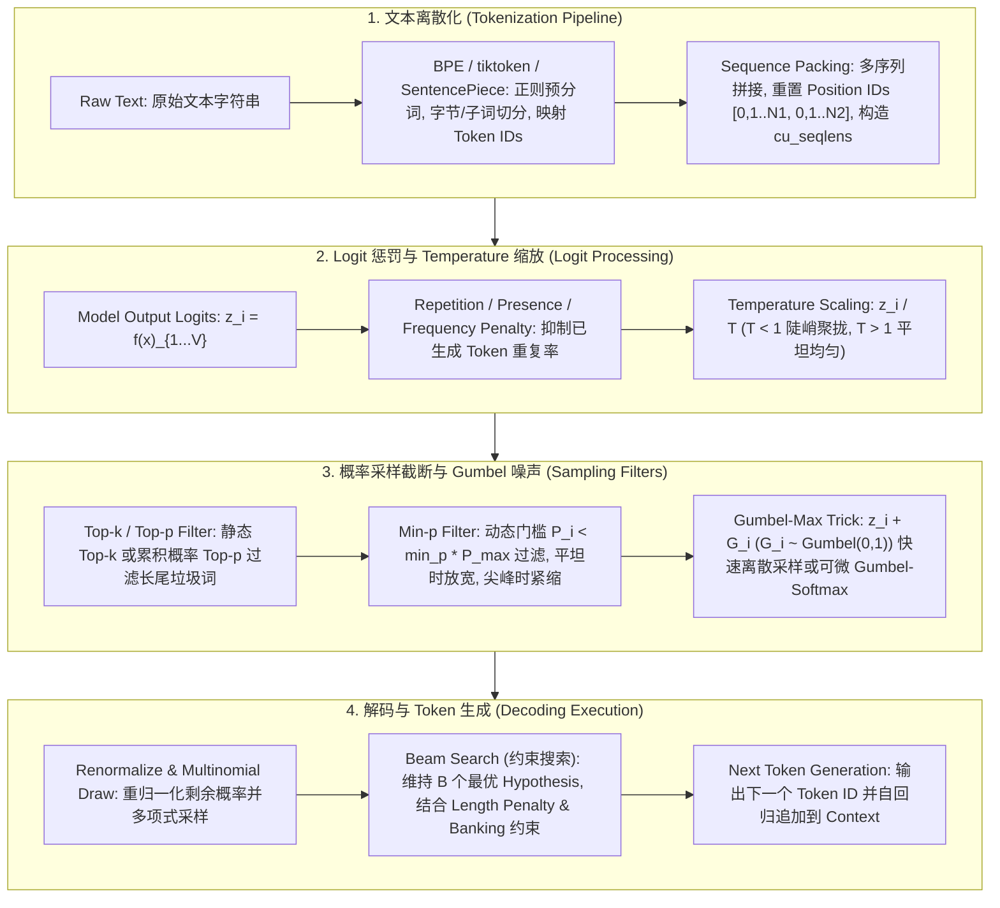

# 🌐 Tokenizer 分词器与 LLM 采样解码全景：BPE、WordPiece、SentencePiece、Temperature、Top-k/p、Min-p、Gumbel-Max、Penalty 与 Sequence Packing 打包优化

> **核心摘要**：大语言模型 (LLM) 的文本处理管道由**前端文本离散化 (Tokenization)**、**中端自回归 Logit 预测**与**后端概率采样解码 (Decoding & Sampling)** 三大核心阶段构成。本指南系统剖析 BPE、WordPiece、Unigram、SentencePiece 分词算法的数学本质；深入推导 Greedy Search、Beam Search (含长度惩罚与约束 Banking 机制)、Repetition/Presence Penalty、Temperature 缩放、Top-$k$、Top-$p$ (Nucleus Sampling)、最新 SOTA **Min-$p$** 动态截断以及可微 **Gumbel-Softmax** 采样；并解析大模型训练中消除无效 Padding 算力浪费的 **Sequence Packing (序列打包)** 架构与 FlashAttention `varlen` 指针传递。

---

## 💡 交互式 Mermaid 架构流程图



---

## 💡 经典面试追问与考点速查

* **考点 1**：对比 BPE、WordPiece 与 Unigram 分词算法的词表构建标准与合并/剪枝公式有何本质区别？
  * *标准回答*：
    * **BPE (Byte Pair Encoding)**：自底向上 (Bottom-Up)。初始词表为单字符/单字节，每轮扫描语料库，统计连续 Token 对 $(A, B)$ 的**绝对出现频次 (Frequency count)**，合并频次最高的 Pair。GPT-2/3/4 `tiktoken` 进一步扩展为 Byte-level BPE，利用 Rust 极致优化 Regex 预分词，彻底消除 OOV（未知词）。
    * **WordPiece**：自底向上。合并标准不是绝对频次，而是**互信息/似然极大化 (Likelihood Ratio)**：
      $$\text{Score}(A, B) = \frac{\text{count}(A, B)}{\text{count}(A) \times \text{count}(B)}$$
      若合并 $(A, B)$ 能最大程度提升语言模型的似然概率，则优先合并。BERT / RoBERTa 广泛采用 WordPiece。
    * **Unigram**：自顶向下 (Top-Down)。首先初始化一个庞大的候选词表，计算全语料库在当前词表下的边缘似然。针对每个 Token $x_i$，计算**若将 $x_i$ 从词表中删除所导致的语料库 Loss 增加量 (Loss Drop)**，按 Loss 增加量从小到大排序，剪枝掉对降低 Loss 贡献最小的 10%~20% 候选词，循环直到达到目标词表大小。配合同名框架支持 **Subword Regularization** 在 SFT 阶段增强泛化能力。

  * *面试速答 (30 秒口述版)*: "结论: 三种分词器的本质区别在合并/剪枝的评分标准——BPE 看绝对频次,WordPiece 看互信息比率,Unigram 看删掉词后的损失增量。原理: BPE 自底向上贪心合并出现最多的相邻 pair;WordPiece 也自底向上,但分母除以 count(A)×count(B),排除'各自出现多所以一起出现也多'的假关联;Unigram 自顶向下,先建超大词表再逐步剪掉损失影响最小的词。例子: 'love'+'ly' 共同出现 300 次、各自出现 5000/8000 次——BPE 只数 300,WordPiece 看 300/(5000×8000) 是否显著,Unigram 算删掉 'lovely' 后语料损失涨多少。"

* **考点 2**：详细推导 Temperature $T$ 趋于 0 和趋于 $\infty$ 时 Softmax 概率分布的极限状态？
  * *标准回答*：设模型输出未归一化 Logits 为 $z = [z_1, z_2, \dots, z_V]$，设最大 Logit 为 $z_{\text{max}} = \max(z_i)$。温度缩放后的概率计算公式为 $P(x_i) = \frac{\exp(z_i / T)}{\sum_{j=1}^V \exp(z_j / T)}$。
    * **当 $T \to 0^+$ 时**：将分子分母同乘以 $\exp(-z_{\text{max}} / T)$，得 $P(x_i) = \frac{\exp((z_i - z_{\text{max}}) / T)}{\sum_{j} \exp((z_j - z_{\text{max}}) / T)}$。对于所有非最大值 $z_i < z_{\text{max}}$，其指数项 $\frac{z_i - z_{\text{max}}}{T} \to -\infty$，使得 $\exp(\dots) \to 0$。只有最大值 $z_i = z_{\text{max}}$ 的项为 $\exp(0) = 1$。因此，概率分布极化为 **One-hot 分布**（概率 1 集中在最高 Logit），完全退化为 **Greedy Decoding (贪婪解码)**。
    * **当 $T \to \infty$ 时**：对于任意 $z_i$，$\frac{z_i}{T} \to 0$，故 $\exp(z_i / T) \to 1$。分母项之和趋于 $\sum_{j=1}^V 1 = V$。每个 Token 的概率 $P(x_i) \to \frac{1}{V}$。概率分布退化为整个词表上的**均匀分布 (Uniform Distribution)**，输出完全随机无意义的乱码。

  * *面试速答 (30 秒口述版)*: "结论: T→0 时分布退化为 one-hot(等价贪心),T→∞ 时退化为均匀分布(完全随机)。原理: 温度进指数后 T<1 会把分数差放大、T>1 会把分数差抹平;T→0 时非最大 logit 的指数项趋近 0,最大项独占概率 1;T→∞ 时所有 exp(z_i/T)→1,每个词概率都是 1/V。例子: 词表 V=1000、T→∞ 时每个词概率 0.001;T=0.5 时两个 logit 差 2 分就相当于差 4 分,生成变得'激进'——所以低温度常用于代码/数学,高温度用于创意写作。"

* **考点 3**：Top-p (Nucleus Sampling) 与 Min-p 采样在概率分布平坦 (Flat) 与陡峭 (Peaky) 场景下的动态表现有何差异？为什么 Min-p 逐渐替代 Top-p？
  * *标准回答*：
    * **Top-p (Nucleus Sampling)**：累加降序概率直到 $\sum_{i \in S} P(x_i) \ge p$。当概率分布极度**陡峭 (Peaky)**（例如最高 Token 概率 $P_1 = 0.95$，目标 $p = 0.9$）时，Top-p 表现优异，仅保留第 1 个 Token（自动截断尾部噪声）；但当概率分布极其**平坦 (Flat)**（例如有 1000 个 Token 概率均为 $0.001$）时，Top-p 必须收集 900 个候选 Token 才能凑满 $p=0.9$，保留了大量的低质量长尾废词，容易引发幻觉与逻辑混乱。
    * **Min-p 采样**：设置相对于最高概率 $P_{\text{max}}$ 的动态阈值：$\text{Threshold} = \text{min\_p} \times P_{\text{max}}$。仅保留概率 $P(x_i) \ge \text{Threshold}$ 的 Token。在**陡峭分布**中（$P_{\text{max}} = 0.9$，设 $\text{min\_p}=0.05 \implies \text{Threshold}=0.045$），绝大多数低概率 Token 被秒杀过滤；在**平坦分布**中（若 $P_{\text{max}} = 0.08 \implies \text{Threshold} = 0.004$），门槛随最大值自适应调低，只保留有竞争力的候选者，彻底解决了 Top-p 在 Flat 场景下引入长尾噪声的缺陷！

  * *面试速答 (30 秒口述版)*: "结论: Top-p 按累计概率截断,Min-p 按相对最高概率的动态门槛截断,Min-p 在平坦分布下不会混入长尾噪声,所以逐渐取代 Top-p。原理: Top-p 的目标是凑满概率和 p,分布越平要收的词越多;Min-p 的门槛 = min_p × P_max,随分布自适应——分布越平 P_max 越小,门槛也越低,但仍只留相对有竞争力的词。例子: 陡峭分布 P_max=0.9、min_p=0.05 时门槛 0.045,低概率词全被秒杀;平坦分布 P_max=0.08 时门槛自动降到 0.004,保留有竞争力的候选,不会像 Top-p(0.9) 那样为了凑概率收进几百个废词。"

* **考点 4**：推导 Gumbel-Max Trick 的数学原理，并说明它如何衍生出可微的 Gumbel-Softmax 用于强化学习与离散 Token 采样？
  * *标准回答*：若要从离散概率分布 $P(X = k) = \pi_k = \frac{\exp(z_k)}{\sum_j \exp(z_j)}$ 中采样一个类别 $k$，传统逆变换采样难以在计算图中求导。
  **Gumbel-Max Trick** 证明：给每个 Logit $z_k$ 叠加一个独立同分布的标准 Gumbel 噪声 $g_k \sim \text{Gumbel}(0, 1)$（可以通过 Uniform 随机变量生成 $g_k = -\log(-\log U_k)$，其中 $U_k \sim \text{Uniform}(0, 1)$），则寻找最大值的随机变量：
  $$y = \arg\max_{k \in \{1, \dots, V\}} (z_k + g_k)$$
  其取值为 $k$ 的概率恰好**精确等于**原始概率 $\pi_k = \text{Softmax}(z_k)$！
  进一步地，在连续松弛化中将 $\arg\max$ 替换为带温度 $T$ 的 `Softmax`，得到 **Gumbel-Softmax (Concrete Distribution)**：
  $$y_k = \frac{\exp((z_k + g_k) / T)}{\sum_j \exp((z_j + g_j) / T)}$$
  反向传播时导数可以跨过采样节点直接传递 (Reparameterization Trick)，广泛应用于 RLHF 离散策略梯度与 VQ-VAE 离散表征学习！

  * *面试速答 (30 秒口述版)*: "结论: Gumbel-Max 给每个 logit 加 Gumbel 噪声后取 argmax,采样分布恰好等于 softmax 概率,而且重参数化后梯度可回传。原理: 噪声把随机性从'采样过程'转移到'输入',argmax 的分布恰好是 softmax;把 argmax 换成带温度的 softmax 就是 Gumbel-Softmax,训练时温度从高退火到低,从连续分布逼近离散采样。例子: logits=[2,1,0] 的 softmax 概率约 [0.665,0.245,0.090],给三个 logit 加 Gumbel(0,1) 噪声再 argmax,选中的概率恰好就是这三个数——这是 RLHF 里对离散 token 做可微策略优化的关键。"

* **考点 5**：在 Sequence Packing (序列打包) 中，为什么必须重置 Position IDs？FlashAttention 如何通过 `cu_seqlens` 在 CUDA 级消除 100% 的 Padding？
  * *Standard Answer*：在 Sequence Packing 中，若将 3 条长度分别为 100, 200, 300 的短序列直接拼接到同一个 4096 的 Window 中，若不重置位置编码，后两条序列的起始位置会被误算为 $pos=100$ 和 $pos=300$。对于依赖相对位置关系的 **RoPE 旋转位置编码**，这会导致后续子样本的注意力和距离度量严重失真！因此，必须在每个子序列起始处将 `position_ids` 重置为 `[0, 1, 2, ..., N_sub-1]`。
  此外，在使用 CUDA 深度优化库（如 FlashAttention）时，`flash_attn_varlen_func` 传入一个一维累加序列长度数组 **`cu_seqlens`**（例如 `[0, 100, 300, 600]`）。CUDA 内核基于 `cu_seqlens` 直接计算每个 Thread Group 负责的内存偏移量与界限，无需在显存中构造昂贵的三维 Attention Mask，从硬件物理层彻底消除了 100% 的 Padding 计算浪费！

  * *面试速答 (30 秒口述版)*: "结论: Sequence Packing 必须重置 position_ids,否则 RoPE 的相对位置全错;FlashAttention 用 cu_seqlens 累计长度数组免掉 3D mask,消除全部 padding 浪费。原理: 拼接后第二条序列的 token 若从 pos=100 接着数,它的相对距离被整体加偏,注意力失真;cu_seqlens=[0,100,300,600] 让 CUDA 内核直接按边界算偏移,不需要构造昂贵的注意力 mask。例子: 3 条 100/200/300 长的序列拼进 4096 窗口,不重置时第二条起点被算成 pos=100、第三条 pos=300;重置后每条都从 0 开始,FlashAttention varlen 只计算有效部分,训练吞吐提升显著。"

---

## 📚 第一章：分词算法 (BPE, WordPiece, SentencePiece) 深度对比

### 1.1 四大分词算法特性闭环矩阵

| 分词算法 | 构建方向 (Direction) | 合并/剪枝指标 (Criterion) | 标志性模型 | 空格与 OOV 处理 |
| :--- | :--- | :--- | :--- | :--- |
| **BPE** | 自底向上 (Bottom-Up) | 连续 Pair 绝对出现频次 $\text{count}(A, B)$ | GPT-2/3/4, LLaMA, Qwen | Byte-level BPE 将任意文本映射为 256 字节，**0 OOV** |
| **WordPiece** | 自底向上 (Bottom-Up) | 互信息/似然比 $\frac{\text{count}(A,B)}{\text{count}(A) \cdot \text{count}(B)}$ | BERT, RoBERTa | 依赖前置空格预分词，使用 `##` 表示子词前缀 |
| **Unigram** | 自顶向下 (Top-Down) | 词表剪枝 Loss 增加量 $\Delta \mathcal{L}$ | XLNet, ALBERT | 配合概率采样，支持 Subword Regularization 数据增强 |
| **SentencePiece** | 引擎框架 (Framework) | 可集成 BPE 或 Unigram | T5, LLaMA-2/3 | 将空格视作普通字符 `_`，**直接处理原始字节流** |

读表技巧: 抓住第三列"合并/剪枝指标"——这是三类算法唯一的本质区别: BPE 数频次、WordPiece 数比率、Unigram 算损失差。面试问"区别"就从这一列答起。

> 💡 **直观理解**: 把词表构建想成"造零件库"。BPE 是"哪个零件组合用得最多就先造哪个"(贪心频次);WordPiece 是"两个零件拼一起出现,是不是比各自单独出现更'有缘分'"(互信息,排除各自本来就多的干扰);Unigram 反着来,先造超大零件库,再"删掉哪个零件对工厂损失最小就删哪个"(剪枝);SentencePiece 不是算法而是"工厂框架",解决的是空格、原始字节怎么喂进去的工程问题。
>
> 🎤 **面试速答**: "结论: BPE 按相邻 pair 的绝对频次合并,WordPiece 按似然比合并,Unigram 按损失增量自顶向下剪枝,SentencePiece 是框架不是算法。原理: 互信息的分母 count(A)×count(B) 用来排除假关联——两个词都高频时它们共同出现多只是巧合;Unigram 剪枝后还能做子词采样增强泛化。例子: 'love'+'ly' 共同出现 300 次、各自 5000/8000 次,BPE 只看 300,WordPiece 看 300/(5000×8000) 是否显著,Unigram 算删掉 'lovely' 后语料 loss 涨多少、涨得少就先剪。"

### 1.2 Tiktoken 预分词正则表达式与算法瓶颈

OpenAI `tiktoken` 库采用 Rust 实现高并发 BPE 分词。其核心技术突破在于利用**正则表达式分割预处理 (Regex Pre-tokenization)**。例如 GPT-4 的正则匹配模式处理缩写（如 `'s`, `'ll`）、数字块（最多匹配 3 位数字）与标点符号，防止数字或标点与单词错误合并成杂乱的子词，显著提升了 LLM 在数学运算与代码缩进方面的特征表示能力！

> 💡 **直观理解**: 正则预分词是在 BPE 合并之前先"划好边界"——数字块、缩写、标点先被隔离出来,不让 BPE 把数字和单词错误地混成奇怪子词。否则 '123' 可能被拆成 '1'+'23' 这种碎片,数学计算和代码缩进的特征表示都会变差。
>
> 🎤 **面试速答**: "结论: tiktoken 先用正则预分词、再做字节级 BPE,兼顾 0 OOV 和高质量分词。原理: 预分词把 'don't'、'12'、标点单独隔离,防止 BPE 把它们错误合并;字节级 BPE 以 256 个字节为底,任何文本都能拆,所以不存在未知词。例子: GPT-4 词表约 10 万;同一个意思英文常见词通常 1 个 token、中文一个字可能拆 2-3 个 token——这也是中文 API 计费比英文贵一大截的直接原因。"

---

## ⚡ 第二章：采样解码算法与惩罚机制

### 2.1 Repetition, Presence & Frequency Penalty 惩罚项公式

为解决自回归 LLM 易陷入文本死循环重述的问题，在计算 Softmax 前对模型输出 Logits 应用三类惩罚项：

1. **Hugging Face Repetition Penalty**：针对已出现过的 Token 集合 $S_{\text{seen}}$，设惩罚超参数 $\theta > 1.0$：
   $$z_i = \begin{cases} z_i / \theta & \text{if } z_i > 0 \text{ and } i \in S_{\text{seen}} \\ z_i \cdot \theta & \text{if } z_i < 0 \text{ and } i \in S_{\text{seen}} \end{cases}$$
2. **OpenAI Presence & Frequency Penalty**：设 Token $i$ 在已生成文本中出现的绝对频次为 $c_i$：
   $$z_i' = z_i - c_i \times \text{frequency\_penalty} - \mathbb{I}(c_i > 0) \times \text{presence\_penalty}$$
   * **Presence Penalty**：只要 Token 出现过一次就进行固定数值扣减，鼓励模型引入全新话题；
   * **Frequency Penalty**：扣减程度随出现频次 $c_i$ 线性增加，惩罚高频重复词。

> 💡 **直观理解**: 三种惩罚都是"泼冷水",但方式不同。HF Repetition Penalty 是"对称打压": 已出现过的词,logit 为正就除以 θ(变小),为负就乘 θ(更负),总之都朝"更难被选中"的方向推;OpenAI 的 Presence 是"出现一次就扣一次固定分"(管换话题),Frequency 是"出现越多扣越多"(管复读)。口诀: Presence 管'新话题',Frequency 管'高频词'。
>
> 🎤 **面试速答**: "结论: 惩罚项在 softmax 之前直接改 logits,让重复词更难被采到。原理: Repetition Penalty 对已见词的 logit 对称缩放——正 logit 除以 θ、负 logit 乘 θ,都压低它的相对概率;presence 只按出现与否扣固定分,鼓励引入新话题;frequency 按出现次数线性扣,压制高频复读。例子: 生成 'the the the' 时,'the' 的 logit 每轮被 penalty=1.2 除以 1.2,且 frequency 罚分随次数翻倍,模型被迫换词;两个惩罚的典型量级都是 0~2 之间的浮点数。"

### 2.2 采样算法全景对比表

| 采样方式 | 数学定义 / 过滤逻辑 | 优点 | 缺点 / 适用场景 |
| :--- | :--- | :--- | :--- |
| **Greedy Search** | $y_t = \arg\max_{w \in V} P(w \mid y_{<t})$ | 确定性，极速 | 容易陷入死循环重述，缺乏创造力 (适合代码/数学) |
| **Beam Search** | $\text{Score}(Y) = \frac{\sum \log P(y_t)}{lp(Y)}$ | 考虑长远序列全局最优 | 计算开销 $B$ 倍，易生成平庸重复文本 (适合翻译) |
| **Temperature** | $P(x_i) = \frac{\exp(z_i / T)}{\sum \exp(z_j / T)}$ | 平滑/收紧概率分布 | 无法单独过滤长尾垃圾词 |
| **Top-$k$** | 仅留概率前 $k$ 项：$S_k = \text{TopK}(P, k)$ | 强行截断长尾 | $k$ 为静态固定值，无法适配动态分布 |
| **Top-$p$ (Nucleus)**| 最小集合 $S_p$: $\sum_{i \in S_p} P(x_i) \ge p$ | 动态调整候选数量 | 在 Flat 平坦分布下仍会混入大量废词 |
| **Min-$p$** | 动态过滤：$P(x_i) < \text{min\_p} \times P_{\text{max}}$ | **SOTA**！自适应剔除低质量噪声 | 目前最推荐的生成通用采样组合 |
| **Gumbel-Max** | $y = \arg\max (z_i + g_i), g_i \sim \text{Gumbel}$ | 无需二分查找即可连续采样 | 可配合 Gumbel-Softmax 实现可微训练 |

读表技巧: 一行一行记"数学定义"列——Greedy 无过滤、Beam 看全局分数、Temperature 只缩放、Top-k 看绝对名次、Top-p 看累计概率、Min-p 看相对最高概率、Gumbel 加噪声取 max。这是面试对比采样的标准轴。

> 💡 **直观理解**: 这些策略像"选下一句话的规则"。Greedy 是"永远选最响的";Temperature 是"把音量统一调大调小"(不改变顺序,只改变对比度);Top-k 是"只让嗓门最大的 k 个人说话";Top-p 是"让嗓门加起来占 90% 的一群人说话";Min-p 是"声音低于最大嗓门 5% 的统统闭嘴";Gumbel-Max 是"给每个人发一个随机麦克风增益再选最响的"。
>
> 🎤 **面试速答**: "结论: 通用对话推荐 Temperature=0.7 + Repetition Penalty=1.15 + Min-p=0.05,代码/数学用贪心(T=0)。原理: Temperature 只调锐度、滤不掉长尾,必须配截断;Top-k 的 k 是静态的,分布一变就失效;Top-p 在平坦分布会收进废词,Min-p 门槛随 P_max 自适应所以更稳。例子: 翻译任务用 Beam Search(B=4~8) 取全局最优,创意写作用 T=0.8~1.0,API 默认 T=1.0/top_p=1.0 等于裸采样,生产环境都会加惩罚和 Min-p 防止复读与幻觉。"

---

## 📦 第三章：训练阶段 Padding 废算力与 Sequence Packing 序列打包

### 3.1 Dynamic Padding vs Sequence Packing 架构对比

先看懂图里的两行: 上行 **Dynamic Padding** 为了对齐 batch 里最长的序列,给短序列补 `<PAD>`,显存和算力都浪费(短的序列里可能 60% 是废 token);下行 **Sequence Packing** 把多段短文本首尾相接塞满窗口,Position IDs 在每个子序列起点归零,`cu_seqlens` 记录各子序列的累计边界。

```text
[ Dynamic Padding 传统填充 ] (浪费 50% 显存与计算)
Batch Sample 1: [ Token1, Token2, Token3, <PAD>,  <PAD>,  <PAD>  ]
Batch Sample 2: [ Token1, Token2, Token3, Token4, Token5, Token6 ]

[ Sequence Packing 序列打包 ] (100% 满载计算，零 waste FLOPs)
Packed Window : [ S1_T1, S1_T2, S1_T3, <EOS>, S2_T1, S2_T2, S2_T3 ]
Position IDs  : [   0  ,   1  ,   2  ,   0  ,   0  ,   1  ,   2   ]
cu_seqlens    : [ 0, 4, 7 ] (传递给 FlashAttention varlen C++ 指针)
```

> 💡 **直观理解**: 训练时 batch 里文本长短不一,传统做法是"按最长的对齐、短的补 PAD",白算很多 token;Sequence Packing 像"拼车",把几段短文本拼满一个窗口,零浪费。关键坑有两个: 一是拼接后位置编码不能接着数,否则第二条序列的相对位置全错——position_ids 必须每个子序列从 0 重来;二是要告诉 CUDA 内核"哪里是边界",这就是 cu_seqlens 的作用。
>
> 🎤 **面试速答**: "结论: Sequence Packing = 短序列拼接 + position_ids 重置 + cu_seqlens 传边界,把 padding 浪费从约 50% 降到 0。原理: 不重置位置时 RoPE 相对距离被整体加偏,注意力失真;cu_seqlens=[0,100,300,600] 是累计长度数组,内核直接按它算偏移和界限,无需构造 3D mask。例子: 语料平均长度只有窗口一半时,动态 padding 浪费约 50% 的 FLOPs;packing 后同一算力能多训接近一倍的 token,DeepSeek/LLaMA 的训练都这么做。"

---

## 🐍 第四章：Pure Numpy 手写采样管道与 Tokenizer 模拟器

以下提供包含 Gumbel-Max 采样与 Repetition Penalty 的 Pure Numpy LLM 采样管道。管道顺序与主流框架(vLLM/HF)一致: 先对已生成 token 施加 repetition penalty → 按温度缩放 logits → softmax 得到概率 → 依次应用 Min-p、Top-k、Top-p 过滤 → 对剩余候选重新归一化后多项式采样。注意 `gumbel_max_sample` 用 `-log(-log(u))` 从均匀分布生成 Gumbel(0,1) 噪声。

```python
import numpy as np

def apply_repetition_penalty(
    logits: np.ndarray, 
    generated_tokens: list[int], 
    penalty: float = 1.2
) -> np.ndarray:
    """针对已生成 Token 列表应用 Repetition Penalty 惩罚项"""
    logits = logits.copy()
    for token_id in set(generated_tokens):
        if logits[token_id] < 0:
            logits[token_id] *= penalty
        else:
            logits[token_id] /= penalty
    return logits


def gumbel_max_sample(logits: np.ndarray, temperature: float = 1.0) -> int:
    """Pure Numpy Gumbel-Max Trick 离散采样"""
    u = np.random.uniform(1e-10, 1.0 - 1e-10, size=logits.shape)
    gumbel_noise = -np.log(-np.log(u))
    return int(np.argmax(logits / temperature + gumbel_noise))


def pure_numpy_llm_sampling(
    logits: np.ndarray,
    generated_tokens: list[int] = None,
    temperature: float = 0.7,
    repetition_penalty: float = 1.15,
    top_k: int = 50,
    top_p: float = 0.9,
    min_p: float = 0.05
) -> int:
    """Pure Numpy 工业级 LLM 采样解码管道"""
    if generated_tokens and repetition_penalty != 1.0:
        logits = apply_repetition_penalty(logits, generated_tokens, repetition_penalty)
        
    if temperature <= 1e-5:
        return int(np.argmax(logits))
        
    scaled_logits = logits / temperature
    max_logit = np.max(scaled_logits)
    exp_logits = np.exp(scaled_logits - max_logit)
    probs = exp_logits / np.sum(exp_logits)
    
    sorted_indices = np.argsort(probs)[::-1]
    sorted_probs = probs[sorted_indices]
    
    p_max = sorted_probs[0]
    min_p_threshold = min_p * p_max
    min_p_mask = sorted_probs >= min_p_threshold
    sorted_probs = sorted_probs[min_p_mask]
    sorted_indices = sorted_indices[min_p_mask]
    
    if top_k > 0 and top_k < len(sorted_probs):
        sorted_probs = sorted_probs[:top_k]
        sorted_indices = sorted_indices[:top_k]
        
    if top_p < 1.0:
        cumulative_probs = np.cumsum(sorted_probs)
        cutoff_index = np.searchsorted(cumulative_probs, top_p)
        cutoff_index = max(1, cutoff_index + 1)
        sorted_probs = sorted_probs[:cutoff_index]
        sorted_indices = sorted_indices[:cutoff_index]
        
    final_probs = sorted_probs / np.sum(sorted_probs)
    selected_idx = np.random.choice(len(final_probs), p=final_probs)
    return int(sorted_indices[selected_idx])


if __name__ == "__main__":
    np.random.seed(42)
    vocab_size = 1000
    dummy_logits = np.random.randn(vocab_size) * 2.0
    dummy_logits[100] = 12.0
    dummy_logits[200] = 10.5
    history = [100, 50, 100]
    
    token_id = pure_numpy_llm_sampling(
        dummy_logits, 
        generated_tokens=history,
        temperature=0.7, 
        repetition_penalty=1.2,
        top_k=40, 
        top_p=0.9, 
        min_p=0.05
    )
    print("✅ Pure Numpy LLM 采样管道 (含 Penalty & Min-p) 运行完成！")
    print(f"采样选中的 Token ID: {token_id}")
```

> 💡 **直观理解**: 管道里值得注意的三个细节: `apply_repetition_penalty` 用乘除法实现"正负 logit 对称打压";`temperature <= 1e-5` 直接走 argmax(温度极低 = 贪心);`exp(scaled - max_logit)` 是数值稳定 softmax。三个过滤器按 Min-p → Top-k → Top-p 的顺序叠加,每层都在缩小候选集,最后重归一化再采样。
>
> 🎤 **面试速答**: "结论: 工业采样管道 = penalty → temperature → softmax → min-p/top-k/top-p 过滤 → 重归一化 → 多项式采样。原理: 惩罚和温度必须作用在 logits 上(softmax 之前),而 top-p 需要累计概率所以过滤必须在 softmax 之后;过滤后概率和不为 1,必须重新归一化才能用 np.random.choice。例子: 管道参数 min_p=0.05、top_k=40、top_p=0.9 叠加后,1000 词的候选通常被压到 10-40 个再采样;demo 里把 logit 100 和 200 手动抬到 12/10.5,就是模拟'两个高置信候选'的场景。"

---

## 🚀 总结与工程最佳实践

1. **分词器选型**：多语言与代码大模型首选 **Byte-level BPE / SentencePiece**（如 LLaMA-3 128K 词表），配合 tiktoken 级别的 Regex 预分词防止字符混乱；
2. **采样推荐配置**：通用对话首选 **Temperature=0.7 + Repetition_Penalty=1.15 + Min-p=0.05**（彻底替代 Top-p）；代码与数学推导首选 **Greedy Search (T=0)**；
3. **训练性能优化**：SFT 与预训练阶段强制引入 **Sequence Packing**，利用 FlashAttention 的 `varlen` `cu_seqlens` 接口实现硬件级零 Padding 计算。