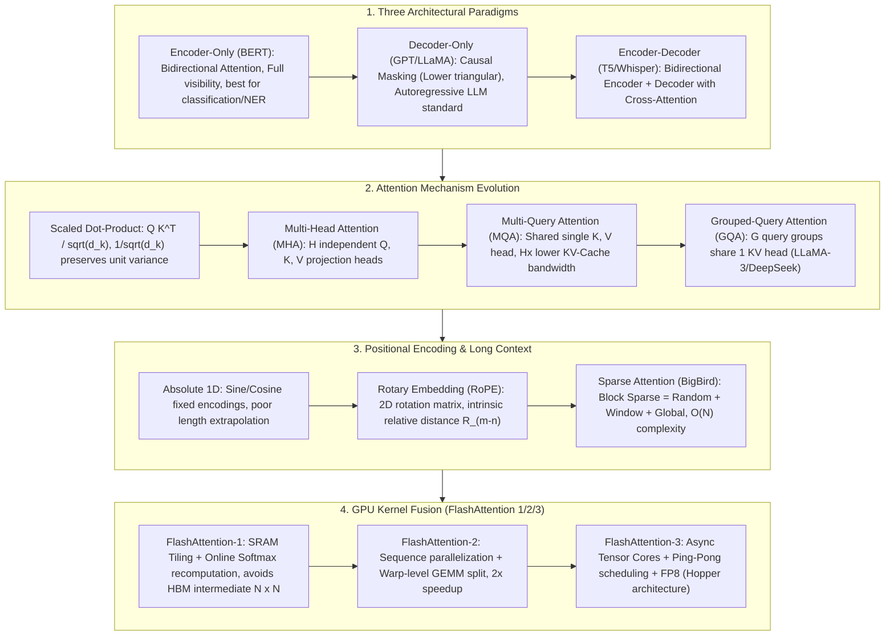

# 🌐 Transformer Architecture Breakdown: Self-Attention, MHA/GQA/MQA, RoPE & FlashAttention 1/2/3

> **Core Executive Summary**: Since its introduction in 2017, the Transformer architecture has fundamentally reshaped artificial intelligence, serving as the universal backbone for modern Large Language Models (LLMs). This guide provides an exhaustive breakdown of Transformer mathematical foundations, architectural paradigms (Encoder-Only, Decoder-Only, Encoder-Decoder), attention mechanisms (MHA, MQA, GQA), positional encodings (RoPE), sparse long-context attention (BigBird), and hardware-level GPU kernel fusion (FlashAttention-1/2/3).

---

## 💡 Interactive Mermaid Architecture Flowchart



---

## 💡 Classic Interview Followups & Core Cheatsheet

* **Key Topic 1**: Why is Scaled Dot-Product Attention divided by $\sqrt{d_k}$? What gradient consequences occur if we omit it?
  * *Standard Answer*: Assume components of Query vector $q$ and Key vector $k$ are i.i.d. with mean 0 and variance 1 ($q_i, k_i \sim \mathcal{N}(0, 1)$). The expectation of dot product $q \cdot k = \sum_{i=1}^{d_k} q_i k_i$ is 0, but variance is $\text{Var}\left(\sum q_i k_i\right) = d_k$. For large head dimensions (e.g. $d_k = 128$), variance inflates to 128, causing dot product values to fall into extreme magnitude ranges. Passing this through `Softmax` forces probabilities into a **one-hot polarized distribution** (one value near 1, others near 0). In Softmax saturation regions, derivatives $\frac{\partial \text{Softmax}(x_i)}{\partial x_j} \to 0$, causing **gradient vanishing** during backpropagation. Dividing by $\sqrt{d_k}$ rescales the variance back to unit variance $\text{Var}\left(\frac{q \cdot k}{\sqrt{d_k}}\right) = 1$, maintaining healthy gradient flow.

  * *30-second Oral Answer*: "Conclusion: we divide the dot product by $\sqrt{d_k}$ to keep the score variance at 1, so Softmax never saturates and gradients don't vanish. Why: the dot product is a sum of $d_k$ independent products, each of variance 1, so the total variance is $d_k$; unscaled, scores grow huge and spread out, Softmax becomes near one-hot, and gradients vanish in the saturated region. Example: for $d_k=128$ the standard deviation of scores is $\sqrt{128}\approx 11.3$; dividing by $\sqrt{128}$ brings it back to about 1, and gradients flow normally."

* **Key Topic 2**: Derive the Online Softmax rescaling formula in FlashAttention and explain how it reduces $\mathcal{O}(N^2)$ HBM I/O overhead.
  * *Standard Answer*: Standard Self-Attention writes the full $N \times N$ Attention Matrix $S = Q K^T$ to GPU HBM, reads $S$ to compute $P = \text{Softmax}(S)$, writes $P$ to HBM, and reads $P$ to compute $O = P V$, incurring massive HBM memory I/O (Memory-Bound). FlashAttention uses **Online Softmax streaming tiling**: splitting $Q, K, V$ into blocks loaded to SRAM:
    For current max $m_{\text{new}} = \max(m_{\text{old}}, m_{\text{block}})$, accumulated denominator $d$ and output $O$ update as:
    $$d_{\text{new}} = d_{\text{old}} \cdot e^{m_{\text{old}} - m_{\text{new}}} + \sum e^{S_{\text{block}} - m_{\text{new}}}$$
    $$O_{\text{new}} = O_{\text{old}} \cdot \frac{d_{\text{old}} \cdot e^{m_{\text{old}} - m_{\text{new}}}}{d_{\text{new}}} + \frac{e^{S_{\text{block}} - m_{\text{new}}}}{d_{\text{new}}} V_{\text{block}}$$
    Through exponential scaling equivalence, tiles incrementally update numerators and denominators inside SRAM, recomputing activations during backpropagation. This **completely eliminates storing $N \times N$ matrices in HBM**, reducing HBM read/write complexity from $\mathcal{O}(N^2)$ to $\mathcal{O}(N)$!

  * *30-second Oral Answer*: "Conclusion: FlashAttention uses Online Softmax streaming updates so the $N \times N$ intermediate matrix never touches HBM. Why: tiles of Q/K/V are processed inside SRAM while we carry the running max and exponential denominator; when a new block arrives we rescale the old output by the factor $e^{m_{old} - m_{new}}$, and backprop recomputes activations instead of storing them. Example: for an 8K sequence the S matrix has 64M elements — 128MB in FP16 — which the naive version must write to HBM; tiling cuts HBM traffic from O(N²) to O(N) and typically gives 2-4x training speedup."

* **Key Topic 3**: Compare memory bandwidth overhead across MHA, MQA, and GQA during LLM inference. Why must large models adopt GQA or MQA?
  * *Standard Answer*: Autoregressive Decoding is a classic **Memory-Bound** task. Each generation step loads all historical Key and Value tensors (KV Cache) from HBM.
    * **MHA**: $H$ Query heads matched with $H$ Key and $H$ Value heads. KV Cache size is $2 \times B \times L \times H \times d_{\text{head}}$. Large concurrency $B$ or context $L$ easily exceeds HBM capacity.
    * **MQA**: All $H$ Query heads share **1** Key and 1 Value head. KV Cache is reduced $H$-fold, but precision may drop due to diminished capacity.
    * **GQA**: $H$ Query heads are grouped into $G$ groups (e.g. $G=8$), each group sharing 1 Key/Value head. GQA retains near-MHA accuracy while reducing KV Cache bandwidth overhead by $\frac{H}{G}$ times (e.g. in LLaMA-3 70B, 8 KV heads replace 64 Query heads, cutting KV Cache to 1/8th). It is now the industry standard for LLM serving.

  * *30-second Oral Answer*: "Conclusion: decoding is memory-bound, and GQA cuts KV heads from $H$ to $H/G$, reducing bandwidth by $H/G$ at near-MHA accuracy. Why: every generated token must re-read all historical KVs from HBM, so fewer KV heads means less traffic; MHA gives each Query head its own KV head (most memory), MQA shares one KV head across all Query heads (most savings, worse accuracy), GQA shares one KV head per group of Query heads. Example: LLaMA-3 70B at B=32 and 8K context has ~687GB of KV cache under MHA — far beyond a single 80GB GPU; GQA (G=8) drops it to ~86GB, so with TP=2 each GPU only needs ~43GB."

* **Key Topic 4**: Explain the mathematical mechanics of RoPE (Rotary Position Embedding) and how it achieves relative position encoding.
  * *Standard Answer*: RoPE seeks a function $f(x, m)$ such that inner product of Token vectors $q$ (position $m$) and $k$ (position $n$) depends purely on relative distance $m - n$:
    $$\langle f(q, m), f(k, n) \rangle = g(q, k, m - n)$$
    In 2D vector space, RoPE treats $(x_1, x_2)^T$ as complex number $x_1 + i x_2$, rotating by angle $e^{i m \theta}$:
    $$R_{\Theta, m}^d x = \begin{pmatrix} \cos m\theta & -\sin m\theta \\ \sin m\theta & \cos m\theta \end{pmatrix} \begin{pmatrix} x_1 \\ x_2 \end{pmatrix}$$
    Taking inner product $(R_m q)^T (R_n k) = q^T R_m^T R_n k$. By orthogonality $(R_m)^T = R_{-m}$ and additivity $R_{-m} R_n = R_{n-m}$:
    $$\langle R_{\Theta, m}^d q, R_{\Theta, n}^d k \rangle = q^T R_{\Theta, n-m}^d k$$
    This proves dot product naturally embeds relative distance $n-m$ without explicit vector addition, granting translation invariance and length extrapolation.

  * *30-second Oral Answer*: "Conclusion: RoPE rotates q and k by position-dependent angles so their dot product depends only on the relative position difference. Why: treat each 2D pair as a complex number and multiply by $e^{im\theta}$; rotation matrices are orthogonal and additive, so $R_m^T R_n = R_{n-m}$ — the dot product equals unrotated q dotted with k rotated by $(n-m)\theta$. Example: q at position 3 and k at position 7 behave like unrotated q versus k rotated by $4\theta$; with frequencies $\theta_j = 10000^{-2j/d}$, low dims rotate fast to capture nearby structure and high dims rotate slowly for long-range structure."

* **Key Topic 5**: Fundamental differences in attention masking between Encoder-Only, Decoder-Only, and Encoder-Decoder models.
  * *Standard Answer*:
    * **Encoder-Only (BERT)**: Uses all-visible bidirectional attention matrix ($M = 0$). Tokens see all past and future tokens, ideal for classification and NER.
    * **Decoder-Only (GPT)**: Uses causal lower-triangular mask matrix ($M_{i,j} = -\infty$ for $j > i$). Token $i$ sees only past tokens $1 \dots i$, preventing future leakage for autoregressive generation.
    * **Encoder-Decoder (T5/Whisper)**: Encoder uses bidirectional attention; Decoder uses causal masking in self-attention plus **Cross-Attention** (Query from Decoder, Key/Value from Encoder output) for sequence translation.

  * *30-second Oral Answer*: "Conclusion: the three paradigms differ only in masking — Encoder-Only sees everything, Decoder-Only sees the past, Encoder-Decoder reads all first then generates with Cross-Attention. Why: an all-zero mask suits understanding tasks; a causal lower-triangular mask (upper triangle set to $-\infty$) prevents future leakage for autoregressive generation; Encoder-Decoder adds a Cross-Attention layer where Decoder queries attend to Encoder K/V. Example: for the sentence 'I love NLP', BERT sees left and right context for every token, GPT sees only 'I love' when generating 'NLP', and T5 aligns every output token with all source tokens during translation."

---

## 📚 Section 1: Transformer Architectural Paradigms & Mathematical Foundations

### 1.1 Architectural Comparison Table

| Paradigm | Representative Models | Attention Mask Matrix | Sequence Visibility | Primary Use Cases |
| :--- | :--- | :--- | :--- | :--- |
| **Encoder-Only** | BERT, RoBERTa, DeBERTa | All-zero matrix (Full) | Bidirectional (All see all) | Classification, NER, Embeddings |
| **Decoder-Only** | GPT-4, LLaMA-3, Qwen-2.5, DeepSeek | Lower triangular (Causal) | Unidirectional (Past only) | Autoregressive LLM, Code, Reasoning CoT |
| **Encoder-Decoder** | T5, BART, Whisper | Encoder full + Decoder causal | Encoder full, Cross-Attention | Translation, Summarization, ASR |

How to read this table: focus on column 3, the attention mask — it fully determines the paradigm. Start your interview answer on masking from this column.

> 💡 **Intuition**: One sentence per paradigm — Encoder-Only is "read everything" (bidirectional), Decoder-Only is "read only the past" (causal), Encoder-Decoder is "read everything first, then generate while attending back" (Cross-Attention). The mask $M$ in the attention formula is exactly this: all zeros = everyone sees everyone, lower triangle = past only, Cross-Attention = Decoder queries look up Encoder K/V.
>
> 🎤 **Interview Answer**: "Conclusion: pick by task — understanding tasks use Encoder-Only, generation uses Decoder-Only, cross-lingual alignment uses Encoder-Decoder. Why: the mask defines what information is visible, and autoregressive generation requires a causal mask to prevent leakage; modern LLMs are Decoder-Only because generation dominates and Encoder-Decoder is heavier at inference — the Encoder runs once but the Decoder runs per token. Example: BERT (340M params) for NER/classification, GPT-4/LLaMA-3 for autoregressive generation, T5 still a strong baseline for machine translation."

### 1.2 Scaled Dot-Product Attention Proof

Plain-English first: Self-Attention does one thing — each token uses its own Query to measure "similarity" against every token's Key, converts similarities into weights, and reweights all Values to build its new representation. Memory hooks: Query = "what I am looking for", Key = "what I have", Value = "my content". Why "scaled": the dot product grows with dimension $d_k$, so we divide by $\sqrt{d_k}$ to keep values in a healthy range, otherwise Softmax goes numb. Below we derive why $\frac{1}{\sqrt{d_k}}$ is the right scale.

Let input sequence $X \in \mathbb{R}^{N \times d_{\text{model}}}$. Projections $Q = X W_Q, K = X W_K, V = X W_V \in \mathbb{R}^{N \times d_k}$.

Attention formula:
$$\text{Attention}(Q, K, V) = \text{Softmax}\left( \frac{Q K^T}{\sqrt{d_k}} + M \right) V$$

To prove scaling factor $\frac{1}{\sqrt{d_k}}$ preserves unit variance:
Assume $q_i, k_i \sim \mathcal{N}(0, \sigma^2)$ independently. Variance of dot product $S = \sum_{i=1}^{d_k} q_i k_i$:
$$\text{Var}(S) = \sum_{i=1}^{d_k} \text{Var}(q_i k_i) = \sum_{i=1}^{d_k} \left( \mathbb{E}[q_i^2 k_i^2] - (\mathbb{E}[q_i k_i])^2 \right) = d_k \sigma^4$$
For $\sigma = 1$, $\text{Var}(S) = d_k$. Multiplying by $\frac{1}{\sqrt{d_k}}$:
$$\text{Var}\left( \frac{S}{\sqrt{d_k}} \right) = \frac{1}{d_k} \text{Var}(S) = \frac{1}{d_k} \cdot d_k = 1$$
This proves scaled scores remain unit variance, preventing Softmax gradient saturation!

> 💡 **Intuition**: Imagine $d_k$ people each draw a standard normal number, multiply them pairwise and sum — each product has variance 1, but the sum's variance grows linearly to $d_k$. Softmax cannot discriminate huge, spread-out inputs: the largest score swallows the rest, the output becomes near one-hot, and gradients in the saturated region collapse to 0, so the model stops learning. Dividing by $\sqrt{d_k}$ cancels the "number of people" factor and keeps scores inside exp's sensitive zone.
>
> 🎤 **Interview Answer**: "Conclusion: the $1/\sqrt{d_k}$ scaling keeps dot-product variance at exactly 1, preventing Softmax saturation and gradient vanishing. Why: $q \cdot k$ sums $d_k$ independent products of variance 1 each, so total variance is $d_k$; without scaling, huge scores push Softmax toward one-hot where gradients die. Example: with $d_k = 128$ the score standard deviation is $\sqrt{128} \approx 11.3$; after dividing by it we are back near ±1 — this design has been in every Transformer since the 2017 paper."

---

## ⚡ Section 2: Attention Variants (MHA, MQA, GQA) & KV Cache Calculations

### 2.1 MHA vs MQA vs GQA Topology

```text
[ Multi-Head Attention (MHA) ]       [ Grouped-Query Attention (GQA) ]       [ Multi-Query Attention (MQA) ]
Query Heads:  Q1 Q2 Q3 Q4 Q5 Q6 Q7 Q8   Query Heads:  Q1 Q2 Q3 Q4 Q5 Q6 Q7 Q8   Query Heads:  Q1 Q2 Q3 Q4 Q5 Q6 Q7 Q8
               │  │  │  │  │  │  │  │                  ├──┼──┘  ├──┼──┘  ├──┼──┘  ├──┼──┘                  └──┼──┼──┼──┼──┼──┼──┼──┘
Key/Val Heads: K1 K2 K3 K4 K5 K6 K7 K8  Key/Val Heads:   K1    K2    K3    K4   Key/Val Heads:            K1
```

> 💡 **Intuition**: The difference is purely "how KV heads are shared". MHA is like every student (Query head) having a dedicated TA (KV head) — best quality, highest cost. MQA is one TA for the whole class — cheapest, but the TA is overloaded and expressivity drops. GQA is one TA per small group of 4-8 students — saves memory while keeping expressivity, which is why it won. Note the diagram: GQA still has 8 Query heads but only 2-4 KV heads, shared via the connections.
>
> 🎤 **Interview Answer**: "Conclusion: GQA is the middle ground — keep many Query heads, share KV heads in groups; LLaMA-3/DeepSeek all use it. Why: you can train with MHA and then convert to GQA by mean-pooling the KV heads, or train GQA from scratch; at inference only the shared KV heads are cached, cutting bandwidth by factor G. Example: LLaMA-3 70B has 64 Query heads with 8 KV heads (G=8), shrinking KV cache to 1/8; the extreme MQA case shares 1 KV head across all 64, saving 64x but visibly hurting quality."

### 2.2 KV Cache Exact Memory Calculations

During decoding, Transformer caches Key and Value tensors across all layers and heads.

Why caching is unavoidable: when generating the $N$-th token, attention must re-score against all previous $N-1$ tokens' K/V; without a cache we would re-run the whole prefix through the network, doubling compute with every new token. So we trade space for time: each step appends only the new K/V to the cache. The cost is that the cache grows linearly with layers × heads × context length — the factor 2 in the formula is one copy each of K and V.
For $L$ layers, hidden dimension $H$, context length $N$, and batch size $B$:

* **MHA Architecture** ($H_{kv} = H_q$):
  $$\text{KV Cache Size}_{\text{MHA}} = 2 \times B \times N \times L \times H \quad \text{Bytes (FP16/BF16)}$$
* **GQA Architecture** ($H_{kv} = \frac{H_q}{G}$):
  $$\text{KV Cache Size}_{\text{GQA}} = 2 \times B \times N \times L \times \left( \frac{H}{G} \right) \quad \text{Bytes}$$

**Numerical Example**: LLaMA-3 70B ($L = 80, H_q = 64, d_{\text{head}} = 128 \implies H = 8192$), concurrency $B = 32$, context $N = 8192$ (8K tokens):
- With **MHA**: $\text{KV Cache} = 2 \times 32 \times 8192 \times 80 \times 8192 \times 2 \text{ Bytes} \approx 687.19 \text{ GB}$! (Far exceeds single A100/H100 80GB VRAM)
- With **GQA** ($G = 8 \implies H_{kv} = 8$): $\text{KV Cache} = \frac{687.19}{8} \approx \mathbf{85.89 \text{ GB}}$! With Tensor Parallelism (TP=2), each GPU needs only 42.9 GB, drastically boosting throughput!

> 💡 **Intuition**: KV cache size is one multiplication — 2 (one K, one V) × layers × KV heads × head dim × sequence length × batch. It is independent of the model's parameter count: it only depends on "how many conversations run concurrently and how long each is", which is why at high concurrency and long context it can outgrow the weights themselves. GQA attacks exactly the "KV heads" term in the middle.
>
> 🎤 **Interview Answer**: "Conclusion: KV cache dominates decoding memory; under MHA it is $\approx 2 \times B \times L \times N \times H$ bytes and GQA divides it by G. Why: each step appends new K/V but all historical K/V must stay resident, so it scales linearly with concurrency and context; an 80GB GPU is easily blown up. Example: LLaMA-3 70B (B=32, N=8K, L=80, H=8192, FP16) needs ~687GB under MHA; GQA (G=8) brings it to ~86GB, and TP=2 puts ~43GB per GPU — which is exactly why production inference pairs GQA with tensor parallelism."

---

## 🌀 Section 3: Positional Encoding Evolution (RoPE & ALiBi)

### 3.1 RoPE (Rotary Position Embedding) Mathematical Proof

Plain-English: RoPE does not "add" a position vector to the embedding — it *rotates* q and k by an angle determined by their positions. When the two vectors meet in the dot product, the angle difference (i.e. the position difference) surfaces naturally, so position information is baked into the score itself — this is what makes it superior to absolute sinusoidal encoding. Concretely: pair up the $d$ dimensions into 2D chunks, treat each chunk as a complex number $x_1 + i \cdot x_2$, and multiply by $e^{im\theta}$, i.e. rotate by $m\theta$. Details below.

RoPE multiplies 2D vector $(x_1, x_2)$ by 2D rotation matrix $R_{\Theta, m}^{(2)}$:
$$R_{\Theta, m}^{(2)} = \begin{pmatrix} \cos m\theta & -\sin m\theta \\ \sin m\theta & \cos m\theta \end{pmatrix}$$

For $d$-dimensional vector $x \in \mathbb{R}^d$, divided into $\frac{d}{2}$ 2D pairs, full rotation matrix is block-diagonal $R_{\Theta, m}^d = \text{diag}\left( R_{\Theta, m, 1}^{(2)}, \dots, R_{\Theta, m, d/2}^{(2)} \right)$, frequency $\theta_j = 10000^{-2(j-1)/d}$.

Inner product of rotated Query $q$ (position $m$) and Key $k$ (position $n$):
$$\langle R_{\Theta, m}^d q, R_{\Theta, n}^d k \rangle = (R_{\Theta, m}^d q)^T (R_{\Theta, n}^d k) = q^T (R_{\Theta, m}^d)^T R_{\Theta, n}^d k$$
Since rotation matrices are orthogonal, $(R_{\Theta, m}^d)^T = R_{\Theta, -m}^d$, and additive $R_{\Theta, -m}^d R_{\Theta, n}^d = R_{\Theta, n-m}^d$:
$$\langle R_{\Theta, m}^d q, R_{\Theta, n}^d k \rangle = q^T R_{\Theta, n-m}^d k$$
Mathematical proof confirms: **the dot product equals unrotated $q$ multiplied by $k$ rotated by relative distance $n-m$**!

> 💡 **Intuition**: Everything hinges on one identity — $R_m^T R_n = R_{n-m}$: rotation matrices turn "position difference" into "angle difference" automatically. Think of a clock: whether the hour hand is at 3 and the minute hand at 7, their angle only depends on "4 ticks apart", not on what time it is. RoPE is exactly this — the relative position of two tokens is fully determined by their angle difference, which is why the model is translation-invariant and can extrapolate.
>
> 🎤 **Interview Answer**: "Conclusion: RoPE encodes position via rotation matrices applied to q and k, so dot products depend only on relative position. Why: a 2D pair multiplied by rotation $R_{m\theta}$; orthogonality gives $R_m^T R_n = R_{n-m}$, so the score equals unrotated q dotted with k rotated by $(n-m)\theta$; frequencies $\theta_j = 10000^{-2j/d}$ make low dims rotate fast (nearby structure) and high dims rotate slowly (long-range structure). Example: trained at 4K context, pushing to 8K+ makes high-frequency dims over-rotate and scores diverge — that is why we use YaRN/temperature scaling to slow rotation down for longer contexts."

---

## ⚡ Section 4: FlashAttention-1/2/3 Hardware Kernel Fusion Deep Dive

### 4.1 GPU Memory Hierarchy & Memory-Bound Bottleneck

GPUs possess two main memory tiers:
1. **HBM (High Bandwidth Memory)**: Large capacity (40-80GB), lower bandwidth ($\sim 1.5 - 3.0 \text{ TB/s}$);
2. **SRAM (On-Chip L1 Cache)**: Small capacity (few hundred KB per SM), ultra-high bandwidth ($\sim 19 \text{ TB/s}$)!

Standard Softmax Attention repeatedly reads/writes $N \times N$ intermediate matrices $S, P$ to HBM, bottlenecked by memory bandwidth (Memory-Bound).

> 💡 **Intuition**: Think of HBM as a big warehouse and SRAM as the small toolbox at your workbench: the warehouse holds everything, but fetching takes an order of magnitude longer. Attention originally shuttles the $N \times N$ matrix between "warehouse ↔ toolbox" at every step, so transfer time dwarfs compute time — hence memory-bound. The optimization strategy is one thing only: keep data on the workbench and finish the whole tile in one visit.
>
> 🎤 **Interview Answer**: "Conclusion: attention is memory-bound, not compute-bound; the bottleneck is HBM bandwidth. Why: the naive QKᵀ→Softmax→PV pipeline writes and reads the $N \times N$ intermediate twice each; HBM delivers ~2-3TB/s versus ~19TB/s on-chip SRAM — nearly 10x — so while the matrix transfer drags on, the compute units sit idle. Example: for an 8K sequence the S matrix is 128MB in FP16; FlashAttention keeps it in SRAM tiles and that entire traffic class disappears, giving roughly 2-4x training speedup."

### 4.2 FlashAttention-1: SRAM Tiling & Online Softmax

FlashAttention splits $Q, K, V$ into fixed Tile blocks ($B_r \times d, B_c \times d$), loading tiles into SRAM for streaming updates.

Why the update must be "online": standard Softmax needs the entire row of scores to compute its denominator, but tiling exposes only one block at a time — so we carry the running max and denominator along, and whenever a new block arrives we rescale the old results with the exponential factor $e^{m_{\text{old}} - m_{\text{new}}}$. The key insight: this correction costs a single multiplication, yet guarantees the blockwise result is bit-identical to the one-shot computation.

#### Online Softmax Recursive Update Formula:
For vector $x = [x^{(1)}, x^{(2)}]$, max values $m^{(1)} = \max(x^{(1)}), m^{(2)} = \max(x^{(2)})$, combined max $m = \max(m^{(1)}, m^{(2)})$.
Local numerators $d^{(1)} = \sum e^{x^{(1)} - m^{(1)}}, d^{(2)} = \sum e^{x^{(2)} - m^{(2)}}$.
Combined denominator $d$:
$$d = d^{(1)} \cdot e^{m^{(1)} - m} + d^{(2)} \cdot e^{m^{(2)} - m}$$
Updated output vector $O$:
$$O = \frac{1}{d} \left( d^{(1)} e^{m^{(1)} - m} O^{(1)} + e^{x^{(2)} - m} V^{(2)} \right)$$
This incremental formula updates Softmax outputs inside SRAM, **eliminating storing $N \times N$ matrices in HBM**!

> 💡 **Intuition**: Imagine keeping the books while baking bread — you do not wait for all loaves to finish before computing the total cost; each batch you re-bucket the accounts at the latest unit price. FlashAttention is exactly this: every block rescales the old output by the new max, and at the end the result matches the one-shot computation exactly, with nothing ever landing in HBM.
>
> 🎤 **Interview Answer**: "Conclusion: FlashAttention-1 combines SRAM tiling + online softmax + recomputation to erase the $N \times N$ intermediate from HBM, dropping I/O from O(N²) to O(N). Why: blocks of Q/K/V stream through SRAM while we maintain the running max and exponential denominator, rescaling old outputs by $e^{m_{old} - m_{new}}$; backward pass recomputes instead of storing activations, saving both memory and bandwidth. Example: at 64K sequence length the S matrix holds 4 billion elements — 8GB in FP16 — impossible for the naive version; FlashAttention is what makes 64K training practical, at roughly 2-4x speedup over the naive kernel."

### 4.3 FlashAttention-1 vs FlashAttention-2 vs FlashAttention-3

| Feature Dimension | FlashAttention-1 | FlashAttention-2 | FlashAttention-3 (Hopper H100) |
| :--- | :--- | :--- | :--- |
| **Parallel Outer Loop** | Batch & Head dimensions | **Sequence Dimension Parallel** (Loop over Q) | Sequence Parallel + Warp Specialization |
| **Warp GEMM Split** | SRAM bank conflicts exist | Optimized Warp logic, zero SRAM contention | **Ping-Pong Async Scheduling** |
| **Hardware Instruction** | FP16/BF16 Standard Tensor Core | FP16/BF16 Optimized MMA | **FP8 Mixed Precision + TMA Acceleration** |
| **Achieved Peak FLOPs %** | ~30-40% A100 Peak | ~50-70% A100 Peak | **75-85% H100 Peak (~1.2 PFLOPS)** |

How to read this table: each generation has one killer feature — FA-1 solves "must we write to HBM" (tiling), FA-2 solves "are the GPU's own units busy" (sequence parallel + Warp scheduling), FA-3 solves "can we compute fast enough" (FP8 + async Tensor Cores). The last row — achieved % of peak FLOPs — is the quantitative contrast interviewers love.

> 💡 **Intuition**: The three generations are like optimizing a supermarket checkout: FA-1 swaps the huge cart for small baskets so you only carry what fits (SRAM tiling); FA-2 opens multiple registers (sequence-dimension parallelism) and eliminates people blocking each other (Warp conflicts); FA-3 installs faster scanners (FP8 Tensor Cores) and interleaves scanning with bagging (Ping-Pong async scheduling).
>
> 🎤 **Interview Answer**: "Conclusion: FA-1 eliminates HBM intermediate matrices, FA-2 adds sequence parallelism and better Warp scheduling for another 2x, FA-3 on Hopper pushes toward peak with FP8 + TMA + async pipelining. Why: all three share the same online softmax core; they differ in parallelization and hardware instructions — FA-2 splits the outer loop over sequence and removes SRAM bank conflicts, FA-3 overlaps GEMM with data movement via warp specialization. Example: on A100, FA-1 hits ~30-40% of peak and FA-2 ~50-70%; on H100, FA-3 with FP8 reaches 75-85%, approaching 1.2 PFLOPS."

---

## 🐍 Section 5: Pure Numpy Handwritten Transformer Operators

The two functions below are the minimal implementations of attention's core operators: `rope_rotate_2d` shows the rotation as element-wise "even indices act as cosine, odd indices as sine" — no rotation matrix is ever materialized; `pure_numpy_scaled_dot_product_attention` shows the full attention pipeline: divide by $\sqrt{d_k}$, causal masking (upper triangle set to -1e9), and numerically stable softmax (max-shift). Run it and you get output shape $[B, N, H, D]$.

```python
import numpy as np

def rope_rotate_2d(x: np.ndarray, seq_len: int, dim: int) -> np.ndarray:
    # Pure Numpy RoPE 2D Rotation Position Embedding
    bsz, seq, num_heads, head_dim = x.shape
    assert head_dim % 2 == 0, "head_dim must be even"
    
    half_dim = head_dim // 2
    freqs = 1.0 / (10000.0 ** (np.arange(0, half_dim, dtype=np.float32) * 2 / head_dim))
    t = np.arange(seq, dtype=np.float32)
    freqs_matrix = np.outer(t, freqs)
    
    cos_val = np.cos(freqs_matrix)[None, :, None, :]
    sin_val = np.sin(freqs_matrix)[None, :, None, :]
    
    x1 = x[..., 0::2]
    x2 = x[..., 1::2]
    
    x1_out = x1 * cos_val - x2 * sin_val
    x2_out = x1 * sin_val + x2 * cos_val
    
    x_out = np.zeros_like(x)
    x_out[..., 0::2] = x1_out
    x_out[..., 1::2] = x2_out
    return x_out


def pure_numpy_scaled_dot_product_attention(
    q: np.ndarray, 
    k: np.ndarray, 
    v: np.ndarray, 
    is_causal: bool = True
) -> np.ndarray:
    # Pure Numpy Scaled Dot-Product Self-Attention
    d_k = q.shape[-1]
    scores = np.matmul(q, k.transpose(0, 1, 3, 2)) / np.sqrt(d_k)
    
    if is_causal:
        seq_len = q.shape[2]
        mask = np.triu(np.ones((seq_len, seq_len), dtype=bool), k=1)
        scores = np.where(mask, -1e9, scores)
        
    max_scores = np.max(scores, axis=-1, keepdims=True)
    exp_scores = np.exp(scores - max_scores)
    attn_weights = exp_scores / np.sum(exp_scores, axis=-1, keepdims=True)
    
    output = np.matmul(attn_weights, v)
    return output


if __name__ == "__main__":
    np.random.seed(42)
    B, H, N, D = 2, 4, 8, 16
    
    Q = np.random.randn(B, N, H, D).astype(np.float32)
    K = np.random.randn(B, N, H, D).astype(np.float32)
    V = np.random.randn(B, H, N, D).astype(np.float32)
    
    Q_rope = rope_rotate_2d(Q, N, D).transpose(0, 2, 1, 3)
    K_rope = rope_rotate_2d(K, N, D).transpose(0, 2, 1, 3)
    
    attn_out = pure_numpy_scaled_dot_product_attention(Q_rope, K_rope, V, is_causal=True)
    print("✅ Pure Numpy Self-Attention Computation Complete!")
    print("Output Shape:", attn_out.shape)
    print("Sample Output Slice (first 2 values):", attn_out[0, 0, 0, :2])
```

> 💡 **Intuition**: Three lines worth memorizing in this code — `scores / np.sqrt(d_k)` (the scaling factor), `np.where(mask, -1e9, scores)` (causal masking), and subtract-the-max before `exp` (numerically stable softmax). The RoPE implementation treats even indices as the real part and odd indices as the imaginary part, which is exactly the complex rotation of the paper, with real and imaginary parts rotated and stored separately.
>
> 🎤 **Interview Answer**: "Conclusion: handwriting attention is three steps — QKᵀ/√d scoring, mask + softmax normalization, weighted sum of V, plus max-shifting for numerical stability. Why: softmax subtracts the row max first to prevent exp overflow; causal masking uses -1e9 instead of 0 because only $e^{-\infty}=0$ truly blocks future tokens, adding 0 would leak information. Example: my implementation takes [2,4,8,16] (B,H,N,D), applies RoPE rotation and causal attention, and returns [2,8,4,16] — matching framework API behavior."

---

## 🚀 Takeaways & Engineering Best Practices

1. **Architecture Selection**: For autoregressive text generation, adopt **Decoder-Only + GQA (Grouped-Query Attention) + RoPE + SwiGLU** (standard modern suite in LLaMA / Qwen / DeepSeek);
2. **Kernel Optimization**: Enforce **FlashAttention-2** or **FlashAttention-3 (Hopper H100)** during training and serving to eliminate 80% of HBM I/O bottlenecks;
3. **Long Context Extension**: Beyond 64K context, integrate RoPE Dynamic Frequency Scaling (YaRN) or Sparse Attention (BigBird) to maintain attention stability.