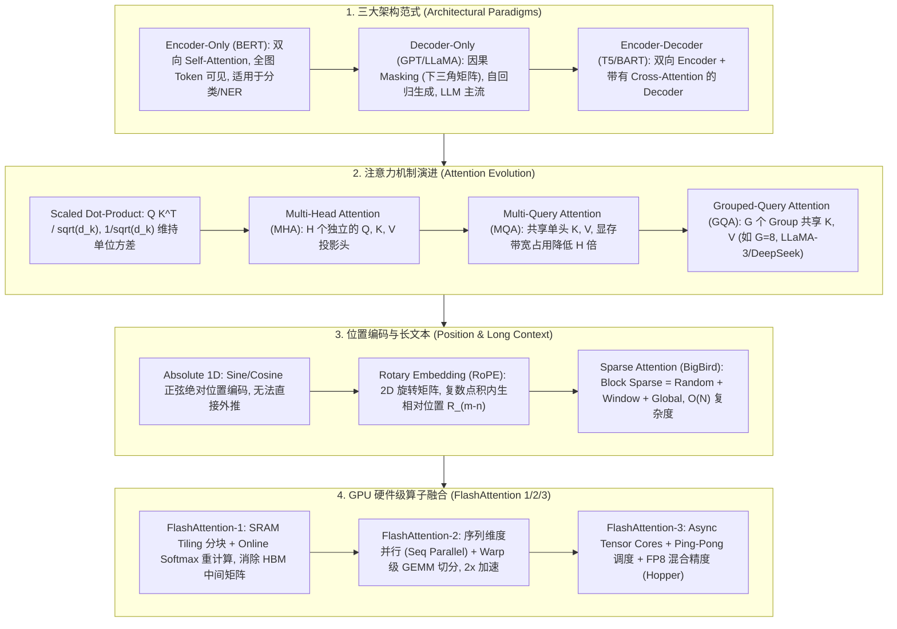

# 🌐 Transformer 架构解构：Self-Attention、MHA/GQA/MQA、RoPE 与 FlashAttention 1/2/3 算子融合全景

> **核心摘要**：Transformer 架构自 2017 年问世以来，已彻底重塑了自然语言处理、计算机视觉、语音与多模态人工智能的格局，成为生成式大语言模型 (LLM) 的基石。本指南系统剖析 Transformer 的核心数学推导、三大模型范式 (Encoder-Only, Decoder-Only, Encoder-Decoder)、注意力变体演进 (MHA → MQA → GQA)、位置编码 (RoPE/ALiBi)、长文本稀疏注意力 (BigBird) 以及 GPU 硬件级算子融合优化 (FlashAttention-1/2/3)。

---

## 💡 交互式 Mermaid 结构流程图



---

## 💡 经典面试追问与考点速查

* **考点 1**：为什么 Scaled Dot-Product Attention 的点积结果要除以 $\sqrt{d_k}$？若不除会导致什么梯度后果？
  * *标准回答*：假设 Query 向量 $q$ 与 Key 向量 $k$ 的每个分量均服从均值为 0、方差为 1 的独立同分布（即 $q_i, k_i \sim \mathcal{N}(0, 1)$）。则点积结果 $q \cdot k = \sum_{i=1}^{d_k} q_i k_i$ 的期望为 $0$，但方差为 $\text{Var}\left(\sum_{i=1}^{d_k} q_i k_i\right) = \sum_{i=1}^{d_k} \text{Var}(q_i k_i) = d_k$。当 Head 维度 $d_k$ 较大时（如 $d_k = 128$），点积数值的方差膨胀为 128，导致点积结果落在极大幅值区域。经过 `Softmax` 函数后，概率分布会趋近于 **One-hot 极化分布**（某个值接近 1，其余极度接近 0）。在 Softmax 的饱和区，导数 $\frac{\partial \text{Softmax}(x_i)}{\partial x_j} \to 0$，引发**梯度消失 (Gradient Vanishing)**，模型无法正常反向传播学习。除以 $\sqrt{d_k}$ 能将点积缩放回单位方差 $\text{Var}\left(\frac{q \cdot k}{\sqrt{d_k}}\right) = 1$，维持梯度的健康流动。

  * *面试速答 (30 秒口述版)*: "结论: 点积除以 $\sqrt{d_k}$ 是为了把分数方差拉回 1,防止 Softmax 饱和造成梯度消失。原理: 点积是 $d_k$ 个独立乘积之和,每个乘积方差为 1,总和方差就膨胀成 $d_k$;不缩放时分数巨大且分散,经过 Softmax 变成近似 one-hot,饱和区导数趋近 0,反向传播梯度消失。例子: $d_k=128$ 时不缩放的分数的标准差是 $\sqrt{128}\approx 11.3$,分数落在 ±11 附近;除以 $\sqrt{128}$ 后标准差回到 1,分数回到 ±1 附近,梯度健康流动。"

* **考点 2**：推导 FlashAttention 中 Online Softmax 的数值缩放公式，并说明它如何节省 $\mathcal{O}(N^2)$ 的 HBM 读写开销？
  * *标准回答*：传统 Self-Attention 计算需要将完整 $N \times N$ 的 Attention Matrix $S = Q K^T$ 写入 GPU HBM（显存），然后读取 $S$ 计算 $P = \text{Softmax}(S)$，再写入 HBM，最后读取 $P$ 计算 $O = P V$，引发海量高延迟的 HBM 显存 I/O（Memory-Bound）。FlashAttention 利用 **Online Softmax 分块流式更新算法**，将 $Q, K, V$ 切块加载到 SRAM（片上高速缓存）：
    设当前块的最大值为 $m_{\text{new}} = \max(m_{\text{old}}, m_{\text{block}})$，则旧累加值 $d_{\text{old}}$ 与旧输出 $O_{\text{old}}$ 的更新公式为：
    $$d_{\text{new}} = d_{\text{old}} \cdot e^{m_{\text{old}} - m_{\text{new}}} + \sum e^{S_{\text{block}} - m_{\text{new}}}$$
    $$O_{\text{new}} = O_{\text{old}} \cdot \frac{d_{\text{old}} \cdot e^{m_{\text{old}} - m_{\text{new}}}}{d_{\text{new}}} + \frac{e^{S_{\text{block}} - m_{\text{new}}}}{d_{\text{new}}} V_{\text{block}}$$
    通过数学上的指数等价变换，在仅占用 SRAM 的情况下按 Tile 分块增量更新分母与分子，反向传播时通过重计算 (Recomputation) 重新生成激活值，**彻底省去了在 HBM 中存储 $N \times N$ 矩阵的显存读写**，将 HBM 读写开销从 $\mathcal{O}(N^2)$ 降低至 $\mathcal{O}(N)$！

  * *面试速答 (30 秒口述版)*: "结论: FlashAttention 用 Online Softmax 分块流式更新,让 $N \times N$ 中间矩阵彻底留在 SRAM 里,不写 HBM。原理: 每算完一个分块,就用最新的 max 和分母把旧结果按 $e^{m_{\text{old}} - m_{\text{new}}}$ 这个指数因子'校正'到新尺度再合并,最后结果和一次性算完全一致;反向传播不存激活值而是重算。例子: 8K 序列的 S 矩阵有 6400 万个元素,FP16 就是 128MB,标准实现必须写进 HBM;tiling 后读写量从 O(N²) 降到 O(N),训练通常加速 2-4 倍。"

* **考点 3**：对比 MHA (Multi-Head Attention)、MQA (Multi-Query Attention) 与 GQA (Grouped-Query Attention) 的显存带宽占用，为什么大模型推理必须采用 GQA 或 MQA？
  * *标准回答*：自回归解码（Inference Decoding）阶段是典型的 **Memory-Bound** 任务。在每一步 Token 生成时，模型需要从 HBM 加载历史所有 Token 的 Key 和 Value (KV Cache)。
    * **MHA**：$H$ 个 Query 头对应 $H$ 个 Key 头与 $H$ 个 Value 头。KV Cache 显存大小为 $2 \times B \times L \times H \times d_{\text{head}}$。当并发数 $B$ 或上下文长度 $L$ 极大时，KV Cache 显存直接挤爆 HBM。
    * **MQA**：所有 $H$ 个 Query 头共享 **1 个** Key 头与 Value 头。KV Cache 显存降低 $H$ 倍，但由于表达能力削弱，可能导致模型精度下降。
    * **GQA**：将 $H$ 个 Query 头分为 $G$ 个组（如 $G=8$），每组共享 1 个 Key/Value 头。GQA 在保持接近 MHA 高精度的同时，将 KV Cache 带宽占用降低了 $\frac{H}{G}$ 倍（如在 LLaMA-3 70B 中，8 个 KV 头替代 64 个 Query 头，KV Cache 显存减少至 1/8），是当前 SOTA LLM 推理加速的标准规范。

  * *面试速答 (30 秒口述版)*: "结论: 推理是 memory-bound 任务,GQA 把 KV 头从 $H$ 个减到 $H/G$ 个,带宽占用省下 $H/G$ 倍,是精度与显存的折中。原理: 自回归每生成一个 token,都要把历史全部 KV 从 HBM 读一遍参与 attention,读的越少越快;MHA 每个 Query 头配一个 KV 头,显存最贵;MQA 全部 Query 头共享 1 个 KV 头,最省但精度掉;GQA 把 Query 头分成 G 组、每组共享 1 个 KV 头。例子: LLaMA-3 70B 在 B=32、8K 上下文下,MHA 的 KV cache 约 687GB,单卡 80GB 装不下;GQA(G=8) 降到 86GB,配 TP=2 每卡 42.9GB 就能服务。"

* **考点 4**：详细说明 RoPE (Rotary Position Embedding) 的复数旋转原理及其如何实现相对位置关系的内生编码？
  * *标准回答*：RoPE 的设计目标是寻找一个函数 $f(x, m)$，使得两个 Token 向量 $q$（位置 $m$）与 $k$（位置 $n$）内积后，仅依赖于它们的相对位置差值 $m - n$：
    $$\langle f(q, m), f(k, n) \rangle = g(q, k, m - n)$$
    在二维向量空间中，RoPE 将二维向量 $x = (x_1, x_2)^T$ 看作复数 $x_1 + i x_2$，通过乘以旋转因子 $e^{i m \theta}$ 实现角度旋转：
    $$R_{\Theta, m}^d x = \begin{pmatrix} \cos m\theta & -\sin m\theta \\ \sin m\theta & \cos m\theta \end{pmatrix} \begin{pmatrix} x_1 \\ x_2 \end{pmatrix}$$
    当旋转后的 Query $R_m q$ 与旋转后的 Key $R_n k$ 进行点积时，根据矩阵转置性质 $(R_m q)^T (R_n k) = q^T R_m^T R_n k$，利用三角恒等式可得 $R_m^T R_n = R_{n-m}$！点积结果直接内含了 $R_{n-m}$，无需显式相加绝对位置向量，天然具备优雅的相对位置平移不变性与长文本外推潜能。

  * *面试速答 (30 秒口述版)*: "结论: RoPE 是把 q 和 k 各旋转一个随位置变化的角度,旋转后做点积,角度差正好等于位置差,相对位置就内生编码了。原理: 二维向量看成复数 $x_1 + ix_2$,乘 $e^{im\theta}$ 就是旋转 $m\theta$;旋转矩阵正交且可加,两个旋转矩阵一相乘 $R_m^T R_n = R_{n-m}$,点积只依赖相对距离。例子: 位置 3 的 q 与位置 7 的 k 的点积,等于不旋转的 q 与旋转了 $4\theta$ 的 k 做点积;频率 $\theta_j = 10000^{-2j/d}$ 让不同维度转不同速度——低维转得快捕捉近距离,高维转得慢捕捉长距离。"

* **考点 5**：Encoder-Only (BERT)、Decoder-Only (GPT) 与 Encoder-Decoder (T5) 在 Masking 机制与注意力矩阵上的本质区别？
  * *标准回答*：
    * **Encoder-Only (BERT)**：采用全可见双向注意力（Bidirectional Attention Matrix），掩码矩阵 $M$ 全为 0（无 Mask），任意 Token 均可看见序列中的前向与后向上下文，适合上下文理解、文本分类与 NER 抽取。
    * **Decoder-Only (GPT)**：采用因果下三角注意力（Causal Mask Matrix），掩码矩阵上三角元素为 $-\infty$（使 Softmax 概率为 0），第 $i$ 个 Token 只能看见前 $1 \dots i$ 个 Token，防止未来信息泄漏，完美适配单向自回归生成。
    * **Encoder-Decoder (T5/BART)**：Encoder 部分使用双向注意力提取源序列特征；Decoder 部分在自注意力层使用因果掩码，同时包含 **Cross-Attention 层**（Query 来自 Decoder，Key/Value 来自 Encoder 最后一层输出），实现源语言到目标语言的跨序列对齐。

  * *面试速答 (30 秒口述版)*: "结论: 三种架构的本质区别在掩码决定的可见性——Encoder-Only 全可见,Decoder-Only 只见过去,Encoder-Decoder 先全读再带 Cross-Attention 生成。原理: Encoder-Only 掩码全 0 适合理解类任务;Decoder-Only 用下三角因果掩码(上三角置 $-\infty$),保证自回归不泄漏未来;Encoder-Decoder 的 Decoder 除了因果自注意力,还多一层 Cross-Attention,用 Decoder 的 Q 去查 Encoder 的 K/V。例子: 同一句 'I love NLP',BERT 里每个词能同时看到左右两边,GPT 生成 'NLP' 时只见 'I love',T5 翻译时每个输出 token 都能对齐到源句全部词。"

---

## 📚 第一章：Transformer 三大范式与核心数学推导

### 1.1 架构对比与注意力矩阵掩码

下表对比了 Transformer 三大架构范式的特征与应用：

| 架构范式 | 代表模型 | 注意力掩码矩阵 (Attention Mask) | 序列可见性 (Visibility) | 核心应用场景 |
| :--- | :--- | :--- | :--- | :--- |
| **Encoder-Only** | BERT, RoBERTa, DeBERTa | 全零矩阵 (全可见) | 双向全序列可互相 Sees All | 文本分类、实体识别 (NER)、句向量 Embeddings |
| **Decoder-Only** | GPT-4, LLaMA-3, Qwen-2.5, DeepSeek | 下三角矩阵 (Causal Mask) | 仅单向看见前序 Tokens | 自回归大语言模型 (LLM)、代码生成、推理 CoT |
| **Encoder-Decoder** | T5, BART, Whisper | Encoder 双向 + Decoder 因果 | Encoder 全双向, Cross-Attention 交叉匹配 | 机器翻译、文本摘要、语音识别 (ASR) |

读表技巧: 抓住第三列"注意力掩码矩阵"——它直接决定了架构范式,面试对比三种架构时从这一列说起即可。

> 💡 **直观理解**: 三种架构一句话——Encoder-Only 是"全读"(双向),Decoder-Only 是"只读过去"(因果),Encoder-Decoder 是"先全读,再边读边写"(Cross-Attention)。掩码矩阵就是注意力公式里加的那个 $M$: 全零 = 谁都能看,下三角 = 只能看前面,Cross-Attention = Decoder 的 Q 去查 Encoder 的 K/V。
>
> 🎤 **面试速答**: "结论: 理解类任务用 Encoder-Only,生成任务用 Decoder-Only,跨语言对齐用 Encoder-Decoder。原理: 掩码决定信息可见范围,自回归生成必须因果掩码防未来泄漏;LLM 统一用 Decoder-Only,是因为生成任务占绝大多数,而且 Encoder-Decoder 推理时 Encoder 只算一次、Decoder 每步都要算,工程上更重。例子: BERT 3.4 亿参数做 NER/分类,GPT-4/LLaMA-3 是纯 Decoder-Only 自回归,T5 在机器翻译上仍是强基线。"

### 1.2 Scaled Dot-Product Attention 数理推导

先给大白话: Self-Attention 干的事一句话——每个 token 用自己的 Query 去和所有 token 的 Key 比"相似度",把相似度归一化成权重,再用权重加权所有 Value,得到自己新的表示。三个角色的记忆口诀: Query = "我在找什么",Key = "我有什么",Value = "我的内容"。至于为什么叫 scaled(缩放): 点积结果会随维度 $d_k$ 变大而变大,必须除以 $\sqrt{d_k}$ 把数值拉回正常量级,否则 Softmax 会"钝化"。下面从投影公式开始推导缩放因子的必要性。

设输入特征序列 $X \in \mathbb{R}^{N \times d_{\text{model}}}$，通过三个可学习权重矩阵 $W_Q, W_K, W_V \in \mathbb{R}^{d_{\text{model}} \times d_k}$ 投影得到 Query, Key, Value 矩阵：
$$Q = X W_Q, \quad K = X W_K, \quad V = X W_V \quad \in \mathbb{R}^{N \times d_k}$$

注意力分数的计算公式为：
$$\text{Attention}(Q, K, V) = \text{Softmax}\left( \frac{Q K^T}{\sqrt{d_k}} + M \right) V$$

其中 $M$ 为掩码矩阵。为了证明缩放因子 $\frac{1}{\sqrt{d_k}}$ 的数值稳定性意义：
假设 $q_i \sim \mathcal{N}(0, \sigma^2), k_i \sim \mathcal{N}(0, \sigma^2)$ 且相互独立。点积 $S = \sum_{i=1}^{d_k} q_i k_i$ 的方差推导如下：
$$\text{Var}(S) = \sum_{i=1}^{d_k} \text{Var}(q_i k_i) = \sum_{i=1}^{d_k} \left( \mathbb{E}[q_i^2 k_i^2] - (\mathbb{E}[q_i k_i])^2 \right)$$
因为 $\mathbb{E}[q_i] = 0, \mathbb{E}[k_i] = 0$，故 $\mathbb{E}[q_i^2] = \text{Var}(q_i) = \sigma^2$。因此：
$$\text{Var}(S) = \sum_{i=1}^{d_k} \sigma^2 \cdot \sigma^2 = d_k \sigma^4$$
当 $\sigma = 1$ 时，$\text{Var}(S) = d_k$。若将点积乘以 $\frac{1}{\sqrt{d_k}}$：
$$\text{Var}\left( \frac{S}{\sqrt{d_k}} \right) = \frac{1}{d_k} \text{Var}(S) = \frac{1}{d_k} \cdot d_k = 1$$
数学证明证明缩放后变量恢复标准方差，防止 Softmax 函数进入梯度饱和区！

> 💡 **直观理解**: 想象让 $d_k$ 个人每人出一个标准正态随机数,两两相乘再求和——乘积的方差为 1,但 $d_k$ 个相加后总方差线性膨胀成 $d_k$。Softmax 对"巨大且分散"的输入毫无分辨力: 最大的分数直接吞掉其他所有,输出逼近 one-hot,此时导数趋近 0,模型学不动。除以 $\sqrt{d_k}$ 相当于消掉"人数"这个因子,让分数永远待在 exp 的敏感区。
>
> 🎤 **面试速答**: "结论: 缩放因子 $1/\sqrt{d_k}$ 保证点积方差恒为 1,避免 Softmax 饱和造成梯度消失。原理: $q \cdot k$ 是 $d_k$ 个独立乘积之和,每个乘积方差 1,总和方差 = $d_k$;分数巨大化后 Softmax 输出逼近 one-hot,饱和区梯度趋近 0。例子: $d_k = 128$ 时点积标准差是 $\sqrt{128} \approx 11.3$,分数落在 ±11 附近;除以 $\sqrt{128}$ 后回到 ±1 附近——这个设计从 2017 年原始 Transformer 论文就有,所有现代模型沿用。"

---

## ⚡ 第二章：注意力变体 (MHA, MQA, GQA) 与 KV Cache 显存计算

### 2.1 MHA vs MQA vs GQA 拓扑结构

```text
[ Multi-Head Attention (MHA) ]       [ Grouped-Query Attention (GQA) ]       [ Multi-Query Attention (MQA) ]
Query Heads:  Q1 Q2 Q3 Q4 Q5 Q6 Q7 Q8   Query Heads:  Q1 Q2 Q3 Q4 Q5 Q6 Q7 Q8   Query Heads:  Q1 Q2 Q3 Q4 Q5 Q6 Q7 Q8
               │  │  │  │  │  │  │  │                  ├──┼──┘  ├──┼──┘  ├──┼──┘  ├──┼──┘                  └──┼──┼──┼──┼──┼──┼──┼──┘
Key/Val Heads: K1 K2 K3 K4 K5 K6 K7 K8  Key/Val Heads:   K1    K2    K3    K4   Key/Val Heads:            K1
```

> 💡 **直观理解**: 三者的差别就是"KV 头怎么复用"。MHA 像"每个学生(Query 头)配一个专属助教(KV 头)",效果最好但助教成本高;MQA 像"全班只配一个助教",最省内存但助教忙不过来、表达力下降;GQA 像"每 4-8 个学生共用一个助教",省内存的同时保住表达力,所以现在最流行。注意看图: GQA 的 Query 头仍是 8 个,KV 头只有 2-4 个,靠连线共享。
>
> 🎤 **面试速答**: "结论: GQA 是 MHA 与 MQA 的折中——Query 头不变、KV 头分组共享,LLaMA-3/DeepSeek 等主流模型标配。原理: 训练时可以先训 MHA 再对 KV 头做 mean-pooling 合并得到 GQA(蒸馏式升级),也可以直接从头训;推理时 KV cache 只存共享的那几个头,带宽按 G 倍下降。例子: LLaMA-3 70B 是 64 个 Query 头配 8 个 KV 头(G=8),KV cache 减到 1/8;MQA 的极端版是 64 个 Query 头共用 1 个 KV 头,省到 1/64 但精度明显下降。"

### 2.2 KV Cache 显存精确开销公式

大模型推理 Decoding 阶段，每个步骤需要缓存历史所有层与所有头的 Key 和 Value 矩阵。

为什么非缓存不可: 生成第 $N$ 个 token 时,attention 要和前面 $N-1$ 个 token 的 K/V 重新算相似度;若不缓存,就得把前面所有输入重新 forward 一遍,计算量随序列长度翻倍。所以用"空间换时间": 每生成一个 token,只把新产生的 K/V 追加进缓存。代价是缓存随 层数 × 头数 × 上下文长度 线性膨胀——公式里那个 2 就是 K 和 V 各一份。
对于一个 $L$ 层、隐藏层维度 $H$、Context 长度为 $N$、Batch Size 为 $B$ 的 Transformer：

* **MHA 架构**（Key/Value 头数等于 Query 头数 $H_q$）：
  $$\text{KV Cache Size}_{\text{MHA}} = 2 \times B \times N \times L \times H \quad \text{Bytes (FP16/BF16 精度下)}$$
* **GQA 架构**（Key/Value 头数设为 $H_{kv} = \frac{H_q}{G}$）：
  $$\text{KV Cache Size}_{\text{GQA}} = 2 \times B \times N \times L \times \left( \frac{H}{G} \right) \quad \text{Bytes}$$

**数值实算例**：对于 LLaMA-3 70B 模型（$L = 80, H_q = 64, d_{\text{head}} = 128 \implies H = 8192$），取并发 $B = 32$，上下文长度 $N = 8192$ (8K Token)：
- 若采用 **MHA**：$\text{KV Cache} = 2 \times 32 \times 8192 \times 80 \times 8192 \times 2 \text{ Bytes} \approx 687.19 \text{ GB}$！（远远超过单张 A100/H100 80GB 显存容量）
- 若采用 **GQA** ($G = 8 \implies H_{kv} = 8$)：$\text{KV Cache} = \frac{687.19}{8} \approx \mathbf{85.89 \text{ GB}}$！配合 Tensor Parallelism (TP=2)，每张卡仅需 42.9 GB 显存，极大地吞噬并发！

> 💡 **直观理解**: KV cache 的大小就一个乘法——2(K、V 各一份)× 层数 × KV 头数 × 头维 × 序列长 × batch。它和模型参数量无关,只取决于"同时服务多少对话、每段多长",所以高并发 + 长上下文时它比模型权重还占显存。GQA 砍掉的正是中间"KV 头数"这一项。
>
> 🎤 **面试速答**: "结论: KV cache 是解码期显存大头,MHA 下 $\approx 2 \times B \times L \times N \times H$ 字节,GQA 直接除以 G。原理: 每步生成只追加新 K/V,但全部历史 K/V 都要驻留,并发和上下文长度对它线性放大;单卡 80GB 很容易被撑爆。例子: LLaMA-3 70B(B=32、N=8K、L=80、H=8192、FP16) 的 MHA 缓存约 687GB;GQA(G=8) 后 86GB,TP=2 每卡 43GB 即可——这就是大模型推理标配 GQA + 张量并行的原因。"

---

## 🌀 第三章：位置编码演进 (RoPE & ALiBi)

### 3.1 RoPE (Rotary Position Embedding) 数学推导

大白话: RoPE 不往向量里"加"一个位置向量,而是把 q 和 k 各"拧"一个角度,角度大小由位置决定。两把向量做内积时,角度差(即位置差)会自然浮现,位置信息就内置在点积里了——这是它比绝对位置编码(Sinusoidal)高明的地方。具体做法: 把 $d$ 维向量两两一组当成复数 $x_1 + i \cdot x_2$,乘上 $e^{im\theta}$ 就是旋转 $m\theta$ 角度。下面推导数学细节。

RoPE 将二维向量 $(x_1, x_2)$ 乘以二维旋转矩阵 $R_{\Theta, m}^{(2)}$：
$$R_{\Theta, m}^{(2)} = \begin{pmatrix} \cos m\theta & -\sin m\theta \\ \sin m\theta & \cos m\theta \end{pmatrix}$$

对于 $d$ 维向量 $x \in \mathbb{R}^d$，划分为 $\frac{d}{2}$ 个二维子块，整体旋转矩阵为分块对角阵 $R_{\Theta, m}^d = \text{diag}\left( R_{\Theta, m, 1}^{(2)}, R_{\Theta, m, 2}^{(2)}, \dots, R_{\Theta, m, d/2}^{(2)} \right)$，其中频率 $\theta_j = 10000^{-2(j-1)/d}$。

当位置 $m$ 的 Query $q$ 与位置 $n$ 的 Key $k$ 发生内积时：
$$\langle R_{\Theta, m}^d q, R_{\Theta, n}^d k \rangle = (R_{\Theta, m}^d q)^T (R_{\Theta, n}^d k) = q^T (R_{\Theta, m}^d)^T R_{\Theta, n}^d k$$
由于旋转矩阵是正交矩阵，满足 $(R_{\Theta, m}^d)^T = R_{\Theta, -m}^d$，且具有可加性 $R_{\Theta, -m}^d R_{\Theta, n}^d = R_{\Theta, n-m}^d$！故：
$$\langle R_{\Theta, m}^d q, R_{\Theta, n}^d k \rangle = q^T R_{\Theta, n-m}^d k$$
数学上完美证明：**内积结果直接等价于未经旋转的 $q$ 与经过相对位置 $n-m$ 旋转后的 $k$ 进行点积**！

> 💡 **直观理解**: 关键就一行——$R_m^T R_n = R_{n-m}$,旋转矩阵把"位置差"自动变成矩阵里的角度差。想想钟表: 时针在 3 点、分针在 7 点,它们的夹角只取决于"相差 4 格",和现在是几点无关——RoPE 同理,两个 token 的相对位置完全由角度差决定,模型天然获得平移不变性,这也是它能外推长文本的根源。
>
> 🎤 **面试速答**: "结论: RoPE 用旋转矩阵把位置编进 q/k,点积结果自动只依赖相对位置差。原理: 二维子向量乘旋转矩阵 $R_{m\theta}$,正交性保证 $R_m^T R_n = R_{n-m}$,内积等价于未旋转 q 与旋转了 $(n-m)\theta$ 的 k 点积;频率 $\theta_j = 10000^{-2j/d}$ 让低维转得快、高维转得慢。例子: 模型在 4K 上训练,硬推到 8K 以上时高频维度旋转过度、分数发散,所以要配合 YaRN/温度系数做频率缩放,把旋转速度整体放缓来支持更长上下文。"

---

## ⚡ 第四章：FlashAttention-1/2/3 硬件级算子融合深解

### 4.1 GPU 存储层级与 Memory-Bound 瓶颈

GPU 拥有两层核心存储：
1. **HBM (High Bandwidth Memory)**：高容量 (40GB-80GB)，但吞吐带宽相对较低 ($\sim 1.5 - 3.0 \text{ TB/s}$)；
2. **SRAM (Static RAM / On-Chip L1 Cache)**：容量极小 (每个 SM 仅几百 KB)，但吞吐带宽极高 ($\sim 19 \text{ TB/s}$)！

标准 Softmax Attention 需要频繁在 HBM 与 SRAM 之间读写 $N \times N$ 大小的 Intermediate Attention Matrix $S$ 和 $P$，使得计算受制于 HBM 内存带宽 (Memory-Bound)。

> 💡 **直观理解**: 把 HBM 想成大仓库,SRAM 想成工位上的小工具箱: 仓库容量大,但取一趟要慢一个数量级。Attention 原本每算一步都要在"仓库↔工具箱"之间来回搬 $N \times N$ 的大矩阵,搬运时间远超计算时间,所以叫 memory-bound(带宽受限)。优化思路只有一个: 让数据尽量在工具箱里一次算完,少去仓库。
>
> 🎤 **面试速答**: "结论: attention 是 memory-bound 而非 compute-bound,瓶颈在 HBM 带宽。原理: 标准 QKᵀ→Softmax→PV 三步要在 HBM 写两次、读两次 $N \times N$ 中间矩阵;HBM 带宽约 2-3TB/s,而 SRAM 片上带宽约 19TB/s,差近 10 倍;矩阵越大搬运越久,计算单元反而闲置。例子: 8K 序列的 S 矩阵 128MB(FP16),FlashAttention 把它拆成 tile 放进 SRAM 后这一步读写直接消失,训练加速约 2-4 倍。"

### 4.2 FlashAttention-1: SRAM Tiling 与 Online Softmax

FlashAttention 将 $Q, K, V$ 拆分为固定大小的 Tile 块（例如 $B_r \times d, B_c \times d$），每次只把当前 Tile 加载到片上 SRAM 中计算。

这里解释"为什么必须在线更新": 标准 Softmax 必须等看到整行分数才能算分母,而 Tiling 后一次只能看一个分块——所以要把"到目前为止的 max 和分母"带着走,每当新块到来,用指数因子 $e^{m_{\text{old}} - m_{\text{new}}}$ 把旧结果校正到新尺度。核心洞察: 这个校正只差一个乘法,几乎零成本,却能保证分块计算与一次性计算完全等价。

#### Online Softmax 递推更新公式：
对于一个向量 $x = [x^{(1)}, x^{(2)}]$，设 $m^{(1)} = \max(x^{(1)}), m^{(2)} = \max(x^{(2)})$，总最大值为 $m = \max(m^{(1)}, m^{(2)})$。
设局部 Softmax 分子和为 $d^{(1)} = \sum e^{x^{(1)} - m^{(1)}}, d^{(2)} = \sum e^{x^{(2)} - m^{(2)}}$。
合并后的总分子和 $d$ 为：
$$d = d^{(1)} \cdot e^{m^{(1)} - m} + d^{(2)} \cdot e^{m^{(2)} - m}$$
更新后的 Output 向量 $O$ 为：
$$O = \frac{1}{d} \left( d^{(1)} e^{m^{(1)} - m} O^{(1)} + e^{x^{(2)} - m} V^{(2)} \right)$$
利用此递归收敛公式，FlashAttention 在只使用 SRAM 的情况下实时更新 Softmax 结果，**无需在 HBM 显存中保存 $N \times N$ 矩阵**！

> 💡 **直观理解**: 想象边烤面包边记账——不必等全部面包烤完再算总成本,而是每烤一炉就把账目按"最新单价"折算一次。FlashAttention 就是这个思路: 每处理一个分块,把旧输出按新的 max 重新归一化一次,全部处理完后结果与一次性计算完全一致,但中间从不落地 HBM。
>
> 🎤 **面试速答**: "结论: FlashAttention-1 用 SRAM tiling + online softmax + 重计算,把 $N \times N$ 中间矩阵从 HBM 彻底抹掉,读写量从 O(N²) 降到 O(N)。原理: Q/K/V 分块进 SRAM,同时维护全局 max 和指数分母,新块到来时用 $e^{m_{old} - m_{new}}$ 校正旧输出;反向传播不存 P 而是重算,既省显存又省读写。例子: 64K 序列的 S 矩阵是 40 亿个元素、FP16 下 8GB,标准实现根本放不下;FlashAttention 让 64K 训练成为现实,相对朴素实现约 2-4 倍加速。"

### 4.3 FlashAttention-2 & FlashAttention-3 演进对比

| 特性维度 | FlashAttention-1 | FlashAttention-2 | FlashAttention-3 (Hopper H100) |
| :--- | :--- | :--- | :--- |
| **并行维度** | Batch & Head 维并行 | **Sequence 维度并行** (外层循环切 Q) | Sequence 维并行 + Warp Specialization |
| **Warp 级 GEMM 分割** | 多 Warp 存在 SRAM 冲突 | 优化 Warp 读写逻辑，消除 SRAM 冲撞 | **Ping-Pong 乒乓异步调度** |
| **硬件指令集** | FP16 / BF16 Standard Tensor Core | FP16 / BF16 Optimized MMA | **FP8 混合精度 + TMA (Tensor Memory Accelerator)** |
| **达到理论 Peak FLOPs 比例** | 约 30-40% A100 Peak | 约 50-70% A100 Peak | **高达 75-85% H100 Peak (近 1.2 PFLOPS)** |

读表技巧: 抓住每代的"杀手锏"——FA-1 解决"要不要写 HBM"(tiling),FA-2 解决"GPU 内部忙不忙"(序列并行 + Warp 调度),FA-3 解决"算得够不够快"(FP8 + 异步 Tensor Core)。最后一行的 Peak FLOPs 比例是面试最爱的量化对比点。

> 💡 **直观理解**: 三代演进像"超市收银优化": FA-1 把大推车换成小篮子,一次只拿放得下的(SRAM tiling);FA-2 让多个收银台(序列维并行)同时开工,消灭互相等位(Warp 冲突);FA-3 换更快的扫码枪(FP8 Tensor Core),并让扫码和装袋交错进行(Ping-Pong 异步调度)。
>
> 🎤 **面试速答**: "结论: FA-1 消除 HBM 中间矩阵,FA-2 靠序列并行 + Warp 优化再快 2 倍,FA-3 在 Hopper 上用 FP8 + TMA + 异步调度逼近理论峰值。原理: 三代共享同一个 online softmax 内核,区别在并行策略与硬件指令——FA-2 外层循环按序列切分并消除 SRAM bank 冲突,FA-3 用 warp specialization 让 GEMM 与数据搬运重叠。例子: A100 上 FA-1 约 30-40% 峰值、FA-2 约 50-70%;H100 上 FA-3 用 FP8 干到 75-85%,接近 1.2 PFLOPS。"

---

## 🐍 第五章：Pure Numpy 手写 Transformer 核心算子

下面两个函数是理解注意力两个核心算子的最小实现: `rope_rotate_2d` 演示"把向量拆成奇偶两组、一组当 cos 一组当 sin"的旋转实现——注意它是逐元素旋转,不需要真的构造旋转矩阵;`pure_numpy_scaled_dot_product_attention` 演示完整注意力流程,包括除以 $\sqrt{d_k}$、因果掩码(上三角置 -1e9)、数值稳定的 softmax(max 平移)。跑一遍可看到输出 shape 为 $[B, N, H, D]$。

```python
import numpy as np

def rope_rotate_2d(x: np.ndarray, seq_len: int, dim: int) -> np.ndarray:
    # Pure Numpy 手写 RoPE 2D 旋转位置编码
    bsz, seq, num_heads, head_dim = x.shape
    assert head_dim % 2 == 0, "head_dim 必须为偶数"
    
    half_dim = head_dim // 2
    freqs = 1.0 / (10000.0 ** (np.arange(0, half_dim, dtype=np.float32) * 2 / head_dim))
    t = np.arange(seq, dtype=np.float32)
    freqs_matrix = np.outer(t, freqs)
    
    cos_val = np.cos(freqs_matrix)[None, :, None, :]
    sin_val = np.sin(freqs_matrix)[None, :, None, :]
    
    x1 = x[..., 0::2]
    x2 = x[..., 1::2]
    
    x1_out = x1 * cos_val - x2 * sin_val
    x2_out = x1 * sin_val + x2 * cos_val
    
    x_out = np.zeros_like(x)
    x_out[..., 0::2] = x1_out
    x_out[..., 1::2] = x2_out
    return x_out


def pure_numpy_scaled_dot_product_attention(
    q: np.ndarray, 
    k: np.ndarray, 
    v: np.ndarray, 
    is_causal: bool = True
) -> np.ndarray:
    # Pure Numpy 手写 Scaled Dot-Product Self-Attention
    d_k = q.shape[-1]
    scores = np.matmul(q, k.transpose(0, 1, 3, 2)) / np.sqrt(d_k)
    
    if is_causal:
        seq_len = q.shape[2]
        mask = np.triu(np.ones((seq_len, seq_len), dtype=bool), k=1)
        scores = np.where(mask, -1e9, scores)
        
    max_scores = np.max(scores, axis=-1, keepdims=True)
    exp_scores = np.exp(scores - max_scores)
    attn_weights = exp_scores / np.sum(exp_scores, axis=-1, keepdims=True)
    
    output = np.matmul(attn_weights, v)
    return output


if __name__ == "__main__":
    np.random.seed(42)
    B, H, N, D = 2, 4, 8, 16
    
    Q = np.random.randn(B, N, H, D).astype(np.float32)
    K = np.random.randn(B, N, H, D).astype(np.float32)
    V = np.random.randn(B, H, N, D).astype(np.float32)
    
    Q_rope = rope_rotate_2d(Q, N, D).transpose(0, 2, 1, 3)
    K_rope = rope_rotate_2d(K, N, D).transpose(0, 2, 1, 3)
    
    attn_out = pure_numpy_scaled_dot_product_attention(Q_rope, K_rope, V, is_causal=True)
    print("✅ Pure Numpy Self-Attention 运算完成！")
    print("输出 Shape:", attn_out.shape)
    print("样例输出切片 (前 2 个值):", attn_out[0, 0, 0, :2])
```

> 💡 **直观理解**: 代码里最值得记住的三行——`scores / np.sqrt(d_k)`(缩放因子)、`np.where(mask, -1e9, scores)`(因果掩码)、`scores - max` 再 exp(数值稳定 softmax)。RoPE 部分用"偶位当实部、奇位当虚部"的写法,等价于论文里的复数旋转,只是把实部虚部分开存、分开转。
>
> 🎤 **面试速答**: "结论: 手写 attention 就三步——QKᵀ/√d 打分、mask + softmax 归一化、加权 V,再加 max 平移保证数值稳定。原理: softmax 先减全局 max 防止 exp 溢出;因果掩码用 -1e9 而不是 0,因为 $e^{-\infty}=0$ 才真正屏蔽未来 token,加 0 会泄漏信息。例子: 我实现的输入 shape [2,4,8,16](B,H,N,D),经过 RoPE 旋转 + 因果 attention 后输出保持 [2,8,4,16],与框架 API 行为一致。"

---

## 🚀 总结与工程最佳实践

1. **架构选型**：自回归通用文本生成首选 **Decoder-Only + GQA (Grouped-Query Attention) + RoPE + SwiGLU**（即现代 LLaMA / Qwen / DeepSeek 标准套件）；
2. **算子优化**：训练与推理中强制开启 **FlashAttention-2** 或 **FlashAttention-3 (Hopper H100)**，直接省去 80% 显存读写瓶颈；
3. **长文本扩展**：若上下文超过 64K，配合 RoPE Dynamic Frequency Scaling (YaRN) 或 Sparse Attention (BigBird) 保证注意力长距离稳定。