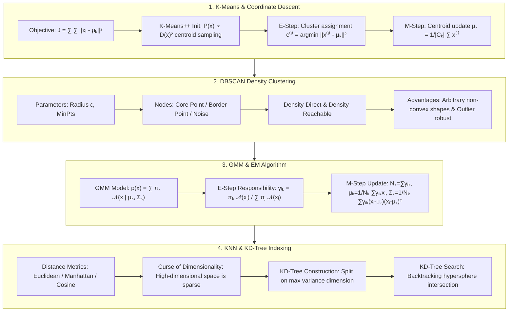

# Unsupervised Clustering & KNN: K-Means++, DBSCAN, GMM-EM & KD-Tree Guide

> **Summary**: Clustering and nearest-neighbor methods form the backbone of pattern recognition and representation analysis. This guide explores coordinate descent in K-Means, K-Means++ initialization, DBSCAN density reachability, GMM expectation-maximization (EM) derivations, the curse of dimensionality, and KD-Tree search acceleration.

---

## 🧭 Knowledge Map & Architecture Graph



---

## 💡 High-Frequency Interview Questions & Key Concepts

* **Key Concept 1**: Does K-Means always converge to global optima?
  * *Standard Response*: K-Means is a coordinate descent algorithm. Alternating assignment updates ($c^{(i)}$) and centroid updates ($\mu_k$) monotonically decrease distortion $J$. Since partition choices are finite and $J \ge 0$, convergence is guaranteed, but only to a local optimum depending on initial centroid positions.
* **Key Concept 2**: How does K-Means++ initialization work?
  * *Standard Response*: K-Means++ chooses distant initial centroids probabilistically: 1) Pick 1st centroid $\mu_1$ uniformly. 2) Compute shortest distance $D(x_i)$ to existing centroids. 3) Sample next centroid with probability $P(x_i) = \frac{D(x_i)^2}{\sum D(x_j)^2}$. 4) Repeat for $K$ centroids.
* **Key Concept 3**: Explain EM derivation in Gaussian Mixture Models (GMM).
  * *Standard Response*: **E-Step** calculates posterior responsibilities $\gamma_{ik} = \frac{\pi_k \mathcal{N}(x_i \mid \mu_k, \Sigma_k)}{\sum \pi_j \mathcal{N}(x_i \mid \mu_j, \Sigma_j)}$. **M-Step** maximizes expected log-likelihood $Q(	heta, 	heta^{old})$, setting derivatives to zero: $N_k = \sum \gamma_{ik}$, $\mu_k^{new} = \frac{1}{N_k} \sum \gamma_{ik} x_i$, $\Sigma_k^{new} = \frac{1}{N_k} \sum \gamma_{ik} (x_i - \mu_k^{new})(x_i - \mu_k^{new})^T$, $\pi_k^{new} = \frac{N_k}{n}$.

---

## 📚 Chapter 1: K-Means & K-Means++

$$J(C, \mu) = \sum_{k=1}^K \sum_{x_i \in C_k} \|x_i - \mu_k\|^2$$

> 💡 **Intuition**: The objective is "sum of squared distances from each point to its own centroid" — clustering minimizes "how far everyone is from their class representative." But $J$ depends on two variable sets at once (assignments $C$ and centroids $\mu$), which is hard to optimize jointly. Coordinate descent moves only one at a time: fix centroids and assign each point to the nearest one (E-step); fix assignments and move each centroid to its cluster mean (M-step, the derivative-zero condition literally reads "centroid = cluster average"). Both steps only decrease $J$, so convergence is guaranteed — but $J$ is non-convex, so only to a local optimum.
>
> 🎤 **Speed answer**: "Conclusion: K-Means is coordinate descent — always converges, but only to a local optimum. Mechanism: E-step (nearest-centroid assignment) and M-step (centroid = cluster mean) each monotonically decrease $J$; since the number of partitions is finite, it must stop; non-convexity makes the outcome initialization-dependent. Example: with two interleaved circular clusters, if both initial centroids land on one side, both may converge to the left and misassign the right points. Fix: K-Means++ or multiple restarts, keeping the best $J$."

---

## 📚 Chapter 2: DBSCAN Density Clustering

* Core Point: $|\mathcal{N}_\epsilon(p)| \ge \text{MinPts}$.
* Border Point: In neighborhood of core point.
* Noise Point: Neither core nor border.

> 💡 **Intuition**: K-Means is like a PE teacher forming square blocks — it only handles block-shaped groups and forces every student into one. DBSCAN is like grouping people by friend circles: people cluster where density is high; anyone who can't form a circle of $\text{MinPts}$ friends within radius $\epsilon$ is noise and gets ignored. This is why DBSCAN handles arbitrary shapes (rings, spirals) and outliers for free, and why it needs no preset $K$ — the clusters emerge from density.
>
> 🎤 **Speed answer**: "Conclusion: DBSCAN clusters by density connectivity with two hyperparameters ($\epsilon$, MinPts); core/border/noise is the three-way classification. Mechanism: points with $\ge$ MinPts neighbors within $\epsilon$ are cores; cores chain through shared neighborhoods into clusters; everything else is noise. Example: donut-shaped data — K-Means inevitably slices the ring into pieces, DBSCAN with a good $\epsilon$ clusters the whole ring as one, and the 5 scattered outliers are labeled noise. Complexity: worst case $O(n^2)$, reduced to $O(n \log n)$ with a KD-Tree."

---

## 📚 Chapter 3: GMM & EM Algorithm Derivations

$$\gamma_{ik} = \frac{\pi_k \mathcal{N}(x_i \mid \mu_k, \Sigma_k)}{\sum_{j=1}^K \pi_j \mathcal{N}(x_i \mid \mu_j, \Sigma_j)}$$

$$\mu_k^{new} = \frac{1}{N_k} \sum_{i=1}^n \gamma_{ik} x_i$$

> 💡 **Intuition**: Why does EM work? You cannot run MLE directly because you never see which component generated each point (hidden variable). EM's trick is "pretend you can see it": the **E-step uses the current parameters to guess each point's membership probability** ($\gamma_{ik}$, Bayes' rule), and the **M-step treats those guesses as weights and recomputes each component's mean/covariance/weight** — every formula is just a weighted version of ordinary MLE (a plain mean is $\frac1N\sum x_i$; here each $x_i$ is weighted by $\gamma_{ik}$). E-step raises a lower bound, M-step raises the likelihood, so the likelihood never decreases — convergence to a local maximum is guaranteed. Like guessing groupings by eye, recomputing precisely, then re-guessing: each round gets better.
>
> 🎤 **Speed answer**: "Conclusion: EM alternates E-step (responsibilities $\gamma_{ik}$) and M-step (weighted parameter updates) to fit GMMs. Mechanism: the likelihood with hidden variables has no closed-form derivative; E-step computes the posterior of $z_{ik}$ via Bayes, M-step maximizes the Q-function with $\gamma$ as soft weights; the likelihood is monotonically non-decreasing. Example: with two Gaussian components and 100 points, if the E-step says point 1 belongs to component 1 with probability 0.8, then $\mu_1^{new} = \sum\gamma_{i1}x_i/\sum\gamma_{i1}$ counts it at 0.8 weight — a weighted average. Memory: guess membership (soft clustering) → re-estimate from membership → repeat."

---

## 📚 Chapter 4: KNN & KD-Tree Search

* **Curse of Dimensionality**: High-dimensional space causes distance metric equivalence $\lim_{d \to \infty} \frac{d_{\max} - d_{\min}}{d_{\min}} = 0$.
* **KD-Tree**: Split on max variance dimension median; search complexity $\mathcal{O}(\log n)$ degrades to $\mathcal{O}(n)$ when $d > 20$.

> 💡 **Intuition**: The curse of dimensionality is "high-dimensional space is too big to fill." The unit cube has volume 1 in any $d$, but the inscribed cube of side 0.9 has volume $0.9^d$ — at $d=100$ that is $\approx 2.7\times10^{-5}$, so 99.997% of the volume sits in the shell! Points crowd at corners and edges, all pairwise distances become nearly equal, and "nearest neighbor" stops meaning anything. KD-Tree's pruning (skip a whole region when the query ball doesn't intersect it) also dies in high dimensions, because the ball intersects almost every region boundary — the tree degrades into a linear scan.
>
> 🎤 **Speed answer**: "Conclusion: in high dimensions all distances converge, killing both KNN and KD-Tree. Mechanism: volume concentrates in the shell, so $\lim_{d\to\infty}(d_{\max}-d_{\min})/d_{\min}=0$ — the distance contrast disappears. Example: with 10,000 points in 2-D, KD-Tree answers a query in ~14 steps ($\log_2 10^4 \approx 13.3$); the same data in 30-D touches nearly all 10,000 points. Fixes: PCA/t-SNE, learned embeddings, or LSH/HNSW indexes. Golden line: 'The higher the dimension, the less information distance carries.'"

---

## 📚 Chapter 5: Pure Numpy Implementation

> 💡 **Intuition**: The skeleton shows the whole algorithm in three lines of vectorized code: `_init_centroids_pp` implements K-Means++ (sample the first centroid uniformly, then each next centroid with probability proportional to the squared distance to the nearest existing centroid — far points win), `np.argmin(dists, axis=1)` is the vectorized E-step, and `X[labels == k].mean(axis=0)` is the vectorized M-step. It mirrors the hand-computed example exactly: assign → average → repeat until nobody switches sides.

```python
import numpy as np

class PureNumpyKMeans:
    def __init__(self, n_clusters=3, max_iter=300):
        self.K = n_clusters
        self.max_iter = max_iter
        self.centroids = None
        
    def fit(self, X: np.ndarray):
        # K-Means++ init and coordinate descent updates
        pass
```