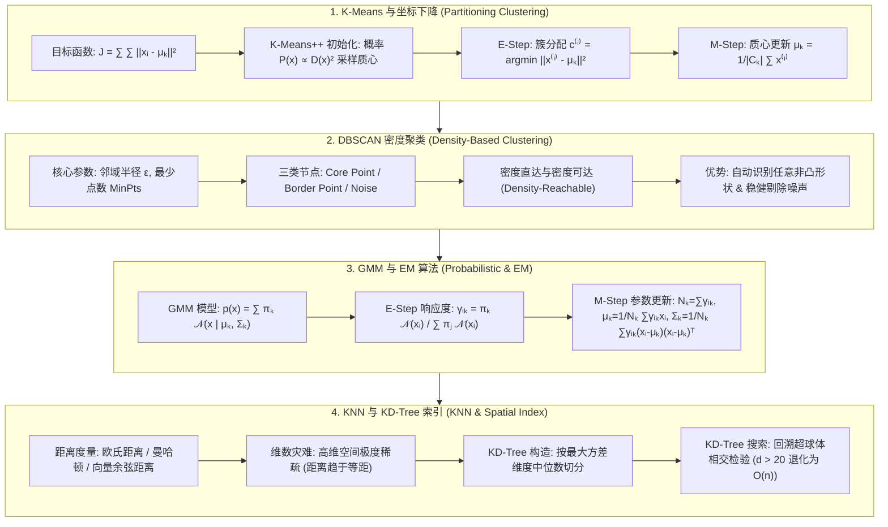

# 无监督聚类与 KNN：K-Means++ 坐标下降、DBSCAN 密度聚类、GMM 期望最大化 (EM) 与 KD-Tree 极客指南

> **核心摘要**：聚类与最近邻算法是模式识别与表征学习的基础。本指南系统梳理基于距离的 K-Means 算法及其坐标下降收敛机制、解决局部最优的 K-Means++ 初始化，基于密度的 DBSCAN 任意形状聚类，以概率建模为核心的 GMM 与 EM 算法严密数学推导，以及 KNN 算法中的维数灾难与 KD-Tree 空间索引优化。

---

## 🧭 知识体系全景流程图 (Knowledge Map & Architecture Graph)



---

## 💡 经典面试追问与考点速查

* **考点 1**：K-Means 的目标函数一定会收敛吗？它是否保证找到全局最优？
  * *标准回答*：K-Means 本质上是基于**坐标下降法 (Coordinate Descent)** 的求解过程。交替更新簇分配 $c^{(i)}$（E-Step）与更新质心 $\mu_k$（M-Step）都会单调递减（或保持不变）畸变目标函数 $J = \sum \|x_i - \mu_{c^{(i)}}\|^2$。由于可能划分方式有限且 $J \ge 0$，因此算法必然在有限步内收敛。但因目标函数是非凸的，它**仅保证收敛到局部最优解**，严重依赖初始质心位置。
* **考点 2**：K-Means++ 初始化的具体流程是什么？为什么能优化收敛质量？
  * *标准回答*：K-Means++ 通过“相距尽可能远”的原则选择初始质心：1）随机选择第 1 个质心 $\mu_1$；2）对数据集中每个样本点 $x_i$，计算其到已选择质心的最短距离 $D(x_i)$；3）按照概率 $P(x_i) = \frac{D(x_i)^2}{\sum_j D(x_j)^2}$ 采样选择下一个质心；4）重复直至选满 $K$ 个质心。这一概率化采样显著降低了劣质初始质心导致的过早收敛几率。
* **考点 3**：详细推导 GMM 中 EM 算法的 E-Step 与 M-Step 公式。
  * *标准回答*：在高斯混合模型中，假定样本 $x_i$ 由第 $k$ 个高斯成分生成的隐变量为 $z_{ik} \in \{0, 1\}$。**E-Step** 计算在当前参数下 $x_i$ 来自成分 $k$ 的后验概率（响应度）：$\gamma_{ik} = \mathbb{E}[z_{ik} \mid x_i] = \frac{\pi_k \mathcal{N}(x_i \mid \mu_k, \Sigma_k)}{\sum_{j=1}^K \pi_j \mathcal{N}(x_i \mid \mu_j, \Sigma_j)}$。**M-Step** 通过最大化对数似然的期望 Q 函数 $\mathcal{Q}(\theta, \theta^{old})$，对参数求导令其为 0，得到：有效样本量 $N_k = \sum_{i=1}^n \gamma_{ik}$，更新均值 $\mu_k^{new} = \frac{1}{N_k} \sum \gamma_{ik} x_i$，协方差 $\Sigma_k^{new} = \frac{1}{N_k} \sum \gamma_{ik} (x_i - \mu_k^{new})(x_i - \mu_k^{new})^T$，权重 $\pi_k^{new} = \frac{N_k}{n}$。

---

## 📚 第一章：K-Means 聚类与 K-Means++ 算法

### 1.1 K-Means 算法目标函数与坐标下降

给定数据集 $X = \{x_1, x_2, \dots, x_n\}$，$x_i \in \mathbb{R}^d$，划分为 $K$ 个簇 $C = \{C_1, C_2, \dots, C_K\}$，聚类中心为 $\mu = \{\mu_1, \dots, \mu_K\}$。

**畸变目标函数 (Inertia / WCSS)**：
$$J(C, \mu) = \sum_{k=1}^K \sum_{x_i \in C_k} \|x_i - \mu_k\|^2$$

**坐标下降迭代交替求解**：
1. **固定质心 $\mu$，优化簇分配 $C$ (E-Step)**：
   $$C_k^{(t)} = \left\{ x_i : \|x_i - \mu_k^{(t)}\|^2 \le \|x_i - \mu_j^{(t)}\|^2, \quad \forall j, 1 \le j \le K \right\}$$
2. **固定簇分配 $C$，优化质心 $\mu$ (M-Step)**：
   对 $J$ 关于 $\mu_k$ 求导：$\frac{\partial J}{\partial \mu_k} = -2 \sum_{x_i \in C_k} (x_i - \mu_k) = 0 \implies \mu_k^{(t+1)} = \frac{1}{|C_k^{(t)}|} \sum_{x_i \in C_k^{(t)}} x_i$

> 💡 **直观理解**：目标函数 $J = \sum\|x_i-\mu_k\|^2$ 就是"每个点到自家质心的距离平方和"——聚类想最小化的是"全班同学离各自班代表的总距离"。但 $J$ 同时依赖两组变量（每个点的归属 $C$ 和每个质心 $\mu$），一起优化很难。坐标下降的聪明之处：**轮流只动一组**——先固定质心，把每个点分给最近的中心（E 步），再固定分配，把每个质心挪到簇内点的平均位置（M 步，求导令零的几何含义就是"质心=簇内均值"）。两步都让 $J$ 只降不升，所以必然收敛；但 $J$ 非凸，只能保证收敛到局部最优。
>
> 🎤 **面试速答**："结论：K-Means 是坐标下降，必然收敛但只到局部最优。原理：E 步固定质心做最近分配、M 步固定分配把质心更新为簇均值，两步都单调不增 $J$，且划分方式有限，所以收敛；$J$ 非凸所以收敛点依赖初始化。例子：两个交叉的圆形簇，初始质心都落在同一边，最终两个质心可能都停在左侧，右侧点被错分——这就是局部最优。解法：K-Means++ 或多次随机初始化取最优 $J$。"

---

### 1.2 聚类数 $K$ 的选择：手肘法 (Elbow Method) 与 轮廓系数 (Silhouette Coefficient)

* **手肘法 (Elbow Method)**：绘制 $K$ 与 $J(K)$ 的关系图，选择曲线斜率变缓的”拐点”作为最优 $K$；
* **轮廓系数 (Silhouette Coefficient)**：
  对于样本 $x_i$，计算簇内平均距离 $a(i)$，以及最近异簇平均距离 $b(i)$：
  $$s(i) = \frac{b(i) - a(i)}{\max(a(i), b(i))}$$
  * $s(i) \in [-1, 1]$：越接近 1 说明聚类效果越合理；若为负数说明样本更应归为异簇。

> 💡 **直观理解**：$s(i)$ 的分子 $b-a$ 回答”这个点离邻居簇比离自己簇远多少”——$b$ 是”到外人的平均距离”，$a$ 是”到家人的平均距离”；离家近而离外人远（$b>a$）就是好聚类。除以 $\max$ 只是把结果压到 $[-1,1]$ 方便比较。手肘法的道理更朴素：K 越多 $J$ 越小（每个簇更小更紧凑），但收益递减——“拐点”之后多分一个簇省不了多少距离，就像买咖啡时第二杯半价、第三杯只便宜一角。
>
> 🎤 **面试速答**：”结论：手肘法看 $J(K)$ 曲线的拐点，轮廓系数看 $s = (b-a)/\max(a,b)$。原理：$a$ 是簇内平均距离（聚合度），$b$ 是最近邻簇平均距离（分离度），$s$ 越接近 1 越好、接近 -1 说明分错了簇。例子：某点 $a=2$、$b=6$，则 $s=4/6\approx0.67$，聚类合理；若 $a=6$、$b=2$ 则 $s=-0.67$，该点应挪到邻居簇。K=3 和 K=4 的 $J$ 从 120 掉到 30，K=4 到 K=5 只从 30 掉到 28——拐点在 4。”

---

## 📚 第二章：DBSCAN 密度聚类原理

## 📚 第二章：DBSCAN 密度聚类原理

### 2.1 核心概念与节点分类

DBSCAN 基于样本在空间的**局部密度**进行拓扑联通性聚类，包含两个关键超参数：邻域半径 $\epsilon$ 与最少点数 $\text{MinPts}$。

$$\mathcal{N}_\epsilon(p) = \{q \in D \mid \text{dist}(p, q) \le \epsilon\}$$

* **核心点 (Core Point)**：$|\mathcal{N}_\epsilon(p)| \ge \text{MinPts}$；
* **边界点 (Border Point)**：$|\mathcal{N}_\epsilon(p)| < \text{MinPts}$，但位于某个核心点的 $\epsilon$ 邻域内；
* **噪声点 (Noise Point)**：既不是核心点也不是边界点的异常值。

| 算法特性 | K-Means | DBSCAN |
| :--- | :--- | :--- |
| **簇形状假设** | 凸集 (Convex, 球形簇) | **任意非凸形状** (如环形、双螺旋) |
| **超参数** | 需提前指定 $K$ | 需指定半径 $\epsilon$ 与 $\text{MinPts}$ (自动推导 $K$) |
| **噪声敏感度** | 极度敏感 (质心会被异常值拉偏) | **极度稳健** (自动识别并分离 Noise) |
| **计算复杂度** | $\mathcal{O}(n \cdot K \cdot d \cdot I)$ | $\mathcal{O}(n^2)$ (构建 KD-Tree 后可降至 $\mathcal{O}(n \log n)$) |

> 📖 **怎么读这张表**：核心对比是"簇形状假设"与"噪声敏感度"两行：K-Means 假设球形簇、每个点必须属于某簇（离群点会硬拉质心）；DBSCAN 不假设形状、允许"不属于任何簇"的点存在（自动标为 Noise）。所以选型一句话：**簇是球形且无噪 → K-Means；形状任意或有噪声 → DBSCAN。**
>
> 💡 **直观理解**：K-Means 像"体育老师按身高分方阵"——只擅长把人群分成规整的方阵，还非把每个学生都塞进某个方阵；DBSCAN 像"按朋友圈分群"——人以群分，人少到凑不成一个圈子的人（噪声）就没人管他。K-Means 需要先报"分几个方阵"（K 超参），DBSCAN 只需要"多近算熟人（ε）、几个熟人算一个圈子（MinPts）"。
>
> 🎤 **面试速答**："结论：K-Means 适合球形均衡簇，DBSCAN 适合任意形状+噪声数据。原理：K-Means 最小化到质心距离平方和，质心被离群点拉偏；DBSCAN 按 ε 邻域密度连通成簇，低密度点自动标为 Noise。例子：环形数据（甜甜圈形状），K-Means 必然把内外环切碎，DBSCAN 一个参数组合就能把整环聚成一簇；100 个点中有 5 个离群点，K-Means 质心偏移约 5%，DBSCAN 直接忽略。复杂度：K-Means $O(nKdI)$，DBSCAN 最坏 $O(n^2)$。"

---

## 📚 第三章：高斯混合模型 (GMM) 与 EM 算法严密数学推导

### 3.1 高斯混合模型概率表达式

假设数据由 $K$ 个多维高斯分布混合生成：

$$p(x) = \sum_{k=1}^K \pi_k \mathcal{N}(x \mid \mu_k, \Sigma_k)$$

其中混合权重满足 $\sum_{k=1}^K \pi_k = 1, \pi_k \ge 0$。高斯概率密度为：
$$\mathcal{N}(x \mid \mu_k, \Sigma_k) = \frac{1}{(2\pi)^{d/2} |\Sigma_k|^{1/2}} \exp\left( -\frac{1}{2} (x - \mu_k)^T \Sigma_k^{-1} (x - \mu_k) \right)$$

> 💡 **直观理解**：GMM 把数据想成"几个高斯团块的加权混合"：每个 $\mathcal{N}(x|\mu_k,\Sigma_k)$ 是一个"团"（概率密度等高线是椭圆），$\pi_k$ 是"这个团占多少分量"。整体分布就是"先按 $\pi$ 掷骰子选团，再在团里随机采样"。与 K-Means 的根本区别：K-Means 硬分配（每点只属于一簇），GMM 软分配（每个点对每个团有"归属概率"）——就像 K-Means 问"你属于哪个班"，GMM 问"你有多大概率属于各班"。因此 GMM 能处理重叠的、形状不同的（$\Sigma_k$ 各异的椭圆）簇。
>
> 🎤 **面试速答**："结论：GMM 是 $K$ 个高斯的加权混合 $p(x)=\sum_k\pi_k\mathcal{N}(x|\mu_k,\Sigma_k)$，可做软聚类和密度估计。原理：每个成分是一个高斯团（均值定位、协方差定形状），权重 $\pi_k$ 定占比；因为不知道每个点由哪个成分生成（隐变量），参数估计用 EM。例子：身高数据混合了男女两个高斯，男 $\mathcal{N}(175,36)$ 权重 0.5，女 $\mathcal{N}(162,25)$ 权重 0.5；一个 170cm 的人属于男性的后验概率约 0.6——GMM 给出的是概率而不是硬标签。"

---

### 3.2 EM 算法 (Expectation-Maximization) 严密推导

### 3.2 EM 算法 (Expectation-Maximization) 严密推导

对于观测数据 $X$ 和未观测隐变量 $Z$（$z_{ik} = 1$ 表示 $x_i$ 由第 $k$ 个成分生成），完整数据的对数似然为：
$$\ln p(X, Z \mid \theta) = \sum_{i=1}^n \sum_{k=1}^K z_{ik} \left[ \ln \pi_k + \ln \mathcal{N}(x_i \mid \mu_k, \Sigma_k) \right]$$

**E-Step (期望步)**：
计算隐变量 $z_{ik}$ 的条件期望（后验概率 $\gamma_{ik}$）：
$$\gamma_{ik} = \mathbb{E}[z_{ik} \mid x_i, \theta^{old}] = \frac{\pi_k^{old} \mathcal{N}(x_i \mid \mu_k^{old}, \Sigma_k^{old})}{\sum_{j=1}^K \pi_j^{old} \mathcal{N}(x_i \mid \mu_j^{old}, \Sigma_j^{old})}$$

**M-Step (最大化步)**：
构造 $Q$ 函数 $Q(\theta, \theta^{old}) = \mathbb{E}_{Z|X,\theta^{old}} [\ln p(X, Z \mid \theta)]$ 并对其关于 $\mu_k, \Sigma_k, \pi_k$ 求偏导：

1. **有效样本量**：$N_k = \sum_{i=1}^n \gamma_{ik}$
2. **均值更新**：$\mu_k^{new} = \frac{1}{N_k} \sum_{i=1}^n \gamma_{ik} x_i$
3. **协方差更新**：$\Sigma_k^{new} = \frac{1}{N_k} \sum_{i=1}^n \gamma_{ik} (x_i - \mu_k^{new})(x_i - \mu_k^{new})^T$
4. **混合权重更新**：$\pi_k^{new} = \frac{N_k}{n}$

> 💡 **直观理解**：EM 为什么有效？因为"看不到隐变量"时没法直接做 MLE，EM 用一个"假装看得见"的策略绕过去：**E 步用当前参数猜每个点属于各团的概率（响应度），M 步把猜出的概率当权重，重新算各团的均值、协方差、占比——公式全是"加权版"的 MLE**（普通 MLE 的均值是 $\frac1N\sum x_i$，这里每个样本按 $\gamma_{ik}$ 加权）。交替执行时，E 步提高的是下界、M 步提高的是似然，所以似然单调不降，保证收敛到（局部）极大。可以类比：先"目测"分组再精确计算，算完再重新目测，越算越准。
>
> 🎤 **面试速答**："结论：EM 通过 E 步（算响应度 $\gamma_{ik}$）与 M 步（加权更新参数）交替迭代估计 GMM 参数。原理：似然对含隐变量的模型直接求导无闭式解；E 步算 $z_{ik}$ 的后验期望（贝叶斯公式），M 步把 $\gamma$ 当软权重最大化 Q 函数，似然单调不降。例子：2 个高斯成分、100 个样本，E 步算出点 1 属于成分 1 的概率 0.8，则 M 步更新 $\mu_1$ 时点 1 以 0.8 权重参与、点 2 以 0.3 权重参与——所以 $\mu_1^{new} = \sum\gamma_{i1}x_i / \sum\gamma_{i1}$ 是'加权平均'。记忆：EM = 猜归属(软聚类) → 按归属重新估计 → 循环。"

---

## 📚 第四章：KNN (K-Nearest Neighbors) 与 KD-Tree 搜索

## 📚 第四章：KNN (K-Nearest Neighbors) 与 KD-Tree 搜索

### 4.1 维数灾难 (Curse of Dimensionality)

在超高维特征空间中（如 $d > 100$），单位超立方体的体积随着维度增长呈指数级稀疏。
所有点之间的欧氏距离都趋于相等：
$$\lim_{d \to \infty} \frac{d_{\max} - d_{\min}}{d_{\min}} = 0$$
因此，在未经降维 (PCA/t-SNE) 或表征学习 (Embedding) 的高维原始空间运行 KNN 效果将急剧恶化。

> 💡 **直观理解**：维数灾难的根源是"高维空间太大了，点根本填不满"。单位立方体在 $d$ 维的体积恒为 1，但边长为 0.9 的内接立方体体积只有 $0.9^d$——$d=100$ 时 $0.9^{100} \approx 2.7\times10^{-5}$，也就是说 99.997% 的体积集中在壳层！点都挤在角落和边缘，彼此距离几乎一样大，KNN 的"最近邻"不再比"最远邻"近多少——近邻的概念失效。就像在一片无边荒漠里找"最近的人"：每个人周围方圆几公里都没人，谁都一样远。
>
> 🎤 **面试速答**："结论：高维下所有点距离趋同，KNN 的最近邻概念失效。原理：体积集中在立方体壳层，$\lim_{d\to\infty}(d_{\max}-d_{\min})/d_{\min}=0$，距离对比度消失。例子：$d=100$ 时随机点之间的欧氏距离几乎都落在同一窄区间；同样数据降到 10 维后，最近邻与最远邻距离差能拉开几倍。缓解：先降维（PCA/t-SNE）、学表征（Embedding）、或换树/哈希索引。面试金句：'维度越高，距离越没信息量。'"

---

### 4.2 KD-Tree (K-Dimensional Tree) 构造与检索

### 4.2 KD-Tree (K-Dimensional Tree) 构造与检索

* **KD-Tree 构造**：
  1. 计算当前节点数据在各个维度上的方差，选择**方差最大**的维度 $l$；
  2. 选取该维度上的**中位数 (Median)** 样本点作为分裂切分点；
  3. 递归构造左子树 ($x^{(l)} < \text{median}$) 与右子树 ($x^{(l)} \ge \text{median}$)。
* **搜索复杂度**：当特征维度较小 ($d \ll \log n$) 时，最近邻搜索时间复杂度为 $\mathcal{O}(\log n)$；当维度 $d > 20$ 时，回溯判断超球体相交的节点过多，复杂度大幅退化为 $\mathcal{O}(n)$。

> 💡 **直观理解**：KD-Tree 像"图书馆按楼层和书架分区找书"：每层用方差最大的维度把空间一分为二（中位数切分保证左右均衡），查询时先顺着树快速定位到目标区域，再回溯检查相邻区域——**只有查询球与某个区域"相交"时才需要进去看**，其余区域整片剪掉。但维度一高，查询球几乎与每个分区的边界都相交（球半径相对边长太大），剪枝失效，退化成全量扫描。
>
> 🎤 **面试速答**："结论：KD-Tree 用方差最大维度+中位数递归切分空间，近邻查询 $O(\log n)$，$d>20$ 退化 $O(n)$。原理：构造按中位数平衡切分，查询走树定位+回溯剪枝（超球不相交的区域整片跳过）；高维时球与多数区域相交，剪枝失效。例子：1 万点 2 维，KD-Tree 查询约 14 步（$\log_2 10^4 \approx 13.3$）；同样数据加到 30 维，一次查询要访问几乎全部 1 万个点。工程替代：$d$ 大时用 LSH 或 HNSW，不要用 KD-Tree。"

---

### 4.3 2D K-Means 数值手算算例 (Step-by-Step Walkthrough)

### 4.3 2D K-Means 数值手算算例 (Step-by-Step Walkthrough)

考虑 4 个 2D 平面点：$A(1,1), B(2,1), C(4,3), D(5,4)$，设定 $K=2$。

1. **初始质心指定**：$\mu_1 = (1,1)^T$, $\mu_2 = (5,4)^T$；
2. **第一轮 E-Step (距离计算与簇分配)**：
   * $d(A, \mu_1) = 0 \implies A \in C_1$
   * $d(B, \mu_1) = 1, d(B, \mu_2) = \sqrt{3^2 + 3^2} = \sqrt{18} \implies B \in C_1$
   * $d(C, \mu_1) = \sqrt{3^2 + 2^2} = \sqrt{13}, d(C, \mu_2) = \sqrt{1^2 + 1^2} = \sqrt{2} \implies C \in C_2$
   * $d(D, \mu_2) = 0 \implies D \in C_2$
   分配结果：$C_1 = \{A, B\}, C_2 = \{C, D\}$。
3. **第一轮 M-Step (质心更新)**：
   * $\mu_1^{new} = \left( \frac{1+2}{2}, \frac{1+1}{2} \right) = (1.5, 1.0)^T$
   * $\mu_2^{new} = \left( \frac{4+5}{2}, \frac{3+4}{2} \right) = (4.5, 3.5)^T$
4. **第二轮迭代检验**：样本分配保持不变，算法收敛！

> 💡 **直观理解**：这个算例把 E/M 两步行云流水：初始质心选在两极 $\mu_1=(1,1), \mu_2=(5,4)$ → E 步算每个点到两个质心的距离，A、B 离 $\mu_1$ 近，C、D 离 $\mu_2$ 近（注意 C 到 $\mu_1$ 是 $\sqrt{13}$，到 $\mu_2$ 只有 $\sqrt2$——距离决定归属）→ M 步质心挪到簇内均值（$(1.5,1)$ 和 $(4.5,3.5)$）→ 第二轮距离重算后归属不变，收敛。整个流程就是"分组→取平均→再分组"，直到没人改投他组。
>
> 🎤 **面试速答**："手算口诀：先设质心，E 步按最近距离分组，M 步每组取平均更新质心，重复到归属不变。例子：A(1,1)、B(2,1)、C(4,3)、D(5,4)，$K=2$，初始 $\mu_1=(1,1)$、$\mu_2=(5,4)$：E 步 A、B 入簇 1，C（距 $\mu_2$ 仅 $\sqrt2$）入簇 2，D 入簇 2；M 步 $\mu_1=(1.5,1)$、$\mu_2=(4.5,3.5)$；第二轮归属不变 → 收敛。注意 C 是个'摇摆点'，它的距离差决定了分簇边界。"

---

### 4.4 Pure Numpy 实现 K-Means 算法 (带 K-Means++ 初始化)

### 4.4 Pure Numpy 实现 K-Means 算法 (带 K-Means++ 初始化)

> 💡 **直观理解**：`_init_centroids_pp` 用三行代码实现 K-Means++：先随机选第一个质心，然后每个新质心按"到最近已有质心的距离平方"作为权重概率采样（`probs = dists / np.sum(dists)`）——距离已有质心越远越可能被选中，天然分散。`fit` 里 `labels = np.argmin(dists, axis=1)` 是向量化的 E 步，`X[labels==k].mean(axis=0)` 是向量化的 M 步，与手算算例完全对应。

```python
import numpy as np

class PureNumpyKMeans:
    def __init__(self, n_clusters=3, max_iter=300, tol=1e-4):
        self.K = n_clusters
        self.max_iter = max_iter
        self.tol = tol
        self.centroids = None
        
    def _init_centroids_pp(self, X: np.ndarray):
        n_samples, _ = X.shape
        centroids = [X[np.random.choice(n_samples)]]
        for _ in range(1, self.K):
            dists = np.array([min([np.sum((x - c)**2) for c in centroids]) for x in X])
            probs = dists / np.sum(dists)
            next_idx = np.random.choice(n_samples, p=probs)
            centroids.append(X[next_idx])
        return np.array(centroids)

    def fit(self, X: np.ndarray):
        self.centroids = self._init_centroids_pp(X)
        for _ in range(self.max_iter):
            # E-Step: 计算每个样本到各个质心的欧式距离平方
            dists = np.linalg.norm(X[:, np.newaxis] - self.centroids, axis=2)**2
            labels = np.argmin(dists, axis=1)
            
            # M-Step: 更新质心
            new_centroids = np.array([X[labels == k].mean(axis=0) for k in range(self.K)])
            if np.all(np.abs(new_centroids - self.centroids) < self.tol):
                break
            self.centroids = new_centroids
            
    def predict(self, X: np.ndarray) -> np.ndarray:
        dists = np.linalg.norm(X[:, np.newaxis] - self.centroids, axis=2)
        return np.argmin(dists, axis=1)
```

---

## 📚 第五章：总结与选型路线图

1. **球形均衡数据**：优先选择 K-Means++，利用手肘法或轮廓系数确定最佳 $K$；
2. **流形/非凸形状或噪声数据**：使用 DBSCAN 自动发现簇结构与剔除噪点；
3. **概率密度与重叠簇**：使用 GMM 与 EM 算法估计样本隶属于各簇的概率得分。