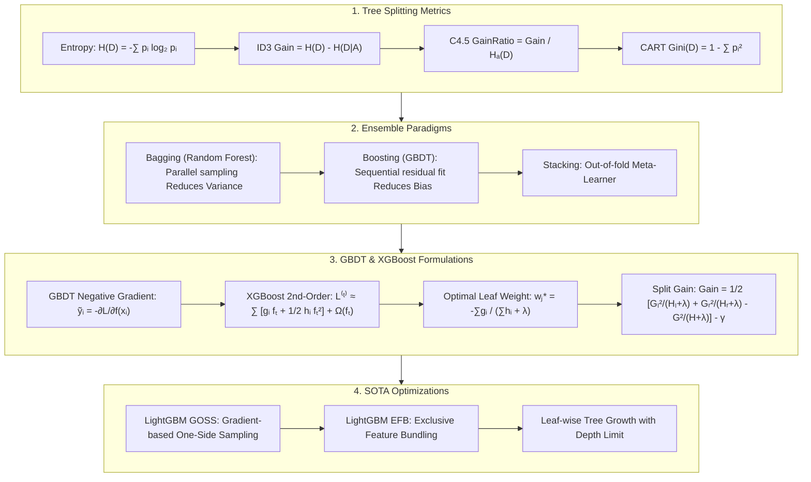

# Decision Trees & Ensemble Methods: CART, GBDT 2nd-Order Taylor & LightGBM Guide

> **Summary**: Tree-based ensemble methods represent the state of the art for tabular datasets. This guide explores decision tree splitting criteria (ID3 / C4.5 / CART), ensemble paradigms (Bagging vs Boosting), GBDT pseudo-residuals, XGBoost 2nd-order Taylor expansion, and LightGBM (GOSS / EFB) speedups.

---

## 🧭 Knowledge Map & Architecture Graph



---

## 💡 High-Frequency Interview Questions & Key Concepts

* **Key Concept 1**: Why does ID3 favor features with many values?
  * *Standard Response*: Features with many distinct values split the dataset into tiny, pure subsets, forcing $H(D|A) \to 0$ and yielding falsely inflated Information Gain. C4.5 penalizes multi-value features with Gain Ratio $\frac{g(D,A)}{H_A(D)}$, while CART uses Gini Index on strict binary splits.
* **Key Concept 2**: How does Bagging reduce variance while Boosting reduces bias?
  * *Standard Response*: Random Forest averages $M$ deep trees (low bias, high variance). By $\text{Var}(\bar{X}) = \rho \sigma^2 + \frac{1-\rho}{M}\sigma^2$, Bootstrap & random feature selection minimize correlation $\rho$, reducing variance. Boosting sequentially fits negative gradients to correct errors, minimizing bias.
* **Key Concept 3**: What makes XGBoost superior to vanilla GBDT?
  * *Standard Response*: 1) **2nd-Order Taylor Expansion**: Uses $g_i$ and $h_i$ for faster convergence on arbitrary differentiable loss functions. 2) **Explicit Regularization**: Adds $\gamma T + \frac{1}{2}\lambda \sum w_j^2$ directly to objective to prevent overfitting. 3) **System Parallelism & Missing Value Handling**.

---

## 📚 Chapter 1: Decision Tree Metrics

$$H(D) = -\sum_{k=1}^K p_k \log_2 p_k$$
$$\text{Gini}(D) = 1 - \sum_{k=1}^K p_k^2$$

> 💡 **Intuition**: Both metrics measure the same thing — "how messy is this set of samples." Entropy: all one class ($p=1$) → 0 (ordered); 50/50 split → 1 (maximally messy). Gini: all one class → $1-1=0$; 50/50 → $1-0.5=0.5$. Same direction, different rulers — and Gini avoids logarithms, so CART is faster. Information gain is "messiness before the split minus weighted messiness after": the purer the children, the larger the gain.
>
> 🎤 **Speed answer**: "Conclusion: entropy and Gini are impurity metrics; splitting aims to make child nodes purer. Mechanism: entropy $-\sum p\log_2 p$ (0 when pure, 1 at 50/50), Gini $1-\sum p^2$ (0 pure, 0.5 at 50/50); information gain = impurity before minus weighted impurity after. Example: 10 positives + 10 negatives → entropy 1.0, Gini 0.5; split into 8+2 and 2+8 → weighted entropy ≈ 0.72, Gini ≈ 0.32, a clear gain. Extra point: Gini has no log, so CART defaults to it; entropy is slightly more sensitive to purity."

---

## 📚 Chapter 2: Ensemble Learning Principles

$$\text{Var}(F(x)) = \rho \sigma^2 + \frac{1 - \rho}{M} \sigma^2$$

> 💡 **Intuition**: The two ensemble paradigms fix two different faces of error. Bagging faces "asking the same question gives different answers every time" (variance): average $M$ independent judges and their random mistakes cancel — the formula says "the less correlated the judges ($\rho \to 0$), the more stable the average." Boosting faces "the answer is systematically off" (bias): instead of one weak judge fixing himself, the $m$-th judge specializes in "the part the previous $m-1$ judges got wrong" (residuals). Random forest = bootstrap samples + random feature subsets to push $\rho$ down; GBDT = sequential residual fitting to grind bias down.
>
> 🎤 **Speed answer**: "Conclusion: Bagging (random forest) reduces variance; Boosting (GBDT) reduces bias. Mechanism: for averaged learners, $\text{Var} = \rho\sigma^2 + (1-\rho)\sigma^2/M$; bootstrap + random features drive $\rho \to 0$; boosting sequentially fits negative gradients/pseudo-residuals, monotonically lowering bias. Example: 10 deep trees with $\sigma^2=100$ and $\rho=0.2$ → ensemble variance $= 20 + 80/10 = 28$, a 72% cut; GBDT with shallow trees grinding 100 rounds of residuals can push training bias from 0.5 to 0.05. One-liner: RF cures jitter, GBDT cures drift."

---

## 📚 Chapter 3: GBDT & XGBoost Mathematical Derivations

### 3.1 GBDT Pseudo-Residuals

$$\tilde{y}_{i, m} = - \left[ \frac{\partial L(y_i, f(x_i))}{\partial f(x_i)} \right]_{f(x_i) = f_{m-1}(x_i)}$$

> 💡 **Intuition**: GBDT is a relay race: tree $m$'s only job is to fix "the direction in which all previous trees combined are still wrong." Residuals ($y - F_{m-1}$) only make sense for squared loss; for any differentiable loss, by analogy with steepest descent the fastest way to reduce loss is the **negative gradient** $-\partial L/\partial f$ — so "fit residuals" generalizes to "fit negative gradients," and one recipe covers regression, classification, and ranking losses. In plain words: the residual is "how wrong," the negative gradient is "how to move to fix it most efficiently."
>
> 🎤 **Speed answer**: "Conclusion: each GBDT tree fits the negative gradient (pseudo-residual) of the loss; for squared loss this equals the plain residual. Mechanism: first-order Taylor $L(f_{m-1}+h) \approx L(f_{m-1}) + \frac{\partial L}{\partial f}h$; to drop the loss fastest, $h$ should follow the negative gradient. Example: with MSE, $-\partial L/\partial f = y - f$, so $y=10$, $F=7$ gives residual 3; with log loss the negative gradient is $y - p$, like logistic regression. Golden line: 'The residual is a special case; the negative gradient is the general engine.'"

---

### 3.2 XGBoost Objective Derivation

Optimal leaf weight:
$$w_j^* = - \frac{G_j}{H_j + \lambda}$$

Splitting Gain:
$$\text{Gain} = \frac{1}{2} \left[ \frac{G_L^2}{H_L + \lambda} + \frac{G_R^2}{H_R + \lambda} - \frac{(G_L + G_R)^2}{H_L + H_R + \lambda} \right] - \gamma$$

> 💡 **Intuition**: XGBoost's three upgrades build on each other. ① Second-order Taylor: GBDT sees only the loss's slope (first derivative $g_i$); XGBoost also sees the curvature ($h_i$), so its steps are better aimed — like a navigator that tells you not just "you're too far right" but "by how much." ② Regularization $\gamma T + \frac12\lambda\sum w_j^2$: taxing both the leaf count and the leaf weights stops trees from growing wild. ③ Leaf weight $w_j^* = -G_j/(H_j+\lambda)$: a "weighted average" of the samples in the leaf, with $H_j+\lambda$ guaranteeing a non-zero denominator. The Gain formula asks: "does splitting into two optimally-scored halves beat keeping the whole, after paying the split tax $\gamma$?"
>
> 🎤 **Speed answer**: "Conclusion: XGBoost = second-order Taylor + explicit regularization; leaf weight $w_j^*=-G_j/(H_j+\lambda)$; split only if Gain > 0. Mechanism: expand the loss to second order, group by leaves ($G_j=\sum g_i$, $H_j=\sum h_i$), minimize the quadratic in $w_j$; Gain = left score + right score − parent score − $\gamma$. Example: with $G=10$, $H=5$, $\lambda=1$ → $w^* = -10/6 \approx -1.67$; if $G_L^2/(H_L+1)=36$, $G_R^2/(H_R+1)=16$, unsplit $=25$, $\gamma=0.1$ → Gain $= \frac12(36+16-25)-0.1 = 13.4 > 0$, so split. Golden line: 'Second order sees curvature, regularization pays the fine, Gain>0 means the knife falls.'"

---

### 3.3 LightGBM GOSS & EFB

* **GOSS**: Keeps top $a \times 100\%$ large gradient samples, randomly samples $b \times 100\%$ small gradient samples.
* **EFB**: Bundles mutually exclusive sparse features.

> 💡 **Intuition**: GOSS and EFB are both engineering wisdom about "spending less effort." GOSS: large-gradient samples (the ones most wrong) contribute most to split gains, while small-gradient ones "barely matter" — so keep all large-gradient samples, sample a slice of small-gradient ones, and re-weight the sampled small-gradient points so the estimate stays nearly unbiased. EFB: One-Hot features are naturally *mutually exclusive* (when one is 1 the others are 0), so bundle them into one composite feature — tens of thousands of columns collapse to hundreds, like merging non-overlapping locker numbers into one addressing scheme: less memory, no information loss.
>
> 🎤 **Speed answer**: "Conclusion: GOSS keeps large-gradient samples and subsamples small-gradient ones with re-weighting; EFB bundles mutually exclusive sparse features into composites. Mechanism: large gradients = high-error samples that matter most for split gain; small-gradient samples are sampled at rate $b$ and re-weighted by $(1-a)/b$ to stay unbiased. Example: 1M samples — GOSS keeps 10% large-gradient plus 20% of the rest → trains on 30% of the data with typically <1% accuracy loss; 50k One-Hot columns that are 90% mutually exclusive bundle into ~500 composites, cutting memory ~100×. One-liner: GOSS cheats on data, not on accuracy; EFB packs without losing information."

---

### 3.4 Step-by-Step 1D GBDT Numerical Walkthrough

Samples: $(1, 2), (2, 3), (3, 10)$. Initial prediction $f_0 = 5$. Residuals: $-3, -2, 5$. Updated $f_1(x_1) = 3.75, f_1(x_3) = 7.5$.

> 💡 **Intuition**: Three steps reveal the relay: start with the mean 5 (cheapest constant baseline) → residuals $-3,-2,+5$ (MSE negative gradient) → the first tree learns only the residuals, splitting at $x=2.5$ with leaf outputs $-2.5$ and $5$ → the learning rate 0.5 adds the tree in half-steps: $f_1 = 5 + 0.5 \times h_1$. The learning rate is why GBDT needs hundreds of trees instead of one aggressive tree: with $\eta=1$, $f_1(x_1) = 2.5$ would overshoot past the true value 2. Residuals shrink each round because each tree fixes what the previous ensemble failed to do.
>
> 🎤 **Speed answer**: "Manual closed loop: 3 samples (1,2),(2,3),(3,10); $f_0=5$ → residuals $-3,-2,+5$ → tree splits at $x=2.5$: left leaf $-2.5$, right leaf $5$ → with $\eta=0.5$: $f_1(1)=5+0.5(-2.5)=3.75$ (error drops from 3 to 1.75), $f_1(3)=7.5$ (error from 5 to 2.5). Key points: the tree learns 'what the previous model missed'; small learning rate + many trees is the standard recipe."

---

### 3.5 Pure Numpy GBDT Regressor Implementation

> 💡 **Intuition**: The code makes the relay explicit: `PureNumpyDecisionTreeRegressor.fit` scans every feature and threshold for the split that reduces MSE the most (leaf output = mean); `PureNumpyGBDTRegressor.fit` computes `residuals = y - f_m` (the MSE negative gradient), fits a tree to them, then `f_m += self.lr * tree.predict(X)` adds the tree back with shrinkage — line for line, the hand-computed walkthrough. Real frameworks only replace the brute-force threshold scan with histogram-based splitting; the idea is identical.

```python
import numpy as np

class PureNumpyGBDTRegressor:
    def __init__(self, n_estimators=10, learning_rate=0.1):
        self.n_estimators = n_estimators
        self.lr = learning_rate
        self.trees = []
        self.f0 = 0.0
        
    def fit(self, X: np.ndarray, y: np.ndarray):
        self.f0 = np.mean(y)
        f_m = np.full_like(y, self.f0, dtype=float)
        for _ in range(self.n_estimators):
            residuals = y - f_m
            # Fit tree on residuals
```

---

## 📚 Chapter 4: Summary & Roadmap

1. Use Gini Index (CART) for binary splits.
2. Use Random Forest to reduce variance; use GBDT/XGBoost to reduce bias.
3. Deploy LightGBM for large-scale tabular datasets.