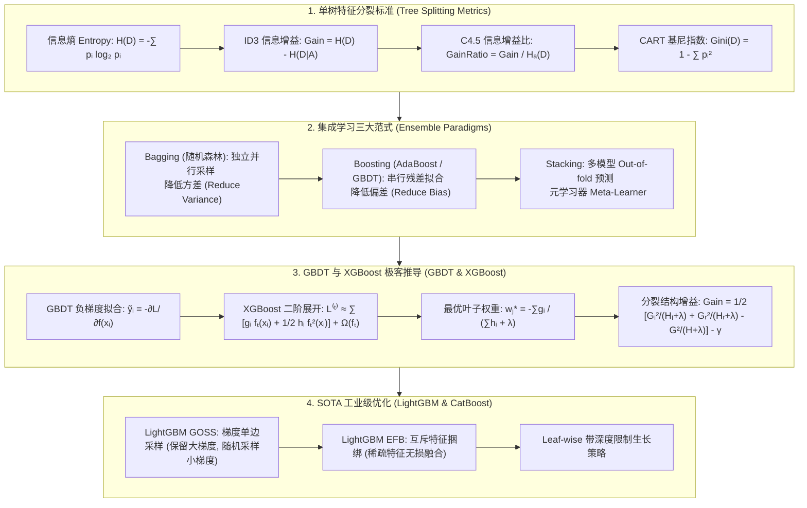

# 决策树与集成学习：CART、GBDT 负梯度拟合、XGBoost 二阶展开与 LightGBM 极客全解

> **核心摘要**：树模型与集成学习是表格数据 (Tabular Data) 领域的无冕之王。本指南系统梳理从单棵决策树的特征选择规则 (ID3 / C4.5 / CART) 到集成学习范式 (Bagging vs Boosting)，深入剖析 GBDT 的负梯度拟合、XGBoost 的二阶泰勒展开与正则化叶子权重推导，以及 SOTA 算法 LightGBM (GOSS / EFB) 的底层优化。

---

## 🧭 知识体系全景流程图 (Knowledge Map & Architecture Graph)



---

## 💡 经典面试追问与考点速查

* **考点 1**：为什么信息增益 (ID3) 偏向于选择取值较多的特征？C4.5 和 CART 如何改进？
  * *标准回答*：取值较多的特征（如用户 ID、身份证号）会将样本切分为极多纯度极高的子集，使得条件熵 $H(D|A) \to 0$，从而计算出极高甚至假的信息增益。C4.5 通过引入固有值（SpltInfo）作为分母构造**信息增益比**来惩罚多值特征；CART 树则采用**Gini 指数**对二叉切分进行衡量，彻底消除了多路切分带来的偏差。
* **考点 2**：从 Bias-Variance 角度说明为什么随机森林 (Random Forest) 降方差，而 GBDT 降偏差？
  * *Standard Response*：随机森林由多棵充分生长的深树（低偏差、高方差）独立并行建立，根据方差公式 $\text{Var}(\bar{X}) = \frac{1}{M}\sigma^2 + \frac{M-1}{M}\rho \sigma^2$，通过 Bootstrap 样本采样与随机特征子集抽取降低树之间的相关性 $\rho$，从而显著**降低方差**；而 GBDT 每棵树是浅树（高偏差、低方差），通过串行拟合前序模型的负梯度/残差，不断纠正预测误差，逐步**降低偏差**。
* **考点 3**：XGBoost 相比传统 GBDT 有哪些核心突破与改进？
  * *Standard Response*：1）**二阶展开**：使用一阶导数 $g_i$ 和二阶导数 $h_i$ 泰勒展开，支持任意可导自定义损失函数，拟合更精准；2）**显式正则化**：在目标函数中直接加入叶子节点数 $\gamma T$ 和 $L_2$ 权重惩罚 $\frac{1}{2}\lambda \sum w_j^2$，有效防止过拟合；3）**工程并发与缺失值自动处理**：支持 Block 预排序并行查找 split 点，以及自动学习缺失值的默认切分分支。

---

## 📚 第一章：决策树基本原理与三大分割标准

### 1.1 分裂指标数学定义与对比

给定数据集 $D$，包含 $K$ 个类别，第 $k$ 类的概率估计为 $p_k = \frac{|C_k|}{|D|}$。

1. **信息熵 (Information Entropy)**：
   $$H(D) = -\sum_{k=1}^K p_k \log_2 p_k$$
2. **ID3 - 信息增益 (Information Gain)**：特征 $A$ 对数据集 $D$ 的经验条件熵为 $H(D|A) = \sum_{v=1}^V \frac{|D_v|}{|D|} H(D_v)$：
   $$g(D, A) = H(D) - H(D|A)$$
3. **C4.5 - 信息增益比 (Information Gain Ratio)**：定义特征 $A$ 的拆分信息熵 $H_A(D) = -\sum_{v=1}^V \frac{|D_v|}{|D|} \log_2 \frac{|D_v|}{|D|}$：
   $$g_R(D, A) = \frac{g(D, A)}{H_A(D)}$$
4. **CART - 基尼指数 (Gini Index)**：测量数据集的不纯度 (Impurity)：
   $$\text{Gini}(D) = 1 - \sum_{k=1}^K p_k^2$$
   特征 $A$ 切分后的二叉基尼指数：
   $$\text{Gini}(D, A) = \frac{|D_1|}{|D|} \text{Gini}(D_1) + \frac{|D_2|}{|D|} \text{Gini}(D_2)$$

> 💡 **直观理解**：三个指标都在测量同一个东西——"这堆样本有多乱"。熵 $-\sum p_k\log_2 p_k$：全部同一类时 $p=1$，熵为 0（最有序）；五五开时熵为 1（最乱）。Gini $1-\sum p_k^2$：全部同类时为 $1-1=0$，五五开时为 $1-0.5=0.5$——本质也是"乱度"。而 Gini 比熵便宜：没有对数运算，所以 CART 工程上更快。信息增益就是"切分前乱度 − 切分后加权乱度"：切得越纯，增益越大。它们的方向完全一致，只是尺子不同。
>
> 🎤 **面试速答**："结论：熵和 Gini 都是不纯度指标，切分目标是让子节点更纯。原理：熵 $-\sum p\log_2 p$（纯=0，五五开=1），Gini $1-\sum p^2$（纯=0，五五开=0.5），信息增益 = 切分前乱度 − 切分后加权乱度。例子：10 正 10 负 → 熵 1.0、Gini 0.5；按某特征切成 8 正 2 负 + 2 正 8 负 → 加权熵约 0.72、Gini 约 0.32，增益明显。补充考点：Gini 计算快（无 log），CART 默认用它；熵对纯度变化更敏感，分割点略细。"

---

### 1.2 三大决策树算法完整对比

| 算法 | 树结构 | 切分标准 | 连续值处理 | 缺失值处理 | 剪枝策略 |
| :--- | :--- | :--- | :--- | :--- | :--- |
| **ID3** | 多叉树 | 信息增益 (Gain) | 不支持 | 不支持 | 无剪枝 (易过拟合) |
| **C4.5** | 多叉树 | 信息增益比 (Gain Ratio) | 排序后二分离散化 | 依据无缺失样本概率按权重划分 | 悲观剪枝 (PEP) |
| **CART** | 严格二叉树 | Gini 指数 (分类) / MSE (回归) | 二叉连续切分 | 替代变量 (Surrogate Splits) | 代价复杂度剪枝 (CCP) |

> 📖 **怎么读这张表**：看"切分标准"和"树结构"两列就能记住进化史：ID3 用信息增益且多叉（偏爱多取值特征）→ C4.5 换成增益比（除以固有值惩罚多值特征）→ CART 改成二叉 + Gini（回归还能用 MSE）。缺失值处理和剪枝是工程能力的分水岭，CART 全支持，所以 sklearn 只有 CART。
>
> 💡 **直观理解**：为什么 ID3 偏爱多值特征？设想特征"身份证号"：每个取值只对应一个人，切分后每个子集纯度 100%，条件熵为 0，信息增益拉满——但这纯属作弊。C4.5 的修复是把增益除以"特征本身取值数的乱度" $H_A(D)$（取值越多 $H_A$ 越大，惩罚越重），CART 则干脆只做二叉切分，天然无多路偏爱。用人话讲：ID3 看到"切得碎"就以为切得好，C4.5 提醒它"切得碎也可能是切的位数太多"，CART 规定"一次只切一刀"。
>
> 🎤 **面试速答**："结论：ID3 用信息增益偏爱多值特征，C4.5 用增益比惩罚它，CART 用二叉 Gini 规避它。原理：多值特征把数据切成纯度极高的碎块使 $H(D|A)\to0$，增益虚高；增益比除以固有值 $H_A(D)$ 作分母；CART 严格二叉。例子：100 个样本的"用户 ID"特征，ID3 切 100 个子集每个纯度 1，增益=1.0（满分作弊）；C4.5 增益比 $=1.0/\log_2 100 \approx 0.15$（被惩罚）；CART 二叉切分根本不会为 ID 浪费一次分裂。一句话：'ID3 数数字，C4.5 数比例，CART 只切一刀。'"

---

## 📚 第二章：集成学习三大范式 (Bagging vs Boosting vs Stacking)

## 📚 第二章：集成学习三大范式 (Bagging vs Boosting vs Stacking)

### 2.1 偏差-方差 (Bias-Variance) 拆解

设基学习器为 $f_m(x)$，集成预测器为 $F(x)$。

* **Bagging (Bootstrap Aggregating)**：
  均值 $F(x) = \frac{1}{M} \sum_{m=1}^M f_m(x)$。
  若所有基学习器的期望为 $\mathbb{E}[f_m(x)] = \mu$，方差为 $\text{Var}(f_m(x)) = \sigma^2$，两两相关系数为 $\rho$：
  $$\text{Var}(F(x)) = \rho \sigma^2 + \frac{1 - \rho}{M} \sigma^2$$
  *结论*：随着基树数量 $M \to \infty$，方差趋于 $\rho \sigma^2$。随机森林通过**样本 Bootstrap** 和 **随机特征采** 将 $\rho$ 降至最低！

* **Boosting**：
  $F_M(x) = F_{M-1}(x) + \eta f_M(x)$。序列化地减小残差，逐步使 $\mathbb{E}[F_M(x)] \to y$，极大**降低模型偏差**。

> 💡 **直观理解**：两个范式的分工来自"错误的两张脸"。Bagging 面对的是"同样的问题每次问结果都不太一样"（方差）：让 $M$ 个独立评委打分再取平均，每个人的随机失误会互相抵消——公式 $\text{Var}(\bar X) = \rho\sigma^2 + \frac{1-\rho}{M}\sigma^2$ 说的就是"评委之间越不相关（$\rho$ 越小），平均越稳"。Boosting 面对的是"答案整体有系统性偏差"（偏差）：与其让一个弱评委反复修正自己，不如让第 $m$ 个评委专门负责"前 $m-1$ 个评委答错的那部分"（残差），逐个击破。随机森林=多抽样本+多抽特征把 $\rho$ 压到最低；GBDT=串行拟合残差把偏差磨到最低。
>
> 🎤 **面试速答**："结论：Bagging（随机森林）降方差，Boosting（GBDT）降偏差。原理：独立评委平均后 $\text{Var}=\rho\sigma^2+(1-\rho)\sigma^2/M$，Bootstrap+随机特征让 $\rho\to0$，方差压到 $\rho\sigma^2$；Boosting 串行拟合前序模型的负梯度/残差，逐轮逼近真值，偏差单调下降。例子：10 棵深树，单树方差 $\sigma^2=100$、相关 $\rho=0.2$ → 集成方差 $=20+80/10=28$，降了 72%；GBDT 用浅树（偏差大）拟合 100 轮残差后，训练偏差能从 0.5 降到 0.05。一句话：'RF 治'抖动'，GBDT 治'跑偏'。"

---

## 📚 第三章：GBDT 与 SOTA 梯度提升框架极限推导

## 📚 第三章：GBDT 与 SOTA 梯度提升框架极限推导

### 3.1 GBDT 负梯度擬合 (Pseudo-Residuals)

对于任意可导损失函数 $L(y, f(x))$，前向分步加法模型为 $f_m(x) = f_{m-1}(x) + \gamma_m h_m(x)$。

对损失函数进行一阶泰勒展开：
$$L(y_i, f_{m-1}(x_i) + h_m(x_i)) \approx L(y_i, f_{m-1}(x_i)) + \left[ \frac{\partial L(y_i, f(x_i))}{\partial f(x_i)} \right]_{f=f_{m-1}} h_m(x_i)$$

为使损失最大程度下降，第 $m$ 棵树 $h_m(x_i)$ 的最速下降方向应拟合**负梯度 (Pseudo-residual)**：

$$\tilde{y}_{i, m} = - \left[ \frac{\partial L(y_i, f(x_i))}{\partial f(x_i)} \right]_{f(x_i) = f_{m-1}(x_i)}$$

* **平方损失下的特例**：$L(y, f) = \frac{1}{2}(y - f)^2 \implies -\frac{\partial L}{\partial f} = y - f(x)$，负梯度正好等于传统残差！

> 💡 **直观理解**：GBDT 的核心思想是"接力赛"：第 $m$ 棵树的唯一任务是把"前面所有树合起来仍然搞错的方向"修正掉。残差（$y - F_{m-1}$）只对平方损失成立；换成任意可导损失后，类比最陡下降法，损失下降最快的方向就是**负梯度** $-\partial L/\partial f$——所以"拟合残差"被推广成"拟合负梯度"，一套公式通吃回归、分类、排序的任意损失。用大白话：残差是"错的量"，负梯度是"怎么改才最省力"。
>
> 🎤 **面试速答**："结论：GBDT 每棵树拟合损失函数的负梯度（伪残差），平方损失下恰等于残差。原理：对损失做一阶泰勒展开 $L(f_{m-1}+h) \approx L(f_{m-1}) + \frac{\partial L}{\partial f}h$，要让损失降得最快，$h$ 应沿负梯度方向，即 $\tilde y_{i,m} = -\partial L/\partial f$。例子：MSE 损失 $-\partial L/\partial f = y - f$，所以 $y=10, F=7$ 时残差 3；换成对数损失时负梯度是 $y - p$（类似逻辑回归）。面试金句：'残差是平方损失的特例，负梯度才是通用的发动机。'"

---

### 3.2 XGBoost 目标函数二阶泰勒展开推导

XGBoost 第 $t$ 步的目标函数包含经验损失与正则化项：
$$\mathcal{L}^{(t)} = \sum_{i=1}^N L\left(y_i, f_{t-1}(x_i) + f_t(x_i)\right) + \Omega(f_t)$$

树复杂度正则项定义为：$\Omega(f_t) = \gamma T + \frac{1}{2} \lambda \sum_{j=1}^T w_j^2$，其中 $T$ 为叶子节点数，$w_j$ 为第 $j$ 个叶子的输出权重。

**第一步：二阶泰勒展开**：
令一阶梯度 $g_i = \frac{\partial L(y_i, f_{t-1}(x_i))}{\partial f_{t-1}(x_i)}$，二阶梯度 $h_i = \frac{\partial^2 L(y_i, f_{t-1}(x_i))}{\partial f_{t-1}^2(x_i)}$：
$$\mathcal{L}^{(t)} \approx \sum_{i=1}^N \left[ L(y_i, f_{t-1}(x_i)) + g_i f_t(x_i) + \frac{1}{2} h_i f_t^2(x_i) \right] + \gamma T + \frac{1}{2} \lambda \sum_{j=1}^T w_j^2$$

移除常数项 $L(y_i, f_{t-1}(x_i))$，并按叶子节点分组 $I_j = \{i \mid q(x_i) = j\}$ 重构求和：
$$\tilde{\mathcal{L}}^{(t)} = \sum_{j=1}^T \left[ \left(\sum_{i \in I_j} g_i\right) w_j + \frac{1}{2} \left(\sum_{i \in I_j} h_i + \lambda\right) w_j^2 \right] + \gamma T$$

令 $G_j = \sum_{i \in I_j} g_i$, $H_j = \sum_{i \in I_j} h_i$：
$$\tilde{\mathcal{L}}^{(t)} = \sum_{j=1}^T \left[ G_j w_j + \frac{1}{2} (H_j + \lambda) w_j^2 \right] + \gamma T$$

**第二步：求极值与最优叶子权重 $w_j^*$**：
对二次函数关于 $w_j$ 求导并令其为 $0$：
$$w_j^* = - \frac{G_j}{H_j + \lambda}$$

代回目标函数得到**树结构评估得分 (Structure Score)**：
$$\tilde{\mathcal{L}}^{(t) *} = - \frac{1}{2} \sum_{j=1}^T \frac{G_j^2}{H_j + \lambda} + \gamma T$$

**第三步：节点切分增益 (Gain) 公式**：
$$\text{Gain} = \frac{1}{2} \left[ \frac{G_L^2}{H_L + \lambda} + \frac{G_R^2}{H_R + \lambda} - \frac{(G_L + G_R)^2}{H_L + H_R + \lambda} \right] - \gamma$$

> 💡 **直观理解**：XGBoost 的三个改进层层递进。① 二阶泰勒展开：GBDT 只看损失"斜率"（一阶导数 $g_i$），XGBoost 连"曲率"（二阶导数 $h_i$）都看了，步子踩得更准——就像导航不只告诉你"偏右"还告诉你"偏多少"。② 正则化 $\gamma T + \frac12\lambda\sum w_j^2$：直接给"叶子个数"和"叶子权重大小"收税，树不敢长得太疯。③ 叶子权重 $w_j^* = -G_j/(H_j+\lambda)$：把每个叶子里的样本"加权平均"，$H_j+\lambda$ 保证分母不为零。Gain 公式则是在问"切一刀（左右两团各自的最优得分之和）比不切（整团得分）好多少，扣掉切分税 $\gamma$ 还赚不赚"。
>
> 🎤 **面试速答**："结论：XGBoost = 二阶泰勒 + 显式正则，叶子权重 $w_j^*=-G_j/(H_j+\lambda)$，分裂增益 Gain 为正才切。原理：损失展开到二阶，$G_j=\sum g_i, H_j=\sum h_i$ 按叶子分组，二次函数求极值得 $w_j^*$；Gain = 左子树得分 + 右子树得分 − 整树得分 − $\gamma$。例子：某节点 $G=10, H=5$，$\lambda=1$ → $w^* = -10/6 \approx -1.67$，该叶子输出约 -1.67；若切分后左 $G_L^2/(H_L+1)=36$、右 $=16$、不切 $=25$、$\gamma=0.1$ → Gain $=\frac12(36+16-25)-0.1=13.4>0$，值得切。金句：'二阶=看得见曲率，正则=交得起罚金，Gain>0 才动刀。'"

---

### 3.3 LightGBM (GOSS & EFB) 工业级突破

### 3.3 LightGBM (GOSS & EFB) 工业级突破

随着数据规模达到千万级，传统预排序与全量梯度计算面临内存与 CPU 瓶颈：

1. **GOSS (Gradient-based One-Side Sampling)**：
   * *原理*：梯度大样本的误差高，对增益计算贡献更大。GOSS 保留前 $a \times 100\%$ 梯度最大的样本，从剩余小梯度样本中随机采样 $b \times 100\%$，并在计算增益时给小梯度样本乘上权重因子 $\frac{1 - a}{b}$ 进行补偿，在极高采样率下保持近似无偏估计！
2. **EFB (Exclusive Feature Bundling)**：
   * *原理*：高维稀疏特征（如 One-Hot 编码）中极少同时非零。EFB 将互斥的特征绑定绑定为一个复合特征 (Bundle)，将特征查找时间复杂度从 $\mathcal{O}(\text{data} \times \text{feature})$ 降至 $\mathcal{O}(\text{data} \times \text{bundle})$。

> 💡 **直观理解**：GOSS 和 EFB 都是"省力气"的工程智慧。GOSS：大梯度样本对分裂增益贡献大（它们错误严重），小梯度样本"改不改进都无所谓"——所以保留全部大梯度样本，只抽样部分小梯度样本，并给被抽中的小梯度样本加权补偿，几乎无损地少算一半数据。EFB：One-Hot 特征天然"互斥"（一个样本一个特征为 1 时其他都为 0），把互斥特征并成一个复合特征，列数从几万降到几百——就像把互不重叠的储物柜编号合并成一套地址系统，省空间且信息不丢。
>
> 🎤 **面试速答**："结论：GOSS 用'留大梯度、抽小梯度+加权补偿'省样本，EFB 把互斥稀疏特征捆绑成复合特征省内存。原理：大梯度=误差大的样本，对增益计算贡献大；小梯度样本按比例抽样并乘 $\frac{1-a}{b}$ 权重保持无偏。例子：100 万样本，GOSS 保留 10% 大梯度 + 从剩余里抽 20% → 只算 30% 的数据，精度损失通常 <1%；One-Hot 的 5 万列特征 90% 互斥 → EFB 捆成 500 个 bundle，内存降 100 倍。一句话：'GOSS 偷懒不偷准，EFB 打包不丢信息。'"

---

### 3.4 1D GBDT 回归手算算例 (Step-by-Step Walkthrough)

### 3.4 1D GBDT 回归手算算例 (Step-by-Step Walkthrough)

假设包含 3 个训练样本：
* $(x_1=1, y_1=2)$, $(x_2=2, y_2=3)$, $(x_3=3, y_3=10)$
* 损失函数为 MSE：$L(y, f) = \frac{1}{2}(y - f)^2$，学习率 $\eta = 0.5$。

1. **步骤 1：初始化常数预测 $f_0(x)$**：
   $$f_0(x) = \bar{y} = \frac{2 + 3 + 10}{3} = 5$$
2. **步骤 2：计算第 1 轮负梯度（残差 $\tilde{y}_i = y_i - f_0(x_i)$）**：
   * $r_{1,1} = 2 - 5 = -3$
   * $r_{2,1} = 3 - 5 = -2$
   * $r_{3,1} = 10 - 5 = 5$
3. **步骤 3：拟合第一棵回归树 $h_1(x)$（假设以 $x = 2.5$ 为切分点）**：
   * 左节点 $R_1 = \{x_1, x_2\}$：叶子输出 $\gamma_1 = \frac{-3 + (-2)}{2} = -2.5$
   * 右节点 $R_2 = \{x_3\}$：叶子输出 $\gamma_2 = 5.0$
4. **步骤 4：更新预测模型 $f_1(x) = f_0(x) + \eta h_1(x)$**：
   * $f_1(x_1) = 5 + 0.5 \times (-2.5) = 3.75$（真值 2，误差显著缩小！）
   * $f_1(x_2) = 5 + 0.5 \times (-2.5) = 3.75$（真值 3）
   * $f_1(x_3) = 5 + 0.5 \times 5.0 = 7.5$（真值 10，逼近真值！）

> 💡 **直观理解**：三步看清 GBDT 的"接力"：先用均值 5 打底（最省力的常数预测）→ 算残差 $-3,-2,+5$（MSE 下负梯度=残差）→ 第一棵树只学残差，切在 $x=2.5$，左叶输出 -2.5、右叶输出 5 → 用学习率 0.5 把树"补"进模型，$f_1 = 5 + 0.5 \times h_1$。注意学习率的作用：一次只迈半步，剩下的残差留给下一棵树——这就是为什么 GBDT 需要几百棵树，而不是一棵大树的"激进追赶"。若 $\eta=1$，$f_1(x_1)=2.5$ 反而过冲到 2.5 以下。
>
> 🎤 **面试速答**："手算闭环：3 个样本 (1,2),(2,3),(3,10)，$f_0=5$ → 残差 $-3,-2,+5$ → 树切 $x=2.5$，左叶均值 $-2.5$、右叶 $5$ → $\eta=0.5$ 更新：$f_1(1)=5+0.5(-2.5)=3.75$（误差从 3 缩到 1.75），$f_1(3)=7.5$（误差从 5 缩到 2.5）。考点：残差递减是因为树学的是'前序模型没做到的部分'；$\eta$ 控制每步迈多大，小学习率+多棵树是标准配方。"

---

### 3.5 Pure Numpy 实现 GBDT 回归器

### 3.5 Pure Numpy 实现 GBDT 回归器

> 💡 **直观理解**：代码把"接力"落实得明明白白：`PureNumpyDecisionTreeRegressor.fit` 遍历所有特征与取值找"MSE 下降最多"的切分点（叶子输出均值）；`PureNumpyGBDTRegressor.fit` 每次计算残差 `residuals = y - f_m`（MSE 的负梯度），让树拟合残差，再 `f_m += self.lr * tree.predict(X)` 把树加权补进模型——与手算算例逐行对应。真实框架只是把"暴力遍历切分点"换成直方图加速，思想完全一致。

```python
import numpy as np

class PureNumpyDecisionTreeRegressor:
    def __init__(self, max_depth=2):
        self.max_depth = max_depth
        self.split_feature = None
        self.split_val = None
        self.left_val = None
        self.right_val = None
        
    def fit(self, X: np.ndarray, y: np.ndarray):
        best_mse = float("inf")
        n_samples, n_features = X.shape
        for f in range(n_features):
            vals = np.unique(X[:, f])
            for v in vals:
                left_mask = X[:, f] <= v
                right_mask = ~left_mask
                if np.sum(left_mask) == 0 or np.sum(right_mask) == 0:
                    continue
                y_l, y_r = y[left_mask], y[right_mask]
                mse = np.sum((y_l - np.mean(y_l))**2) + np.sum((y_r - np.mean(y_r))**2)
                if mse < best_mse:
                    best_mse = mse
                    self.split_feature = f
                    self.split_val = v
                    self.left_val = np.mean(y_l)
                    self.right_val = np.mean(y_r)
                    
    def predict(self, X: np.ndarray) -> np.ndarray:
        mask = X[:, self.split_feature] <= self.split_val
        return np.where(mask, self.left_val, self.right_val)

class PureNumpyGBDTRegressor:
    def __init__(self, n_estimators=10, learning_rate=0.1, max_depth=2):
        self.n_estimators = n_estimators
        self.lr = learning_rate
        self.max_depth = max_depth
        self.trees = []
        self.f0 = 0.0
        
    def fit(self, X: np.ndarray, y: np.ndarray):
        self.f0 = np.mean(y)
        f_m = np.full_like(y, self.f0, dtype=float)
        for _ in range(self.n_estimators):
            residuals = y - f_m  # MSE 负梯度即残差
            tree = PureNumpyDecisionTreeRegressor(max_depth=self.max_depth)
            tree.fit(X, residuals)
            f_m += self.lr * tree.predict(X)
            self.trees.append(tree)
            
    def predict(self, X: np.ndarray) -> np.ndarray:
        preds = np.full(X.shape[0], self.f0)
        for tree in self.trees:
            preds += self.lr * tree.predict(X)
        return preds
```

---

## 📚 第四章：总结与调优路线图

1. **分裂指标选型**：单树分类选 Gini 指数 (CART)，多路连续值特征选 C4.5 信息增益比；
2. **集成范式抉择**：并行基树选随机森林 (RF) 降方差；高精度拟合选 GBDT/XGBoost 降偏差；
3. **工业 SOTA 模型**：推荐大数据量表格使用 LightGBM，多类别离散特征选择 CatBoost。