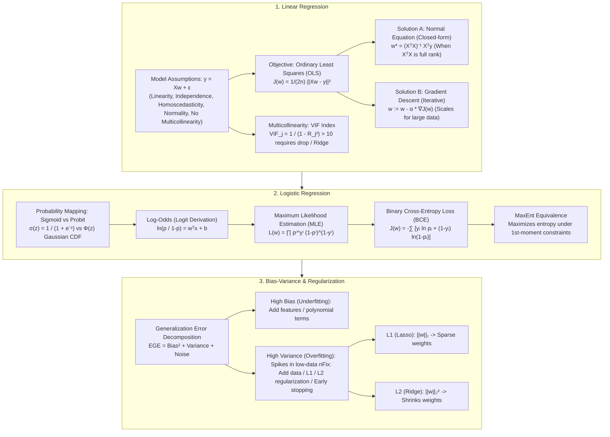

# Linear & Logistic Regression: Mathematical Derivations, Log-Odds, MLE, VIF & Bias-Variance Full Guide

> **Summary**: This comprehensive guide systematically covers the complete mathematical framework for Linear and Logistic Regression. We detail the 5 classical assumptions, OLS derivation, VIF multicollinearity detection, polynomial feature interactions, Sigmoid vs Probit comparison, MLE binary cross-entropy gradient derivation, low-data Bias-Variance bullseye dynamics, and step-by-step numerical calculations.

---

## 🧭 Knowledge Map & Architecture Graph

---

## 💡 High-Frequency Interview Questions & Key Concepts

* **Key Concept 1**: Why is Cross-Entropy preferred over Mean Squared Error (MSE) for Logistic Regression?
  * *Standard Response*: Applying MSE over Sigmoid output leads to a non-convex loss function with multiple local minima. Additionally, when predictions are confident yet wrong (e.g., $\hat{y} \to 0$ when $y=1$), the derivative $\sigma'(z) \to 0$ causes vanishing gradients. Cross-entropy is guaranteed to be convex and yields gradients directly proportional to the prediction residual $(p_i - y_i)$, enabling stable and rapid convergence.
* **Key Concept 2**: How to detect and address multicollinearity using Variance Inflation Factor (VIF)?
  * *Standard Response*: Regress feature $x_j$ against all other features to get coefficient of determination $R_j^2$, then $VIF_j = \frac{1}{1 - R_j^2}$. A $VIF_j > 10$ indicates severe multicollinearity, inflating the variance of coefficient estimates. Solutions include dropping redundant features, PCA dimensionality reduction, or $L_2$ Ridge regularization.
* **Key Concept 3**: Derive the Normal Equation $w = (X^T X)^{-1} X^T y$ and state its limitations.
  * *Standard Response*: Objective $J(w) = \frac{1}{2} \|Xw - y\|^2$. Setting $\nabla_w J(w) = X^T(Xw - y) = 0 \implies X^T X w = X^T y \implies w = (X^T X)^{-1} X^T y$. When $d > n$ or high multicollinearity exists, $X^T X$ becomes singular/non-invertible, failing the closed-form solution.

---

## 📚 Chapter 1: Linear Regression Fundamentals

### 1.1 The 5 Classical Assumptions of Linear Regression

By the Gauss-Markov Theorem, Ordinary Least Squares (OLS) is BLUE under 5 key assumptions:

| Assumption | Expression | Consequence of Violation |
| :--- | :--- | :--- |
| **1. Linearity** | $\mathbb{E}[y \mid X] = Xw$ | Systemic underfitting if relationship is non-linear. |
| **2. Independence** | $\text{Cov}(\epsilon_i, \epsilon_j) = 0, \forall i \neq j$ | Underestimated standard errors (autocorrelation). |
| **3. Homoscedasticity** | $\text{Var}(\epsilon_i \mid X) = \sigma^2$ | Constant residual variance. WLS preferred if violated. |
| **4. Normality** | $\epsilon \sim \mathcal{N}(0, \sigma^2 I)$ | Affects hypothesis tests (t-tests, F-tests). |
| **5. No Multicollinearity** | $\text{rank}(X) = d$ | Full rank matrix $X^T X$. Violations blow up weight variance. |

> 📖 **How to read this table**: The two rows interviewers probe most are #3 (homoscedasticity) and #5 (no multicollinearity) — #3 corrupts standard errors and significance tests, #5 destroys the coefficients themselves. #4 (normality) only affects hypothesis tests (t/F), not point estimates.
>
> 💡 **Intuition**: Think of the 5 assumptions as "measuring height with a good ruler": uniform ticks (linearity), independent measurements (independence), constant measurement noise (homoscedasticity), unbiased noise (normality), no overlapping ticks (no multicollinearity). Break any one and OLS still *computes* a solution, but it is no longer BLUE — like measuring with a bent ruler: numbers come out, but they mean nothing.
>
> 🎤 **Speed answer**: "OLS is BLUE under 5 assumptions: linearity, independence, homoscedasticity, normality, no multicollinearity. Memory hook: the first four mostly affect *significance claims* (standard errors, t-tests); the fifth destroys the *coefficients themselves* (variance explodes, signs can flip). Common remedies: multicollinearity → Ridge or drop features; heteroscedasticity → WLS or robust standard errors."

---

### 1.2 Multicollinearity Detection: Variance Inflation Factor (VIF)

Multicollinearity inflates coefficient estimation variance. Quantitative detection uses VIF:

$$VIF_j = \frac{1}{1 - R_j^2}$$

* $VIF = 1$: No correlation.
* $1 < VIF < 5$: Moderate correlation, acceptable.
* $VIF > 5 \text{ or } 10$: Severe multicollinearity, unstable coefficients.

> 💡 **Intuition**: VIF answers: "How much of feature $x_j$ is already told by the other features?" $R_j^2 \to 1$ means $x_j$ can be almost perfectly replicated — so whether $y$'s effect is credited to $x_j$ or to its twins depends on tiny noise fluctuations, blowing up coefficient variance. $1 - R_j^2$ is the "unique information" share; VIF is its reciprocal: less uniqueness → bigger VIF.
>
> 🎤 **Speed answer**: "Conclusion: VIF > 10 means severe multicollinearity and untrustworthy coefficients. Mechanism: regress $x_j$ on all other features, $VIF_j = 1/(1-R_j^2)$. Example: if $R_j^2 = 0.9$, then VIF = 10 and the coefficient's standard error inflates by about $\sqrt{10} \approx 3.2\times$ — a formerly significant variable can turn insignificant, and signs can even flip. Fixes: drop the feature, PCA, or Ridge ($X^T X + \lambda I$ is always invertible)."

---

### 1.3 Non-Linear Fitting & Feature Interactions

Linear Regression requires parameters to be linear, but feature representations can be non-linear via Basis Expansion:

$$y = w_0 + w_1 x_1 + w_2 x_2 + w_3 x_1^2 + w_4 (x_1 \cdot x_2)$$

> 💡 **Intuition**: "Linear" constrains the *parameters* $w$, not the features $x$. A cook cannot change the recipe's addition rule but can swap ingredients freely: $x_1^2$ and $x_1 x_2$ are just new ingredients (new columns). Since the model stays $y = w^T \phi(x)$ — linear in $w$ — every OLS result (closed-form solution, gradient descent) transfers unchanged. That's why basis expansion is cheap: no new algorithm, just new columns.
>
> 🎤 **Speed answer**: "Conclusion: linear regression can fit nonlinear relationships via basis expansion. Mechanism: linearity refers to parameters; $y = w^T \phi(x)$ is still linear in $w$, so normal equations and gradient descent apply as-is. Example: for house-price prediction, add $x^2$ and an interaction term (area × floor) to capture curvature and cross effects without switching models."

---

### 1.4 Parameter Estimation: OLS & Normal Equation Derivation

In plain words, OLS finds a weight vector $w$ that **minimizes the sum of squared differences between predictions $Xw$ and targets $y$** — squaring prevents positive and negative errors from canceling and penalizes big errors. The matrix form is just the per-sample sum compressed into one vector expression $(Xw - y)^T(Xw - y)$; the $1/(2n)$ factor only cleans up the derivative and makes the loss sample-count-invariant.

$$J(w) = \frac{1}{2n} (Xw - y)^T (Xw - y) = \frac{1}{2n} \left( w^T X^T X w - 2 w^T X^T y + y^T y \right)$$

Derivative with respect to $w$:
$$\frac{\partial J(w)}{\partial w} = \frac{1}{n} \left( X^T X w - X^T y \right) = 0 \implies w^* = (X^T X)^{-1} X^T y$$

> 💡 **Intuition**: The normal equation is a *projection* in disguise. $Xw$ can only land in the subspace spanned by $X$'s columns; to minimize $\|Xw - y\|^2$, the residual $y - Xw$ must be orthogonal to that subspace — i.e., $X^T(y - Xw) = 0$, which rearranges to $X^T X w = X^T y$. So the whole derivation is one sentence: **the residual must be perpendicular to every feature column.**
>
> 🎤 **Speed answer**: "Conclusion: $w^* = (X^T X)^{-1} X^T y$ is the closed-form OLS solution. Mechanism: set the gradient of $\frac12\|Xw-y\|^2$ to zero → $X^T X w = X^T y$, the orthogonality condition. Failure modes: (1) $d > n$ → $X^T X$ singular; (2) strong collinearity → ill-conditioned, tiny noise wrecks the solution; (3) huge data → matrix inversion is $O(d^3)$, gradient descent wins. Memory: closed form is fast but fragile; gradient descent is slow but robust."

---

## 📚 Chapter 2: Logistic Regression & Probabilistic Mapping

### 2.1 Activation Functions: Sigmoid vs Probit vs Step

| Activation | Expression | Distribution Assumption | Properties |
| :--- | :--- | :--- | :--- |
| **Sigmoid** | $\sigma(z) = \frac{1}{1 + e^{-z}}$ | Logistic Distribution | Derivative $\sigma'(z) = \sigma(z)(1 - \sigma(z))$, BCE loss convexity |
| **Probit** | $\Phi(z) = \int_{-\infty}^z \frac{1}{\sqrt{2\pi}} e^{-t^2/2} dt$ | Standard Normal $\mathcal{N}(0,1)$ | Quicker tail decay than Sigmoid, common in econometrics |
| **Step** | $h(z) = \mathbb{I}(z \ge 0)$ | Threshold | Derivative is 0 almost everywhere, impossible for GD |

> 📖 **How to read this table**: Focus on columns 3 and 4. Sigmoid and Probit look almost identical as curves — the real differences are the distributional assumption (Logistic vs Normal) and the derivative: Sigmoid has the self-referential $\sigma' = \sigma(1-\sigma)$, while Probit needs the normal density $\phi(z)$. That is why ML defaults to Sigmoid and only econometrics favors Probit.
>
> 💡 **Intuition**: All three activations are versions of one idea: squeeze the linear score $z$ into a $(0,1)$ probability. Step is a hard switch (jump at 0), Sigmoid is a soft switch (smooth, saturated at both ends), Probit is another soft switch with nearly the same shape. They all say: higher score → probability closer to 1.
>
> 🎤 **Speed answer**: "Conclusion: use Sigmoid, not Step, for classification. Mechanism: Sigmoid smoothly maps $z$ to $(0,1)$ with the elegant derivative $\sigma'=\sigma(1-\sigma)$; combined with MLE it yields a convex cross-entropy loss. Step's derivative is zero almost everywhere, so gradient descent fails. One nuance: Sigmoid's tails are heavier than Probit's, so it treats extreme scores more leniently — the only practically visible behavioral difference."

---

### 2.2 Log-Odds & Parameter Interpretation

$$\ln \left( \frac{p}{1 - p} \right) = w^T x + b$$

> **Interpretation**: A 1-unit increase in $x_j$ increases log-odds by $w_j$, multiplying odds by $e^{w_j}$.

> 💡 **Intuition**: Probability $p$ lives in $(0,1)$, while the linear score $w^T x$ spans all real numbers — we need a bridge. Odds $\frac{p}{1-p}$ stretch $(0,1)$ to $(0,\infty)$ (probability 0.9 → odds 9), and taking logs spreads that across the whole real line. So log-odds is exactly the bridge: $p = \sigma(w^T x)$ and $\ln\frac{p}{1-p} = w^T x$ are two spellings of the same formula, invertible both ways.
>
> 🎤 **Speed answer**: "Conclusion: logistic regression models log-odds as a linear function: $\ln\frac{p}{1-p} = w^T x$, hence $p = \sigma(w^T x)$. Coefficient meaning: each +1 in $x_j$ adds $w_j$ to log-odds and multiplies odds by $e^{w_j}$. Example: in a medical model with $w = 0.5$, one extra unit of the risk factor multiplies the odds of disease by $e^{0.5} \approx 1.65$ — this odds ratio (OR) is why clinical papers report ORs rather than raw coefficients."

---

### 2.3 Maximum Likelihood Estimation (MLE) & BCE Gradient

Bernoulli likelihood and Negative Log-Likelihood (Binary Cross-Entropy):
$$J(w) = -\sum_{i=1}^n \left[ y_i \ln p_i + (1 - y_i) \ln(1 - p_i) \right]$$

Gradient vector:
$$\frac{\partial J(w)}{\partial w} = \sum_{i=1}^n (p_i - y_i) x_i$$

> 💡 **Intuition**: MLE is one idea: **choose parameters that make what actually happened most probable.** Each sample's likelihood is "probability of predicting correctly" $p_i^{y_i}(1-p_i)^{1-y_i}$ (only $p_i$ counts when $y_i=1$; only $1-p_i$ when $y_i=0$); multiply over samples for the full likelihood. Taking the negative log turns products into sums (products underflow) and yields cross-entropy. The final gradient $(p_i - y_i)x_i$ is textbook-elegant: *prediction minus truth, times the feature* — pull the model toward the truth, and it never saturates, unlike MSE-on-Sigmoid gradients that die as $\sigma' \to 0$.
>
> 🎤 **Speed answer**: "Conclusion: logistic regression uses MLE, equivalent to minimizing cross-entropy. Mechanism: likelihood per sample is $p_i^{y_i}(1-p_i)^{1-y_i}$; negative log-likelihood gives $-\sum[y_i\ln p_i + (1-y_i)\ln(1-p_i)]$, which is convex, and its gradient $\sum(p_i-y_i)x_i$ is proportional to the residual. The interview punchline: 'probability loss with a probability model is a natural match' — versus MSE on Sigmoid, which is non-convex and gradient-starved."

---

### 2.4 Numerical Step-by-Step Calculation Example

For $w = 2.0, b = -1.0$ and sample $x_1 = 1.0, y_1 = 1$:
1. **Score**: $z_1 = 2.0(1.0) - 1.0 = 1.0$
2. **Probability**: $p_1 = \sigma(1.0) \approx 0.7311$
3. **BCE Loss**: $\text{Loss}_1 = -\ln(0.7311) \approx 0.3132$
4. **Gradient**: $\frac{\partial \text{Loss}_1}{\partial w} = (0.7311 - 1.0)(1.0) = -0.2689$
5. **Update (learning rate $\alpha = 0.1$)**: $w_{\text{new}} = 2.0 - 0.1(-0.2689) = 2.02689$.

> 💡 **Intuition**: This walkthrough chains the whole chapter: score $z=1.0$ → probability $p=0.731$ (true label $y=1$; the model is confident but not confident enough) → residual $p-y = -0.269$ → weight rises from 2.0 to 2.027. Note the residual is negative yet $w$ *increases* — gradient descent moves against the gradient: $w \leftarrow w - \alpha(p-y)x = 2 - 0.1(-0.269)$. This is the microscopic view of "probability-residual-driven learning".
>
> 🎤 **Speed answer**: "Recite the pipeline: score → probability → residual → negative-gradient update. With $w=2$, $b=-1$, $x=1$, $y=1$: $z=1$, $p=\sigma(1)\approx0.731$, loss $-\ln 0.731\approx0.313$, gradient $(p-y)x=-0.269$, update $w \leftarrow 2 - 0.1(-0.269)=2.027$. Punchline: the gradient depends only on the residual $(p-y)$, so bigger mistakes get bigger corrections, and it never saturates — that is why cross-entropy on Sigmoid converges faster than MSE."

---

## 📚 Chapter 3: Bias-Variance Decomposition Proof & Bullseye Model

### 3.1 Expected Generalization Error Proof

$$\text{EGE} = \underbrace{\left( f(x) - \mathbb{E}[\hat{f}(x)] \right)^2}_{\text{Bias}^2} + \underbrace{\mathbb{E} \left[ (\hat{f}(x) - \mathbb{E}[\hat{f}(x)])^2 \right]}_{\text{Variance}} + \underbrace{\sigma^2}_{\text{Noise}}$$

> 💡 **Intuition**: Picture an archer: Bias² is "how far the average arrow lands from the bullseye" (systematic offset = model expressiveness), Variance is "how spread out the arrows are" (sensitivity to the training sample = memory without generalization), and $\sigma^2$ is "the bullseye itself wobbling" (irreducible data noise). The mathematical hinge: write $y - \hat{f} = \epsilon + (f - \hat{f})$ and expand; the cross term $\mathbb{E}[\epsilon \cdot (f - \hat{f})] = 0$ because noise is independent of the model — that is what makes the clean three-term sum possible.
>
> 🎤 **Speed answer**: "Conclusion: generalization error = Bias² + Variance + Noise; the proof's key step is the cross term vanishing by independence. Mechanism: $y = f + \epsilon$, so $\mathbb{E}[(y-\hat f)^2]$ expands and $\mathbb{E}[\epsilon(f-\hat f)] = 0$; the remainder is bias squared, variance, and $\sigma^2$. Example: an underfit linear model on $n=100$ might have Bias² ≈ 4.0 dominating; an overfit model sees Variance jump from 3.5 to 20; noise $\sigma^2$ is a constant floor (say 1.0) nobody can remove. Takeaway: more data cuts variance, more capacity cuts bias, noise never goes away."

---

### 3.2 Bulls-Eye Diagram Analysis

* **Low Bias / Low Variance**: Target center, accurate and stable.
* **Low Bias / High Variance**: Scatter around center, unstable across data splits.
* **High Bias / Low Variance**: Dense cluster off target, systematic underfitting.
* **High Bias / High Variance**: Wide scatter off target.

> 📖 **How to read this diagram**: Check the vertical (bias) first, then the horizontal (variance): upper-left is ideal; good on train but collapses on new data → upper-right (variance; add data/regularization); can't even fit the train set → lower-left (bias; add capacity/features); bad and scattered → lower-right (wrong model family, switch models).
>
> 💡 **Intuition**: Four kinds of archers: upper-left = sharpshooter (accurate and stable), upper-right = shoots from the hip (far shots, wildly scattered), lower-left = aims wrong (tight cluster off target), lower-right = both wrong and jittery. Diagnosis order always: ask "is it accurate?" (train error), then "is it stable?" (train-vs-validation gap).
>
> 🎤 **Speed answer**: "Four quadrants, four model states: upper-left (ideal) low bias low variance; upper-right (overfitting) low train error, high validation error — fix with more data, regularization, early stopping; lower-left (underfitting) both high and similar — fix with features or capacity; lower-right (wrong structure) — change the model. Memory: 'validation error high? If training is also bad it's bias; if training is good it's variance.'"

---

### 3.3 Low-Data Regimes ($n \ll d$)

When sample size $n$ is smaller than feature count $d$, variance spikes dramatically. Mitigations include capacity reduction, $L_1/L_2$ regularization, data augmentation, and early stopping.

> 💡 **Intuition**: With $n < d$ the model can "cheat": there are more unknowns than equations, so it can almost always find weights that thread every training point exactly (train error 0) — but the solution is steered by noise, and a tiny perturbation of the sample flips the solution wildly. It's like fitting 10 parameters through 3 points: the curve can bend any way to pass through them, with zero generalization.
>
> 🎤 **Speed answer**: "Conclusion: when $n \ll d$, train error approaches 0 while variance explodes — overfitting is the norm. Mechanism: more unknowns than equations lets the model interpolate every training point, so the solution is noise-dominated. Example: 500-dim gene data with only 50 samples — a linear model can hit near-zero train error while validation AUC sits around 0.55. Fixes: reduce dimensionality first (cut features below $n/10$), strong regularization (Ridge/Lasso), data augmentation. One-liner: 'reduce dimensions first, then train.'"

---

## 📝 Summary & Roadmap

1. **Theory**: Master OLS normal equation derivation, Sigmoid log-odds, VIF calculation, and BCE loss gradients.
2. **Diagnostics**: Use VIF to detect multicollinearity and the Bullseye Model to diagnose overfitting.
3. **Whiteboard**: Practice deriving the $\text{Bias}^2 + \text{Variance} + \sigma^2$ error decomposition.