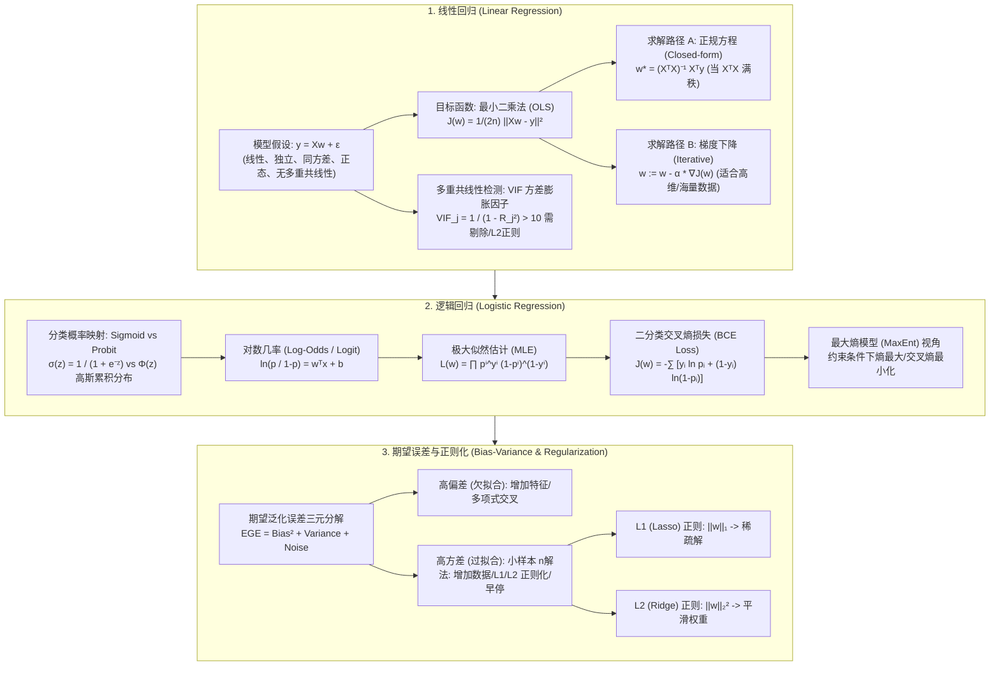

# 线性与逻辑回归：数理推导、Log-Odds、极大似然、VIF检测与 Bias-Variance 全景全解

> **核心摘要**：本指南全面覆盖线性回归与逻辑回归的核心数理框架。通过统一的数学语言，详细梳理从连续拟合到离散分类的演进逻辑、VIF 多重共线性检测、特征交叉拟合非线性、Sigmoid/Probit 选型比较、二分类交叉熵导数推导、小样本环境下的 Bias-Variance 靶心分析以及数值手算流程。

---

## 🧭 知识体系全景流程图 (Knowledge Map & Architecture Graph)



---

## 💡 经典面试追问与考点速查

* **考点 1**：分类问题中，为什么逻辑回归选用交叉熵 (Cross-Entropy) 而非均方误差 (MSE)？
  * *标准回答*：若对 Sigmoid 激活后的概率使用 MSE 损失函数，其关于权重的损失函数是非凸的 (Non-convex)，存在大量局部极小值；且在预测值接近 0 或 1 误判时，Sigmoid 的导数 $\sigma'(z) \to 0$ 会导致梯度消失，使得梯度下降极难收敛。而交叉熵损失函数为凸函数，且梯度与残差 $(y - \hat{y})$ 成正比，收敛快速且稳定。
* **考点 2**：如何通过方差膨胀因子 (VIF) 检测并处理严重多重共线性？
  * *Standard Response*：对第 $j$ 个特征 $x_j$ 作为因变量对其他所有特征回归，得到决定系数 $R_j^2$，则 $VIF_j = \frac{1}{1 - R_j^2}$。当 $VIF_j > 10$ 时，表明 $x_j$ 与其他特征高度相关，会剧烈放大权重估计的方差。解决手段包括删除冗余特征、主成分分析 (PCA) 降维或使用 $L_2$ 岭回归。
* **考点 3**：推导正规方程 (Normal Equation) 的求解过程，并说明其失效场景。
  * *标准回答*：目标函数为 $J(w) = \frac{1}{2} \|Xw - y\|^2$。对其求导 $\nabla_w J(w) = X^T(Xw - y) = 0 \implies X^T X w = X^T y \implies w = (X^T X)^{-1} X^T y$。当 $d > n$ 或存在严重多重共线性时，$X^T X$ 不可逆，正规方程失效。

---

## 📚 第一章：线性回归 (Linear Regression) 数理全解

### 1.1 经典线性回归的 5 大基本假设

线性回归模型形式为 $y = Xw + \epsilon$，最佳线性无偏估计 (BLUE - Gauss-Markov 定理) 依赖于以下 5 大核心假设：

| 假设名称 | 数学表达 | 含义与违背后果 |
| :--- | :--- | :--- |
| **1. 线性关系 (Linearity)** | $\mathbb{E}[y \mid X] = Xw$ | 目标变量 $y$ 与特征 $X$ 呈线性叠加关系。违背时拟合能力不足。 |
| **2. 独立性 (Independence)** | $\text{Cov}(\epsilon_i, \epsilon_j) = 0, \forall i \neq j$ | 样本误差之间相互独立（无自相关）。违背时标准误被低估。 |
| **3. 同方差性 (Homoscedasticity)** | $\text{Var}(\epsilon_i \mid X) = \sigma^2$ | 误差项的方差为常数，不随 $X$ 变化。违背时加权最小二乘 WLS 优于 OLS。 |
| **4. 残差正态性 (Normality)** | $\epsilon \sim \mathcal{N}(0, \sigma^2 I)$ | 误差项服从均值为 0 的正态分布。影响假设检验 (t-test / F-test) 显著性。 |
| **5. 无多重共线性 (No Multicollinearity)** | $\text{rank}(X) = d$ | 特征列向量之间线性独立，$X^T X$ 满秩可逆。违背时权重方差极度放大。 |

> 📖 **怎么读这张表**：面试常考的对比点是第 3 条（同方差）与第 5 条（无共线性）——前者影响标准误和显著性判断，后者直接摧毁系数本身的可靠性；第 4 条正态性只影响假设检验（t/F 检验），不影响点估计。
>
> 💡 **直观理解**：5 条假设就像"用一把好尺子量身高"：刻度均匀（线性）、每次测量互不影响（独立）、测量误差幅度恒定（同方差）、误差不偏不倚（正态）、尺子上没有两段重叠的刻度（无共线性）。任何一条被打破，OLS 的解依然"算得出来"，但不再是 BLUE——相当于用一把弯尺量身高，数字能算，结果不可信。
>
> 🎤 **面试速答**："OLS 要达到 BLUE 需要 5 条假设：线性、独立、同方差、正态、无多重共线性。记忆口诀：前 4 条主要影响'显著性结论'（标准误、t 检验），第 5 条直接破坏'系数本身'（方差爆炸、方向翻转）。最常被追问的补救：共线性→Ridge 或删特征；异方差→WLS 或稳健标准误。"

---

### 1.2 多重共线性检测：方差膨胀因子 (VIF)

当特征向量之间存在高度线性相关时，称为多重共线性。定量检测指标为**方差膨胀因子 (VIF)**：

$$VIF_j = \frac{1}{1 - R_j^2}$$

其中 $R_j^2$ 为将特征 $x_j$ 作为目标变量对其余所有特征进行线性回归得到的决定系数。

* $VIF = 1$：完全无多重共线性。
* $1 < VIF < 5$：轻度相关，通常可接受。
* $VIF > 5 \text{ 或 } 10$：存在严重多重共线性，导致权重系数的标准误被极大地膨胀，拟合系数方向甚至可能出现与常识相反的翻转。

**解决方案**：
1. 剔除高 VIF 特征；
2. 主成分分析 (PCA) 将特征正交化；
3. 引入 $L_2$ 岭回归 (Ridge)，通过在主对角线上增加 $\lambda I$ 使得 $(X^T X + \lambda I)$ 绝对可逆。

> 💡 **直观理解**：VIF 回答的问题是"特征 $x_j$ 有多少信息是其他特征已经告诉我们的"。$R_j^2$ 越接近 1，说明 $x_j$ 几乎可以被其他特征线性复刻——此时把 $y$ 的效应"归功于" $x_j$ 还是它的替身，完全取决于数据里微小的噪声，所以系数方差被放大到近乎无穷。1−R² 是"独有的信息占比"，VIF 就是它的倒数：独有信息越少，VIF 越大。
>
> 🎤 **面试速答**："结论：VIF > 10 表示严重多重共线性，系数不可信。原理：把 $x_j$ 对其他特征回归得 $R_j^2$，$VIF_j = 1/(1-R_j^2)$，衡量的是该特征被其他特征复刻的程度。举个例子：$R_j^2 = 0.9$ 时 VIF = 10，意味着系数标准误会膨胀约 $\sqrt{10} \approx 3.2$ 倍——本来显著的变量可能变得不显著，甚至系数符号翻转。解决：删特征、PCA、或 Ridge 回归加 $\lambda I$ 保证可逆。"

---

### 1.3 非线性拟合与特征交叉 (Feature Interactions)

### 1.3 非线性拟合与特征交叉 (Feature Interactions)

线性回归要求“参数线性” (Linear in Parameters)，但不限制原始特征空间非线性。通过基函数扩展 (Basis Expansion)，可以捕捉非线性关系与特征交叉：

$$y = w_0 + w_1 x_1 + w_2 x_2 + w_3 x_1^2 + w_4 x_2^2 + w_5 (x_1 \cdot x_2)$$

令扩展后的特征向量为 $\phi(x) = [1, x_1, x_2, x_1^2, x_2^2, x_1 x_2]^T$，则模型形式依然为 $y = w^T \phi(x)$，最小二乘法与正规方程推导完全适用。

> 💡 **直观理解**："线性"二字限制的是参数 $w$，不是特征 $x$。就像厨师不能改变菜谱的"加法规则"，但可以随意更换食材：$x_1^2$、$x_1 x_2$ 只是换上新食材（新特征），参数依旧线性相加，所以 OLS 的所有数学结论原封不动地成立——这正是"基函数展开"省钱的地方：不用换算法，只要造新列。
>
> 🎤 **面试速答**："结论：线性回归可以拟合非线性关系，只要特征做基函数展开。原理：线性指参数线性，$y = w^T \phi(x)$ 对 $w$ 求导依旧是线性方程，正规方程和梯度下降照常适用。举个例子：预测房价时加 $x^2$ 项和交叉项 $x_1 x_2$（面积×楼层），就能捕捉曲线和交互效应，而不用换模型。"

---

### 1.4 参数估计：最小二乘法 (OLS) 与正规方程推导

### 1.4 参数估计：最小二乘法 (OLS) 与正规方程推导

用大白话讲，OLS 在做的事就是：**找一组权重 $w$，让所有预测值 $Xw$ 与真实值 $y$ 的平方误差之和最小**——平方让正负误差不互相抵消，同时惩罚大误差。下面的矩阵写法只是把"每个样本的误差平方求和"压缩成一行向量表达式 $(Xw - y)^T(Xw - y)$，加上 $\frac{1}{2n}$ 只是为了让导数简洁（求导后系数恰好为 1）并让损失与样本数无关。

$$J(w) = \frac{1}{2n} (Xw - y)^T (Xw - y) = \frac{1}{2n} \left( w^T X^T X w - 2 w^T X^T y + y^T y \right)$$

对权重向量 $w$ 求偏导数并令梯度为 $0$：
$$\frac{\partial J(w)}{\partial w} = \frac{1}{n} \left( X^T X w - X^T y \right) = 0 \implies w^* = (X^T X)^{-1} X^T y$$

> 💡 **直观理解**：正规方程的几何直觉是"投影"。$Xw$ 只能是 $X$ 的列向量张成的子空间里的点，要让 $\|Xw - y\|^2$ 最小，就必须让残差 $y - Xw$ 与这个子空间正交——正交条件 $X^T(y - Xw) = 0$ 展开就是 $X^T X w = X^T y$，解出来正是 $(X^T X)^{-1}X^T y$。所以整个推导一句话：**残差必须垂直于所有特征列**。
>
> 🎤 **面试速答**："结论：$w^* = (X^T X)^{-1} X^T y$ 是 OLS 的闭式解。原理：对 $J(w) = \frac{1}{2}\|Xw-y\|^2$ 求导令零，得到 $X^T X w = X^T y$，即残差与特征空间正交。失效场景：1) $d > n$ 时 $X^T X$ 奇异不可逆;2) 严重共线性时 $X^T X$ 病态，解对噪声极其敏感;3) 海量数据时矩阵求逆是 $O(d^3)$，不如梯度下降。记忆：闭式解快但脆，梯度下降慢但稳。"

---

## 📚 第二章：逻辑回归 (Logistic Regression) 与概率映射

## 📚 第二章：逻辑回归 (Logistic Regression) 与概率映射

### 2.1 激活函数选型对比：Sigmoid vs Probit vs Step Function

逻辑回归通过激活函数将线性得分 $z = w^T x + b$ 映射到 $(0, 1)$ 区间：

| 激活函数 | 数学表达 | 拟合分布假设 | 梯度与求解特性 |
| :--- | :--- | :--- | :--- |
| **Sigmoid (Logit)** | $\sigma(z) = \frac{1}{1 + e^{-z}}$ | 潜在误差项服从 Logistic 分布 | 导数优雅：$\sigma'(z) = \sigma(z)(1 - \sigma(z))$，极大似然导出 BCE 损失 |
| **Probit** | $\Phi(z) = \int_{-\infty}^z \frac{1}{\sqrt{2\pi}} e^{-t^2/2} dt$ | 潜在误差项服从标准正态分布 $\mathcal{N}(0,1)$ | 尾部衰减比 Sigmoid 更快，常见于计量经济学 |
| **Step (阶跃函数)** | $h(z) = \mathbb{I}(z \ge 0)$ | 纯硬判定门限 | 导数处处为 0 或不可导，无法用于梯度下降求解 |

> 📖 **怎么读这张表**：重点看第三列"分布假设"和第四列"梯度特性"——Sigmoid 与 Probit 的曲线形状几乎一样，真正的差别在于：1) 假设误差服从 Logistic 还是正态分布；2) Sigmoid 有 $\sigma(1-\sigma)$ 这个"自导数"巧性质，Probit 的导数要用正态密度 $\phi(z)$ 表示，训练上没有解析优势，所以机器学习默认选 Sigmoid，计量经济学才常用 Probit。
>
> 💡 **直观理解**：三个激活函数是"同一个直觉"的三个版本：把线性得分 $z$ 压成 $(0,1)$ 的概率。Step 是"硬开关"（过 0 就跳变），Sigmoid 是"软开关"（平滑过渡且两端饱和），Probit 是另一个形状几乎相同的"软开关"。它们要的都是一件事：**得分越高，判定为正类的概率越接近 1**。
>
> 🎤 **面试速答**："结论：分类激活首选 Sigmoid，不用 Step。原理：Sigmoid 把 $z$ 平滑映射到 $(0,1)$，导数 $\sigma'(z)=\sigma(1-\sigma)$ 能用自身表示，且与 MLE 搭配得到凸的交叉熵损失;Step 导数几乎处处为 0，梯度下降完全失效;Probit 曲线与 Sigmoid 几乎重合，但导数要额外算正态密度，机器学习里少用。补充一个细节：Sigmoid 尾部比 Probit 厚（在 $|z|$ 大时对得分更宽容），这是二者行为上唯一的明显差异。"

---

### 2.2 对数几率 (Log-Odds) 与 权重物理意义

### 2.2 对数几率 (Log-Odds) 与 权重物理意义

定义事件发生的几率 (Odds) 为 $\frac{p}{1 - p}$，对其取自然对数：
$$\ln \left( \frac{p}{1 - p} \right) = w^T x + b$$

> **物理意义**：若特征 $x_j$ 增加 1 个单位，则事件发生的对数几率 (Log-Odds) 增加 $w_j$，几率 (Odds) 变为原来的 $e^{w_j}$ 倍。

> 💡 **直观理解**：概率 $p$ 被限制在 $(0,1)$，而线性得分 $w^T x$ 可以取任意实数——两者之间需要一座"桥"。几率 $\frac{p}{1-p}$ 把 $(0,1)$ 撑到 $(0,+\infty)$（0.9 的概率对应 9 倍几率），再取对数就把范围铺满整个实数轴。所以 log-odds 就是那个让概率与线性模型完美对接的桥：$p = \sigma(w^T x)$ 与 $\ln\frac{p}{1-p} = w^T x$ 是同一个公式的两种写法，互相反解即可。
>
> 🎤 **面试速答**："结论：逻辑回归是'对数几率等于线性得分'的模型。原理：$\ln\frac{p}{1-p} = w^T x$，反解即得 $p = \sigma(w^T x)$。系数解释：$x_j$ 每 +1，log-odds 加 $w_j$，odds 乘 $e^{w_j}$。举个例子：医疗模型中 $w=0.5$，则患病特征每增加 1 单位，患病几率变成原来的 $e^{0.5} \approx 1.65$ 倍（odds 比 OR=1.65）——这就是为什么临床论文里报告 OR 而不是系数本身。"

---

### 2.3 极大似然估计 (MLE) 与交叉熵求导

### 2.3 极大似然估计 (MLE) 与交叉熵求导

样本标签服从伯努利分布，全样本似然函数为：
$$L(w) = \prod_{i=1}^n p_i^{y_i} (1 - p_i)^{1 - y_i}$$

负对数似然得**二分类交叉熵损失 (BCE Loss)**：
$$J(w) = -\sum_{i=1}^n \left[ y_i \ln p_i + (1 - y_i) \ln(1 - p_i) \right]$$

求导后梯度向量表达式极其优雅：
$$\frac{\partial J(w)}{\partial w} = \sum_{i=1}^n (p_i - y_i) x_i$$

> 💡 **直观理解**：MLE 的全部思想就一句话：**选一组参数，让"已经发生的事"发生概率最大**。每个样本的似然是"预测对了的概率" $p_i^{y_i}(1-p_i)^{1-y_i}$（$y_i=1$ 时只有 $p_i$ 生效，$y_i=0$ 时只有 $1-p_i$ 生效），乘起来是全数据似然。取负对数把乘法变加法（连乘容易下溢），就得到交叉熵。最终梯度 $(p_i - y_i)x_i$ 更是"教科书级"的简洁：**预测与真相的差值，乘以特征本身**——预测偏了就往真相方向拉，这正是它比 MSE 梯度（会被 $\sigma'$ 卡死）稳定收敛的原因。
>
> 🎤 **面试速答**："结论：逻辑回归用 MLE 定参数，等价于最小化交叉熵。原理：每个样本的似然是 $p_i^{y_i}(1-p_i)^{1-y_i}$，取负对数连加得到 $-\sum[y_i\ln p_i + (1-y_i)\ln(1-p_i)]$。关键推导：这个损失是凸的，且梯度 $\partial J/\partial w = \sum(p_i-y_i)x_i$ 与残差成正比——残差大则步长大，收敛稳定。面试亮点：对比 MSE+Sigmoid 的非凸与梯度消失，一句话总结'概率损失配概率模型，天然绝配'。"

---

### 2.4 数值代入手算示例 (Numerical Step-by-Step Example)

### 2.4 数值代入手算示例 (Numerical Step-by-Step Example)

考虑二分类问题，设定单特征 $x$ 与偏置，当前参数 $w = 2.0, b = -1.0$。样本点 $x_1 = 1.0, y_1 = 1$：
1. **计算线性得分**：$z_1 = w \cdot x_1 + b = 2.0 \cdot 1.0 - 1.0 = 1.0$
2. **计算 Sigmoid 预测概率**：$p_1 = \sigma(1.0) = \frac{1}{1 + e^{-1.0}} \approx \frac{1}{1 + 0.3679} \approx 0.7311$
3. **计算样本 BCE 损失**：$\text{Loss}_1 = - [1 \cdot \ln(0.7311) + 0] = - (-0.3132) = 0.3132$
4. **计算权重残差梯度**：$\frac{\partial \text{Loss}_1}{\partial w} = (p_1 - y_1) \cdot x_1 = (0.7311 - 1.0) \cdot 1.0 = -0.2689$
5. **梯度更新 (学习率 $\alpha = 0.1$)**：$w_{\text{new}} = 2.0 - 0.1 \cdot (-0.2689) = 2.02689$。权重随残差方向自动纠偏！

> 💡 **直观理解**：这个手算串起整章公式：得分 $z=1.0$ → 概率 $p=0.731$（真实 $y=1$，模型"有点信心但不够"）→ 残差 $p-y = -0.269$（负号表示"预测偏保守，要把 $w$ 调大一点"）→ 权重从 2.0 升到 2.027。注意残差为负（0.731 < 1），而 $w$ 却增加了——因为梯度下降走的是**负梯度方向** $-(-\text{0.2689})$。$x=1$ 时权重每次能修正 $\alpha(p-y)$，这就是"概率残差驱动学习"的微观面貌。
>
> 🎤 **面试速答**："手算口诀：得分 → 概率 → 残差 → 负梯度更新。例子里 $w=2, b=-1, x=1, y=1$：$z=1$，$p=\sigma(1)\approx0.731$，损失 $-\ln 0.731\approx0.313$，梯度 $(p-y)x=-0.269$，更新 $w \leftarrow 2 - 0.1\times(-0.269)=2.027$。亮点：梯度只依赖残差 $(p-y)$，预测越错纠得越狠，且永不饱和——这就是为什么交叉熵配 Sigmoid 收敛比 MSE 快。"

---

## 📚 第三章：偏差-方差分解 (Bias-Variance Decomposition) 严密证明与靶心模型

## 📚 第三章：偏差-方差分解 (Bias-Variance Decomposition) 严密证明与靶心模型

### 3.1 期望预测误差分解证明

假设真实模型 $y = f(x) + \epsilon$（噪声满足 $\mathbb{E}[\epsilon]=0, \text{Var}(\epsilon)=\sigma^2$），模型预测值为 $\hat{f}(x)$。期望泛化误差 (EGE) 推导：

$$\text{EGE} = \mathbb{E} \left[ (y - \hat{f}(x))^2 \right] = \mathbb{E} \left[ ((f(x) - \hat{f}(x)) + \epsilon)^2 \right]$$

展开后由于噪声与模型独立，交叉项为 0：

$$\text{EGE} = \underbrace{\left( f(x) - \mathbb{E}[\hat{f}(x)] \right)^2}_{\text{Bias}^2 \text{ (偏差)}} + \underbrace{\mathbb{E} \left[ (\hat{f}(x) - \mathbb{E}[\hat{f}(x)])^2 \right]}_{\text{Variance \text{ (方差)}}} + \underbrace{\sigma^2}_{\text{Irreducible Error \text{ (不可削减噪声)}}}$$

> 💡 **直观理解**：把模型想象成射箭手：Bias² 是"箭的平均落点离靶心多远"（系统性偏移，代表模型表达能力不足），Variance 是"箭的落点之间散得多开"（对训练数据的敏感度，代表模型记性太好、一换数据就变脸），$\sigma^2$ 是"靶心本身在晃动"（数据噪声，谁都打不中）。证明的数学关键在于：把 $y - \hat{f}$ 拆成 $(\epsilon) + (f - \hat{f})$，展开后噪声项 $\mathbb{E}[\epsilon \cdot (f-\hat{f})] = 0$ 因为噪声与模型无关——所以三项加法才能成立。
>
> 🎤 **面试速答**："结论：泛化误差 = Bias² + Variance + 噪声，证明靠误差项与噪声独立的交叉项归零。原理：$y = f+\epsilon$，$\mathbb{E}[(y-\hat f)^2]$ 展开，交叉项 $\mathbb{E}[\epsilon(f-\hat f)]=0$，剩余三项分别对应系统性偏差、波动方差、不可削减噪声。例子：$n=100$ 的线性数据，欠拟合模型 Bias² 占大头（比如 4.0），过拟合模型 Variance 占大头（比如从 3.5 飙到 20），而噪声 $\sigma^2$ 恒为常数（比如 1.0）——所以'加数据减 Variance、加容量减 Bias、噪声永远减不掉'。"

---

### 3.2 靶心 4 象限模型 (Bulls-Eye Diagram)

### 3.2 靶心 4 象限模型 (Bulls-Eye Diagram)

```text
                低方差 (Low Variance)                 高方差 (High Variance)
         ┌───────────────────────────────────┬───────────────────────────────────┐
 低偏差  │         ◎  (打靶理想中心)          │         ⊙ ⊙ (点散布在中心四周)    │
 (Low)   │   预测值极准且在多次采样下高度稳定  │   单次拟合好但随数据微变剧烈发散   │
         ├───────────────────────────────────┼───────────────────────────────────┤
 高偏差  │         ○  (偏离中心的密集点)       │       .   .  .  (偏离且高度离散)  │
 (High)  │   模型过于简单发生系统性偏离       │   模型错误且训练极其不稳定        │
         └───────────────────────────────────┴───────────────────────────────────┘
```

> 📖 **怎么读这张图**：先看"纵向"（偏差）再想"横向"（方差）：理想在左上角；训练集上表现好但换数据就崩 → 右上角（高方差，加数据/正则化）；训练集都拟合不好 → 左下角（高偏差，加容量/特征）；又差又散 → 右下角（模型结构错了，换模型）。
>
> 💡 **直观理解**：把 4 个象限记成 4 种"弓箭手"：左上=神枪手（准且稳），右上=凭手感乱射（每次射得远但落点四处飞），左下=瞄歪了（落点集中但不在靶心），右下=又歪又抖（彻底失准）。诊断顺序永远是：先问"准不准"（训练误差），再问"稳不稳"（训练与验证误差之差）。
>
> 🎤 **面试速答**："靶心模型 4 象限对应 4 种模型状态：左上（理想）低偏低差；右上（过拟合）训练误差低、验证误差高，解法：加数据、加正则、早停；左下（欠拟合）两者都高且接近，解法：加特征、加深模型；右下（结构错误）又偏又散，解法：换模型。一句话记忆：'验证误差高先分辨——训练也差是偏差，训练好验证差是方差'。"

---

### 3.3 小样本场景 ($n \ll d$) 的 Bias-Variance 动态

在小样本或高维特征场景下，模型极易产生**方差爆炸 (Variance Explosion)**：
* **高维小样本机制**：当样本数 $n$ 小于特征维度 $d$ 时，复杂模型能够完美穿过训练集每一个样本点，使得训练误差为 0，但 Variance 趋于无限大。
* **应对策略**：
  1. **限制模型容量**：使用高偏差、低方差简单模型（如带有强正则化的线性模型或朴素贝叶斯）；
  2. **引入强正则化**：$L_1$ Lasso (产生稀疏解) 或 $L_2$ Ridge (约束超球体)；
  3. **数据扩增 (Data Augmentation) 与迁移学习**。

> 💡 **直观理解**：$n < d$ 时模型有"作弊式"的拟合能力——解方程组 $Xw=y$ 的未知数比方程还多，几乎总能找到一组权重把训练集每个点都精确穿过（训练误差 0），但这组权重被噪声牵着鼻子走，样本稍微变化解就天翻地覆，方差爆炸。这就好比用 10 个参数拟合 3 个点：曲线可以弯成任何形状穿过每个点，但毫无泛化可言。
>
> 🎤 **面试速答**："结论：$n \ll d$ 时训练误差趋近 0 而方差爆炸，过拟合是常态。原理：未知数多于方程，模型可精确插值所有训练点，解被噪声主导。例子：500 维基因数据只有 50 个样本，线性模型也能把训练集拟合到误差 0，但验证集 AUC 可能只有 0.55。解法三件套：降维/选特征（先砍到 $n$ 的 1/10 以内）、强正则（Ridge/Lasso）、数据扩增。一句话：'小样本先降维，再谈训练'。"

---

## 📝 总结与学习路线

1. **理论掌握**：熟练推导 OLS 正规方程、Sigmoid Log-Odds 表达与 BCE 交叉熵梯度。
2. **诊断技能**：学会计算 VIF 指标识别多重共线性，并利用 Bias-Variance 靶心模型诊断欠拟合/过拟合。
3. **白板推导**：能够独立推导期望预测误差的 $\text{Bias}^2 + \text{Variance} + \sigma^2$ 三元拆解。