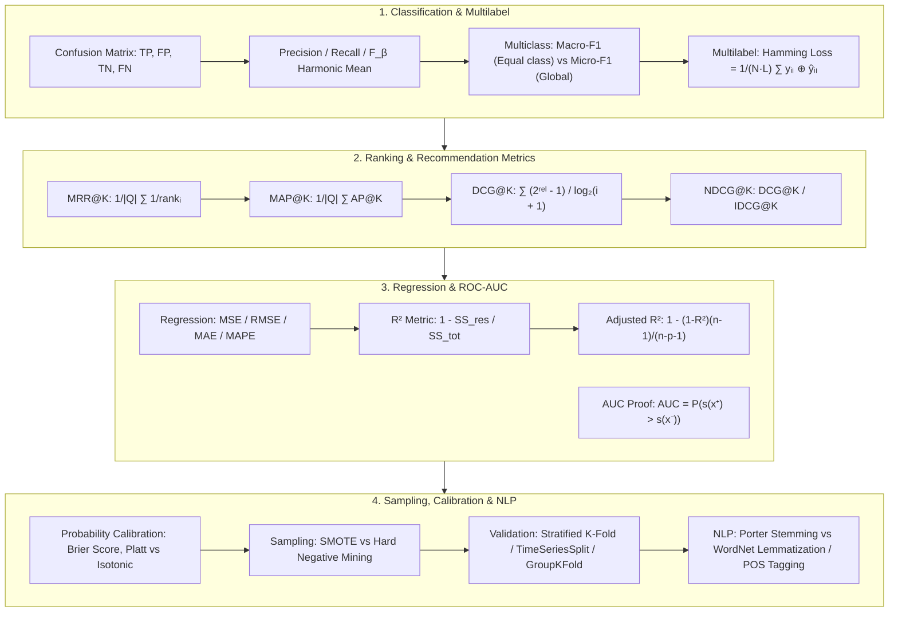

# ML Evaluation Metrics & Data Engineering: Classification, Regression, Ranking (NDCG), Calibration & Preprocessing Guide

> **Summary**: Evaluation metrics and preprocessing form the mathematical bridge connecting raw models to real-world business value. This exhaustive guide covers Classification (Macro/Micro F1, Hamming Loss), Ranking (MRR, MAP, NDCG), Regression (MSE, RMSE, $R^2$, Adjusted $R^2$), ROC vs PR curves, Mann-Whitney U AUC proof, Platt/Isotonic calibration, SMOTE/Hard Negative sampling, and NLP preprocessing.

---

## 🧭 Knowledge Map & Architecture Graph



---

## 💡 High-Frequency Interview Questions & Key Concepts

* **Key Concept 1**: Why is NDCG superior to Precision@K and MAP?
  * *Standard Response*: Precision@K ignores graded relevance; MAP@K considers position of binary relevance but cannot handle multi-grade ratings (e.g. 0 to 3). NDCG@K uses logarithmic discount $\frac{1}{\log_2(i+1)}$ and normalizes by Ideal DCG (IDCG), handling both graded relevance and position decay.
* **Key Concept 2**: Macro-F1 vs Micro-F1.
  * *Standard Response*: Macro-F1 averages per-class F1 scores equally (weights minority classes higher); Micro-F1 aggregates global TP, FP, FN (dominated by majority classes).
* **Key Concept 3**: Adjusted $R^2$ vs $R^2$.
  * *Standard Response*: $R^2 = 1 - \frac{SS_{\text{res}}}{SS_{\text{tot}}}$ never decreases when adding features. Adjusted $R^2 = 1 - (1 - R^2)\frac{N-1}{N-p-1}$ penalizes feature count $p$ to prevent overfitting.

---

## 📚 Chapter 1: Ranking Metrics (NDCG, MAP, MRR)

$$\text{DCG}@K = \sum_{i=1}^K \frac{2^{\text{rel}_i} - 1}{\log_2(i + 1)}$$
$$\text{NDCG}@K = \frac{\text{DCG}@K}{\text{IDCG}@K}$$

> 💡 **Intuition**: NDCG's three design choices each solve one problem: ① $2^{\text{rel}_i} - 1$ exponentially rewards high relevance (relevance 3 earns 7, seven times relevance 1) — good results deserve big prizes; ② $\frac{1}{\log_2(i+1)}$ is position discount: from position 2 onward each step roughly halves the value — later positions are worth less; ③ dividing by IDCG (the best possible score from the ideal ordering) normalizes so queries are comparable. One sentence: **NDCG = how much my ranking earns / how much a perfect ranking would earn.** Contrast with Precision@K (binary, no position weighting) and MAP (binary relevance only) — NDCG handles graded relevance *and* position.
>
> 🎤 **Speed answer**: "Conclusion: NDCG@K = DCG/IDCG, handling both graded relevance and position decay. Mechanism: DCG $=\sum_{i=1}^K\frac{2^{\text{rel}_i}-1}{\log_2(i+1)}$; IDCG recomputes DCG on the relevance-sorted ideal list. Example: Top-3 relevance [3,0,2] → DCG $=7/1 + 0 + 3/2 = 8.5$; ideal [3,2,0] → IDCG $=7+3/\log_2 3\approx8.893$ → NDCG ≈ 0.956. Takeaway: NDCG is the standard ranking metric for search/recommendation because it is graded, position-aware, and normalized across queries."

---

## 📚 Chapter 2: Regression Metrics

$$\text{Adjusted } R^2 = 1 - \left[ \frac{(1 - R^2)(N - 1)}{N - p - 1} \right]$$

> 💡 **Intuition**: $R^2$ has a cheating loophole: adding *any* feature (even pure random noise) never increases $SS_{res}$, so $R^2$ is monotonically non-decreasing — OLS can assign a near-zero coefficient to useless features and never do worse. Adjusted $R^2$ charges a "degrees-of-freedom tax" in the denominator: each added feature shrinks $N-p-1$, penalizing the score. A noise feature's tiny residual gain then fails to cover the tax, so Adjusted $R^2$ falls — it honestly answers "was this feature worth hiring?"
>
> 🎤 **Speed answer**: "Conclusion: Adjusted $R^2 = 1 - \frac{(1-R^2)(N-1)}{N-p-1}$ penalizes the feature count $p$. Mechanism: $R^2$ never decreases when features are added (noise columns still help OLS), so the adjusted version subtracts a freedom penalty. Example: $N=100$, $R^2=0.8$, $p=2$ → Adj ≈ 0.796; add 98 noise features so $p=100$ — $R^2$ rises to 0.9 but Adj $R^2 = 1 - 0.1\times99/(-1) < 0$, instantly exposing that features outnumber samples. Rule: add a feature only if Adjusted $R^2$ goes up."

---

## 📚 Chapter 3: Data Sampling & Preprocessing

* **Hard Negative Mining**: Selects difficult negatives (high loss/similarity).
* **Stemming vs Lemmatization**: Stemming uses heuristic suffix slicing; Lemmatization uses morphological analysis to return valid dictionary lemmas.

> 💡 **Intuition**: Hard Negative Mining and Negative Sampling are different answers to different problems. Hard negatives are "fakes the model almost believed": feeding high-similarity negatives (e.g., products 0.9 similar to what the user clicked) forces the model to sharpen its decision boundary — like a swim coach deliberately training in deep water. Negative Sampling randomly draws ordinary negatives, not to be harder but to replace the full-vocabulary softmax: instead of scoring 100k words, sample 5 and still get an unbiased gradient estimate. Stemming is a blunt scissors (achieved→achiev, fast but not a real word); lemmatization is a dictionary expert (better→good, needs POS, always valid).
>
> 🎤 **Speed answer**: "Conclusion: Hard Negative Mining improves boundary quality by feeding the hardest negatives; Negative Sampling cuts softmax cost by sampling a few negatives. Mechanism: hard negatives carry the largest gradients for the decision boundary; negative sampling shrinks the denominator from $|V|$ to $K$. Example: Word2Vec with a 100k vocabulary sampling 5 negatives cuts each step from 100k to ~5 multiply-adds; contrastive learning on user sessions gains most from negatives that are 0.9-similar but not clicked. For NLP: use stemming for fast retrieval matching, lemmatization + POS where semantic fidelity matters (NER, MT). One-liner: 'Hard negatives teach the boundary; random negatives save compute; stems are fast and rough, lemmas are slow and exact.'"

---

## 📚 Chapter 4: Pure Numpy NDCG Implementation

> 💡 **Intuition**: Twelve lines cover the whole metric: `dcg_at_k` computes exponential gains with `2**r - 1` and generates all discount factors at once with `np.log2(np.arange(2, r.size + 2))` (the denominator starting at 2 is exactly $\log_2(i+1)$); `ndcg_at_k` sorts the relevance scores descending and recomputes DCG to obtain IDCG — the code mirror of the hand-computed ideal ordering.

```python
import numpy as np

class PureNumpyRankingMetrics:
    @staticmethod
    def dcg_at_k(r: np.ndarray, k: int) -> float:
        r = np.asfarray(r)[:k]
        if not r.size: return 0.0
        return np.sum((2**r - 1) / np.log2(np.arange(2, r.size + 2)))

    @staticmethod
    def ndcg_at_k(r: np.ndarray, k: int) -> float:
        dcg_max = PureNumpyRankingMetrics.dcg_at_k(sorted(r, reverse=True), k)
        if not dcg_max: return 0.0
        return PureNumpyRankingMetrics.dcg_at_k(r, k) / dcg_max
```