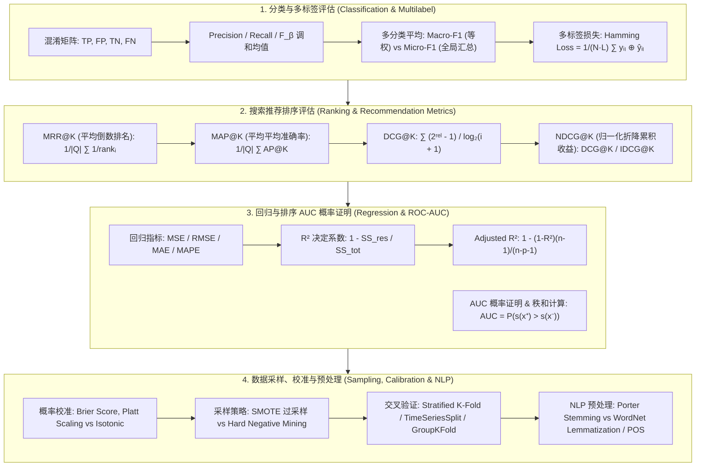

# 机器学习评估指标与数据工程全景：分类/回归/排序(NDCG)、概率校准、不平衡采样与文本预处理极客指南

> **核心摘要**：评估指标与数据预处理是连接模型输出与真实业务价值的数理基石。本指南全量整合 `` 中 9 大模块，涵盖分类评估（混淆矩阵、F-beta、Macro/Micro-F1、Hamming Loss）、搜索推荐排序评估（MRR、MAP、DCG/NDCG）、回归评估（MSE、RMSE、MAPE、$R^2$、Adjusted $R^2$）、ROC/PR 曲线与 AUC 的 Mann-Whitney U 证明、概率校准（Platt/Isotonic）、不平衡采样（SMOTE/Hard Negative Mining）、防泄漏交叉验证以及 NLP 预处理（Stemming/Lemmatization/POS Tagging）。

---

## 🧭 知识体系全景流程图 (Knowledge Map & Architecture Graph)



---

## 💡 经典面试追问与考点速查

* **考点 1**：在搜索与推荐系统中，为何 NDCG 显著优于 Precision@K 和 MAP？
  * *标准回答*：Precision@K 仅关注前 $K$ 个结果中相关物品的二元比例，无法体现物品的相关程度等级 (Graded Relevance)；MAP@K 考虑了二元相关物品的位置，但依然无法支持多级相关性评分（如 0-不相关，1-相关，2-强相关）。**NDCG@K (Normalized Discounted Cumulative Gain)** 通过折降因子 $\frac{1}{\log_2(i+1)}$ 对高隐患低位置的物品进行位置惩罚，并通过理想最佳排序 IDCG 进行归一化，完美解决了多级相关性与位置敏感度两大痛点！
* **考点 2**：Macro-F1 与 Micro-F1 的计算逻辑有何本质不同？长尾类别场景下应参考哪一个？
  * *标准回答*：**Macro-F1** 先分别计算每个类别的 $F1_c$，然后对所有类别求算术平均：$\text{Macro-F1} = \frac{1}{C} \sum F1_c$（**类间平等，赋予小样本类别同等权重**）；**Micro-F1** 则先汇总全量样本的总 $\sum TP_c, \sum FP_c, \sum FN_c$，再计算全局 Precision 和 Recall 并求 $F1$（**样本平等，大样本类别占据主导**）。在长尾极不平衡场景中，**Macro-F1 能敏感捕捉小类别的预测短板**。
* **考点 3**：为什么增加任意特征都会导致 $R^2$ 增加或不变，而 Adjusted $R^2$ 会发生下降？
  * *标准回答*：$R^2 = 1 - \frac{SS_{\text{res}}}{SS_{\text{tot}}}$。在最小二乘法回归中，增加任何特征（哪怕是纯噪音）都会使残差平方和 $SS_{\text{res}}$ 保持不变或降低，因此 $R^2$ 必然单调不减。**Adjusted $R^2$** 引入了特征数量 $p$ 的自由度惩罚：$\text{Adjusted } R^2 = 1 - \left(1 - R^2\right) \frac{n - 1}{n - p - 1}$。如果新加入特征降低残差的贡献不足以抵消自由度 $p$ 增加带来的惩罚，Adjusted $R^2$ 就会下降，从而有效惩罚过拟合与冗余特征！

---

## 📚 第一章：分类评估体系与多标签/多分类扩展

### 1.1 基础分类指标与 $F_\beta$ 调和均值

* **Precision (查准率)**：$P = \frac{TP}{TP + FP}$
* **Recall (查全率/TPR)**：$R = \frac{TP}{TP + FN}$
* **Specificity (特异度/TNR)**：$\text{TNR} = \frac{TN}{TN + FP}$
* **FPR (假正率)**：$\text{FPR} = \frac{FP}{TN + FP} = 1 - \text{TNR}$
* **$F_\beta$ 指数通用表达**：
  $$F_\beta = (1 + \beta^2) \frac{P \cdot R}{\beta^2 P + R}$$
  * $\beta = 0.5$：侧重 Precision（垃圾邮件过滤）；
  * $\beta = 2.0$：侧重 Recall（医疗诊断、信用卡欺诈检测）。

> 💡 **直观理解**：Precision 问"我判为正的里面有多少真对"（宁缺毋滥），Recall 问"真正的正例里我找回了多少"（宁错勿漏）。两者天然矛盾：把阈值调低，Recall 升而 Precision 降。F1 是它们的调和平均（$2PR/(P+R)$）——调和平均对"一头高一头低"很敏感：$P=0.9,R=0.1$ 时算术平均 0.5，F1 只有 0.18，正是这种"罚失衡"让 F1 成为平衡场景的标配。$\beta$ 就是"更在意哪一头"的旋钮。
>
> 🎤 **面试速答**："结论：F1 是 Precision 与 Recall 的调和平均，$\beta$ 控制侧重。原理：$F_\beta=(1+\beta^2)PR/(\beta^2P+R)$，$\beta=1$ 等权，$\beta>1$ 重 Recall。例子：癌症筛查 100 个患者中真患 10 人，模型召回 8 人但误报 20 人 → $R=0.8, P=8/28\approx0.29$，F1≈0.42，而 $\beta=2$ 的 $F_2 \approx 0.62$（更看重没漏诊）。反之垃圾邮件过滤要求 $P$ 高（误杀正常邮件代价大），用 $F_{0.5}$。记忆：'漏诊 vs 误报，哪个代价大就调高哪边的权重。'"

---

### 1.2 多分类 (Multiclass) 平均策略：Macro vs Micro vs Weighted

### 1.2 多分类 (Multiclass) 平均策略：Macro vs Micro vs Weighted

假定有 $C$ 个类别：
1. **Macro-Average (宏平均)**：
   $$P_{\text{macro}} = \frac{1}{C} \sum_{c=1}^C P_c, \quad R_{\text{macro}} = \frac{1}{C} \sum_{c=1}^C R_c, \quad F1_{\text{macro}} = \frac{2 P_{\text{macro}} R_{\text{macro}}}{P_{\text{macro}} + R_{\text{macro}}}$$
2. **Micro-Average (微平均)**：
   $$P_{\text{micro}} = \frac{\sum TP_c}{\sum TP_c + \sum FP_c}, \quad R_{\text{micro}} = \frac{\sum TP_c}{\sum TP_c + \sum FN_c}, \quad F1_{\text{micro}} = \frac{2 P_{\text{micro}} R_{\text{micro}}}{P_{\text{micro}} + R_{\text{micro}}}$$
3. **Weighted-Average (加权平均)**：按各类真实样本占比 $w_c = \frac{N_c}{N}$ 加权：
   $$F1_{\text{weighted}} = \sum_{c=1}^C w_c F1_c$$

> 💡 **直观理解**：三个平均策略回答"谁有投票权"：Macro 给每个类别一票（小类别的声音被放大），Micro 给每个样本一票（大类别主导），Weighted 给每个类别按其样本数投票（介于两者之间）。不平衡场景下，Macro-F1 低而 Micro-F1 高恰恰说明"大类别做得好，小类别被牺牲了"——这是诊断长尾问题的利器。
>
> 🎤 **面试速答**："结论：Macro 类间平等、Micro 样本平等、Weighted 按占比加权。原理：Macro 先算各类 F1 再取平均，Micro 汇总所有 TP/FP/FN 后算全局 F1，Weighted 用 $w_c=N_c/N$ 加权。例子：1000 样本，900 正 100 负；正类 F1=0.95、负类 F1=0.3 → Macro-F1=(0.95+0.3)/2=0.625（暴露负类短板），Micro-F1≈0.89（被大类掩盖），Weighted-F1=0.9×0.95+0.1×0.3=0.885。面试点：不平衡场景报告 Macro-F1 才能看到真实短板。"

---

### 1.3 多标签分类 (Multilabel) 指标：Hamming Loss

### 1.3 多标签分类 (Multilabel) 指标：Hamming Loss

在多标签分类中，一个样本可同时拥有多个标签。汉明损失 (Hamming Loss) 测量预测标签与真实标签的不匹配比例：

$$\text{Hamming Loss} = \frac{1}{N \cdot L} \sum_{i=1}^N \sum_{l=1}^L \mathbb{I}(y_{i,l} \neq \hat{y}_{i,l}) = \frac{1}{N \cdot L} \sum_{i=1}^N \sum_{l=1}^L (y_{i,l} \oplus \hat{y}_{i,l})$$

其中 $L$ 为总标签数，$\oplus$ 表示异或运算。Hamming Loss 越小越好。

> 💡 **直观理解**：多标签任务里"错"有两种：该打的标签没打（漏报）、不该打的打了（误报），Hamming Loss 把两种错一视同仁地计数——把 $N$ 个样本 × $L$ 个标签看成一张 $N\times L$ 的答题卡，统计"打错勾的比例"。它是多标签版的准确率：把每个标签当独立二分类，错了就记一笔。注意它没有"部分正确"的概念：10 个标签猜对 8 个，损失记 2/L 而不是 0。
>
> 🎤 **面试速答**："结论：Hamming Loss = 预测与真实逐标签不一致的比例。原理：$HL = \frac{1}{N\cdot L}\sum\sum \mathbb{I}(y_{i,l}\neq\hat y_{i,l})$，等价于把所有标签摊平成独立二分类算错误率。例子：3 个样本 × 4 个标签，总共 12 个格子，预测错 3 格 → HL=0.25；同一模型 Macro-F1 可能很高，但 HL 直接反映'每格打勾的粗糙度'。对比：精确率/召回率看每类，HL 看全局错率，多标签论文常用它。"

---

## 📚 第二章：搜索与推荐系统排序指标 (MRR, MAP, NDCG)

### 2.1 MRR (Mean Reciprocal Rank - 平均倒数排名)

评估模型将**首个相关物品**排在靠前位置的能力，适用于单一答案检索（如 Q&A 问答系统）：

$$\text{MRR} = \frac{1}{|Q|} \sum_{i=1}^{|Q|} \frac{1}{\text{rank}_i}$$

其中 $\text{rank}_i$ 是第 $i$ 个查询中第一个相关文档的排序位置。

> 💡 **直观理解**：MRR 只关心"第一个正确答案排在第几位"——排第 1 得 1 分，排第 2 得 0.5，排第 10 得 0.1。它适合"答案只有一个"的场合（问答系统、导航搜索"最近的门店"），因为用户只看第一个结果。名字拆开就懂：Reciprocal Rank = 排名的倒数，Mean = 对多个查询取平均。
>
> 🎤 **面试速答**："结论：MRR 衡量第一个相关结果的位置，$MRR = \frac{1}{|Q|}\sum 1/\text{rank}_i$。原理：倒数排名让位置越靠前得分越高且 0-1 归一。例子：3 个查询，第一个相关结果分别排在第 1、3、5 位 → MRR $=(1 + 1/3 + 1/5)/3 \approx 0.51$。适用：单一答案问答（如客服 FAQ）；不适用：多相关结果推荐（该用 NDCG）。一句话：'MRR 是'第一枪就打中'的评分。'"

---

### 2.2 MAP@K (Mean Average Precision)

对于 Query $q$，计算 Top-K 截断下的 Average Precision (AP@K)：

$$\text{AP}@K = \frac{1}{\min(m, K)} \sum_{k=1}^K P@k \cdot \text{rel}(k)$$

其中 $\text{rel}(k) \in \{0, 1\}$ 表示位置 $k$ 是否相关，$m$ 为该 Query 的真实相关文档数。对其在所有 Query 上求均值即得到 **MAP@K**。

> 💡 **直观理解**：AP@K 回答"相关结果整体排得靠不靠前"：在每一个命中位置算一次"当前位置的 Precision@k"再平均。比如相关文档排在位置 2 和 5，就取 P@2 和 P@5 的平均——它奖励"把相关结果往前提"，但只支持 0/1 相关度，无法区分"非常相关"与"勉强相关"。
>
> 🎤 **面试速答**："结论：AP@K = 各相关位置上 Precision@k 的平均，MAP 是对所有查询平均。原理：$AP@K = \frac{1}{\min(m,K)}\sum_{k=1}^K P@k\cdot rel(k)$，只统计命中位置的 P@k。例子：真实相关 3 个，排在位置 1、3、7（K=10）→ P@1=1, P@3=2/3, P@7=3/7 → AP=(1+0.667+0.429)/3≈0.70；全排前面则 AP 接近 1。局限：相关度只有 0/1，多级评分用 NDCG。"

---

### 2.3 NDCG@K (Normalized Discounted Cumulative Gain) 极客推导

### 2.3 NDCG@K (Normalized Discounted Cumulative Gain) 极客推导

设位置 $i$ 处物品的相关度得分为 $\text{rel}_i$（可为多级连续或离散分数，如 $0, 1, 2, 3$）：

1. **CG@K (累积收益)**：$\text{CG}@K = \sum_{i=1}^K \text{rel}_i$
2. **DCG@K (折降累积收益)**：采用对数位置折降系数 $\frac{1}{\log_2(i + 1)}$：
   $$\text{DCG}@K = \sum_{i=1}^K \frac{2^{\text{rel}_i} - 1}{\log_2(i + 1)}$$
3. **IDCG@K (理想折降累积收益)**：按相关度从大到小完美排序后计算出的最大可能 DCG 值；
4. **NDCG@K (归一化折降累积收益)**：
   $$\text{NDCG}@K = \frac{\text{DCG}@K}{\text{IDCG}@K} \in [0, 1]$$

> 💡 **直观理解**：NDCG 的三层设计各解决一个问题：① $2^{\text{rel}_i}-1$ 让"高相关"的收益指数级放大（相关度 3 的收益是 7，是相关度 1 的 7 倍）——好结果值得重奖；② $\frac{1}{\log_2(i+1)}$ 是位置折降：第 2 位往后每后移一位，收益折半再折半——排得越靠后越不值钱；③ 除以 IDCG（理想排序的最大收益）归一化，让不同查询可比。一句话：**NDCG = 我的排序赚了多少 / 完美排序能赚多少**。
>
> 🎤 **面试速答**："结论：NDCG@K = DCG/IDCG，同时处理多级相关性和位置衰减。原理：DCG$=\sum_{i=1}^K\frac{2^{\text{rel}_i}-1}{\log_2(i+1)}$，IDCG 用相关度降序的理想排序计算。例子：Top-3 相关度 [3,0,2]，DCG=7/1+0+3/2=8.5；理想排序 [3,2,0]，IDCG=7+3/1.585≈8.893 → NDCG≈0.956。对比：Precision@3=1/3 看不出好坏顺序，NDCG 能看出'把强相关排第 3 丢了分'。面试点：推荐系统标配，阈值无关、支持分级。"

---

## 📚 第三章：回归模型评估体系 ($R^2$, Adjusted $R^2$, RMSE, MAPE)

## 📚 第三章：回归模型评估体系 ($R^2$, Adjusted $R^2$, RMSE, MAPE)

### 3.1 5 大经典回归指标定义

| 指标名称 | 数学表达式 | 特性与适用场景 |
| :--- | :--- | :--- |
| **MAE (平均绝对误差)** | $\frac{1}{N} \sum \|y_i - \hat{y}_i\|$ | 鲁棒性高，对离群异常点不敏感 |
| **MSE (均方误差)** | $\frac{1}{N} \sum (y_i - \hat{y}_i)^2$ | 处处可导，放大较大误差 |
| **RMSE (均方根误差)** | $\sqrt{\frac{1}{N} \sum (y_i - \hat{y}_i)^2}$ | 量纲与原始目标 $y$ 一致 |
| **MAPE (平均绝对百分比误差)** | $\frac{100\%}{N} \sum \left\| \frac{y_i - \hat{y}_i}{y_i} \right\|$ | 相对误差，横向跨数据集对比（但 $y_i=0$ 时除零失效） |
| **$R^2$ (决定系数)** | $1 - \frac{SS_{\text{res}}}{SS_{\text{tot}}} = 1 - \frac{\sum (y_i - \hat{y}_i)^2}{\sum (y_i - \bar{y})^2}$ | 衡量模型解释数据方差的比例（$R^2=1$ 完美拟合） |

> 📖 **怎么读这张表**：按"量纲"与"鲁棒性"选指标：要可解释的原始单位（预测房价偏差多少万）→ RMSE/MAE；要无量纲的百分比（跨数据集对比）→ MAPE/R²；有离群点 → MAE（平方会放大离群点影响）。注意 RMSE ≥ MAE 恒成立（平方放大），两者差距越大说明离群点越严重。
>
> 💡 **直观理解**：$R^2$ 的回答是"相比'永远猜均值'，我的模型少犯了多少错"：$SS_{tot}$ 是"猜均值"的误差（最笨基线），$SS_{res}$ 是模型误差，$R^2 = 1 - SS_{res}/SS_{tot}$ 就是"少错的百分比"。$R^2=0.9$ 意味着模型的误差只有均值基线的 10%——省掉了 90% 的误差。而 MSE/RMSE 是"平均错多少"（绝对量），MAE 用绝对值不怕离群点，MAPE 用相对百分比。
>
> 🎤 **面试速答**："结论：R² 是相对均值基线的误差削减率，RMSE/MAE 是绝对误差，MAPE 是相对误差。例子：房价真值均值 300 万，$SS_{tot}=10^6$；模型 $SS_{res}=10^5$ → $R^2=0.9$；RMSE=$\sqrt{10^5/100}=31.6$ 万，MAE 若 25 万则说明有少数大误差（RMSE>MAE）。选型：业务汇报用 RMSE（同量纲），跨数据集用 MAPE，离群点多用 MAE。一句话：'R² 看进步，RMSE 看代价。'"

---

### 3.2 Adjusted $R^2$ (调整决定系数) 推导

### 3.2 Adjusted $R^2$ (调整决定系数) 推导

为了惩罚模型引入无关多余特征，定义 Adjusted $R^2$：

$$\text{Adjusted } R^2 = 1 - \left[ \frac{(1 - R^2)(N - 1)}{N - p - 1} \right]$$

其中 $N$ 为样本量，$p$ 为特征个数。只有当新特征带来的残差下降超过随机期望时，Adjusted $R^2$ 才会上升！

> 💡 **直观理解**：$R^2$ 有个"作弊漏洞"：加任何特征（哪怕是纯随机噪声列）都能让 $SS_{res}$ 不增，$R^2$ 只升不降——因为 OLS 可以给无关特征配接近 0 的系数，至少不会更差。Adjusted $R^2$ 的修法是在分母里扣掉"自由度税"：特征每多一个，$N-p-1$ 就小一点，分数被惩罚一点。于是"噪声特征"带来的微小残差下降抵不过惩罚，Adjusted $R^2$ 就下降——它诚实地说出了"这个特征值不值得请"。
>
> 🎤 **面试速答**："结论：Adjusted $R^2 = 1 - \frac{(1-R^2)(N-1)}{N-p-1}$，惩罚特征数 p。原理：$R^2$ 随特征增加单调不减（噪声特征也能蹭到拟合），调整版在分母扣除自由度 $p$ 的代价。例子：$N=100$，$R^2=0.8$，$p=2$ → Adj-R² $=1-0.2\times99/97\approx0.796$；再加 98 个噪声特征 $p=100$，$R^2$ 涨到 0.9，Adj-R² $=1-0.1\times99/(-1)<0$——瞬间暴露'特征比样本还多'。判断：加特征后 Adj-R² 升才值得。"

---

## 📚 第四章：数据采样、校准与 NLP 预处理规范

## 📚 第四章：数据采样、校准与 NLP 预处理规范

### 4.1 采样策略：Hard Negative Mining vs Negative Sampling

| 对比维度 | Hard Negative Mining (硬负采样) | Negative Sampling (负采样) |
| :--- | :--- | :--- |
| **核心思想** | 挑选**最难被区分**的负样本 (高 Loss / 高相似度) | 按频次分布随机采样普通负样本 |
| **典型应用** | 目标检测 (Faster R-CNN)、对比学习 (SimCLR)、向量召回 | Word2Vec (Skip-gram)、Word Embedding、Item2Vec |
| **收敛速度** | 极度加速模型对决策边界极低置信度区域的学习 | 将多分类 Softmax 计算复杂度从 $\mathcal{O}(\|V\|)$ 降至 $\mathcal{O}(K)$ |

> 📖 **怎么读这张表**：分界线在"负样本的质量"与"采样的目的"：Hard Negative 专挑模型分不清的负样本（高相似度/高损失），逼模型把决策边界磨利；Negative Sampling 只是随机抽"普通负样本"来替代全词表 Softmax，目的是省计算而非刁难模型。对比学习/召回 → Hard Negative；Word2Vec/Item2Vec → Negative Sampling。
>
> 💡 **直观理解**：模型学不好往往不是"正样本不够多"，而是"负样本太简单"。Hard Negative Mining 像游泳教练专挑深水区练呛水：只喂"模型差点认成真"的假货，逼它学会区分；Negative Sampling 像点外卖时随机看几个差评：目的不是变难，而是省得把 10 万个商家全看一遍（Softmax 分母太大），随机抽查几个就够估计梯度。
>
> 🎤 **面试速答**："结论：Hard Negative Mining 选'最难区分'的负样本提升边界质量，Negative Sampling 随机抽负样本降低 Softmax 计算量。原理：难负样本梯度大、对边界最有信息量；负采样把分母从 $|V|$ 缩到 $K$（如 10 万词表只抽 5 个）。例子：Faiss 召回里，拿'用户点过但与正样本 0.9 相似度的商品'当负样本，模型迅速学会细粒度区分；Word2Vec 词表 10 万，负采样 5 个就把每步计算从 10 万次乘加降到 5 次。记忆：'难负样本学边界，随机负样本省算力。'"

---

### 4.2 NLP 文本预处理：Stemming vs Lemmatization vs POS

1. **Stemming (词干提取 - 如 Porter Stemmer)**：
   * 基于启发式规则暴力截断词尾后缀（例如 "achieved" $\to$ "achiev"，"studies" $\to$ "studi"）；
   * *特点*：速度极快，但产出词汇可能不是合法字典单词。
2. **Lemmatization (词形还原 - 如 WordNet Lemmatizer)**：
   * 结合形态学分析与字典映射，将单词还原为词条原型（例如 "better" $\to$ "good"，"achieved" $\to$ "achieve"）；
   * *特点*：需要指定词性 (POS Tag)，产出词必定是合法单词，精度更高。
3. **POS Tagging (词性标注)**：
   * 分析单词在上下文句法中的词性标签（如 NN - 名词, VB - 动词, JJ - 形容词）。

> 💡 **直观理解**：Stemming 是"暴力剪刀"——不看词义，按启发式规则把后缀剪掉（achieved→achiev，studies→studi），快但产物可能不是合法词；Lemmatization 是"字典专家"——结合词性查词典把词还原成词条原型（better→good 需要知道它是形容词），慢但保真。区分记忆：Stemming 追求"长得像就算一家人"，Lemmatization 追求"查过家谱才算一家人"。
>
> 🎤 **面试速答**："结论：Stemming 启发式剪后缀（快、可能出非词），Lemmatization 词典+词性还原（慢、必出合法词）。例子：'achieved' 与 'achieving' → Porter 都剪成 'achiev'（不是合法词）；WordNet 分别还原成 'achieve'（合法词条）。'better' 只有 Lemmatization 能还原成 'good'。选型：检索/粗匹配用 Stemming 提速；需要语义保真的下游（如 NER、翻译）用 Lemmatization+POS。一句话：'剪刀快但毛糙，字典慢但靠谱。'"

---

## 📚 第五章：手算 NDCG@3 与 AUC 混合算例 (Step-by-Step Walkthrough)

## 📚 第五章：手算 NDCG@3 与 AUC 混合算例 (Step-by-Step Walkthrough)

考虑某搜索 Query 下得到的 Top-3 推荐列表，相关度得分为：
* 位置 1: $\text{rel}_1 = 3$（强相关）
* 位置 2: $\text{rel}_2 = 0$（不相关）
* 位置 3: $\text{rel}_3 = 2$（中等相关）

假设训练集中该 Query 的理想最优相关度得分排序为：$[3, 2, 0]$。

1. **步骤 1：计算实际输出的 DCG@3**：
   $$\text{DCG}@3 = \frac{2^3 - 1}{\log_2(1 + 1)} + \frac{2^0 - 1}{\log_2(2 + 1)} + \frac{2^2 - 1}{\log_2(3 + 1)} = \frac{7}{1} + \frac{0}{\log_2 3} + \frac{3}{2} = 7 + 0 + 1.5 = 8.5$$
2. **步骤 2：计算理想排序的 IDCG@3 (顺序 $[3, 2, 0]$)**：
   $$\text{IDCG}@3 = \frac{2^3 - 1}{\log_2(1 + 1)} + \frac{2^2 - 1}{\log_2(2 + 1)} + \frac{2^0 - 1}{\log_2(3 + 1)} = \frac{7}{1} + \frac{3}{1.585} + 0 = 7 + 1.893 = 8.893$$
3. **步骤 3：计算归一化 NDCG@3**：
   $$\text{NDCG}@3 = \frac{\text{DCG}@3}{\text{IDCG}@3} = \frac{8.5}{8.893} \approx 0.9558$$

> 💡 **直观理解**：看数字读门道：实际排序 [3,0,2] 得了 8.5，理想排序 [3,2,0] 能得 8.893，NDCG≈0.956——因为唯一的瑕疵是把相关度 2 的项排到了第 3 位（本该第 2）。位置 2 的不相关项贡献 0，但占了黄金位置。若把 [3,0,2] 换成 [3,2,0]，NDCG 就是 1.0。手算时注意 $\log_2(3)=1.585$ 和 $\log_2(4)=2$ 这两个分母是关键数值。
>
> 🎤 **面试速答**："手算闭环：排序 [3,0,2] → DCG$=7/1+0+3/2=8.5$；理想 [3,2,0] → IDCG$=7+3/1.585≈8.893$；NDCG$=8.5/8.893≈0.956$。考点：位置 1 折降因子 1（满分权重），位置 2 是 $\log_2 3$，位置 3 是 2；相关度 3 的收益 $2^3-1=7$ 是相关度 2（收益 3）的两倍多——高相关排前面收益指数放大。白板题：先 DCG 再 IDCG 最后除，三步别跳。"

---

### 5.1 Pure Numpy 实现 NDCG@K 计算器

### 5.1 Pure Numpy 实现 NDCG@K 计算器

> 💡 **直观理解**：代码只有 12 行：`dcg_at_k` 用 `2**r - 1` 算指数收益、`np.log2(np.arange(2, ...))` 一次生成 $\log_2(2), \log_2(3), \dots$ 折降因子（注意分母从 2 开始就是 $\log_2(i+1)$）；`ndcg_at_k` 把相关度降序排序后重算 DCG 得 IDCG——与手算的 [3,2,0] 理想排序完全对应。

```python
import numpy as np

class PureNumpyRankingMetrics:
    @staticmethod
    def dcg_at_k(r: np.ndarray, k: int) -> float:
        r = np.asfarray(r)[:k]
        if not r.size:
            return 0.0
        return np.sum((2**r - 1) / np.log2(np.arange(2, r.size + 2)))

    @staticmethod
    def ndcg_at_k(r: np.ndarray, k: int) -> float:
        dcg_max = PureNumpyRankingMetrics.dcg_at_k(sorted(r, reverse=True), k)
        if not dcg_max:
            return 0.0
        return PureNumpyRankingMetrics.dcg_at_k(r, k) / dcg_max
```

---

## 📚 第六章：总结与调优路线图

1. **分类/排序/回归选型**：多级相关性选 NDCG；不平衡二分类看 PR/AUC；回归防冗余特征看 Adjusted $R^2$；
2. **概率与采样**：高可靠概率输出必用 Platt/Isotonic 校准；对比学习必用 Hard Negative Mining；
3. **文本预处理**：搜索匹配首选 Lemmatization 词形还原与 POS 标注。