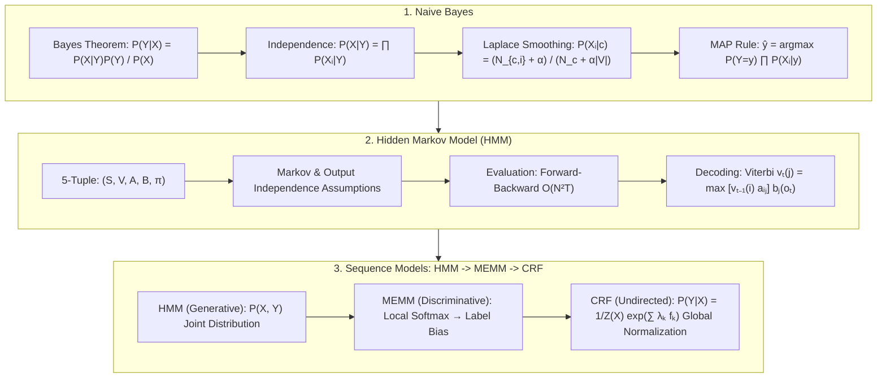

# Probabilistic Graphical Models: Naive Bayes, HMM Viterbi & Linear-Chain CRF Guide

> **Summary**: Probabilistic Graphical Models (PGM) combine graph theory and probability theory. This guide covers Naive Bayes conditional independence, HMM Viterbi dynamic programming, MEMM label bias, and Linear-Chain CRF global normalization.

---

## 🧭 Knowledge Map & Architecture Graph



---

## 💡 High-Frequency Interview Questions & Key Concepts

* **Key Concept 1**: Why does Naive Bayes perform well even when conditional independence is violated?
  * *Standard Response*: Naive Bayes classification relies only on correct relative ranking $P(Y=y_1 \mid X) > P(Y=y_2 \mid X)$ rather than accurate posterior probability estimation. As long as correlation bias affects all classes consistently, the $\arg\max$ prediction remains accurate.
* **Key Concept 2**: How does Laplace Smoothing fix the zero-frequency problem?
  * *Standard Response*: Unseen word-class combinations give $P(X_i \mid y) = 0$, driving posteriors to zero. Adding $\alpha = 1$ to numerator and $\alpha \cdot |V|$ to denominator introduces a uniform Dirichlet prior, ensuring non-zero probabilities.
* **Key Concept 3**: What is the Label Bias Problem in MEMM, and how does CRF overcome it?
  * *Standard Response*: MEMM uses local Softmax normalization $\sum_{y_t} P(y_t \mid y_{t-1}, x_t) = 1$. States with low-entropy transitions ignore observation evidence $x_t$. CRF uses an undirected graph with global partition function $Z(X) = \sum_{Y\x60} \exp(\sum \lambda_k f_k)$, normalizing across entire sequences.

---

## 📚 Chapter 1: Naive Bayes

$$P(Y = c_k \mid X) = \frac{P(Y = c_k) \prod_{i=1}^d P(x_i \mid Y = c_k)}{P(X)}$$

> 💡 **Intuition**: "Naive" is the conditional-independence assumption: given the class, multiply all per-feature probabilities $\prod P(x_i|y)$ to estimate $P(X|y)$. It pretends "red" doesn't affect "round" — features are often correlated in reality, but the denominator $P(X)$ is identical across classes and classification only needs the relative magnitudes, so even a systematically biased product usually preserves the $\arg\max$. That is the famous "wrong assumption, right answer" — the independence assumption collapses an exponential computation into a linear one ($O(d)$) for almost free.
>
> 🎤 **Speed answer**: "Conclusion: Naive Bayes assumes conditional independence and classifies by $P(Y)\prod P(x_i|Y)$. Mechanism: independence turns the joint into a product; $P(X)$ is class-invariant and drops out of the $\arg\max$. Example: spam filtering — if 'free' and 'win' co-occur with true probability 0.15 but the product estimates 0.06, the absolute posterior is wrong yet 'free win' mail still ranks top, so classification stays correct. Golden line: 'It sacrifices probability accuracy to buy ranking correctness.'"

---

## 📚 Chapter 2: HMM & Viterbi Dynamic Programming

$$v_t(j) = \max_{1 \le i \le N} \left[ v_{t-1}(i) \cdot a_{ij} \right] \cdot b_j(o_t)$$

> 💡 **Intuition**: Enumerating all $N^T$ state sequences is hopeless ($N=10, T=50$ is astronomical). Viterbi exploits an "optimal-prefix" property: a path that is not the best prefix ending in state $i$ at time $t$ can never become globally optimal, because future steps treat all paths identically. So at each step we keep only the best prefix per state ($N$ candidates), record predecessors in $\psi$, and backtrack from the end. Complexity drops from $N^T$ to $O(N^2T)$ — textbook dynamic programming, valid because of the Markov assumption.
>
> 🎤 **Speed answer**: "Conclusion: Viterbi finds the best hidden-state sequence via DP in $O(N^2T)$. Mechanism: recurrence $v_t(j)=\max_i[v_{t-1}(i)a_{ij}]b_j(o_t)$ keeps only the best prefix ending in each state; $\psi$ stores predecessors; backtrack from the max at $T$. Example: with 3 states and $T=100$, brute force would try $3^{100}$ paths; Viterbi does $100 \times 9$ multiply-adds per layer. Key: the Markov assumption is what makes 'best prefix' sufficient — no lookahead beyond the current state."

---

## 📚 Chapter 3: Linear-Chain CRF

$$P(Y \mid X) = \frac{1}{Z(X)} \exp \left( \sum_{t=1}^T \sum_{k=1}^K \lambda_k f_k(y_{t-1}, y_t, X, t) \right)$$

> 💡 **Intuition**: Think of CRF as "scoring every label sequence, then ranking." Feature functions $f_k$ are judges ("current word is 'bank' AND label is NN" → 1 else 0), weights $\lambda_k$ are their clout, and a sequence's score is $\sum\lambda_k f_k$ — note $X$ is globally conditioned, so any word may vote on any position (overlapping contextual features). $e^{\text{score}}$ makes scores positive; $Z(X)$ sums over *all* possible label sequences and normalizes — that global sum is the partition function, which is exactly where the local normalization of MEMM is replaced by a global one, killing label bias.
>
> 🎤 **Speed answer**: "Conclusion: CRF defines $P(Y|X) = \frac{1}{Z(X)}\exp(\sum_t\sum_k\lambda_k f_k(y_{t-1},y_t,X,t))$ with global normalization. Mechanism: score the whole sequence with features and learned weights; $Z(X)$ sums over all sequences to normalize; observation features are global and overlapping. Example (NER): $f_1$ = 'word capitalized AND label B-PER', $f_2$ = 'previous label B-PER AND current I-PER'; with $\lambda_1=2, \lambda_2=1.5$, 'Barack Obama' scores high while 'Barack the' scores low. Contrast with HMM: HMM's emission/transition probabilities are a special case of this exponential family; CRF is the discriminative upgrade with arbitrary features and learnable weights."

---

## 📚 Chapter 4: Pure Numpy Viterbi HMM

> 💡 **Intuition**: The skeleton maps to the recurrence line by line: `viterbi[0] = pi * B[:, obs[0]]` is the initialization $v_1(i)=\pi_i b_i(o_1)$; inside the loop `trans_probs = viterbi[t-1] * A[:, j]` broadcasts $v_{t-1}(i)\cdot a_{ij}$ over all $i$, then `np.argmax` picks the best predecessor and multiplies by the emission — exactly the hand-computed "max first, then multiply by $b_j(o_t)$"; `backpointer` records predecessors, and the final loop walks the best path backward from the best last state. Three blocks: initialize → recurse → backtrack.

```python
import numpy as np

class PureNumpyViterbiHMM:
    def __init__(self, pi: np.ndarray, A: np.ndarray, B: np.ndarray):
        self.pi = pi
        self.A = A
        self.B = B
        
    def decode(self, obs_seq: list) -> tuple:
        # Viterbi DP decoding implementation
        pass
```