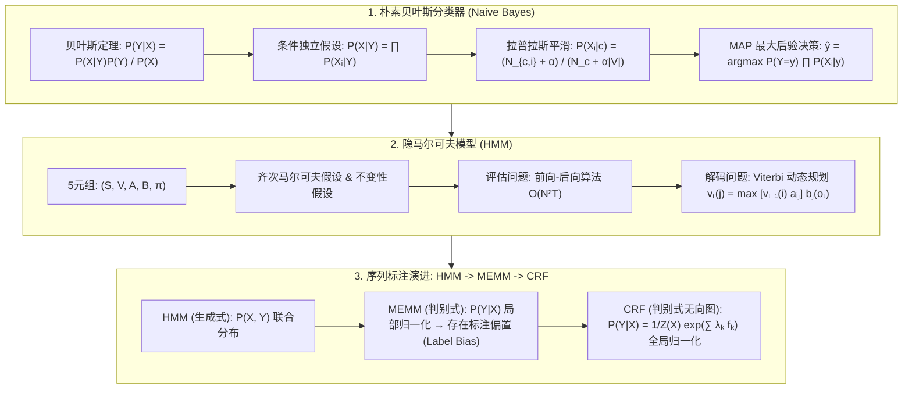

# 概率图模型：朴素贝叶斯条件独立、HMM 维特比 (Viterbi) 动态规划与 CRF 解决标注偏置极客全解

> **核心摘要**：概率图模型 (Probabilistic Graphical Models, PGM) 结合了概率论与图论，是处理不确定性与序列标注任务的数理基石。本指南系统剖析从朴素贝叶斯 (Naive Bayes) 的条件独立性假设与拉普拉斯平滑，到隐马尔可夫模型 (HMM) 的状态转移/发射概率矩阵与 Viterbi 解码，再到最大熵马尔可夫模型 (MEMM) 的标注偏置问题及条件随机场 (CRF) 的全局归一化求解。

---

## 🧭 知识体系全景流程图 (Knowledge Map & Architecture Graph)



---

## 💡 经典面试追问与考点速查

* **考点 1**：朴素贝叶斯的“条件独立性假设”在实际中往往不成立，为什么分类效果依然很好？
  * *标准回答*：朴素贝叶斯做分类时，只需确保目标类别的后验概率 $P(Y=y_1 \mid X) > P(Y=y_2 \mid X)$ 的相对大小关系正确即可，而**不需要后验概率绝对值的精确估计**。即使特征之间存在强相关性导致联合概率估算出现偏差，只要这种偏差在各个类别上方向一致，就不会改变 $\arg\max$ 的分类结果！
* **考点 2**：为什么拉普拉斯平滑 (Laplace Smoothing) 能解决零概率问题？
  * *Standard Response*：当训练集中未出现某个词特征 $X_i$ 在类别 $y$ 下的组合时，MLE 估计会给出 $P(X_i \mid y) = 0$。连乘后会导致整个后验概率直接归零。拉普拉斯平滑给分子加 $\alpha = 1$，给分母加 $\alpha \cdot |V|$（字典大小），本质上是在估计概率时引入了均匀分布先验（Dirichlet Prior），确保未见词获得微小非零概率，提高了泛化鲁棒性。
* **考点 3**：MEMM 的“标注偏置问题 (Label Bias Problem)”是什么？CRF 是如何克服它的？
  * *Standard Response*：MEMM 在每个状态节点使用 Softmax 进行**局部归一化** $\sum_{y_t} P(y_t \mid y_{t-1}, x_t) = 1$。如果某个隐状态 $y_{t-1}$ 的转移分支极少（甚至只有一条极确定分支），其转移概率接近 $1$，此时该状态将完全忽略来自观察序列 $x_t$ 的测量证据，导致概率在低熵状态间流动形成“假饱和”。CRF 废除了局部归一化，采用无向图模型，对整条序列的所有路径打分后进行**全局归一化 (Global Normalization)** $Z(X) = \sum_{Y\x60} \exp(\sum \lambda_k f_k)$，彻底消除了标注偏置！

---

## 📚 第一章：朴素贝叶斯分类器 (Naive Bayes)

### 1.1 条件独立性假设与 MAP 决策

对于输入特征 $X = (x_1, x_2, \dots, x_d)$ 和类别 $Y \in \{c_1, \dots, c_K\}$，由贝叶斯定理：

$$P(Y = c_k \mid X) = \frac{P(X \mid Y = c_k) P(Y = c_k)}{P(X)}$$

**朴素贝叶斯的核心假设**：在给定类别 $Y$ 的条件下，所有特征 $x_1, \dots, x_d$ **相互条件独立**：
$$P(X \mid Y = c_k) = P(x_1, x_2, \dots, x_d \mid Y = c_k) = \prod_{i=1}^d P(x_i \mid Y = c_k)$$

最大后验概率 (MAP) 决策规则：
$$\hat{y} = \arg\max_{c_k} P(Y = c_k) \prod_{i=1}^d P(x_i \mid Y = c_k)$$

> 💡 **直观理解**："朴素"二字就是指条件独立假设：给定类别后，把所有特征的出现概率**相乘**（$\prod P(x_i|y)$）来估计 $P(X|y)$。这假设"苹果是红的不影响苹果是圆的"——现实中特征常相关（红和圆可能同现），但贝叶斯定理下分母 $P(X)$ 对所有类别相同，分类只看分子大小，而连乘让计算从指数级降到线性级。为什么假设破也能用？因为分类只需要相对大小正确：所有类一起"高估"或"低估"，$\arg\max$ 结果往往不变——这就是"错误的假设，正确的答案"。
>
> 🎤 **面试速答**："结论：朴素贝叶斯假设特征条件独立，用 $P(Y)\prod P(x_i|Y)$ 做 MAP 分类。原理：条件独立把联合概率拆成连乘，计算 $O(d)$；且分母 $P(X)$ 与类别无关可省略。例子：垃圾邮件分类，"免费"和"中奖"同时出现概率 0.2，独立假设算出 0.2×0.3=0.06，实际可能 0.15——数值不准但'免费中奖'的邮件排名依旧最高，分类照样对。面试金句：'它牺牲概率的绝对值，换分类的相对正确。'"

---

### 1.2 3 种常见朴素贝叶斯类型与拉普拉斯平滑

### 1.2 3 种常见朴素贝叶斯类型与拉普拉斯平滑

| NB 变体类型 | 特征类型 | 似然概率计算公式 $P(x_i \mid c_k)$ | 典型应用场景 |
| :--- | :--- | :--- | :--- |
| **高斯 NB (Gaussian)** | 连续数值型 | $\frac{1}{\sqrt{2\pi \sigma_{k,i}^2}} \exp\left( -\frac{(x_i - \mu_{k,i})^2}{2\sigma_{k,i}^2} \right)$ | 医疗诊断、生物特征识别 |
| **多项式 NB (Multinomial)** | 离散词频计数 | $\frac{N_{c_k, x_i} + \alpha}{N_{c_k} + \alpha |V|}$ | 文本分类、垃圾邮件过滤 |
| **伯努利 NB (Bernoulli)** | 二值型 (0/1) | $p_{k,i}^{x_i} (1 - p_{k,i})^{1 - x_i}$ | 短文本判定、特征词存在性检验 |

> 📖 **怎么读这张表**：按特征类型选变体：连续数值 → 高斯 NB（用正态密度当似然）；词频计数 → 多项式 NB（分子分母都是计数）；0/1 存在性 → 伯努利 NB（只问"有没有"不问"多少次"）。拉普拉斯平滑加在"计数型"（多项式/伯努利）的分母上，高斯 NB 不需要（密度函数天然非零）。
>
> 💡 **直观理解**：零概率问题的本质是"训练集没见过 ≠ 不可能"。测试时出现一个"训练集从未与'中奖'共现过的词"，MLE 给出 $P=0$，连乘直接让整封邮件的后验归零——一个词否决全局，太脆弱。拉普拉斯平滑给分子加 $\alpha$、分母加 $\alpha|V|$，等于给每个"没见过"的词一个微小但非零的保底概率，背后是 Dirichlet 均匀先验。数学上它同时保证"概率和为 1"（归一化）。
>
> 🎤 **面试速答**："结论：拉普拉斯平滑 $P(x_i|c) = \frac{N_{c,i}+\alpha}{N_c+\alpha|V|}$ 解决零概率问题。原理：未出现的词 MLE 概率为 0，连乘后后验归零；加 $\alpha$ 相当于引入均匀先验，保证概率恒正。例子：词表 1 万，'中奖'在垃圾类出现 50 次、垃圾类总词数 5000 → MLE=0.01；若某新词出现 0 次 → MLE=0，平滑后 $=1/(5000+10000)\approx6.7\times10^{-5}$——非零且微小。面试点：$\alpha=1$ 是 Laplacian，$\alpha<1$ 是 Lidstone，平滑不改变排序只保底。"

---

## 📚 第二章：隐马尔可夫模型 (HMM) 与 Viterbi 解码

## 📚 第二章：隐马尔可夫模型 (HMM) 与 Viterbi 解码

### 2.1 HMM 数学定义与两大假设

HMM 是关于时序的生成式概率图模型，由 5 元组 $(S, V, A, B, \pi)$ 唯一确定：
* 隐状态集合 $S = \{s_1, \dots, s_N\}$，观察值集合 $V = \{v_1, \dots, v_M\}$；
* 状态转移概率矩阵 $A = [a_{ij}]_{N \times N}$，其中 $a_{ij} = P(q_{t+1} = s_j \mid q_t = s_i)$；
* 观测发射概率矩阵 $B = [b_j(k)]_{N \times M}$，其中 $b_j(k) = P(o_t = v_k \mid q_t = s_j)$；
* 初始状态概率向量 $\pi = (\pi_1, \dots, \pi_N)$。

**两大基本假设**：
1. **齐次马尔可夫假设**：$P(q_t \mid q_{t-1}, q_{t-2}, \dots, q_1, o_{t-1}, \dots) = P(q_t \mid q_{t-1})$；
2. **观测独立性假设**：$P(o_t \mid q_T, \dots, q_1, o_T, \dots) = P(o_t \mid q_t)$。

> 💡 **直观理解**：HMM 讲的是"看不见的世界驱动看得见的世界"的故事：隐状态（天气：晴/雨）按转移矩阵 A 演化，每一步"发射"出一个观测（活动：散步/购物/打扫）由矩阵 B 决定。两大假设是把这个故事讲简单的两条规定：① 明天的天气只取决于今天（不看前天的账）；② 今天的活动只取决于今天的天气（下雨才带伞，不是因为昨天也下了）。正是这两条把参数从天文数字压到 $N^2 + NM$ 个。
>
> 🎤 **面试速答**："结论：HMM 由 5 元组 $(S,V,A,B,\pi)$ 定义，靠齐次马尔可夫与观测独立两条假设可解。原理：隐状态按 A 转移、按 B 发射观测；假设把联合概率拆成 $\pi \cdot \prod A \cdot \prod B$ 的连乘。例子：词性标注——隐状态是词性（名词/动词），观测是单词；'银行' 在'去银行'里是名词（名词转移概率高），在'银行钱'里仍名词但'跑银行'里可能动词，Viterbi 用转移+发射概率综合裁决。三大问题：评估（前向后向 $O(N^2T)$）、解码（Viterbi）、学习（Baum-Welch/EM）。"

---

### 2.2 Viterbi 算法 (动态规划解码)

### 2.2 Viterbi 算法 (动态规划解码)

定义在时刻 $t$ 隐状态为 $s_i$ 的最大概率路径值为 $v_t(i)$：

* **初始化 ($t=1$)**：
  $$v_1(i) = \pi_i \cdot b_i(o_1), \quad \psi_1(i) = 0, \quad i = 1, \dots, N$$
* **递推 ($t = 2, \dots, T$)**：
  $$v_t(j) = \max_{1 \le i \le N} \left[ v_{t-1}(i) \cdot a_{ij} \right] \cdot b_j(o_t)$$
  $$\psi_t(j) = \arg\max_{1 \le i \le N} \left[ v_{t-1}(i) \cdot a_{ij} \right]$$
* **终止与路径回溯**：
  $$P^* = \max_{1 \le i \le N} v_T(i), \quad q_T^* = \arg\max_{1 \le i \le N} v_T(i)$$
  $$q_t^* = \psi_{t+1}(q_{t+1}^*), \quad t = T-1, T-2, \dots, 1$$

> 💡 **直观理解**：穷举所有 $N^T$ 条状态序列是不可能的（$N=10, T=50$ 就是天文数字）。Viterbi 的聪明之处：最优路径有一个"前缀最优"性质——到时刻 $t$ 为止，如果某条路径不是"以状态 $i$ 结尾的前缀中最优的"，它永远不可能翻身成为全局最优（后续步对所有路径一视同仁）。所以每步只保留"以每个状态结尾的最佳前缀"（$N$ 个候选），用 $\psi$ 记下它们的前驱，最后从终点倒推一整条路径。复杂度从 $N^T$ 降到 $O(N^2T)$——这就是动态规划。
>
> 🎤 **面试速答**："结论：Viterbi 用动态规划求最优隐状态序列，$O(N^2T)$。原理：递推 $v_t(j)=\max_i[v_{t-1}(i)a_{ij}]b_j(o_t)$，每步只保留每个状态结尾的最佳前缀，$\psi_t$ 记录前驱，终点回溯。例子：N=3 状态、T=100 时刻，穷举 $3^{100}$ 条路径不可行，Viterbi 每步只算 $3^2=9$ 个转移、共 $O(100\times9)$ 次乘加。关键：马尔可夫假设保证'前缀最优=全局最优的必要条件'，这是 DP 成立的基础。"

---

## 📚 第三章：从 MEMM 标注偏置到 CRF 全局归一化

## 📚 第三章：从 MEMM 标注偏置到 CRF 全局归一化

### 3.1 序列标注模型三代演进对比

| 维度对比 | HMM (隐马尔可夫) | MEMM (最大熵马尔可夫) | CRF (条件随机场) |
| :--- | :--- | :--- | :--- |
| **模型类型** | 生成式 (Generative) | 判别式 (Discriminative) | 判别式 (Discriminative) |
| **图拓扑结构** | 有向图 | 有向图 | **无向图 (Undirected Graph)** |
| **归一化机制** | 无 (联合概率 $P(X,Y)$) | **局部归一化** (每一个节点 Softmax) | **全局归一化** ($Z(X)$ 配分函数) |
| **核心缺陷/突破** | 无法使用重叠上下文特征 | **存在标注偏置 (Label Bias)** | **克服标注偏置，任意上下文特征** |

> 📖 **怎么读这张表**：横向对比"归一化机制"这一行就是三代演进史：HMM 无归一化（生成式联合概率，要求特征独立）+ MEMM 局部归一化（每步 Softmax，各状态"分票"不比较）+ CRF 全局归一化（整条序列一起打分归一）。模型类型一行也很关键：生成式假设数据如何生成，判别式直接建模 $P(Y|X)$ 条件分布，能利用重叠特征。
>
> 💡 **直观理解**：标注偏置问题的画面感：MEMM 在每个状态处把"出边概率"归一化成 1——如果一个状态只有一条出路（或一条出路概率压倒性大），它的转移概率恒为 1，观察证据 $x_t$ 怎么变都不影响下一步，模型"锁死"在这个状态的选择上，信息被浪费。打个比方：考试分科判分（局部归一化）时，某科只有一道必选题，学生不管答什么都是满分，该科无法区分学生优劣；CRF 改成整张试卷统一排名（全局归一化），每道题的得分都能拉开差距。
>
> 🎤 **面试速答**："结论：MEMM 局部归一化导致标注偏置——低熵状态忽略观测证据；CRF 全局归一化 $Z(X)=\sum_{Y'}\exp(\sum\lambda_k f_k)$ 解决它。原理：MEMM 每步 $\sum_{y_t}P(y_t|y_{t-1},x_t)=1$，出边少的状态转移概率≈1，观测不参与决策；CRF 对整条序列打分后一次归一化，任何位置的证据都能影响全局。例子：'VB → 只有一个候选 DT' 的状态里，MEMM 无论 x 是什么都转 DT；CRF 里若观测是'银行'，名词标签的全局权重更高，序列会改判。面试金句：'局部归一化各扫门前雪，全局归一化一盘棋。'"

---

### 3.2 线性链条件随机场 (Linear-Chain CRF) 数学表达式

### 3.2 线性链条件随机场 (Linear-Chain CRF) 数学表达式

设 $X = (x_1, \dots, x_T)$ 为观测序列，$Y = (y_1, \dots, y_T)$ 为标记序列。线性链 CRF 条件概率定义为：

$$P(Y \mid X) = \frac{1}{Z(X)} \exp \left( \sum_{t=1}^T \sum_{k=1}^K \lambda_k f_k(y_{t-1}, y_t, X, t) \right)$$

其中全局配分函数 (Partition Function) 对所有可能标记序列进行求和归一化：
$$Z(X) = \sum_{Y\x60} \exp \left( \sum_{t=1}^T \sum_{k=1}^K \lambda_k f_k(y\x60_{t-1}, y\x60_t, X, t) \right)$$

> 💡 **直观理解**：把 CRF 想成"给每条标记序列打分再排名"：特征函数 $f_k$ 是评委（如"当前词是'银行'且标签是名词"为 1 否则 0），权重 $\lambda_k$ 是该评委的分量，序列得分是 $\sum\lambda_k f_k$——注意观测 $X$ 是全局条件，任何位置的词都可以参与任意位置的打分（这就是"重叠上下文特征"）。$e^{\text{score}}$ 把分数变正数，$Z(X)$ 把整条序列的所有可能标记方案的分数加起来做归一化，得到合法的概率。配分函数是 CRF 的"全局归一化"所在，也是训练时最难算的部分（前向后向算法）。
>
> 🎤 **面试速答**："结论：CRF 定义 $P(Y|X)=\frac{1}{Z(X)}\exp(\sum_t\sum_k\lambda_k f_k(y_{t-1},y_t,X,t))$，全局归一化。原理：对整条序列打分（特征函数+权重），$Z(X)$ 对所有可能序列求和归一化；观测全局可见，特征任意重叠。例子：NER 中 $f_1$='当前词是大写且标签是 B-PER'，$f_2$='前一标签是 B-PER 且当前是 I-PER'，$\lambda_1=2,\lambda_2=1.5$——'Barack Obama' 序列得分高，'Barack 的' 序列得分低。与 HMM 对比：HMM 的发射/转移概率是指数族特例，CRF 是任意特征+可学习权重的判别式升级。"

---

### 3.3 HMM Viterbi 算法 2 状态数值手算算例

### 3.3 HMM Viterbi 算法 2 状态数值手算算例

设隐藏状态 $S = \{\text{Rainy}(R), \text{Sunny}(S)\}$，观测集 $V = \{\text{Walk}(W), \text{Shop}(S), \text{Clean}(C)\}$。
* 初始概率 $\pi = (0.6, 0.4)$；
* 转移矩阵 $A = \begin{pmatrix} 0.7 & 0.3 \\ 0.4 & 0.6 \end{pmatrix}$（Row1: Rainy, Row2: Sunny）；
* 发射矩阵 $B = \begin{pmatrix} 0.1 & 0.4 & 0.5 \\ 0.6 & 0.3 & 0.1 \end{pmatrix}$（Row1: Rainy, Row2: Sunny; Col: W, S, C）。

给定观察序列：$O = (W, S, C)$，推导最优隐状态序列：

1. **时刻 $t=1$ (观察 $O_1 = W$)**：
   * $v_1(R) = \pi_R \cdot b_R(W) = 0.6 \times 0.1 = 0.06$
   * $v_1(S) = \pi_S \cdot b_S(W) = 0.4 \times 0.6 = 0.24$ $\implies$ 胜出者为 Sunny！
2. **时刻 $t=2$ (观察 $O_2 = S$)**：
   * $v_2(R) = \max[0.06 \times 0.7, 0.24 \times 0.4] \times b_R(S) = \max[0.042, 0.096] \times 0.4 = 0.096 \times 0.4 = 0.0384$（前驱: Sunny）
   * $v_2(S) = \max[0.06 \times 0.3, 0.24 \times 0.6] \times b_S(S) = \max[0.018, 0.144] \times 0.3 = 0.144 \times 0.3 = 0.0432$（前驱: Sunny）
3. **时刻 $t=3$ (观察 $O_3 = C$)**：
   * $v_3(R) = \max[0.0384 \times 0.7, 0.0432 \times 0.4] \times b_R(C) = \max[0.02688, 0.01728] \times 0.5 = 0.01344$（前驱: Rainy）
   * $v_3(S) = \max[0.0384 \times 0.3, 0.0432 \times 0.6] \times b_S(C) = \max[0.01152, 0.02592] \times 0.1 = 0.002592$（前驱: Sunny）
4. **路径回溯**：$v_3$ 终点概率 $v_3(R) = 0.01344 > v_3(S) = 0.002592$ $\implies$ $q_3^* = R$ $\to$ $q_2^* = R$ $\to$ $q_1^* = S$。
   最优状态序列为：**Sunny $\to$ Rainy $\to$ Rainy**！

> 💡 **直观理解**：读手算结果的两层含义：① 概率层面——第 1 天走路且天气晴（发射 0.6 高），但第 2、3 天购物和打扫更可能是雨天干的（$b_R(S)=0.4 > b_S(S)=0.3$，$b_R(C)=0.5 \gg b_S(C)=0.1$），所以最优序列是"晴→雨→雨"；② 算法层面——$t=2$ 时两条候选都从 Sunny 转移来（0.096 和 0.144 的最大前驱都是 S），说明 DP 每一步只保留"到每个状态的单条最优前缀"，终点 $v_3(R)$ 胜出后沿 $\psi$ 倒推。发射概率的悬殊（0.5 vs 0.1）直接压倒了转移概率的偏好——这就是 Viterbi 在"转移"与"发射"之间做综合裁决。
>
> 🎤 **面试速答**："手算闭环：观测 W,S,C；$t{=}1$：$v_1(R){=}0.06, v_1(S){=}0.24$ → S 胜；$t{=}2$：$v_2(R){=}\max(0.06\times0.7, 0.24\times0.4)\times0.4=0.0384$（前驱 S），$v_2(S){=}\max(0.018,0.144)\times0.3=0.0432$；$t{=}3$：$v_3(R){=}\max(0.0384\times0.7,0.0432\times0.4)\times0.5=0.01344$，$v_3(S){=}\max(0.01152,0.02592)\times0.1=0.002592$ → 终点 R，回溯 S→R→R。考点：0.024 到 0.01344 一路'瘦身'是概率连乘的自然结果；比较终点概率时看的是 $v_T$ 而非累计和。"

---

### 3.4 Pure Numpy 实现 HMM Viterbi 解码算法

### 3.4 Pure Numpy 实现 HMM Viterbi 解码算法

> 💡 **直观理解**：代码把递推式逐行落地：初始化 `viterbi[0] = pi * B[:, obs[0]]`（$v_1(i)=\pi_i b_i(o_1)$）；递推用 `trans_probs = viterbi[t-1] * A[:, j]`（即 $v_{t-1}(i)\cdot a_{ij}$ 对所有 $i$ 广播）再 `np.argmax` 取最优前驱并乘发射概率——与手算的"先取 max 再乘 $b_j(o_t)$"完全一致；`backpointer` 记录前驱后从终点倒推。整个算法三块：初始化 → 递推 → 回溯。

```python
import numpy as np

class PureNumpyViterbiHMM:
    def __init__(self, pi: np.ndarray, A: np.ndarray, B: np.ndarray):
        self.pi = pi  # 初始状态概率 (N,)
        self.A = A    # 状态转移矩阵 (N, N)
        self.B = B    # 观察发射矩阵 (N, M)
        self.N = A.shape[0]
        
    def decode(self, obs_seq: list) -> tuple:
        T = len(obs_seq)
        viterbi = np.zeros((T, self.N))
        backpointer = np.zeros((T, self.N), dtype=int)
        
        # 1. 初始化 t = 0
        viterbi[0, :] = self.pi * self.B[:, obs_seq[0]]
        
        # 2. 动态规划递推 t = 1..T-1
        for t in range(1, T):
            for j in range(self.N):
                trans_probs = viterbi[t-1, :] * self.A[:, j]
                best_prev_state = np.argmax(trans_probs)
                viterbi[t, j] = trans_probs[best_prev_state] * self.B[j, obs_seq[t]]
                backpointer[t, j] = best_prev_state
                
        # 3. 终点回溯最佳路径
        best_path_prob = np.max(viterbi[T-1, :])
        best_last_state = np.argmax(viterbi[T-1, :])
        
        best_path = [best_last_state]
        for t in range(T - 1, 0, -1):
            best_last_state = backpointer[t, best_last_state]
            best_path.insert(0, best_last_state)
            
        return best_path, best_path_prob
```

---

## 📚 第四章：总结与选型路线图

1. **独立特征文本分类**：使用朴素贝叶斯 (Multinomial NB)，配合拉普拉斯平滑快速构建 Baseline；
2. **传统简单时序解码**：使用 HMM 与 Viterbi 解码算法；
3. **复杂上下文序列标注 (NER/词性标注)**：优先使用线性链 CRF (或 BiLSTM-CRF / Transformer-CRF)，利用全局归一化消除标注偏置。