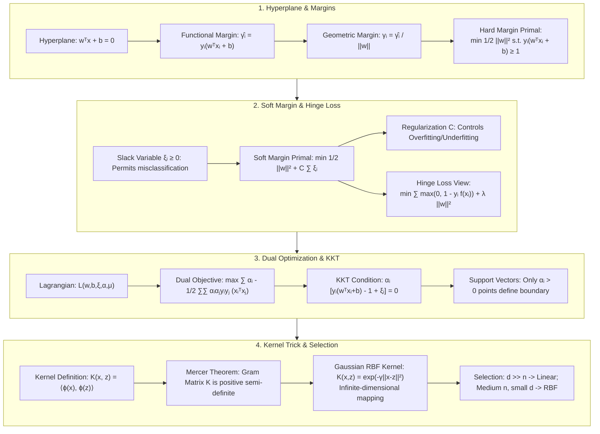

# Support Vector Machines (SVM): Max-Margin Geometry, Duality, KKT & RBF Kernel Guide

> **Summary**: Support Vector Machine (SVM) is one of the most mathematically elegant algorithms in classical statistical learning. This guide provides a systematic analysis of maximum margin geometry, soft-margin slack variables, Lagrangian dual optimization, KKT sparsity, Mercer theorem, kernel tricks, and practical selection matrices.

---

## 🧭 Knowledge Map & Architecture Graph



---

## 💡 High-Frequency Interview Questions & Key Concepts

* **Key Concept 1**: Why is Hard-Margin SVM optimization simplified to minimizing $\frac{1}{2} \|w\|^2$?
  * *Standard Response*: Scaling $w$ and $b$ proportionally does not change the hyperplane. We can fix the functional margin for nearest points to $\hat{\gamma} = 1$. Maximizing geometric margin $\frac{1}{\|w\|}$ is equivalent to minimizing $\|w\|$, which simplifies cleanly to $\frac{1}{2} \|w\|^2$ for smooth gradient optimization.
* **Key Concept 2**: What are the main computational advantages of the Dual formulation over the Primal formulation?
  * *Standard Response*: 1) **Scalability in Dimension**: The primal depends on feature dimension $d$, whereas the dual depends only on sample inner products $(x_i^T x_j)$. 2) **Natural Kernel Support**: The dual formulation depends solely on inner products, enabling non-linear classification by replacing inner products with Kernel functions $K(x_i, x_j)$ without explicitly mapping features to high dimensions.
* **Key Concept 3**: How do KKT conditions explain the sparsity of Support Vectors?
  * *Standard Response*: By KKT complementary slackness $\alpha_i [y_i(w^T x_i + b) - 1 + \xi_i] = 0$, all points outside the margin boundary have $y_i(w^T x_i + b) > 1$, forcing $\alpha_i = 0$. Only sparse points lying on the margin or misclassified have $\alpha_i > 0$. Thus, $w = \sum_{\alpha_i > 0} \alpha_i y_i x_i$ is determined exclusively by support vectors.

---

## 📚 Chapter 1: SVM Mathematical Geometry

### 1.1 Hyperplane & Margins

Given dataset $D = \{(x_1, y_1), \dots, (x_n, y_n)\}$ with $y_i \in \{-1, +1\}$. Hyperplane equation:
$$w^T x + b = 0$$

* **Functional Margin**: $\hat{\gamma}_i = y_i (w^T x_i + b)$
* **Geometric Margin**: $\gamma_i = \frac{y_i (w^T x_i + b)}{\|w\|}$

> 💡 **Intuition**: The functional margin's flaw is exactly why we divide by $\|w\|$: scale $w$ by 2 and the hyperplane does not move, yet every score doubles — the score carries "ruler calibration" noise. Dividing by $\|w\|$ converts the score back into the true Euclidean distance to the plane (recall the point-to-line formula $|ax+by+c|/\sqrt{a^2+b^2}$), which is calibration-free. Geometric margin is the physically comparable "safety distance"; functional margin is just the uncalibrated raw reading.
>
> 🎤 **Speed answer**: "Conclusion: geometric margin = functional margin / ||w|| — the true distance to the hyperplane. Mechanism: $y_i(w^T x_i+b)$ scales with $w$, so we normalize by $\|w\|$, exactly like the point-to-line distance formula. Example: for the plane $2x-3=0$ and point $(2,1)$, the functional margin is $y(2\cdot2-3)=1$ while the geometric margin is $1/\sqrt{2^2+0^2}=0.5$. SVM maximizes every point's geometric margin: the farther from the decision surface, the more confident the classification."

---

### 1.2 Hard Margin SVM Formulation

$$\min_{w, b} \ \frac{1}{2} \|w\|^2 \quad \text{s.t.} \quad y_i (w^T x_i + b) \ge 1, \quad \forall i$$

> 💡 **Intuition**: Why does "maximize the margin" become "minimize $\frac12\|w\|^2$"? The constraints $y_i(w^T x_i+b) \ge 1$ define a "safety corridor" whose walls are $w^T x + b = \pm 1$, each at distance $1/\|w\|$ from the decision plane. To widen the corridor you must shrink $\|w\|$ — just as flattening two parallel lines (smaller slope magnitude) pushes them farther apart. So SVM translates to: "with nobody allowed inside the corridor, find the flattest separating line."
>
> 🎤 **Speed answer**: "Conclusion: hard-margin SVM is $\min \frac12\|w\|^2$ subject to $y_i(w^T x_i+b) \ge 1$. Mechanism: the margin width is $2/\|w\|$ (the gap between $w^Tx+b=\pm1$), so maximizing the margin means minimizing $\|w\|$; the $\frac12$ is for derivative convenience. Example: with $w=(1,2)$ the margin is $2/\sqrt5 \approx 0.89$; with the same direction but $w=(0.5,1)$ it's $2/\sqrt{1.25} \approx 1.79$. Same direction, smaller norm → wider margin. That's the geometric essence: SVM cares about direction, not scale."

---

### 1.3 Soft Margin & Slack Variables

$$\min_{w, b, \xi} \ \frac{1}{2} \|w\|^2 + C \sum_{i=1}^n \xi_i \quad \text{s.t.} \quad y_i (w^T x_i + b) \ge 1 - \xi_i, \quad \xi_i \ge 0$$

* $C \to \infty$: Hard margin (risk of overfitting).
* $C \to 0$: Permits wider margins and misclassifications (risk of underfitting).

> 💡 **Intuition**: The slack $\xi_i$ is a "pass to enter the corridor": $\xi_i = 0$ means well-behaved, $\xi_i = 1$ means lying exactly on the boundary, $\xi_i > 1$ means misclassified. The $C\sum\xi_i$ term is a fine: "trespassing costs $C$ per unit." Big $C$ → expensive fines, nobody dares (hard margin); small $C$ → cheap fines, the corridor happily widens. This converts an infeasible hard constraint into a soft one that always has a solution.
>
> 🎤 **Speed answer**: "Conclusion: soft margin adds $C\sum\xi_i$ to the objective, tolerating violations. Mechanism: $\xi_i \ge 0$ relaxes the constraint to $y_i(w^Tx_i+b) \ge 1-\xi_i$; $C$ is the misclassification fine — larger $C$, stricter fit (overfitting); smaller $C$, wider margin (underfitting). Example: with $C=1000$, one misclassified point costs 1000, so the model shrinks the margin to avoid it; with $C=0.01$, misclassifying costs 0.01, so the model happily misclassifies for a wider margin. Practice: grid-search $C$ and $\gamma$ on a log-2 scale."

---

### 1.4 Hinge Loss Formulation

$$\min_{w, b} \ \sum_{i=1}^n \max\left(0, 1 - y_i (w^T x_i + b)\right) + \frac{1}{2C} \|w\|^2$$

> 💡 **Intuition**: Hinge loss is "three attitudes toward error in one formula": $\max(0, 1 - yf(x))$ — wrong ($yf < 0$) pays more than 1, correct but not confident ($0 \le yf < 1$) pays a partial amount, confident and correct ($yf \ge 1$) pays nothing. Compare 0-1 loss (only wrong pays, but non-differentiable) and log loss (every point pays a little, always smooth). SVM picks Hinge because it demands not just correctness but *distance from the boundary* — that demand is the margin.
>
> 🎤 **Speed answer**: "Conclusion: soft-margin SVM equals Hinge Loss plus $L_2$ regularization. Mechanism: $\max(0, 1-yf(x))$ is zero when $yf(x) \ge 1$, so only boundary-adjacent points (support vectors) contribute gradients — that's the sparsity; log loss is smooth everywhere, so logistic regression is dense. Example: a point with $yf=2$ costs Hinge 0 (SVM ignores it) but still costs logistic regression $\ln(1+e^{-2}) \approx 0.13$. One-liner: SVM is driven only by hard cases; logistic regression is driven by everyone."

---

## 📚 Chapter 2: Lagrangian Duality & KKT Proof

### 2.1 Dual Problem Derivation

$$L(w, b, \xi, \alpha, \mu) = \frac{1}{2} \|w\|^2 + C \sum_{i=1}^n \xi_i - \sum_{i=1}^n \alpha_i \left[ y_i (w^T x_i + b) - 1 + \xi_i \right] - \sum_{i=1}^n \mu_i \xi_i$$

Setting partial derivatives to zero yields dual formulation:

$$\max_{\alpha} \ \sum_{i=1}^n \alpha_i - \frac{1}{2} \sum_{i=1}^n \sum_{j=1}^n \alpha_i \alpha_j y_i y_j (x_i^T x_j)$$
$$\text{s.t.} \quad \sum_{i=1}^n \alpha_i y_i = 0, \quad 0 \le \alpha_i \le C$$

> 💡 **Intuition**: Lagrangian duality is "folding constraints into the objective." The primal "minimize $\frac12\|w\|^2$ with $y_i(w^Tx_i+b) \ge 1$ for every point" is hard because of the constraints; multipliers $\alpha_i$ turn each constraint into a penalty term inside the objective, making it unconstrained. Then plugging the optimality condition $w = \sum\alpha_i y_i x_i$ back in miraculously eliminates $w$ itself, leaving only sample inner products $\langle x_i, x_j\rangle$ — the doorway for kernels. The dual looks like a detour but actually swaps "find a $d$-dim vector $w$" for "find $n$ non-negative weights $\alpha$," and makes kernels possible.
>
> 🎤 **Speed answer**: "Conclusion: the dual is $\max_\alpha \sum\alpha_i - \frac12\sum\sum\alpha_i\alpha_j y_i y_j\langle x_i,x_j\rangle$ with $0 \le \alpha_i \le C$. Mechanism: Lagrangian multipliers fold the constraints into the objective; eliminating $w$ and $b$ gives $w = \sum\alpha_i y_i x_i$, and the problem depends only on inner products. Two wins: (1) complexity moves from feature dimension $d$ to sample count $n$; (2) inner products can be swapped for kernels $K(x_i,x_j)$, giving implicit high-dimensional mapping for free. Interview bonus: 'Duality is what makes SVM a kernel method — its edge over perceptron and logistic regression.'"

---

### 2.2 KKT Conditions & Support Vector Sparsity

$$\alpha_i \cdot \left[ y_i (w^T x_i + b) - 1 + \xi_i \right] = 0$$

$$\mu_i \cdot \xi_i = (C - \alpha_i) \cdot \xi_i = 0$$

* $\alpha_i = 0$: Non-support vectors outside margin.
* $0 < \alpha_i < C$: Standard support vectors on margin boundary ($y_i(w^T x_i + b) = 1$).
* $\alpha_i = C$: Points inside margin or misclassified.

> 💡 **Intuition**: Complementary slackness $\alpha_i[y_i(w^Tx_i+b)-1+\xi_i] = 0$ means "multiplier and constraint cannot both be loose": either the point already satisfies the constraint ($y_i(w^Tx_i+b) > 1$) and deserves no attention ($\alpha_i = 0$), or it gets attention ($\alpha_i > 0$) and must sit exactly on the boundary or be misclassified. Among 10,000 samples, only dozens get $\alpha_i > 0$ — the model compresses into "remembering a few critical points," which is the root of SVM sparsity and kernel efficiency.
>
> 🎤 **Speed answer**: "Conclusion: KKT complementary slackness $\alpha_i[y_i(w^Tx_i+b)-1+\xi_i]=0$ guarantees only support vectors have $\alpha_i > 0$. Mechanism: points outside the margin satisfy the constraint strictly, forcing $\alpha_i=0$; points with $\alpha_i>0$ must have $y_i(w^Tx_i+b)=1$ (on the boundary) or $\xi_i>0$ (inside/misclassified). Example: an SVM on 10,000 samples may keep only 87 support vectors; $w = \sum_{\alpha_i>0}\alpha_i y_i x_i$ uses just those 87 — the other 9,913 contribute nothing. Golden line: 'Support vectors are the model's entire memory; the rest is background.'"

---

## 📚 Chapter 3: High-Dimensional Kernel Trick

### 3.1 The Kernel Trick Concept

$$K(x_i, x_j) = \langle \phi(x_i), \phi(x_j) \rangle$$

> 💡 **Intuition**: The kernel trick is a "free upgrade to higher dimensions." Imagine 2-D concentric circles (linearly inseparable): pushing them into 3-D as a paraboloid makes them separable — but computing explicit high-dimensional coordinates for every point explodes. The magic: the dual only needs *inner products* $\langle\phi(x_i),\phi(x_j)\rangle$, and certain inner products can be computed directly from raw coordinates. You don't even need to know what $\phi$ looks like — just a legal "inner-product voucher" $K(x,z)$.
>
> 🎤 **Speed answer**: "Conclusion: the kernel trick computes high-dimensional inner products via $K(x,z)$, avoiding explicit mapping. Mechanism: the dual depends only on inner products $\langle x_i,x_j\rangle$; replacing them with $K(x_i,x_j)=\langle\phi(x_i),\phi(x_j)\rangle$ performs an implicit nonlinear mapping at no extra cost. Example: the polynomial kernel $(x^Tz+1)^2$ in $\mathbb{R}^2$ equals the inner product of $\phi(x)=[x_1^2,x_2^2,\sqrt2 x_1x_2,\sqrt2 x_1,\sqrt2 x_2,1]$ — a 6-D map for the price of one quadratic. Golden line: 'The kernel is an inner-product stand-in; the dimension upgrade is free.'"

---

### 3.2 4 Core Kernel Functions

| Kernel Name | Expression $K(x, z)$ | Property |
| :--- | :--- | :--- |
| **Linear** | $x^T z$ | Original $d$-dimensional space |
| **Polynomial** | $(x^T z + c)^d$ | Degree $d$ polynomial interactions |
| **Gaussian RBF** | $\exp(-\gamma \|x - z\|^2)$ | Maps to **infinite-dimensional Hilbert space** |
| **Sigmoid** | $\tanh(\alpha x^T z + c)$ | Equivalent to MLP neural net layer |

> 📖 **How to read this table**: The expression column is a ladder of expressiveness: Linear = no mapping; Polynomial = finite-dimensional mapping of degree $d$; RBF = infinite-dimensional (see the Taylor expansion); Sigmoid = behaves like a single hidden layer MLP. Practical selection: use Linear when $d \gg n$; use RBF for medium data; avoid the dual formulation for huge $n$.
>
> 💡 **Intuition**: Why is RBF infinite-dimensional? Taylor-expand $e^{x^Tz}$ into $\sum_{k=0}^\infty (x^Tz)^k/k!$; each term $(x^Tz)^k$ is a degree-$k$ polynomial inner product — i.e., the inner product of a $k$-th-order feature space. Summing $k = 0$ to $\infty$ chains all polynomial feature spaces of every degree, so the implicit dimension is infinite. $\gamma$ controls the kernel's "width": larger $\gamma$ → skinnier kernel → each point influences a tiny neighborhood → overfitting.
>
> 🎤 **Speed answer**: "Conclusion: the Gaussian RBF kernel $\exp(-\gamma\|x-z\|^2)$ maps implicitly to an infinite-dimensional space. Mechanism: $e^{x^Tz} = \sum_{k=0}^\infty (x^Tz)^k/k!$ contains polynomial terms of every degree, hence infinite dimension. Hyperparameter: big $\gamma$ → skinny kernel → overfitting; small $\gamma$ → fat kernel → underfitting. Example: with $\gamma=0.5$, points 1 unit apart have $K = e^{-0.5} \approx 0.61$; 3 units apart have $e^{-4.5} \approx 0.011$ — nearly invisible to each other. Golden line: 'RBF is the universal kernel, and universality demands caution about overfitting.'"

---

### 3.3 Mercer Theorem

Gram matrix $K = [K(x_i, x_j)]$ must be positive semi-definite ($c^T K c \ge 0$).

> 💡 **Intuition**: Mercer's theorem is the kernel's "quality certificate." Positive semi-definiteness ($c^T K c \ge 0$) says the kernel matrix behaves like a true inner-product matrix — geometrically, any "new point" formed by combining samples with coefficients $c$ must have non-negative length squared. Only kernels that pass this inspection guarantee a real feature map $\phi$ behind them; otherwise your computed "inner products" could be negative and SVM's geometry collapses. RBF and polynomial kernels pass, which is why we can use them freely.
>
> 🎤 **Speed answer**: "Conclusion: a valid kernel must produce a positive semi-definite Gram matrix on any finite sample set. Mechanism: $c^TKc\ge0$ guarantees $K$ is a legal stand-in for some inner product $\langle\phi(x),\phi(z)\rangle$, so the implicit mapping is geometrically sound. Example: test $K(x,z)=x^Tz+1$ on two points — Gram matrix $\begin{pmatrix}2&1\\1&2\end{pmatrix}$ has eigenvalues 3 and 1 (non-negative) → legal; $K(x,z)=-x^Tz$ gives negative eigenvalues → illegal. One-liner: 'Mercer is the kernel's business license.'"

---

### 3.4 Step-by-Step Numerical Walkthrough

Given 2D samples $x_1=(1,1)^T, y_1=1; x_2=(2,0)^T, y_2=1; x_3=(0,0)^T, y_3=-1$:
1. Dual solution: $\alpha_1=0, \alpha_2=1, \alpha_3=1$.
2. Weight vector: $w^* = 1(1)(2,0)^T + 1(-1)(0,0)^T = (2,0)^T$.
3. Bias: $b^* = -3$.
4. Hyperplane: $2x^{(1)} - 3 = 0 \implies x^{(1)} = 1.5$.

> 💡 **Intuition**: This walkthrough closes the loop on the whole chapter: inner-product matrix → dual solve → only $\alpha_2=\alpha_3=1$ are support vectors → $w=(2,0)$ built from just two points → recover $b=-3$ from a support vector → the final decision surface is the vertical line $x^{(1)}=1.5$, perfectly separating the positives ($x_1,x_2$ on the right) from the negative ($x_3$ on the left). Note $\alpha_1=0$: $x_1$ is positive but not on the boundary, so it contributes nothing — sparsity in action.
>
> 🎤 **Speed answer**: "Recite the closed loop: 3 points $x_1(1,1)^+,x_2(2,0)^+,x_3(0,0)^-$ → inner products → dual gives $\alpha=(0,1,1)$ → $w=\alpha_2 y_2 x_2 + \alpha_3 y_3 x_3 = (2,0)$ → from support vector $x_2$: $y_2(w^Tx_2+b)=1$ gives $b=-3$ → decision surface $x^{(1)}=1.5$. Key observation: $x_1$ is excluded ($\alpha_1=0$), proving only boundary points define the model; the vertical line shows the margin is widest in that direction. On a whiteboard, follow these exact six steps."

---

### 3.5 Pure Numpy RBF-SVM Implementation

> 💡 **Intuition**: This code turns "dual + kernel trick" into ~30 runnable lines: `_rbf_kernel` computes the whole kernel matrix in one shot via the expansion $\|x-z\|^2 = \|x\|^2 + \|z\|^2 - 2x^Tz$ (no double loops); `fit` updates $\alpha_i$ only when the margin is $< 1$ — i.e., "update only the points that are wrong or not confident enough," exactly the Hinge-loss sparsity idea. It is far cruder than SMO, but it captures the spirit of "support vectors."

```python
import numpy as np

class PureNumpyRBFSVM:
    def __init__(self, C=1.0, gamma=0.5, lr=0.001, epochs=500):
        self.C = C
        self.gamma = gamma
        self.lr = lr
        self.epochs = epochs
        self.alpha = None
        self.b = 0.0
        self.X_train = None
        self.y_train = None
        
    def _rbf_kernel(self, X1: np.ndarray, X2: np.ndarray) -> np.ndarray:
        if X1.ndim == 1: X1 = X1.reshape(1, -1)
        if X2.ndim == 1: X2 = X2.reshape(1, -1)
        dist = np.sum(X1**2, axis=1, keepdims=True) + np.sum(X2**2, axis=1) - 2 * (X1 @ X2.T)
        return np.exp(-self.gamma * dist)

    def fit(self, X: np.ndarray, y: np.ndarray):
        n_samples, _ = X.shape
        self.X_train, self.y_train = X, y
        self.alpha = np.zeros(n_samples)
        K = self._rbf_kernel(X, X)
        for _ in range(self.epochs):
            for i in range(n_samples):
                margin = y[i] * (np.sum(self.alpha * y * K[:, i]) + self.b)
                if margin < 1.0:
                    self.alpha[i] += self.lr * (1.0 - self.C * margin)
                    self.alpha[i] = np.clip(self.alpha[i], 0, self.C)
                    self.b += self.lr * y[i]
    def predict(self, X: np.ndarray) -> np.ndarray:
        K_test = self._rbf_kernel(X, self.X_train)
        return np.sign(K_test @ (self.alpha * self.y_train) + self.b)
```

---

## 📚 Chapter 4: Practical Selection Matrix

* **$d \gg n$ (Features >> Samples)**: Use Linear Kernel (e.g. LibLinear).
* **Medium $n$ ($n < 50,000$), small $d$**: Use Gaussian RBF Kernel with $(C, \gamma)$ tuning.
* **Large $n > 100,000$**: Avoid dual SVM $\mathcal{O}(n^2)$; use Linear SVM or GBDT.

> 💡 **Intuition**: Kernel choice is a prior on the data's shape. When the dimension exceeds the sample count, the points are already "spread thin" (high-dimensional points are far apart and roughly linearly separable), so lifting them further is pointless; when $n$ is moderate and $d$ small, real boundaries are usually curved and RBF's "universal curvature" earns its keep. In one sentence: the kernel is a curvature budget you attach to the data.
>
> 🎤 **Speed answer**: "Conclusion: use Linear when $d \gg n$, RBF for medium $n$ (below 50k) with small $d$, and avoid dual SVM beyond $n=100$k. Mechanism: high-dimensional data is approximately linearly separable and RBF overfits, while the $O(n^2)$ kernel matrix becomes prohibitive. Example: text classification with 500k features and 20k samples — the RBF Gram matrix alone would need $2\times10^8$ floats (~1.6 GB), while a linear kernel just computes $w$; LibLinear finishes in seconds. Golden line: 'Past a certain scale, a simple model with more data beats a complex model.'"

---

## 📝 Summary & Roadmap

1. **Geometry**: Master geometric margin minimization to QP formulation.
2. **Duality**: Derive KKT conditions and support vector sparsity.
3. **Kernels**: Understand RBF infinite-dimensional expansion and selection criteria.