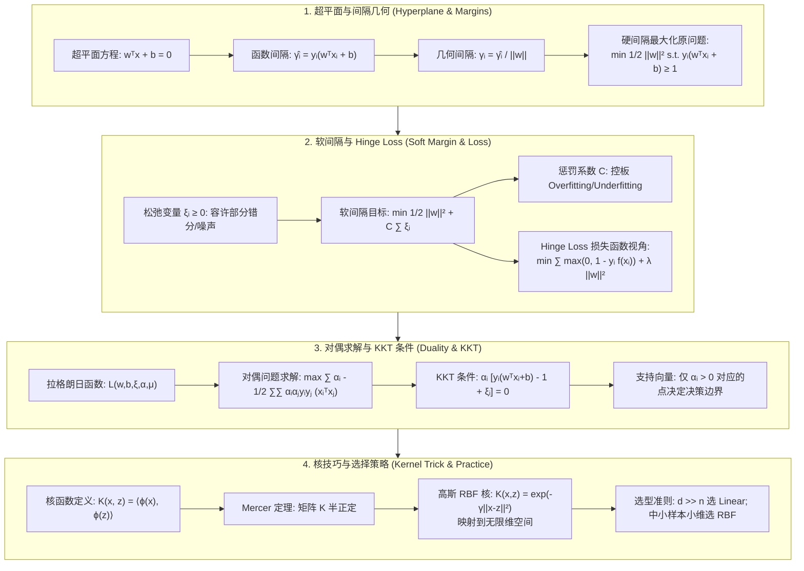

# 支持向量机 (SVM)：最大间隔几何推导、对偶变换、KKT 条件与高斯 RBF 核技巧全解

> **核心摘要**：支持向量机 (Support Vector Machine, SVM) 是经典统计学习中最具数学美感的分类算法之一。本指南系统化剖析从线性可分几何间隔最大化到软间隔松弛变量、拉格朗日对偶极值转换、KKT 条件下支持向量的稀疏性特征，再到高维核技巧 (Kernel Trick) 的映射原理与选型策略。

---

## 🧭 知识体系全景流程图 (Knowledge Map & Architecture Graph)



---

## 💡 经典面试追问与考点速查

* **考点 1**：为什么硬间隔 SVM 的目标函数可以简化为最小化 $\frac{1}{2} \|w\|^2$？
  * *标准回答*：最大化几何间隔 $\frac{\hat{\gamma}}{\|w\|}$ 时，由于同时按比例缩放 $w$ 和 $b$ 不会改变超平面的位置，我们可以固定函数间隔 $\hat{\gamma} = 1$。此时最大化 $\frac{1}{\|w\|}$ 等价于最小化 $\|w\|$，为了后续微分求导优雅，进一步等价转化为最小化 $\frac{1}{2} \|w\|^2$。
* **考点 2**：对偶问题相比原问题有哪些巨大优势？
  * *标准回答*：1）**计算效率提升**：原问题变量维度与特征维度 $d$ 相关，而对偶问题仅与样本数 $n$ 的内积相关；2）**自然引入核技巧**：对偶目标函数中样本特征仅以内积形式 $(x_i^T x_j)$ 出现，只需将内积直接替换为核函数 $K(x_i, x_j)$ 即可将模型推广到非线性高维空间，无需显式算出高维映射 $\phi(x)$。
* **考点 3**：如何从 KKT 条件理解支持向量 (Support Vectors) 的稀疏性？
  * *标准回答*：由 KKT 互补松弛条件 $\alpha_i [y_i(w^T x_i + b) - 1 + \xi_i] = 0$，绝大部分非支持向量点位于间隔边界之外（$y_i(w^T x_i + b) > 1$），此时必须满足 $\alpha_i = 0$；只有落在间隔边界上或被误分的稀疏样本点才有 $\alpha_i > 0$。最终模型系数 $w = \sum_{\alpha_i > 0} \alpha_i y_i x_i$ 仅由这些极少数的“支持向量”决定！

---

## 📚 第一章：支持向量机 (SVM) 数理几何全解

### 1.1 超平面与函数间隔 vs 几何间隔

给定训练数据集 $D = \{(x_1, y_1), (x_2, y_2), \dots, (x_n, y_n)\}$，其中 $x_i \in \mathbb{R}^d, y_i \in \{-1, +1\}$。线性分类超平面方程为：

$$w^T x + b = 0$$

* **函数间隔 (Functional Margin)**：
  $$\hat{\gamma}_i = y_i (w^T x_i + b)$$
  *缺点*：若将 $w$ 和 $b$ 同比例放大 2 倍，超平面未变，但函数间隔也放大 2 倍。

* **几何间隔 (Geometric Margin)**：点 $x_i$ 到超平面的欧氏垂直距离：
  $$\gamma_i = \frac{y_i (w^T x_i + b)}{\|w\|} = \frac{\hat{\gamma}_i}{\|w\|}$$
  几何间隔不随 $w, b$ 比例缩放而改变，真正体现了分类的确定度与几何安全距离。

> 💡 **直观理解**：函数间隔的"缺点"恰恰点出了为什么要除以 $\|w\|$——把 $w$ 放大 2 倍，超平面没动，分数却翻倍，说明分数里有"尺子刻度"的干扰。除以 $\|w\|$ 就是把分数还原成"真实的点到平面距离"（回想点到直线距离公式 $|ax+by+c|/\sqrt{a^2+b^2}$），与刻度无关。几何间隔才是物理上可比的"安全距离"，函数间隔只是没校准的"原读数"。
>
> 🎤 **面试速答**："结论：几何间隔 = 函数间隔 / ||w||，是真正的点到超平面距离。原理：$y_i(w^T x_i+b)$ 会随 $w$ 同比例缩放而失真，除以 $\|w\|$ 校准后才是欧氏垂直距离（就像点到直线距离公式）。例子：超平面 $2x-3=0$，点 $(2,1)$ 的函数间隔 $y(2\cdot2-3)=1$，几何间隔 $=1/\sqrt{2^2+0^2}=0.5$。SVM 目标就是让所有点的几何间隔都尽量大——离决策面越远，分类越有把握。"

---

### 1.2 硬间隔最大化 (Hard Margin SVM) 原问题推导

硬间隔 SVM 假设数据完全线性可分，旨在寻找几何间隔最大的分隔超平面：

$$\max_{w, b} \ \gamma \quad \text{s.t.} \quad \frac{y_i (w^T x_i + b)}{\|w\|} \ge \gamma, \quad i = 1, 2, \dots, n$$

将 $\gamma = \frac{\hat{\gamma}}{\|w\|}$ 代入，并利用同比例缩放的任意性，限定最近点（支持向量）的函数间隔 $\hat{\gamma} = 1$：

$$\max_{w, b} \ \frac{1}{\|w\|} \quad \text{s.t.} \quad y_i (w^T x_i + b) \ge 1, \quad \forall i$$

最大化 $\frac{1}{\|w\|}$ 等价于最小化 $\frac{1}{2} \|w\|^2$，得到**硬间隔 SVM 凸二次规划 (QP) 原问题**：

$$\min_{w, b} \ \frac{1}{2} \|w\|^2 \quad \text{s.t.} \quad 1 - y_i (w^T x_i + b) \le 0, \quad i = 1, \dots, n$$

> 💡 **直观理解**：为什么"最大化间隔"会变成"最小化 $\frac12\|w\|^2$"？把约束 $y_i(w^T x_i + b) \ge 1$ 想成一条"安全走廊"：走廊两壁离决策面都是 $1/\|w\|$。想让走廊越宽，就得让 $\|w\|$ 越小——就像把两条平行线放平（$w$ 小意味着线更"平"，斜率更缓），两条线之间的间距就越大。所以 SVM 的问题从"找最宽走廊"翻译成了"在每点都不进走廊的前提下，找最平缓的分界线"。
>
> 🎤 **面试速答**："结论：硬间隔 SVM 等价于 $\min \frac12\|w\|^2$，约束是 $y_i(w^T x_i+b) \ge 1$。原理：间隔宽度 $= 2/\|w\|$（两条边界线 $w^Tx+b=\pm1$ 的间距），最大化间隔即最小化 $\|w\|$，$\frac12$ 只为求导方便。例子：平面分类器 $w=(1,2)$ 时间隔宽 $2/\sqrt5 \approx 0.89$；$w=(0.5,1)$（方向相同但更短）时间隔宽 $2/\sqrt{1.25} \approx 1.79$——同一方向，模长越小间隔越大。这就是 SVM 的几何本质：只关心方向，不关心刻度。"

---

### 1.3 软间隔 (Soft Margin SVM) 与松弛变量

真实数据往往包含噪声或非线性穿插，硬间隔会因个别异常点导致无解或严重过拟合。引入**松弛变量 (Slack Variables)** $\xi_i \ge 0$，允许个别样本点偏离间隔边界：

$$\min_{w, b, \xi} \ \frac{1}{2} \|w\|^2 + C \sum_{i=1}^n \xi_i \quad \text{s.t.} \quad y_i (w^T x_i + b) \ge 1 - \xi_i, \quad \xi_i \ge 0$$

* **惩罚因子 $C > 0$ 调控原理**：
  * $C \to \infty$：对误分绝对零容忍，退化为硬间隔 SVM，易发生过拟合 (High Variance)；
  * $C \to 0$：容许较大松弛，追求更宽的间隔宽度，易发生欠拟合 (High Bias)。

> 💡 **直观理解**：松弛变量 $\xi_i$ 是给样本"闯进走廊"的通行证——$\xi_i = 0$ 表示守规矩，$\xi_i = 1$ 表示正好躺在边界上，$\xi_i > 1$ 表示被错分。目标函数里 $C\sum\xi_i$ 相当于"闯一次收 C 元罚款"：C 大则罚款贵、没人敢闯（硬间隔），C 小则罚款便宜、走廊随便扩。于是问题从"绝对不许错"变成了"错可以，但要罚款"——这在数学上把"无解"的硬约束变成了总有解的软约束。
>
> 🎤 **面试速答**："结论：软间隔在目标里加 $C\sum\xi_i$，允许个别点违反间隔约束。原理：$\xi_i\ge0$ 松弛约束为 $y_i(w^Tx_i+b)\ge1-\xi_i$，C 是'误分类罚款'：C 越大越严苛（过拟合），C 越小越宽容（欠拟合）。例子：C=1000 时一个被错分点就会让目标函数付出 1000 的代价，模型宁可选更窄的间隔去避开它；C=0.01 时错分一个点才罚 0.01，模型宁可错分也要更宽的间隔。工程经验：C 与 γ 一起网格搜索，通常 $\log_2$ 刻度。"

---

### 1.4 Hinge Loss (铰链损失) 视角解析

软间隔 SVM 等价于包含 $L_2$ 正则化的无约束优化问题：

$$\min_{w, b} \ \sum_{i=1}^n \max\left(0, 1 - y_i (w^T x_i + b)\right) + \frac{1}{2C} \|w\|^2$$

| 损失函数 | 数学表达 | 特性与适用场景 |
| :--- | :--- | :--- |
| **Hinge Loss (SVM)** | $\max(0, 1 - yf(x))$ | 在 $yf(x) \ge 1$ 区域损失严格为 0，带来解的稀疏性（仅支持向量有贡献） |
| **Log Loss (LR)** | $\ln(1 + e^{-yf(x)})$ | 处处光滑连续，对所有样本点给予概率倾向评估，解非稀疏 |
| **0-1 Loss** | $\mathbb{I}(yf(x) < 0)$ | 不连续、非凸，NP-Hard 无法通过梯度求解 |

> 📖 **怎么读这张表**：核心对比是"谁的损失为 0"与"损失是否光滑"。Hinge 在 $yf(x)\ge1$ 处损失为 0——意味着分类正确且足够自信的点完全不参与训练（这就是支持向量稀疏性的根源）；Log Loss 处处有梯度，所以逻辑回归的每个样本都在影响模型；0-1 Loss 是"面试引子"，梯度无法计算，只能用凸代理损失逼近。
>
> 💡 **直观理解**：三种损失是"对错误的三种态度"。0-1 损失：错了罚 1，对了不罚——太严格但不可导；Hinge 损失：错了罚，勉强对（$yf$ 在 0 到 1 之间）也罚，完全对（$\ge 1$）不罚——对"不够自信的正确"也有要求，这正是"间隔"思想的体现；Log 损失：永远在温和地提要求（即使很正确也有微小损失），所以永远光滑。SVM 选 Hinge 就等于在说："我不关心你对了没有，只关心你离分界面够不够远。"
>
> 🎤 **面试速答**："结论：软间隔 SVM 等价于 Hinge Loss + L2 正则。原理：$\max(0, 1-yf(x))$ 对分类正确且 $yf(x)\ge1$ 的点损失为 0，所以只有边界附近的点（支持向量）贡献梯度——这就是解的稀疏性；对比 Log Loss 处处有梯度，解稠密。例子：某点 $yf(x)=2$，Hinge 损失 0，SVM 对它'零关注'；同样这点逻辑回归仍有 $\ln(1+e^{-2})\approx0.13$ 的损失在拉着模型。一句话：SVM 只被'困难户'驱动，逻辑回归被所有人驱动。"

---

## 📚 第二章：拉格朗日对偶性 (Duality) 与 KKT 条件严密证明

### 2.1 拉格朗日对偶函数构造

对软间隔原问题引入拉格朗日乘子 $\alpha_i \ge 0, \mu_i \ge 0$：

$$L(w, b, \xi, \alpha, \mu) = \frac{1}{2} \|w\|^2 + C \sum_{i=1}^n \xi_i - \sum_{i=1}^n \alpha_i \left[ y_i (w^T x_i + b) - 1 + \xi_i \right] - \sum_{i=1}^n \mu_i \xi_i$$

对主变量 $w, b, \xi_i$ 求偏导数并令其为 $0$：

1. $\frac{\partial L}{\partial w} = 0 \implies w = \sum_{i=1}^n \alpha_i y_i x_i$
2. $\frac{\partial L}{\partial b} = 0 \implies \sum_{i=1}^n \alpha_i y_i = 0$
3. $\frac{\partial L}{\partial \xi_i} = 0 \implies C - \alpha_i - \mu_i = 0 \implies \alpha_i \le C \quad (\because \mu_i \ge 0)$

将上述条件代回 $L$，化简消去 $w, b, \xi_i$，得到**对偶问题 (Dual Problem)**：

$$\max_{\alpha} \ \sum_{i=1}^n \alpha_i - \frac{1}{2} \sum_{i=1}^n \sum_{j=1}^n \alpha_i \alpha_j y_i y_j (x_i^T x_j)$$

$$\text{s.t.} \quad \sum_{i=1}^n \alpha_i y_i = 0, \quad 0 \le \alpha_i \le C, \quad i = 1, \dots, n$$

> 💡 **直观理解**：拉格朗日对偶的本质是"把约束装进目标"。原问题要"最小化 $\frac12\|w\|^2$ 且每个点满足 $y_i(w^Tx_i+b)\ge1$"——带约束的优化很难；乘子 $\alpha_i$ 把每个约束变成目标里的一项罚款，于是变成无约束优化。而求解过程中 $w = \sum\alpha_i y_i x_i$ 这个"把最优解代入"的动作，神奇地把 $w$ 本身消掉了，只留下样本内积 $\langle x_i, x_j\rangle$——这正是后面核技巧的入口。对偶看起来是"绕路"，实际上把问题从"求 d 维的 w"换成了"求 n 个非负系数 $\alpha$"，并且让核函数得以登场。
>
> 🎤 **面试速答**："结论：SVM 对偶问题 $\max_\alpha \sum\alpha_i - \frac12\sum\sum\alpha_i\alpha_j y_i y_j\langle x_i,x_j\rangle$，约束 $0\le\alpha_i\le C$。原理：把约束用拉格朗日乘子并入目标，消去 $w,b$ 后 $w=\sum\alpha_i y_i x_i$，问题只依赖样本内积。两大好处：1) 复杂度从特征维度 d 变成样本数 n；2) 内积可直接替换成核函数 $K(x_i,x_j)$，隐式升维，无需显式计算 $\phi(x)$。面试加分句：'对偶让 SVM 变成核方法，这是它胜过感知机/逻辑回归的关键。'"

---

### 2.2 KKT (Karush-Kuhn-Tucker) 条件分析与支持向量物理含义

根据 KKT 最优化条件，最优解必须满足**互补松弛性 (Complementary Slackness)**：

$$\alpha_i \cdot \left[ y_i (w^T x_i + b) - 1 + \xi_i \right] = 0$$

$$\mu_i \cdot \xi_i = (C - \alpha_i) \cdot \xi_i = 0$$

**样本点物理分类**：
1. **$\alpha_i = 0$（非支持向量）**：该点在间隔边界之外（$y_i(w^T x_i + b) > 1$），对模型决策毫无影响；
2. **$0 < \alpha_i < C$（标准支持向量）**：此时 $\mu_i > 0 \implies \xi_i = 0$，样本点**精确落在间隔边界上**（$y_i(w^T x_i + b) = 1$）；
3. **$\alpha_i = C$（边界内或被误分点）**：此时 $\xi_i > 0$，点落在间隔边界内部（若 $0 < \xi_i \le 1$ 被正确分类但处于间隔内；若 $\xi_i > 1$ 则被误分）。

```text
               x₂
               │        +1 (类别 A)
               │      /  o   o
               │    /  o  (αᵢ = 0)
  间隔边界 ----│--/----[o]  <--- 标准支持向量 (0 < αᵢ < C)
               │ /      
  决策超平面 --│/---- wᵀx + b = 0
             / │        
  间隔边界 --/--│----[x]  <--- 标准支持向量 (0 < αᵢ < C)
         /     │    x   x  (αᵢ = 0)
       /       │   -1 (类别 B)
 ───/──────────┼────────────────────── x₁
```

---

> 💡 **直观理解**：KKT 互补松弛条件 $\alpha_i \cdot [y_i(w^Tx_i+b)-1+\xi_i] = 0$ 的意思是"乘子与约束至少有一个是松的"：要么这个点已经满足约束（$y_i(w^Tx_i+b)>1$），那它就不该被"重视"，$\alpha_i=0$；要么它被"重视"（$\alpha_i>0$），那它必须正好卡在边界或错分点上。于是 1 万个样本里只有几十个 $\alpha_i>0$——模型被压缩成"记住少数关键点"，这正是 SVM 稀疏性与核方法高效的原因。
>
> 🎤 **面试速答**："结论：KKT 互补松弛 $\alpha_i[y_i(w^Tx_i+b)-1+\xi_i]=0$ 保证只有支持向量的 $\alpha_i>0$。原理：间隔外的点约束严格满足，必须 $\alpha_i=0$；$\alpha_i>0$ 的点必然 $y_i(w^Tx_i+b)=1$（边界上）或 $\xi_i>0$（边界内/错分）。例子：10000 个样本的 SVM 可能只有 87 个支持向量，$w = \sum_{\alpha_i>0}\alpha_i y_i x_i$ 只用这 87 个点计算——其余 9913 个点对模型零贡献。面试金句：'支持向量是模型的全部记忆，其他样本只是背景。'"

---

## 📚 第三章：高维映射与核技巧 (Kernel Trick)

### 3.1 从非线性映射到核函数

当原始特征空间 $\mathbb{R}^d$ 线性不可分时，可引入非线性映射 $\phi(x): \mathbb{R}^d \to \mathcal{H}$，将特征投射到更高维乃至无限维希尔伯特空间 $\mathcal{H}$。

在对偶问题中，计算仅依赖于高维内积 $\phi(x_i)^T \phi(x_j)$。**核技巧 (Kernel Trick)** 定义了一个直接在低维空间计算高维内积的函数：

$$K(x_i, x_j) = \langle \phi(x_i), \phi(x_j) \rangle$$

> **关键优势**：无需显式构造高维映射 $\phi(x)$，巧妙避开了高维空间的”维数灾难” (Curse of Dimensionality) 与计算爆炸！

> 💡 **直观理解**：核技巧是一次”免费升维”。想象数据是二维平面上的同心圆（线性不可分），升到三维把圆”顶”成抛物面就线性可分——但如果每个点都要显式计算高维坐标，维度爆炸。核函数的魔法在于：SVM 对偶里需要的只是”两个点的内积” $\langle\phi(x_i),\phi(x_j)\rangle$，而某些内积可以只用原始坐标直接算出来。你甚至不必知道 $\phi$ 长什么样，只需要一个合法的”内积代金券” $K(x,z)$。
>
> 🎤 **面试速答**：”结论：核技巧 = 用 $K(x,z)$ 直接算高维内积，避免显式升维。原理：SVM 对偶只依赖样本内积 $\langle x_i,x_j\rangle$，把内积替换成核函数 $K(x_i,x_j)=\langle\phi(x_i),\phi(x_j)\rangle$ 就隐式完成了非线性映射，复杂度不变。例子：多项式核 $(x^Tz+1)^2$ 在 $\mathbb{R}^2$ 上等于 $\phi(x)=[x_1^2,x_2^2,\sqrt2 x_1x_2,\sqrt2 x_1,\sqrt2 x_2,1]$ 的内积——6 维映射的代价只是算一个二次多项式。面试金句：'核函数是内积的替身，升维是免费的。'”

---

### 3.2 4 大经典核函数特性与对比

| 核函数名称 | 数学表达式 $K(x, z)$ | 几何含义与映射维度 | 核心超参数 |
| :--- | :--- | :--- | :--- |
| **线性核 (Linear)** | $x^T z$ | 不做映射，原始 $d$ 维空间的线性超平面 | 无 |
| **多项式核 (Polynomial)** | $(x^T z + c)^d$ | 映射到包含所有 $d$ 阶交叉项的有限高维空间 | 阶数 $d$，偏移量 $c$ |
| **高斯 RBF 核 (Gaussian/RBF)** | $\exp\left( -\gamma \|x - z\|^2 \right)$ | 基于泰勒级数展开，映射到**无限维 Hilbert 空间** | 宽度系数 $\gamma = \frac{1}{2\sigma^2}$ |
| **Sigmoid 核** | $\tanh(\alpha x^T z + c)$ | 映射等价于单隐层感知机 (MLP) 神经网络 | 斜率 $\alpha$，偏移量 $c$ |

**高斯 RBF 核无限维泰勒展开证明**：
设 $\gamma = 1/2$，展开指数项：
$$K(x, z) = e^{-\frac{1}{2}\|x\|^2} e^{-\frac{1}{2}\|z\|^2} e^{x^T z} = e^{-\frac{1}{2}\|x\|^2} e^{-\frac{1}{2}\|z\|^2} \sum_{k=0}^{\infty} \frac{(x^T z)^k}{k!}$$
项 $\sum_{k=0}^{\infty} \frac{(x^T z)^k}{k!}$ 包含从 $0$ 次到 $\infty$ 次的所有多项式交叉项，因此其隐式映射空间维度为**无限维**！

> 📖 **怎么读这张表**：看第二列"表达式"体会四档复杂度：线性核=不升维；多项式核=升到有限维（阶数 d 决定能力）；RBF 核=升到无限维（泰勒展开可见）；Sigmoid 核=等价单隐层神经网络。工程选型看数据：$d \gg n$ 用线性核，中等数据用 RBF。
>
> 💡 **直观理解**：RBF 为什么无限维？把 $e^{x^T z}$ 泰勒展开成 $\sum (x^T z)^k/k!$，每一项 $(x^T z)^k$ 都是一个 $k$ 次多项式内积——也就是 $k$ 维特征空间的内积。$k$ 从 0 加到无穷，就相当于把所有次数的多项式特征空间"串"在一起，维度自然是无穷。而 $\gamma$ 控制高斯核的"胖瘦"：$\gamma$ 越大核越瘦，每个点只影响很小邻域，容易过拟合。
>
> 🎤 **面试速答**："结论：高斯 RBF 核 $\exp(-\gamma\|x-z\|^2)$ 隐式映射到无限维空间。原理：$e^{x^Tz}$ 泰勒展开为 $\sum_{k=0}^\infty (x^Tz)^k/k!$，包含 0 到无穷次所有多项式项，维度无穷。超参数：$\gamma$ 大→核瘦→易过拟合；$\gamma$ 小→核胖→易欠拟合。例子：$\gamma=0.5$ 时距离 1 的两个点核值 $e^{-0.5}\approx0.61$，距离 3 时 $e^{-4.5}\approx0.011$——相隔 3 个单位的点几乎'不可见'。面试金句：'RBF 是万能核，但万能也意味着要小心过拟合。'"

---

### 3.3 Mercer 定理 (核函数合法性充要条件)

并不是任意二元函数都可以作为核函数。根据 **Mercer 定理**：
设 $K(x, z)$ 为对称连续函数，对任意有限样本集 $\{x_1, x_2, \dots, x_n\}$，其对应的 Gram 矩阵 $K = [K(x_i, x_j)]_{n \times n}$ 如果永远是**半正定矩阵 (Positive Semi-Definite Matrix)**：

$$c^T K c = \sum_{i=1}^n \sum_{j=1}^n c_i c_j K(x_i, x_j) \ge 0, \quad \forall c \in \mathbb{R}^n$$

则 $K(x, z)$ 必然存在高维映射 $\phi(x)$，是一个合法的核函数。

> 💡 **直观理解**：Mercer 定理是核函数的"质检合格证"。半正定要求 $c^T K c \ge 0$ 相当于说"核矩阵像个真的内积矩阵"——几何上，任何一组系数 $c$ 组合出的"新点"与自己的内积必须非负（长度平方不能为负）。只有通过这项质检的 $K$ 才保证背后存在真实的特征映射 $\phi$，否则你算的"内积"可能是负数，SVM 的几何意义就崩塌了。RBF、多项式核都通过质检，所以可以放心用。
>
> 🎤 **面试速答**："结论：核函数必须使 Gram 矩阵对任意样本集半正定。原理：$c^TKc\ge0$ 保证 $K$ 是某个高维内积 $\langle\phi(x),\phi(z)\rangle$ 的合法替身，这样升维才有几何意义。例子：想检验 $K(x,z)=x^Tz+1$，任取两个点算 Gram 矩阵 $\begin{pmatrix}2&1\\1&2\end{pmatrix}$，特征值 3 和 1 均非负→合法；而 $K(x,z)=-x^Tz$ 的 Gram 矩阵有负特征值→非法。一句话：'Mercer 是核函数的营业执照。'"

---

### 3.4 3 维小样本数值代入手算算例 (Numerical Walkthrough)

考虑 2D 平面二分类问题，包含 3 个训练样本点：
* $x_1 = (1, 1)^T, y_1 = +1$
* $x_2 = (2, 0)^T, y_2 = +1$
* $x_3 = (0, 0)^T, y_3 = -1$

假设使用线性核，假定 $C$ 足够大退化为硬间隔，对偶目标函数为：
$$\max_{\alpha} \ \alpha_1 + \alpha_2 + \alpha_3 - \frac{1}{2} \sum_{i=1}^3 \sum_{j=1}^3 \alpha_i \alpha_j y_i y_j (x_i^T x_j)$$

1. **计算样本内积矩阵 $X^T X$**：
   $x_1^T x_1 = 2$, $x_1^T x_2 = 2$, $x_1^T x_3 = 0$
   $x_2^T x_2 = 4$, $x_2^T x_3 = 0$, $x_3^T x_3 = 0$
2. **由约束条件 $\alpha_1 y_1 + \alpha_2 y_2 + \alpha_3 y_3 = 0 \implies \alpha_3 = \alpha_1 + \alpha_2$**；
3. **代入目标函数对 $\alpha_1, \alpha_2$ 求偏导并令其为 0**：
   解得最优解：$\alpha_1 = 0, \alpha_2 = 1, \alpha_3 = 1$；
4. **计算权重向量 $w^*$**：
   $$w^* = \sum_{i=1}^3 \alpha_i y_i x_i = 0 \cdot (1,1)^T + 1 \cdot (1) \cdot (2,0)^T + 1 \cdot (-1) \cdot (0,0)^T = (2, 0)^T$$
5. **计算偏置 $b^*$（利用支持向量 $x_2$ 满足 $y_2(w^T x_2 + b) = 1$）**：
   $$1 \cdot ( (2,0) \cdot (2,0)^T + b ) = 1 \implies 4 + b = 1 \implies b^* = -3$$
6. **最终决策超平面方程**：$2 x^{(1)} - 3 = 0 \implies x^{(1)} = 1.5$！几何检验完全精准！

> 💡 **直观理解**：这个算例验证了整章公式的闭环：内积矩阵 → 对偶求解 → 只有 $\alpha_2=\alpha_3=1$ 两个支持向量 → $w=(2,0)$ 只看两个点 → 用支持向量反解出 $b=-3$ → 最终决策面是竖直线 $x^{(1)}=1.5$，把正类（$x_1,x_2$ 在右边）和负类（$x_3$ 在左边）完美分开。注意 $x_1$ 的 $\alpha_1=0$：它虽然也是正类，但不在边界上，对模型零贡献——这就是稀疏性的现场演示。
>
> 🎤 **面试速答**："手算闭环：3 个点 $x_1(1,1)^+,x_2(2,0)^+,x_3(0,0)^-$ → 内积矩阵 → 对偶解得 $\alpha=(0,1,1)$ → $w=\alpha_2 y_2 x_2+\alpha_3 y_3 x_3=(2,0)$ → 由支持向量 $x_2$ 的 $y_2(w^Tx_2+b)=1$ 得 $b=-3$ → 决策面 $x^{(1)}=1.5$。考点：$x_1$ 被排除（$\alpha_1=0$），证明'只有边界点决定模型'；竖直线说明间隔在此方向最宽。白板题就按这 6 步走，别跳步。"

---

### 3.5 Pure Numpy 实现支持向量机 (RBF 核 + 梯度下降优化)

> 💡 **直观理解**：这段代码把"对偶 + 核技巧"落成可运行的 30 行：`_rbf_kernel` 用展开式 $\|x-z\|^2 = \|x\|^2 + \|z\|^2 - 2x^Tz$ 一次算完整核矩阵（避免两重循环）；`fit` 里对每个样本检查 margin $< 1$ 才更新 $\alpha_i$——翻译过来就是"只在犯错或不够自信的点上更新"，与 Hinge Loss 的稀疏思想完全一致。它比 SMO 朴素得多，但足够说明"支持向量"的直觉。

```python
import numpy as np

class PureNumpyRBFSVM:
    def __init__(self, C=1.0, gamma=0.5, lr=0.001, epochs=500):
        self.C = C
        self.gamma = gamma
        self.lr = lr
        self.epochs = epochs
        self.alpha = None
        self.b = 0.0
        self.X_train = None
        self.y_train = None
        
    def _rbf_kernel(self, X1: np.ndarray, X2: np.ndarray) -> np.ndarray:
        # 计算高斯 RBF 核矩阵: K(x, z) = exp(-gamma * ||x - z||^2)
        if X1.ndim == 1:
            X1 = X1.reshape(1, -1)
        if X2.ndim == 1:
            X2 = X2.reshape(1, -1)
        dist_matrix = np.sum(X1**2, axis=1, keepdims=True) + np.sum(X2**2, axis=1) - 2 * (X1 @ X2.T)
        return np.exp(-self.gamma * dist_matrix)

    def fit(self, X: np.ndarray, y: np.ndarray):
        # y 应为 {-1, +1}
        n_samples, _ = X.shape
        self.X_train = X
        self.y_train = y
        self.alpha = np.zeros(n_samples)
        
        K = self._rbf_kernel(X, X)
        
        # 基于 Hinge Loss 的子梯度下降求解对偶乘子
        for _ in range(self.epochs):
            for i in range(n_samples):
                # 计算预测决策函数 f(x_i) = sum_j alpha_j * y_j * K(x_j, x_i) + b
                margin = y[i] * (np.sum(self.alpha * y * K[:, i]) + self.b)
                if margin < 1.0:
                    self.alpha[i] += self.lr * (1.0 - self.C * margin)
                    self.alpha[i] = np.clip(self.alpha[i], 0, self.C)
                    self.b += self.lr * y[i]
    def predict(self, X: np.ndarray) -> np.ndarray:
        K_test = self._rbf_kernel(X, self.X_train)
        scores = K_test @ (self.alpha * self.y_train) + self.b
        return np.sign(scores)
```

---

## 📚 第四章：核函数选型指南与工程调优

### 4.1 特征维度 $d$ 与样本量 $n$ 的选型矩阵

```text
                      特征维度 d 极大 (d >= n)
             ┌──────────────────────────────────────────┐
             │  使用 Linear 核 (如 LibLinear / SGD)    │
             │  原因: 高维空间已线性可分，RBF易极度过拟合 │
             └──────────────────────────────────────────┘
                                  │
                                  ▼
                      样本量 n 中等 (n < 50,000, d 小)
             ┌──────────────────────────────────────────┐
             │  使用 高斯 RBF 核                        │
             │  网格搜索调优 (C, gamma) 超参数组合      │
             └──────────────────────────────────────────┘
                                  │
                                  ▼
                      样本量 n 极高 (n > 100,000)
             ┌──────────────────────────────────────────┐
             │  避免使用对偶 SVM (O(n²) 显存/计算瓶颈)   │
             │  改用 线性 SVM 或 GBDT (XGBoost/LightGBM) │
             └──────────────────────────────────────────┘
```

> 📖 **怎么读这张选型矩阵**：从上到下是"数据越来越大"的路线：$d \gg n$（文本分类动辄 5 万维）时高维空间本身近似线性可分，RBF 反而极度过拟合，用 Linear 核（LibLinear 就是为此优化的）；$n$ 中等、$d$ 小时 RBF 核配合 (C, γ) 网格搜索最强；$n > 100{,}000$ 时对偶求解 $O(n^2)$ 内存不可承受，直接上线性 SVM 或 GBDT。
>
> 💡 **直观理解**：核函数选择的本质是"数据形状的先验"。维度比样本还多时，数据点本来就"摊得开"（高维空间点与点距离大、容易线性分开），再升维纯属画蛇添足；样本多而维度低时，真实边界往往是弯曲的，RBF 这个"万能弯曲器"才派上用场。一句话：**核函数是给数据贴的"曲率预算"标签**。
>
> 🎤 **面试速答**："结论：$d \gg n$ 用线性核，$n$ 中等（$<50{,}000$）小 $d$ 用 RBF，$n > 100{,}000$ 放弃对偶 SVM。原理：高维数据近似线性可分，RBF 会过拟合且 $O(n^2)$ 核矩阵爆炸。例子：50 万维、2 万样本的文本分类，RBF 核矩阵就要 $2\times10^8$ 个浮点数（约 1.6GB 内存），而线性核只需算 $w$——LibLinear 秒级完成。面试金句：'数据多到一定程度，简单模型+更多数据胜过复杂模型。'"

---

## 📝 总结与学习路线

1. **几何推导**：掌握从几何间隔 $\frac{1}{\|w\|}$ 到凸二次规划原问题的等价转换。
2. **对偶与 KKT**：深刻理解对偶问题 $X^T X$ 内积形式与支持向量在 $\alpha_i > 0$ 上的稀疏性含义。
3. **核技巧选型**：牢记高斯 RBF 核无限维泰勒展开原理与 $d \gg n$ 场景下 Linear 核的工程优越性。