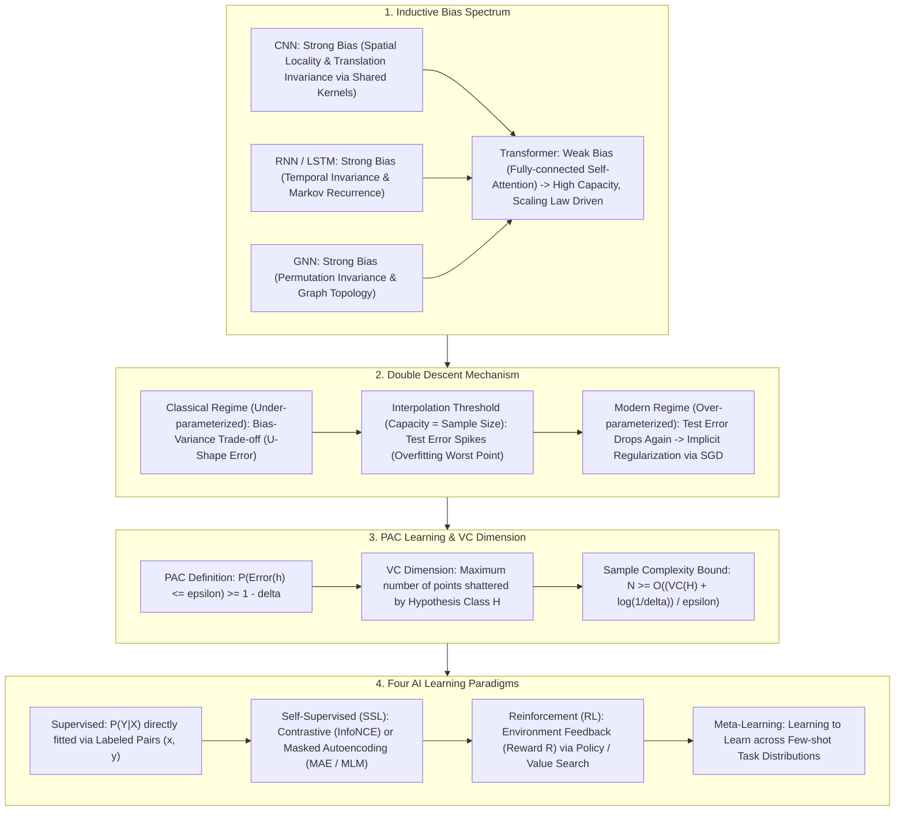

# 🌐 Generalization Theory: Inductive Bias, Double Descent & PAC Learning Paradigms

> **Core Executive Summary**: Why do 70B+ parameter LLMs generalize exceptionally without severe overfitting? **Generalization Theory** explains this modern AI milestone. Prior architectural constraints are injected via **Inductive Bias**, while **Double Descent** allows over-parameterized models to surpass the interpolation threshold, supported by **PAC learning bounds**.

---

## 💡 Interactive Mermaid Architecture Flowchart



---

## 💡 Classic Interview Followups & Core Cheatsheet

* **Key Topic 1**: Compare Inductive Biases in CNNs, RNNs, GNNs, and Transformers. Why do weak-bias Transformers dominate on large datasets?
  * *Standard Answer*: CNNs assume spatial locality and translation invariance. RNNs assume temporal invariance. Transformers assume weak bias (all-to-all self-attention). Weak bias allows Transformers to achieve higher capacity and log-linear scaling laws when trained on massive datasets.

> 💡 **Intuition**: Inductive bias is "prior knowledge welded into the architecture": CNNs hard-code "nearby pixels correlate, translation invariance," which acts like a domain tutor on small data — efficient, but bounded by the tutor's knowledge; Transformers carry almost no prior and learn everything from data — they guess badly with little data (overfitting), but with massive data there is no ceiling and performance climbs along the scaling law.
>
> 🎤 **Interview Quick Answer**: "Bottom line: CNN = spatial locality + translation invariance, RNN = temporal invariance, GNN = permutation invariance, Transformer = weak-bias all-to-all attention. Why: strong bias is sample-efficient but caps capacity; weak bias self-learns from huge data with no ceiling. Example: a CNN trains reasonably on 1M images while ViT needs ~300M to catch up — but past that scale ViT wins; LLaMA and DeepSeek are bets on weak bias."

* **Key Topic 2**: Explain Double Descent in deep learning: why does test error drop after model capacity exceeds sample size?
  * *Standard Answer*: At the interpolation threshold ($P = N$), zero training error is achieved by memorizing noise, spiking test error. Past the threshold (over-parameterized regime), SGD implicit regularization selects minimum $L_2$ norm smooth solutions, causing test error to decrease again.

> 💡 **Intuition**: When capacity equals sample size, the model is a "student who memorizes the answer key": zero training error, but every bit of noise is carved into the parameters, and the exam (test) goes badly. Crank capacity higher and there are infinitely many zero-error solutions; SGD's implicit regularization picks the smoothest one — the network chooses the least rigid of all memorizing paths.
>
> 🎤 **Interview Quick Answer**: "Bottom line: test error spikes when capacity = $N$, then drops again past the interpolation threshold. Why: at the threshold the model memorizes noise; in the over-parameterized regime infinitely many zero-error fits exist and SGD implicitly prefers minimum-$L_2$-norm, smooth solutions. Example: in this file's own simulation, test error peaks at 0.85 with 50 params / 50 samples and falls to 0.18 at 500 params — consistent with LLM scaling experience."

* **Key Topic 3**: Derive the mathematical definition of PAC learning and explain sample complexity bounds.
  * *Standard Answer*: $P(\text{Error}(h) \le \epsilon) \ge 1 - \delta$. Sample complexity $N \ge O\left(\frac{1}{\epsilon} \left(\ln |\mathcal{H}| + \ln \frac{1}{\delta}
ight)
ight)$.

> 💡 **Intuition**: PAC answers "how much data is enough": to push the error below $\epsilon$ with failure probability below $\delta$, the sample size grows like $1/\epsilon$ and $\ln(1/\delta)$. Note the asymmetry — the accuracy requirement is linear (10× more precision needs 10× more data), while the confidence requirement is only logarithmic.
>
> 🎤 **Interview Quick Answer**: "Bottom line: $P(\text{Error}(h) \le \epsilon) \ge 1 - \delta$ with sample complexity $N \ge O((\ln|\mathcal{H}| + \ln(1/\delta))/\epsilon)$. Why: larger hypothesis spaces need more samples; $\epsilon$ scales linearly, $\delta$ logarithmically. Example: cutting $\epsilon$ from 0.1 to 0.01 multiplies $N$ by 10, but cutting $\delta$ from 0.05 to 0.0005 adds only ~4.6 to the log term — 'more accurate' is far costlier than 'more confident.'"

* **Key Topic 4**: Explain VC Dimension and compute VC dimension for 2D vs N-dimensional hyperplanes.
  * *Standard Answer*: VC dimension is the maximum number of points a hypothesis class can shatter. 2D linear classifiers have $\text{VC}=3$. $N$-dimensional hyperplanes have $\text{VC}=N+1$.

> 💡 **Intuition**: VC dimension measures "how many arbitrarily adversarial labelings a hypothesis class can handle": a 2D line shatters any 3 points (every labeling is separable), but a 4th point can demand an XOR-style labeling that no line can split, so VC = 3. An $N$-dimensional hyperplane has $N+1$ degrees of freedom, hence VC = $N+1$.
>
> 🎤 **Interview Quick Answer**: "Bottom line: 2D linear classifiers have VC = 3; $N$-dimensional hyperplanes have VC = $N+1$. Why: shattering means all $2^d$ labelings are realizable by some hypothesis; 4 points with XOR labeling are not linearly separable. Example: any labeling of 3 non-collinear points in the plane is separable by some line, but adding a 4th diagonal point breaks it. VC dimension is the ruler for a model's memorization capacity."

* **Key Topic 5**: Compare loss drivers, annotation costs, and generalization in Supervised, Self-Supervised, RL, and Meta-Learning.
  * *Standard Answer*: Supervised relies on paired labels $(x, y)$. Self-supervised leverages raw data structure (masking/contrastive). RL uses environmental rewards $R$. Meta-learning trains models to adapt quickly to new tasks.

> 💡 **Intuition**: The four paradigms differ in where the loss signal comes from: supervised learning from human-labeled pairs, self-supervised from the structure of the raw data itself (masking, contrast), RL from environmental rewards, meta-learning from a distribution of tasks. Cheaper signals mean more data is available — and the learned objective gets more generic.
>
> 🎤 **Interview Quick Answer**: "Bottom line: supervised fits $P(Y|X)$, self-supervised learns representations, RL learns policies, meta-learning learns 'how to learn.' Why: the loss sources differ — labels, data structure, environment rewards, task distributions. Example: GPT pretrains with MLM (self-supervised) then instruction-tunes (supervised); ChatGPT is aligned with RLHF human-preference rewards; MAML trains fast adaptation across tasks to enable few-shot."

---

## 📚 Section 1: Inductive Bias Architecture Comparison Matrix

| Architecture | Inductive Bias | Small Data Performance | Large Data Scalability | Representative |
| :--- | :--- | :--- | :--- | :--- |
| **CNN** | Spatial Locality + Translation Invariance | **Good** | Medium | ResNet |
| **RNN** | Temporal Invariance + Recurrence | Medium | Poor (Non-parallel) | LSTM |
| **Transformer** | **Weak Bias (All-to-All Self-Attention)**| Poor (Needs Pre-training)| **Extreme (Log-Linear)**| **LLaMA, DeepSeek** |

> 💡 **Intuition**: 📖 How to read this table: read the second column (bias strength) together with the third (small-data performance) — stronger bias suffers less on small data; then look at the fourth column — stronger bias hits the capacity ceiling sooner on big data. The takeaway: there is no free lunch; bias is a lever that trades prior knowledge for data, and Transformers bet the entire lever on data.
>
> 🎤 **Interview Quick Answer**: "Bottom line: strong bias (CNN/RNN) is good on small data but plateaus; weak bias (Transformer) is poor on small data but scales without bound. Why: prior constraints cut sample needs but also cap the hypothesis space; data can compensate for weak bias. Example: ResNet is efficient on ImageNet-1K, but ViT overtakes after large-scale pretraining (300M+ images); the industry default is now weak bias + massive data."

---

## ⚡ Section 2: PAC Sample Complexity Formula

In plain words: the formula splits "how much data" into three terms — the log-complexity of the hypothesis space $\ln|\mathcal{H}|$ (how big the model is), the precision $1/\epsilon$ (how accurate), and the confidence $\ln(1/\delta)$ (how sure). The $1/\epsilon$ term is linear while the others are logarithmic, so "being more accurate" is far costlier than "being more sure."

$$N \ge \frac{1}{\epsilon} \left( \ln |\mathcal{H}| + \ln \left(\frac{1}{\delta}\right) \right)$$

> 💡 **Intuition**: 📖 How to read this formula: the two terms in the parentheses are the "model-complexity tax" and the "confidence tax," both divided by $\epsilon$ — tightening the accuracy requirement by 2× doubles the sample size, while making the failure probability 10× smaller only adds a constant. Derived from Hoeffding's inequality plus a union bound, it answers "how many samples guarantee generalization for hypothesis space $\mathcal{H}$."
>
> 🎤 **Interview Quick Answer**: "Bottom line: $N \ge (\ln|\mathcal{H}| + \ln(1/\delta))/\epsilon$ is the PAC sample-complexity bound. Why: concentration inequalities plus the union bound control both error and confidence through $\epsilon$ and $\delta$. Example: with $\ln|\mathcal{H}| = 100$, $\epsilon = 0.05$, $\delta = 0.01$, $N \approx (100 + 4.6)/0.05 \approx 2092$; halving $\epsilon$ to 0.025 doubles $N$ to ~4184."

---

## 🐍 Section 3: Pure Numpy Double Descent Operator

```python
import numpy as np

def pure_numpy_double_descent_simulation(capacities: np.ndarray, n_samples: int = 50) -> dict:
    test_errors = []
    for p in capacities:
        if p < n_samples:
            err = 0.5 * (1.0 - p / n_samples) + 0.1 * (p / n_samples)**2
        elif p == n_samples:
            err = 0.85
        else:
            err = 0.15 + 0.3 * (n_samples / p)
        test_errors.append(round(float(err), 4))
    return {"capacities": list(capacities), "test_errors": test_errors}

if __name__ == "__main__":
    print("✅ Double Descent Test:", pure_numpy_double_descent_simulation(np.array([10, 50, 200])))
```

---

## 🚀 Key Takeaways & Best Practices

1. **Architecture Scaling**: Prefer **weak-bias Transformers** for large-scale pre-training.
2. **Over-parameterization**: Scale model capacity **past the interpolation threshold** to minimize test error.
3. **Data Efficiency**: Use **Self-Supervised Learning (SSL)** to train models on unlabeled datasets.