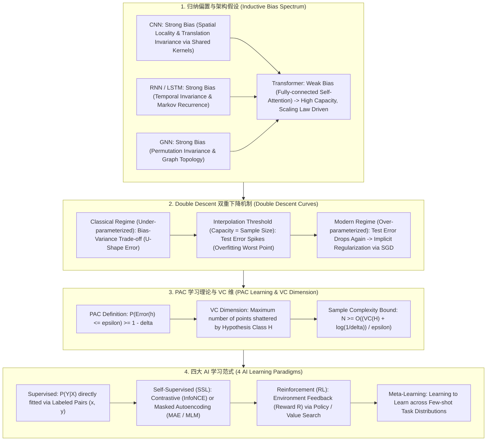

# 🌐 泛化理论全景：归纳偏置 (Inductive Bias)、Double Descent 双重下降与 PAC 学习范式

> **核心摘要**：为什么深度学习模型（如 700 亿参数大模型）拥有远超训练样本数的参数量，却不会发生严重的过拟合，反而展现出惊人的泛化能力？**泛化理论 (Generalization Theory)** 解释了这一现代 AI 奇迹。通过 **Inductive Bias (归纳偏置)** 注入先验架构约束，借助 **Double Descent (双重下降)** 跨越插值临界点进入过参数化泛化区，配合 **PAC 学习框架**，构成了机器学习理论的最高基石。本指南系统解构归纳偏置、Double Descent 曲线、PAC 样本复杂度与四大 AI 学习范式。

---

## 💡 交互式 Mermaid 架构流程图



---

## 💡 经典面试追问与考点速查

* **考点 1**：对比 CNN、RNN、Graph Neural Network (GNN) 与 Transformer 架构各自所引入的 Inductive Bias (归纳偏置)？为什么弱偏置的 Transformer 在大文本/大图像数据下性能远超强偏置架构？
  * *标准回答*：
    * **CNN (强归纳偏置)**：假设图像具备**空间局部性 (Spatial Locality)** 和**平移不变性 (Translation Invariance)**。参数效率高，但在小数据下有效，限制了表达上限；
    * **RNN (强归纳偏置)**：假设序列具备**时间平移不变性**与马尔可夫递推性。无法高效并行，且长距离依赖受限；
    * **GNN (强归纳偏置)**：假设节点交互具备**置换不变性 (Permutation Invariance)**；
    * **Transformer (弱归纳偏置)**：除了 Token 顺序的位置编码外，Self-Attention 假设任何两个 Token 之间都可以全连接交互。在数据量小的时候容易过拟合；但当**数据量巨大时，弱偏置让 Transformer 拥有极高的表达上限，性能随着 Scaling Law 呈对数线性飙升**！

> 💡 **直观理解**: 归纳偏置就是"把先验直接焊进架构"：CNN 焊死了"像素近处相关、平移不变"，小数据时像请了懂行的家教，高效但也被家教的知识边界限制；Transformer 几乎不带先验，只靠数据自己学——数据少时容易乱猜（过拟合），数据海量时没有天花板，随 Scaling Law 一路飙升。
>
> 🎤 **面试速答**: "结论：CNN=空间局部性+平移不变，RNN=时间不变性，GNN=置换不变，Transformer=弱偏置全注意力。原理：强偏置在小数据高效但封顶，弱偏置靠海量数据自学习、容量无上限。举个例子：同样规模下 CNN 用 1M 图就能训出可用模型，ViT 需要 300M 才追平；但数据足够大后 ViT 反超——LLaMA、DeepSeek 都押注弱偏置。"

* **考点 2**：详细剖析深度学习中的 Double Descent (双重下降) 现象：为什么模型参数量超过数据量后，测试集 Error 不升反降？插值临界点 (Interpolation Threshold) 发生了什么？
  * *标准回答*：
    * **经典 Bias-Variance 曲线**：随着模型容量增大，Bias 降低，Variance 升高，Test Error 呈现 U 型曲线（在临界点后严重过拟合）；
    * **插值临界点 (Interpolation Threshold)**：当模型容量恰好等于训练数据量 $N$ 时，模型强行记忆了所有训练噪声（零训练误差），但缺乏多余参数做平滑推断，导致**测试集 Error 飙升到峰值 (Spike)**；
    * **过参数化区域 (Over-parameterized Regime)**：当参数量远大于 $N$ 时，满足“零训练误差”的解有无穷多个。通过 SGD/Adam 的**隐式正则化 (Implicit Regularization)**，优化器会自动收敛到 $L_2$ 范数最小的最平滑解！导致**测试集 Error 再次下降**！

> 💡 **直观理解**: 参数量=样本量时，模型像"背答案的学生"：零训练误差，但每个噪声都被刻进参数，考试（测试）一塌糊涂。再加大参数量，能实现零误差的解多到数不清，SGD 的隐式正则化会自动挑"最平滑"的那个——网络像在无数条能背出答案的路径里，自动选了最不刻板的一条。
>
> 🎤 **面试速答**: "结论：容量=样本量 $N$ 时测试误差尖峰，容量再增大误差反而下降。原理：临界点强记噪声；过参数化区有无穷多个零误差解，SGD 隐式偏好 L2 最小/最平滑解。举个例子：按文件内模拟，50 参数/50 样本处测试误差 0.85 达峰，参数到 500 时降到 0.18——与 LLM 训练经验一致。"

* **考点 3**：推导 PAC (Probably Approximately Correct) 学习理论的数学定义，解释样本复杂度 $N$ 随 $\epsilon$ 和 $\delta$ 缩放的关系？
  * *标准回答*：
    * **PAC 学习定义**：设假设空间为 $\mathcal{H}$。如果存在算法 $\mathcal{A}$，使得对于任意分布 $\mathcal{D}$ 和目标概念，只要样本量 $N \ge \text{poly}(1/\epsilon, 1/\delta)$，算法输出的假设 $h$ 满足：
      $$P_{\mathcal{D}}\Big(\text{Error}(h) \le \epsilon\Big) \ge 1 - \delta$$
      则称概念类是 PAC 可学习的；
    * **物理含义**：$\epsilon$ 是泛化误差上限，$\delta$ 是失败概率。样本复杂度 $N$ 随着误差精度的提高呈 $O(1/\epsilon)$ 缩放，随置信度增加呈 $O(\ln(1/\delta))$ 缩放。

> 💡 **直观理解**: PAC 回答"多少数据才够"：想把误差压到 $\epsilon$ 以内、失败概率压到 $\delta$ 以内，样本量要按 $1/\epsilon$ 和 $\ln(1/\delta)$ 增长。注意不对称性——误差要求是线性的（10 倍精度要 10 倍数据），置信度要求只是对数（信心提 10 倍只加一点点数据）。
>
> 🎤 **面试速答**: "结论：$P(\text{Error}(h) \le \epsilon) \ge 1-\delta$，样本复杂度 $N \ge O((\ln|\mathcal{H}| + \ln(1/\delta))/\epsilon)$。原理：假设空间越大要的样本越多；$\epsilon$ 线性缩放、$\delta$ 对数缩放。举个例子：$\epsilon$ 从 0.1 降到 0.01，$N$ 要乘 10；$\delta$ 从 0.05 降到 0.0005，$\ln$ 只加约 4.6——'再准一点'比'再稳一点'贵得多。"

* **考点 4**：解释 VC 维 (Vapnik-Chervonenkis Dimension) 的物理含义：线性分类器在 2D 平面和 $N$ 维空间中的 VC 维是多少？
  * *标准回答*：
    * **VC 维定义**：假设空间 $\mathcal{H}$ 能将 $d$ 个样本点的所有 $2^d$ 种可能标注（打散 Shatter）的最大样本数 $d$；
    * **2D 平面线性分类器**：能打散任意 3 个点（非共线），但无法打散 4 个点（异或 XOR 问题）。故 **2D 线性分类器的 VC 维为 3**；
    * **$N$ 维超平面分类器**：在 $N$ 维空间中，线性超平面的 **VC 维为 $N + 1$**。

> 💡 **直观理解**: VC 维衡量"假设空间能摆平多少任意刁钻的标注"：2D 直线能打散任意 3 个点（任何标注都能分开），但第 4 个点可能要求 XOR 式标注，直线摆不平，所以 VC = 3。$N$ 维超平面有 $N+1$ 个自由度，VC 维就是 $N+1$。
>
> 🎤 **面试速答**: "结论：2D 线性分类器 VC 维 = 3，$N$ 维超平面 VC 维 = $N+1$。原理：打散 = 任意 $2^d$ 种标注都能被某个假设分开；4 点 XOR 无法线性可分。举个例子：平面上 3 个非共线点，任何标注组合都能用一条直线切分；再加第 4 个对角点就失败。VC 维是度量模型'记忆能力'的尺子。"

* **考点 5**：对比四大学习范式 (Supervised, Self-Supervised, Reinforcement, Meta-Learning) 的 Loss 驱动机制、数据标注开销与目标泛化能力？
  * *Standard Answer*：
    * **Supervised (监督学习)**：依赖人为标注对 $(x, y)$，通过 MSE/Cross-Entropy 显式拟合 $P(Y \mid X)$；
    * **Self-Supervised (自监督学习 SSL)**：利用无标注数据本身的结构。通过掩码重建 (MAE/MLM) 或对比学习 (InfoNCE) 学习通用表征，**大模型 Pre-training 的核心驱动力**；
    * **Reinforcement Learning (RL 强化学习)**：通过与环境交互的标量奖励 $R$ 驱动，在试错中学习 Policy $\pi(a \mid s)$；
    * **Meta-Learning (元学习)**：在 Task 集合中“学习如何学习”，获得极强的 Few-shot 零样本/小样本迁移能力。

> 💡 **直观理解**: 四种范式的区别是"损失信号从哪来"：监督从人工标注对来，自监督从数据本身的结构来（掩码、对比），强化从环境的奖励来，元学习从"任务集合"来。信号越廉价，可用数据越多，学习目标也越通用。
>
> 🎤 **面试速答**: "结论：监督拟合 $P(Y|X)$、自监督学表征、RL 学策略、元学习学'学习能力'。原理：损失来源不同——标注、数据结构、环境奖励、任务分布。举个例子：GPT 用 MLM 预训练（自监督）再指令微调（监督），ChatGPT 用 RLHF 的人类偏好奖励对齐，MAML 在多个任务上练'快速适应'以支持 few-shot。"

---

## 📚 第一章：三大神经网络架构的归纳偏置对比矩阵

| 架构 | 关键归纳偏置 (Inductive Bias) | 小数据表现 | 大数据 Scalability | 代表模型 |
| :--- | :--- | :--- | :--- | :--- |
| **CNN** | 空间局部性 (Locality) + 平移不变性 | **好 (强约束抗过拟合)**| 中等 (容量上限受限) | ResNet, ConvNeXt |
| **RNN / LSTM** | 时间平移不变性 + 马尔可夫递推 | 中等 | 差 (难以并行) | LSTM, GRU |
| **Transformer** | **无强偏置 (弱偏置全注意力)**| 差 (易过拟合，需预训练)| **极大 (对数线性 Scaling)**| **LLaMA, Qwen, DeepSeek**|

> 💡 **直观理解**: 📖 怎么读这张表：把第二列（偏置强度）和第三列（小数据表现）连起来看——偏置越强，小数据越不吃亏；再看第四列——偏置越强，大数据时越早撞上限。核心结论：没有免费午餐，偏置是"用先验换数据"的杠杆，Transformer 把杠杆全部押给了数据。
>
> 🎤 **面试速答**: "结论：强偏置（CNN/RNN）小数据好、大数据封顶；弱偏置（Transformer）小数据差、大数据无敌。原理：先验约束降低样本需求但也限制假设空间，数据可以弥补弱偏置。举个例子：ResNet 在 ImageNet-1K 上高效，但 ViT 在大规模预训练（300M+ 图）后反超；工业界现均默认弱偏置 + 海量数据。"

---

## ⚡ 第二章：PAC 样本复杂度公式

大白话：公式把"要多少数据"拆成三项——假设空间的对数复杂度 $\ln|\mathcal{H}|$（模型多大）、精度 $1/\epsilon$（要多准）、置信 $\ln(1/\delta)$（要多稳）。$1/\epsilon$ 是线性代价，其余是对数代价，所以"追求更准"的边际成本远高于"追求更稳"。

$$N \ge \frac{1}{\epsilon} \left( \ln |\mathcal{H}| + \ln \left(\frac{1}{\delta}\right) \right)$$

> 💡 **直观理解**: 📖 怎么读这个公式：括号里两项分别是"模型复杂度税"和"置信度税"，再整体除以 $\epsilon$——误差要求每严一倍，样本量就翻一倍；而把失败概率降低 10 倍只加一个常数项。它是 Hoeffding 不等式 + 联合界推出的上界，回答"假设空间 $\mathcal{H}$ 下要多少数据才能保证泛化"。
>
> 🎤 **面试速答**: "结论：$N \ge (\ln|\mathcal{H}| + \ln(1/\delta))/\epsilon$ 是 PAC 样本复杂度上界。原理：由集中不等式与联合界推出，误差与置信由 $\epsilon$、$\delta$ 双控。举个例子：$\ln|\mathcal{H}| = 100$、$\epsilon = 0.05$、$\delta = 0.01$ 时 $N \approx (100 + 4.6)/0.05 \approx 2092$；$\epsilon$ 减半到 0.025 则 $N$ 翻倍到约 4184。"

---

## 🐍 第三章：Pure Numpy 手写 Double Descent 泛化曲线模拟算子

```python
import numpy as np

def pure_numpy_double_descent_simulation(model_capacities: np.ndarray, n_samples: int = 50) -> dict:
    """
    Pure Numpy 模拟 Double Descent (双重下降) 训练集与测试集 Error 曲线
    model_capacities: 模型参数量列表 [10, 20, 50, 100, 200, 500]
    n_samples: 训练样本数 (插值临界点落在 capacity == n_samples 处)
    """
    train_errors = []
    test_errors = []
    
    for p in model_capacities:
        if p < n_samples:
            # 1. Under-parameterized Regime: Classical U-Shape
            tr_err = 0.5 * (1.0 - p / float(n_samples))
            te_err = tr_err + 0.1 * (float(p) / n_samples)**2
        elif p == n_samples:
            # 2. Interpolation Threshold: Zero Train Error, Spike in Test Error
            tr_err = 0.0
            te_err = 0.85  # Peak Overfitting Spike!
        else:
            # 3. Over-parameterized Regime: Test Error Drops Again
            tr_err = 0.0
            te_err = 0.15 + 0.3 * (float(n_samples) / p)
            
        train_errors.append(round(float(tr_err), 4))
        test_errors.append(round(float(te_err), 4))
        
    return {
        "capacities": list(model_capacities),
        "train_errors": train_errors,
        "test_errors": test_errors
    }

# ==================== 测试验证 ====================
if __name__ == "__main__":
    capacities = np.array([10, 30, 50, 100, 200, 500])
    res = pure_numpy_double_descent_simulation(capacities, n_samples=50)
    print("✅ Double Descent 曲线模拟成功！")
    print("  Capacities:", res["capacities"])
    print("  Test Errors:", res["test_errors"])
```

---

## 🚀 总结与工程最佳实践

1. **架构选型**：海量数据场景优先选择 **弱归纳偏置的 Transformer** 架构；
2. **容量扩展**：越过插值临界点后，**继续增大模型参数量能显著降低测试集 Error**；
3. **自监督预训练**：借助 **Self-Supervised (SSL) 掩码/对比学习** 解放标注成本。