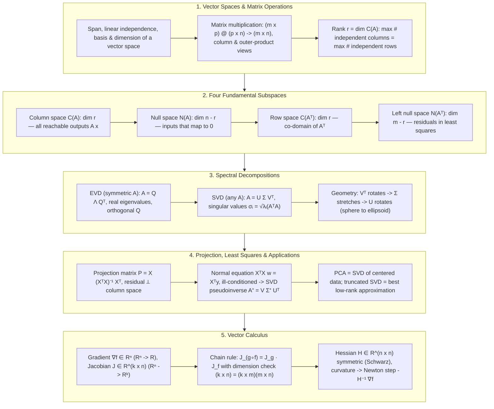

# 📐 Linear Algebra Core for AI: Vector Spaces, Four Subspaces, EVD/SVD, Projection & Least Squares, Jacobian/Hessian

> **Core Executive Summary**: Linear algebra is the substrate of machine learning and deep learning: every tensor is a matrix, every layer is a matrix multiplication, and every loss surface is a function of matrix products. This guide covers the non-negotiable core — vector spaces and matrix algebra, the four fundamental subspaces with the rank-nullity theorem, eigendecomposition (EVD) and singular value decomposition (SVD) with their geometric meaning, the geometry of orthogonal projection and least squares (the normal equation $X^T X w = X^T y$ as a projection statement), decomposition applications such as PCA, low-rank approximation and the Moore-Penrose pseudoinverse, and finally multivariate calculus (gradient, Jacobian, Hessian) with the chain-rule dimension check used in every backpropagation pass.

---

## 💡 Interactive Mermaid Architecture Flowchart



---

## 💡 Classic Interview Followups & Core Cheatsheet

* **Key Topic 1**: What are the four fundamental subspaces of a matrix $A \in \mathbb{R}^{m \times n}$, and how does the rank-nullity theorem relate their dimensions?
  * *Standard Answer*: With rank $r$: the column space $C(A) = \{Ax\}$ has dimension $r$; the null space $N(A) = \{x : Ax = 0\}$ has dimension $n - r$; the row space $C(A^T)$ has dimension $r$; the left null space $N(A^T) = \{y : A^T y = 0\}$ has dimension $m - r$. The rank-nullity theorem states $\dim C(A) + \dim N(A) = n$ and $\dim C(A^T) + \dim N(A^T) = m$. Moreover the pairs are orthogonal complements: $C(A^T) \perp N(A)$ and $C(A) \perp N(A^T)$, so every vector decomposes uniquely into a row-space plus a null-space component — the geometric backbone of least squares.

* **Key Topic 2**: Derive the normal equation $X^T X w = X^T y$ and give its geometric interpretation.
  * *Standard Answer*: Minimize $J(w) = \frac{1}{2}\|Xw - y\|^2$. Setting the gradient $\nabla J(w) = X^T(Xw - y)$ to zero yields $X^T X w = X^T y$. Geometrically, $\hat{y} = Xw^*$ must be the orthogonal projection of $y$ onto $C(X)$: the residual $r = y - \hat{y}$ is perpendicular to every column of $X$, i.e. $X^T r = X^T(y - Xw) = 0$, which is exactly the normal equation. Solving it is equivalent to discarding the component of $y$ in $N(X^T)$ — the part no linear model can explain. If $X^T X$ is singular (collinear columns or $n < d$), add ridge $\lambda I$ or use the SVD pseudoinverse.

* **Key Topic 3**: Explain the geometric meaning of the SVD $A = U\Sigma V^T$ and its connection to the EVD of $A^T A$ and $AA^T$.
  * *Standard Answer*: The SVD factors any real matrix into three maps: $V^T$ (rotation/reflection in the input space), $\Sigma$ (axis-aligned scaling by singular values $\sigma_1 \ge \dots \ge \sigma_r > 0$), and $U$ (rotation/reflection in the output space). Multiplying by $A$ maps the unit sphere to an ellipsoid whose semi-axis lengths are the $\sigma_i$. Algebraically $A^T A = V\Sigma^2 V^T$ and $AA^T = U\Sigma^2 U^T$ are eigendecompositions, so singular values are square roots of the eigenvalues of the Gram matrix, columns of $V$ are eigenvectors of $A^T A$, and columns of $U$ are eigenvectors of $AA^T$. For a symmetric matrix the SVD collapses to the EVD with $|\lambda_i|$ as singular values.

* **Key Topic 4**: How do you compute the Moore-Penrose pseudoinverse via SVD, and when should it replace $(X^T X)^{-1} X^T$?
  * *Standard Answer*: The pseudoinverse is $A^+ = V\Sigma^+ U^T$, where $\Sigma^+$ inverts each non-zero singular value ($1/\sigma_i$) and transposes. It always yields the minimum-norm least-squares solution $w^* = A^+ y$; for full column rank this equals the normal-equation solution $(X^T X)^{-1} X^T y$. Prefer $A^+$ when $X^T X$ is singular or ill-conditioned: forming $(X^T X)^{-1}$ squares the condition number $\kappa(X^T X) = \kappa(X)^2$, amplifying roundoff and noise, while the SVD-based route keeps $\kappa(X)$ only. This is why `np.linalg.lstsq` (SVD-based) is the production default for regression.

* **Key Topic 5**: In backpropagation, how do you verify the chain rule with a Jacobian dimension check, and what role does the Hessian play in optimization?
  * *Standard Answer*: For $f: \mathbb{R}^n \to \mathbb{R}^k$ the Jacobian $J \in \mathbb{R}^{k \times n}$ has entries $J_{ij} = \partial f_i / \partial x_j$ (the gradient is the $k=1$ case). For $h = g \circ f$ with $f: \mathbb{R}^n \to \mathbb{R}^m$ and $g: \mathbb{R}^m \to \mathbb{R}^k$: $J_h = J_g(f(x)) \cdot J_f(x)$, and the shape check $(k \times n) = (k \times m)(m \times n)$ catches transposed gradients — the most common silent bug in custom backprop. The Hessian $H = \nabla^2 f \in \mathbb{R}^{n \times n}$ is the Jacobian of the gradient, symmetric when $f$ is twice differentiable (Schwarz theorem); its eigenvalues classify critical points (all positive: local min; mixed: saddle) and Newton's step $\Delta w = -H^{-1}\nabla f$ rescales the gradient by curvature.

---

## 📚 Section 1: Vector Spaces & Matrix Operations

### 1.1 Vector Spaces, Basis and Dimension

A vector space $V$ over $\mathbb{R}$ is a set closed under vector addition and scalar multiplication. The key derived concepts:

| Concept | Definition | AI Relevance |
| :--- | :--- | :--- |
| **Span** | all linear combinations of a set of vectors | the feature space a linear layer can reach |
| **Linear independence** | $\sum_i c_i v_i = 0 \implies$ all $c_i = 0$ | columns of a full-rank design matrix $X$ |
| **Basis** | a minimal independent spanning set | the coordinates in which a matrix becomes diagonal |
| **Dimension** | the number of vectors in any basis | intrinsic degrees of freedom of the model |

A basis is the bridge between geometry and computation: any vector $x = \sum_i \alpha_i b_i$ is uniquely represented by its coordinates $(\alpha_1, \dots, \alpha_d)$ — this is what allows matrices (coordinate maps) to stand in for abstract linear transformations.

> 📖 **How to read this table**: The four rows are one reasoning chain: Span defines "where you can go" → linear independence guarantees "no redundant directions" → a basis is a minimal independent spanning set → dimension is the size of any basis. Interviewers love asking why rank = max independent rows = max independent columns; the answer is the row-rank = column-rank theorem.
>
> 💡 **Intuition**: Think of a vector space as "every shape you can build from blocks": Span is all block combinations, independence says "no block is a combination of the others," a basis is the minimal block set (one more is redundant, one fewer cannot build everything), and dimension is the count of minimal blocks. The value of a basis: it gives every vector a unique coordinate address — like longitude/latitude for the Earth. With a basis, abstract geometry becomes a column of numbers a computer can hold.
>
> 🎤 **Speed answer**: "Conclusion: Span = all linear combinations, a basis = minimal independent spanning set, dimension = size of any basis. Mechanism: independence guarantees unique representation, so a basis gives every vector a unique coordinate. Example: in $\mathbb{R}^2$ with the standard basis $\{(1,0),(0,1)\}$, the vector $(3,4)$ has coordinates $(3,4)$; with basis $\{(1,1),(1,-1)\}$ the same vector becomes $(3.5,-0.5)$ — the vector did not change, the coordinate system did. Interview point: 'diagonalizing with eigenvectors is changing to the eigen-basis.'"

### 1.2 Matrix Multiplication: Dimensions and Interpretations

For $A \in \mathbb{R}^{m \times p}$ and $B \in \mathbb{R}^{p \times n}$, the product is defined elementwise as

$$(AB)_{ij} = \sum_{k=1}^{p} A_{ik} B_{kj}, \qquad AB \in \mathbb{R}^{m \times n}$$

Three equivalent views matter in practice: (1) **row-column**: dot products of rows of $A$ with columns of $B$; (2) **column view**: $AB = [Ab_1, \dots, Ab_n]$ — each output column is $A$ acting on one column of $B$, the view used in batched inference; (3) **outer-product view**: $A = \sum_i \sigma_i u_i v_i^T$ — any matrix is a sum of rank-1 pieces, the exact mechanism behind SVD and low-rank factorization (LoRA-style updates $\Delta W = BA$).

> 💡 **Intuition**: The formula $(AB)_{ij}=\sum_k A_{ik}B_{kj}$ looks like a multiply-add loop, but the three views are three worldviews: row-column answers "how to compute" (dot products); column answers "what is being computed" — $A$ is a machine processing each column of $B$ as raw material (this is exactly how neural forward passes are batched); outer-product answers "what matrices are made of" — any matrix is a stack of thin rank-1 slices, and the number of slices is the rank. LoRA fine-tuning is literally "modifying only a few thin slices."
>
> 🎤 **Speed answer**: "Conclusion: matrix multiplication has three equivalent views — inner products (compute), column action (semantics), outer-product decomposition (structure). Mechanism: $AB=[Ab_1,\dots,Ab_n]$ means each output column is $A$ acting on one column of $B$; $A=\sum_i\sigma_i u_iv_i^T$ means any matrix is a sum of rank-1 pieces. Example: LoRA writes $\Delta W$ as $BA$ (e.g., $8\times4096$ times $4096\times4096$ compressed into two low-rank factors), cutting parameters from 16M to ~65k — because matrices can be flattened into slices and you keep only the thickest few."

### 1.3 Rank: the Single Most Important Number

$$\text{rank}(A) = \dim C(A) = \text{max number of independent columns} = \text{max number of independent rows}$$

Row rank always equals column rank. Consequences for ML: if $\text{rank}(X) = d$ (full column rank), the Gram matrix $X^T X$ is invertible and the least-squares solution is unique; if $\text{rank}(X) < d$, the normal equation has infinitely many solutions and regularization (or the pseudoinverse) is required to pick one.

> 💡 **Intuition**: Rank is "the number of information channels." If one column can be assembled from the others (column 3 = column 1 + column 2), it carries no new direction — like a team where one member is just a copy of the others' opinions; only two independent opinions exist. The row-rank = column-rank "coincidence" is really one linear map viewed from the input side and the output side — they are twins. In ML, rank decides uniqueness: a full-rank design matrix means "enough information for a unique answer"; a deficient rank means "repeated information," so regularization picks one answer.
>
> 🎤 **Speed answer**: "Conclusion: rank = max independent columns = max independent rows; it decides whether least squares has a unique solution. Mechanism: the column space and row space have the same dimension (row rank = column rank); full column rank makes $X^TX$ invertible and the solution unique, otherwise infinitely many solutions exist. Example: if feature 3 in $X$ equals the sum of features 1 and 2 (e.g., 'age' and 'birth year' collinear), rank drops from 3 to 2 and $X^TX$ becomes singular — the normal equation breaks, so you need Ridge ($\lambda I$) or the pseudoinverse for the minimum-norm solution. Golden line: 'Rank is the matrix's ID card; it decides whether the equation has one answer.'"

---

## 📚 Section 2: The Four Fundamental Subspaces & Rank

### 2.1 The Fundamental Theorem of Linear Algebra

| Subspace | Definition | Dimension | Orthogonal Complement |
| :--- | :--- | :--- | :--- |
| **Column space** $C(A)$ | $\{Ax : x \in \mathbb{R}^n\} \subseteq \mathbb{R}^m$ | $r$ | $N(A^T)$ |
| **Null space** $N(A)$ | $\{x : Ax = 0\} \subseteq \mathbb{R}^n$ | $n - r$ | $C(A^T)$ |
| **Row space** $C(A^T)$ | $\{A^T y : y \in \mathbb{R}^m\} \subseteq \mathbb{R}^n$ | $r$ | $N(A)$ |
| **Left null space** $N(A^T)$ | $\{y : A^T y = 0\} \subseteq \mathbb{R}^m$ | $m - r$ | $C(A)$ |

> 📖 **How to read this table**: The four rows are two orthogonal-complement pairs: row space + null space (complementary in the input space $\mathbb{R}^n$, dimensions sum to $n$) and column space + left null space (complementary in the output space $\mathbb{R}^m$, sum $m$). The most-asked interview question — "why does the least-squares residual live in the left null space?" — is answered by the last row's orthogonal-complement column.
>
> 💡 **Intuition**: The four subspaces are "four rooms of the matrix machine": $C(A)$ = all products the machine can produce; $N(A)$ = which raw materials get ground to 0 (information the machine swallows); row space = the effective dimensions of the raw material; left null space = directions in the output space the machine can never produce. The key fact: **row space and null space are perpendicular and together fill the whole input space** — every input splits uniquely into an "effective part" plus a "swallowed part," which is the geometric source of existence and uniqueness.

### 2.2 Rank-Nullity and the Orthogonal Decompositions

The rank-nullity theorem follows from the first isomorphism theorem of linear maps:

$$\dim C(A) + \dim N(A) = n, \qquad \dim C(A^T) + \dim N(A^T) = m$$

Sketch: extend a basis $\{v_1, \dots, v_{n-r}\}$ of $N(A)$ to a basis of $\mathbb{R}^n$; the images of the remaining $r$ vectors form an independent set in $C(A)$. Since $C(A^T) \perp N(A)$ and their dimensions sum to $n$, we get the **orthogonal decomposition** $\mathbb{R}^n = C(A^T) \oplus N(A)$ and similarly $\mathbb{R}^m = C(A) \oplus N(A^T)$.

> 💡 **Intuition**: Rank-nullity is "conservation of dimension": a matrix neither creates nor destroys dimensions. Whatever part of the input survives (row space, mapped into the column space), the rest must be swallowed (null space) — the two add up to the input dimension $n$ exactly. Like splitting an $n$-person team: $r$ people go work (column space), $n-r$ stand by (null space), total unchanged. The orthogonal decomposition sharpens this: the split is perpendicular — workers never step on bystanders.
>
> 🎤 **Speed answer**: "Conclusion: $\dim C(A)+\dim N(A)=n$ and $C(A^T)\perp N(A)$ are orthogonal complements. Mechanism: a matrix neither creates nor destroys dimensions; swallowed dimensions plus surviving dimensions equal the input dimension. Example: a $3\times3$ matrix of rank 2 (row 3 = row 1 + row 2) has a 1-D null space: $Ax=0$ has solutions along a line, and when $Ax=b$ is solvable, the solutions are 'every point on that line shifted'. Golden line: 'Rank sets the size of the solution space; the null space is the measure of freedom.'"

### 2.3 Why It Matters for Machine Learning

- **Existence**: $Ax = b$ has a solution iff $b \in C(A)$; it is unique iff $N(A) = \{0\}$.
- **Least squares**: writing $y = \hat{y} + r$ splits $y$ into an explainable part $\hat{y} \in C(X)$ and noise $r \in N(X^T)$ — the left null space is literally the "unexplainable residual" space.
- **Identifiability**: $w = (X^T X)^{-1} X^T y$ is well-defined iff $X$ has rank $d$; otherwise parameters are not identifiable without priors/regularization.

> 💡 **Intuition**: Frame regression in subspace language: the component of $y$ inside $C(X)$ (reachable from the row space) is what the model can explain; the component inside $N(X^T)$ (left null space) is unexplainable by *any* linear model. Least squares simply "gives up" on the latter — not because the model is lazy, but because those directions are outside $X$'s reach. When the null space is non-trivial (rank-deficient), $Xw = y$ has infinitely many solutions: different $w$ differ only by a null-space vector — identical predictions, wildly different parameters. That is "non-identifiability," and regularization picks the minimum-norm one.
>
> 🎤 **Speed answer**: "Conclusion: $Ax=b$ is solvable iff $b\in C(A)$, unique iff $N(A)=\{0\}$; in regression the residual lies in $N(X^T)$. Mechanism: $y$ splits into a $C(X)$ component (explainable) plus an $N(X^T)$ component (unexplainable); when rank-deficient, solutions differ only by null-space vectors. Example: features A and B perfectly collinear (B=2A) — $\beta_A=1,\beta_B=0$ and $\beta_A=-1,\beta_B=1$ give identical predictions, so parameters are not identifiable; drop features or regularize. Interview point: 'Collinearity is a non-trivial null space; identifiability is a zero null space.'"

---

## 📚 Section 3: EVD & SVD: Spectral Decomposition

### 3.1 Eigendecomposition

An eigenpair satisfies $Av = \lambda v$. For symmetric $A = A^T \in \mathbb{R}^{n \times n}$ the spectral theorem guarantees an orthogonal diagonalization:

$$A = Q \Lambda Q^T, \qquad Q^T Q = I, \quad \Lambda = \text{diag}(\lambda_1, \dots, \lambda_n) \in \mathbb{R}$$

Geometry: $Q^T$ rotates into the eigenbasis, $\Lambda$ scales each axis independently, and $Q$ rotates back. This is why PCA, Markov chain stationary analysis, and graph Laplacians all reduce to eigenvalue problems.

> 💡 **Intuition**: Eigenvectors are "directions the transformation only stretches, never turns." Picture a linear map squashing a circle into an ellipse: the long axis is the eigenvector of the largest eigenvalue (stretched hardest), the short axis the smallest. Read $A = Q\Lambda Q^T$ as "rotate to those special directions ($Q^T$), stretch each axis independently ($\Lambda$), rotate back ($Q$)" — decomposing one arbitrary transformation into three simple moves. Symmetry guarantees $Q$ is a pure rotation (orthogonal) — the power of the spectral theorem.
>
> 🎤 **Speed answer**: "Conclusion: symmetric matrices diagonalize as $A=Q\Lambda Q^T$ with orthogonal $Q$ and eigenvalues on the diagonal. Mechanism: eigenvector directions are invariant ($Av=\lambda v$); symmetry forces the eigenvectors to be mutually orthogonal. Example: covariance matrix $\begin{pmatrix}2&1\\1&2\end{pmatrix}$ has eigenvalues 3 and 1 with eigenvectors $(1,1)^T$, $(1,-1)^T$ — PCA's first principal direction is $(1,1)$, explaining $3/(3+1)=75\%$ of the variance. Memory: 'Eigenvectors are the transformation's anchor directions; eigenvalues are the scale marks on them.'"

### 3.2 From EVD to SVD

For any $A \in \mathbb{R}^{m \times n}$, the Gram matrix $A^T A \in \mathbb{R}^{n \times n}$ is symmetric positive semi-definite, so it has a full EVD $A^T A = V \Lambda V^T$ with $\Lambda = \text{diag}(\sigma_1^2, \dots, \sigma_n^2)$, $\sigma_i \ge 0$. Defining $u_i = \frac{A v_i}{\sigma_i}$ for $\sigma_i > 0$ yields an orthonormal set $\{u_i\}$, and padding with orthonormal vectors completes the second basis:

$$A = U \Sigma V^T, \qquad U \in \mathbb{R}^{m \times m}, \ V \in \mathbb{R}^{n \times n} \text{ orthogonal}, \ \Sigma \text{ diagonal with } \sigma_1 \ge \sigma_2 \ge \dots \ge \sigma_r > 0$$

> 💡 **Intuition**: Why can SVD be built this way? "Take the easy route, then fill in." $A^T A$ is symmetric, so it has a full eigendecomposition $A^T A = V\Lambda V^T$ with non-negative eigenvalues (because $\|Av\|^2 = v^TA^TAv \ge 0$); take square roots to get the singular values $\sigma_i$. Then the key move: $u_i = Av_i/\sigma_i$ turns out to be a set of orthonormal unit vectors (check $u_i^Tu_j = v_i^TA^TAv_j/\sigma_i\sigma_j = \sigma_j^2\delta_{ij}/\sigma_i\sigma_j = \delta_{ij}$) — $A$ itself projects $V$'s columns into the output space to form $U$'s columns; pad to $m$ dimensions and you're done. SVD introduces no new assumptions — it is just "EVD for symmetric matrices, ported to arbitrary rectangular ones."
>
> 🎤 **Speed answer**: "Conclusion: SVD is built from the EVD of $A^TA$ — singular values $\sigma_i=\sqrt{\lambda_i(A^TA)}$, right singular vectors $V$ are $A^TA$'s eigenvectors, and left singular vectors are $u_i=Av_i/\sigma_i$. Mechanism: $A^TA$ is symmetric positive semi-definite (non-negative eigenvalues, orthogonal eigenvectors), and the $u_i$ construction guarantees $U$ is orthogonal. Example: $A=\begin{pmatrix}1&0\\0&0\end{pmatrix}$ → $A^TA=\begin{pmatrix}1&0\\0&0\end{pmatrix}$ has eigenvalues 1,0 → $\sigma=(1,0)$, $v_1=(1,0)^T$, $u_1=Av_1/1=(1,0)^T$. Memory: 'SVD is EVD's employee, hired for rectangular matrices.'"

### 3.3 Geometric Meaning and Condition Number

| Decomposition | Applies To | Diagonal Entries | Orthogonal Factors |
| :--- | :--- | :--- | :--- |
| **EVD** $A = Q\Lambda Q^T$ | symmetric (or diagonalizable) matrices | eigenvalues $\lambda_i$ | $Q$: eigenvectors of $A$ |
| **SVD** $A = U\Sigma V^T$ | any real matrix | singular values $\sigma_i = \sqrt{\lambda_i(A^T A)}$ | $U$: eigenvectors of $AA^T$; $V$: eigenvectors of $A^T A$ |

Geometrically, $A$ maps the unit sphere in $\mathbb{R}^n$ onto an ellipsoid in $\mathbb{R}^m$ with semi-axis lengths $\sigma_1, \dots, \sigma_r$ aligned with the left singular vectors. The **condition number** $\kappa(A) = \sigma_{\max} / \sigma_{\min}$ measures how much $A$ can amplify relative error — small singular values are where noise and numerical roundoff explode.

> 📖 **How to read this table**: Contrast the "applies to" column: EVD needs symmetric (or diagonalizable) square matrices; SVD handles any real matrix. The diagonal-entries column is the memory core — singular values are square roots of eigenvalues, and SVD's $U$/$V$ come from the eigenvectors of $AA^T$ and $A^TA$ respectively. Asked "what is the relation between SVD and EVD?" — this table is the answer.
>
> 💡 **Intuition**: SVD's geometric story is "sphere to ellipsoid": $V^T$ rotates first (aligning the sphere with the singular directions), $\Sigma$ stretches along each axis (radii become $\sigma_1,\dots,\sigma_n$), and $U$ rotates again (orienting the ellipsoid anywhere in the output space) — **rotate, stretch, rotate** describes any linear map, the most beautiful fact about SVD. The condition number $\kappa=\sigma_{max}/\sigma_{min}$ is the "longest-axis/shortest-axis ratio": a flatter ellipsoid means the map amplifies some direction enormously, and solving equations amplifies errors by up to $\kappa$ along that direction — ill-conditioned matrices are "too-flat ellipsoids."
>
> 🎤 **Speed answer**: "Conclusion: SVD decomposes any matrix into rotate × scale × rotate: $A=U\Sigma V^T$; the unit sphere maps to an ellipsoid with semi-axes $\sigma_i$. Mechanism: $\sigma_i=\sqrt{\lambda_i(A^TA)}$, $V$ holds $A^TA$'s eigenvectors, $U$ holds $AA^T$'s; condition number $\kappa=\sigma_{max}/\sigma_{min}$. Example: $\sigma=(100, 0.001)$ → $\kappa=10^5$; a 1% relative error in $b$ for $Ax=b$ blows up ~1000×. Since $\kappa(X^TX)=\kappa(X)^2$, production code uses SVD/QR instead of explicit inversion. Golden line: 'The singular value spectrum is the matrix's health report.'"

---

## 📚 Section 4: Projection & Least Squares — Geometry of the Normal Equation

### 4.1 Orthogonal Projection Matrices

For $X \in \mathbb{R}^{n \times d}$ with full column rank, the projection onto $C(X)$ is

$$P = X (X^T X)^{-1} X^T, \qquad P^2 = P, \quad P^T = P$$

For any $y$, $Py$ is the closest point in $C(X)$ to $y$ — the projection theorem. Minimizing $\|Xw - y\|^2$ over $w$:

$$\|Xw - y\|^2 = w^T X^T X w - 2 w^T X^T y + y^T y \implies \nabla_w = 2X^T X w - 2 X^T y = 0 \implies X^T X w = X^T y$$

> 💡 **Intuition**: The projection matrix $P = X(X^TX)^{-1}X^T$ is a "shadow factory for the column space": any vector $y$ enters and exits as its shadow $Py$ on $C(X)$. Two properties reveal its nature — $P^2 = P$ (a shadow's shadow is itself; projecting twice equals once) and $P^T = P$ (the shadow line meets the floor at a right angle: orthogonal projection). Least squares is "find the legal parameters $w$ such that $Xw$ equals $y$'s shadow exactly": $\|Xw-y\|^2$ is minimized iff $Xw = Py$, i.e., the error vector is perpendicular to the column space.
>
> 🎤 **Speed answer**: "Conclusion: $P=X(X^TX)^{-1}X^T$ is the orthogonal projection onto the column space, with $P^2=P$ and $P^T=P$. Mechanism: $P$ maps any $y$ to the closest point in $C(X)$; $P^2=P$ means projection is idempotent (a shadow's shadow is itself) and $P^T=P$ means it is orthogonal. Example: for the 1-D column space along $(1,1)^T$, $X=(1,1)^T$ gives $P=\frac12\begin{pmatrix}1&1\\1&1\end{pmatrix}$; $y=(1,3)^T$ projects to $Py=(2,2)^T$ with residual $(1,-1)$ perpendicular to the line. Exam point: projection matrices have determinant 0 and eigenvalues 1 (column space) and 0 (orthogonal complement)."

### 4.2 Geometric Reading of the Normal Equation

The residual at the optimum satisfies $r = y - Xw^*$ with $X^T r = 0$, i.e. $r \in N(X^T)$. So the normal equation is the statement: *"the prediction $\hat{y} = Xw^*$ is the orthogonal projection of $y$ onto the column space, and the residual lies entirely in the left null space."* Written in decomposition form, $y = \underbrace{Xw^*}_{\in C(X)} + \underbrace{r}_{\in N(X^T)}$. This is the cleanest geometric fact in statistics: least squares never "reaches" for components of $y$ it cannot express.

> 💡 **Intuition**: The one-sentence version of the normal equation: **the optimal prediction is the orthogonal projection of $y$ onto the feature column space.** Shine a light straight down: $y$'s shadow on the "floor" (column space) is $\hat y$, and the perpendicular gap between floor and shadow-tip is the residual — perpendicular to every column, i.e., $X^Tr=0$. The normal equation is not "invented" by algebra; it is the algebraic translation of the geometric fact "the residual must be vertical."
>
> 🎤 **Speed answer**: "Conclusion: the normal equation $X^TXw=X^Ty$ means $\hat y=Xw^*$ is the orthogonal projection of $y$ onto $C(X)$, with residual $r\in N(X^T)$. Mechanism: $\nabla J = X^T(Xw-y)=0$ is equivalent to $X^Tr=0$ (residual perpendicular to every feature column). Example: projecting $y=(1,2,3)^T$ onto the line spanned by $(1,1,1)^T$ gives $(2,2,2)^T$; the residual $(1,-1,1)$ has zero dot product with the direction — the 1-D version of the normal equation. Golden line: 'Least squares is not solving an equation; it is finding a shadow.'"

---

## 📚 Section 5: Applications — PCA, Low-Rank Approximation & the Pseudoinverse

### 5.1 PCA as an SVD

Center the data $\tilde{X} = X - \mathbf{1}\bar{x}^T$ and compute the SVD $\tilde{X} = U \Sigma V^T$. The principal directions are the columns of $V$ (loadings), the scores are $U\Sigma$, and the variance explained by the $k$-th component is $\sigma_k^2 / (n-1)$. PCA is therefore just a singular value decomposition with a mean-subtraction preprocessing step.

> 💡 **Intuition**: PCA asks "which direction is the data cloud fattest?" Each data point is an arrow from the origin; the covariance matrix describes how the arrows spread, and its eigendecomposition reveals the longest axis (PC1), second-longest (PC2), and so on. SVD bypasses explicitly building the covariance matrix: decompose the centered data matrix $\tilde X$ directly — the right singular vectors $V$ are the principal directions and the squared singular values (divided by $n-1$) are the variances along them. Dimension reduction = projecting data onto the thickest axes and discarding the thinnest (noise) ones.
>
> 🎤 **Speed answer**: "Conclusion: PCA = centering + SVD; principal directions are $V$'s columns, and PC $k$ explains $\sigma_k^2/\sum\sigma_j^2$ of the variance. Mechanism: $\tilde X=U\Sigma V^T$; $V$'s columns are eigenvectors of the covariance matrix and variances equal squared singular values divided by $n-1$. Example: 100 students' 4 exam scores with $\sigma=(12,3,0.5,0.1)$ — PC1 explains $144/154.3 \approx 93\%$ of the variance, so one dimension captures almost everything: a 'composite score'. Golden line: 'PCA finds the spine of the data cloud.'"

### 5.2 Low-Rank Approximation (Eckart-Young Theorem)

Among all rank-$k$ matrices, the truncated SVD $A_k = U_k \Sigma_k V_k^T$ minimizes the Frobenius error:

$$\min_{\text{rank}(B) \le k} \|A - B\|_F = \|A - A_k\|_F = \sqrt{\sum_{i=k+1}^{r} \sigma_i^2}$$

This single theorem powers embedding compression, image denoising, collaborative filtering (matrix completion), and LoRA's low-rank adaptation of weight matrices.

> 💡 **Intuition**: Eckart-Young states something very natural: "the best way to approximate a matrix is to stack the rank-1 slices from thickest to thinnest and stop at $k$; the error is exactly the total thickness of the discarded slices." The error formula $\sqrt{\sum_{i>k}\sigma_i^2}$ is "square root of the sum of squared thicknesses of the slices you threw away" — $\sigma_i$ is already the importance ruler, so no new approximation machinery is needed. That is why truncated SVD is the default compression weapon: provably optimal AND directly readable from the spectrum.
>
> 🎤 **Speed answer**: "Conclusion: the best rank-$k$ approximation is truncated SVD $A_k=U_k\Sigma_kV_k^T$ with error $\sqrt{\sum_{i>k}\sigma_i^2}$. Mechanism: each $\sigma_iu_iv_i^T$ is a rank-1 slice; truncating by importance ($\sigma$) minimizes error. Example: a $4\times4$ matrix with $\sigma=(10,9,1,0.1)$ — keeping $k=2$ costs only $\sqrt{1^2+0.1^2}\approx1.005$ error but halves the storage (16 entries → 8). Image compression and LoRA work the same way. Golden line: 'Truncated SVD fires by importance; the error is the severance pay of the fired slices.'"

### 5.3 Moore-Penrose Pseudoinverse

$$A^+ = V \Sigma^+ U^T, \qquad \Sigma^+ = \text{diag}\left(\frac{1}{\sigma_1}, \dots, \frac{1}{\sigma_r}, 0, \dots, 0\right)$$

$w^* = A^+ y$ solves $\min_w \|Aw - y\|$ subject to minimal $\|w\|$ — the unique minimum-norm least-squares solution. When $n > d$ (underdetermined), $(X^T X)^{-1}$ does not exist, but $A^+$ always does and never squares the condition number, making it the numerically safe default (`np.linalg.lstsq`).

> 💡 **Intuition**: The pseudoinverse is "an inverted definition, made forgiving." A true inverse demands $A^{-1}A = I$, impossible for rank-deficient $A$; the pseudoinverse only demands: invert exactly along the "live directions" (column space, using $1/\sigma_i$) and output 0 along the "dead directions" (null space / tiny singular values). Operationally, $\Sigma^+$ reciprocates every non-zero singular value and keeps zeros at zero — "invert where there is information, stay silent where there is none." So $A^+y$ always gives the minimum-norm least-squares solution: never guess what you cannot explain, and guess as small as possible. The normal-equation solution is just the pseudoinverse in the full-column-rank special case, but forming $X^TX$ squares the condition number while SVD touches only $A$ itself.
>
> 🎤 **Speed answer**: "Conclusion: the pseudoinverse $A^+=V\Sigma^+U^T$ (reciprocate non-zero singular values) yields the minimum-norm least-squares solution $w^*=A^+y$. Mechanism: the normal-equation solution is the full-rank special case; when rank-deficient, $(X^TX)^{-1}$ does not exist and $\kappa(X^TX)=\kappa(X)^2$ amplifies errors, while the SVD route keeps only $\kappa(X)$. Example: 2 samples with 3 features (underdetermined) — the normal equation collapses, $A^+y$ still returns the minimum-norm solution; for an ill-conditioned $\sigma=(100,0.001)$, direct inversion amplifies noise $10^5\times$ while the pseudoinverse only inverts the live direction. Golden line: 'The pseudoinverse is the forgiving inverse — invert what can be inverted, stay silent on the rest.'"

---

## 📚 Section 6: Jacobian, Hessian & Chain-Rule Dimension Checks

### 6.1 Gradient vs Jacobian

| Object | Function | Shape | Entries |
| :--- | :--- | :--- | :--- |
| **Gradient** $\nabla f$ | $f: \mathbb{R}^n \to \mathbb{R}$ | $n \times 1$ | $\partial f / \partial x_i$ |
| **Jacobian** $J_f$ | $f: \mathbb{R}^n \to \mathbb{R}^k$ | $k \times n$ | $\partial f_i / \partial x_j$ (row $i$ = gradient of $f_i$) |
| **Hessian** $\nabla^2 f$ | $f: \mathbb{R}^n \to \mathbb{R}$ | $n \times n$ | $\partial^2 f / \partial x_i \partial x_j$ |

For $f(x, y) = (2x^2, x\sqrt{y})$: $J_f = \begin{pmatrix} 4x & 0 \\ \sqrt{y} & \frac{x}{2\sqrt{y}} \end{pmatrix}$ — each row is the gradient of one output component.

> 📖 **How to read this table**: The "shape" column distinguishes the trio: the gradient is a scalar function's partials ($n\times1$ column), the Jacobian is a packed gradient for vector functions ($k$ outputs → $k$ rows, each row the gradient of $f_i$), and the Hessian is the "gradient of the gradient" (second partials, $n\times n$). The anchor to remember: when $k=1$, the Jacobian degenerates to the gradient.
>
> 💡 **Intuition**: The gradient asks "which way does $f$ climb fastest" (hiking slope), the Jacobian asks "how much does each output depend on each input" (a sensitivity table: entry $(i,j)$ = output $i$'s sensitivity to input $j$), and the Hessian is the "slope of the slope" — it says not just "it's uphill here" (gradient) but "is the hill steepening or flattening" (curvature). The progression: gradient = first-order info for one output; Jacobian = first-order info for many outputs; Hessian = second-order info.
>
> 🎤 **Speed answer**: "Conclusion: the gradient is a scalar function's partials ($n\times1$), the Jacobian is the gradient matrix of a vector function ($k\times n$, one row per output), and the Hessian is the Jacobian of the gradient ($n\times n$). Mechanism: $J_{ij}=\partial f_i/\partial x_j$. Example: $f(x,y)=(2x^2, x\sqrt y)$ → $J=\begin{pmatrix}4x&0\\\sqrt y&x/2\sqrt y\end{pmatrix}$: row 1 is $f_1$'s gradient $[4x,0]$ ($f_1$ ignores $y$, hence the 0). For hand-written backprop, run a numeric gradient check (gradcheck) on every row to validate the Jacobian."

### 6.2 The Chain Rule and Its Dimension Check

For $h = g \circ f$ with $f: \mathbb{R}^n \to \mathbb{R}^m$, $g: \mathbb{R}^m \to \mathbb{R}^k$:

$$J_h(x) = J_g(f(x)) \cdot J_f(x), \qquad \text{shapes: } (k \times n) = (k \times m)(m \times n)$$

In backpropagation, for $L = \ell(y)$ with $y = Wx$: $\frac{\partial L}{\partial x} = W^T \frac{\partial L}{\partial y}$ has shapes $(n \times 1) = (n \times k)(k \times 1)$, and $\frac{\partial L}{\partial W} = \frac{\partial L}{\partial y} x^T$ has shapes $(k \times n) = (k \times 1)(1 \times n)$. Whenever the outer product or the multiplication order is wrong, the shape check fails immediately — the cheapest runtime assertion for hand-written gradients.

> 💡 **Intuition**: Backprop is just the chain rule's Jacobian multiplication walked backward, and the dimension check is its cheapest insurance: every intermediate shape must mesh exactly ($(k\times n)=(k\times m)(m\times n)$), so a wrong transpose reveals itself instantly. Memory trick: in $\partial L/\partial x = W^T\partial L/\partial y$, the "surprise $W^T$" is exactly the transpose source — because $y = Wx$ left-multiplies, going backward requires $W$'s reverse action ($W^T$). $\partial L/\partial W$ is an outer product (upstream gradient × input) because the weight is pulled by both the gradient and fed by the input simultaneously.
>
> 🎤 **Speed answer**: "Conclusion: backprop = the chain rule $J_h=J_g\cdot J_f$, verified by the shape check $(k\times n)=(k\times m)(m\times n)$ that catches transposed gradients. Mechanism: for $L=\ell(Wx)$: $\partial L/\partial x = W^T\partial L/\partial y$ and $\partial L/\partial W = (\partial L/\partial y)x^T$. Example: $x\in\mathbb{R}^{64}$, $W\in\mathbb{R}^{10\times64}$ — $\partial L/\partial W$ must be $10\times64$; if you accidentally write $x(\partial L/\partial y)^T$ you get $64\times10$ and the shape check fails in 0 seconds. A numeric gradcheck should agree within ~$10^{-6}$. Golden line: 'A gradient with the wrong shape is a wrong gradient.'"

### 6.3 Hessian, Curvature and Second-Order Methods

The Hessian $H = \nabla^2 f$ is symmetric when $f$ is $C^2$ (Schwarz theorem: cross-partials commute). Its eigenvalues classify stationary points: all positive — local minimum; all negative — local maximum; mixed signs — saddle point (the bane of high-dimensional training). Newton's method uses full curvature information:

$$\Delta w = -H^{-1} \nabla f$$

Since $H$ is $n \times n$ with $n \sim 10^9$ in deep learning, exact second-order methods are infeasible; optimizers approximate curvature via diagonal estimates (AdaGrad/Adam) or Kronecker-factored blocks (K-FAC).

> 💡 **Intuition**: First-order methods (gradient descent) are like "feeling the slope with your eyes closed" — you know which way the ground tilts but always take the same stride. Newton's method is "knowing the whole mountain's shape": $H^{-1}\nabla f$ rescales the step by curvature — long strides on gentle slopes, short strides in steep ravines, arriving at the vertex of a quadratic in one step. That's why Newton converges in few iterations (quadratic) yet nobody uses it for neural nets: with $n=10^9$, $H$ is a $10^9\times10^9$ matrix needing $10^{18}$ floats (~8 exabytes). Adam's cleverness: it uses the gradient's second moment as a diagonal curvature estimate — first-order cost, partial second-order benefit.
>
> 🎤 **Speed answer**: "Conclusion: Hessian eigenvalue signs classify stationary points (all positive = local min, all negative = local max, mixed = saddle), and Newton's step $\Delta w=-H^{-1}\nabla f$ rescales the gradient by curvature. Mechanism: $H$ is the Jacobian of the gradient, symmetric for $C^2$ functions; Newton converges quadratically on convex quadratics. Example: for $f(w)=w^4$ at 0, $f'=0$ and $f''=0$ — gradient descent cannot tell saddle from extremum, and Newton sees $H=0$ too; in high-dimensional nets ~99% of critical points are saddles ($\nabla f=0$ but $H$ has mixed signs). Practical rule: Adam/AdaGrad approximate diagonal curvature; K-FAC uses Kronecker blocks; never compute $H$ exactly. Golden line: 'Gradient gives direction, Hessian gives curvature — curvature is expensive, so approximate it.'"

---

## 🐍 Pure Numpy Implementation

```python
import numpy as np

np.set_printoptions(precision=4, suppress=True)


def four_subspaces(A):
    """Four fundamental subspaces of A via SVD (numerically stable rank)."""
    m, n = A.shape
    U, s, Vt = np.linalg.svd(A)
    r = int(np.sum(s > 1e-10))
    col = U[:, :r]        # C(A)  : dim r       (m x r)
    row = Vt[:r, :].T     # C(Aᵀ) : dim r       (n x r)
    null = Vt[r:, :].T    # N(A)  : dim n - r   (n x (n-r))
    left = U[:, r:]       # N(Aᵀ) : dim m - r   (m x (m-r))
    return col, row, null, left


def lstsq_normal(X, y):
    """Normal equation: only valid when XᵀX is invertible."""
    return np.linalg.inv(X.T @ X) @ X.T @ y


def lstsq_qr(X, y):
    """QR-based least squares: no explicit (XᵀX)⁻¹, better conditioning."""
    Q, R = np.linalg.qr(X)          # reduced QR: Q (n x d), R (d x d)
    return np.linalg.solve(R, Q.T @ y)


def lstsq_svd(X, y):
    """SVD pseudoinverse: minimum-norm solution, stable for rank-deficient X."""
    return np.linalg.pinv(X) @ y    # pinv == V @ Sigma_plus @ Uᵀ


def low_rank_approx(A, k):
    """Eckart-Young: best rank-k approximation in Frobenius norm."""
    U, s, Vt = np.linalg.svd(A, full_matrices=False)
    return (U[:, :k] * s[:k]) @ Vt[:k, :]


def pca_via_svd(X, k):
    """PCA = SVD of mean-centered data. Returns scores, loadings, variances."""
    Xc = X - X.mean(axis=0)
    U, s, Vt = np.linalg.svd(Xc, full_matrices=False)
    scores = Xc @ Vt[:k, :].T       # projected data (n x k)
    variances = s**2 / (len(Xc) - 1)  # eigenvalues of covariance
    return scores, Vt[:k, :].T, variances


if __name__ == "__main__":
    np.random.seed(42)

    # 1. Four subspaces: A is 4x3 with rank 2 (row3 = row1 - row2, row4 = row1 + row2)
    A = np.array([[1, 2, 0], [0, 1, 1], [1, 1, -1], [1, 3, 1]], dtype=float)
    col, row, null, left = four_subspaces(A)
    print(f"dims -> C(A):{col.shape[1]}  N(A):{null.shape[1]}  C(Aᵀ):{row.shape[1]}  N(Aᵀ):{left.shape[1]}")

    # 2. Least squares: three roads to the same w*
    X = np.random.randn(50, 3)
    y = X @ np.array([2.0, -1.0, 0.5]) + 0.1 * np.random.randn(50)
    print("normal:", lstsq_normal(X, y))
    print("QR    :", lstsq_qr(X, y))
    print("SVD   :", lstsq_svd(X, y))

    # 3. Eckart-Young: ||A - A_k||_F must equal sigma_{k+1}
    B = np.random.randn(5, 3)
    err = np.linalg.norm(B - low_rank_approx(B, 2), ord="fro")
    print("low-rank err =", round(err, 5), " vs sigma_3 =", round(np.linalg.svd(B, compute_uv=False)[2], 5))

    # 4. PCA: explained variance fractions of the first two components
    Xd = np.random.randn(100, 4)
    _, _, var = pca_via_svd(Xd, 2)
    print("PCA explained variance (k=2):", np.round(var[:2] / var.sum(), 4))
```

---

## 📝 Takeaways & Engineering Best Practices

1. **Always think in subspaces**: before fitting, ask what lies in $C(X)$, $N(X)$, and $N(X^T)$ — it decides existence, uniqueness, and what your residual can mean.
2. **Never invert $X^T X$ by hand in production**: for ill-conditioned or rank-deficient design matrices, use the SVD pseudoinverse (`np.linalg.lstsq`) or QR — both keep the condition number linear instead of squared.
3. **Use singular values, not eigenvalues, for arbitrary matrices**: $\sigma_i = \sqrt{\lambda_i(A^T A)}$ is the stable route; it also degrades gracefully when $\text{rank}(A) < \min(m, n)$.
4. **Verify gradient shapes every backprop pass**: the Jacobian chain rule $(k \times n) = (k \times m)(m \times n)$ catches transposed derivatives before they silently poison training.
5. **Truncated SVD is the universal compression primitive**: PCA, embedding pruning, denoising, and LoRA all reduce to Eckart-Young — pick $k$ by looking at the singular value spectrum and the explained-variance curve.
