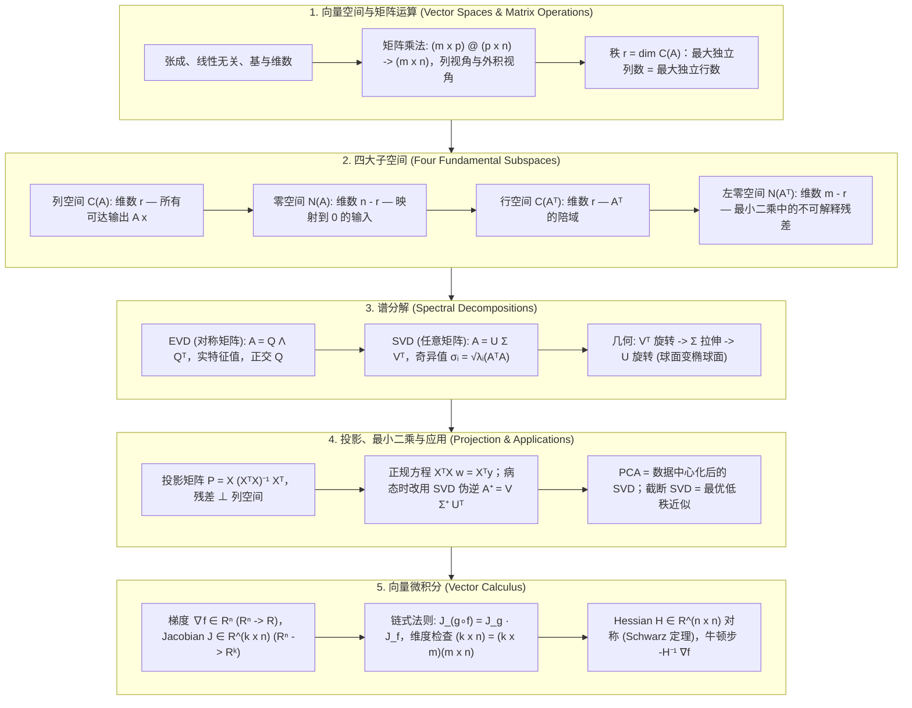

# 🧮 线性代数核心：向量空间、四大子空间、SVD/EVD、投影与最小二乘、Jacobian/Hessian 全景

> **核心摘要**：线性代数是机器学习和深度学习的底层基座——每个张量都是矩阵，每一层都是矩阵乘法，每一条损失曲面都是矩阵运算的函数。本指南覆盖 AI 工程师不可妥协的数理核心：向量空间与矩阵运算、带有秩-零化度定理的四大子空间、特征值分解 EVD 与奇异值分解 SVD 的几何意义、正交投影与最小二乘的几何（正规方程 $X^T X w = X^T y$ 本质上是一条投影声明）、PCA / 低秩近似 / Moore-Penrose 伪逆等分解应用，以及多元微积分（梯度、Jacobian、Hessian）与每次反向传播都要用到的链式法则维度检查。

---

## 💡 交互式 Mermaid 架构流程图



---

## 💡 经典面试追问与考点速查

* **考点 1**：矩阵 $A \in \mathbb{R}^{m \times n}$ 的四大子空间分别是什么？秩-零化度定理如何联系它们的维度？
  * *标准回答*：设秩为 $r$：**列空间** $C(A) = \{Ax\}$ 维数为 $r$；**零空间** $N(A) = \{x : Ax = 0\}$ 维数为 $n - r$；**行空间** $C(A^T)$ 维数为 $r$；**左零空间** $N(A^T) = \{y : A^T y = 0\}$ 维数为 $m - r$。秩-零化度定理给出 $\dim C(A) + \dim N(A) = n$ 且 $\dim C(A^T) + \dim N(A^T) = m$。更关键的是两对子空间互为**正交补**：$C(A^T) \perp N(A)$、$C(A) \perp N(A^T)$，因此任意向量可唯一分解为"行空间分量 + 零空间分量"——这正是最小二乘几何的根基。

* **考点 2**：推导正规方程 $X^T X w = X^T y$，并解释其几何含义。
  * *标准回答*：最小化 $J(w) = \frac{1}{2}\|Xw - y\|^2$，令梯度 $\nabla J(w) = X^T(Xw - y)$ 为零即得 $X^T X w = X^T y$。几何上，最优预测 $\hat{y} = Xw^*$ 必须是 $y$ 在 $C(X)$ 上的**正交投影**：残差 $r = y - \hat{y}$ 与 $X$ 的每一列都垂直，即 $X^T r = X^T(y - Xw) = 0$——这正是正规方程本身。求解正规方程等价于丢掉 $y$ 落在 $N(X^T)$ 中的分量（任何线性模型都无法解释的部分）。当 $X^T X$ 奇异（列共线或 $n < d$）时，需引入岭正则 $\lambda I$ 或改用 SVD 伪逆。

* **考点 3**：解释奇异值分解 $A = U\Sigma V^T$ 的几何意义，以及它与 $A^T A$、$AA^T$ 特征分解的联系。
  * *标准回答*：SVD 把任意实矩阵拆成三步映射：$V^T$（输入空间的旋转/反射）→ $\Sigma$（按奇异值 $\sigma_1 \ge \dots \ge \sigma_r > 0$ 做坐标轴对齐缩放）→ $U$（输出空间的旋转/反射）。$A$ 把 $\mathbb{R}^n$ 中的单位球面映成 $\mathbb{R}^m$ 中的椭球面，半轴长度正是 $\sigma_i$。代数上 $A^T A = V\Sigma^2 V^T$、$AA^T = U\Sigma^2 U^T$ 均为特征分解，故**奇异值 = 格拉姆矩阵特征值的平方根**，$V$ 的列是 $A^T A$ 的特征向量，$U$ 的列是 $AA^T$ 的特征向量。对对称矩阵，SVD 退化为以 $|\lambda_i|$ 为奇异值的 EVD。

* **考点 4**：如何使用 SVD 计算 Moore-Penrose 伪逆？何时应优先于 $(X^T X)^{-1} X^T$？
  * *标准回答*：伪逆定义为 $A^+ = V\Sigma^+ U^T$，其中 $\Sigma^+$ 把每个非零奇异值取倒数 $1/\sigma_i$ 并转置。它总是给出**最小范数最小二乘解** $w^* = A^+ y$；当列满秩时与正规方程解 $(X^T X)^{-1} X^T y$ 一致。当 $X^T X$ 奇异或病态时应优先使用伪逆：构造 $(X^T X)^{-1}$ 会把条件数平方 $\kappa(X^T X) = \kappa(X)^2$，剧烈放大舍入误差与噪声，而 SVD 路线只保留 $\kappa(X)$。这也是 `np.linalg.lstsq`（SVD 实现）成为生产环境默认的原因。

* **考点 5**：反向传播中如何通过 Jacobian 维度检查验证链式法则？Hessian 矩阵在优化中起什么作用？
  * *标准回答*：对 $f: \mathbb{R}^n \to \mathbb{R}^k$，Jacobian $J \in \mathbb{R}^{k \times n}$ 的 $(i,j)$ 元为 $\partial f_i / \partial x_j$（梯度是 $k=1$ 的特例）。对 $h = g \circ f$（$f: \mathbb{R}^n \to \mathbb{R}^m$、$g: \mathbb{R}^m \to \mathbb{R}^k$）：$J_h = J_g(f(x)) \cdot J_f(x)$，维度检查 $(k \times n) = (k \times m)(m \times n)$ 能立刻抓住写反的转置梯度——这是手写反向传播最常见的静默 bug。Hessian $H = \nabla^2 f \in \mathbb{R}^{n \times n}$ 是梯度的 Jacobian，在 $f$ 二阶可导时对称（Schwarz 定理）；其特征值符号判定临界点类型（全正 = 局部极小，混合 = 鞍点），牛顿法步长 $\Delta w = -H^{-1}\nabla f$ 用曲率重新标定梯度。

---

## 📚 第一章：向量空间与矩阵基本运算

### 1.1 向量空间、基与维数

向量空间 $V$ 是在向量加法与数乘下封闭的集合。核心派生概念：

| 概念 | 定义 | AI 相关意义 |
| :--- | :--- | :--- |
| **张成 (Span)** | 一组向量的所有线性组合 | 线性层能够到达的特征空间 |
| **线性无关** | $\sum_i c_i v_i = 0 \implies$ 所有 $c_i = 0$ | 满秩设计矩阵 $X$ 的列 |
| **基 (Basis)** | 最小的独立张成集 | 使矩阵对角化的坐标系 |
| **维数 (Dimension)** | 任何基中向量的个数 | 模型的固有自由度 |

基是几何与计算之间的桥梁：任意 $x = \sum_i \alpha_i b_i$ 由其坐标 $(\alpha_1, \dots, \alpha_d)$ 唯一表示——这正是矩阵（坐标映射）能够代表抽象线性变换的原因。

> 📖 **怎么读这张表**：四行其实是一条推理链：Span 定义"能到达哪里"→ 线性无关保证"没有冗余方向"→ 基 = 两者兼得的最小集合 → 维数 = 基的大小。面试常问"为什么秩=最大独立行数=最大独立列数"，答案就在"行秩=列秩"这个基本定理上。
>
> 💡 **直观理解**：把向量空间想成"用积木能拼出的所有形状"：Span 是所有积木组合的集合，线性无关说"没有一块积木是其他积木的拼法"，基是"最少积木组合"（多一块就冗余、少一块就拼不全），维数是"最少需要几块积木"。"基"的价值在于它给了每个向量一个唯一的"坐标住址"——就像经纬度之于地球：有了基，抽象的几何对象才变成计算机里的一列数字。
>
> 🎤 **面试速答**："结论：Span=所有线性组合，基=最小独立张成集，维数=基的大小。原理：线性无关保证表示唯一，基的存在让每个向量有唯一坐标。例子：$\mathbb{R}^2$ 的标准基 $\{(1,0),(0,1)\}$，向量 $(3,4)$ 的坐标就是 $(3,4)$；换成基 $\{(1,1),(1,-1)\}$，同一向量的坐标变为 $(3.5,-0.5)$——向量没变，坐标系变了。面试点：'特征向量构成对角化坐标系'就是在换基。"

### 1.2 矩阵乘法：维度与三种视角

对 $A \in \mathbb{R}^{m \times p}$、$B \in \mathbb{R}^{p \times n}$：

$$(AB)_{ij} = \sum_{k=1}^{p} A_{ik} B_{kj}, \qquad AB \in \mathbb{R}^{m \times n}$$

实践中三种等价视角：**(1) 行-列视角**：$A$ 的行与 $B$ 的列做内积；**(2) 列视角**：$AB = [Ab_1, \dots, Ab_n]$——每个输出列都是 $A$ 作用于 $B$ 的一列，即批量推理的视角；**(3) 外积视角**：$A = \sum_i \sigma_i u_i v_i^T$——任意矩阵都是一系列秩 1 片段的叠加，这正是 SVD 与低秩分解（LoRA 的 $\Delta W = BA$）的机制基础。

> 💡 **直观理解**：矩阵乘法公式 $(AB)_{ij}=\sum_k A_{ik}B_{kj}$ 看起来只是"乘加循环"，但三种视角是三个世界观：行-列视角回答"怎么算"（内积）；列视角回答"在算什么"——$A$ 是一台机器，把 $B$ 的每一列当原料加工（神经网络前向传播就是这么看：整批数据一次喂给权重矩阵）；外积视角回答"矩阵是由什么构成的"——任何矩阵都能拆成"一层薄片"（秩 1 矩阵）的叠加，薄片的层数就是秩。LoRA 微调的本质就是"只改少数几层薄片"。
>
> 🎤 **面试速答**："结论：矩阵乘法有三种等价视角——内积（算）、列组合（语义）、外积分解（结构）。原理：$AB=[Ab_1,\dots,Ab_n]$ 说明每列是 A 作用于 B 的一列；$A=\sum_i\sigma_i u_iv_i^T$ 说明任意矩阵是秩 1 矩阵之和。例子：LoRA 把 $\Delta W$ 写成 $BA$（比如 $8\times 4096$ 的 $B$ 乘 $4096\times 4096$ 的 $A$ 分解为两个低秩矩阵），参数从 1600 万降到约 6.5 万——靠的就是'矩阵可以摊成薄片，只需保留最厚的几片'。"

### 1.3 秩：矩阵最重要的一个数字

$$\text{rank}(A) = \dim C(A) = \text{最大独立列数} = \text{最大独立行数}$$

行秩恒等于列秩。对机器学习的影响：若 $\text{rank}(X) = d$（列满秩），格拉姆矩阵 $X^T X$ 可逆、最小二乘解唯一；若 $\text{rank}(X) < d$，正规方程有无穷多解，必须借助正则化或伪逆来选取其一。

> 💡 **直观理解**：秩就是"信息通道数"。一列若能被其他列拼出来（如第 3 列 = 第 1 列 + 第 2 列），它就没有携带新方向——就像三个人里有一人是另两人的"拼凑"，队伍实际只有两个独立意见。行秩=列秩这个"巧合"本质是：行方向的空间与列方向的空间由同一个线性映射定义，互为"双胞胎"。ML 里秩直接决定"解是否唯一"：数据矩阵满秩，方程才"信息足够"；欠秩就是"信息重复"，需要正则化来挑一个答案。
>
> 🎤 **面试速答**："结论：秩 = 最大独立列数 = 最大独立行数，决定最小二乘解的唯一性。原理：列空间维数 = 行空间维数（行秩=列秩）；$X$ 列满秩时 $X^TX$ 可逆、解唯一，否则无穷多解。例子：设计矩阵 $X$ 里第 3 个特征是前两个之和（如 '年龄' 与 '出生年' 高度共线），rank 从 3 掉到 2，$X^TX$ 奇异——正规方程解不出来，必须 Ridge（加 $\lambda I$）或伪逆取最小范数解。面试金句：'秩是矩阵的身份证，决定方程有没有唯一答案。'"

---

## 📚 第二章：四大子空间与秩

### 2.1 线性代数基本定理

| 子空间 | 定义 | 维数 | 正交补 |
| :--- | :--- | :--- | :--- |
| **列空间** $C(A)$ | $\{Ax : x \in \mathbb{R}^n\} \subseteq \mathbb{R}^m$ | $r$ | $N(A^T)$ |
| **零空间** $N(A)$ | $\{x : Ax = 0\} \subseteq \mathbb{R}^n$ | $n - r$ | $C(A^T)$ |
| **行空间** $C(A^T)$ | $\{A^T y : y \in \mathbb{R}^m\} \subseteq \mathbb{R}^n$ | $r$ | $N(A)$ |
| **左零空间** $N(A^T)$ | $\{y : A^T y = 0\} \subseteq \mathbb{R}^m$ | $m - r$ | $C(A)$ |

> 📖 **怎么读这张表**：四行是两对"正交互补"：行空间与零空间（在输入空间 $\mathbb{R}^n$ 里互补，维数和 = n）、列空间与左零空间（在输出空间 $\mathbb{R}^m$ 里互补，维数和 = m）。面试最爱问"为什么最小二乘残差在左零空间"——答案就在这张表最后一行的"正交补"列。
>
> 💡 **直观理解**：四大子空间是"矩阵这台机器的四个房间"：列空间 $C(A)$ = 机器能产出的所有产品（$Ax$ 的所有可能结果）；零空间 $N(A)$ = 哪些原材料会被加工成 0（被机器"吞掉"的信息）；行空间 = 原材料的"有效维度"；左零空间 = 产品空间里"机器永远产不出的方向"。关键事实：**行空间与零空间互相垂直且拼满整个输入空间**——任何输入都能唯一拆成"有效部分 + 被吞掉的部分"，这正是"解的存在性与唯一性"的几何来源。

### 2.2 秩-零化度定理与正交分解

$$\dim C(A) + \dim N(A) = n, \qquad \dim C(A^T) + \dim N(A^T) = m$$

证明思路：把 $N(A)$ 的一组基 $\{v_1, \dots, v_{n-r}\}$ 扩充为 $\mathbb{R}^n$ 的基，剩余 $r$ 个向量的像在 $C(A)$ 中线性无关。又因 $C(A^T) \perp N(A)$ 且维数和为 $n$，得到两个**正交分解**：$\mathbb{R}^n = C(A^T) \oplus N(A)$，$\mathbb{R}^m = C(A) \oplus N(A^T)$。

> 💡 **直观理解**：秩-零化度定理的直觉是"维度守恒"：矩阵不会凭空创造维度，也不会凭空消灭维度。输入里有多少维被"保留"（进入行空间、被映射到列空间），剩下的维就必然被"吞掉"（进入零空间）——两者加起来恒等于输入维度 $n$。就像把 $n$ 个人的队伍分成两队：$r$ 个人被派去干活（列空间），$n-r$ 个人原地待命（零空间），总人数不变。正交分解进一步说明这种分工还是"垂直分工"：干活的人不会踩着待命的人。
>
> 🎤 **面试速答**："结论：$\dim C(A)+\dim N(A)=n$，且 $C(A^T)\perp N(A)$ 正交互补。原理：矩阵只把输入维度映射过去，不增不减；被零空间吞掉的维度 + 活着的维度 = 输入总维数。例子：$3\times3$ 矩阵秩 2（如第 3 行 = 第 1 行 + 第 2 行），零空间维数 $3-2=1$：方程 $Ax=0$ 的解是一条直线（一维），$Ax=b$ 有解时解也是'一条直线上的所有点'。面试金句：'秩决定解的空间有多大，零空间是自由的尺度。'"

### 2.3 对机器学习的意义

- **解的存在性**：$Ax = b$ 有解当且仅当 $b \in C(A)$；唯一当且仅当 $N(A) = \{0\}$。
- **最小二乘**：把 $y = \hat{y} + r$ 拆成可解释部分 $\hat{y} \in C(X)$ 与噪声 $r \in N(X^T)$——左零空间就是"不可解释残差"的栖身之所。
- **可辨识性**：$w = (X^T X)^{-1} X^T y$ 有定义当且仅当 $\text{rank}(X) = d$，否则参数必须依赖先验/正则化才能辨识。

> 💡 **直观理解**：把 ML 的回归问题放进子空间框架：$y$ 落在 $C(X)$ 里的分量（行空间部分）是模型能解释的，落在 $N(X^T)$ 里的分量（左零空间部分）是任何线性模型都解释不了的。最小二乘"放弃"后者——不是模型不够努力，而是那些方向根本不在 $X$ 的可达范围内。零空间非空（欠秩）时 $Xw=y$ 有无穷多解：不同 $w$ 只差一个零空间向量，预测完全一样但参数天差地别——这就是"参数不可辨识"，需要正则化选最小范数那一个。
>
> 🎤 **面试速答**："结论：$Ax=b$ 有解当且仅当 $b\in C(A)$，唯一当且仅当 $N(A)=\{0\}$；回归中残差落在 $N(X^T)$。原理：$y$ 分解为 $C(X)$ 分量（可解释）+ $N(X^T)$ 分量（不可解释）；欠秩时解之间只差零空间向量。例子：特征 A、B 完全共线（B=2A），$\beta_A=1,\beta_B=0$ 与 $\beta_A=-1,\beta_B=1$ 预测完全相同——参数不唯一，所以共线数据必须删特征或正则化。面试点：'共线性的本质是零空间非零，可辨识性的本质是零空间为零。'"

---

## 📚 第三章：特征值分解 EVD 与奇异值分解 SVD

### 3.1 特征值分解

特征对满足 $Av = \lambda v$。对对称矩阵 $A = A^T \in \mathbb{R}^{n \times n}$，谱定理保证正交对角化：

$$A = Q \Lambda Q^T, \qquad Q^T Q = I, \quad \Lambda = \text{diag}(\lambda_1, \dots, \lambda_n) \in \mathbb{R}$$

几何意义：$Q^T$ 旋入特征基，$\Lambda$ 沿各轴独立缩放，$Q$ 再旋回。PCA、马尔可夫链平稳分布、图拉普拉斯谱分析因此都可归结为特征值问题。

> 💡 **直观理解**：特征向量是"矩阵只拉伸不转向的方向"。想象一个线性变换把圆形压成椭圆：长轴方向就是最大特征值对应的特征向量（被拉得最狠），短轴方向是最小特征值对应的特征向量。$A = Q\Lambda Q^T$ 的读法是"先旋到这些特殊方向（$Q^T$），沿各方向独立拉伸（$\Lambda$），再旋回原坐标系（$Q$）"——把一个复杂的任意变换分解成"转一下、拉一下、转回去"三个简单动作。对称矩阵保证 $Q$ 是纯旋转（正交），这是谱定理的威力。
>
> 🎤 **面试速答**："结论：对称矩阵可对角化 $A=Q\Lambda Q^T$，$Q$ 正交、$\Lambda$ 是特征值。原理：特征向量方向变换不变（$Av=\lambda v$），对称矩阵保证特征向量互相正交。例子：协方差矩阵 $\begin{pmatrix}2&1\\1&2\end{pmatrix}$ 特征值 3、1，特征向量 $(1,1)^T$、$(1,-1)^T$——PCA 找的就是它，方差最大方向是 $(1,1)$，解释 $3/(3+1)=75\%$ 的方差。几何记忆：'特征向量是变换的锚点，特征值是锚点上的刻度。'"

### 3.2 从 EVD 构造 SVD

对任意 $A \in \mathbb{R}^{m \times n}$，格拉姆矩阵 $A^T A \in \mathbb{R}^{n \times n}$ 对称半正定，有完全特征分解 $A^T A = V \Lambda V^T$，$\Lambda = \text{diag}(\sigma_1^2, \dots, \sigma_n^2)$，$\sigma_i \ge 0$。令 $\sigma_i > 0$ 时 $u_i = \frac{A v_i}{\sigma_i}$，$\{u_i\}$ 是标准正交集，扩充成第二组正交基后得到：

$$A = U \Sigma V^T, \qquad U \in \mathbb{R}^{m \times m}, \ V \in \mathbb{R}^{n \times n} \text{ 正交}, \ \Sigma \text{ 对角且 } \sigma_1 \ge \sigma_2 \ge \dots \ge \sigma_r > 0$$

> 💡 **直观理解**：SVD 为什么可以这样构造？思路是"先偷懒再补全"：$A^T A$ 是对称矩阵，一定有特征分解 $A^T A = V\Lambda V^T$，它的特征值全是非负的（因为 $\|Av\|^2 = v^TA^TAv \ge 0$），开方就是奇异值 $\sigma_i$。然后关键一步：$u_i = Av_i/\sigma_i$ 恰好是互相正交的单位向量（因为 $u_i^Tu_j = v_i^TA^TAv_j/\sigma_i\sigma_j = \sigma_j^2\delta_{ij}/\sigma_i\sigma_j = \delta_{ij}$）——用 $A$ 自己把 $V$ 的列"投"到输出空间，就得到了 $U$ 的列，补齐到 $m$ 维即可。所以 SVD 不需要任何新假设，它只是"把对称矩阵的 EVD 推广到任意长方形矩阵"的搬运工。
>
> 🎤 **面试速答**："结论：SVD 由 $A^TA$ 的 EVD 构造——奇异值 $\sigma_i=\sqrt{\lambda_i(A^TA)}$，右奇异向量 $V$ 是 $A^TA$ 的特征向量，左奇异向量 $u_i=Av_i/\sigma_i$。原理：$A^TA$ 对称半正定保证特征值非负、特征向量正交；$u_i$ 的构造保证 $U$ 正交。例子：$A=\begin{pmatrix}1&0\\0&0\end{pmatrix}$，$A^TA=\begin{pmatrix}1&0\\0&0\end{pmatrix}$ 特征值 1、0 → $\sigma=(1,0)$，$v_1=(1,0)^T$，$u_1=Av_1/1=(1,0)^T$。记忆：'SVD 是 EVD 的正式员工，负责长方形矩阵。'"

### 3.3 几何意义与条件数

| 分解 | 适用对象 | 对角元 | 正交因子 |
| :--- | :--- | :--- | :--- |
| **EVD** $A = Q\Lambda Q^T$ | 对称（或可对角化）矩阵 | 特征值 $\lambda_i$ | $Q$：$A$ 的特征向量 |
| **SVD** $A = U\Sigma V^T$ | 任意实矩阵 | 奇异值 $\sigma_i = \sqrt{\lambda_i(A^T A)}$ | $U$：$AA^T$ 的特征向量；$V$：$A^T A$ 的特征向量 |

几何上，$A$ 把 $\mathbb{R}^n$ 的单位球面映成 $\mathbb{R}^m$ 中的椭球面，半轴长为 $\sigma_1, \dots, \sigma_r$，方向为左奇异向量。**条件数** $\kappa(A) = \sigma_{\max} / \sigma_{\min}$ 度量 $A$ 放大相对误差的能力——小奇异值正是噪声与数值舍入误差爆发的区域。

> 📖 **怎么读这张表**：对比两行的"适用对象"：EVD 只对对称（或可对角化）方阵，SVD 对任意矩形矩阵。对角元一列是记忆核心——奇异值 = 特征值开平方根，且 SVD 的 $U$/$V$ 分别来自 $AA^T$ 与 $A^TA$ 的特征向量。面试问"SVD 与 EVD 什么关系"，答这张表即可。
>
> 💡 **直观理解**：SVD 的几何故事是"球面变椭球"：$V^T$ 先旋转（把球转到奇异方向），$\Sigma$ 沿各轴拉伸（半径变成 $\sigma_1,\dots,\sigma_n$），$U$ 再旋转（把椭圆转到输出空间的任意方向）——**旋转-拉伸-旋转**三个动作描述任意线性变换，这是 SVD 最美的几何意义。条件数 $\kappa=\sigma_{max}/\sigma_{min}$ 是"最长轴与最短轴之比"：轴越长说明变换在某个方向放大得越狠，反过来解方程时那个方向的一丁点误差也会被放大 $\kappa$ 倍——病态矩阵就是"椭圆太扁"。
>
> 🎤 **面试速答**："结论：SVD 把任意矩阵拆成旋转×缩放×旋转：$A=U\Sigma V^T$，单位球面变成半轴为 $\sigma_i$ 的椭球。原理：$\sigma_i=\sqrt{\lambda_i(A^TA)}$，$V$ 是 $A^TA$ 特征向量、$U$ 是 $AA^T$ 特征向量；条件数 $\kappa=\sigma_{max}/\sigma_{min}$。例子：$\sigma=(100, 0.001)$ → $\kappa=10^5$，方程 $Ax=b$ 中 $b$ 的 1% 相对误差会被放大到约 1000 倍——所以 $X^TX$ 会平方条件数（$\kappa(X^TX)=\kappa(X)^2$），生产环境一律用 SVD/QR 而不是直接求逆。金句：'奇异值谱就是矩阵的体检报告。'"

---

## 📚 第四章：投影与最小二乘的几何——正规方程

### 4.1 正交投影矩阵

对列满秩的 $X \in \mathbb{R}^{n \times d}$，$C(X)$ 上的投影为

$$P = X (X^T X)^{-1} X^T, \qquad P^2 = P, \quad P^T = P$$

对任意 $y$，$Py$ 是 $C(X)$ 中离 $y$ 最近的点（投影定理）。最小化 $\|Xw - y\|^2$：

$$\|Xw - y\|^2 = w^T X^T X w - 2 w^T X^T y + y^T y \implies \nabla_w = 2X^T X w - 2 X^T y = 0 \implies X^T X w = X^T y$$

> 💡 **直观理解**：投影矩阵 $P = X(X^TX)^{-1}X^T$ 是"列空间影子的工厂"：任何向量 $y$ 进去，出来的是 $y$ 在 $C(X)$ 上留下的影子 $Py$。两个性质点破本质——$P^2 = P$（影子再投影还是自己，投两次等于投一次）、$P^T = P$（影子方向和原点的连线与地面垂直，正交投影）。最小二乘求 $w$ 的过程，就是"找一组合法参数，让 $Xw$ 恰好等于 $y$ 的影子"：$\|Xw-y\|^2$ 最小当且仅当 $Xw = Py$，即误差向量与列空间垂直。
>
> 🎤 **面试速答**："结论：$P=X(X^TX)^{-1}X^T$ 是到列空间的正交投影，$P^2=P$、$P^T=P$。原理：$P$ 把任意 $y$ 映成 $C(X)$ 中离它最近的点；$P^2=P$ 说明投影是幂等的（影子投两次不变），$P^T=P$ 说明是正交投影。例子：一维列空间（直线方向 $(1,1)^T$），$X=\begin{pmatrix}1\\1\end{pmatrix}$，$P=\frac{1}{2}\begin{pmatrix}1&1\\1&1\end{pmatrix}$，$y=(1,3)^T$ 的影子是 $Py=(2,2)^T$，残差 $(1,-1)$ 与直线垂直。考试点：'投影矩阵的行列式为 0、特征值为 1（列空间）和 0（正交补）。'"

### 4.2 正规方程的几何解读

最优点处的残差满足 $r = y - Xw^*$ 且 $X^T r = 0$，即 $r \in N(X^T)$。因此正规方程的本质声明是：**"预测 $\hat{y} = Xw^*$ 是 $y$ 在列空间上的正交投影，残差完全落在左零空间中。"** 写成分解形式即 $y = \underbrace{Xw^*}_{\in C(X)} + \underbrace{r}_{\in N(X^T)}$。这是统计学中最干净的几何事实：最小二乘永远不会去"够"它表达不出来的分量。

> 💡 **直观理解**：正规方程的"一句话版"是：**最优预测是 $y$ 在特征列空间上的正投影**。想象一束光从正上方照下来，$y$ 在 $X$ 的"地面"（列空间）上投下的影子就是 $\hat y$，地面与影子垂直方向的距离就是残差——残差垂直于地面上每一根柱子（每一列特征），即 $X^Tr=0$。这同时解释了正规方程的诞生：不是"发明"出来的，而是"残差必须垂直"这个几何事实的代数翻译。
>
> 🎤 **面试速答**："结论：正规方程 $X^TXw=X^Ty$ 的几何含义是 $\hat y=Xw^*$ 为 $y$ 在 $C(X)$ 上的正交投影，残差 $r\in N(X^T)$。原理：$\nabla J = X^T(Xw-y)=0$ 等价于 $X^Tr=0$（残差垂直于所有特征列）。例子：$y=(1,2,3)^T$ 在直线方向 $(1,1,1)^T$ 上的投影是 $(2,2,2)^T$，残差 $(1,-1,1)$ 与方向向量点积为 0——这就是一维版本的正规方程。金句：'最小二乘不是在解方程，而是在找影子。'"

---

## 📚 第五章：分解应用——PCA、低秩近似与伪逆

### 5.1 PCA 就是一次 SVD

中心化数据 $\tilde{X} = X - \mathbf{1}\bar{x}^T$，再做 SVD $\tilde{X} = U \Sigma V^T$。主方向是 $V$ 的列（载荷），得分是 $U\Sigma$，第 $k$ 个主成分解释的方差为 $\sigma_k^2 / (n-1)$。所以 PCA 本质上是"均值减预处理 + 奇异值分解"。

> 💡 **直观理解**：PCA 问的问题是"数据最'胖'的方向在哪里"。每个数据点从原点出发是一个箭头，数据云是一簇箭头；协方差矩阵描述箭头的伸展方向，它的特征分解告诉我们"最长的轴"（第一主成分）、"第二长的轴"……SVD 帮我们绕开了显式构造协方差矩阵：中心化后直接分解数据矩阵 $\tilde X$，右奇异向量 $V$ 就是主方向，奇异值平方（除以 $n-1$）就是各方向上的方差。降维 = 把数据投影到最粗的几根轴上，丢掉最细的轴（噪声轴）。
>
> 🎤 **面试速答**："结论：PCA = 中心化 + SVD，主方向是 $V$ 的列，第 $k$ 主成分方差占比 $\sigma_k^2/\sum\sigma_j^2$。原理：$\tilde X=U\Sigma V^T$，$V$ 列是协方差矩阵的特征向量，方差 = 奇异值平方/(n-1)。例子：100 个学生的 4 科成绩，$\sigma=(12, 3, 0.5, 0.1)$，第一主成分解释 $144/154.3\approx93\%$ 方差——只需 1 维就能保留几乎全部信息，相当于"综合成绩"。金句：'PCA 找的是数据云的脊椎。'"

### 5.2 低秩近似（Eckart-Young 定理）

在所有秩不超过 $k$ 的矩阵中，截断 SVD $A_k = U_k \Sigma_k V_k^T$ 最小化 Frobenius 误差：

$$\min_{\text{rank}(B) \le k} \|A - B\|_F = \|A - A_k\|_F = \sqrt{\sum_{i=k+1}^{r} \sigma_i^2}$$

这一条定理支撑着嵌入压缩、图像去噪、协同过滤（矩阵补全）以及 LoRA 对权重矩阵的低秩自适应。

> 💡 **直观理解**：Eckart-Young 定理说的是一件极自然的事："近似一个矩阵最好的办法，是按奇异值从大到小把'薄片'一层层叠起来，叠到第 $k$ 层为止，丢掉的层厚度之和就是误差。"误差公式 $\sqrt{\sum_{i>k}\sigma_i^2}$ 就是"被丢掉的薄片厚度平方和的平方根"——$\sigma_i$ 本身已经是"每片有多重要"的刻度，根本不需要重新发明近似方法。这解释了为什么截断 SVD 是压缩的默认武器：它既是最优的（定理保证），又可以直接读数（$\sigma$ 谱）。
>
> 🎤 **面试速答**："结论：秩 k 近似的最优解是截断 SVD $A_k=U_k\Sigma_kV_k^T$，误差 $=\sqrt{\sum_{i>k}\sigma_i^2}$。原理：每个 $\sigma_iu_iv_i^T$ 是一张秩 1 薄片，按重要性（$\sigma$ 大小）截断最省误差。例子：奇异值 $(10, 9, 1, 0.1)$ 的 $4\times4$ 矩阵，取 $k=2$ 丢掉 $(1^2+0.1^2)^{1/2}\approx1.005$ 的误差，却能省一半参数（16 个元素存 8 个）——图像压缩、LoRA 同理。金句：'截断 SVD 是按重要性裁员，误差就是裁员名单的工资总和。'"

### 5.3 Moore-Penrose 伪逆

$$A^+ = V \Sigma^+ U^T, \qquad \Sigma^+ = \text{diag}\left(\frac{1}{\sigma_1}, \dots, \frac{1}{\sigma_r}, 0, \dots, 0\right)$$

$w^* = A^+ y$ 求解 $\min_w \|Aw - y\|$ 且 $\|w\|$ 最小——唯一的最小范数最小二乘解。当 $n > d$（欠定）时 $(X^T X)^{-1}$ 不存在，但 $A^+$ 永远存在且不会平方条件数，是数值上最安全的生产默认（`np.linalg.lstsq`）。

> 💡 **直观理解**：伪逆的思路是"把逆的定义改得宽容一点"。普通逆要求 $A^{-1}A=I$，欠秩矩阵做不到；伪逆只要求：沿着 $A$ 的"活方向"（列空间）按 $1/\sigma_i$ 精确还原，沿着"死方向"（零空间/小奇异值方向）输出 0。翻译成操作：$\Sigma^+$ 把每个非零奇异值取倒数，零奇异值保持 0——"有信息的方向求逆，没信息的方向闭嘴"。所以 $A^+y$ 永远给"最小范数的最小二乘解"：不解释的就不瞎猜，猜的部分尽量小。正规方程 $(X^TX)^{-1}X^T$ 其实等于 $A^+$ 在列满秩时的特例，但构造 $X^TX$ 会把条件数平方，而 SVD 只用到 $A$ 本身。
>
> 🎤 **面试速答**："结论：伪逆 $A^+=V\Sigma^+U^T$（非零奇异值取倒数）给出最小范数最小二乘解 $w^*=A^+y$。原理：正规方程解是列满秩时的特例；欠秩时 $(X^TX)^{-1}$ 不存在，且 $\kappa(X^TX)=\kappa(X)^2$ 放大误差，SVD 路线只保留 $\kappa(X)$。例子：2 个样本 3 个特征（$n>d$ 欠定），正规方程直接崩溃，$A^+y$ 给出最小范数解；$\sigma=(100,0.001)$ 的病态矩阵，直接求逆误差放大 $10^5$ 倍，伪逆只在活方向（100）上还原。金句：'伪逆是逆的宽恕版——能求逆的方向求逆，不能求逆的方向沉默。'"

---

## 📚 第六章：Jacobian、Hessian 与链式法则维度检查

### 6.1 梯度、Jacobian 与 Hessian 的维度

| 对象 | 函数 | 形状 | 元素 |
| :--- | :--- | :--- | :--- |
| **梯度** $\nabla f$ | $f: \mathbb{R}^n \to \mathbb{R}$ | $n \times 1$ | $\partial f / \partial x_i$ |
| **Jacobian** $J_f$ | $f: \mathbb{R}^n \to \mathbb{R}^k$ | $k \times n$ | $\partial f_i / \partial x_j$（第 $i$ 行 = $f_i$ 的梯度） |
| **Hessian** $\nabla^2 f$ | $f: \mathbb{R}^n \to \mathbb{R}$ | $n \times n$ | $\partial^2 f / \partial x_i \partial x_j$ |

对 $f(x, y) = (2x^2, x\sqrt{y})$：$J_f = \begin{pmatrix} 4x & 0 \\ \sqrt{y} & \frac{x}{2\sqrt{y}} \end{pmatrix}$——每一行都是某个输出分量的梯度。

> 📖 **怎么读这张表**：看"形状"一列区分三件套：梯度是"标量函数对所有输入的偏导"（$n\times1$ 列向量），Jacobian 是"向量函数的梯度打包"（$k$ 个输出 → $k$ 行，每行是 $f_i$ 的梯度），Hessian 是"梯度的梯度"（二阶偏导矩阵）。$k=1$ 时 Jacobian 退化为梯度，这是记忆锚点。
>
> 💡 **直观理解**：梯度问"往哪个方向走 $f$ 涨得最快"（登山找坡），Jacobian 问"每个输出分别受哪些输入影响、影响多大"（一张灵敏度表：第 $i$ 行第 $j$ 列 = 输出 $i$ 对输入 $j$ 的敏感度）。Hessian 则是"坡度的坡度"——它不仅说"这里是上坡"（梯度），还说"坡是越来越陡还是越来越缓"（曲率）。三者的递进关系：梯度管一阶信息，Jacobian 管多个输出的一阶信息，Hessian 管二阶信息。
>
> 🎤 **面试速答**："结论：梯度是标量对向量的偏导（$n\times1$），Jacobian 是向量函数的梯度矩阵（$k\times n$，每行一个输出分量的梯度），Hessian 是梯度的 Jacobian（$n\times n$，二阶偏导）。原理：$J_{ij}=\partial f_i/\partial x_j$。例子：$f(x,y)=(2x^2, x\sqrt y)$ → $J=\begin{pmatrix}4x&0\\\sqrt y&x/2\sqrt y\end{pmatrix}$：第一行是 $f_1$ 的梯度 $[4x, 0]$（$f_1$ 不依赖 $y$，所以第二列是 0）。手写反向传播时对每一行做一次梯度检查（gradcheck）就能验证 Jacobian 正确。"

### 6.2 链式法则与维度检查

对 $h = g \circ f$（$f: \mathbb{R}^n \to \mathbb{R}^m$，$g: \mathbb{R}^m \to \mathbb{R}^k$）：

$$J_h(x) = J_g(f(x)) \cdot J_f(x), \qquad \text{形状: } (k \times n) = (k \times m)(m \times n)$$

反向传播中，对 $L = \ell(y)$、$y = Wx$：$\frac{\partial L}{\partial x} = W^T \frac{\partial L}{\partial y}$ 的形状为 $(n \times 1) = (n \times k)(k \times 1)$；$\frac{\partial L}{\partial W} = \frac{\partial L}{\partial y} x^T$ 的形状为 $(k \times n) = (k \times 1)(1 \times n)$。只要乘法顺序或外积方向写错，维度检查立刻失败——这是手写梯度最廉价有效的运行时断言。

> 💡 **直观理解**：反向传播就是把链式法则的 Jacobian 乘法"从后往前"走一遍，而维度检查是它最便宜的保险：每个乘积的中间形状必须严丝合缝地咬合（$(k\times n)=(k\times m)(m\times n)$），写错转置立刻露馅。记忆技巧：$\partial L/\partial x = W^T\partial L/\partial y$ 里"冒出来的 $W^T$"正是转置的来源——因为 $y=Wx$ 中 $W$ 左乘 $x$，往回走就要用 $W$ 的"反向作用"（$W^T$）。$\partial L/\partial W$ 是外积（上游梯度 × 输入），因为权重同时被"输入喂"和"梯度拉"，两个方向的向量直接相乘。
>
> 🎤 **面试速答**："结论：反向传播 = 链式法则 $J_h=J_g\cdot J_f$，用维度检查 $(k\times n)=(k\times m)(m\times n)$ 抓转置错误。原理：$L=\ell(Wx)$ 时 $\partial L/\partial x = W^T\partial L/\partial y$、$\partial L/\partial W = (\partial L/\partial y)x^T$。例子：$x\in\mathbb{R}^{64}$、$W\in\mathbb{R}^{10\times64}$：$\partial L/\partial W$ 必须是 $10\times64$，若手滑写成 $x(\partial L/\partial y)^T$ 得到 $64\times10$，维度检查 0 秒报错；梯度数值检查（gradcheck）偏差应在 $10^{-6}$ 量级。金句：'形状对不上的梯度，一定是错的梯度。'"

### 6.3 Hessian、曲率与二阶方法

$f \in C^2$ 时 Hessian $H = \nabla^2 f$ 对称（Schwarz 定理：混合偏导可交换）。其特征值符号对驻点分类：全正 = 局部极小；全负 = 局部极大；符号混杂 = 鞍点（高维训练的头号障碍）。牛顿法使用完整曲率信息：

$$\Delta w = -H^{-1} \nabla f$$

深度学习里 $H$ 是 $n \times n$ 且 $n \sim 10^9$，精确二阶方法不可行；优化器用对角近似（AdaGrad/Adam）或克罗内克分解块（K-FAC）逼近曲率。

> 💡 **直观理解**：一阶方法（梯度下降）像"盲人摸坡"——只知道脚下往哪斜，迈的步子永远一样大；牛顿法像"知道整座山的形状"——$H^{-1}\nabla f$ 不只是方向，还按曲率缩放步长：山腰缓坡大步走，陡谷小步挪，一步就能到二次曲面的顶点。这也是为什么牛顿法收敛极快（二次收敛）却没人给神经网络用：$n=10^9$ 时 $H$ 是 $10^9\times10^9$ 的矩阵，存下来要 $10^{18}$ 个浮点数（约 8 艾字节）。Adam 的聪明之处：只用梯度的"二阶矩"近似对角线曲率，花一阶的代价拿到部分二阶的好处。
>
> 🎤 **面试速答**："结论：Hessian 特征值符号决定驻点类型（全正=极小，全负=极大，混合=鞍点），牛顿步 $\Delta w=-H^{-1}\nabla f$ 用曲率缩放梯度。原理：$H$ 是梯度的 Jacobian、对称；二次收敛于凸二次目标。例子：损失 $f(w)=w^4$ 在 0 处 $f'=0,f''=0$——梯度下降识别不出这是鞍点还是极值，牛顿法看到 $H=0$ 也知道棘手；高维神经网络 99% 的临界点都是鞍点（$\nabla f=0$ 但 $H$ 特征值有正有负）。实用结论：AdaGrad/Adam 用对角二阶矩近似曲率，K-FAC 用克罗内克分块，别硬算 $H$。金句：'梯度给方向，Hessian 给曲率，曲率贵的用不起就近似。'"

---

## 🐍 Pure Numpy 实现

```python
import numpy as np

np.set_printoptions(precision=4, suppress=True)


def four_subspaces(A):
    """通过 SVD 计算矩阵 A 的四大子空间（数值稳定地求秩）。"""
    m, n = A.shape
    U, s, Vt = np.linalg.svd(A)
    r = int(np.sum(s > 1e-10))
    col = U[:, :r]        # C(A)  : 维数 r       (m x r)
    row = Vt[:r, :].T     # C(Aᵀ) : 维数 r       (n x r)
    null = Vt[r:, :].T    # N(A)  : 维数 n - r   (n x (n-r))
    left = U[:, r:]       # N(Aᵀ) : 维数 m - r   (m x (m-r))
    return col, row, null, left


def lstsq_normal(X, y):
    """正规方程：仅当 XᵀX 可逆时有效。"""
    return np.linalg.inv(X.T @ X) @ X.T @ y


def lstsq_qr(X, y):
    """基于 QR 的最小二乘：避免显式 (XᵀX)⁻¹，条件数更好。"""
    Q, R = np.linalg.qr(X)          # 精简 QR: Q (n x d), R (d x d)
    return np.linalg.solve(R, Q.T @ y)


def lstsq_svd(X, y):
    """SVD 伪逆：最小范数解，对秩亏 X 数值稳定。"""
    return np.linalg.pinv(X) @ y    # pinv == V @ Sigma_plus @ Uᵀ


def low_rank_approx(A, k):
    """Eckart-Young：Frobenius 范数意义下的最优秩 k 近似。"""
    U, s, Vt = np.linalg.svd(A, full_matrices=False)
    return (U[:, :k] * s[:k]) @ Vt[:k, :]


def pca_via_svd(X, k):
    """PCA = 数据中心化后的 SVD。返回得分、载荷、各主成分方差。"""
    Xc = X - X.mean(axis=0)
    U, s, Vt = np.linalg.svd(Xc, full_matrices=False)
    scores = Xc @ Vt[:k, :].T       # 投影后数据 (n x k)
    variances = s**2 / (len(Xc) - 1)  # 协方差矩阵的特征值
    return scores, Vt[:k, :].T, variances


if __name__ == "__main__":
    np.random.seed(42)

    # 1. 四大子空间：A 是 4x3 矩阵，秩为 2（第 3 行 = 第 1 行 - 第 2 行，第 4 行 = 第 1 行 + 第 2 行）
    A = np.array([[1, 2, 0], [0, 1, 1], [1, 1, -1], [1, 3, 1]], dtype=float)
    col, row, null, left = four_subspaces(A)
    print(f"维度 -> C(A):{col.shape[1]}  N(A):{null.shape[1]}  C(Aᵀ):{row.shape[1]}  N(Aᵀ):{left.shape[1]}")

    # 2. 最小二乘：三条路线通向同一个 w*
    X = np.random.randn(50, 3)
    y = X @ np.array([2.0, -1.0, 0.5]) + 0.1 * np.random.randn(50)
    print("正规方程:", lstsq_normal(X, y))
    print("QR      :", lstsq_qr(X, y))
    print("SVD     :", lstsq_svd(X, y))

    # 3. Eckart-Young：||A - A_k||_F 应等于 sigma_{k+1}
    B = np.random.randn(5, 3)
    err = np.linalg.norm(B - low_rank_approx(B, 2), ord="fro")
    print("低秩误差 =", round(err, 5), " vs sigma_3 =", round(np.linalg.svd(B, compute_uv=False)[2], 5))

    # 4. PCA：前两个主成分的解释方差占比
    Xd = np.random.randn(100, 4)
    _, _, var = pca_via_svd(Xd, 2)
    print("PCA 解释方差 (k=2):", np.round(var[:2] / var.sum(), 4))
```

---

## 📝 总结与学习路线

1. **先想子空间再动手**：拟合之前先问 $C(X)$、$N(X)$、$N(X^T)$ 里各有什么——这决定解的存在性、唯一性以及残差的含义。
2. **生产环境永远不要手算 $(X^T X)^{-1}$**：病态或秩亏设计矩阵一律用 SVD 伪逆（`np.linalg.lstsq`）或 QR，把条件数保持在一次方而非平方。
3. **研究任意矩阵用奇异值而非特征值**：$\sigma_i = \sqrt{\lambda_i(A^T A)}$ 是稳定路径，且当 $\text{rank}(A) < \min(m, n)$ 时依然优雅退化。
4. **每次反向传播都要过维度检查**：链式法则 $(k \times n) = (k \times m)(m \times n)$ 能在转置梯度污染训练前抓住它。
5. **截断 SVD 是通用压缩原语**：PCA、嵌入剪枝、去噪、LoRA 全部归结为 Eckart-Young——用奇异值谱和解释方差曲线来选择 $k$。
