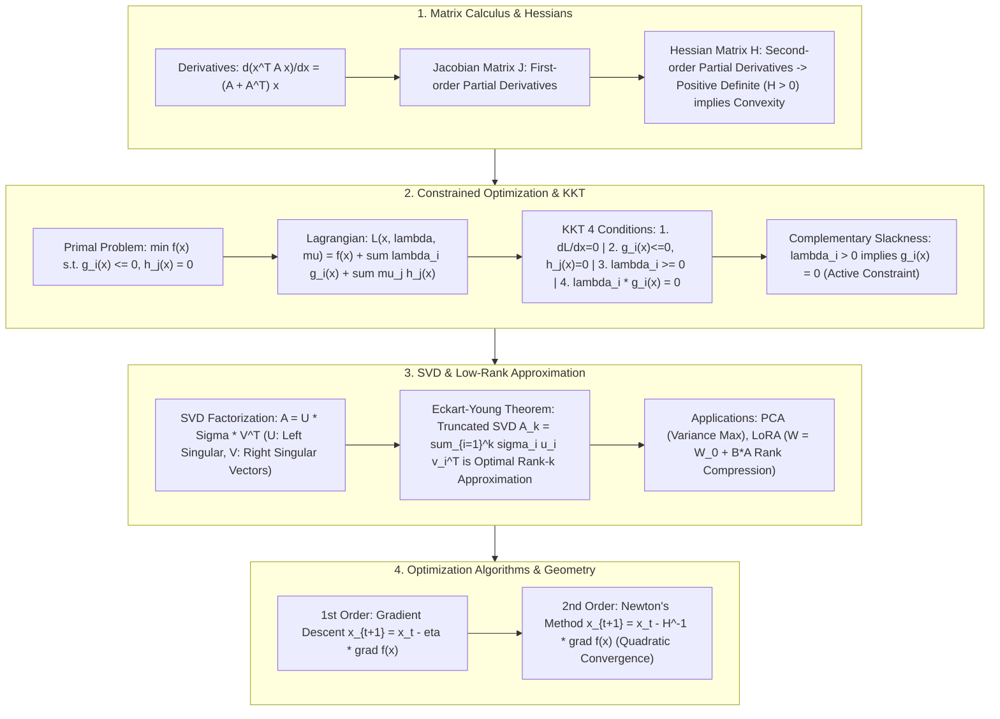

# 🌐 Optimization & Matrix Calculus: Lagrange Multipliers, KKT Conditions, SVD & Convergence Geometry

> **Core Executive Summary**: Every machine learning model—from SVM geometric margin maximization to Transformer gradient descent updates—is fundamentally an **optimization problem**. **Matrix calculus**, **KKT conditions**, and **SVD (Singular Value Decomposition)** form the mathematical bedrocks. This guide derives Lagrange duality, KKT complementary slackness, SVD low-rank approximations, and Hessian quadratic convergence geometry.

---

## 💡 Interactive Mermaid Architecture Flowchart



---

## 💡 Classic Interview Followups & Core Cheatsheet

* **Key Topic 1**: Derive the Lagrangian function $L(x, \lambda, \mu)$ and all 4 KKT conditions for constrained optimization.
  * *Standard Answer*: Lagrangian $L = f(x) + \sum \lambda_i g_i(x) + \sum \mu_j h_j(x)$. KKT 4 conditions: 1. Stationarity ($
abla_x L = 0$), 2. Primal Feasibility ($g_i(x) \le 0, h_j(x) = 0$), 3. Dual Feasibility ($\lambda_i \ge 0$), 4. Complementary Slackness ($\lambda_i g_i(x) = 0$).

> 💡 **Intuition**: KKT extends "unconstrained optimality" to "an arena with walls": the zero-gradient condition becomes "gradient plus the constraints' normal forces sums to zero" (the multiplier $\lambda$ is the magnitude of the wall's reaction force), and complementary slackness says "either the constraint does not touch the wall ($\lambda = 0$), or it is pressed flush against it ($g = 0$)." SVM support vectors are exactly the points flush against the wall.
>
> 🎤 **Interview Quick Answer**: "Bottom line: KKT's four conditions — stationarity, primal feasibility, dual feasibility, complementary slackness — are necessary and sufficient for a global optimum in convex problems. Why: constraints enter the gradient equation through multipliers, and $\lambda_i g_i(x) = 0$ encodes whether a constraint is active. Example: in SVM, support vectors satisfy $g_i(x^*) = 0$ with $\lambda_i > 0$ while all other samples have $\lambda_i = 0$ — the decision boundary depends on a few points only."

* **Key Topic 2**: Derive SVD factorization $A = U \Sigma V^T$ and prove its connection to the eigendecomposition of $A^T A = V \Sigma^2 V^T$.
  * *Standard Answer*: $A^T A = (U \Sigma V^T)^T (U \Sigma V^T) = V \Sigma^T U^T U \Sigma V^T = V \Sigma^2 V^T$. The right singular vectors $V$ are eigenvectors of $A^T A$, and singular values $\sigma_i = \sqrt{\lambda_i}$.

> 💡 **Intuition**: SVD factors any matrix into "rotate × scale × rotate": $A = U\Sigma V^T$ — rotate by $V^T$, stretch along the coordinate axes by $\sigma_i$, rotate back by $U$. The identity $A^T A = V\Sigma^2 V^T$ holds because $A^T A$ is a symmetric positive semidefinite matrix: symmetric matrices are orthogonally diagonalizable, and its eigenvalues are exactly the squared singular values.
>
> 🎤 **Interview Quick Answer**: "Bottom line: any $A \in \mathbb{R}^{m\times n}$ factors as $A = U\Sigma V^T$ with orthogonal $U, V$ and nonnegative diagonal $\Sigma$. Why: $A^T A = V\Sigma^2 V^T$ is an eigendecomposition, so $V$ holds the eigenvectors and $\sigma_i = \sqrt{\lambda_i}$. Example: for a 1000×1000 data matrix, the top 50 singular values often carry 99% of the energy — the rest can be dropped, which is the math behind PCA and compression."

* **Key Topic 3**: Why is Low-Rank Matrix Decomposition optimal under the Eckart-Young Theorem in PCA and LoRA?
  * *Standard Answer*: The Eckart-Young Theorem proves that truncated SVD $A_r = \sum_{i=1}^r \sigma_i u_i v_i^T$ minimizes Frobenius norm error $\|A - B\|_F$ among all rank-$r$ matrices. LoRA leverages this by updating weights via low-rank products $\Delta W = B \cdot A$.

> 💡 **Intuition**: The "information" in real data concentrates in the leading singular values; everything after them is nearly noise, so truncating $A \approx A_r$ only discards noise. LoRA bets that in the high-dimensional space of pretrained weights, the update direction $\Delta W$ has very low effective rank, so two skinny matrices $B\cdot A$ can approximate it — turning 7B trainable parameters into tens of millions.
>
> 🎤 **Interview Quick Answer**: "Bottom line: the Eckart-Young theorem guarantees the truncated SVD is the best rank-$r$ approximation in Frobenius norm. Why: singular values decay, so truncation drops the weakest components. Example: PCA keeps the top $r$ principal components, which is truncated SVD of the covariance; LoRA writes $\Delta W = B\cdot A$ with $r \ll d$, shrinking trainable parameters from 7B to tens of millions (~99% fewer)."

* **Key Topic 4**: Derive matrix calculus rules: prove $\frac{\partial}{\partial X} \text{tr}(A X B) = A^T B^T$ and $\frac{\partial}{\partial x} (x^T A x) = (A + A^T) x$.
  * *Standard Answer*: Differentiating $x^T A x = \sum_i \sum_j A_{ij} x_i x_j$ with respect to $x_k$ gives $\sum_j A_{kj} x_j + \sum_i A_{ik} x_i = (A x)_k + (A^T x)_k$, proving $
abla_x (x^T A x) = (A + A^T) x$.

> 💡 **Intuition**: $x^T A x$ is a "bilinear scoring" of $x$ with itself, so when differentiating with respect to $x_k$, the variable appears once as a left factor and once as a right factor — each contributes one term, giving $(Ax)_k + (A^Tx)_k$; for symmetric $A$ the two merge into $2Ax$. The mental model for matrix calculus: every place an index appears contributes one chain-rule path.
>
> 🎤 **Interview Quick Answer**: "Bottom line: $\frac{\partial}{\partial x}(x^T A x) = (A + A^T)x$, which becomes $2Ax$ when $A$ is symmetric. Why: $x^T A x = \sum_i\sum_j A_{ij}x_i x_j$; differentiating w.r.t. $x_k$ leaves one factor from the $i=k$ term and one from the $j=k$ term. Example: the ridge-regression gradient $\nabla \|y - Xw\|^2 = 2X^T(Xw - y)$ is exactly this quadratic-form rule in disguise."

* **Key Topic 5**: Analyze the relationship between Hessian positive definiteness ($H \succ 0$) and strict convexity.
  * *Standard Answer*: $f(x)$ is strictly convex iff its Hessian $H = 
abla^2 f(x)$ is positive definite ($H \succ 0$). Newton's method uses $x_{t+1} = x_t - H^{-1} 
abla f(x)$ to adjust steps by curvature, achieving quadratic convergence.

> 💡 **Intuition**: Gradient descent knows "which way to go" (direction) but not "how steep the road is" (curvature); Newton's method measures curvature with the Hessian, automatically taking small steps on steep directions and large steps on flat ones — flattening elliptical contours into circles in one step. That is why convergence is quadratic: the error squares each iteration, going from 0.1 to $10^{-10}$ in about ten steps.
>
> 🎤 **Interview Quick Answer**: "Bottom line: Newton's update $\Delta x = -H^{-1}\nabla f(x)$ converges quadratically, far faster than gradient descent's linear rate. Why: minimizing the second-order Taylor expansion makes the step size self-adjust by curvature. Example: on the ill-conditioned quadratic $f = x_1^2 + 100x_2^2$, gradient descent zig-zags for thousands of steps along $x_2$, while Newton converges in 1 — at the price of $O(D^3)$ per-step matrix inversion."

---

## 📚 Section 1: Optimization Algorithms Comparison Matrix

| Algorithm | Order Used | Per-Iteration Complexity | Convergence Rate | Condition Number Robustness |
| :--- | :--- | :--- | :--- | :--- |
| **Gradient Descent** | 1st Order $
abla f$ | $O(D)$ | Linear ($O(1/k)$) | Poor (Oscillates in narrow ravines) |
| **Newton's Method** | 1st $
abla f$ + 2nd $H$ | $O(D^3)$ | **Quadratic ($O(e^{-2^k})$)** | **Excellent (Uses curvature)** |
| **L-BFGS** | Quasi-Newton $H^{-1}$ | $O(m D)$ | **Superlinear** | Excellent (No matrix inversion) |

> 💡 **Intuition**: 📖 How to read this table: read columns 3 and 4 together — per-iteration cost versus convergence speed. Gradient descent is cheap but slow and fragile on ill-conditioned problems; Newton is fast but costs $O(D^3)$ per step; L-BFGS approximates curvature as a middle ground; AdamW is robust enough for deep learning. Core intuition: the more curvature information a step uses, the better each step is — and the more it costs. On learning rates: too small crawls (η = 1e-4 converges ~10× slower than η = 1e-3), too large oscillates across the valley floor or diverges; decay schedules are the standard fix.
>
> 🎤 **Interview Quick Answer**: "Bottom line: convergence speed trades off against per-step cost — GD linear, Newton quadratic, L-BFGS superlinear, AdamW momentum-accelerated linear. Why: higher-order derivative information makes better steps, while ill-conditioning makes first-order methods zig-zag. Example: on a problem with condition number $\kappa = 100$, GD converges ~$\kappa$× slower than the ideal rate; with $\eta = 0.1$ it takes ~1000 steps, with $\eta = 1.0$ it may oscillate forever. L-BFGS approximates $H^{-1}$ in $O(mD)$ memory — the industrial workhorse."

---

## ⚡ Section 2: SVD Factorization Formula

In plain words: the right-hand side views $A$ as a weighted stack of rank-1 "layers" — each $u_i v_i^T$ is one pattern, weighted by $\sigma_i$, ordered by size; the first few layers capture the skeleton of the matrix.

$$A = U \Sigma V^T = \sum_{i=1}^r \sigma_i u_i v_i^T$$

> 💡 **Intuition**: 📖 How to read this formula: the two sides are the same object — the matrix form $U\Sigma V^T$ emphasizes the geometric "rotate-stretch-rotate" picture, the sum form $\sum \sigma_i u_i v_i^T$ emphasizes the spectral "layered stacking" view. The interview point: it is the direct route to low-rank approximation — keep the first $r$ layers, discard the rest as noise, and the error is exactly the sum of the dropped squared singular values.
>
> 🎤 **Interview Quick Answer**: "Bottom line: $A = \sum_{i=1}^r \sigma_i u_i v_i^T$, a weighted sum of rank-1 components. Why: expanding $U\Sigma V^T$ gives $\sum \sigma_i (u_i v_i^T)$ with singular values in decreasing order. Example: for a 128×128 image matrix, the top ~20 singular values usually hold 99% of the energy, so truncation is compression — the essence of SVD image-compression demos."

---

## 🐍 Section 3: Pure Numpy SVD Low-Rank Operator

```python
import numpy as np

def pure_numpy_svd_low_rank(a: np.ndarray, rank_k: int) -> np.ndarray:
    u, s, vt = np.linalg.svd(a, full_matrices=False)
    return np.dot(u[:, :rank_k] * s[:rank_k], vt[:rank_k, :])

if __name__ == "__main__":
    A = np.random.randn(10, 10)
    print("✅ SVD Rank-3 Frobenius Error:", round(np.linalg.norm(A - pure_numpy_svd_low_rank(A, 3)), 4))
```

---

## 🚀 Key Takeaways & Best Practices

1. **Parameter Efficiency**: Use **LoRA low-rank decomposition** for LLM fine-tuning.
2. **Constraint Verification**: Remember **KKT Complementary Slackness $\lambda_i g_i(x) = 0$** in SVM and convex optimization.
3. **Second-Order Convergence**: Prefer **L-BFGS** for medium-scale convex optimization problems.