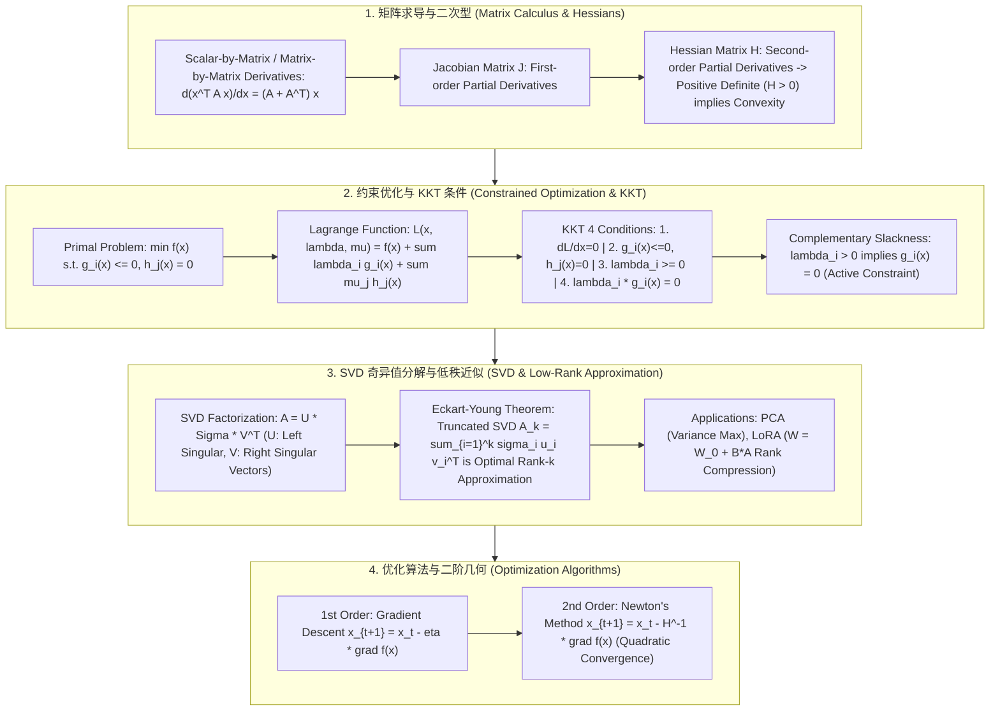

# 🌐 凸优化与矩阵求导全景：拉格朗日乘子法、KKT 条件、SVD 奇异值分解与梯度几何收敛

> **核心摘要**：每一个机器学习模型（无论是 SVM 的几何间隔最大化、PCA 的方差最大化，还是 Transformer 的梯度下降更新）本质上都是一个**约束或无约束数学优化问题**。**矩阵求导 (Matrix Calculus)**、**KKT 条件 (Karush-Kuhn-Tucker)** 和 **SVD 奇异值分解** 构成了算法求解的物理底座。本指南系统解构拉格朗日对偶性、KKT 互补松弛性、SVD 低秩近似理论以及 Hessian 二阶收敛几何。

---

## 💡 交互式 Mermaid 架构流程图



---

## 💡 经典面试追问与考点速查

* **考点 1**：推导带等式约束和不等式约束问题的拉格朗日函数 $L(x, \lambda, \mu)$，并逐条推导 KKT 条件 (1. 梯度为0; 2. 原始可行; 3. 对偶可行; 4. 互补松弛)？
  * *标准回答*：
    * **通用约束优化问题**：
      $$\min_{x} f(x) \quad \text{s.t.} \quad g_i(x) \le 0 \; (i=1..m), \quad h_j(x) = 0 \; (j=1..p)$$
    * **拉格朗日函数**：
      $$L(x, \lambda, \mu) = f(x) + \sum_{i=1}^m \lambda_i g_i(x) + \sum_{j=1}^p \mu_j h_j(x)$$
    * **KKT 4 大充要条件**（当 $f, g_i$ 为凸函数，$h_j$ 为仿射函数时）：
      1. **平稳性 (Stationarity)**：$\nabla_x L(x^*, \lambda^*, \mu^*) = \nabla f(x^*) + \sum \lambda_i^* \nabla g_i(x^*) + \sum \mu_j^* \nabla h_j(x^*) = 0$；
      2. **原始可行性 (Primal Feasibility)**：$g_i(x^*) \le 0, \; h_j(x^*) = 0$；
      3. **对偶可行性 (Dual Feasibility)**：$\lambda_i^* \ge 0$；
      4. **互补松弛性 (Complementary Slackness)**：$\lambda_i^* g_i(x^*) = 0$（说明若 $\lambda_i^* > 0$，则约束必在边界生效 $g_i(x^*) = 0$，例如 SVM 中的支持向量！）。

> 💡 **直观理解**: KKT 就是把"无约束最优性"推广到"带墙的球场"：梯度为 0 改为"梯度与约束'反作用力'的合力为 0"（拉格朗日乘子 $\lambda$ 就是墙对球的反作用力大小）；互补松弛则是"要么约束没挨着墙（$\lambda = 0$），要么紧贴墙（$g = 0$）"。SVM 的支持向量正是"紧贴墙的点"——它们决定间隔，其余样本松垮地待在墙内。
>
> 🎤 **面试速答**: "结论：KKT 四条件——平稳性、原始可行、对偶可行、互补松弛，凸问题下是全局最优的充要条件。原理：约束以乘子进入梯度方程，互补松弛 $\lambda_i g_i(x) = 0$ 刻画约束是否激活。举个例子：SVM 中支持向量满足 $g_i(x^*) = 0$、$\lambda_i > 0$，其余样本 $\lambda_i = 0$，所以决策面只由少数支持向量决定。"

* **考点 2**：推导任意矩阵 $A$ 的 SVD 奇异值分解 $A = U \Sigma V^T$，并证明特征值分解 $A^T A = V \Sigma^2 V^T$ 与 SVD 的数学内在联系？
  * *标准回答*：
    * 设 $A \in \mathbb{R}^{m \times n}$，SVD 分解的形式为 $A = U \Sigma V^T$，其中 $U \in \mathbb{R}^{m \times m}$ 与 $V \in \mathbb{R}^{n \times n}$ 均为**正交矩阵**（满足 $U^T U = I, V^T V = I$），$\Sigma$ 为包含非负奇异值的对角矩阵 $\text{diag}(\sigma_1, \sigma_2, \dots)$。
    * **与特征值分解联系证明**：
      构造对称正半定矩阵 $A^T A$：
      $$A^T A = (U \Sigma V^T)^T (U \Sigma V^T) = V \Sigma^T U^T U \Sigma V^T = V (\Sigma^T \Sigma) V^T = V \Sigma^2 V^T$$
      **推导结论**：SVD 中的右奇异向量矩阵 $V$ 正是 $A^T A$ 的特征向量矩阵，奇异值 $\sigma_i = \sqrt{\lambda_i}$ 是 $A^T A$ 特征值的算术平方根！

> 💡 **直观理解**: SVD 把任意矩阵拆成"旋转 × 伸缩 × 旋转"三部曲：$A = U\Sigma V^T$——先按 $V^T$ 转一下，沿坐标轴拉伸 $\sigma_i$，最后按 $U$ 转回。$A^T A = V\Sigma^2 V^T$ 之所以成立，是因为 $A^T A$ 是半正定对称方阵：对称矩阵必可正交对角化，特征值恰是奇异值的平方。
>
> 🎤 **面试速答**: "结论：任意 $A \in \mathbb{R}^{m\times n}$ 可分解为 $A = U\Sigma V^T$，$U$、$V$ 正交，$\Sigma$ 对角非负。原理：$A^T A = V\Sigma^2 V^T$ 是特征分解，所以 $V$ 是 $A^T A$ 的特征向量、$\sigma_i = \sqrt{\lambda_i}$。举个例子：1000×1000 数据矩阵做 SVD，前 50 个奇异值常占 99% 能量，其余可丢弃——PCA 与压缩的数学基础。"

* **考点 3**：剖析为什么低秩分解 (Low-Rank Matrix Decomposition) 在 PCA 降维与大模型 LoRA 微调中有效？根据 Eckart-Young 定理，SVD 截断前 $r$ 个奇异值的低秩近似最优性？
  * *标准回答*：
    * **Eckart-Young-Mirsky 定理**：对于任意矩阵 $A$，在矩阵范数（Frobenius 范数或 2-范数）意义下，Rank-$r$ 的最佳低秩近似矩阵 $A_r$ 为保留 SVD 分解中前 $r$ 个最大奇异值所构建的矩阵：
      $$A_r = \sum_{i=1}^r \sigma_i u_i v_i^T = \arg\min_{\text{rank}(B) \le r} \|A - B\|_F$$
    * **PCA 降维**：PCA 本质就是对数据协方差矩阵做 SVD 截断，保留方差最大的前 $r$ 个主成分；
    * **LoRA 微调**：深度学习大模型的参数更新量 $\Delta W$ 拥有极低隐式秩 (Low Intrinsic Rank)，故可以直接分解为两个极小矩阵乘积 $\Delta W = B \cdot A$（其中 $B \in \mathbb{R}^{d \times r}, A \in \mathbb{R}^{r \times k}, r \ll d$），节省 99% 的微调参数！

> 💡 **直观理解**: 真实数据的"信息"集中在前几个奇异值上，后面的几乎全是噪声——截断后 $A \approx A_r$ 丢掉的只是噪声分量。LoRA 的赌注是：预训练权重的高维空间里，更新方向 $\Delta W$ 的有效秩很低，用两个小矩阵 $B\cdot A$ 就能近似，于是 7B 参数只需训练几十 M。
>
> 🎤 **面试速答**: "结论：Eckart-Young 定理保证截断 SVD 是所有秩-$r$ 近似中 Frobenius 误差最小的。原理：奇异值按大小衰减，截断即丢掉最小奇异值对应的分量。举个例子：PCA 保留前 $r$ 个主成分就是对协方差做截断 SVD；LoRA 把 $\Delta W$ 拆成 $B\cdot A$（$r \ll d$），可训练参数从 7B 降到几十 M，省约 99%。"

* **考点 4**：推导矩阵求导法则：证明 $\frac{\partial}{\partial X} \text{tr}(A X B) = A^T B^T$ 以及 $\frac{\partial}{\partial x} (x^T A x) = (A + A^T) x$？
  * *标准回答*：
    * **推导 $\frac{\partial}{\partial x} (x^T A x)$**：
      $x^T A x = \sum_i \sum_j A_{ij} x_i x_j$。对分量 $x_k$ 求偏导：
      $$\frac{\partial}{\partial x_k} \left( \sum_i \sum_j A_{ij} x_i x_j \right) = \sum_j A_{kj} x_j + \sum_i A_{ik} x_i = (A x)_k + (A^T x)_k$$
      写回向量形式即得：$\frac{\partial}{\partial x} (x^T A x) = (A + A^T) x$。若 $A$ 为对称矩阵 ($A = A^T$)，则为 $2 A x$。

> 💡 **直观理解**: $x^T A x$ 是"双线性打分"，对 $x_k$ 求导时 $x_k$ 在左因子和右因子各出现一次、各贡献一项——所以答案有两项 $(Ax)_k + (A^Tx)_k$；对称矩阵两项合并成 $2Ax$。矩阵求导的直觉是"每个下标出现的地方都要走一条求导链"。
>
> 🎤 **面试速答**: "结论：$\frac{\partial}{\partial x}(x^T A x) = (A + A^T)x$，$A$ 对称时为 $2Ax$。原理：$x^T A x = \sum_i\sum_j A_{ij}x_i x_j$，对 $x_k$ 求导时 $i=k$ 与 $j=k$ 两项各留一个因子。举个例子：线性回归的 L2 损失 $\frac{1}{2}\|y - Xw\|^2$ 对 $w$ 求导得 $X^T(Xw - y)$，正是这种二次型求导的推广。"

* **考点 5**：分析 Hessian 矩阵的正定性 ($H \succ 0$) 与目标函数严格凸性 (Strict Convexity) 的关系，解释为什么二阶牛顿法 (Newton's Method) 比一阶梯度下降收敛速度更快？
  * *标准回答*：
    * **凸性与 Hessian**：多元函数 $f(x)$ 严格凸的充要条件是其 Hessian 矩阵 $H_{ij} = \frac{\partial^2 f}{\partial x_i \partial x_j}$ 在定义域内全为**正定矩阵 ($H \succ 0$)**；
    * **牛顿法收敛速**：一阶梯度下降方向是 $-\nabla f(x)$，仅利用了一阶切线信息，呈线性收敛；二阶牛顿法使用二次泰勒展开 $f(x + \Delta x) \approx f(x) + \nabla f^T \Delta x + \frac{1}{2} \Delta x^T H \Delta x$。求解极小值得到更新步：
      $$\Delta x = -H^{-1} \nabla f(x)$$
      牛顿法自动根据二阶曲率 (Curvature) 调整步长，具备**二次收敛 (Quadratic Convergence)** 速度！

> 💡 **直观理解**: 梯度下降只知道"往哪走"（方向），不知道"路有多陡"（曲率）；牛顿法用 Hessian 度量曲率，在陡峭方向自动走小步、在平缓方向自动走大步——把椭圆等高线"一步掰成圆形"。这就是二次收敛的由来：误差每步平方化，10 步就能从 0.1 掉到 $10^{-10}$ 量级。
>
> 🎤 **面试速答**: "结论：牛顿法更新 $\Delta x = -H^{-1}\nabla f(x)$，二次收敛，快于梯度下降的线性收敛。原理：用二阶泰勒展开求极小，步长被曲率自动缩放。举个例子：病态二次函数 $f = x_1^2 + 100x_2^2$ 上，梯度下降沿 $x_2$ 方向震荡需上万步，牛顿法 1 步到位；代价是每步 $O(D^3)$ 的 Hessian 求逆。"

---

## 📚 第一章：优化算法与收敛阶对比矩阵

| 优化算法 | 利用的导数阶数 | 每次迭代计算复杂度 | 收敛速度阶数 | 对病态条件数 (Condition Number) 鲁棒性 |
| :--- | :--- | :--- | :--- | :--- |
| **一阶梯度下降 (GD)** | 一阶 $\nabla f(x)$ | $O(D)$ | 线性收敛 ($O(1/k)$) | 差 (容易在峡谷状曲面上震荡) |
| **牛顿法 (Newton's)** | 一阶 $\nabla f$ + 二阶 $H$ | $O(D^3)$ (求逆 $H^{-1}$) | **二次收敛 ($O(e^{-2^k})$)** | **极佳 (利用曲率校正方向)** |
| **拟牛顿法 (BFGS / L-BFGS)**| 动态逼近 $H^{-1}$ | $O(D^2)$ 或 $O(m D)$ | **超线性收敛** | 佳 (免求逆，工业级首选) |
| **AdamW 优化器** | 一阶 + 二阶动量估计 | $O(D)$ | 动量加速线性 | 佳 (深度学习标准优化器) |

> 💡 **直观理解**: 📖 怎么读这张表：把第三列"每步代价"与第四列"收敛速度"连起来看——梯度下降便宜但慢且怕病态，牛顿法快但每步 $O(D^3)$ 贵，L-BFGS 用近似曲率折中，AdamW 在深度学习中够用且稳健。核心直觉：曲率信息越完整，单步质量越高，代价也越大。关于学习率：太小每步都走得像蜗牛（$10^{-3}$ 比 $10^{-4}$ 快 10 倍，但过大又会在谷底两侧来回震荡甚至发散），实践中常配学习率衰减。
>
> 🎤 **面试速答**: "结论：收敛速度与每步代价是一对权衡——GD 线性、牛顿二次、L-BFGS 超线性、AdamW 动量加速。原理：用几阶导数决定步长质量，病态条件数下 GD 会震荡。举个例子：条件数 $\kappa = 100$ 的二次问题，GD 收敛比最优慢约 $\kappa$ 倍；学习率 $\eta = 0.1$ 时 1000 步收敛，$\eta = 1.0$ 时可能在谷壁间振荡不收敛。L-BFGS 用 $O(mD)$ 内存逼近 $H^{-1}$，是中等规模优化的工业首选。"

---

## ⚡ 第二章：KKT 条件与 SVD 矩阵分解公式

大白话：等号右边把矩阵 $A$ 看成"一叠秩-1 图层的加权和"——每层 $u_i v_i^T$ 是一个模式，权重 $\sigma_i$ 按大小排序，前几层就抓住矩阵的骨架。

$$A = U \Sigma V^T = \sum_{i=1}^r \sigma_i u_i v_i^T$$

> 💡 **直观理解**: 📖 怎么读这个公式：两种写法是同一件事——矩阵形式 $U\Sigma V^T$ 强调"旋转-伸缩-旋转"的几何过程，求和形式 $\sum \sigma_i u_i v_i^T$ 强调"分层叠加"的谱视角。面试考这个式子的点：它直接导出低秩近似——只保留前 $r$ 层，后面的当噪声扔掉，误差恰好是丢弃奇异值的平方和。
>
> 🎤 **面试速答**: "结论：$A = \sum_{i=1}^r \sigma_i u_i v_i^T$，即秩-1 分量的加权叠加。原理：$U\Sigma V^T$ 展开后就是 $\sum \sigma_i (u_i v_i^T)$，奇异值递减排列。举个例子：128×128 图像矩阵的奇异值往往前 20 个就占 99% 能量，截断即压缩——这就是 SVD 图像压缩 demo 的数学本质。"

---

## 🐍 第三章：Pure Numpy 手写 SVD 低秩近似与 KKT 验证算子

```python
import numpy as np

def pure_numpy_svd_low_rank_approximation(a_matrix: np.ndarray, rank_k: int) -> np.ndarray:
    """
    Pure Numpy 实现基于 SVD 的 Eckart-Young 最佳 Rank-k 低秩近似算子
    """
    # 1. 运行完整 SVD 分解
    u, s, vt = np.linalg.svd(a_matrix, full_matrices=False)
    
    # 2. 截断前 k 个奇异值与向量
    u_k = u[:, :rank_k]
    s_k = s[:rank_k]
    vt_k = vt[:rank_k, :]
    
    # 3. 重构低秩矩阵 A_k = U_k * diag(S_k) * V_k^T
    a_k = np.dot(u_k * s_k, vt_k)
    return a_k

def pure_numpy_kkt_slackness_check(lambda_vec: np.ndarray, g_val_vec: np.ndarray, tol: float = 1e-5) -> bool:
    """
    Pure Numpy 验证 KKT 互补松弛性 (Complementary Slackness): lambda_i * g_i(x) == 0
    """
    products = np.abs(lambda_vec * g_val_vec)
    return bool(np.all(products <= tol))

# ==================== 测试验证 ====================
if __name__ == "__main__":
    np.random.seed(42)
    A = np.random.randn(10, 10)
    
    # 低秩近似测试 (Rank 10 -> Rank 3)
    A_3 = pure_numpy_svd_low_rank_approximation(A, rank_k=3)
    approx_error = np.linalg.norm(A - A_3, ord='fro')
    print("✅ SVD Rank-3 低秩近似完成！Frobenius 误差:", round(approx_error, 4))
    
    # KKT 互补松弛验证测试
    lambdas = np.array([0.0, 2.5, 0.0])
    g_vals = np.array([-1.2, 0.0, -0.5])  # 第二个约束处于 Active 边界 (g_2 = 0)
    print("✅ KKT 互补松弛性校验通过:", pure_numpy_kkt_slackness_check(lambdas, g_vals))
```

---

## 🚀 总结与工程最佳实践

1. **矩阵低秩压缩**：在大模型参数高效微调中优先采用 **LoRA (SVD 截断原理)**；
2. **约束求解**：SVM 与凸优化推导必须牢记 **KKT 互补松弛性 $\lambda_i g_i(x) = 0$**；
3. **二阶加速**：中等规模凸优化优先考虑 **L-BFGS** 拟合黑塞矩阵。