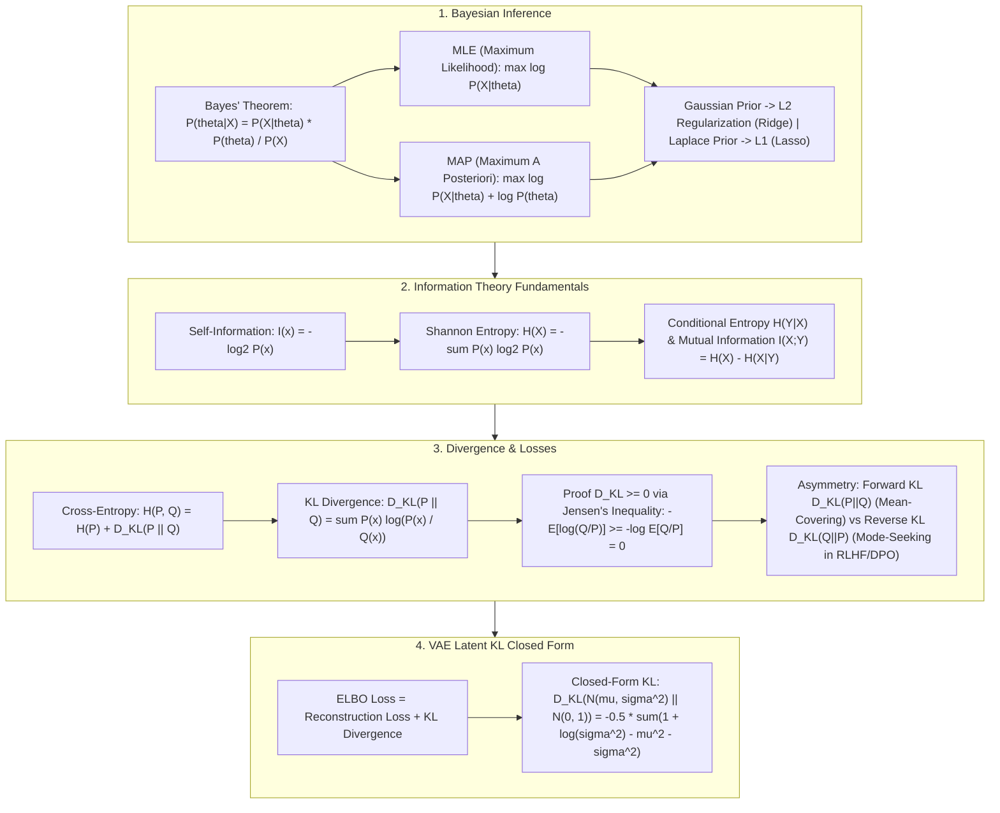

# 🌐 AI Math Foundations: Bayes Inference, Shannon Entropy, Cross-Entropy & KL Divergence

> **Core Executive Summary**: Probability theory and information theory form the mathematical backbone of artificial intelligence. From **Bayesian Inference** parameter estimation to **Shannon Entropy** and deep learning loss foundations—**Cross-Entropy** and **KL Divergence**—mathematical rigour dictates model optimization. This guide derives MLE vs MAP equivalences, KL divergence non-negativity proofs, Softmax cross-entropy gradients, and VAE closed-form KL lower bounds.

---

## 💡 Interactive Mermaid Architecture Flowchart



---

## 💡 Classic Interview Followups & Core Cheatsheet

* **Key Topic 1**: Derive Bayes' Theorem and explain mathematical equivalence of MAP with Gaussian prior (L2) vs Laplace prior (L1).
  * *Standard Answer*: MAP objective $\hat{	heta}_{\text{MAP}} = arg\max_{	heta} [\ln P(X \mid 	heta) + \ln P(	heta)]$. Gaussian prior $\ln P(	heta) = -\frac{	heta^2}{2\sigma^2}$ yields L2 Ridge regularization. Laplace prior $\ln P(	heta) = -\frac{|	heta|}{b}$ yields L1 Lasso regularization.

> 💡 **Intuition**: A prior encodes where you believe θ "should" be. A Gaussian prior gently pulls θ toward 0 with a squared penalty (smooth, everywhere differentiable), while a Laplace prior drives many entries exactly to 0 (absolute penalty, sparse). So MLE + Gaussian prior = L2 (Ridge), MLE + Laplace prior = L1 (Lasso) — MAP is simply "data decides, prior keeps it sane."
>
> 🎤 **Interview Answer**: "Takeaway: a Gaussian prior is equivalent to L2 regularization; a Laplace prior to L1. Why: taking logs, the Gaussian prior term is -θ²/2σ² (a squared penalty) and the Laplace term is -|θ|/b (an absolute penalty), so the MAP objective becomes MLE + regularizer. Example: Gaussian prior → Ridge; Laplace prior → Lasso, which yields sparse solutions."

* **Key Topic 2**: Use Jensen's Inequality to prove KL Divergence $D_{\text{KL}}(P \parallel Q) \ge 0$ and explain its asymmetry.
  * *Standard Answer*: $D_{\text{KL}}(P \parallel Q) = -\mathbb{E}_{P} [\ln(Q/P)] \ge -\ln \mathbb{E}_{P}[Q/P] = -\ln(1) = 0$. Forward KL $D_{\text{KL}}(P \parallel Q)$ forces mean-covering. Reverse KL $D_{\text{KL}}(Q \parallel P)$ forces mode-seeking (used in RLHF and DPO).

> 💡 **Intuition**: KL measures the extra "coding cost" of approximating P with Q, so it can never be negative — you can't encode data more cheaply with the wrong distribution. The asymmetry comes from which distribution does the weighting: Forward KL weights by P, so Q must be nonzero wherever P is (mean-covering); Reverse KL weights by Q, so Q happily concentrates on a single peak of P (mode-seeking).
>
> 🎤 **Interview Answer**: "Takeaway: D_KL(P||Q) ≥ 0, equality iff P = Q, and D_KL(P||Q) ≠ D_KL(Q||P). Why: write KL as -E_P[ln(Q/P)] and apply Jensen's inequality to the convex function -ln: -E[ln(Q/P)] ≥ -ln E[Q/P] = -ln 1 = 0. Example: P=[0.5,0.5], Q=[0.9,0.1] gives D_KL(P||Q) ≈ 0.51 but D_KL(Q||P) ≈ 0.37 — the same pair, different numbers."

* **Key Topic 3**: Derive the gradient of Cross-Entropy Loss combined with Softmax: $\frac{\partial L}{\partial z_i} = p_i - y_i$.
  * *Standard Answer*: Differentiating $L = -\sum y_k \ln p_k$ with respect to logit $z_i$ gives $\frac{\partial L}{\partial z_i} = p_i - y_i$, representing the residual error between predicted probability $p_i$ and ground truth label $y_i$.

> 💡 **Intuition**: The magic of Softmax + cross-entropy is that the log cancels Softmax's exponentials, leaving a clean "prediction minus label" residual — like a spring whose restoring force grows with how far off you are, and never saturates.
>
> 🎤 **Interview Answer**: "Takeaway: ∂L/∂z_i = p_i - y_i. Why: the chain rule plus Σ y_k = 1; the ln of cross-entropy cancels the exp of Softmax. Example: with label y = [0,0,1] and prediction p₃ = 0.7, ∂L/∂z₃ = -0.3, pushing logit 3 upward — the more wrong you are, the larger the gradient."

* **Key Topic 4**: Define Mutual Information $I(X;Y)$ and derive its relationship with Joint Entropy $H(X,Y)$ and Marginal Entropy $H(X)$.
  * *Standard Answer*: $I(X;Y) = H(X) - H(X \mid Y) = H(X) + H(Y) - H(X, Y)$. Measures information gained about $X$ by observing $Y$.

> 💡 **Intuition**: Mutual information answers "how much of X's uncertainty disappears once we know Y?" If X and Y are independent, P(x,y) = P(x)P(y), the log-ratio is 0 everywhere and I = 0; the more dependent they are, the further the average deviates from 0. Contrastive learning maximizes this between two augmented views of the same image and minimizes it across different images.
>
> 🎤 **Interview Answer**: "Takeaway: I(X;Y) = H(X) - H(X|Y) = H(X) + H(Y) - H(X,Y). Why: it averages ln(P(x,y)/P(x)P(y)) — the deviation from independence. Example: a die X and its exact copy Y=X give I = H(X) ≈ 2.58 bits; an independent re-roll gives I = 0 bits."

* **Key Topic 5**: Derive closed-form KL divergence between Gaussian $\mathcal{N}(\mu, \sigma^2)$ and standard Normal $\mathcal{N}(0, I)$ in VAEs.
  * *Standard Answer*: $D_{\text{KL}}(\mathcal{N}(\mu, \sigma^2) \parallel \mathcal{N}(0, 1)) = -\frac{1}{2} (1 + \ln(\sigma^2) - \mu^2 - \sigma^2)$.

> 💡 **Intuition**: The closed form compresses "how far apart are two Gaussians" into three differentiable terms: ln σ² (pull variance toward 1), μ² (pull mean toward 0), and σ² itself (prevent variance collapse). Each term keeps the encoder honest so the latent space stays near the standard normal.
>
> 🎤 **Interview Answer**: "Takeaway: the closed-form KL for N(μ,σ²) vs N(0,1) is -½(1 + ln σ² - μ² - σ²). Why: substitute both Gaussian densities into the KL integral; the logs split the terms and each integrates to an algebraic expression. Example: μ=0.5, σ=1.2 gives KL = -0.5·(1 + ln 1.44 - 0.25 - 1.44) ≈ 0.098 — closer to 0 means closer to the standard normal."

---

## 📚 Section 1: Information Metrics Comparison Matrix

| Metric | Formula | Range | Symmetry | Target Use Case |
| :--- | :--- | :--- | :--- | :--- |
| **Shannon Entropy H(X)** | $-\sum P(x) \log P(x)$ | $[0, \log K]$ | N/A | System Average Uncertainty |
| **Cross-Entropy H(P, Q)** | $-\sum P(x) \log Q(x)$ | $[H(P), +\infty)$| Asymmetric | Deep Learning Classification Loss |
| **KL Divergence D_KL(P||Q)**| $\sum P(x) \log \frac{P(x)}{Q(x)}$| $[0, +\infty)$ | **Asymmetric** | VAE Latent & DPO Penalty |
| **JS Divergence D_JS(P||Q)**| $\frac{1}{2} D_{KL}(P||M) + \frac{1}{2} D_{KL}(Q||M)$| $[0, \ln 2]$ | **Symmetric** | Original GAN Loss Optimization |

---

📖 **How to read this table**: focus on the "Range" and "Symmetry" columns — entropy depends only on its own distribution (symmetry N/A); cross-entropy and KL are asymmetric; JS is symmetric and bounded in [0, ln 2] via the midpoint distribution M = (P+Q)/2, which is why early GANs used it — it stays non-degenerate even when two distributions don't overlap.

> 💡 **Intuition**: These four are different accounting systems for the same thing: entropy H(X) is the shortest average code length for X itself; cross-entropy H(P,Q) is the average code length when the truth is P but you code with Q's codebook — always ≥ H(P), and the excess is exactly D_KL(P||Q).
>
> 🎤 **Interview Answer**: "Takeaway: H(P,Q) = H(P) + D_KL(P||Q), so cross-entropy is never below entropy. Why: cross-entropy is the cost of coding true distribution P with the wrong codebook Q; KL is the extra cost, zero iff P = Q. Example: P=[0.5,0.5] (H = 1 bit) vs Q=[0.9,0.1] gives H(P,Q) ≈ 1.74 bits, so KL ≈ 0.74 bits."

## ⚡ Section 2: Gibbs' Inequality Formula

> In plain words: approximating P with Q costs extra "coding cost" per event — never negative, and exactly zero only when Q = P everywhere.

$$D_{\text{KL}}(P \parallel Q) = \sum_{x \in \mathcal{X}} P(x) \ln \left( \frac{P(x)}{Q(x)} 
ight) \ge 0$$

> 💡 **Intuition**: Each term P(x) ln(P(x)/Q(x)) is a log-ratio weighted by the true probability P; the log is concave and touches zero at ratio 1, so the sum bottoms out at 0 when Q = P and penalizes deviations more the further they stray. It's not a distance — distances are symmetric; KL is a one-directional cost.
>
> 🎤 **Interview Answer**: "Takeaway: KL ≥ 0, with equality if and only if P = Q. Why: Jensen's inequality pulls the weighted average inside the concave function ln, then Σ Q(x) = 1 collapses it to -ln 1 = 0; asymmetry because the weighting distribution differs. Example: P=[0.5,0.5], Q=[0.9,0.1] gives D_KL(P||Q) ≈ 0.51 vs D_KL(Q||P) ≈ 0.37."

---

## 🐍 Section 3: Pure Numpy KL Divergence Operator

This code translates the formulas above straight into Numpy: KL is an elementwise `P * log(P/Q)` summed up; cross-entropy is `-P * log(Q)` averaged. The `np.clip(..., eps, ...)` guard is the numerical-stability trick that keeps `log(0)` from producing `-inf`.

```python
import numpy as np

def pure_numpy_kl_divergence(p: np.ndarray, q: np.ndarray, eps: float = 1e-12) -> float:
    p_c, q_c = np.clip(p, eps, 1.0), np.clip(q, eps, 1.0)
    return float(np.sum(p_c * np.log(p_c / q_c)))

if __name__ == "__main__":
    p = np.array([0.5, 0.4, 0.1])
    q = np.array([0.4, 0.4, 0.2])
    print("✅ KL Divergence D_KL(P || Q):", round(pure_numpy_kl_divergence(p, q), 5))
```

> 💡 **Intuition**: The code mirrors the math one-to-one: KL is just a weighted average of log-ratios, cross-entropy is a negative mean log-likelihood. The only difference — in KL both the numerator and denominator are distributions; in cross-entropy only the distribution inside the log is the prediction, the one outside is the weight.
>
> 🎤 **Interview Answer**: "Takeaway: a three-line KL — clip to avoid log(0), then sum(P * log(P/Q)). Why: probability arrays make the formula sum directly Numpy elementwise ops; the eps clip guarantees numerical stability. Example: p=[0.5,0.4,0.1], q=[0.4,0.4,0.2] gives KL ≈ 0.0423 — the closer q is to p, the closer to 0."

---

## 🚀 Key Takeaways & Best Practices

1. **Loss Selection**: Default to **Cross-Entropy** for neural network classification to prevent vanishing gradients.
2. **Distribution Regularization**: Use **Reverse KL** in RLHF/DPO to prevent mode collapse.
3. **Numerical Stability**: Add $\epsilon = 10^{-12}$ inside $\log$ functions to avoid `NaN` division.

> 💡 **Intuition**: One thread runs through the whole guide: information theory quantifies uncertainty and distribution mismatch in bits — every training, alignment, and generation objective reduces to additions and subtractions of entropy, cross-entropy, and KL.
>
> 🎤 **Interview Answer**: "Takeaway: say three things and you're set — KL ≥ 0 and asymmetric, cross-entropy = entropy + KL, and the Softmax cross-entropy gradient is p - y. Why: logs turn products into sums, which is the root of every simplification. Example: classification → cross-entropy; distribution alignment (VAE/RLHF) → KL; generative metric reporting → JS or FID."