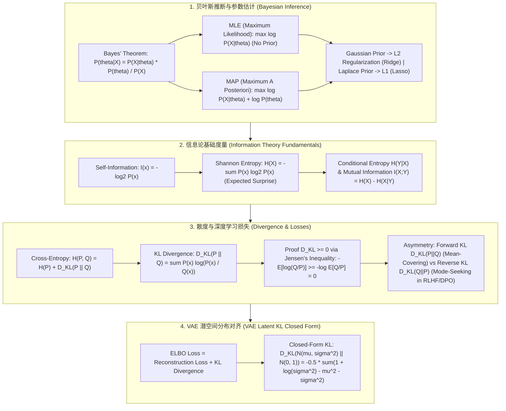

# 🌐 AI 数理基础全景：贝叶斯推断、香农信息熵、交叉熵与 KL 散度非对称证明

> **核心摘要**：概率论与信息论是整个人工智能、机器学习以及深度学习的核心数学支撑。从概率分布的**贝叶斯推断 (Bayesian Inference)** 到量化信息不确定性的**香农信息熵 (Entropy)**，再到深度学习损失函数的基石——**交叉熵 (Cross-Entropy)** 与 **KL 散度 (Kullback-Leibler Divergence)**，数理逻辑构成了算法优化的底座。本指南系统推导 MLE 与 MAP 数学关系、KL 散度非对称性证明、Softmax 交叉熵梯度求导以及 VAE 潜空间 KL 散度闭式解。

---

## 💡 交互式 Mermaid 架构流程图



---

## 💡 经典面试追问与考点速查

* **考点 1**：推导贝叶斯定理，并解释极大似然估计 (MLE) 与极大后验估计 (MAP) 在加入高斯先验 (L2 正则) 和拉普拉斯先验 (L1 正则) 时的数学等价性？
  * *标准回答*：
    * **贝叶斯定理**：$P(\theta \mid X) = \frac{P(X \mid \theta) P(\theta)}{P(X)}$；
    * **MAP 目标函数**：
      $$\hat{\theta}_{\text{MAP}} = \arg\max_{\theta} \left[ \ln P(X \mid \theta) + \ln P(\theta) \right]$$
    * **高斯先验等价性**：假设先验服从高斯分布 $P(\theta) \sim \mathcal{N}(0, \sigma^2)$，其对数先验项为 $\ln P(\theta) = -\frac{\theta^2}{2\sigma^2} + \text{const}$。代入 MAP 后即为 **MLE 似然项 + L2 正则项 (Ridge)**；
    * **拉普拉斯先验等价性**：假设先验服从拉普拉斯分布 $P(\theta) \propto \exp\left(-\frac{|\theta|}{b}\right)$，其对数先验项为 $-\frac{|\theta|}{b}$。代入 MAP 后即为 **MLE 似然项 + L1 正则项 (Lasso)**！

> 💡 **直观理解**: 先验就是"参数本来应该在的位置"的信念。高斯先验把 $\theta$ 温和地往 0 拉(平方惩罚,处处可导、惩罚平滑),拉普拉斯先验则把很多 $\theta$ 精确压到 0(绝对值惩罚,产生稀疏解)——所以 MLE + 高斯先验 = L2 (Ridge),MLE + 拉普拉斯先验 = L1 (Lasso)。MAP 不过是"数据说了算 + 常识兜底"的权衡。
>
> 🎤 **面试速答**: "结论:高斯先验等价于 L2 正则,拉普拉斯先验等价于 L1 正则。原理:对先验取对数,高斯 $\ln P(\theta) = -\frac{\theta^2}{2\sigma^2} + C$ 就是平方惩罚项,拉普拉斯 $\ln P(\theta) = -\frac{|\theta|}{b}$ 就是绝对值惩罚项,代入 MAP 目标即得 MLE + 正则项。例子:高斯先验对应岭回归,拉普拉斯先验对应 Lasso,能产生稀疏解。"

* **考点 2**：使用 Jensen 不等式 ($\mathbb{E}[f(x)] \ge f(\mathbb{E}[x])$，其中 $f$ 为凸函数) 严密证明 KL 散度 $D_{\text{KL}}(P \parallel Q) \ge 0$，并解释 $D_{\text{KL}}(P \parallel Q) \neq D_{\text{KL}}(Q \parallel P)$ 的非对称物理含义？
  * *标准回答*：
    * **证明**：
      $$D_{\text{KL}}(P \parallel Q) = \sum_x P(x) \ln \frac{P(x)}{Q(x)} = -\sum_x P(x) \ln \frac{Q(x)}{P(x)} = -\mathbb{E}_{x \sim P} \left[ \ln \frac{Q(x)}{P(x)} \right]$$
      由于 $-\ln(t)$ 是**严格凸函数**，根据 Jensen 不等式，有 $-\mathbb{E}[Z] \ge -\ln(\mathbb{E}[Z])$：
      $$D_{\text{KL}}(P \parallel Q) \ge -\ln \mathbb{E}_{x \sim P} \left[ \frac{Q(x)}{P(x)} \right] = -\ln \sum_x P(x) \frac{Q(x)}{P(x)} = -\ln \sum_x Q(x) = -\ln(1) = 0$$
      **证毕！仅当 $P(x) = Q(x)$ 时等号成立。**
    * **非对称物理含义**：
      * **Forward KL $D_{\text{KL}}(P \parallel Q)$ (Mean-Covering)**：当 $P(x) > 0$ 时如果 $Q(x) \to 0$，代价极大。强制 $Q$ 覆盖 $P$ 的所有峰值 (均值覆盖)；
      * **Reverse KL $D_{\text{KL}}(Q \parallel P)$ (Mode-Seeking)**：在 RLHF / DPO 与变分推断中使用。强制 $Q$ 锁定在 $P$ 的单个最高峰值 (模式寻优)，避免生成模糊输出！

> 💡 **直观理解**: KL 散度 = 用 Q 近似 P 时多付的"编码成本"。Jensen 不等式保证它非负,直觉是"用错误分布 Q 编码数据,平均码长只会更长,不可能更短"。非对称来自加权分布是谁:Forward KL 按 P 加权,所以 Q 在 P 有概率的地方都不能为 0(均值覆盖,宁模糊不遗漏);Reverse KL 按 Q 加权,所以 Q 干脆缩到 P 的最高峰(模式寻优,RLHF 里防止模型输出含糊的混合)。
>
> 🎤 **面试速答**: "结论:$D_{KL}(P \parallel Q) \ge 0$,且一般不等于 $D_{KL}(Q \parallel P)$。原理:把 $D_{KL}$ 写成 $-\mathbb{E}_P[\ln(Q/P)]$,Jensen 不等式($-\ln$ 凸)得 $-\mathbb{E}\ln(Q/P) \ge -\ln \mathbb{E}(Q/P) = -\ln 1 = 0$;加权平均用的是 P 还是 Q 决定两者不同。例子:P=[0.5,0.5]、Q=[0.9,0.1] 时 $D_{KL}(P \parallel Q) \approx 0.51$ 而 $D_{KL}(Q \parallel P) \approx 0.37$,同一对分布两个方向数值不同。"

* **考点 3**：详细推导分类任务中 Cross-Entropy Loss (交叉熵损失) 与 Softmax 函数结合时的梯度偏导公式 $\frac{\partial L}{\partial z_i} = p_i - y_i$？
  * *标准回答*：
    * 设 logits 为 $z_k$，Softmax 输出为 $p_i = \frac{e^{z_i}}{\sum_j e^{z_j}}$，交叉熵损失为 $L = -\sum_k y_k \ln p_k$；
    * 当 $i = k$ 时，$\frac{\partial p_k}{\partial z_i} = p_i(1 - p_i)$；当 $i \neq k$ 时，$\frac{\partial p_k}{\partial z_i} = -p_k p_i$；
    * 利用链式法则：
      $$\frac{\partial L}{\partial z_i} = -\sum_k \frac{y_k}{p_k} \frac{\partial p_k}{\partial z_i} = -\frac{y_i}{p_i} p_i(1 - p_i) - \sum_{k \neq i} \frac{y_k}{p_k} (-p_k p_i) = -y_i(1 - p_i) + p_i \sum_{k \neq i} y_k$$
      由于单标签分类中 $\sum_k y_k = 1$，即 $\sum_{k \neq i} y_k = 1 - y_i$：
      $$\frac{\partial L}{\partial z_i} = -y_i + y_i p_i + p_i(1 - y_i) = p_i - y_i$$
      **结论：预测概率 $p_i$ 与真实标签 $y_i$ 的残差！数学形式极其优美，不会发生梯度饱和崩溃。**

> 💡 **直观理解**: Softmax + 交叉熵的魔法在于:对数把除法变减法、与 Softmax 的指数"抵消",梯度恰好等于"预测 − 真实"。模型预测越偏,梯度越大;预测对了梯度趋近 0——像弹簧,拉开越远回弹力越大,永远不会饱和。
>
> 🎤 **面试速答**: "结论:Softmax 交叉熵损失的梯度是 $\frac{\partial L}{\partial z_i} = p_i - y_i$,即预测概率与真实标签的残差。原理:链式法则加 $\sum_k y_k = 1$,交叉熵的 $\ln$ 与 Softmax 的 $\exp$ 相互抵消,留下干净的残差,梯度随误差自动缩放、无饱和。例子:真实标签 $y=[0,0,1]$,若模型预测 $p_3 = 0.7$,则 $\frac{\partial L}{\partial z_3} = -0.3$,把类别 3 的 logit 往上推;预测越错梯度越大。"

* **考点 4**：什么是互信息 $I(X;Y)$？推导互信息与联合熵 $H(X,Y)$、边缘熵 $H(X)$ 和条件熵 $H(X|Y)$ 的数学等式关系？
  * *标准回答*：
    * **互信息定义**：衡量已知变量 $Y$ 的情况下，$X$ 的不确定性减少了多少：
      $$I(X;Y) = \sum_{x \in X} \sum_{y \in Y} P(x, y) \log \frac{P(x, y)}{P(x) P(y)}$$
    * **恒等式推导**：
      $$I(X;Y) = H(X) - H(X \mid Y) = H(Y) - H(Y \mid X) = H(X) + H(Y) - H(X, Y)$$
    * **应用**：在自监督对比学习 (InfoNCE Loss) 中，目标正是最大化输入特征 $X$ 与增强特征 $Y$ 之间的互信息下界！

> 💡 **直观理解**: 互信息回答"知道 Y 之后,X 的不确定性消掉了多少"。两变量独立时 $P(x,y) = P(x)P(y)$,比值恒为 1,互信息为 0;越相关,比值偏离 1 越多,互信息越大。对比学习做的就是让同一张图的两个增强视图互信息大、不同样本之间互信息小。
>
> 🎤 **面试速答**: "结论:$I(X;Y) = H(X) - H(X|Y) = H(X) + H(Y) - H(X,Y)$,衡量 Y 对 X 提供的信息量。原理:它是 $\ln\frac{P(x,y)}{P(x)P(y)}$ 按联合分布加权的平均,度量对'独立假设'的偏离。例子:骰子 $Y=X$ 时 $I = H(X) \approx 2.58$ bit;Y 是独立重掷时 $I = 0$ bit——上下限一目了然。"

* **考点 5**：在 VAE (变分自编码器) 中，如何通过 KL 散度对齐潜空间概率分布 $\mathcal{N}(\mu, \sigma^2)$ 与标准正态分布 $\mathcal{N}(0, I)$？推导闭式 KL 散度公式？
  * *标准回答*：
    * 两个一维高斯分布 $q(z) \sim \mathcal{N}(\mu, \sigma^2)$ 与 $p(z) \sim \mathcal{N}(0, 1)$ 的 KL 散度闭式解推导：
      $$D_{\text{KL}}(q(z) \parallel p(z)) = \int q(z) \ln \frac{q(z)}{p(z)} dz = \int q(z) \left[ \ln q(z) - \ln p(z) \right] dz$$
    * 带入概率密度展开化简后得到：
      $$D_{\text{KL}}\big(\mathcal{N}(\mu, \sigma^2) \parallel \mathcal{N}(0, 1)\big) = -\frac{1}{2} \left( 1 + \ln(\sigma^2) - \mu^2 - \sigma^2 \right)$$
    * **结论**：这一优雅闭式解使得 VAE 可以通过反向传播（重参数化技巧 $z = \mu + \epsilon \cdot \sigma$）直接优化潜空间流形结构！

> 💡 **直观理解**: 闭式 KL 把"两个高斯差多少"压缩成三个可导项:$\ln \sigma^2$(把方差拉向 1)、$\mu^2$(把均值拉向 0)、$\sigma^2$ 本身(防止方差被压到 0 而坍缩)。每一项都在阻止编码器偷懒,让潜空间规规矩矩落在标准正态附近。
>
> 🎤 **面试速答**: "结论:$D_{KL}(\mathcal{N}(\mu,\sigma^2) \parallel \mathcal{N}(0,1)) = -\frac{1}{2}(1 + \ln\sigma^2 - \mu^2 - \sigma^2)$。原理:把两个高斯密度代入 KL 积分,$\ln$ 拆项后逐项积分,只剩 $\mu$、$\sigma$ 的代数式。例子:编码器输出 $\mu=0.5, \sigma=1.2$ 时,$KL = -\frac{1}{2}(1+\ln 1.44-0.25-1.44) \approx 0.098$,越小越接近标准正态。"

---

## 📚 第一章：信息论度量与散度特性对比矩阵

| 度量指标 | 符号公式 | 取值范围 | 对称性 | 物理含义 | 典型应用 |
| :--- | :--- | :--- | :--- | :--- | :--- |
| **香农熵 H(X)** | $-\sum P(x) \log P(x)$ | $[0, \log K]$ | N/A | 系统的平均不确定度 | 决策树 ID3 信息增益 |
| **交叉熵 H(P, Q)** | $-\sum P(x) \log Q(x)$ | $[H(P), +\infty)$| 非对称 | 用 Q 编码 P 所需的平均码长 | 深度学习分类 Loss |
| **KL 散度 D_KL(P||Q)**| $\sum P(x) \log \frac{P(x)}{Q(x)}$| $[0, +\infty)$ | **非对称 ($P \parallel Q \neq Q \parallel P$)**| 概率分布 P 与 Q 的拟合偏差 | VAE 潜空间 / DPO 惩罚 |
| **JS 散度 D_JS(P||Q)**| $\frac{1}{2} D_{KL}(P||M) + \frac{1}{2} D_{KL}(Q||M)$| $[0, \ln 2]$ | **对称 ($D_{JS}(P||Q) = D_{JS}(Q||P)$)**| 两个分布的开方距离 (有界) | 原始 GAN Loss 隐式优化的本质 |

---

📖 **怎么读这张表**: 重点看"取值范围"与"对称性"两列——熵只依赖自身分布(对称性 N/A);交叉熵与 KL 都非对称;JS 散度通过中点分布 $M = (P+Q)/2$ 做了对称化,取值有界于 $[0, \ln 2]$,早期 GAN 选它正是因为分布完全不重叠时也不会退化。

> 💡 **直观理解**: 这四兄弟是同一件事的不同记账方式:熵 H(X) 是自己编自己的最短平均码长;交叉熵 H(P,Q) 是"真相是 P、却用 Q 的码本去编"的平均码长,永远 ≥ H(P),多出的部分正是 KL 散度:$H(P,Q) = H(P) + D_{KL}(P \parallel Q)$。
>
> 🎤 **面试速答**: "结论:H(P,Q) = H(P) + D_KL(P||Q),交叉熵永远不小于熵。原理:交叉熵是真相 P 用码本 Q 编码的平均码长,KL 就是多付的编码成本;Q 越接近 P 额外成本越小,相等当且仅当 P = Q。例子:P=[0.5,0.5](H=1 bit),Q=[0.9,0.1] 时 H(P,Q) ≈ 1.74 bit,KL ≈ 0.74 bit。"

## ⚡ 第二章：吉布斯不等式与 KL 散度公式

> 大白话:用 Q 去近似 P,平均每件事多付的"编码成本"不会为负——只有 Q 与 P 处处相等时才刚好为 0。

$$D_{\text{KL}}(P \parallel Q) = \sum_{x \in \mathcal{X}} P(x) \ln \left( \frac{P(x)}{Q(x)} \right) \ge 0$$

> 💡 **直观理解**: 每一项 $P(x)\ln\frac{P(x)}{Q(x)}$ 都是"按真实概率 P 加权的对数比值";对数函数在 1 处取 0,所以整体在 Q = P 时取到最小值 0,偏离越远惩罚越重。注意它不是"距离"——距离要求对称,KL 是单向代价。
>
> 🎤 **面试速答**: "结论:KL 散度非负,当且仅当 P = Q 时为 0。原理:Jensen 不等式把加权平均拉进凹函数 $\ln$,再用 $\sum_x Q(x) = 1$ 消成 0;非对称是因为加权分布不同。例子:P=[0.5,0.5]、Q=[0.9,0.1] 时 $D_{KL}(P \parallel Q) \approx 0.51$,反向 $D_{KL}(Q \parallel P) \approx 0.37$。"

---

## 🐍 第三章：Pure Numpy 手写 KL 散度与交叉熵算子

这段代码把前文公式直接翻译成 Numpy:KL 就是逐元素 `P * log(P/Q)` 再求和,交叉熵就是 `-P * log(Q)` 再求均值;`np.clip(..., eps, ...)` 是数值稳定关键——防止 `log(0)` 产生 `-inf`。

```python
import numpy as np

def pure_numpy_kl_divergence(p: np.ndarray, q: np.ndarray, eps: float = 1e-12) -> float:
    p_clipped = np.clip(p, eps, 1.0)
    q_clipped = np.clip(q, eps, 1.0)
    kl_val = np.sum(p_clipped * np.log(p_clipped / q_clipped))
    return float(kl_val)

def pure_numpy_cross_entropy(y_true: np.ndarray, y_pred: np.ndarray, eps: float = 1e-12) -> float:
    y_pred_clipped = np.clip(y_pred, eps, 1.0 - eps)
    ce_loss = -np.mean(np.sum(y_true * np.log(y_pred_clipped), axis=1))
    return float(ce_loss)

if __name__ == "__main__":
    p = np.array([0.5, 0.4, 0.1], dtype=np.float32)
    q = np.array([0.4, 0.4, 0.2], dtype=np.float32)
    print("✅ KL 散度 D_KL(P || Q):", round(pure_numpy_kl_divergence(p, q), 5))
```

> 💡 **直观理解**: 代码与公式一一对应:KL 只是"逐元素相乘相加"的加权对数比值,交叉熵只是负的对数似然均值。两者唯一的差别:KL 的分子分母各用自己的分布,交叉熵只有 log 里的 Q 是预测、外面的 P 是权重。
>
> 🎤 **面试速答**: "结论:手写 KL 核心三行:clip 防 log(0),再 `sum(P * log(P/Q))`。原理:合法概率数组上,公式求和直接对应 Numpy 逐元素运算,eps 截断保证数值稳定。例子:p=[0.5,0.4,0.1]、q=[0.4,0.4,0.2] 时 KL ≈ 0.0423;q 越接近 p,结果越接近 0。"

---

## 🚀 总结与工程最佳实践

1. **损失选择**：分类与生成任务一律采用 **Cross-Entropy Loss** 避免梯度饱和；
2. **分布正则**：在 RLHF / DPO 对齐中采用 **Reverse KL** 惩罚项，防止模型坍缩丢失多样性；
3. **数值稳定性**：计算 $\ln P(x)$ 时务必增加 $\epsilon = 10^{-12}$ 防止 $\log(0)$ 产生 `NaN`。

> 💡 **直观理解**: 整章一条主线:信息论就是把"不确定性和分布差异"量成比特数——训练、对齐、生成的所有目标函数,都可以还原成熵、交叉熵、KL 的加减法。
>
> 🎤 **面试速答**: "结论:面试把三件事说清就够了——KL ≥ 0 且非对称、交叉熵 = 熵 + KL、Softmax 交叉熵梯度 = p − y。原理:对数把乘除变加减,是全部化简的根源。例子:损失选型——分类用交叉熵,分布对齐(VAE/RLHF)用 KL,生成指标报告用 JS 或 FID。"