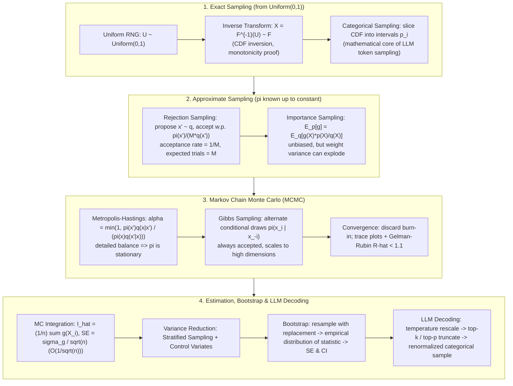

# 🎲 Sampling & Monte Carlo Methods: Inverse Transform, Rejection, Importance Sampling, MCMC & Bootstrap

> **Core Executive Summary**: Sampling theory answers a fundamental question — how do we draw random values from a target distribution when we can only cheaply generate uniform randomness? This guide covers exact methods (inverse transform with its correctness proof), approximate methods (rejection sampling with acceptance-rate derivation, importance sampling with variance analysis and optimal proposal), Markov chain machinery (Metropolis-Hastings and Gibbs with detailed balance, burn-in and convergence diagnostics), resampling (parametric and non-parametric Bootstrap for variance estimation and confidence intervals), the $O(1/\sqrt{n})$ Monte Carlo error law with variance-reduction techniques (stratified sampling, control variates), and the bridge from classical sampling to LLM decoding (temperature, top-k, top-p). Pure Numpy implementations (inverse transform, rejection, Bootstrap CI) and 5 high-frequency interview Q&As are included.

---

## 💡 Interactive Mermaid Architecture Flowchart



---

## 💡 Classic Interview Followups & Core Cheatsheet

* **Key Topic 1**: Prove the correctness of inverse transform sampling. Why is it limited to distributions with tractable inverse CDFs?
  * *Standard Answer*: Let $F$ be the target CDF and define the quantile function $F^{-1}(u) = \inf\{x : F(x) \ge u\}$ for $u \in (0,1)$. If $U \sim \text{Uniform}(0,1)$ and $X = F^{-1}(U)$, then
    $$P(X \le x) = P(F^{-1}(U) \le x) = P(U \le F(x)) = F(x)$$
    The second equality holds because $F$ is monotone non-decreasing ($F^{-1}(U) \le x \iff U \le F(x)$), the third because $U$ is uniform — so $X$ has exactly the target CDF, **QED**. The catch: $F^{-1}$ must be computable in closed form (exponential, Cauchy, logistic, geometric); the Gaussian has none, which motivates Box-Muller, rejection sampling, and MCMC.

> 💡 **Intuition**: Treat a uniform random number as a reading on the "probability ruler": $F(x)$ answers "how much probability lies below x," and $F^{-1}(u)$ asks "which x do we need to reach cumulative probability u." Equal-length probability intervals map through the monotone $F^{-1}$ onto values whose density is exactly proportional to $F'$ — inverse transform is just a dictionary from uniform randomness to target-distributed values.
>
> 🎤 **Interview Quick Answer**: "Bottom line: with $U \sim \text{Uniform}(0,1)$, $X = F^{-1}(U)$ has CDF $F$. Why: $F$ is monotone, so $\{F^{-1}(U) \le x\} = \{U \le F(x)\}$ and $P(U \le t) = t$ — three steps, QED. Example: exponential sampling is just $X = -\ln(1-U)/\lambda$ in numpy. Limitation: the Gaussian CDF has no closed-form inverse, so we fall back on Box-Muller or MCMC."

* **Key Topic 2**: Derive the acceptance probability of rejection sampling and the expected number of trials. How should the proposal be chosen?
  * *Standard Answer*: Pick a proposal $q$ and constant $M$ with $M q(x) \ge \pi(x)$ for all $x$. Draw $x' \sim q$, accept with probability $\pi(x')/(M q(x'))$. The overall acceptance probability is
    $$P(\text{accept}) = \int q(x) \cdot \frac{\pi(x)}{M q(x)} \, dx = \frac{1}{M} \int \pi(x) \, dx = \frac{1}{M}$$
    Trials are independent with success probability $1/M$, hence geometric with $\mathbb{E}[\text{trials}] = M$. Example: target $\mathcal{N}(0,1)$ with proposal $\text{Uniform}(-3,3)$ gives $M = \sqrt{2\pi} \cdot 3 \approx 7.52$ (~13% kept). Best practice: mode-match so $M = \max_x \pi(x)/q(x)$ is close to 1.

> 💡 **Intuition**: First sprinkle points inside a "coarse box" $Mq$, then keep or drop each point according to the target $\pi$ — the more unused space the box has above $\pi$, the more rejections. The acceptance rate is exactly $1/M$ because when we integrate over $x$, $q$ cancels against $1/q$ and only $\int \pi = 1$ survives. Think of it as a judge admitting candidates with probability "target score / proposal score."
>
> 🎤 **Interview Quick Answer**: "Bottom line: $P(\text{accept}) = 1/M$, expected trials $\mathbb{E}[\text{trials}] = M$ (geometric distribution). Why: each draw is kept with probability $\pi(x')/(Mq(x'))$, and integrating over $x'$ leaves $1/M$. Example: proposing $\mathcal{N}(0,1)$ with $\text{Uniform}(-3,3)$ gives $M = \sqrt{2\pi}\cdot 3 \approx 7.52$ — about 8 draws per accepted sample (~13%). Fix: mode-match so $M$ approaches 1."

* **Key Topic 3**: Why can importance sampling introduce high variance? What is the optimal proposal?
  * *Standard Answer*: The estimator $\hat{I} = \frac{1}{n}\sum_i g(X_i) w(X_i)$, $w = p/q$, is unbiased: $\mathbb{E}_q[gw] = \int g(x)p(x)dx$. Its variance is
    $$\text{Var}(\hat{I}) = \frac{1}{n} \left( \int \frac{(g(x)p(x))^2}{q(x)} \, dx - I^2 \right)$$
    If $q$ has lighter tails than $|g|p$, rare extremes carry enormous weights and variance can be infinite. The optimal proposal $q^*(x) \propto |g(x)|p(x)$ (Cauchy-Schwarz) achieves **zero variance** when $g \ge 0$; never set $q = 0$ where $|g|p > 0$, and monitor ESS.

> 💡 **Intuition**: Importance sampling is "borrowing samples and paying the exchange rate" — you draw from the easy $q$ but reweight every sample by $w = p/q$ so the expectation matches $p$ exactly. The danger is in the tails: if $q$ is thinner than $|g|p$, a rarely drawn extreme sample carries a huge weight, and one "jackpot" observation can dominate the estimate — like averaging everyone's income with a lottery winner.
>
> 🎤 **Interview Quick Answer**: "Bottom line: IS is unbiased but can have infinite variance; the optimal proposal is $q^* \propto |g|p$, giving zero variance when $g \ge 0$. Why: $q(x)$ sits in the denominator of the variance formula, so a thin-tailed $q$ blows it up; Cauchy-Schwarz yields the optimum. Example: heavy-tailed $g$ with a Gaussian $q$ — one tail sample can outweigh all others. Practice: watch ESS; if ESS ≪ n, switch proposals."

* **Key Topic 4**: Derive the Metropolis-Hastings acceptance ratio from detailed balance and explain why burn-in is needed.
  * *Standard Answer*: $\pi$ is stationary iff detailed balance holds: $\pi(x)T(x \to x') = \pi(x')T(x' \to x)$. With $T(x \to x') = q(x'|x)\alpha(x \to x')$, solving for $\alpha$ yields
    $$\alpha(x \to x') = \min\left(1, \frac{\pi(x')q(x|x')}{\pi(x)q(x'|x)}\right)$$
    so every accepted move preserves detailed balance and the chain converges to $\pi$. Burn-in discards the transient phase as the chain drifts from initialization toward the typical set; trace plots, autocorrelation/ESS, and the multi-chain Gelman-Rubin $\hat{R} < 1.1$ confirm convergence.

> 💡 **Intuition**: MCMC does not draw independent samples; it lets a sample "walk around the state space." Detailed balance guarantees the flow from $x$ to $x'$ equals the flow back, so the long-run occupancy is exactly $\pi$. The acceptance ratio is an "uphill toll, downhill free pass" regulator: moves toward high-density regions are free, moves away are discounted by the density ratio. Burn-in discards the warm-up walk from the starting point to the typical set.
>
> 🎤 **Interview Quick Answer**: "Bottom line: the MH acceptance ratio $\alpha = \min(1, \pi(x')q(x|x')/\pi(x)q(x'|x))$ makes $\pi$ the stationary distribution. Why: it is solved from detailed balance; for symmetric proposals the $q$-ratio cancels, leaving only the $\pi$ ratio. Example: Gaussian random-walk proposals always accept uphill moves and accept downhill moves probabilistically. Diagnostics: multi-chain $\hat{R} < 1.1$ and a large ESS, or correlated samples will understate standard errors."

* **Key Topic 5**: How does the Bootstrap estimate the variance and confidence interval of an arbitrary statistic?
  * *Standard Answer*: Draw $B$ resamples of size $n$ **with replacement** from the observed data, recomputing the statistic $\theta^*_b$ on each. The bootstrap standard error is $\widehat{\text{SE}} = \sqrt{\frac{1}{B-1}\sum_b (\theta^*_b - \bar\theta^*)^2}$, and the percentile $95\%$ CI is $[\theta^*_{(0.025)}, \theta^*_{(0.975)}]$. The **non-parametric** bootstrap resamples from the empirical distribution $\hat{F}_n$; the **parametric** bootstrap fits a family (e.g., Gaussian) by MLE and simulates from it. BCa intervals correct bias and skewness.

> 💡 **Intuition**: You only have one dataset, yet you want to simulate "what would happen if we repeated the experiment" — so treat this dataset as the whole universe and resample it with replacement over and over. The spread of the resampled statistics is a stand-in for the true sampling error. The confidence interval is read directly from the 2.5% and 97.5% percentiles of the resampled distribution — no normality assumption needed.
>
> 🎤 **Interview Quick Answer**: "Bottom line: the bootstrap estimates the SE and CI of any statistic (median, correlation, ...) by resampling with replacement. Why: the empirical distribution $\hat{F}_n$ approximates the true distribution, so resampled statistics approximate the sampling distribution. Example: for a median of 100 samples, run $B = 2000$ resamples — SE = std($\theta^*_b$), 95% CI = percentile interval; use BCa for skewness. Its own error decays as $O(1/\sqrt{B})$, so use $B \ge 1000$."

---

## 📚 Section 1: Inverse Transform Sampling & The Correctness Proof

### 1.1 The Quantile Function

For any CDF $F$, the quantile function (generalized inverse) is
$$F^{-1}(u) = \inf\{ x : F(x) \ge u \}, \quad u \in (0,1)$$
Monotone non-decreasing in $u$; for strictly increasing continuous $F$ it is the ordinary inverse function.

> 💡 **Intuition**: The CDF is a "probability-to-value lookup table": $F$ answers "how much probability lies below x," while $F^{-1}$ asks "which x is needed to reach cumulative probability u." The $\inf$ handles step-like (discrete) CDFs by taking "the first step that crosses u."
>
> 🎤 **Interview Quick Answer**: "Bottom line: the quantile function $F^{-1}(u) = \inf\{x : F(x) \ge u\}$ is the generalized inverse of the CDF. Why: CDFs are monotone but not strictly increasing, so continuous parts use the ordinary inverse while jumps use inf to define every $u$. Example: $\text{Exp}(\lambda)$ has $F^{-1}(u) = -\ln(1-u)/\lambda$; the Gaussian has no closed-form inverse, which is exactly why inverse transform fails there."

### 1.2 Correctness Proof (Inverse CDF Theorem)

**Theorem.** If $U \sim \text{Uniform}(0,1)$, then $X = F^{-1}(U)$ has CDF $F$.

**Proof.** By monotonicity of $F$ (equivalently of $F^{-1}$):
$$P(X \le x) = P(F^{-1}(U) \le x) = P(U \le F(x)) = F(x)$$
where the last step uses $P(U \le t) = t$ for uniform $U$. Hence the CDF of $X$ is exactly $F$. The discrete case follows by the same interval-slicing argument.

> 💡 **Intuition**: 📖 How to read this table: each row is a ready-to-code "sampling recipe" — the CDF column says what the distribution looks like, and the inverse column is the sampling formula; interviewers love the exponential and Cauchy rows. The idea underneath: $u$ is a random probability tick, $F^{-1}$ translates it back to the value domain, and equal-probability ticks land with density exactly proportional to $F'$.
>
> 🎤 **Interview Quick Answer**: "Bottom line: $U \sim \text{Uniform}(0,1)$ implies $X = F^{-1}(U) \sim F$. Why: $P(F^{-1}(U) \le x) = P(U \le F(x)) = F(x)$ — monotonicity and uniformity each supply one equality. Example: exponential samples are one formula, $X = -\ln(1-U)/\lambda$; the Gaussian can't be done this way, hence Box-Muller or MCMC."

| Distribution | CDF $F(x)$ | Inverse $F^{-1}(u)$ |
| :--- | :--- | :--- |
| **Exponential($\lambda$)** | $1 - e^{-\lambda x}$ | $-\frac{1}{\lambda}\ln(1 - u)$ |
| **Cauchy(0,1)** | $\frac{1}{2} + \frac{1}{\pi}\arctan(x)$ | $\tan\left(\pi(u - \frac{1}{2})\right)$ |
| **Geometric($p$)** | $1 - (1-p)^{\lfloor x \rfloor + 1}$ | $\left\lceil \frac{\ln(1-u)}{\ln(1-p)} \right\rceil$ |

### 1.3 Discrete Case: Categorical Sampling

A categorical distribution over $K$ outcomes with probabilities $p_1, \dots, p_K$ is sampled by slicing $[0,1)$ into intervals of length $p_i$: draw $u \sim \text{Uniform}(0,1)$ and return the $i$ with $u \in [\sum_{j<i} p_j, \sum_{j \le i} p_j)$. A scan costs $O(K)$; prefix-sum plus binary search costs $O(\log K)$. This is exactly the operation an LLM performs after softmax (Section 6).

> 💡 **Intuition**: Slice $[0,1)$ into $K$ segments of length $p_i$ and throw a uniform dart — whichever segment it lands in is the sampled category. Larger probabilities get longer arcs and are hit proportionally more often. It is a spinning wheel, and LLM token sampling is exactly this: give every candidate token an arc and spin.
>
> 🎤 **Interview Quick Answer**: "Bottom line: categorical sampling = slicing $[0,1)$ by $p_i$; the dart's landing segment is the outcome. Why: segment length equals probability, and a uniform dart hits in proportion to length. Example: after softmax, sample among $K$ tokens with prefix sums + binary search at $O(\log K)$ per draw — this is the engine under every LLM decoder. Complexity: $O(K)$ scan, $O(\log K)$ with prefix sums."

---

## 📚 Section 2: Rejection Sampling & The Acceptance Rate

### 2.1 The Algorithm

The target $\pi(x)$ only needs to be known up to a normalizing constant (the typical Bayesian situation). Choose a proposal $q$ and a constant $M$ with $M q(x) \ge \pi(x)$ for all $x$:

1. Draw $x' \sim q$ and $u \sim \text{Uniform}(0,1)$ independently;
2. Accept $x'$ if $u \le \dfrac{\pi(x')}{M q(x')}$; otherwise reject and repeat.

Rejection itself is the correction step that turns the proposal $q$ into the target $\pi$.

> 💡 **Intuition**: Draw a big envelope $Mq$ that covers $\pi$, sprinkle points, and admit each one with probability proportional to the "height ratio" $\pi/(Mq)$: where the envelope hugs the target almost everything passes; where the envelope bulges far above, most points are thrown away. The survivors automatically have shape $\pi$, and the rejection rate is just the wasted envelope volume.
>
> 🎤 **Interview Quick Answer**: "Bottom line: draw $x' \sim q$, accept with probability $\pi(x')/(Mq(x'))$; the accepted samples follow $\pi$. Why: the accepted density is proportional to $q(x)\cdot\pi(x)/(Mq(x)) = \pi(x)/M$, which normalizes to exactly $\pi$. Example: a Bayesian posterior $p(\theta|x) \propto p(x|\theta)p(\theta)$ never needs its normalizing constant — rejection sampling divides it away."

### 2.2 Acceptance Rate Derivation

In plain words: sum the probability "x is drawn AND x is kept" over all x — inside the integral $q$ cancels with $\dfrac{1}{q}$, leaving exactly $\dfrac{1}{M}$: the taller the envelope, the more waste.

$$P(\text{accept}) = \int q(x) \cdot \frac{\pi(x)}{M q(x)} \, dx = \frac{1}{M} \int \pi(x) \, dx = \frac{1}{M}$$

Each trial succeeds independently with probability $1/M$, so the number of trials is geometric with $\mathbb{E}[\text{trials}] = M$. Mode-matching $q$ to $\pi$ keeps $M$ near 1. Example: target $\mathcal{N}(0,1)$, proposal $\text{Uniform}(-3,3)$: $M = \sqrt{2\pi} \cdot 3 \approx 7.52$, ~8 draws per accepted sample.

| Method | Proposal requirement | Efficiency | Estimator variance | Typical use |
| :--- | :--- | :--- | :--- | :--- |
| **Inverse transform** | $F^{-1}$ in closed form | $O(1)$ per sample | None (exact) | Exponential, Cauchy, categorical |
| **Rejection sampling** | envelope $M q \ge \pi$ | $\sim M$ draws per accept | None (exact) | Low dimension, bounded support |
| **Importance sampling** | $q > 0$ where $\|g\|p > 0$ | All draws used | Can explode | Expectations, off-policy RL |

> 💡 **Intuition**: 📖 How to read this table: follow the "Proposal requirement" and "Estimator variance" columns — inverse transform and rejection are exact but pay a price (closed-form $F^{-1}$, or wasted draws), while importance sampling uses every draw but its variance can explode. The key contrast: the three methods fit "invertible CDF," "envelopeable density," and "expectation-only" situations respectively.
>
> 🎤 **Interview Quick Answer**: "Bottom line: acceptance rate $1/M$; trials are geometric with mean $M$. Why: $\int q \cdot \frac{\pi}{Mq} dx = \frac{1}{M}\int\pi dx = \frac{1}{M}$. Example: $\text{Uniform}(-3,3)$ proposing $\mathcal{N}(0,1)$ gives $M \approx 7.52$ — about 8 draws per accepted sample (~13%). Improvement: mode-match to push $M \to 1$."

### 2.3 Failure Modes: The Curse of Dimensionality

In $d$ dimensions the tightest envelope constant $M$ grows exponentially and the acceptance rate $1/M$ collapses — rejection sampling is only practical in low dimensions, which motivates MCMC (Section 4).

> 💡 **Intuition**: The envelope $Mq$ must cover the whole space, and volume grows exponentially with dimension — in 10 dimensions the envelope is hundreds or thousands of times bigger than the target, so almost every random point lands in "useless space" and the acceptance rate collapses. It is like tenting a mountain: the bigger the tent, the more wasted floor area.
>
> 🎤 **Interview Quick Answer**: "Bottom line: the acceptance rate $1/M$ decays exponentially in dimension $d$; rejection sampling is a low-dimensional tool. Why: the envelope constant $M$ grows exponentially with volume. Example: if $M$ reaches $10^4$ at $d = 10$, you average 10,000 draws per accepted sample. Fix: switch to MCMC, where samples walk toward high-probability regions instead of being sprinkled everywhere."

---

## 📚 Section 3: Importance Sampling & Variance Analysis

### 3.1 An Unbiased Estimator via Weighted Samples

For any proposal $q > 0$ wherever $g p > 0$:
$$I = \int g(x) p(x) \, dx = \int g(x) \frac{p(x)}{q(x)} q(x) \, dx = \mathbb{E}_{x \sim q}[g(X) w(X)], \quad w(x) = \frac{p(x)}{q(x)}$$
Hence $\hat{I} = \frac{1}{n} \sum_i g(X_i) w(X_i)$ is unbiased — the foundation of off-policy RL and rare-event estimation.

> 💡 **Intuition**: You want an expectation under $p$ but can only sample from $q$? Attach an "exchange rate" $w = p/q$ to every sample and convert $q$-world samples into $p$-world values — the expectation is exact. Off-policy RL is exactly this idea: data collected by the behavior policy is reweighted by the importance ratio to evaluate the target policy.
>
> 🎤 **Interview Quick Answer**: "Bottom line: $\hat{I} = \frac{1}{n}\sum_i g(X_i)w(X_i)$ with $w = p/q$ is an unbiased estimator of $I$. Why: $\mathbb{E}_q[gw] = \int g(x)\frac{p(x)}{q(x)}q(x)dx = \int gp\,dx = I$. Example: off-policy RL evaluates policy $\pi$ from data collected under $\mu$ by weighting each return by $p_\pi/q_\mu$ — the classic importance-sampling identity."

### 3.2 Variance of the Importance Estimator

In plain words: $q(x)$ sits in the denominator — where $(gp)^2$ is large but $q$ is "thin," the term blows up; a clever $q$ shrinks this integral, a careless one explodes it.

$$\text{Var}(\hat{I}) = \frac{1}{n} \left[ \mathbb{E}_q[(gw)^2] - I^2 \right] = \frac{1}{n} \left[ \int \frac{(g(x)p(x))^2}{q(x)} \, dx - I^2 \right]$$

Two consequences: (i) choosing $q = p$ recovers plain Monte Carlo variance $\text{Var}(g)/n$; (ii) by Cauchy-Schwarz the **optimal proposal** is $q^*(x) \propto |g(x)| p(x)$ — and when $g \ge 0$, $q^* = gp/I$ yields **zero variance**. The practical trap: proposals with lighter tails than $|g|p$ assign huge weights to rare extremes — variance can be infinite despite unbiasedness.

> 💡 **Intuition**: The weight $w = p/q$ is an exchange rate, and when $q$ is thinner than the target, extreme tail samples get absurd rates — one rare "high-denomination" sample can dominate the whole average. The optimal proposal $q^* \propto |g|p$ makes the integrand constant, so the exchange rate is even everywhere and variance hits zero.
>
> 🎤 **Interview Quick Answer**: "Bottom line: $\text{Var}(\hat{I}) = \frac{1}{n}[\int (gp)^2/q\,dx - I^2]$; taking $q = p$ recovers plain MC variance $\text{Var}(g)/n$. Why: Cauchy-Schwarz gives $q^* \propto |g|p$, and $q^* = gp/I$ achieves zero variance when $g \ge 0$. Example: if $q$'s tails are thinner than $|g|p$, variance can be infinite in theory. Practice: err on the wide side; never set $q = 0$ where $|g|p > 0$."

### 3.3 Self-Normalized Importance Sampling & ESS

When $p$ is known only up to a constant, use normalized weights:
$$\hat{I}_{\text{SNIS}} = \frac{\sum_i g(X_i) w_i}{\sum_i w_i}$$
This is slightly biased ($O(1/n)$) but consistent. The effective sample size $\text{ESS} = (\sum_i w_i)^2 / \sum_i w_i^2$ measures how many independent target draws the weighted set is worth; $\text{ESS} \ll n$ flags a degenerate proposal.

> 💡 **Intuition**: When all weights are near $1/n$, every sample pulls its weight and ESS ≈ $n$; when one weight dominates and the rest are nearly zero, only one or two samples actually matter and ESS → 1. ESS is the "headcount equivalent" of your weighted sample bag measured in independent samples.
>
> 🎤 **Interview Quick Answer**: "Bottom line: self-normalized IS is slightly biased ($O(1/n)$) but consistent, and ESS = $(\sum w_i)^2 / \sum w_i^2$ measures the effective sample size. Why: normalizing weights introduces ratio-estimator bias; ESS quantifies how even the weights are. Example: $10^4$ draws with ESS = 50 mean your estimate is only as trustworthy as 50 independent samples — the proposal needs fixing."

---

## 📚 Section 4: Markov Chain Monte Carlo (MCMC)

### 4.1 Metropolis-Hastings & Detailed Balance

We want a transition kernel $T$ whose stationary distribution is $\pi$. A sufficient condition is detailed balance: $\pi(x) T(x \to x') = \pi(x') T(x' \to x)$. Choose a proposal $q(x'|x)$ and set $T(x \to x') = q(x'|x) \alpha(x \to x')$ with
$$\alpha(x \to x') = \min\left(1, \frac{\pi(x') q(x|x')}{\pi(x) q(x'|x)}\right)$$
Substitution verifies detailed balance term by term, so $\pi$ is stationary and the chain converges to it. For symmetric proposals (Gaussian random walk) the $q$-ratio cancels: $\alpha = \min(1, \pi(x')/\pi(x))$ — uphill moves are always accepted, downhill moves only probabilistically.

> 💡 **Intuition**: Detailed balance is "flow conservation": the transition flow from $x$ to $x'$ equals the flow back, so the distribution never drifts. The acceptance ratio is an asymmetry compensator — if the proposal favors one direction, that direction's acceptance probability is lowered to keep the two flows equal; with a symmetric proposal only the $\pi$ ratio remains: going uphill is free, going downhill costs a ticket.
>
> 🎤 **Interview Quick Answer**: "Bottom line: $\alpha = \min\left(1, \frac{\pi(x')q(x|x')}{\pi(x)q(x'|x)}\right)$ makes $\pi$ the stationary distribution. Why: solving detailed balance $\pi(x)T(x\to x') = \pi(x')T(x'\to x)$ for $\alpha$; symmetric proposals cancel the $q$-ratio. Example: Gaussian random-walk MH sampling $\mathcal{N}(0,1)$ almost always accepts moves toward the mean and rejects moves away with probability proportional to the density ratio."

### 4.2 Gibbs Sampling

For $\pi(x_1, x_2)$, alternate: draw $x_1' \sim \pi(x_1 \mid x_2)$, then $x_2' \sim \pi(x_2 \mid x_1')$. Each conditional update is an MH step with acceptance probability exactly 1, so the chain never rejects and scales gracefully to high dimensions whenever the full conditionals are tractable — the workhorse for hierarchical Bayesian and latent-variable models.

> 💡 **Intuition**: The joint distribution is hard to sample, but "fix everything else and sample one coordinate" is often easy — Gibbs is like tuning knobs in turn: each step moves in a single coordinate direction according to the conditional given the current values, and the chain gradually drifts into the typical set of the joint. Each conditional update is an MH step with acceptance probability exactly 1, so it never rejects.
>
> 🎤 **Interview Quick Answer**: "Bottom line: Gibbs samples each full conditional $\pi(x_i | x_{-i})$ in turn and never rejects. Why: every conditional update is an MH step with acceptance probability exactly 1, so the chain converges to the joint distribution. Example: for a 2D Gaussian, alternate $x_1 | x_2$ and $x_2 | x_1$; latent-variable models like LDA are inference on exactly this pattern. Requirement: tractable full conditionals."

### 4.3 Convergence, Burn-in & Diagnostics

The chain starts far from the typical set; **burn-in** discards the first $B$ transient iterations. Formal diagnostics:

| Diagnostic | What it measures | Convergence criterion |
| :--- | :--- | :--- |
| **Trace plot** | Visual mixing of $\pi(x_t)$ over $t$ | Stationary-looking, no drift |
| **Autocorrelation / ESS** | Number of effective independent samples | ESS large relative to chain length |
| **Gelman-Rubin $\hat{R}$** | Between-chain vs within-chain variance (multi-chain) | $\hat{R} < 1.1$ |

The most common practical mistake is understating standard errors from autocorrelated samples; thinning plus a large ESS is the standard remedy.

> 💡 **Intuition**: 📖 How to read this table: the three rows are three falsification tools — trace plots catch drift, autocorrelation/ESS measure "independent information," and Gelman-Rubin $\hat{R}$ checks whether multiple chains agree with each other; the $\hat{R} < 1.1$ threshold is the interview favorite. Key intuition: only post-equilibrium samples are representative, and a strongly autocorrelated chain may look long while carrying very little independent information.
>
> 🎤 **Interview Quick Answer**: "Bottom line: convergence requires three things — a stationary trace plot, a large ESS, and $\hat{R} < 1.1$. Why: transient and autocorrelation introduce bias; multi-chain between/within variance removes dependence on initialization. Example: a $10^4$-step single chain with heavy autocorrelation may have ESS ≈ 50 — computing SE directly would badly understate uncertainty; thin or run longer."

---

## 📚 Section 5: Monte Carlo Integration, Bootstrap & Variance Reduction

### 5.1 The $O(1/\sqrt{n})$ Error Law

The Monte Carlo estimator $\hat{I} = \frac{1}{n}\sum_i g(X_i)$ satisfies, by the CLT,
$$\sqrt{n}(\hat{I} - I) \xrightarrow{d} \mathcal{N}(0, \sigma_g^2), \quad \sigma_g^2 = \text{Var}(g(X)) \quad\Longrightarrow\quad \text{SE}(\hat{I}) = \frac{\sigma_g}{\sqrt{n}}$$
The error decays as $O(1/\sqrt{n})$: **to halve the error you must quadruple the samples**. Unlike deterministic quadrature (which suffers the curse of dimensionality), the rate is dimension-independent — the reason Monte Carlo wins in high dimensions.

> 💡 **Intuition**: Averages fluctuate like $1/\sqrt{n}$ — quadruple the samples to halve the error, so returns diminish fast. But the magic is that the rate is dimension-independent: deterministic quadrature needs exponentially many nodes in 30 dimensions, while MC just needs more samples — which is why Monte Carlo is the only universally feasible integrator in high dimensions.
>
> 🎤 **Interview Quick Answer**: "Bottom line: MC error is $SE = \sigma_g/\sqrt{n}$; halving the error requires 4× the samples. Why: the CLT gives $\sqrt{n}(\hat{I} - I) \to \mathcal{N}(0, \sigma_g^2)$, an $O(1/\sqrt{n})$ rate that does not depend on dimension. Example: with $\sigma_g = 1$, $n = 10^4$ gives SE = 0.01; reaching 0.005 needs $n = 4\times10^4$. Better: shrink $\sigma_g$ with stratified sampling or control variates."

### 5.2 Variance Reduction Techniques

- **Stratified sampling**: partition the domain into strata and allocate samples proportionally to within-stratum variance $\sigma_j$; variance shrinks to $\frac{1}{n}(\sum_j \frac{n_j}{n}\sigma_j)^2 \le \sigma^2/n$ (Latin hypercube generalizes it to many dimensions).
- **Control variates**: with $h$ of known mean, estimate $g - c(h - \mathbb{E}[h])$; the optimal coefficient $c^* = \text{Cov}(g,h)/\text{Var}(h)$ cuts variance by $1 - \rho_{gh}^2$.
- **Antithetic variables**: pair negatively correlated runs to cancel shared noise.

> 💡 **Intuition**: All three tricks share one theme — don't waste known information: stratification allocates more samples where the within-stratum variance is large; control variates use a highly correlated variable $h$ with known mean as a baseline and estimate only the difference; antithetic variables run two negatively correlated copies so their shared noise cancels. The stronger the correlation, the more variance is removed.
>
> 🎤 **Interview Quick Answer**: "Bottom line: stratified sampling, control variates, and antithetic variables all exploit known structure to cut variance. Why: the optimal control-variate coefficient is $c^* = \text{Cov}(g,h)/\text{Var}(h)$, shrinking variance by $1 - \rho_{gh}^2$. Example: estimating $\int_0^1 e^x dx$ with $h(x) = x$ as the control variate gives $\rho \approx 0.99$, ~100× less variance — equivalent to 100× more samples."

### 5.3 Bootstrap: Variance Estimation & Confidence Intervals

Given data $x_1, \dots, x_n$ and any statistic $\theta$ (median, correlation — anything), the **non-parametric bootstrap** approximates the sampling distribution of $\hat\theta$ by the empirical distribution $\hat{F}_n$: resample $n$ points with replacement $B$ times and recompute $\theta^*_b$. Then $\widehat{\text{SE}} = \text{std}(\theta^*_b)$ and the percentile CI is $[\theta^*_{(\alpha/2)}, \theta^*_{(1-\alpha/2)}]$. The **parametric bootstrap** assumes a family (e.g., Gaussian), fits it by MLE, and simulates datasets from the fitted model. BCa intervals correct bias and skewness via a nested bootstrap. Bootstrap shines where normal approximation fails (skewed statistics, small $n$); its own error decays as $O(1/\sqrt{B})$.

> 💡 **Intuition**: You have one dataset but want to simulate "what if we ran the experiment again" — so shuffle and resample this same dataset with replacement, over and over. The scatter of the resampled statistics is a stand-in for the true sampling error, and no normality assumption is needed, which is what makes it work for statistics like medians and ratios that have no closed-form SE.
>
> 🎤 **Interview Quick Answer**: "Bottom line: resample with replacement $B$ times; SE = std($\theta^*_b$) and the percentile CI is $[\theta^*_{(\alpha/2)}, \theta^*_{(1-\alpha/2)}]$. Why: the empirical distribution $\hat{F}_n$ approximates the true one. Example: a skewed median from 100 samples — run $B = 2000$ resamples for a robust SE and CI; the parametric version fits a Gaussian by MLE first, and BCa corrects skewness."

---

## 📚 Section 6: From Sampling Theory to LLM Decoding

### 6.1 Temperature as Distribution Reshaping

An LLM emits logits $z$; sampling draws from the temperature-scaled softmax:
$$q_i = \frac{\exp(z_i / T)}{\sum_j \exp(z_j / T)}$$
As $T \to 0^+$ the distribution collapses to the point mass at $\arg\max_j z_j$ (greedy decoding is inverse-transform sampling of a degenerate categorical); as $T \to \infty$ it flattens to uniform. Temperature never changes the ranking of logits — only the sharpness — so it is a global diversity knob rather than a decoding strategy.

> 💡 **Intuition**: $T$ is the "sharpness knob" of softmax: small $T$ amplifies logit differences, piling probability onto the largest logit (near-greedy); large $T$ flattens the exponents toward uniform. But the ranking never changes — it only scales the gaps, not who is first.
>
> 🎤 **Interview Quick Answer**: "Bottom line: $T$ rescales logits before softmax, changing only the sharpness, never the ranking. Why: $q_i \propto \exp(z_i/T)$; $T \to 0^+$ collapses to $\arg\max$, $T \to \infty$ approaches uniform. Example: $T = 0.7$ gives more decisive text, $T = 1.0$ is the raw distribution, $T = 1.5$ is more diverse. It stacks with top-k/top-p — an orthogonal knob."

### 6.2 Top-k and Top-p as Truncated Categorical Sampling

Both strategies build a truncated categorical distribution and draw from it — exactly the categorical/inverse-transform sampler of Section 1.3.

| Decoding strategy | Distribution modification | Determinism | Typical use |
| :--- | :--- | :--- | :--- |
| **Greedy** | $\arg\max$ (delta mass) | Deterministic | Factual QA, code |
| **Top-k** | Keep top $k$ tokens, renormalize | Stochastic | Controlled diversity |
| **Top-p (nucleus)** | Keep smallest set with $\sum p \ge p$, renormalize | Stochastic | Open-ended generation (default) |
| **Temperature** | Rescale logits $z_i/T$ before softmax | Modifies any | Global diversity |

Edge cases: $k = 1$ is greedy, $p = 1$ is full softmax, $T \to 0$ makes any method greedy. Since temperature acts before softmax while top-k/top-p act after, many APIs treat them as alternative controls.

> 💡 **Intuition**: 📖 How to read this table: the second column says "how the distribution is modified," the third separates deterministic (greedy) from stochastic; the interview favorite is the top-k vs top-p difference — top-k truncates by "headcount," top-p truncates by "cumulative probability mass," so top-p is more adaptive. Both first clip the low-probability tail, renormalize, then draw via the categorical sampler of Section 1.3.
>
> 🎤 **Interview Quick Answer**: "Bottom line: top-k keeps the $k$ highest-probability tokens and renormalizes; top-p keeps the smallest set whose cumulative probability reaches $p$ and renormalizes. Why: truncate, then categorical-sample — clipping avoids sampling garbage tokens from the tail. Example: $k = 1$ is greedy, $p = 1$ is full softmax, and $T \to 0$ makes any method greedy. Note: temperature acts before softmax, top-k/p after — APIs usually treat them as alternatives."

---

## 🐍 Pure Numpy Implementation

```python
import numpy as np


def inverse_transform_exponential(u: np.ndarray, lam: float = 1.0) -> np.ndarray:
    """X = F^{-1}(U) for Exp(lam): F^{-1}(u) = -ln(1 - u) / lam."""
    return -np.log(1.0 - u) / lam


def rejection_sample_normal(n: int, lo: float = -4.0, hi: float = 4.0,
                            rng: np.random.Generator = None) -> np.ndarray:
    """Rejection-sample N(0, 1) from Uniform(lo, hi). Acceptance rate = 1 / M."""
    rng = rng or np.random.default_rng(42)
    M = np.sqrt(2.0 * np.pi) * (hi - lo) / 2.0   # M = max_x pi(x) / q(x)
    accepted = []
    while len(accepted) < n:
        xs = rng.uniform(lo, hi, size=max(2 * n, 64))
        us = rng.uniform(0.0, 1.0, size=len(xs))
        target = np.exp(-0.5 * xs ** 2)                  # unnormalized pi(x)
        proposal = np.full_like(xs, 1.0 / (hi - lo))     # q(x)
        keep = us <= target / (M * proposal)
        accepted.extend(xs[keep].tolist())
    return np.array(accepted[:n])


def bootstrap_ci(data: np.ndarray, statistic=np.median, n_boot: int = 2000,
                 alpha: float = 0.05,
                 rng: np.random.Generator = None) -> tuple:
    """Non-parametric bootstrap: SE and percentile CI of an arbitrary statistic."""
    rng = rng or np.random.default_rng(7)
    n = len(data)
    boot_stats = np.empty(n_boot)
    for b in range(n_boot):
        resample = data[rng.integers(0, n, size=n)]
        boot_stats[b] = statistic(resample)
    se = boot_stats.std(ddof=1)
    ci = np.percentile(boot_stats, [100 * alpha / 2, 100 * (1 - alpha / 2)])
    return se, ci


if __name__ == "__main__":
    rng = np.random.default_rng(42)

    # 1) Inverse transform: mean should be ~1.0 for Exp(1)
    exp_samples = inverse_transform_exponential(rng.random(200_000))
    print(f"Inverse transform Exp(1): mean={exp_samples.mean():.4f}, "
          f"std={exp_samples.std(ddof=1):.4f}")

    # 2) Rejection sampling: mean ~0, std ~1 for N(0, 1)
    norm_samples = rejection_sample_normal(20_000, rng=rng)
    print(f"Rejection N(0,1): mean={norm_samples.mean():.4f}, "
          f"std={norm_samples.std(ddof=1):.4f}")

    # 3) Bootstrap: median of Exp(2) data; true median = 2*ln(2) ~ 1.386
    data = rng.exponential(scale=2.0, size=100)
    se, ci = bootstrap_ci(data, np.median)
    print(f"Bootstrap median: SE={se:.4f}, 95% CI=[{ci[0]:.4f}, {ci[1]:.4f}]")
```

---

## 📝 Takeaways & Engineering Best Practices

1. **Inverse transform first**: whenever the CDF is invertible (exponential, Cauchy, any categorical), it is exact and $O(1)$ per draw — and for categoricals it is literally what LLM decoders do after softmax/top-k/top-p.
2. **Rejection sampling is a low-dimensional tool**: the acceptance rate $1/M$ decays exponentially in dimension, so switch to MCMC beyond a few dimensions.
3. **Importance sampling is for expectations, not samples**: keep proposal tails heavier than $|g|p$, monitor ESS, and prefer the optimal proposal $q^* \propto |g|p$ when $g \ge 0$.
4. **Always diagnose MCMC**: discard burn-in, run multiple chains, and report Gelman-Rubin $\hat{R} < 1.1$ plus ESS — correlated samples silently inflate confidence.
5. **Respect the $O(1/\sqrt{n})$ law**: to halve MC error, quadruple samples — or lower $\sigma_g$ with stratified sampling / control variates instead of raising $n$.
6. **Bootstrap for anything without a closed-form SE**: median, quantiles, ratios — use it with $B \ge 1000$ for SE and percentile CIs, and BCa for skewed statistics.
