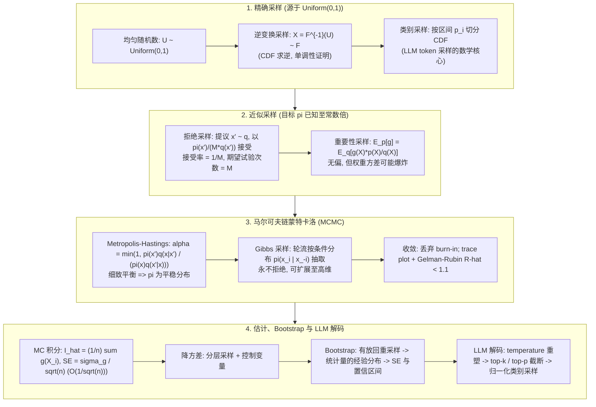

# 🎲 采样与蒙特卡洛方法：逆变换采样、拒绝采样、重要性采样、MCMC 与 Bootstrap 全景

> **核心摘要**：采样理论回答一个基础问题——当我们只能廉价地生成均匀随机数时，如何从任意目标分布中抽取样本？本指南系统覆盖：精确采样（逆变换采样及其正确性证明）、近似采样（拒绝采样的接受率推导、重要性采样的方差分析与最优提议分布）、马尔可夫链蒙特卡洛（Metropolis-Hastings 与 Gibbs 的细致平衡、burn-in 与收敛诊断）、重采样技术（参数/非参数 Bootstrap 的方差估计与置信区间）、蒙特卡洛积分 $O(1/\sqrt{n})$ 误差定律与降方差技巧（分层采样、控制变量），并桥接经典采样理论与 LLM 解码（temperature、top-k、top-p）。配备 Pure Numpy 逆变换 + 拒绝采样 + Bootstrap 置信区间实现与 5 大高频面试考点。

---

## 💡 交互式 Mermaid 架构流程图



---

## 💡 经典面试追问与考点速查

* **考点 1**：证明逆变换采样的正确性，并说明其局限性？
  * *标准回答*：设 $F$ 为目标分布函数，定义分位数函数 $F^{-1}(u) = \inf\{x : F(x) \ge u\}$（$u \in (0,1)$）。若 $U \sim \text{Uniform}(0,1)$ 且 $X = F^{-1}(U)$，则
    $$P(X \le x) = P(F^{-1}(U) \le x) = P(U \le F(x)) = F(x)$$
    第二个等号成立是因为 $F$ 单调不减（$F^{-1}(U) \le x \iff U \le F(x)$），第三个等号是因为 $U$ 均匀——故 $X$ 的分布函数恰好为 $F$，**证毕**。局限在于 $F^{-1}$ 必须能解析求出（指数、柯西、Logistic、几何分布可以）；高斯分布的反误差函数无闭式解，因而需要 Box-Muller、拒绝采样或 MCMC。

> 💡 **直观理解**: 把均匀随机数当成"概率刻度尺"上的读数：$F(x)$ 回答"x 以下累积了多少概率"，$F^{-1}(u)$ 反着问"要累积到 u 的概率，至少走到哪个 x"。均匀刻度等概率，经单调映射到取值域后，落在各处的密度恰好正比于 $F$ 的导数——逆变换就是把"均匀概率"翻译回"目标取值"的字典。
>
> 🎤 **面试速答**: "结论：$U \sim \text{Uniform}(0,1)$ 时 $X = F^{-1}(U)$ 的分布函数就是 $F$。原理：$F$ 单调不减，$\{F^{-1}(U) \le x\}$ 等价于 $\{U \le F(x)\}$，而 $P(U \le t) = t$，三步证毕。举个例子：指数分布 $F^{-1}(u) = -\ln(1-u)/\lambda$，numpy 一行即可采样。局限：高斯 CDF 不可解析求逆，只能走 Box-Muller 或 MCMC。"

* **考点 2**：推导拒绝采样的接受概率与期望试验次数，如何选取提议分布？
  * *标准回答*：选取提议分布 $q$ 与常数 $M$，满足 $M q(x) \ge \pi(x)$ 对所有 $x$ 成立。抽取 $x' \sim q$，以概率 $\pi(x')/(M q(x'))$ 接受，则整体接受概率为
    $$P(\text{accept}) = \int q(x) \cdot \frac{\pi(x)}{M q(x)} \, dx = \frac{1}{M} \int \pi(x) \, dx = \frac{1}{M}$$
    每次试验独立、成功概率为 $1/M$，故试验次数服从几何分布，$\mathbb{E}[\text{trials}] = M$。例如以 $\text{Uniform}(-3,3)$ 提议 $\mathcal{N}(0,1)$：$M = \sqrt{2\pi} \cdot 3 \approx 7.52$（约 13% 被保留）。最佳实践：令提议分布与目标分布峰位对齐（mode-matched），使 $M = \max_x \pi(x)/q(x)$ 尽量接近 1。

> 💡 **直观理解**: 先在一个"粗盒子"$Mq$ 里撒点，再按目标密度 $\pi$ 决定留不留——盒子包住目标的富余空间越多，拒绝得越多。接受率恰为 $1/M$ 的道理在于：对 $x$ 积分时 $q$ 与分子约分，剩 $\int \pi = 1$，罩子高度 $M$ 越大浪费越严重。这就像请评委按"目标分/提议分"的比例放行。
>
> 🎤 **面试速答**: "结论：接受率 $P(\text{accept}) = 1/M$，期望试验次数 $\mathbb{E}[\text{trials}] = M$。原理：每个点独立以 $\pi(x')/(M q(x'))$ 留下，积分后恰好 $1/M$，试验次数服从几何分布。举个例子：用 $\text{Uniform}(-3,3)$ 提议 $\mathcal{N}(0,1)$，$M = \sqrt{2\pi}\cdot 3 \approx 7.52$，平均约 8 次试验保留 1 个（约 13%）。优化：提议与目标峰位对齐，让 $M$ 贴近 1。"

* **考点 3**：为什么重要性采样可能引入极大方差？什么是最优提议分布？
  * *标准回答*：估计器 $\hat{I} = \frac{1}{n}\sum_i g(X_i) w(X_i)$，权重 $w = p/q$，无偏性来自 $\mathbb{E}_q[g w] = \int g(x)p(x)dx$。其方差为
    $$\text{Var}(\hat{I}) = \frac{1}{n} \left( \int \frac{(g(x)p(x))^2}{q(x)} \, dx - I^2 \right)$$
    若 $q$ 的尾部比 $|g|p$ 更薄，稀有极端样本将携带巨大权重，方差甚至可能无穷大。由 Cauchy-Schwarz 不等式，最优提议分布为 $q^*(x) \propto |g(x)|p(x)$；当 $g \ge 0$ 时 $q^* = gp/I$ 可达到**零方差**。绝不能令 $q$ 在 $|g|p$ 较大的区域取 0，并需监控有效样本量 ESS。

> 💡 **直观理解**: 重要性采样像"借样本再补差价"——从好采的 $q$ 抽样，但给每个样本挂权重 $w = p/q$ 重新称重，期望上恰好补回 $p$ 下的积分。危险在尾巴：$q$ 比 $|g|p$ 更薄时，极少抽到的极端样本携带巨大权重，一次"踩雷"就能炸掉整个估计，如同用彩票头奖去平均所有人的收入。
>
> 🎤 **面试速答**: "结论：IS 无偏但方差可能无穷大；最优提议 $q^* \propto |g|p$，且 $g \ge 0$ 时方差可降为 0。原理：方差公式分母是 $q(x)$，尾部过薄的 $q$ 令被积函数爆炸；Cauchy-Schwarz 给出最优解。举个例子：$g$ 重尾而 $q$ 取高斯，一个尾部样本的权重可能超过其余样本总和。实践：监控 ESS，ESS 远小于 $n$ 就要换提议。"

* **考点 4**：从细致平衡推导 Metropolis-Hastings 接受比，为什么需要 burn-in？
  * *标准回答*：$\pi$ 是转移核 $T$ 的平稳分布当且仅当细致平衡成立：$\pi(x)T(x \to x') = \pi(x')T(x' \to x)$。令 $T(x \to x') = q(x'|x)\alpha(x \to x')$，解出 $\alpha$ 即得
    $$\alpha(x \to x') = \min\left(1, \frac{\pi(x')q(x|x')}{\pi(x)q(x'|x)}\right)$$
    由此每一步接受都保持细致平衡，链收敛到 $\pi$。burn-in 丢弃链从初始化漂移向典型集（typical set）的暂态；需用 trace plot、自相关/ESS 以及多链 Gelman-Rubin $\hat{R} < 1.1$ 确认收敛后再用样本做推断。

> 💡 **直观理解**: MCMC 不独立抽样，而是让样本"在状态空间散步"——细致平衡保证向左的流量等于向右的流量，分布长期占比恰是 $\pi$。接受比 $\min(1, \cdot)$ 是"上坡收费、下坡放行"的调节器：去高概率区免费，去低概率区按密度比打折。burn-in 丢的是"热身期"样本，那时链还没从起点走到典型集，不算成绩。
>
> 🎤 **面试速答**: "结论：MH 接受比 $\alpha = \min(1, \pi(x')q(x|x')/\pi(x)q(x'|x))$ 使 $\pi$ 成为平稳分布。原理：接受比由细致平衡反解出来；对称提议时 $q$ 比值约去，只剩 $\pi$ 之比。举个例子：高斯随机游走提议下，向高概率移动必接受、向低概率移动按概率接受。诊断：多链 $\hat{R} < 1.1$ 且 ESS 足够大，否则相关样本会低估标准误。"

* **考点 5**：Bootstrap 如何估计任意统计量（如中位数）的方差与置信区间？
  * *标准回答*：从观测数据中**有放回**抽取 $B$ 次大小为 $n$ 的重采样，每次重算统计量 $\theta^*_b$。Bootstrap 标准误为 $\widehat{\text{SE}} = \sqrt{\frac{1}{B-1}\sum_b (\theta^*_b - \bar\theta^*)^2}$，百分位法 $95\%$ 置信区间为 $[\theta^*_{(0.025)}, \theta^*_{(0.975)}]$。**非参数** Bootstrap 从经验分布 $\hat{F}_n$ 重采样；**参数** Bootstrap 先假设分布族（如高斯）并用 MLE 拟合，再按拟合模型模拟数据。BCa 区间进一步修正偏差与偏度。Bootstrap 本身也是蒙特卡洛过程，其自身误差按 $O(1/\sqrt{B})$ 衰减。

> 💡 **直观理解**: 手里只有一份数据，却想模拟"再做一次实验"的抽样波动——于是把这份数据当作整个宇宙，反复有放回重抽，重采样统计量的起伏就是真实抽样误差的替身。置信区间直接从重采样分布的 2.5% 与 97.5% 分位数读出来，不需要任何正态假设。
>
> 🎤 **面试速答**: "结论：Bootstrap 用有放回重采样估计任意统计量（中位数、相关系数等）的 SE 与置信区间。原理：经验分布 $\hat{F}_n$ 近似真实分布，重采样分布近似抽样分布。举个例子：100 个样本的中位数，做 $B = 2000$ 次重采样，SE = std($\theta^*_b$)，95% CI 取百分位区间；偏态统计量用 BCa 修正。注意自身误差按 $O(1/\sqrt{B})$ 衰减，$B$ 至少 1000。"

---

## 📚 第一章：逆变换采样与正确性证明

### 1.1 分位数函数 (Quantile Function)

对任意分布函数 $F$，分位数函数（广义逆）定义为
$$F^{-1}(u) = \inf\{ x : F(x) \ge u \}, \quad u \in (0,1)$$
它在 $u$ 上单调不减；当 $F$ 严格递增且连续时即为普通反函数。

> 💡 **直观理解**: CDF 像"概率-取值对照表"：$F$ 回答"x 以下占了多少概率"，$F^{-1}$ 反着问"累积到 $u$ 至少走到哪个 x"。用 $\inf$ 是为了兼容台阶状 CDF（离散分布），取"跨过 $u$ 的第一级台阶"。
>
> 🎤 **面试速答**: "结论：分位数函数 $F^{-1}(u) = \inf\{x : F(x) \ge u\}$ 是 CDF 的广义逆。原理：CDF 单调不减但不一定严格递增，连续段取普通反函数，跳跃处用 inf 保证每个 $u$ 有定义。举个例子：$\text{Exp}(\lambda)$ 的 $F^{-1}(u) = -\ln(1-u)/\lambda$；高斯无闭式反函数，这正是逆变换采样局限的根源。"

### 1.2 逆变换定理正确性证明 (Inverse CDF Theorem)

**定理**：若 $U \sim \text{Uniform}(0,1)$，则 $X = F^{-1}(U)$ 的分布函数为 $F$。

**证明**：由 $F$（等价地 $F^{-1}$）的单调性：
$$P(X \le x) = P(F^{-1}(U) \le x) = P(U \le F(x)) = F(x)$$
最后一步使用均匀分布的性质 $P(U \le t) = t$。故 $X$ 的分布函数恰为 $F$，**证毕**。离散情形由同样的区间切片论证导出。

> 💡 **直观理解**: 📖 怎么读这张表：三行是三种"可直接编程的采样配方"——CDF 列说明分布长什么样，逆函数列就是采样公式；面试常考指数与柯西这两行。背后的直觉：$u$ 是"随机概率刻度"，$F^{-1}$ 把它翻译回取值域，等概率刻度经单调映射后恰好按 $F$ 的密度落点。
>
> 🎤 **面试速答**: "结论：$U \sim \text{Uniform}(0,1)$ 则 $X = F^{-1}(U) \sim F$。原理：$P(F^{-1}(U) \le x) = P(U \le F(x)) = F(x)$，单调性与均匀性各用一个等号。举个例子：生成指数样本只需 $X = -\ln(1-U)/\lambda$ 一条公式；高斯做不到闭式求逆，所以需要 Box-Muller 或 MCMC。"

| 分布 | CDF $F(x)$ | 逆函数 $F^{-1}(u)$ |
| :--- | :--- | :--- |
| **指数分布 Exp($\lambda$)** | $1 - e^{-\lambda x}$ | $-\frac{1}{\lambda}\ln(1 - u)$ |
| **柯西分布 Cauchy(0,1)** | $\frac{1}{2} + \frac{1}{\pi}\arctan(x)$ | $\tan\left(\pi(u - \frac{1}{2})\right)$ |
| **几何分布 Geometric($p$)** | $1 - (1-p)^{\lfloor x \rfloor + 1}$ | $\left\lceil \frac{\ln(1-u)}{\ln(1-p)} \right\rceil$ |

### 1.3 离散情形：类别采样 (Categorical Sampling)

对 $K$ 个类别、概率 $p_1, \dots, p_K$ 的类别分布，将 $[0,1)$ 切分为长度 $p_i$ 的区间：抽取 $u \sim \text{Uniform}(0,1)$，返回满足 $u \in [\sum_{j<i} p_j, \sum_{j \le i} p_j)$ 的 $i$。线性扫描为 $O(K)$；前缀和数组 + 二分查找为 $O(\log K)$。这正是 LLM 在 softmax 之后执行的操作（见第六章）。

> 💡 **直观理解**: 把 $[0,1)$ 按概率 $p_i$ 切成 $K$ 段，投一个均匀数，落在哪段就抽哪个类别——概率大的段更长，被投中的机会更多，和"转盘抽奖"一模一样。LLM 的 token 采样就是给每个候选词分配一段弧长再转盘。
>
> 🎤 **面试速答**: "结论：类别采样 = 按 $p_i$ 切区间，均匀数落点即类别。原理：区间长度即概率，均匀投点按长度比例命中。举个例子：softmax 之后 K 个 token 用前缀和 + 二分查找，$O(\log K)$ 每次采样——LLM 解码的底层就是它。复杂度：线性扫描 $O(K)$，前缀和二分 $O(\log K)$。"

---

## 📚 第二章：拒绝采样与接受率

### 2.1 算法流程

目标 $\pi(x)$ 只需已知至常数倍（典型的贝叶斯情形）。选取提议分布 $q$ 与常数 $M$，使 $M q(x) \ge \pi(x)$ 对所有 $x$ 成立：

1. 独立抽取 $x' \sim q$ 与 $u \sim \text{Uniform}(0,1)$；
2. 若 $u \le \dfrac{\pi(x')}{M q(x')}$ 则接受 $x'$；否则拒绝并重试。

拒绝这一步正是把提议分布 $q$ 修正为目标分布 $\pi$ 的校正器。

> 💡 **直观理解**: 用 $Mq$ 画一个包住 $\pi$ 的大罩子，随机撒点后按"高度比"放行：罩子与目标重合处几乎全放行，罩子明显高处大量拒绝——留下点的形状自动变成 $\pi$，拒绝率就是罩子多余空间的浪费率。不需要知道 $\pi$ 的归一化常数，因为比值 $\pi/(Mq)$ 里常数约掉了。
>
> 🎤 **面试速答**: "结论：从 $q$ 抽 $x'$，以 $\pi(x')/(M q(x'))$ 接受，留下的样本服从 $\pi$。原理：接受事件密度正比于 $q(x)\cdot\pi(x)/(Mq(x)) = \pi(x)/M$，归一化后恰为 $\pi$。举个例子：贝叶斯后验 $p(\theta|x) \propto p(x|\theta)p(\theta)$ 的分母 $Z$ 根本不用算，这正是拒绝采样对贝叶斯问题的核心价值。"

### 2.2 接受率推导

大白话：接受率就是把"每个点被抽到、且被留下"的概率对所有点累加——积分里 $q$ 与 $\dfrac{1}{q}$ 约分，剩下的正好是 $\dfrac{1}{M}$，罩子越高浪费越多。

$$P(\text{accept}) = \int q(x) \cdot \frac{\pi(x)}{M q(x)} \, dx = \frac{1}{M} \int \pi(x) \, dx = \frac{1}{M}$$

每次试验独立、成功概率为 $1/M$，试验次数服从几何分布，$\mathbb{E}[\text{trials}] = M$。令 $q$ 与 $\pi$ 峰位对齐可将 $M$ 压到接近 1。数值示例：以 $\text{Uniform}(-3,3)$ 提议 $\mathcal{N}(0,1)$，$M = \sqrt{2\pi} \cdot 3 \approx 7.52$，即平均约 8 次抽取才得到 1 个有效样本。

| 方法 | 提议分布要求 | 效率 | 估计器方差 | 典型用途 |
| :--- | :--- | :--- | :--- | :--- |
| **逆变换采样** | $F^{-1}$ 闭式可解 | 每样本 $O(1)$ | 无（精确） | 指数、柯西、类别分布 |
| **拒绝采样** | 包络 $M q \ge \pi$ | 每个接受约 $M$ 次 | 无（精确） | 低维、有界支撑 |
| **重要性采样** | $q > 0$ 处 $|g|p > 0$ | 全部样本可用 | 可能爆炸 | 期望估计、off-policy RL |

> 💡 **直观理解**: 📖 怎么读这张表：第二列"提议要求"与第四列"估计器方差"是取舍主线——逆变换与拒绝采样精确但各有代价（$F^{-1}$ 闭式 / 大量废样本），重要性采样所有样本都用但方差可能爆炸。核心对比点：三种方法分别对应"可求逆""可包络""只算期望"三种场景。
>
> 🎤 **面试速答**: "结论：接受率 $1/M$、试验次数服从几何分布，期望 $M$ 次试验得 1 个有效样本。原理：$\int q \cdot \frac{\pi}{Mq} dx = \frac{1}{M}\int\pi dx = \frac{1}{M}$。举个例子：$\text{Uniform}(-3,3)$ 提议 $\mathcal{N}(0,1)$，$M \approx 7.52$，平均抽约 8 次留 1 个（约 13%）。改进：峰位对齐后 $M \to 1$，几乎每抽必中。"

### 2.3 失效场景：维度诅咒

在 $d$ 维空间中，最紧的包络常数 $M$ 随 $d$ 指数增长，接受率 $1/M$ 随之崩溃——拒绝采样仅适用于低维，这正是第四章引入 MCMC 的根本动机。

> 💡 **直观理解**: 罩子 $Mq$ 必须覆盖整个空间，而体积随维度指数膨胀——10 维下罩子体积是目标的成百上千倍，绝大多数随机点落在"无效区域"，接受率指数崩塌。就像用巨型帐篷罩一座山：帐篷越大，贴地的无效面积越多。
>
> 🎤 **面试速答**: "结论：接受率 $1/M$ 随维度 $d$ 指数衰减，拒绝采样只适合低维。原理：包络常数 $M$ 随体积指数增长。举个例子：若 $d = 10$ 时 $M$ 已达 $10^4$，平均抽一万次才接受一次。对策：换 MCMC，让样本自己走向高概率区，而不是全域乱撒。"

---

## 📚 第三章：重要性采样与方差分析

### 3.1 加权无偏估计器

对任意满足 $q > 0$（在 $g p > 0$ 处）的提议分布：
$$I = \int g(x) p(x) \, dx = \int g(x) \frac{p(x)}{q(x)} q(x) \, dx = \mathbb{E}_{x \sim q}[g(X) w(X)], \quad w(x) = \frac{p(x)}{q(x)}$$
因此 $\hat{I} = \frac{1}{n} \sum_i g(X_i) w(X_i)$ 无偏——这是 off-policy 强化学习与稀有事件估计的基础。

> 💡 **直观理解**: 想算 $p$ 下的期望，却只能从 $q$ 抽样？给每个样本挂"汇率" $w = p/q$，把 $q$ 世界的样本折算成 $p$ 世界的价值——期望上分毫不差。off-policy RL 正是这个思想：行为策略采的数据，按重要性比折算后用来评估目标策略。
>
> 🎤 **面试速答**: "结论：$\hat{I} = \frac{1}{n}\sum_i g(X_i)w(X_i)$，$w = p/q$，是 $I$ 的无偏估计。原理：$\mathbb{E}_q[gw] = \int g(x)\frac{p(x)}{q(x)}q(x)dx = \int gp\,dx = I$。举个例子：off-policy RL 用旧策略 $\mu$ 采样，按权重 $p_\pi/q_\mu$ 估计新策略 $\pi$ 的价值，即经典重要性采样公式。"

### 3.2 重要性估计器方差

大白话：方差公式的分母是 $q(x)$——$q$ 在 $(gp)^2$ 大的地方越"瘪"，被除出来的项越大；选对 $q$ 可以极小化这个积分，选错则方差爆炸。

$$\text{Var}(\hat{I}) = \frac{1}{n} \left[ \mathbb{E}_q[(gw)^2] - I^2 \right] = \frac{1}{n} \left[ \int \frac{(g(x)p(x))^2}{q(x)} \, dx - I^2 \right]$$

两点结论：(i) 取 $q = p$ 即退化为普通蒙特卡洛方差 $\text{Var}(g)/n$；(ii) 由 Cauchy-Schwarz 不等式，**最优提议分布**为 $q^*(x) \propto |g(x)| p(x)$——当 $g \ge 0$ 时 $q^* = gp/I$ 给出**零方差**。工程陷阱：提议分布尾部比 $|g|p$ 更薄时，稀有极端样本权重巨大，方差在无偏的前提下仍可能无穷大。

> 💡 **直观理解**: 权重 $w = p/q$ 相当于"汇率"，$q$ 比目标更薄时，尾部极端样本的汇率被抬到离谱——一次罕见的"大面额"样本就能主导整个平均。最优提议 $q^* \propto |g|p$ 让被积函数变成常数，汇率处处均衡，方差归零。
>
> 🎤 **面试速答**: "结论：$\text{Var}(\hat{I}) = \frac{1}{n}\left[\int (gp)^2/q\,dx - I^2\right]$，取 $q = p$ 退化为普通 MC 方差 $\text{Var}(g)/n$。原理：Cauchy-Schwarz 推出 $q^* \propto |g|p$，$g \ge 0$ 时 $q^* = gp/I$ 零方差。举个例子：$q$ 尾部比 $|g|p$ 薄时，方差理论上可到无穷大。实践：宁宽勿窄，绝不让 $q$ 在 $|g|p$ 大处取 0。"

### 3.3 自归一化重要性采样与 ESS

当 $p$ 仅已知至常数倍时，使用归一化权重：
$$\hat{I}_{\text{SNIS}} = \frac{\sum_i g(X_i) w_i}{\sum_i w_i}$$
该估计量略有偏倚（$O(1/n)$）但一致。有效样本量 $\text{ESS} = (\sum_i w_i)^2 / \sum_i w_i^2$ 度量加权样本等价于多少个独立目标样本；$\text{ESS} \ll n$ 提示提议分布退化、估计不可靠。

> 💡 **直观理解**: 权重都接近 $1/n$ 时，每个样本都"货真价实"，ESS 约等于 $n$；若一个权重独大、其余近乎为零，实际只有一两个样本在起作用，ESS 逼近 1。ESS 就是"加权样本团"折算成独立样本的等效人数。
>
> 🎤 **面试速答**: "结论：自归一化 IS 略偏 $O(1/n)$ 但一致；ESS = $(\sum w_i)^2 / \sum w_i^2$ 衡量有效样本数。原理：归一化引入比值估计的偏差；ESS 度量权重分布的均匀度。举个例子：采样 $10^4$ 个但 ESS 只有 50，说明估计可信度仅相当于 50 个独立样本，必须改进提议分布。"

---

## 📚 第四章：马尔可夫链蒙特卡洛 (MCMC)

### 4.1 Metropolis-Hastings 与细致平衡

目标是构造以 $\pi$ 为平稳分布的转移核 $T$。充分条件是细致平衡：$\pi(x) T(x \to x') = \pi(x') T(x' \to x)$。取提议分布 $q(x'|x)$，令 $T(x \to x') = q(x'|x) \alpha(x \to x')$，其中
$$\alpha(x \to x') = \min\left(1, \frac{\pi(x') q(x|x')}{\pi(x) q(x'|x)}\right)$$
逐项代入即可验证细致平衡，故 $\pi$ 为平稳分布且链收敛到它。对对称提议（高斯随机游走）$q$ 比值约去：$\alpha = \min(1, \pi(x')/\pi(x))$——向高概率方向的移动总是被接受，向低概率方向仅以概率接受。

> 💡 **直观理解**: 细致平衡是"流量守恒"：$x \to x'$ 与 $x' \to x$ 的转移流量相等，分布就不再漂移。接受比是"不对称补偿器"——提议偏爱某个方向，就把那个方向的接受率压低，保证双向流量持平；对称提议时只剩 $\pi$ 之比：去高处免费，去低处买门票。
>
> 🎤 **面试速答**: "结论：$\alpha = \min\left(1, \frac{\pi(x')q(x|x')}{\pi(x)q(x'|x)}\right)$ 使 $\pi$ 为平稳分布。原理：接受比由细致平衡 $\pi(x)T(x\to x') = \pi(x')T(x'\to x)$ 解出；对称提议下 $q$ 比值约去。举个例子：高斯随机游走采样 $\mathcal{N}(0,1)$，向均值方向移动几乎必被接受，远离均值按密度比概率被拒。"

### 4.2 Gibbs 采样

对 $\pi(x_1, x_2)$，轮流抽取：$x_1' \sim \pi(x_1 \mid x_2)$，再 $x_2' \sim \pi(x_2 \mid x_1')$。每次条件更新都是接受概率恰好为 1 的 MH 步，因此链永不拒绝，只要满条件分布可解便易于扩展到高维——是层次贝叶斯与潜变量模型的主力工具。

> 💡 **直观理解**: 联合分布难采样，但"固定其余变量后的一维条件分布"往往简单——Gibbs 像轮流调旋钮：每次只在一个坐标方向、按当前条件下的分布移动，链逐步漂向联合分布的典型区域。每个条件更新都是接受率恰为 1 的 MH 步，所以永不拒绝。
>
> 🎤 **面试速答**: "结论：Gibbs 轮流按满条件分布 $\pi(x_i | x_{-i})$ 采样，永不拒绝。原理：每次条件更新等价于接受率恰为 1 的 MH 步，链收敛到联合分布。举个例子：二维高斯按 $x_1 | x_2$、$x_2 | x_1$ 交替抽取；LDA 等潜变量模型用它做经典推理。前提：满条件分布必须可解。"

### 4.3 收敛、Burn-in 与诊断

链从远离典型集的位置出发；**burn-in** 丢弃前 $B$ 次暂态迭代。正式诊断手段：

| 诊断指标 | 度量内容 | 收敛判据 |
| :--- | :--- | :--- |
| **Trace plot** | $\pi(x_t)$ 随 $t$ 的混合情况 | 平稳无漂移 |
| **自相关 / ESS** | 有效独立样本数 | ESS 相对链长足够大 |
| **Gelman-Rubin $\hat{R}$** | 链间方差 vs 链内方差（多链） | $\hat{R} < 1.1$ |

最常见的工程错误是直接用强自相关的 MCMC 样本估计标准误导致低估；thinning 加充足 ESS 是标准补救手段。

> 💡 **直观理解**: 📖 怎么读这张表：三行是三种"证伪工具"——trace plot 看是否漂移，自相关/ESS 看"独立信息量"，Gelman-Rubin $\hat{R}$ 看多链是否互相认可；面试常考点是 $\hat{R} < 1.1$ 这个门槛。核心直觉：链只在平衡后才有代表性，强自相关的链看起来样本很多，独立信息其实很少。
>
> 🎤 **面试速答**: "结论：收敛三件套——trace plot 平稳、ESS 足够大、$\hat{R} < 1.1$。原理：暂态与自相关带来偏差，多链对比链间/链内方差以消除初始值影响。举个例子：单链 $10^4$ 步若强自相关，ESS 可能只有 50，直接算 SE 会严重低估不确定性，需 thinning 或拉长链。"

---

## 📚 第五章：蒙特卡洛积分、Bootstrap 与降方差

### 5.1 O(1/√n) 误差定律

蒙特卡洛估计器 $\hat{I} = \frac{1}{n}\sum_i g(X_i)$ 由中心极限定理满足
$$\sqrt{n}(\hat{I} - I) \xrightarrow{d} \mathcal{N}(0, \sigma_g^2), \quad \sigma_g^2 = \text{Var}(g(X)) \quad\Longrightarrow\quad \text{SE}(\hat{I}) = \frac{\sigma_g}{\sqrt{n}}$$
误差按 $O(1/\sqrt{n})$ 衰减：**误差减半必须样本翻四倍**。与确定性求积公式（受维度诅咒）不同，该速率与维度无关——这正是蒙特卡洛在高维制胜的原因。

> 💡 **直观理解**: 平均值的波动按 $\sqrt{n}$ 缩小——样本翻 4 倍误差才减半，收益递减，但这条定律与维度无关：确定性数值积分在 30 维空间需要指数级节点，MC 只需要加样本，因此高维下它是唯一可行的通用求积法。
>
> 🎤 **面试速答**: "结论：MC 误差 $SE = \sigma_g/\sqrt{n}$，误差减半需样本×4。原理：CLT 给出 $\sqrt{n}(\hat{I} - I) \to \mathcal{N}(0, \sigma_g^2)$，速率 $O(1/\sqrt{n})$ 且与维度无关。举个例子：$\sigma_g = 1$ 时 $n = 10^4$ 得 SE = 0.01，要 0.005 得 $n = 4\times10^4$。更优解：用分层/控制变量把 $\sigma_g$ 变小，而不是翻 4 倍样本。"

### 5.2 降方差技巧

- **分层采样 (Stratified Sampling)**：将定义域划分为若干层，按层内方差 $\sigma_j$ 比例分配样本，方差降至 $\frac{1}{n}(\sum_j \frac{n_j}{n}\sigma_j)^2 \le \sigma^2/n$（拉丁超立方采样是其多维推广）；
- **控制变量 (Control Variates)**：对均值已知的 $h$，估计 $g - c(h - \mathbb{E}[h])$，最优系数 $c^* = \text{Cov}(g,h)/\text{Var}(h)$ 使方差缩减为原来的 $1 - \rho_{gh}^2$；
- **对偶变量 (Antithetic Variables)**：配对负相关的两次运行以抵消共享噪声。

> 💡 **直观理解**: 三种技巧的共性是"别浪费已知信息"：分层把样本按"方差大的层多采"分配；控制变量借已知均值的高相关量 $h$ 当基准，只估计差值；对偶变量用一对负相关运行互相抵消噪声。相关性越高，削掉的方差越多。
>
> 🎤 **面试速答**: "结论：分层、控制变量、对偶变量三类降方差技巧，核心是借助已知结构。原理：控制变量最优系数 $c^* = \text{Cov}(g,h)/\text{Var}(h)$，方差缩至 $(1 - \rho_{gh}^2)$ 倍。举个例子：估计 $\int_0^1 e^x dx$ 时以 $h(x) = x$ 为控制变量，$\rho \approx 0.99$，方差缩小约 100 倍，等效于样本×100。"

### 5.3 Bootstrap：方差估计与置信区间

给定数据 $x_1, \dots, x_n$ 与任意统计量 $\theta$（中位数、相关系数等均可），**非参数 Bootstrap** 用经验分布 $\hat{F}_n$ 近似 $\hat\theta$ 的抽样分布：有放回抽取 $n$ 个样本 $B$ 次，每次重算 $\theta^*_b$。则 $\widehat{\text{SE}} = \text{std}(\theta^*_b)$，百分位置信区间为 $[\theta^*_{(\alpha/2)}, \theta^*_{(1-\alpha/2)}]$。**参数 Bootstrap** 假设分布族（如高斯），用 MLE 拟合后按拟合模型模拟数据集。BCa 区间通过嵌套 Bootstrap 修正偏差与偏度。Bootstrap 在正态近似失效处（偏态统计量、小样本）大放异彩，其自身误差按 $O(1/\sqrt{B})$ 衰减。

> 💡 **直观理解**: 只有一份数据，却想模拟"如果再来一次实验"的抽样分布——把这份数据反复洗牌重抽，重采样统计量的起伏就是真实抽样误差的替身。不需要正态假设，中位数、比值等无闭式公式的统计量都能用。
>
> 🎤 **面试速答**: "结论：有放回重采样 $B$ 次，SE = std($\theta^*_b$)，百分位 CI 取 $\theta^*$ 的 $(\alpha/2)$ 与 $(1-\alpha/2)$ 分位数。原理：经验分布 $\hat{F}_n$ 近似真实分布。举个例子：偏态数据的中位数，100 个样本做 $B = 2000$ 次重采样即可得稳健的 SE 与 CI；参数版先按高斯 MLE 拟合再模拟，偏度大时用 BCa 修正。"

---

## 📚 第六章：从采样理论到 LLM 解码

### 6.1 Temperature：分布重塑

LLM 输出 logits $z$，采样从温度缩放后的 softmax 进行：
$$q_i = \frac{\exp(z_i / T)}{\sum_j \exp(z_j / T)}$$
当 $T \to 0^+$，分布坍缩为 $\arg\max_j z_j$ 处的点质量（贪心解码正是退化类别分布的逆变换采样）；当 $T \to \infty$ 则趋于均匀。Temperature 从不改变 logits 的排序——只改变尖锐程度——因此它是全局多样性旋钮而非解码策略本身。

> 💡 **直观理解**: $T$ 是 softmax 的"锐度旋钮"：$T$ 小，指数差被放大，概率堆到最大 logit 上，输出接近贪心；$T$ 大，指数被摊平，概率趋近均匀。但排序永远不变——它只改"差距的放大倍数"，不改"谁排前面"。
>
> 🎤 **面试速答**: "结论：$T$ 缩放 logits 再 softmax，只改变分布的尖锐度，不改变排序。原理：$q_i \propto \exp(z_i/T)$，$T \to 0^+$ 坍缩到 $\arg\max$，$T \to \infty$ 趋于均匀。举个例子：$T = 0.7$ 输出更确定，$T = 1.0$ 是原始分布，$T = 1.5$ 更发散。它可与 top-k/top-p 叠加，是正交旋钮。"

### 6.2 Top-k 与 Top-p：截断类别采样

两种策略都先构造截断后的类别分布再从中抽取——抽取步骤正是 1.3 节的类别/逆变换采样器。

| 解码策略 | 分布修改 | 确定性 | 典型用途 |
| :--- | :--- | :--- | :--- |
| **贪心 (Greedy)** | $\arg\max$（点质量） | 确定 | 事实问答、代码 |
| **Top-k** | 保留概率最高的 $k$ 个 token 并重归一化 | 随机 | 受控多样性 |
| **Top-p (Nucleus)** | 保留累计概率达到 $p$ 的最小集合并重归一化 | 随机 | 开放域生成（默认） |
| **Temperature** | softmax 前缩放 logits $z_i/T$ | 作用于任意 | 全局多样性 |

边界情形：$k = 1$ 即贪心，$p = 1$ 即完整 softmax，$T \to 0$ 使任何方法退化为贪心。由于 temperature 作用于 softmax 之前、top-k/top-p 作用于 softmax 之后，许多 API 将二者视为互斥的控制手段。

> 💡 **直观理解**: 📖 怎么读这张表：第二列是"分布怎么改"，第三列"确定性"区分贪心与随机；面试常考点是 top-k 与 top-p 的差别——top-k 按"人头数"截断，top-p 按"累计概率面"截断，后者更自适应。共同点：先剪掉低概率尾巴再重归一化，然后走 1.3 节的类别采样。
>
> 🎤 **面试速答**: "结论：top-k 保留概率最高的 $k$ 个 token 重归一化；top-p 保留累计概率达 $p$ 的最小集合重归一化。原理：截断后按类别采样，去掉尾部防抽到烂 token。举个例子：$k = 1$ 即贪心，$p = 1$ 即完整 softmax，$T \to 0$ 使任何方法退化贪心。注意 temperature 在 softmax 前、top-k/p 在后，API 常将二者视为互斥。"

---

## 🐍 Pure Numpy 实现

```python
import numpy as np


def inverse_transform_exponential(u: np.ndarray, lam: float = 1.0) -> np.ndarray:
    """逆变换采样 Exp(lam): F^{-1}(u) = -ln(1 - u) / lam."""
    return -np.log(1.0 - u) / lam


def rejection_sample_normal(n: int, lo: float = -4.0, hi: float = 4.0,
                            rng: np.random.Generator = None) -> np.ndarray:
    """以 Uniform(lo, hi) 拒绝采样 N(0, 1)。接受率 = 1 / M。"""
    rng = rng or np.random.default_rng(42)
    M = np.sqrt(2.0 * np.pi) * (hi - lo) / 2.0   # M = max_x pi(x) / q(x)
    accepted = []
    while len(accepted) < n:
        xs = rng.uniform(lo, hi, size=max(2 * n, 64))
        us = rng.uniform(0.0, 1.0, size=len(xs))
        target = np.exp(-0.5 * xs ** 2)                  # 未归一化 pi(x)
        proposal = np.full_like(xs, 1.0 / (hi - lo))     # q(x)
        keep = us <= target / (M * proposal)
        accepted.extend(xs[keep].tolist())
    return np.array(accepted[:n])


def bootstrap_ci(data: np.ndarray, statistic=np.median, n_boot: int = 2000,
                 alpha: float = 0.05,
                 rng: np.random.Generator = None) -> tuple:
    """非参数 Bootstrap：任意统计量的标准误与百分位置信区间。"""
    rng = rng or np.random.default_rng(7)
    n = len(data)
    boot_stats = np.empty(n_boot)
    for b in range(n_boot):
        resample = data[rng.integers(0, n, size=n)]
        boot_stats[b] = statistic(resample)
    se = boot_stats.std(ddof=1)
    ci = np.percentile(boot_stats, [100 * alpha / 2, 100 * (1 - alpha / 2)])
    return se, ci


if __name__ == "__main__":
    rng = np.random.default_rng(42)

    # 1) 逆变换采样: Exp(1) 均值应约为 1.0
    exp_samples = inverse_transform_exponential(rng.random(200_000))
    print(f"逆变换 Exp(1): mean={exp_samples.mean():.4f}, "
          f"std={exp_samples.std(ddof=1):.4f}")

    # 2) 拒绝采样: N(0, 1) 均值 ~0, 标准差 ~1
    norm_samples = rejection_sample_normal(20_000, rng=rng)
    print(f"拒绝采样 N(0,1): mean={norm_samples.mean():.4f}, "
          f"std={norm_samples.std(ddof=1):.4f}")

    # 3) Bootstrap: Exp(2) 数据的中位数, 真值 = 2*ln(2) ~ 1.386
    data = rng.exponential(scale=2.0, size=100)
    se, ci = bootstrap_ci(data, np.median)
    print(f"Bootstrap 中位数: SE={se:.4f}, 95% CI=[{ci[0]:.4f}, {ci[1]:.4f}]")
```

---

## 📝 总结与学习路线

1. **首选逆变换**：只要 CDF 可逆（指数、柯西、任意类别分布），它就是精确、每样本 $O(1)$ 的方案——对类别分布而言，它正是 LLM 在 softmax/top-k/top-p 之后做的事。
2. **拒绝采样是低维工具**：接受率 $1/M$ 随维度指数衰减，超出低维应切换到 MCMC。
3. **重要性采样面向期望而非样本**：提议分布尾部应厚于 $|g|p$，监控 ESS，$g \ge 0$ 时优先采用最优提议 $q^* \propto |g|p$。
4. **MCMC 必须做诊断**：丢弃 burn-in、运行多链，报告 Gelman-Rubin $\hat{R} < 1.1$ 与 ESS——相关样本会悄然放大置信度。
5. **敬畏 $O(1/\sqrt{n})$ 定律**：误差减半需样本翻四倍——或者用分层采样/控制变量降低 $\sigma_g$，而不是无限加大 $n$。
6. **Bootstrap 用于一切无闭式标准误的统计量**：中位数、分位数、比值——用 $B \ge 1000$ 的非参数 Bootstrap 给出标准误与百分位区间，偏态统计量改用 BCa。
