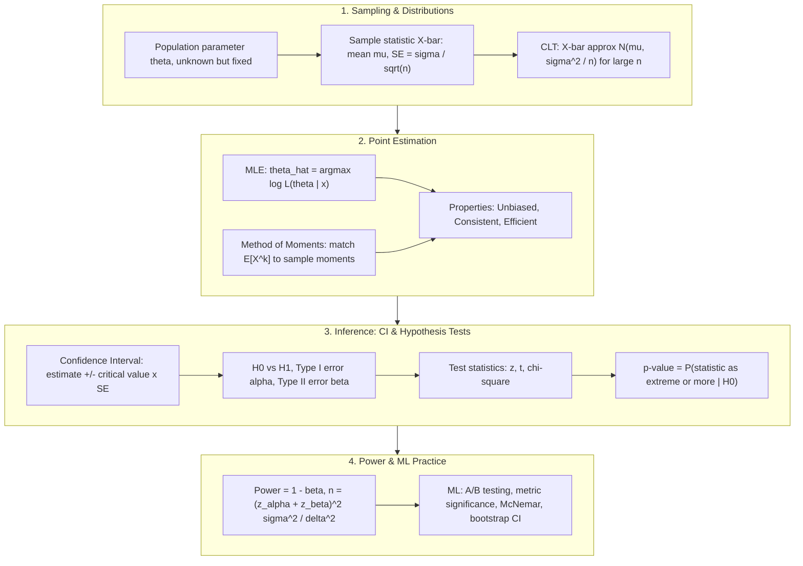

# 🌐 Statistical Inference & Hypothesis Testing: Distribution Families, MLE, CLT, p-Values, Confidence Intervals & Power Analysis

> **Core Executive Summary**: Statistical inference is the discipline of turning noisy data into calibrated decisions under uncertainty, and hypothesis testing is the engine that converts evidence into verdicts. This guide builds the complete pipeline: the distribution family toolbox (Normal, Chi-squared, t, F, Poisson, Bernoulli), the Central Limit Theorem that licenses large-sample inference, point estimation via Maximum Likelihood and the Method of Moments with the three golden properties (unbiasedness, consistency, efficiency), the hypothesis testing framework (H₀/H₁, Type I/II errors, p-value pitfalls, multiple comparisons), test selection among z / t / χ², confidence interval construction (analytic and Bootstrap), and power analysis with the sample size formula $n = (z_\alpha + z_\beta)^2 \sigma^2 / \delta^2$. Every concept is anchored back to ML practice: A/B testing, metric significance testing, and classifier comparison.

---

## 💡 Interactive Mermaid Architecture Flowchart



---

## 💡 Classic Interview Followups & Core Cheatsheet

* **Key Topic 1**: State the Central Limit Theorem precisely. Beyond what sample size can a t-test be safely approximated by a z-test?
  * *Standard Answer*: Let $X_1, \dots, X_n$ be i.i.d. with mean $\mu$ and finite variance $\sigma^2$. Then the standardized sample mean converges in distribution to the standard normal:
    $$\frac{\bar{X} - \mu}{\sigma / \sqrt{n}} \xrightarrow{d} \mathcal{N}(0, 1)$$
    The approximation improves at rate $\sqrt{n}$ and holds for *any* underlying distribution. With $n \geq 30$ the z-test is a common approximation, but the t-test remains exact for normal data of any size and is always safer. The assumption that must still hold is independence; for skewed or heavy-tailed data, larger $n$ is required.

> 💡 **Intuition**: Why does CLT hold? Averaging adds up everyone's independent fluctuations, and positive and negative deviations cancel — what remains is shaped only by the variance, which is exactly why the limit is a two-parameter bell curve. Flip a coin 100 times: the proportion of heads is bell-shaped not by magic, but because fluctuations cancel.
>
> 🎤 **Interview Answer**: "Takeaway: for any i.i.d. population with finite variance, the standardized sample mean converges to N(0,1) at rate √n. Why: independent fluctuations cancel in the average, leaving the shape determined only by mean and variance; independence must still hold. Example: the mean of U(0,1) samples looks nearly normal by n=12; at n≥30, t and z are practically indistinguishable."

* **Key Topic 2**: Derive the MLE of the Bernoulli parameter $p$ and prove its statistical properties.
  * *Standard Answer*: For $x_i \in \{0, 1\}$ with $P(X=1) = p$, the log-likelihood is $\ell(p) = \sum_i [x_i \ln p + (1-x_i) \ln(1-p)]$. Setting $\partial \ell / \partial p = 0$ yields $\hat{p} = \bar{X}$, the sample proportion. It is **unbiased** ($\mathbb{E}[\hat{p}] = p$), **consistent** (Law of Large Numbers, $\hat{p} \xrightarrow{p} p$), and **efficient** because its variance $p(1-p)/n$ attains the Cramér–Rao lower bound $1 / I(p)$ where the Fisher information is $I(p) = \frac{1}{p(1-p)}$.

> 💡 **Intuition**: MLE answers "which parameter makes the data I actually saw least surprising?" The log turns products into sums — numerically stable, monotonic, nicer derivatives — so maximizing log-likelihood ≡ minimizing negative log-likelihood; the cross-entropy loss in deep learning is literally an NLL.
>
> 🎤 **Interview Answer**: "Takeaway: the MLE of Bernoulli p is the sample proportion, p̂ = X̄. Why: set the derivative of ℓ(p) = Σ[xᵢ ln p + (1-xᵢ) ln(1-p)] to zero; it is unbiased, consistent (LLN), and efficient — variance p(1-p)/n attains the Cramér–Rao bound. Example: 3 conversions in 10 clicks gives p̂ = 0.3 with variance 0.3·0.7/10 = 0.021."

* **Key Topic 3**: Define Type I and Type II errors and derive the sample size formula for a one-sample test.
  * *Standard Answer*: Type I error $\alpha = P(\text{reject } H_0 \mid H_0 \text{ true})$; Type II error $\beta = P(\text{fail to reject } H_0 \mid H_1 \text{ true})$; power $= 1 - \beta$. For testing $H_0: \mu = \mu_0$ vs $H_1: \mu = \mu_0 + \delta$ with known variance $\sigma^2$, the required sample size is:
    $$n = \frac{(z_{\alpha} + z_{\beta})^2 \sigma^2}{\delta^2}$$
    (for a two-sided test, replace $z_\alpha$ by $z_{\alpha/2}$). Interpretation: doubling the detectable effect $\delta$ cuts the required sample size by 4x; increasing power from 0.8 to 0.9 adds about 30% more samples.

> 💡 **Intuition**: The sample size formula is like "how many shots to hit the target": z_α guards against false alarms (type I), z_β guards against missing the effect (type II, power), both squared against the noise variance σ² and the minimum detectable effect δ². Doubling δ quadruples the denominator, cutting n by 4 — finer effects cost 4× the samples.
>
> 🎤 **Interview Answer**: "Takeaway: n = (z_α + z_β)²σ²/δ². Why: the test statistic is normal under both H0 and H1; separate the two by z_α + z_β standard errors and solve for n (use z_{α/2} two-sided). Example: α=0.05, power 0.8 → detecting δ = σ needs n ≈ (1.64+0.84)² ≈ 7, detecting 0.1σ needs n ≈ 615."

* **Key Topic 4**: Why is a p-value commonly misread as $P(H_0 \mid \text{data})$? Explain the multiple comparison problem.
  * *Standard Answer*: The p-value is a *conditional* statement about the null: $p = P(\text{data as or more extreme} \mid H_0)$. It is **not** the probability that the null is true, nor the effect size, nor the reproducibility probability. Under $m$ independent tests at level $\alpha$, the family-wise error rate inflates to $\alpha_{\text{FWER}} = 1 - (1-\alpha)^m \approx m\alpha$. The **Bonferroni correction** rejects $H_0^{(i)}$ only when $p_i < \alpha / m$, which by Boole's inequality bounds $\text{FWER} \le \alpha$ — at the cost of power. FDR-based methods (Benjamini–Hochberg) are a less conservative alternative.

> 💡 **Intuition**: The p-value asks "in H0's universe, how likely is data this extreme?" It assumes nothing is going on, then measures how unlike that the data look. Reading it as P(H0|data) is a direction error — like confusing "probability a test comes back positive" with "probability you are sick" — the former needs a prior.
>
> 🎤 **Interview Answer**: "Takeaway: p = P(data or more extreme | H0) — not P(H0|data), not an effect size. Why: P(H0|data) needs a prior; with m tests the false-positive rate inflates to 1-(1-α)^m ≈ mα. Example: 20 features tested at α=0.05 give ≈64% chance of ≥1 false positive; Bonferroni tightens the threshold to 0.05/20 = 0.0025."

* **Key Topic 5**: When should you choose a z-test, a t-test, or a chi-squared test? Give one ML application for each.
  * *Standard Answer*: Use a **z-test** when the population variance is known (or $n$ is large and CLT applies) — e.g., testing whether a model's average latency exceeds a service-level agreement with known historical variance. Use a **t-test** when the variance is unknown and estimated from the sample — e.g., comparing click-through rates in an A/B test with small samples. Use a **chi-squared test** for categorical counts — e.g., testing independence between protected attributes and model predictions (fairness audits) or goodness-of-fit of a discretized score distribution.

> 💡 **Intuition**: Test selection is three questions: is the variance known? (yes → z, no → t); are the data counts? (yes → chi-squared). z and t are the same mean question under known vs unknown variance; chi-squared works on frequencies, not values.
>
> 🎤 **Interview Answer**: "Takeaway: known variance → z, unknown → t, counts → chi-squared. Why: t swaps σ for the sample estimate s and pays with heavier tails; χ² = Σ(O-E)²/E measures observed-vs-expected deviation. Example: latency SLA with known historical variance → z; small-sample A/B CTR → t; fairness audit of attribute×prediction independence → chi-squared."

---

## 📚 Section 1: The Distribution Family Toolbox & the Central Limit Theorem

### 1.1 Distribution Families and Parameter Relationships

Statistical inference begins with choosing the right probabilistic model for the data-generating process. Six families cover the vast majority of ML applications:

| Distribution | Notation | Support | Mean | Variance | Typical ML Use |
| :--- | :--- | :--- | :--- | :--- | :--- |
| **Normal** | $X \sim \mathcal{N}(\mu, \sigma^2)$ | $\mathbb{R}$ | $\mu$ | $\sigma^2$ | Model noise, errors, CLT limits |
| **Chi-squared** | $X \sim \chi^2(k)$ | $[0, \infty)$ | $k$ | $2k$ | Variance tests, goodness-of-fit |
| **Student's t** | $X \sim t(\nu)$ | $\mathbb{R}$ | $0$ (for $\nu > 1$) | $\frac{\nu}{\nu - 2}$ (for $\nu > 2$) | Mean inference with unknown $\sigma^2$ |
| **F** | $X \sim F(d_1, d_2)$ | $[0, \infty)$ | $\frac{d_2}{d_2 - 2}$ | $\frac{2 d_2^2 (d_1 + d_2 - 2)}{d_1 (d_2-2)^2 (d_2-4)}$ | ANOVA, comparing two variances |
| **Poisson** | $X \sim \text{Pois}(\lambda)$ | $\{0, 1, 2, \dots\}$ | $\lambda$ | $\lambda$ | Event counts, arrival rates |
| **Bernoulli** | $X \sim \text{Ber}(p)$ | $\{0, 1\}$ | $p$ | $p(1-p)$ | Binary labels, click events |

📖 **How to read this table**: watch the Mean/Variance columns — Normal and t share the same mean logic but differ in variance; Poisson has mean = variance; Bernoulli has variance p(1-p). The Support column drives test-statistic selection: counts → Poisson/χ², binary → Bernoulli proportions, continuous → Normal/t.

These families are connected by elegant generative relationships: a chi-squared with $k$ degrees of freedom is the sum of $k$ squared standard normals, $\chi^2(k) = \sum_{i=1}^k Z_i^2$; a Student's t is a standard normal divided by an independent scaled chi-squared, $t(\nu) = \frac{Z}{\sqrt{V/\nu}}$ with $V \sim \chi^2(\nu)$; an F distribution is a ratio of two independent chi-squareds, $F(d_1, d_2) = \frac{V_1 / d_1}{V_2 / d_2}$; a Binomial is the sum of $n$ independent Bernoullis; and the Poisson is the limit of a Binomial when $n \to \infty$, $p \to 0$, with $\lambda = np$. Recognizing these relationships lets you derive test statistics from first principles instead of memorizing them.

> 💡 **Intuition**: Six distributions form a generative pyramid: squared standard normals → chi-squared; a scaled chi-squared divided into a normal → t; a ratio of two chi-squareds → F; summing Bernoullis → Binomial; the Binomial limit → Poisson. Remember who is built from whom and you can re-derive every test statistic on the spot.
>
> 🎤 **Interview Answer**: "Takeaway: χ²(k) = ΣZᵢ², t(ν) = Z/√(V/ν), F = (V₁/d₁)/(V₂/d₂), Binomial = n Bernoullis, Poisson = Binomial limit as p→0. Why: distributions follow the data-generating process. Example: (n-1)s²/σ² ~ χ²(n-1), which is why variance tests use chi-squared."

### 1.2 The Central Limit Theorem and Large-Sample Approximation

The Central Limit Theorem is the workhorse of all frequentist inference. For i.i.d. samples with finite variance, the sampling distribution of the mean converges to a normal distribution no matter how skewed the population is:

$$\bar{X} \sim \text{approximately } \mathcal{N}\left(\mu, \frac{\sigma^2}{n}\right), \qquad \text{SE}(\bar{X}) = \frac{\sigma}{\sqrt{n}}$$

Two practical consequences follow. First, the standard error shrinks at rate $1/\sqrt{n}$: quadrupling the sample halves the uncertainty of the mean. Second, when $\sigma^2$ is unknown and replaced by the sample variance $s^2$, the exact sampling distribution is Student's t with $n - 1$ degrees of freedom — $\frac{\bar{X} - \mu}{s / \sqrt{n}} \sim t(n-1)$ — which has heavier tails than the normal and thus yields wider, more honest confidence intervals for small samples. For $n \geq 30$ the normal and t distributions are nearly indistinguishable, which justifies the "z-approximation" rule of thumb used in practice.

> 💡 **Intuition**: Averaging cancels fluctuations: X̄ is the mean of n independent wobbles, positives and negatives cancel, and the remaining uncertainty is captured by σ²/n — so the limit must be the two-parameter bell curve. SE = σ/√n means quadrupling the sample only halves the uncertainty: precision is expensive.
>
> 🎤 **Interview Answer**: "Takeaway: X̄ ≈ N(μ, σ²/n) with SE = σ/√n; at n ≥ 30 the z-approximation is fine. Why: independent fluctuations cancel, leaving a distribution determined only by mean and variance; t has heavier tails and is safer for small n. Example: 30 coin flips → SE of the head proportion ≈ 0.5/√30 ≈ 0.09; 4× the data (n=120) only halves it to ≈ 0.046."

---

## 📚 Section 2: Point Estimation — MLE & Method of Moments

### 2.1 Maximum Likelihood Estimation

Given i.i.d. observations $x_1, \dots, x_n$ from a density $f(x; \theta)$, the likelihood is the probability of the observed data viewed as a function of the parameter. Maximizing its logarithm is numerically stable and mathematically equivalent:

$$\hat{\theta}_{\text{MLE}} = \arg\max_{\theta} \sum_{i=1}^{n} \ln f(x_i; \theta)$$

**Bernoulli example**: with labels $x_i \in \{0, 1\}$, $\ell(p) = \bar{X} \ln p + (1 - \bar{X}) \ln(1-p)$, whose maximum is at $\hat{p} = \bar{X}$ — the sample proportion. Note that MLE of logistic regression is exactly this idea extended to a conditional probability $p(x) = \sigma(w^T x)$.

> 💡 **Intuition**: MLE picks the parameter that makes the observed data least surprising. Log gives three wins — products become sums (numerically stable), monotonicity keeps the optimum, derivatives stay clean — so maximizing log-likelihood ≡ minimizing NLL; the cross-entropy loss is just NLL under another name.
>
> 🎤 **Interview Answer**: "Takeaway: MLE maximizes the probability of the observed data, equivalent to minimizing negative log-likelihood. Why: the product of n densities underflows for large n; log turns it into a sum and is monotonic, so the maximizer is unchanged. Example: 3 heads in 10 flips → p³(1-p)⁷ is maximized at p = 0.3, the sample proportion; logistic regression + cross-entropy is the same framework."

### 2.2 The Three Golden Properties and the Method of Moments

| Property | Definition | Check for $\hat{p} = \bar{X}$ |
| :--- | :--- | :--- |
| **Unbiasedness** | $\mathbb{E}[\hat{\theta}] = \theta$ | $\mathbb{E}[\hat{p}] = \frac{1}{n}\sum \mathbb{E}[X_i] = p$ ✓ |
| **Consistency** | $\hat{\theta} \xrightarrow{p} \theta$ as $n \to \infty$ | Law of Large Numbers ✓ |
| **Efficiency** | $\text{Var}(\hat{\theta})$ attains the Cramér–Rao bound | $\text{Var}(\hat{p}) = \frac{p(1-p)}{n} = \frac{1}{I(p)}$ ✓ |

📖 **How to read this table**: the three rows live on three time scales — unbiasedness is about expectations (no systematic bias), consistency about n → ∞ (more data, closer), efficiency about variance (smallest variance among unbiased estimators). The classic interview question 'why is MLE efficient' is answered by: it attains the Cramér–Rao bound.

The **Cramér–Rao lower bound** states that no unbiased estimator can have variance below the inverse Fisher information:

$$\text{Var}(\hat{\theta}) \geq \frac{1}{I(\theta)}, \qquad I(\theta) = -\mathbb{E}\left[ \frac{\partial^2 \ln L}{\partial \theta^2} \right]$$

The **Method of Moments** is a simpler alternative: equate theoretical moments to sample moments, $\mathbb{E}[X^k] = \frac{1}{n}\sum_i x_i^k$, and solve for $\theta$. For the normal distribution it yields $\hat{\mu} = \bar{X}$ and $\hat{\sigma}^2 = \frac{1}{n}\sum (x_i - \bar{X})^2$ — the same as MLE. For many distributions the two estimators coincide; MLE is preferred in modern practice because of its invariance, asymptotic efficiency, and automatic connection to the Fisher information (which also gives standard errors).

> 💡 **Intuition**: The three properties are a statistic's report card: unbiased = no systematic miss, consistent = converges with data, efficient = best use of every sample. Cramér–Rao says no unbiased estimator can beat variance 1/I(θ); Fisher information measures how persuasive the data are about θ — more information, sharper estimates.
>
> 🎤 **Interview Answer**: "Takeaway: MLE is unbiased, consistent, efficient, hitting the Cramér–Rao bound 1/I(θ). Why: linearity of expectation gives unbiasedness, the LLN gives consistency, Cramér–Rao gives efficiency. Example: p̂ = X̄ has variance p(1-p)/n = 1/I(p), exactly the theoretical floor; the Method of Moments is simpler but generally less efficient."

---

## 📚 Section 3: Hypothesis Testing Framework — Errors, p-Values & Multiple Comparisons

### 3.1 The Decision-Theoretic Framework

A hypothesis test pits a null hypothesis $H_0$ (status quo, e.g. $H_0: \mu = \mu_0$) against an alternative $H_1$ (e.g. $H_1: \mu \neq \mu_0$). The decision to reject or not is based on a test statistic whose distribution under $H_0$ is known:

| | $H_0$ true | $H_1$ true |
| :--- | :--- | :--- |
| **Fail to reject $H_0$** | Correct ✓ | **Type II error** $\beta$ |
| **Reject $H_0$** | **Type I error** $\alpha$ | Correct ✓ (power $= 1 - \beta$) |

📖 **How to read this table**: read the diagonals — top-left (not rejecting a true H0) and bottom-right (rejecting a false H0) are correct; β is the false negative (letting the guilty go), α the false positive (convicting the innocent); α is fixed by convention, β shrinks as n grows — the two trade off.

The p-value is the probability, computed under $H_0$, of observing a statistic as extreme or more extreme than the one observed:

$$p = P(T \geq t_{\text{obs}} \mid H_0)$$

**Common p-value fallacies**: (1) $p$ is *not* $P(H_0 \mid \text{data})$ — that quantity requires a prior via Bayes' theorem; (2) a small $p$ does not measure effect size (a tiny effect is detectable with enough data); (3) $p$ is not the probability that the result will replicate.

> 💡 **Intuition**: The p-value is an H0-conditioned tail probability: it defends H0 first, then checks how unlikely the data are. Reading it as P(H0|data) reverses the direction — like confusing 'probability of a positive test' with 'probability of being sick' — P(H0|data) requires a prior. α is the false-positive gate; β (and power 1-β) is the false-negative gate.
>
> 🎤 **Interview Answer**: "Takeaway: p = P(data or more extreme | H0); type I α = reject a true H0, type II β = fail to reject a false H0, power = 1-β. Why: p carries no prior information; α and β trade off, mediated by sample size. Example: p = 0.03 only means 'a 3% chance of such data if H0 were true' — not '97% chance H0 is false'."

### 3.2 Multiple Comparisons and Corrections

When $m$ hypotheses are tested simultaneously, the chance of at least one false positive explodes: $\alpha_{\text{FWER}} = 1 - (1-\alpha)^m \approx m\alpha$. Testing 20 features at $\alpha = 0.05$ gives a ~64% chance of at least one spurious finding. **Bonferroni** rejects $H_0^{(i)}$ only if $p_i \leq \alpha/m$ (e.g. $\alpha = 0.0025$ for 20 tests), guaranteeing $\text{FWER} \leq \alpha$ by Boole's inequality. The trade-off is power; the **Benjamini–Hochberg FDR** procedure controls the expected proportion of false discoveries instead, and is the default for large-scale testing such as genome-wide or feature-importance screens.

> 💡 **Intuition**: The more tests, the more likely one false positive — 20 tests at 5% each give ≈64% chance of at least one, exactly like buying 20 lottery tickets with 5% odds. Bonferroni dilutes the stakes: each ticket must hit 0.25% to count.
>
> 🎤 **Interview Answer**: "Takeaway: m tests inflate the family-wise error rate to 1-(1-α)^m ≈ mα; Bonferroni rejects only when pᵢ ≤ α/m. Why: Boole's inequality bounds FWER ≤ α, at the cost of power. Example: 20 features at α=0.05 → ≈64% chance of ≥1 false positive; Bonferroni threshold 0.0025; BH-FDR is the looser default for feature screens."

---

## 📚 Section 4: Test Selection — z / t / χ² & Power Analysis

### 4.1 Choosing the Right Test Statistic

| Criterion | **z-test** | **t-test** | **Chi-squared test** |
| :--- | :--- | :--- | :--- |
| **What it tests** | Mean with known $\sigma^2$ (or large $n$) | Mean with unknown $\sigma^2$, small $n$ | Variance, independence, goodness-of-fit |
| **Test statistic** | $z = \frac{\bar{X} - \mu_0}{\sigma / \sqrt{n}}$ | $t = \frac{\bar{X} - \mu_0}{s / \sqrt{n}}$ | $\chi^2 = \sum_i \frac{(O_i - E_i)^2}{E_i}$ |
| **Null distribution** | $\mathcal{N}(0, 1)$ | $t(n-1)$ | $\chi^2(\text{df})$ |
| **Key assumptions** | Known variance or CLT validity | Approximately normal data, independence | Counts (not proportions), expected cell counts $\geq 5$ |
| **ML use case** | Latency SLA with known variance | A/B test CTR with small samples | Fairness/independence audits, GOF of score bins |

📖 **How to read this table**: two criteria decide — is the variance known? (z vs t) and are the data counts? (chi-squared). The null-distribution column separates them: N(0,1), t(n-1), χ²(df); the classic ML question is 'why t, not z, for small-sample A/B tests?'

> 💡 **Intuition**: z and t are the same mean problem in two versions: z knows the true variance (idealized), t estimates it from data (realistic), paying with heavier tails and n-1 degrees of freedom. Chi-squared handles counts: Σ(O-E)²/E squares each cell's deviation from expectation, normalizes, and sums — more deviation from independence means a bigger statistic.
>
> 🎤 **Interview Answer**: "Takeaway: known variance → z, unknown → t, counts → chi-squared. Why: z/t test means — t's tails account for estimating the variance; χ² = Σ(O-E)²/E measures observed-vs-expected deviation. Example: CTR in a small-sample A/B test → t; independence audit between attribute and predictions → chi-squared; latency SLA with known historical variance → z."

### 4.2 Power Analysis and Sample Size

Power is the probability of correctly rejecting $H_0$ when the alternative holds, $\text{Power} = 1 - \beta$. For testing $H_0: \mu = \mu_0$ against $H_1: \mu = \mu_0 + \delta$ with known variance, the sample size required to achieve type I error $\alpha$ and type II error $\beta$ is:

$$n = \frac{(z_{\alpha} + z_{\beta})^2 \sigma^2}{\delta^2}$$

For a two-sided test use $z_{\alpha/2}$. With the standard target of $\alpha = 0.05$, $\text{Power} = 0.8$ ($z_\beta = 0.84$), detecting a difference of one standard deviation ($\delta = \sigma$) requires only $n \approx (1.64 + 0.84)^2 \approx 7$ per group, while detecting $0.1\sigma$ requires $n \approx 615$ — power analysis is why underpowered experiments are a waste of resources.

> 💡 **Intuition**: Power = 'probability of detecting a problem when it exists.' Read the formula as a signal-to-noise ratio: (z_α+z_β)² is the sum of the two gate quantiles, δ²/σ² is effect strength relative to noise; smaller effects or noisier data demand more samples to fish the signal out.
>
> 🎤 **Interview Answer**: "Takeaway: power = 1-β = P(correctly reject a false H0); n = (z_α+z_β)²σ²/δ². Why: the statistic is normal under both hypotheses; separating them by z_α+z_β standard errors and solving gives n (two-sided → z_{α/2}). Example: α=0.05, power 0.8: detecting 0.1σ needs n≈615, but 1σ needs only n≈7."

### 4.3 Connection to Machine Learning

Hypothesis testing is not an ivory-tower exercise; it is the quantitative backbone of ML decision-making:

- **A/B testing**: comparing a new model or feature against the champion using t-tests on conversion/CTR, with pre-registered sample sizes from the power formula.
- **Metric significance**: bootstrap confidence intervals around AUC, precision, or NDCG tell you whether an accuracy gain of +0.3% is real signal or sampling noise.
- **Classifier comparison**: **McNemar's test** (a chi-squared-type test on the discordant pairs of two classifiers) checks whether two models differ significantly on the same test set — the standard alternative to naive accuracy comparison.
- **Hyperparameter search**: treating every config as a hypothesis invites the multiple-comparison trap; FDR correction or nested cross-validation keeps the search honest.

> 💡 **Intuition**: In ML, tests aren't decoration: every +0.3% metric gain asks 'signal or noise?', and every hyperparameter config is one hypothesis. The bootstrap treats the observed dataset as a mini-population and resamples it, adapting naturally to metrics like AUC or NDCG that have no closed-form variance.
>
> 🎤 **Interview Answer**: "Takeaway: use t/bootstrap for metric significance, McNemar for classifier comparison, FDR for hyperparameter sweeps. Why: AUC has no closed-form SE — resample 10,000 times and take the 2.5%/97.5% percentiles; McNemar only looks at discordant pairs. Example: +0.3% accuracy with bootstrap CI [-0.1%, +0.7%] containing 0 → not significant; scanning 1,000 features → BH-FDR."

---

## 📚 Section 5: Confidence Intervals — Analytic & Bootstrap

### 5.1 Analytic Construction

A confidence interval is a random interval that covers the true parameter with a pre-specified probability (the coverage/confidence level). For the population mean with known variance:

$$\bar{X} \pm z_{\alpha/2} \cdot \frac{\sigma}{\sqrt{n}}$$

and with unknown variance (exact for normal data):

$$\bar{X} \pm t_{\alpha/2, \, n-1} \cdot \frac{s}{\sqrt{n}}$$

The correct interpretation is frequentist: if the experiment were repeated many times, ~95% of the constructed intervals would contain the true $\mu$. It is **not** "the probability that $\mu$ lies in this interval" — $\mu$ is fixed, the interval is random.

> 💡 **Intuition**: A confidence interval is a sighting device, not the target: μ is a fixed unknown point, and each experiment builds a fresh random ring around it. A 95% CI means 100 experiments → ~95 rings enclose the target — the ring moves, the target doesn't. The shape is always 'point estimate ± critical value × SE'.
>
> 🎤 **Interview Answer**: "Takeaway: known variance → X̄ ± z_{α/2}·σ/√n; unknown → X̄ ± t_{α/2,n-1}·s/√n; ~95% of repeated intervals cover the true μ. Why: the interval is the random object and μ is fixed — coverage is a long-run property. Example: X̄=1.2, SE≈0.113, n=50 → 95% CI ≈ [0.98, 1.42]; repeat the experiment 100 times and ≈95 intervals trap μ."

### 5.2 Bootstrap Confidence Intervals

When no closed-form standard error exists (median, AUC, correlation), the **bootstrap** provides a non-parametric alternative: resample the data with replacement $B$ times (typically $B = 10{,}000$), recompute the statistic each time, and take the $2.5\%$ and $97.5\%$ percentiles of the bootstrap distribution as the 95% CI. The bootstrap is "plug-and-play," makes no normality assumption, and automatically adapts to skewed statistics — which is why it is the default tool for reporting uncertainty in ML metrics.

> 💡 **Intuition**: Bootstrap's bet: 'if the observed sample is our little universe, resample from it with replacement, recompute the statistic, and watch how much it wobbles.' No mathematical distribution for the statistic is needed — the data do the inference — so AUC, medians, and correlations all get honest intervals.
>
> 🎤 **Interview Answer**: "Takeaway: resample with replacement B=10,000 times, take the 2.5%/97.5% percentiles as the 95% CI. Why: the empirical distribution approximates the truth, so the resampling wobble approximates the sampling distribution. Example: AUC over 50 samples bootstrapped to [0.61, 0.78] with no normality assumption; 4× the data halves the width (SE ∝ 1/√n)."

---

## 🐍 Pure Numpy Implementation: One-Sample t-Test & Bootstrap Confidence Interval

```python
import numpy as np
from math import erf, sqrt

def one_sample_t_test(x: np.ndarray, mu0: float = 0.0):
    """Pure Numpy one-sample t-test: H0: mu = mu0 vs H1: mu != mu0.
    p-value uses the standard-normal approximation of the t distribution
    (exact as n -> infinity; use scipy.stats.t for the exact small-n p-value)."""
    n = len(x)
    x_bar = np.mean(x)
    s = np.std(x, ddof=1)                      # sample std (unbiased denominator)
    se = s / np.sqrt(n)
    t_stat = (x_bar - mu0) / se                 # t = (X-bar - mu0) / (s / sqrt(n))
    p_value = 2.0 * (1.0 - 0.5 * (1.0 + erf(abs(t_stat) / sqrt(2.0))))
    return t_stat, p_value


def bootstrap_ci(x: np.ndarray, statistic=np.mean, n_boot: int = 10000,
                 alpha: float = 0.05, seed: int = 42):
    """Pure Numpy percentile Bootstrap confidence interval."""
    rng = np.random.default_rng(seed)
    boots = rng.choice(x, size=(n_boot, len(x)), replace=True)
    boot_stats = np.array([statistic(b) for b in boots])
    lo = np.percentile(boot_stats, 100 * alpha / 2.0)
    hi = np.percentile(boot_stats, 100 * (1.0 - alpha / 2.0))
    return lo, hi


if __name__ == "__main__":
    np.random.seed(2026)
    data = np.random.normal(loc=1.2, scale=0.8, size=50)

    t_stat, p = one_sample_t_test(data, mu0=1.0)
    print("✅ t =", round(t_stat, 4), "| p-value =", round(p, 4))

    ci_lo, ci_hi = bootstrap_ci(data, statistic=np.mean)
    se = np.std(data, ddof=1) / np.sqrt(len(data))
    analytic = (np.mean(data) - 1.96 * se, np.mean(data) + 1.96 * se)
    print("✅ Bootstrap 95% CI:", (round(ci_lo, 4), round(ci_hi, 4)))
    print("✅ Analytic 95% CI: ", (round(analytic[0], 4), round(analytic[1], 4)))
```

---

## 📝 Takeaways & Engineering Best Practices

1. **Know the family**: choose the distribution (and hence the test statistic) from the data-generating process — counts → Poisson/χ², binary outcomes → Bernoulli proportions, continuous measurements → Normal/t.
2. **Check the sample size first**: compute the power analysis formula $n = (z_{\alpha} + z_{\beta})^2 \sigma^2 / \delta^2$ *before* running an experiment; underpowered studies are the #1 source of false negatives.
3. **Never report bare p-values**: pair every p-value with the effect size and a confidence interval — bootstrap CIs for metrics, analytic CIs for means.
4. **Correct for multiplicity**: apply Bonferroni or Benjamini–Hochberg whenever you sweep hyperparameters, features, or metrics; otherwise the "significant" findings are mostly noise.
5. **Default to t and bootstrap**: when $\sigma^2$ is unknown (always, in practice) use the t distribution; when no closed-form SE exists, bootstrap — both are cheap, principled, and exact to first order in large samples.

> 💡 **Intuition**: The whole guide is one pipeline: pick the family → size the experiment → test + interval → correct for multiplicity. Every formula reduces to 'signal vs. noise.'
>
> 🎤 **Interview Answer**: "Takeaway: the four interview pillars — CLT (why the z-approximation works), MLE (the sample proportion), p-values (conditional probability, not P(H0|data)), and CIs (coverage interpretation). Why: fluctuation cancellation → CLT, logs → MLE, conditioning → p-values, repeated sampling → intervals. Example: report any metric gain with a bootstrap interval and apply Bonferroni/FDR to any sweep."
