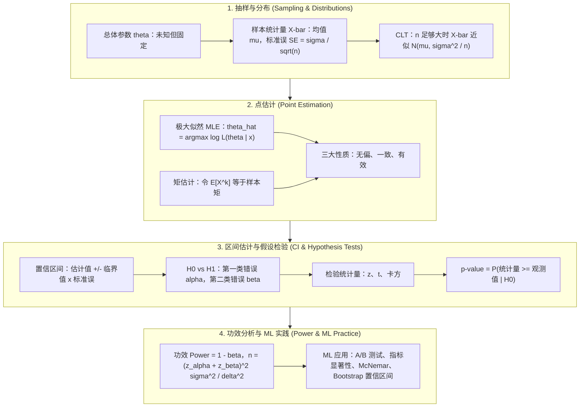

# 🌐 统计推断与假设检验：分布族、极大似然、中心极限定理、p-value、置信区间与功效分析全景

> **核心摘要**：统计推断是将带噪声的数据转化为经过校准的决策的学科，而假设检验是把证据转换为结论的引擎。本指南构建完整链路：常用分布族工具箱（正态、χ²、t、F、泊松、伯努利）；为大样本推断背书的**中心极限定理 (CLT)**；经由**极大似然估计 (MLE)** 与**矩估计**实现点估计并给出无偏性、一致性、有效性三大黄金性质；假设检验完整框架（H₀/H₁、两类错误、p-value 误区与多重比较）；z / t / χ² 检验的选型对比；置信区间的解析解与 **Bootstrap** 构建；以及功效分析与样本量公式 $n = (z_\alpha + z_\beta)^2 \sigma^2 / \delta^2$。每个概念都锚定回机器学习实践：A/B 测试、评估指标显著性检验与分类器对比。

---

## 💡 交互式 Mermaid 架构流程图



---

## 💡 经典面试追问与考点速查

* **考点 1**：精确陈述中心极限定理 (CLT)。样本量超过多少时 t 检验可以安全地近似为 z 检验？
  * *标准回答*：设 $X_1, \dots, X_n$ 为独立同分布 (i.i.d.) 随机变量，均值 $\mu$、有限方差 $\sigma^2$，则标准化样本均值依分布收敛于标准正态：
    $$\frac{\bar{X} - \mu}{\sigma / \sqrt{n}} \xrightarrow{d} \mathcal{N}(0, 1)$$
    近似以 $\sqrt{n}$ 的速度改善，且对**任意**底层分布成立。经验上 $n \geq 30$ 时常用 z 检验近似，但对正态数据而言 t 检验对任意样本量都精确、永远更稳妥。必须仍然成立的假设是**独立性**；对于偏态或重尾数据需要更大的 $n$。

> 💡 **直观理解**: CLT 的"为什么"在于平均:每个 $X_i$ 的随机波动互相独立,加在一起后正负偏差互相抵消,剩余的形状只由方差这一阶统计量主导——这正是极限正态只含 $\mu$ 与 $\sigma^2$ 两个参数的原因。抛 100 次硬币的正面比例呈钟形,不是硬币有魔法,而是波动抵消的结果。
>
> 🎤 **面试速答**: "结论:对任意 i.i.d. 总体,标准化样本均值收敛到标准正态,收敛速度 $\sqrt{n}$。原理:独立波动平均后互相抵消,极限形状只由均值方差决定;独立性必须成立。例子:均匀分布 $U(0,1)$ 的均值,n=12 时抽样分布已近似钟形;n≥30 时 t 与 z 几乎不可分。"

* **考点 2**：推导伯努利分布参数 $p$ 的极大似然估计 (MLE)，并证明其统计性质。
  * *标准回答*：对 $x_i \in \{0, 1\}$，$P(X=1) = p$，对数似然为 $\ell(p) = \sum_i [x_i \ln p + (1-x_i) \ln(1-p)]$。令 $\partial \ell / \partial p = 0$ 得 $\hat{p} = \bar{X}$，即样本比例。它**无偏**（$\mathbb{E}[\hat{p}] = p$）、**一致**（大数定律，$\hat{p} \xrightarrow{p} p$）、且**有效**：其方差 $p(1-p)/n$ 恰为 Cramér–Rao 下界 $1/I(p)$，其中 Fisher 信息 $I(p) = \frac{1}{p(1-p)}$。

> 💡 **直观理解**: MLE 的直觉是"选一个参数,让手头这批数据出现的概率最大"。为什么取 log?连乘变连加,数值稳定、导数好求,而 log 单调不减,最大值点不变。最小化负对数似然 (NLL) 只是把最大化翻个符号——深度学习里的交叉熵损失本质就是 NLL。
>
> 🎤 **面试速答**: "结论:伯努利参数 $p$ 的 MLE 就是样本比例 $\hat{p} = \bar{X}$。原理:对数似然对 $p$ 求导置零即得;它无偏($\mathbb{E}[\hat{p}]=p$)、一致(大数定律)、有效(方差 $p(1-p)/n$ 达到 Cramér–Rao 下界)。例子:10 次点击 3 次转化,$\hat{p}=0.3$,方差 $0.3\times0.7/10=0.021$。"

* **考点 3**：定义第一类错误与第二类错误，并推导单样本检验的样本量公式。
  * *标准回答*：第一类错误 $\alpha = P(\text{拒绝 } H_0 \mid H_0 \text{ 为真})$；第二类错误 $\beta = P(\text{未拒绝 } H_0 \mid H_1 \text{ 为真})$；功效 $\text{Power} = 1 - \beta$。检验 $H_0: \mu = \mu_0$ 对 $H_1: \mu = \mu_0 + \delta$、方差 $\sigma^2$ 已知时，所需样本量为：
    $$n = \frac{(z_{\alpha} + z_{\beta})^2 \sigma^2}{\delta^2}$$
    （双侧检验将 $z_\alpha$ 换成 $z_{\alpha/2}$）。解读：可检测效应 $\delta$ 翻倍则样本量降至 1/4；功效从 0.8 提到 0.9 约需多 30% 样本。

> 💡 **直观理解**: 样本量公式像"打靶需要多少发子弹":$z_\alpha$ 是控制"冤枉好人"(误拒 $H_0$)的临界分位,$z_\beta$ 是控制"漏掉坏人"(功效)的分位,两者平方后乘上噪声方差 $\sigma^2$,再除以最小可检测差异 $\delta^2$。差异翻倍,分母变 4 倍,样本量降为 1/4——想检测更细的效应就要花 4 倍的样本。
>
> 🎤 **面试速答**: "结论:$n = (z_\alpha+z_\beta)^2\sigma^2/\delta^2$。原理:$H_0$ 与 $H_1$ 下统计量各是一个正态,让两者拉开恰好 $z_\alpha+z_\beta$ 个标准误,反解出 n;双侧检验把 $z_\alpha$ 换成 $z_{\alpha/2}$。例子:$\alpha=0.05$、功效 0.8($z_\beta=0.84$)时,检测 $\delta=\sigma$ 只需 $n\approx(1.64+0.84)^2\approx7$,检测 $0.1\sigma$ 需 $n\approx615$。"

* **考点 4**：为什么 p-value 经常被误读为 $P(H_0 \mid \text{data})$？解释多重比较问题。
  * *标准回答*：p-value 是关于原假设的条件陈述：$p = P(\text{观测到当前或更极端数据} \mid H_0)$。它**不是**原假设为真的概率，也不是效应量，更不是结果可复现的概率。当 $m$ 次检验均以 $\alpha$ 水平进行时，族错误率膨胀为 $\alpha_{\text{FWER}} = 1 - (1-\alpha)^m \approx m\alpha$。**Bonferroni 校正**仅当 $p_i < \alpha / m$ 时拒绝 $H_0^{(i)}$，由 Boole 不等式保证 $\text{FWER} \le \alpha$——代价是功效。FDR 方法（Benjamini–Hochberg）控制错误发现的期望比例，是不那么保守的替代方案。

> 💡 **直观理解**: p-value 是"在原假设的宇宙里,看到这么极端结果的概率"——它先假设什么都没发生,再看数据有多不像"什么都没发生"。把 $P(\text{data}|H_0)$ 当成 $P(H_0|\text{data})$ 是方向性错误,就像把"检查出阳性的概率"当成"得病的概率"。
>
> 🎤 **面试速答**: "结论:$p = P(\text{数据或更极端}|H_0)$,不是 $P(H_0|data)$,也不是效应量。原理:$P(H_0|data)$ 需要先验;$m$ 次检验的族错误率膨胀为 $1-(1-\alpha)^m \approx m\alpha$。例子:20 个特征各按 0.05 检验,至少一个假阳性概率约 64%;Bonferroni 把阈值压到 0.05/20 = 0.0025。"

* **考点 5**：z 检验、t 检验与卡方检验分别在什么场景下使用？各举一个机器学习中的应用。
  * *标准回答*：**z 检验**用于总体方差已知（或 $n$ 大、CLT 生效）的情形——例如在历史方差已知时检验模型平均延迟是否违反服务等级协议 (SLA)。**t 检验**用于方差未知、需用样本估计的情形——例如小样本 A/B 测试中比较点击率 (CTR)。**卡方检验**用于类别计数——例如检验受保护属性与模型预测是否独立（公平性审计），或对离散化分数分布做拟合优度检验。

> 💡 **直观理解**: 选检验就是问三个问题:方差知道吗?(知道→z,不知道→t);数据是计数吗?(是→卡方)。z 与 t 是同一个均值问题在"方差已知/未知"下的两个版本,卡方则处理频数而非数值。
>
> 🎤 **面试速答**: "结论:方差已知用 z,未知用 t,类别计数用卡方。原理:t 用样本方差 $s$ 替代 $\sigma$,尾部更厚,小样本更诚实;卡方统计量 $\sum(O-E)^2/E$ 度量观测与期望频数的偏离。例子:延迟历史方差已知→z 检验 SLA;小样本 A/B 的 CTR→t 检验;公平性审计(属性×预测独立性)→卡方检验。"

---

## 📚 第一章：常用分布族与中心极限定理

### 1.1 常用分布族与参数关系总表

统计推断的第一步是为数据生成过程选择合适的概率模型。以下 6 个分布族覆盖了绝大多数 ML 应用：

| 分布 | 记号 | 支撑集 | 均值 | 方差 | 典型 ML 用途 |
| :--- | :--- | :--- | :--- | :--- | :--- |
| **正态** | $X \sim \mathcal{N}(\mu, \sigma^2)$ | $\mathbb{R}$ | $\mu$ | $\sigma^2$ | 模型噪声、误差项、CLT 极限 |
| **卡方** | $X \sim \chi^2(k)$ | $[0, \infty)$ | $k$ | $2k$ | 方差检验、拟合优度 |
| **t 分布** | $X \sim t(\nu)$ | $\mathbb{R}$ | $0$（$\nu > 1$ 时） | $\frac{\nu}{\nu - 2}$（$\nu > 2$ 时） | 方差未知时的均值推断 |
| **F 分布** | $X \sim F(d_1, d_2)$ | $[0, \infty)$ | $\frac{d_2}{d_2 - 2}$ | $\frac{2 d_2^2 (d_1 + d_2 - 2)}{d_1 (d_2-2)^2 (d_2-4)}$ | 方差分析 ANOVA、两方差比较 |
| **泊松** | $X \sim \text{Pois}(\lambda)$ | $\{0, 1, 2, \dots\}$ | $\lambda$ | $\lambda$ | 事件计数、到达速率 |
| **伯努利** | $X \sim \text{Ber}(p)$ | $\{0, 1\}$ | $p$ | $p(1-p)$ | 二分类标签、点击事件 |

📖 **怎么读这张表**: 重点对比"均值/方差"两列——正态与 t 均值逻辑相同、方差不同;泊松均值 = 方差;伯努利方差 = p(1-p)。"支撑集"列决定检验统计量选型:计数 → 泊松/卡方,二值 → 伯努利比例,连续 → 正态/t。

各分布之间由优雅的生成关系相互连接：自由度为 $k$ 的卡方分布是 $k$ 个标准正态的平方和 $\chi^2(k) = \sum_{i=1}^k Z_i^2$；t 分布是标准正态除以独立的缩放卡方 $t(\nu) = \frac{Z}{\sqrt{V/\nu}}$（$V \sim \chi^2(\nu)$）；F 分布是两个独立卡方的比值 $F(d_1, d_2) = \frac{V_1 / d_1}{V_2 / d_2}$；二项分布是 $n$ 个独立伯努利之和；泊松分布是 $n \to \infty$、$p \to 0$ 且 $\lambda = np$ 时二项分布的极限。掌握这些关系，就能从第一性原理推导检验统计量，而非死记硬背。

> 💡 **直观理解**: 六个分布是一座"生成关系金字塔":标准正态平方和 → 卡方;卡方除以自由度后与正态相除 → t;两个卡方比值 → F;伯努利累加 → 二项;二项取极限 → 泊松。记住"谁是谁的组成部分",检验统计量的分布就能现推,不用背。
>
> 🎤 **面试速答**: "结论:$\chi^2(k) = \sum_{i=1}^k Z_i^2$、$t(\nu) = Z/\sqrt{V/\nu}$、$F = \frac{V_1/d_1}{V_2/d_2}$、二项 = n 个伯努利之和、泊松 = 二项在 p→0 的极限。原理:分布由数据生成过程决定。例子:$(n-1)s^2/\sigma^2 \sim \chi^2(n-1)$,所以方差检验用卡方。"

### 1.2 中心极限定理与大样本近似

CLT 是频率学派推断的支柱。对方差有限的 i.i.d. 样本，无论总体多么偏斜，样本均值的抽样分布都收敛于正态：

$$\bar{X} \sim \text{近似 } \mathcal{N}\left(\mu, \frac{\sigma^2}{n}\right), \qquad \text{SE}(\bar{X}) = \frac{\sigma}{\sqrt{n}}$$

由此产生两个实践结论。第一，标准误以 $1/\sqrt{n}$ 的速率收缩：样本量增至 4 倍，均值不确定性减半。第二，当 $\sigma^2$ 未知、以样本方差 $s^2$ 替代时，精确的抽样分布是自由度为 $n-1$ 的 Student t 分布——$\frac{\bar{X} - \mu}{s / \sqrt{n}} \sim t(n-1)$——其尾部比正态更厚，因而小样本下给出更宽、更诚实的置信区间。当 $n \geq 30$ 时正态与 t 分布几乎不可分辨，这正是实践中"z 近似"经验法则的依据。

> 💡 **直观理解**: CLT 的直觉是"波动互相抵消":$\bar{X}$ 是 n 个独立波动的平均,正负偏差相消后,剩余不确定性只由方差 $\sigma^2/n$ 刻画——所以极限形状必然是只由均值、方差参数化的钟形。SE $= \sigma/\sqrt{n}$ 说明样本量翻 4 倍,不确定性才减半:精度很贵。
>
> 🎤 **面试速答**: "结论:$\bar{X} \approx \mathcal{N}(\mu, \sigma^2/n)$,SE $= \sigma/\sqrt{n}$,n≥30 可用 z 近似 t。原理:独立随机波动平均后互相抵消,极限分布只由均值与方差决定;t 尾部更厚,小样本更保守。例子:掷硬币 30 次,正面比例 SE ≈ 0.5/√30 ≈ 0.09;样本量翻 4 倍(n=120)SE 才减半到 ≈ 0.046。"

---

## 📚 第二章：点估计——极大似然与矩估计

### 2.1 极大似然估计 (MLE)

给定来自密度 $f(x; \theta)$ 的 i.i.d. 观测 $x_1, \dots, x_n$，似然函数是把观测数据的概率视为参数的函数。最大化其对数值在数值上更稳定、数学上等价：

$$\hat{\theta}_{\text{MLE}} = \arg\max_{\theta} \sum_{i=1}^{n} \ln f(x_i; \theta)$$

**伯努利示例**：对标签 $x_i \in \{0, 1\}$，$\ell(p) = \bar{X} \ln p + (1 - \bar{X}) \ln(1-p)$，其最大值在 $\hat{p} = \bar{X}$——即样本比例处取得。注意，逻辑回归的 MLE 正是把这一思想扩展到条件概率 $p(x) = \sigma(w^T x)$。

> 💡 **直观理解**: MLE 的直觉:参数是谁,让"看到这堆数据"变得最不意外。log 有三重好处——连乘变连加(数值稳定)、单调(极值点不变)、导数优雅;所以最大化 log 似然 ≡ 最小化 NLL,深度学习里的交叉熵损失就是 NLL 的别名。
>
> 🎤 **面试速答**: "结论:MLE = 找让观测数据概率最大的参数,等价于最小化负对数似然。原理:连乘的似然在 n 大时数值下溢,取 log 变求和且极值点不变。例子:掷 10 次硬币 3 次正面,似然 $p^3(1-p)^7$ 在 $p=0.3$ 最大——正是样本比例;逻辑回归 + 交叉熵损失就是同一框架。"

### 2.2 三大黄金性质与矩估计

| 性质 | 定义 | 对 $\hat{p} = \bar{X}$ 的验证 |
| :--- | :--- | :--- |
| **无偏性 (Unbiasedness)** | $\mathbb{E}[\hat{\theta}] = \theta$ | $\mathbb{E}[\hat{p}] = \frac{1}{n}\sum \mathbb{E}[X_i] = p$ ✓ |
| **一致性 (Consistency)** | $n \to \infty$ 时 $\hat{\theta} \xrightarrow{p} \theta$ | 大数定律 ✓ |
| **有效性 (Efficiency)** | $\text{Var}(\hat{\theta})$ 达到 Cramér–Rao 下界 | $\text{Var}(\hat{p}) = \frac{p(1-p)}{n} = \frac{1}{I(p)}$ ✓ |

📖 **怎么读这张表**: 三行对应三个时间尺度——无偏性看期望(平均意义上不系统偏差)、一致性看 n→∞(样本越多越准)、有效性看方差(同样样本量谁方差最小);面试常问"为什么 MLE 有效",答案就是:方差达到了 Cramér–Rao 下界。

**Cramér–Rao 下界**：任何无偏估计量的方差都不可能低于 Fisher 信息的倒数：

$$\text{Var}(\hat{\theta}) \geq \frac{1}{I(\theta)}, \qquad I(\theta) = -\mathbb{E}\left[ \frac{\partial^2 \ln L}{\partial \theta^2} \right]$$

**矩估计 (Method of Moments)** 是更简单的替代方案：令理论矩等于样本矩，$\mathbb{E}[X^k] = \frac{1}{n}\sum_i x_i^k$，解出 $\theta$。对正态分布可得 $\hat{\mu} = \bar{X}$、$\hat{\sigma}^2 = \frac{1}{n}\sum (x_i - \bar{X})^2$——与 MLE 相同。许多分布下两种估计量重合；现代实践更偏好 MLE，因为它具有参数变换不变性、渐近有效性，并能自然地导出 Fisher 信息（进而得到标准误）。

> 💡 **直观理解**: 三个性质是统计量的"体检报告":无偏 = 平均不歪,一致 = 越测越准,有效 = 同样样本量下最不浪费数据。Cramér–Rao 下界说"任何无偏估计量的方差都 ≥ $1/I(\theta)$";Fisher 信息衡量数据对参数的说服力——数据里信息越多,估得越准。
>
> 🎤 **面试速答**: "结论:MLE 无偏、一致、有效,方差达到 Cramér–Rao 下界 $1/I(\theta)$。原理:期望线性给无偏,大数定律给一致,Cramér–Rao 定理给有效。例子:$\hat{p}=\bar{X}$ 的方差 $p(1-p)/n$ 恰好等于 $1/I(p)$,达到理论下限;矩估计更简单但一般不如 MLE 有效。"

---

## 📚 第三章：假设检验框架——两类错误、p-value 误区与多重比较

### 3.1 决策理论框架

假设检验把原假设 $H_0$（现状，如 $H_0: \mu = \mu_0$）与备择假设 $H_1$（如 $H_1: \mu \neq \mu_0$）相对立。是否拒绝 $H_0$ 取决于在 $H_0$ 下分布已知的检验统计量：

| | $H_0$ 为真 | $H_1$ 为真 |
| :--- | :--- | :--- |
| **未拒绝 $H_0$** | 正确 ✓ | **第二类错误** $\beta$ |
| **拒绝 $H_0$** | **第一类错误** $\alpha$ | 正确 ✓（功效 $= 1 - \beta$） |

📖 **怎么读这张表**: 看对角线——左上(未拒绝真 $H_0$)与右下(拒绝假 $H_0$)是对的;右上 β 是"漏报"(放走坏人),左下 α 是"误报"(冤枉好人);α 由约定固定,β 随样本量增大而减小,两者此消彼长。

p-value 是在 $H_0$ 成立的前提下，观测到当前或更极端统计量的概率：

$$p = P(T \geq t_{\text{obs}} \mid H_0)$$

**常见的 p-value 误区**：(1) $p$ **不是** $P(H_0 \mid \text{data})$——那需要借助贝叶斯定理引入先验；(2) 小的 $p$ 不代表效应量大（样本足够多时微小效应也可被检出）；(3) $p$ 不是结果可复现的概率。

> 💡 **直观理解**: p-value 的完整话术是"在原假设的宇宙里,看到这么极端数据的概率"。它先替 $H_0$ 辩护再审视数据;而 $P(H_0|data)$ 需要先验,两者方向相反——把"检验出阳性的概率"当成"得病的概率"是同类错误。α 是控制假阳性的闸门,β(及功效 1-β)是控制假阴性的闸门。
>
> 🎤 **面试速答**: "结论:$p = P(\text{数据或更极端}|H_0)$;第一类错误 α = 误拒真 $H_0$,第二类错误 β = 漏拒假 $H_0$,功效 = 1-β。原理:p 是条件于 $H_0$ 的尾部概率,不含先验信息;α 与 β 一升一降,由样本量决定。例子:p=0.03 只说明'若 $H_0$ 为真,这类数据有 3% 概率出现',不能说明 $H_0$ 有 97% 概率为假。"

### 3.2 多重比较与校正

同时检验 $m$ 个假设时，至少出现一个假阳性的概率会爆炸式增长：$\alpha_{\text{FWER}} = 1 - (1-\alpha)^m \approx m\alpha$。以 $\alpha = 0.05$ 检验 20 个特征，出现至少一个虚假发现（假阳性）的概率约 64%。**Bonferroni 校正**要求仅当 $p_i \leq \alpha/m$（20 个检验时 $\alpha = 0.0025$）才拒绝 $H_0^{(i)}$，由 Boole 不等式保证 $\text{FWER} \leq \alpha$。代价是功效下降；**Benjamini–Hochberg FDR** 过程改而控制错误发现的期望比例，是基因组或特征重要性等大规模检验的默认选择。

> 💡 **直观理解**: 检得越多,撞上假阳性的机会越大——20 次检验各自 5% 的误报率,至少一个假阳性的概率高达 64%,和"买 20 张 5% 中奖率的彩票至少中一张"一个道理。Bonferroni 就是"把赌注摊薄":每张彩票要求 0.25% 才信。
>
> 🎤 **面试速答**: "结论:$m$ 次检验的族错误率膨胀为 $1-(1-\alpha)^m \approx m\alpha$,Bonferroni 要求 $p_i \le \alpha/m$。原理:Boole 不等式保证 $\text{FWER} \le \alpha$,代价是功效。例子:20 个特征、α=0.05:至少一个假阳性概率 ≈ 64%,Bonferroni 阈值 0.0025;BH-FDR 更宽松,是大规模特征筛选的默认。"

---

## 📚 第四章：检验选型与功效分析

### 4.1 z / t / 卡方检验适用场景对比

| 判据 | **z 检验** | **t 检验** | **卡方检验** |
| :--- | :--- | :--- | :--- |
| **检验对象** | 方差已知（或 $n$ 大）时的均值 | 方差未知、小样本时的均值 | 方差、独立性、拟合优度 |
| **检验统计量** | $z = \frac{\bar{X} - \mu_0}{\sigma / \sqrt{n}}$ | $t = \frac{\bar{X} - \mu_0}{s / \sqrt{n}}$ | $\chi^2 = \sum_i \frac{(O_i - E_i)^2}{E_i}$ |
| **零分布** | $\mathcal{N}(0, 1)$ | $t(n-1)$ | $\chi^2(\text{df})$ |
| **关键假设** | 方差已知或 CLT 成立 | 数据近似正态、独立 | 计数而非比例，期望频数 $\geq 5$ |
| **ML 用例** | 已知方差的延迟 SLA 检验 | 小样本 A/B 测试 CTR 对比 | 公平性/独立性审计、分数分箱拟合优度 |

📖 **怎么读这张表**: 核心判据只有两个——方差已知吗?(z vs t)与数据是计数吗?(卡方)。"零分布"一列区分三者:$N(0,1)$、$t(n-1)$、$\chi^2(df)$;ML 面试常考"小样本 A/B 为什么用 t 而不用 z"。

> 💡 **直观理解**: z 和 t 是同一个"均值差异"问题的两个版本:z 知道真实方差(理想情形),t 用样本方差估计(现实情形),代价是自由度 $n-1$ 的厚尾。卡方处理"计数与期望之差":$\sum(O-E)^2/E$ 把每个格子偏离期望的量平方归一后累加,偏离越多越不独立。
>
> 🎤 **面试速答**: "结论:方差已知用 z、未知用 t、计数用卡方。原理:z/t 检验均值,t 因估计方差而尾部更厚;卡方统计量 $\sum(O-E)^2/E$ 衡量观测与期望频数的偏离。例子:A/B 测试点击率(方差未知)用 t;公平性审计检验属性与预测独立用卡方;延迟 SLA 若方差有历史记录可用 z。"

### 4.2 功效分析与样本量公式

功效是在备择假设为真时正确拒绝 $H_0$ 的概率，$\text{Power} = 1 - \beta$。检验 $H_0: \mu = \mu_0$ 对 $H_1: \mu = \mu_0 + \delta$、方差已知时，为达到第一类错误 $\alpha$ 与第二类错误 $\beta$ 所需样本量：

$$n = \frac{(z_{\alpha} + z_{\beta})^2 \sigma^2}{\delta^2}$$

双侧检验用 $z_{\alpha/2}$。按业界标准 $\alpha = 0.05$、功效 0.8（$z_\beta = 0.84$）：要检测一个标准差量级的差异（$\delta = \sigma$）每组仅需 $n \approx (1.64 + 0.84)^2 \approx 7$；而检测 $0.1\sigma$ 的差异需要 $n \approx 615$——功效分析正是"低功效实验纯属浪费资源"这句话的数学根据。

> 💡 **直观理解**: 功效 = "真有问题时能查出问题的概率"。公式可以记成信噪比:分子 $(z_\alpha+z_\beta)^2$ 是两道闸门的分位数之和,分母 $\delta^2/\sigma^2$ 是效应相对噪声的强度;效应越小或噪声越大,就需要越多样本把信号从噪声里捞出来。
>
> 🎤 **面试速答**: "结论:功效 = 1-β = 正确拒绝假 $H_0$ 的概率;样本量 $n=(z_\alpha+z_\beta)^2\sigma^2/\delta^2$。原理:$H_0$ 与 $H_1$ 下统计量各为一个正态,拉开 $z_\alpha+z_\beta$ 个标准误即解出 n;双侧用 $z_{\alpha/2}$。例子:α=0.05、功效 0.8 时,检测 $0.1\sigma$ 的差异需要 n≈615,而 $1\sigma$ 只需 n≈7。"

### 4.3 与机器学习的联系

假设检验不是象牙塔里的练习，而是 ML 决策的量化骨架：

- **A/B 测试**：用 t 检验对比新模型/新特性与线上冠军模型在转化率、CTR 上的差异，并在实验前依据功效公式预注册样本量。
- **指标显著性**：围绕 AUC、精确率、NDCG 构建 Bootstrap 置信区间，判断 +0.3% 的准确率提升是真实信号还是抽样噪声。
- **分类器对比**：**McNemar 检验**（对两个分类器在同一测试集上不一致的样本对做卡方型检验）是替代朴素准确率对比的标准方法。
- **超参搜索**：把每个配置都当成一个假设会掉入多重比较陷阱；采用 FDR 校正或嵌套交叉验证让搜索保持诚实。

> 💡 **直观理解**: ML 里统计检验不是装饰:每个 +0.3% 的指标提升都要问"是信号还是噪声",每个超参配置都是一次检验。Bootstrap 区间 = 把数据集当"小型总体"反复重抽样,天然适配 AUC、NDCG 这类没有闭式方差的指标。
>
> 🎤 **面试速答**: "结论:ML 用 t/Bootstrap 判指标显著性,用 McNemar 比分类器,用 FDR 校正超参搜索。原理:AUC 没有闭式标准误,Bootstrap 重抽样 10000 次取 2.5%/97.5% 分位数即可;McNemar 只看两模型不一致的样本。例子:线上准确率 +0.3%,Bootstrap 区间 [−0.1%, +0.7%] 含 0 → 不显著;特征扫描 1000 个用 BH-FDR。"

---

## 📚 第五章：置信区间构建——解析解与 Bootstrap

### 5.1 解析法构建

置信区间是一个以预设概率覆盖真参数的随机区间（覆盖率/置信水平）。均值在方差已知时为：

$$\bar{X} \pm z_{\alpha/2} \cdot \frac{\sigma}{\sqrt{n}}$$

方差未知时（对正态数据精确）：

$$\bar{X} \pm t_{\alpha/2, \, n-1} \cdot \frac{s}{\sqrt{n}}$$

正确解读是频率学派的：若实验重复许多次，约 95% 构造出的区间会包含真值 $\mu$。它**不是**"$\mu$ 落在这个区间内的概率"——$\mu$ 是固定的，随机的是区间。

> 💡 **直观理解**: 置信区间是"打靶仪"而不是"靶子位置":$\mu$ 是固定在靶心的未知点,区间是每次实验重新构造的随机瞄准圈。95% 置信区间 = 打 100 次靶,约 95 个圈套住靶心——圈在动,靶心不动。公式结构永远是"点估计 ± 临界值 × 标准误"。
>
> 🎤 **面试速答**: "结论:方差已知 $\bar{X} \pm z_{\alpha/2}\sigma/\sqrt{n}$,未知 $\bar{X} \pm t_{\alpha/2,n-1}s/\sqrt{n}$;95% 置信区间 = 重复实验中约 95% 的区间覆盖真值。原理:区间以概率 1-α 覆盖固定的 μ,μ 不随机、区间随机。例子:$\bar{X}=1.2$、SE≈0.113、n=50,95% CI ≈ [0.98, 1.42];重复 100 次实验约 95 个区间套住真值。"

### 5.2 Bootstrap 置信区间

当不存在闭式标准误（中位数、AUC、相关系数）时，**Bootstrap** 提供非参数替代：有放回地重采样 $B$ 次（通常 $B = 10{,}000$），每次重算统计量，取 Bootstrap 分布的 $2.5\%$ 与 $97.5\%$ 分位数作为 95% 置信区间。Bootstrap "即插即用"、不做正态假设、自动适配偏态统计量——因此它是 ML 指标不确定性报告的默认工具。

> 💡 **直观理解**: Bootstrap 的思路是"如果观测到的样本就是小型总体,那就从它里面有放回地反复抽,重算统计量,看它抖动的范围"。不需要知道统计量的数学分布,数据自己替你做推断——AUC、中位数这类没有解析标准误的指标也能直接报告置信区间。
>
> 🎤 **面试速答**: "结论:有放回重抽样 B=10000 次,取 2.5%/97.5% 分位数作 95% CI。原理:经验分布逼近真实分布,重抽样抖动即统计量抽样分布的近似。例子:50 个样本的 AUC 重抽样 10000 次得 [0.61, 0.78],无需正态假设;样本量翻 4 倍区间约缩一半(SE∝1/√n)。"

---

## 🐍 Pure Numpy 实现：单样本 t 检验与 Bootstrap 置信区间

```python
import numpy as np
from math import erf, sqrt

def one_sample_t_test(x: np.ndarray, mu0: float = 0.0):
    """纯 Numpy 单样本 t 检验：H0: mu = mu0 vs H1: mu != mu0。
    p-value 采用 t 分布的标准正态近似（n 趋于无穷时精确；
    小样本精确 p-value 请使用 scipy.stats.t）。"""
    n = len(x)
    x_bar = np.mean(x)
    s = np.std(x, ddof=1)                      # 样本标准差（无偏分母）
    se = s / np.sqrt(n)
    t_stat = (x_bar - mu0) / se                 # t = (X-bar - mu0) / (s / sqrt(n))
    p_value = 2.0 * (1.0 - 0.5 * (1.0 + erf(abs(t_stat) / sqrt(2.0))))
    return t_stat, p_value


def bootstrap_ci(x: np.ndarray, statistic=np.mean, n_boot: int = 10000,
                 alpha: float = 0.05, seed: int = 42):
    """纯 Numpy 分位数 Bootstrap 置信区间。"""
    rng = np.random.default_rng(seed)
    boots = rng.choice(x, size=(n_boot, len(x)), replace=True)
    boot_stats = np.array([statistic(b) for b in boots])
    lo = np.percentile(boot_stats, 100 * alpha / 2.0)
    hi = np.percentile(boot_stats, 100 * (1.0 - alpha / 2.0))
    return lo, hi


if __name__ == "__main__":
    np.random.seed(2026)
    data = np.random.normal(loc=1.2, scale=0.8, size=50)

    t_stat, p = one_sample_t_test(data, mu0=1.0)
    print("✅ t =", round(t_stat, 4), "| p-value =", round(p, 4))

    ci_lo, ci_hi = bootstrap_ci(data, statistic=np.mean)
    se = np.std(data, ddof=1) / np.sqrt(len(data))
    analytic = (np.mean(data) - 1.96 * se, np.mean(data) + 1.96 * se)
    print("✅ Bootstrap 95% CI:", (round(ci_lo, 4), round(ci_hi, 4)))
    print("✅ 解析法 95% CI:  ", (round(analytic[0], 4), round(analytic[1], 4)))
```

---

## 📝 总结与学习路线

1. **先选对分布族**：根据数据生成过程选择分布（进而选择检验统计量）——计数 → 泊松/卡方，二值结果 → 伯努利比例，连续测量 → 正态/t。
2. **先算样本量再做实验**：实验前务必用功效公式 $n = (z_{\alpha} + z_{\beta})^2 \sigma^2 / \delta^2$ 计算所需样本；功效不足是假阴性结果的头号来源。
3. **永远不要只报裸 p-value**：每个 p-value 都要搭配效应量与置信区间——指标用 Bootstrap 区间，均值用解析区间。
4. **多重比较必须校正**：凡是做超参扫描、特征筛选或指标遍历，都要套用 Bonferroni 或 Benjamini–Hochberg 校正，否则"显著"发现大多是噪声。
5. **默认 t 与 Bootstrap**：$\sigma^2$ 未知（实践中总是如此）时用 t 分布；没有闭式标准误时用 Bootstrap——两者都廉价、有原则，且在大样本下一阶精确。
6. **进阶路线**：学完本指南后继续掌握方差分析 (ANOVA) 与 F 检验、非参数检验（Wilcoxon/Kolmogorov–Smirnov）、贝叶斯假设检验（贝叶斯因子），并熟悉 scipy.stats 与 statsmodels 的完整 API 以对接生产级分析管线。

> 💡 **直观理解**: 整章一条主线:先选分布族 → 再算样本量 → 检验 + 区间 → 校正。所有公式最后都回到"信号 vs 噪声"两个词。
>
> 🎤 **面试速答**: "结论:统计推断面试四板斧——CLT(z 近似的依据)、MLE(样本比例)、p-value(条件概率,不是 $P(H_0|data)$)、置信区间(覆盖率解读)。原理:波动互相抵消给 CLT,对数给 MLE,条件概率给 p-value,频率学派给区间。例子:任何指标提升都用 Bootstrap 区间汇报,任何多重比较都用 Bonferroni/FDR 校正。"
