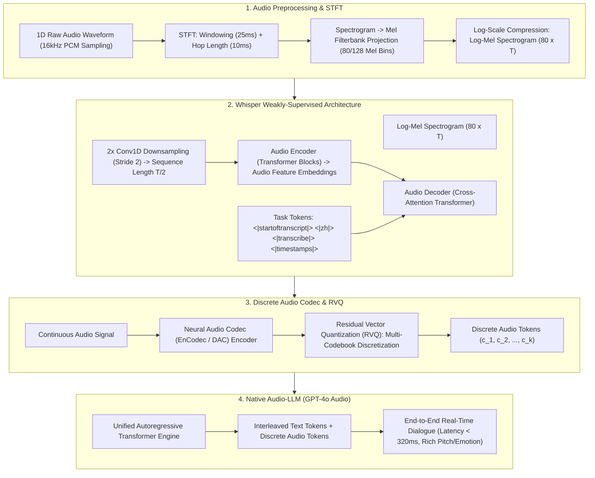

# 🌐 Speech & Audio Processing: Whisper Architecture, Log-Mel Spectrogram & Audio-LLM

> **Core Executive Summary**: Speech is the most natural medium for human interaction. Traditional Speech Recognition (ASR) relied on complex acoustic and language model pipelines. Modern architectures powered by **OpenAI Whisper** and **Native Audio-LLMs (GPT-4o Audio)** shift audio processing into end-to-end discrete tokenization paradigms. This guide dissects STFT, Log-Mel Spectrograms, Whisper multitask weak supervision, and RVQ audio tokenizers.

---

## 💡 Interactive Mermaid Architecture Flowchart



---

## 💡 Classic Interview Followups & Core Cheatsheet

* **Key Topic 1**: Detail signal processing steps from raw 1D audio waveform to 2D Log-Mel Spectrogram.
  * *Standard Answer*: Pre-emphasis high-pass filter $\to$ Framing (25ms window, 10ms hop) $\to$ Hanning Windowing $\to$ STFT FFT magnitude squared $\to$ Mel-Filterbank 80-bin projection $\to$ Log compression $\log(\text{Mel} + \epsilon)$.

> 💡 **Intuition**: Speech is a 1-D waveform; slice it into 25ms chunks, compute "which frequencies and how loud" per chunk (FFT), merge them by human-ear sensitivity (mel scale), and take a log — out comes an 80×T "photo of the sound."
>
> 🎤 **Interview answer**: Conclusion: waveform → pre-emphasis → framing + windowing → STFT → mel filterbank → log compression. Why: the mel scale mimics the ear's "fine resolution at low frequencies, coarse at high"; the log mimics loudness perception. Example: at 16kHz, a 25ms frame is 400 samples with 10ms hop; one second of speech ≈100 frames, and 80 mel bins give an 80×100 feature map — exactly Whisper's 80×T input.

* **Key Topic 2**: Why does OpenAI Whisper achieve strong generalization trained on 680,000 hours of weakly-supervised web data?
  * *Standard Answer*: Replaces expensive clean human-aligned speech labels with massive noisy internet captions across multiple languages and multitask objectives (ASR, Translation, VAD).

> 💡 **Intuition**: Whisper skips expensive human annotation and scrapes 680,000 hours of web audio that already has captions — free training data, vast enough to cover noise, accents, and hundreds of languages, which is exactly where the generalization comes from.
>
> 🎤 **Interview answer**: Conclusion: 680k hours of weakly supervised web data plus a unified multitask paradigm give Whisper its generalization. Why: massive noisy data covers extreme diversity, and ASR/translation/language-ID live in one decoder task sequence. Example: 680,000 hours ≈77 years of continuous audio; zero-shot transcription across 96 languages with WER well below traditional ASR on Common Voice, with no domain fine-tuning needed.

* **Key Topic 3**: Compare ASR+LLM+TTS pipeline vs Native Audio-LLM (GPT-4o Audio) in latency and emotion preservation.
  * *Standard Answer*: Cascaded Pipelines incur 2,000-5,000ms latency and strip vocal tone, pitch, and emotion. Native Audio-LLMs process audio tokens end-to-end with 232-320ms latency and full emotional fidelity.

> 💡 **Intuition**: A cascaded pipeline is a game of telephone: speech→text→answer→speech, three conversions that lose tone and laughter and queue up 2–5 seconds; a native model listens to audio and speaks audio directly in one pass — about 300ms.
>
> 🎤 **Interview answer**: Conclusion: native Audio-LLMs hit 232–320ms latency with full emotional and tonal fidelity; cascaded pipelines take 2–5 seconds and lose paralinguistic information. Why: end-to-end discrete audio-token modeling removes the text intermediate; intonation dropped at the ASR stage can never be recovered. Example: GPT-4o Realtime averages ≈320ms per spoken response, near the human 200ms turn-taking latency; legacy Siri-style pipelines take 3s+ and cannot hear that you are laughing.

* **Key Topic 4**: How do discrete audio codecs (EnCodec / SoundStream / DAC) compress audio into discrete tokens via RVQ?
  * *Standard Answer*: Residual Vector Quantization (RVQ) uses multiple hierarchical codebooks (e.g. 8 layers of 1024-dim VQ), quantizing residual errors step-by-step.

> 💡 **Intuition**: One codebook would need to hold every audio detail, so it must be huge; RVQ instead "makes up the difference layer by layer": the first layer quantizes coarsely, the error is quantized again, then the residual of that — 8 layers of 1024 code words approach the signal, saving a millionfold in codebook size.
>
> 🎤 **Interview answer**: Conclusion: RVQ cascades $N_q$ small codebooks, each quantizing the previous layer's residual — 8×1024 suffices for near-lossless audio. Why: each layer only handles the residual, so parameters grow linearly with depth instead of exponentially with codebook size. Example: single-level VQ would need a million-entry codebook for fidelity; EnCodec's 8×1024 = 8192 code words reach near-lossless quality at 1.5–3 kbps — about 1/100 of raw 16kHz×16bit = 256 kbps.

* **Key Topic 5**: How does Whisper control multitask generation via Special Tokens?
  * *Standard Answer*: Prepends control token sequences `<|startoftranscript|>` $\to$ `<|zh|>` $\to$ `<|transcribe|>` $\to$ `<|notimestamps|>` before autoregressive text generation.

> 💡 **Intuition**: Whisper is an all-in-one machine switched by "mode toggles": before generating, it presses a sequence of buttons (task tokens) setting language, task, and timestamp preference — then starts writing text.
>
> 🎤 **Interview answer**: Conclusion: the decoder is conditioned on a leading special-token sequence: start → language → transcribe/translate → timestamps. Why: one autoregressive decoder conditioned on token prefixes; different prefixes mean different tasks. Example: `<|startoftranscript|><|zh|><|translate|><|timestamps|>` outputs a timestamped Chinese translation, while `<|zh|><|transcribe|><|notimestamps|>` outputs plain Chinese transcription — four modes, one model.

---

## 📚 Section 1: Audio Processing Paradigms Comparison Matrix

> 📖 **How to read this table**: The "End-to-End Latency" column is the story — 2,000–5,000ms (cascaded) → 500–1,000ms (Whisper) → 232–320ms (native), an order-of-magnitude jump; the "Vocal Emotion" column marks what each tier throws away.

| Architecture | Representation | End-to-End Latency | Vocal Emotion | Multitask Capability | Representative System |
| :--- | :--- | :--- | :--- | :--- | :--- |
| **Cascade Pipeline**| Text Intermediate | 2,000 - 5,000 ms | Completely Lost | Dependent on sub-modules | Legacy Siri |
| **Whisper** | Log-Mel Spectrogram | 500 - 1,000 ms | N/A (Text Output) | ASR + Translation + VAD | Open-source ASR standard |
| **EnCodec / DAC** | RVQ Discrete Codebook | < 100 ms | 100% Preserved | Compression & Reconstruct | Audio Tokenizer Base |
| **Native Audio-LLM**| Discrete Audio Tokens | **232 - 320 ms** | **Full Emotion & Tone** | Real-time Dialogue | GPT-4o Realtime |

---

## ⚡ Section 2: Mel Scale Conversion Formula

In plain words: hertz is the physical frequency, but the human ear is sensitive to low frequencies and dull to high ones; the mel scale re-rulers frequency by how the ear perceives it — finer bins at the bottom, coarser at the top.

$$m = 2595 \cdot \log_{10}\left(1 + \frac{f}{700}\right)$$

> 💡 **Intuition**: The logarithmic shape approximates the ear's equal-loudness curves: nearly linear below 1000 Hz, increasingly "compressed" above. Placing 80 triangular filters equidistantly in mel space is resampling the FFT spectrum from the ear's point of view.
>
> 🎤 **Interview answer**: Conclusion: the mel scale $m = 2595 \log_{10}(1 + f/700)$ models the ear's nonlinear hearing. Why: 1000 Hz is the inflection, and the log segment compresses high frequencies. Example: 1000Hz → 1000 mel, 8000Hz → 2840 mel, 16000Hz → 3575 mel — physical frequency doubles while mel gains only ~700, confirming lower high-frequency resolution; 80 filters equidistant in mel space means "dense at low, sparse at high."

---

---

## 🐍 Section 3: Pure Numpy Handwritten Mel-Filterbank Operator

```python
import numpy as np

def pure_numpy_mel_filterbank(num_filters: int = 80, n_fft: int = 512, sample_rate: int = 16000) -> np.ndarray:
    hz_to_mel = lambda f: 2595.0 * np.log10(1.0 + f / 700.0)
    mel_to_hz = lambda m: 700.0 * (10.0 ** (m / 2595.0) - 1.0)
    mel_points = np.linspace(hz_to_mel(0.0), hz_to_mel(sample_rate / 2.0), num_filters + 2)
    bins = np.floor((n_fft + 1) * mel_to_hz(mel_points) / sample_rate).astype(int)
    
    fbank = np.zeros((num_filters, n_fft // 2 + 1))
    for m in range(1, num_filters + 1):
        for k in range(bins[m-1], bins[m]):
            fbank[m-1, k] = (k - bins[m-1]) / (bins[m] - bins[m-1] + 1e-8)
        for k in range(bins[m], bins[m+1]):
            fbank[m-1, k] = (bins[m+1] - k) / (bins[m+1] - bins[m] + 1e-8)
    return fbank

if __name__ == "__main__":
    fbank = pure_numpy_mel_filterbank(80, 512, 16000)
    print("✅ Mel Filterbank Matrix Shape:", fbank.shape)
```

> 💡 **Intuition**: The code takes equidistant points in mel space, maps them back to Hz, and builds triangular filters — the up- and down-ramps are the weight curve for "how much each frequency band counts," and 80 curves compose the "ear-view spectrum."
>
> 🎤 **Interview answer**: Conclusion: the Mel-Filterbank is equidistant in mel space with triangular weighting in Hz space. Why: take equidistant points hz→mel, map back mel→hz to FFT bins, then interpolate bin by bin. Example: at 16kHz with n_fft=512, 257 frequency bins are compressed into 80 mel values; the first filter peaks at ≈1 in the lowest band — and high-band filters are wider, matching the ear's resolution.

---

## 🚀 Key Takeaways & Best Practices

1. **ASR Standard**: Use **OpenAI Whisper** for robust multilingual speech recognition and translation.
2. **Real-time Voice**: Build real-time speech assistants using **Native Audio-LLMs** with RVQ tokenization.
3. **Windowing Safeguard**: Always apply a **Hanning Window** during STFT framing to prevent spectral leakage.