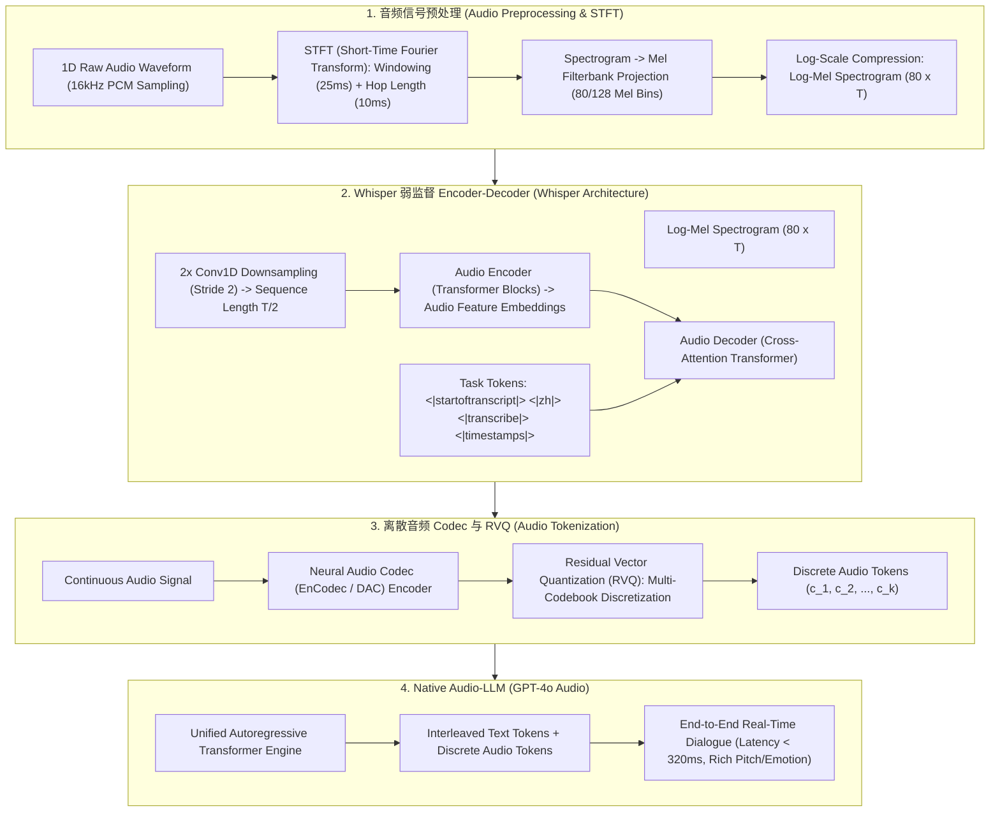

# 🌐 语音与音频处理全景：Whisper 弱监督架构、梅尔声谱图与 Audio-LLM 原理解构

> **核心摘要**：语音是人类最自然、最便捷的交互媒介。传统语音识别 (ASR) 强依赖于复杂的声学模型与语言模型分工。随着 **OpenAI Whisper** 与 **Native Audio-LLM (如 GPT-4o Audio)** 的崛起，音频处理全量迈向了 Encoder-Decoder 大模型与离散 Token 化时代。本指南系统解构连续音频信号的 STFT 傅里叶变换、Log-Mel 声谱图提取、Whisper 多任务弱监督架构、RVQ 残差向量量化以及原生语音大模型。

---

## 💡 交互式 Mermaid 架构流程图



---

## 💡 经典面试追问与考点速查

* **考点 1**：详细推导从原始一维音频波形 (Raw Waveform) 转换为二维 Log-Mel Spectrogram (梅尔声谱图) 的信号处理步骤？
  * *标准回答*：
    1. **采样与预加重 (Sampling & Pre-emphasis)**：将连续语音以 16kHz 采样率离散化，施加高通滤波器 $y(t) = x(t) - \alpha x(t-1)$ 提升高频信号；
    2. **分帧与加窗 (Framing & Windowing)**：切分为 25ms 的短时帧（包含 400 个采样点），叠加汉宁窗 (Hanning Window) 消除帧边缘频谱泄露；
    3. **短时傅里叶变换 (STFT)**：对每帧计算 FFT，得到复数频谱，取模平方得到线性功率谱 $|X(f)|^2$；
    4. **梅尔滤波片组映射 (Mel-Filterbank)**：将赫兹频率 $f$ 转换为拟合人类听觉的梅尔标度 $m = 2595 \log_{10}(1 + f/700)$，通过 80 个三角滤波片加权合并；
    5. **对数压缩 (Log Compression)**：取对数 $\log(\text{Mel} + \epsilon)$ 拟合对数听觉响度。

> 💡 **直观理解**：语音是 1 维波形，把它切成 25ms 的小段，每段算"有哪些频率、多大声"（FFT），再按人耳敏感度（梅尔刻度）合并压缩，最后取对数——一张 80×T 的"声音照片"就出来了。
>
> 🎤 **面试速答**：结论：波形 → 预加重 → 分帧加窗 → STFT → Mel 滤波片 → 对数压缩。原理：梅尔刻度模拟人耳"低频分辨细、高频分辨粗"；对数压缩模拟响度感知。例子：16kHz 采样，25ms = 400 点/帧、10ms 步进，1 秒语音 ≈100 帧，80 个 Mel bin → 80×100 特征图，Whisper 输入就是 80×T。

* **考点 2**：OpenAI Whisper 架构为何能够仅通过 68 万小时弱监督 (Weakly-Supervised) 网页音频数据实现超强泛化性？
  * *标准回答*：
    * **弱监督替代精标注**：传统 ASR 强依赖专业人工对齐的无噪语音数据，成本高且难以规模化。Whisper 直接收集网页上自带字幕的 68 万小时杂乱音频；
    * **多任务联合预训练**：Whisper 将 ASR、语音翻译 (Speech Translation)、语种识别 (Language ID)、语音活动检测 (VAD) 统一在同一个 Decoder 生成范式中。巨量数据的噪音鲁棒性赋予了 Whisper 超强的 Zero-Shot 泛化能力。

> 💡 **直观理解**：Whisper 不请昂贵的人工标注，直接抓网上"自带字幕"的 68 万小时音频当免费训练数据，量大到把噪音、口音、多语种全部覆盖，泛化自然强。
>
> 🎤 **面试速答**：结论：68 万小时弱监督网页数据 + 多任务统一范式造就 Whisper 泛化。原理：海量有噪数据覆盖极端多样性；ASR/翻译/语种识别统一在一个 Decoder 任务序列里。例子：680,000 小时 ≈77 年连续音频，零样本转写 96 种语言，在 Common Voice 上 WER 显著低于传统 ASR，且无需领域微调。

* **考点 3**：对比 "传统 ASR + LLM + TTS 串联 Pipeline" 与 "Native Audio-LLM (如 GPT-4o Audio) 端到端推理" 的延迟与情感保留差异？
  * *标准回答*：
    * **传统 Pipeline (ASR $\to$ LLM $\to$ TTS)**：需要经过语音转文字、文字推理、文字转语音三次串联。**端到端延迟高达 2~5 秒**，且在 ASR 阶段丢弃了说话人的语调、情感、笑声、声调与笑声等关键副语言信息 (Paralinguistic Information)；
    * **Native Audio-LLM (GPT-4o Audio)**：在一个 Transformer 模型中直接以离散 Audio Tokens 为输入输出。**延迟降至 232~320ms（达到人类对答反应速度）**，且完全保留了情绪、语调变幻与实时打断能力！

> 💡 **直观理解**：串联管线像"传话游戏"：语音→文字→答案→语音，三次转换，语气笑声全丢了，还要排队等 2~5 秒；Native 模型直接听音频、说音频，一气呵成 300ms。
>
> 🎤 **面试速答**：结论：Native Audio-LLM 延迟 232~320ms 且完整保留情感语调；串联管线 2~5 秒且丢失副语言信息。原理：端到端离散音频 token 建模，免去文本中间态；ASR 阶段已丢的语调无法恢复。例子：GPT-4o Realtime 平均语音响应约 320ms，接近人类 200ms 对答反应；传统 Siri 式管线 3 秒+且听不出"你在笑"。

* **考点 4**：离散音频编码器 (如 EnCodec / SoundStream / DAC) 如何通过 Residual Vector Quantization (RVQ) 将连续音频压缩为离散 Token？
  * *标准回答*：
    * 单级矢量量化 (VQ) 的 Codebook 尺寸太大（如欲精确重建音频需要百万级 Codebook）。
    * **RVQ 级联量化**：使用 $N_q$ 个层叠的相对较小的 Codebook（如 8 层，每层 1024 维）。第 1 层 VQ 量化原始特征得到残差 $R_1$；第 2 层 VQ 对残差 $R_1$ 进行再次量化得到 $R_2$……逐层逼近。这样只需 $8 \times 1024$ 的参数量，即可实现对高保真音频的无损离散 Code 压缩。

> 💡 **直观理解**：单个码本要装下所有音频细节，码本得巨大；RVQ 改成"层层补差"：第一层粗量化，剩下误差再量化，再量化残差……8 层×1024 的小码本逐层逼近，精度翻倍、码本省百万倍。
>
> 🎤 **面试速答**：结论：RVQ 用 $N_q$ 级联小码本逐层量化残差，8×1024 即可高保真压缩。原理：每层只负责"上一层的残差"，参数量与码本规模线性增长而非指数。例子：单级 VQ 要百万级码本才保真，EnCodec 用 8 层×1024=8192 个码字就达到近似无损，码率低至 1.5~3 kbps（原生 16kHz×16bit=256kbps 的约 1/100）。

* **考点 5**：在 Whisper 的 Decoder 中，如何通过 Special Tokens 控制多任务生成？
  * *标准回答*：Whisper 的 Decoder 是自回归的。在生成具体文本前，首先显式强制输入一串控制 Token 序列：
    `<|startoftranscript|>` $\to$ `<|language_code|>` (如 `<|zh|>`) $\to$ `<|task|>` (如 `<|transcribe|>` 或 `<|translate|>`) $\to$ `<|notimestamps|>`.
    通过改变 Prompt 中的控制 Token，同一个 Decoder 模型即可切换为纯语音识别、跨语言翻译或精确时间戳提取模式。

> 💡 **直观理解**：Whisper 像一台"多合一机器"，靠"模式开关"切换功能：一开机先按一串按钮（任务 token）设定语言、任务、要不要时间戳，然后再开始生成文本。
>
> 🎤 **面试速答**：结论：Decoder 前置特殊 token 序列控制多任务：start → 语言 → transcribe/translate → timestamps。原理：同一自回归 Decoder 以 token 前缀为条件，不同前缀 = 不同任务。例子：`<|startoftranscript|><|zh|><|translate|><|timestamps|>` 输出带时间戳的中文翻译；`<|zh|><|transcribe|><|notimestamps|>` 则输出纯中文转写——一个模型 4 种模式。

---

## 📚 第一章：音频处理与 Audio-LLM 范式对比矩阵

> 📖 **怎么读这张表**：核心看"端到端 Latency"列——2000~5000ms（串联）→ 500~1000ms（Whisper）→ 232~320ms（Native），数量级跨越；"情感/语调保留"列则标注了每档丢掉了什么。

| 架构 / 范式 | 音频特征表示 | 端到端 Latency | 情感/语调保留 | 多任务能力 | 典型应用代表 |
| :--- | :--- | :--- | :--- | :--- | :--- |
| **传统 Pipeline** | ASR 文本中间态 | 2,000 ~ 5,000 ms | 完全丢失 | 依赖各子模块拼接 | 早期 Siri, 经典语音助手 |
| **Whisper** | Log-Mel Spectrogram | 500 ~ 1,000 ms (离线/分块)| N/A (输出文本) | ASR + Translation + VAD | 开源 ASR 标准基座 |
| **EnCodec / DAC** | RVQ 离散 Codebook | < 100 ms (Codec) | 100% 保持 | 音频压缩与重建 | 音频 Tokenizer 基座 |
| **Native Audio-LLM**| 离散 Audio Tokens | **232 ~ 320 ms** | **完整保留情感/声调** | 实时多模态对答 | GPT-4o Realtime, Gemini Voice |

---

## ⚡ 第二章：梅尔刻度转换公式

大白话：赫兹是物理频率，人耳对低频敏感、对高频迟钝；梅尔刻度把频率"按人耳的感受重新标尺"，让低频段分得更细、高频段分得更粗。

赫兹频率 $f$ 与梅尔标度 $m$ 的转换公式：
$$m = 2595 \cdot \log_{10}\left(1 + \frac{f}{700}\right)$$

> 💡 **直观理解**：对数形状正是人耳"等响度曲线"的近似：1000Hz 以下基本线性，以上越来越"压缩"。80 个三角滤波片按梅尔刻度等距放置，就是给 FFT 频谱"按人耳视角重新采样"。
>
> 🎤 **面试速答**：结论：Mel 刻度 $m = 2595 \log_{10}(1 + f/700)$ 模拟人耳非线性听觉。原理：1000Hz 附近为转折，对数段压缩高频。例子：1000Hz → 1000 mel，8000Hz → 2840 mel，16000Hz → 3575 mel——物理频率翻倍，mel 只加 700，印证"高频分辨力低"。80 个滤波片在 mel 域等距，即"低频密、高频疏"。

---

## 🐍 第三章：Pure Numpy 手写 Mel-Filterbank 滤波片生成算子

```python
import numpy as np

def pure_numpy_mel_filterbank(num_filters: int = 80, n_fft: int = 512, sample_rate: int = 16000) -> np.ndarray:
    """
    Pure Numpy 实现三角梅尔滤波片组 (Mel-Filterbank Matrix) 生成算子
    Returns: shape (num_filters, n_fft // 2 + 1)
    """
    # 1. 转换采样率范围的 Hz 到 Mel
    f_min = 0.0
    f_max = sample_rate / 2.0
    
    hz_to_mel = lambda f: 2595.0 * np.log10(1.0 + f / 700.0)
    mel_to_hz = lambda m: 700.0 * (10.0 ** (m / 2595.0) - 1.0)
    
    mel_min = hz_to_mel(f_min)
    mel_max = hz_to_mel(f_max)
    
    # 2. 在 Mel 标度上生成等间距的 num_filters + 2 个点
    mel_points = np.linspace(mel_min, mel_max, num_filters + 2)
    hz_points = mel_to_hz(mel_points)
    
    # 3. 映射到 FFT Bin 索引
    bins = np.floor((n_fft + 1) * hz_points / sample_rate).astype(int)
    
    # 4. 构建三角滤波片矩阵
    fbank = np.zeros((num_filters, n_fft // 2 + 1), dtype=np.float64)
    for m in range(1, num_filters + 1):
        f_m_minus = bins[m - 1]
        f_m = bins[m]
        f_m_plus = bins[m + 1]
        
        # 上升沿
        for k in range(f_m_minus, f_m):
            fbank[m - 1, k] = (k - f_m_minus) / (f_m - f_m_minus + 1e-8)
        # 下降沿
        for k in range(f_m, f_m_plus):
            fbank[m - 1, k] = (f_m_plus - k) / (f_m_plus - f_m + 1e-8)
            
    return fbank

# ==================== 测试验证 ====================
if __name__ == "__main__":
    fbank = pure_numpy_mel_filterbank(num_filters=80, n_fft=512, sample_rate=16000)
    print("✅ 梅尔滤波片组生成成功！矩阵形状:", fbank.shape)
    print("✅ 第一组滤波片峰值:", round(np.max(fbank[0]), 4))
```

> 💡 **直观理解**：代码在 mel 域等距取点再映射回 Hz，构造三角滤波片——上升沿加下降沿就是"某段频率被加权多少"的权重曲线，80 张曲线合成"人耳视角的频谱"。
>
> 🎤 **面试速答**：结论：Mel-Filterbank 在 mel 域等距、Hz 域实现三角加权。原理：先 hz→mel 取等距点，再 mel→hz 映射回 FFT bin，逐 bin 插值。例子：16kHz、n_fft=512 → 257 个频点压缩为 80 个 mel 值，第一张滤波片峰值 ≈1 落在最低频段——高频段滤波片更宽，呼应人耳分辨特性。

---

## 🚀 总结与工程最佳实践

1. **ASR 基座选型**：转写与翻译任务强推荐 **OpenAI Whisper** 弱监督架构；
2. **实时语音对话**：工业级超低延迟对话务必采用 **Native Audio-LLM**（基于 RVQ 离散 Token 化）；
3. **信号预处理**：音频切帧务必加 **Hanning 窗** 防止频谱泄露。