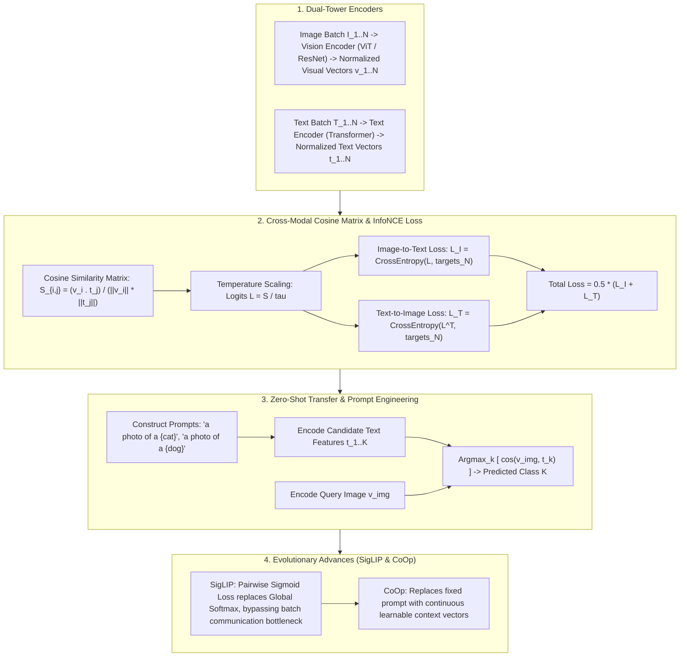

# 🌐 Multimodal Alignment: CLIP Dual-Tower Contrastive Learning, InfoNCE Loss & SigLIP

> **Core Executive Summary**: Multimodal alignment connects heterogeneous vision, text, and audio data into a shared semantic space. OpenAI's **CLIP (Contrastive Language-Image Pre-Training)** replaces single-modality categorical labels with large-scale bidirectional contrastive learning on 400M image-text pairs, mapping visual and text features onto a unified hypersphere vector space. This guide dissects CLIP, InfoNCE loss, SigLIP sigmoid optimization, and Zero-Shot open-vocabulary classification.

---

## 💡 Interactive Mermaid Architecture Flowchart



---

## 💡 Classic Interview Followups & Core Cheatsheet

* **Key Topic 1**: Derive InfoNCE loss formula and explain temperature parameter $\tau$'s gradient scaling role.
  * *Standard Answer*: $\mathcal{L}_{I \to T}^{(i)} = - \log \frac{\exp(\text{sim}(v_i, t_i) / \tau)}{\sum_{j=1}^N \exp(\text{sim}(v_i, t_j) / \tau)}$. Lower $\tau$ sharpens the softmax distribution, forcing the model to focus on hard negative mining.

> 💡 **Intuition**: Think of it as an N-way multiple-choice test: in a batch of $N$ images and $N$ texts, only one pairing is correct and everything else is a distractor. The model must learn to make the positive similarity crush all negatives.
>
> 🎤 **Interview answer**: Conclusion: InfoNCE is a temperature-scaled softmax cross-entropy that trains the diagonal to be maximal. Why: smaller $\tau$ sharpens the distribution and focuses gradients on hard negatives. Example: CLIP uses $\tau \approx 0.07$ — similarities 0.8 vs 0.79 become logits ≈11.4 vs ≈11.3, a margin of 0.14 that still moves gradients; at $\tau=1$ the difference is nearly invisible.

* **Key Topic 2**: Compare Softmax InfoNCE (CLIP) vs Sigmoid Loss (SigLIP) in memory overhead and distributed batch scalability.
  * *Standard Answer*: Softmax InfoNCE requires global denominator summation across all $N$ negatives (requiring $O(N^2)$ AllGather GPU communication). SigLIP treats alignment as pairwise binary classification $\log \sigma(z_{ij} \text{sim}(v_i, t_j))$, eliminating global softmax.

> 💡 **Intuition**: CLIP's softmax denominator is a class-wide ranking — the whole class must be present (AllGather). SigLIP switches to pairwise duels: each pair is judged independently, so computation can be block-wise parallel without waiting for the full batch.
>
> 🎤 **Interview answer**: Conclusion: SigLIP replaces global softmax with per-pair sigmoid classification, removing AllGather. Why: the sign $z_{ij}$ labels each pair and the loss depends only on that pair's logit, which is naturally block-parallel. Example: 1024 GPUs × batch 32 — CLIP must AllGather all 32,768 features with $O(N^2)$ communication; SigLIP computes locally and aggregates only losses, cutting communication by ~40%.

* **Key Topic 3**: Why does CLIP Zero-Shot classification need prompt templates ("a photo of a {class}")? How does CoOp learn prompts?
  * *Standard Answer*: Isolated words like "dog" suffer from distribution shift relative to full pre-training captions. CoOp replaces static prompt strings with continuous learnable context vectors $[V_1, \dots, V_M]$.

> 💡 **Intuition**: During pretraining, texts are full sentences like "a photo of a dog playing in the park"; at test time you hand the model a bare word "dog" — an exam format it has never seen. Wrapping the class in a template restores the familiar format.
>
> 🎤 **Interview answer**: Conclusion: prompt templates close the distribution gap between single words and pretraining captions; CoOp turns the template vectors into learnable parameters. Why: templates embed the class name into the pretrained text distribution; CoOp tunes only $M$ context vectors with both towers frozen. Example: on ImageNet, CLIP zero-shot without templates ≈58%, with "a photo of a {}" ≈62%, and CoOp reaches ≈70% with 16 shots — tuning just 16×512 parameters.

* **Key Topic 4**: Why does scaling batch size (e.g. up to 32,768) significantly improve CLIP performance?
  * *Standard Answer*: Larger batches expand the negative sample pool, providing richer hard negatives and tighter mutual information bounds.

> 💡 **Intuition**: Every other sample in the batch is a "negative-sample teacher": with batch 256 a positive pair gets 255 teachers; with batch 32,768 it gets 32,767 — similar dog breeds and confusable scenes all join in and force the representation to learn the differences.
>
> 🎤 **Interview answer**: Conclusion: bigger batches mean richer negatives and finer representations. Why: InfoNCE estimates a mutual-information lower bound — more negatives give a tighter bound and stronger learning signal. Example: growing $N$ from 256 to 32,768 (128×) pushes the similarity distribution from "easy to separate" to "breed-level discrimination" — the CLIP paper treats the huge batch as a required ingredient.

* **Key Topic 5**: Analyze performance vs OOD generalization bounds of Linear Probe vs Full Fine-tuning in CLIP.
  * *Standard Answer*: Linear Probe freezes pre-trained encoders, preserving hypersphere geometry and OOD robustness. Full fine-tuning increases in-domain accuracy but risks catastrophic forgetting of pre-trained visual representations.

> 💡 **Intuition**: Linear Probe is "don't touch the model, train a one-layer card reader"; full fine-tuning is "rewrite the foundation for the new task" — more accurate in-domain, but the generic world knowledge from pretraining gets washed away.
>
> 🎤 **Interview answer**: Conclusion: Linear Probe preserves OOD robustness; full FT boosts in-domain accuracy but risks catastrophic forgetting. Why: freezing the hypersphere geometry keeps the generic representation; full backprop overwrites pretrained knowledge. Example: on OOD sets like cartoons and sketches, Linear Probe clearly beats FT; on in-domain data FT wins by 3–5 points — probe first, fine-tune only if needed.

---

## 📚 Section 1: Multimodal Contrastive Learning Comparison Matrix

> 📖 **How to read this table**: The "Loss Function" column is the watershed — the Softmax family (CLIP/ALIGN) feeds on global negatives via large batches, the Sigmoid family (SigLIP) saves communication via independent binary classification; the third column flags each one's distributed bottleneck.

| Architecture | Loss Function | Distributed Bottleneck | Projection | Zero-Shot Capability | Target Application |
| :--- | :--- | :--- | :--- | :--- | :--- |
| **CLIP (Standard)** | Symmetric InfoNCE (Softmax)| High (requires AllGather) | Linear Projection | Strong (via Prompts) | Retrieval, DALL-E 2 conditioning |
| **SigLIP** | Pairwise Binary Sigmoid | Low (block-wise parallelizable) | Linear Projection | Very Strong (extreme scaling) | Gemma-2 Vision Backbone |
| **ALIGN** | Symmetric InfoNCE | High (1.8B noisy web pairs) | Linear Projection | Strong (noise tolerant) | Web search retrieval |
| **CoOp / CoCoOp** | InfoNCE + Context Tuning | Medium | Frozen Encoder + Prompt Vectors | Ultra Strong (few-shot adapt) | Medical / Industrial vision adaptation |

---

## ⚡ Section 2: InfoNCE Formula

In plain words: for image $i$, compute similarities against all $N$ text features in the batch, then require the correctly matched text to dominate the softmax. The numerator is the positive pair, the denominator is the whole batch — training pushes the numerator up and the denominator down.

InfoNCE Loss:
$$\mathcal{L}_{I \to T}^{(i)} = - \log \frac{\exp\left( \frac{v_i^T t_i}{\|v_i\| \|t_i\| \tau} \right)}{\sum_{j=1}^N \exp\left( \frac{v_i^T t_j}{\|v_i\| \|t_j\| \tau} \right)}$$

> 💡 **Intuition**: The denominator is the "also-ran list": $N-1$ negatives are all distractors. The temperature $\tau$ on the similarities decides whether "0.8 vs 0.79" counts as a meaningful difference.
>
> 🎤 **Interview answer**: Conclusion: InfoNCE = negative log-softmax probability of the positive pair, averaged over both directions (image→text and text→image). Why: it is equivalent to maximizing a mutual-information lower bound, with $\tau$ weighting hard negatives. Example: similarities 0.9/0.7/0.6 at $\tau=0.07$ → logits ≈12.9/10.0/8.6; softmax gives the positive ≈0.94, loss ≈0.06 — the smaller $\tau$, the more the positive must win by a landslide.

---

## 🐍 Section 3: Pure Numpy Handwritten InfoNCE Operator

```python
import numpy as np

def pure_numpy_clip_infonce_loss(image_features: np.ndarray, text_features: np.ndarray, log_logit_scale: float = np.log(1/0.07)) -> float:
    v_norm = image_features / np.linalg.norm(image_features, axis=1, keepdims=True)
    t_norm = text_features / np.linalg.norm(text_features, axis=1, keepdims=True)
    logit_scale = np.exp(log_logit_scale)
    logits_per_image = logit_scale * (v_norm @ t_norm.T)
    logits_per_text = logits_per_image.T
    N = image_features.shape[0]
    labels = np.arange(N)
    
    def cross_entropy(logits, targets):
        max_logits = np.max(logits, axis=1, keepdims=True)
        exp_logits = np.exp(logits - max_logits)
        log_probs = (logits - max_logits) - np.log(np.sum(exp_logits, axis=1, keepdims=True))
        return -np.mean(log_probs[np.arange(N), targets])
        
    return float(0.5 * (cross_entropy(logits_per_image, labels) + cross_entropy(logits_per_text, labels)))

if __name__ == "__main__":
    img_feats = np.random.randn(4, 128)
    txt_feats = img_feats * 0.8 + np.random.randn(4, 128) * 0.2
    loss = pure_numpy_clip_infonce_loss(img_feats, txt_feats)
    print("✅ CLIP InfoNCE Loss:", round(loss, 4))
```

> 💡 **Intuition**: The code implements the CLIP paper loss verbatim: L2-normalize first, then multiply by `logit_scale` (default 1/0.07); the diagonal is naturally the positive label, and the two directions are averaged.
>
> 🎤 **Interview answer**: Conclusion: this snippet is the complete CLIP training loss. Why: `logit_scale` is the learnable temperature; `labels = arange(N)` marks the diagonal; the loss is symmetric. Example: with 4 pairs of 128-dim features, injecting +0.8 onto diagonal similarities drops the loss well below random initialization — "positives closer" is immediately learned as a pull-toward-diagonal signal.

---

## 🚀 Key Takeaways & Best Practices

1. **L2 Normalization**: Always apply $L_2$ normalization to visual and text embeddings before computing cosine similarity.
2. **SigLIP for Massive Scaling**: Use **SigLIP (Sigmoid Loss)** for massive distributed pre-training to bypass AllGather bottlenecks.
3. **Prompt Adaptation**: Prefer **CoOp continuous prompt tuning** over full model fine-tuning for specialized downstream tasks.