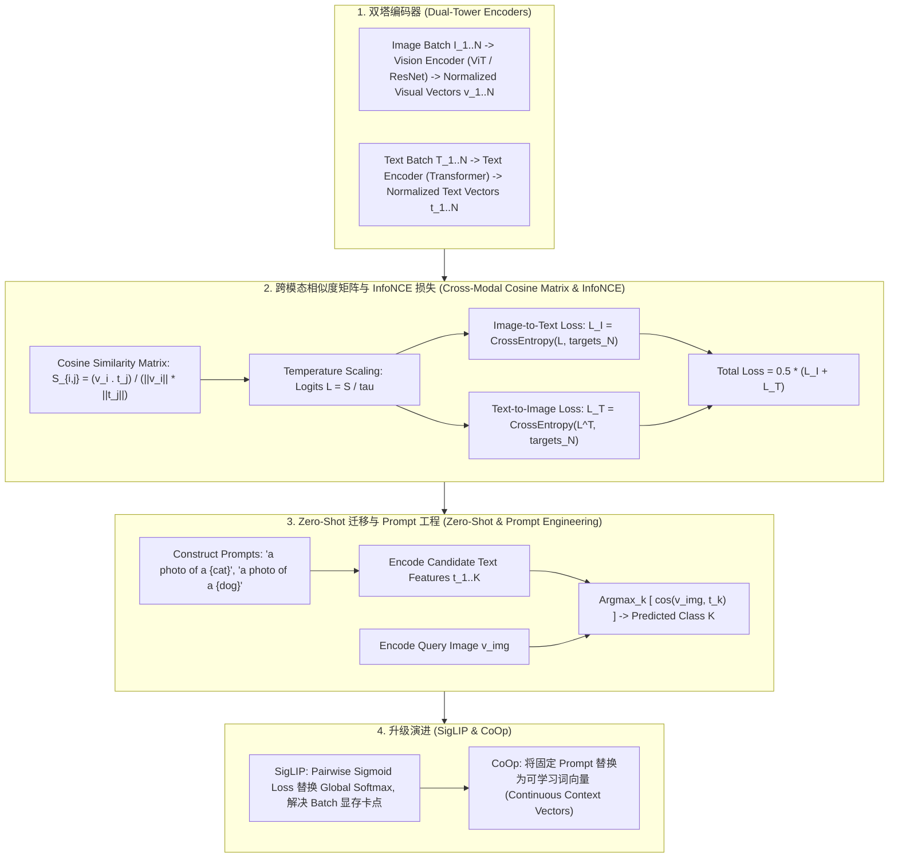

# 🌐 多模态对齐：CLIP 双塔对比学习、InfoNCE 损失、Zero-Shot 迁移与 SigLIP 原理解构

> **核心摘要**：多模态表征对齐是连接视觉、文本、语音等异构数据的桥梁。OpenAI 提出的 **CLIP (Contrastive Language-Image Pre-Training)** 摒弃了传统的单模态分类标签，通过海量“图像-文本”对 (4 亿 pairs) 进行大规模双向对比学习，将视觉特征与自然语言嵌入统一映射至同一个规范化的超球面向量空间。本指南系统拆解 CLIP 架构、InfoNCE 损失推导、SigLIP 的 Sigmoid 代替 Softmax 优化，以及 Zero-Shot 开放词表分类范式。

---

## 💡 交互式 Mermaid 架构流程图



---

## 💡 经典面试追问与考点速查

* **考点 1**：推导 InfoNCE 损失函数公式，并解释温度参数 $\tau$ 在对比学习中的物理含义与梯度调节作用？
  * *标准回答*：
    * **InfoNCE 表达式**：对于第 $i$ 个图像特征 $v_i$ 与匹配的正样本文本特征 $t_i$，在 Batch 大小为 $N$ 的环境下：
      $$\mathcal{L}_{I \to T}^{(i)} = - \log \frac{\exp(\text{sim}(v_i, t_i) / \tau)}{\sum_{j=1}^N \exp(\text{sim}(v_i, t_j) / \tau)}$$
      其中 $\text{sim}(v_i, t_j) = \frac{v_i^T t_j}{\|v_i\|_2 \|t_j\|_2}$ 为余弦相似度。
    * **温度参数 $\tau$ 的作用**：$\tau$ 相当于调节 Softmax 概率分布平滑度的“温度”。当 $\tau \to 0$ 时，分布极度陡峭，梯度聚焦于最难区分的负样本（Hard Negative Mining）；当 $\tau$ 较小时，可以放大微小的相似度差异。在 CLIP 中，$\tau$ 被设计为可学习的 log-parameter，限制下界防止数值溢出。

> 💡 **直观理解**：把"图像配文本"当成一场 N 选 1 的选择题：batch 里有 N 张图 N 条文本，正确配对只有 1 个，其余都是干扰项。模型要练到"正样本相似度碾压所有负样本"。
>
> 🎤 **面试速答**：结论：InfoNCE 是带温度尺度的 softmax 交叉熵，训练"对角线最大"。原理：$\tau$ 越小分布越陡，梯度聚焦难负样本，学习表征越细。例子：CLIP 的 $\tau \approx 0.07$，两对相似度 0.8 vs 0.79 在 $\tau=0.07$ 下 logit 差 ≈0.143，足以拉开梯度；$\tau=1$ 时几乎没区别。

* **考点 2**：对比 Softmax-based InfoNCE (如 CLIP) 与 Sigmoid Loss (如 SigLIP) 在大规模分布式训练中的通信开销与批次大小 (Batch Size) 扩展性？
  * *标准回答*：
    * **CLIP (Softmax-based)**：需要对整行/整列 $N$ 个负样本计算分母 $\sum_{j=1}^N \exp(\cdot)$ 的归一化常数。在跨卡分布式训练（如 1024 张 GPU）时，必须通过 `AllGather` 通信收集所有卡上的文本/图像特征，通信开销随着 Batch Size 呈 $O(N^2)$ 增长；
    * **SigLIP (Sigmoid-based)**：将对比学习视为对每一个 $(v_i, t_j)$ Pair 的独立二分类任务（正样本 Label 1，负样本 Label -1）：
      $$\mathcal{L}_{SigLIP} = - \sum_{i,j} \log \sigma(z_{ij} \cdot \text{sim}(v_i, t_j))$$
      其中 $z_{ij} = 1$ (若 $i=j$) 否则 $-1$。**无需全局 Softmax 归一化**，使得批次可以被切碎并行，大幅降低了显存与跨卡 AllGather 通信开销！

> 💡 **直观理解**：CLIP 的 softmax 分母要"全班比分排名"，必须等全班到齐（AllGather）；SigLIP 改成"两两对决"，每对独立判断，可以分块并行，不用等全场。
>
> 🎤 **面试速答**：结论：SigLIP 用逐对 sigmoid 二分类取代全局 softmax，免去 AllGather。原理：$z_{ij}$ 符号标记正负，损失只依赖单对 logit，天然可分块。例子：1024 卡 × 每卡 batch 32，CLIP 需 AllGather 全 32768 个特征、通信 $O(N^2)$；SigLIP 本地算完再聚合损失，通信量约降 40%。

* **考点 3**：CLIP 的 Zero-Shot 分类为何需要使用 Prompt Engineering (如 "a photo of a {class}")？如何通过 CoOp (Context Optimization) 进行可学习 prompt 调优？
  * *标准回答*：
    * **Prompt 工程物理含义**：在 CLIP 预训练数据中，文本很少是孤立的单词（如 "dog"），而是短语或句子（如 "A dog running in the park"）。因此直接输入单字 "dog" 会产生模态分布分布偏移 (Distribution Shift)。加入前缀 "a photo of a {class}" 能使其更好地拟合预训练文本分布。
    * **CoOp 调优机制**：CoOp 将手工 Prompt 中的词向量替换为 $M$ 个连续可学习的上下文参数矩阵 $[V_1, V_2, \dots, V_M]$。在下游任务微调时，保持 Vision/Text Encoder 冰冻，仅通过梯度下降优化这 $M$ 个 Vector，极小参数量即可超越全量微调！

> 💡 **直观理解**：预训练时文本全是"a photo of a dog playing in the park"这种句子，测试时只扔一个孤零零的 "dog"，等于让模型答从来没见过的考题格式；套上模板就是还原考场格式。
>
> 🎤 **面试速答**：结论：Prompt 模板消除单词语料与预训练句子的分布偏移；CoOp 把模板词向量变成可学习参数。原理：模板让类名融入预训练文本分布；CoOp 只训练 M 个上下文向量、冻结双塔。例子：ImageNet 上 CLIP 无模板 top-1 ≈58%，加 "a photo of a {}" ≈62%，CoOp 用 16 shot 可达 ≈70%——冻结基座只调 16×512 个参数。

* **考点 4**：在 CLIP 训练中，为何 Batch Size 越大 (如 32,768) 对对比学习的效果提升越显著？
  * *标准回答*：对比学习的本质是估计互信息 (Mutual Information) 的下界。每个正样本对 $(v_i, t_i)$ 面临的负样本数量为 $N-1$。当 $N$ 从 256 增加到 32,768 时，包含了极其丰富的“假阳性”与“难区分”负样本（如各种相似犬种）。负样本空间越宏大，逼迫 Encoder 学习到的表征越精细，线性可分性越强。

> 💡 **直观理解**：batch 里其他样本都是"负样本老师"：batch=256 时一个正样本只配 255 个老师，batch=32768 时有 32767 个——相似犬种、易混淆场景都进来当老师，逼着表征把区别学出来。
>
> 🎤 **面试速答**：结论：batch 越大负样本越丰富，表征越精细。原理：InfoNCE 是互信息下界估计，负样本多 → 估计更紧、学习信号更强。例子：N=256 与 N=32768（128 倍），相似度分布从"容易分开"变成"犬种级区分"——CLIP 论文里大 batch 是必备配方。

* **考点 5**：分析 CLIP 在图文检索 (Image-Text Retrieval) 中的线性探测 (Linear Probe) 与全参数微调 (Fine-tuning) 的性能与泛化边界？
  * *标准回答*：
    * **Linear Probe**：冻结 CLIP 视觉编码器，仅在输出特征向量后接入一个线性 Layer 进行分类。优点是**完全保留了预训练超球面的通用表征与 Distributional Robustness**，对分布外 (OOD) 破坏（如卡通画、草图）抗性极强；
    * **Full Fine-tuning**：全参数反向传播。虽然在分布内 (In-Distribution) 领域数据上精度更高，但容易破坏预训练好的通用表征

> 💡 **直观理解**：Linear Probe 是"不改造原模型，只训练一层读卡器"；全量微调是"连底层都按新任务重写"——分布内更准，但预训练学到的通用世界知识会被冲掉。
>
> 🎤 **面试速答**：结论：Linear Probe 保 OOD 鲁棒性，Full FT 提分布内精度，但易灾难性遗忘。原理：冻结超球面几何保留通用表征；全量反传覆盖预训练知识。例子：卡通/草图等 OOD 集上 Linear Probe 显著优于 FT；分布内数据集 FT 高 3~5 个点——先 Linear Probe，不够再 FT。，出现“灾难性遗忘 (Catastrophic Forgetting)”。

---

## 📚 第一章：CLIP 与多模态对比学习对比矩阵

> 📖 **怎么读这张表**：第二列"损失函数类型"是分水岭——Softmax 族（CLIP/ALIGN）靠大 batch 吃全局负样本，Sigmoid 族（SigLIP）靠独立二分类省通信；第三列标出了各自的分布式瓶颈。

| 架构 / 范式 | 损失函数类型 | 通信 / 分布式瓶颈 | 特征投影方式 | Zero-Shot 分类能力 | 典型应用 |
| :--- | :--- | :--- | :--- | :--- | :--- |
| **CLIP (Standard)** | Symmetric InfoNCE (Softmax)| 高 (需要 AllGather 收集全 Batch 特征)| Linear Projection 至 512/768 维 | 强 (需 Prompt 模板) | 图文检索、DALLE-2 条件向量 |
| **SigLIP** | Pairwise Binary Sigmoid | 低 (可分块并行计算)| Linear Projection | 极强 (大 Batch 极致伸缩) | Google Gemma-2 视觉基座 |
| **ALIGN** | Symmetric InfoNCE | 高 (使用 18 亿嘈杂网页数据) | Linear Projection | 强 (抗噪声数据集能力极高)| 搜索引擎多模态检索 |
| **CoOp / CoCoOp** | InfoNCE + Context Tuning | 中 | 冻结 Encoder, 优化 Prompt Vectors | 超强 (小样本领域自适应) | 工业医学/工业检测自适应 |

---

## ⚡ 第二章：InfoNCE 损失函数与梯度公式

### 2.1 图像到文本 InfoNCE 损失

大白话：对第 $i$ 张图，把它的特征与 batch 里所有 $N$ 条文本特征算相似度，然后要求"正确的那条文本的相似度在 softmax 中占比最高"。分子是正样本，分母是全体样本——训练就是把分子顶上去、把分母压下去。

$$\mathcal{L}_{I \to T}^{(i)} = - \log \frac{\exp\left( \frac{v_i^T t_i}{\|v_i\| \|t_i\| \tau} \right)}{\sum_{j=1}^N \exp\left( \frac{v_i^T t_j}{\|v_i\| \|t_j\| \tau} \right)}$$

> 💡 **直观理解**：分母就是"陪跑名单"：$N-1$ 个负样本全是干扰项。$\tau$ 放在相似度上，相当于调节"0.8 和 0.79 的差别算不算数"。
>
> 🎤 **面试速答**：结论：InfoNCE = 正样本 logit 的 softmax 概率取负对数，双向（图→文、文→图）求平均。原理：等价于最大化互信息下界；$\tau$ 控制难负样本权重。例子：相似度 0.9/0.7/0.6、$\tau=0.07$ → logits ≈12.9/10.0/8.6，softmax 后正样本概率 ≈0.94、损失 ≈0.06——$\tau$ 越小，正样本必须"碾压式"领先。

### 2.2 SigLIP 独立 Pairwise Sigmoid 损失

大白话：不再排名次，只问每一对"配不配"：对角线配（正），其余不配（负），每对独立做一次二分类。没有分母，也就不需要全场通信。

$$\mathcal{L}_{SigLIP} = - \frac{1}{N} \sum_{i=1}^N \sum_{j=1}^N \log \sigma \left( z_{ij} \cdot \left( \frac{v_i^T t_j}{\|v_i\| \|t_j\|} \cdot e^{t_{\text{scale}}} + b \right) \right)$$

> 💡 **直观理解**：$z_{ij}$ 是"这对是不是正样本"的标签（±1），sigmoid 把相似度变成概率，损失只惩罚"该配的没配、不该配的配了"。$b$ 是可学习偏置，相当于先验配对率。
>
> 🎤 **面试速答**：结论：SigLIP 把对比学习变成 $N^2$ 个独立二分类，无全局归一化。原理：每对 $(i,j)$ 的损失只依赖自己的 logit，可分块并行，通信开销小。例子：batch=1024 时 CLIP 分母要 AllGather 全批特征；SigLIP 每卡本地算完 sigmoid 再聚合——Gemma-2 视觉基座的默认选择。

---

## 🐍 第三章：Pure Numpy 手写 CLIP InfoNCE 损失与 Cosine Matrix 算子

```python
import numpy as np

def pure_numpy_clip_infonce_loss(image_features: np.ndarray, text_features: np.ndarray, log_logit_scale: float = np.log(1/0.07)) -> float:
    """
    Pure Numpy 实现 CLIP 图像-文本双向 InfoNCE 对比损失算子
    image_features: shape (N, D)
    text_features:  shape (N, D)
    """
    # 1. 向量 L2 归一化 (L2 Normalization)
    v_norm = image_features / np.linalg.norm(image_features, axis=1, keepdims=True)
    t_norm = text_features / np.linalg.norm(text_features, axis=1, keepdims=True)
    
    # 2. 计算余弦相似度矩阵与缩放项 (Logits Scaling)
    logit_scale = np.exp(log_logit_scale)
    logits_per_image = logit_scale * (v_norm @ t_norm.T)  # shape (N, N)
    logits_per_text = logits_per_image.T                  # shape (N, N)
    
    # 3. 对角线为正样本 Label [0, 1, 2, ..., N-1]
    N = image_features.shape[0]
    labels = np.arange(N)
    
    # 4. 数值稳定版 Cross-Entropy Loss
    def cross_entropy(logits, targets):
        # Subtract max for numerical stability
        max_logits = np.max(logits, axis=1, keepdims=True)
        exp_logits = np.exp(logits - max_logits)
        log_probs = (logits - max_logits) - np.log(np.sum(exp_logits, axis=1, keepdims=True))
        return -np.mean(log_probs[np.arange(N), targets])
        
    loss_i = cross_entropy(logits_per_image, labels)
    loss_t = cross_entropy(logits_per_text, labels)
    
    return float(0.5 * (loss_i + loss_t))

# ==================== 测试验证 ====================
if __name__ == "__main__":
    np.random.seed(42)
    N, D = 4, 128
    img_feats = np.random.randn(N, D)
    txt_feats = np.random.randn(N, D)
    # 使对角线正样本具有更高相似度
    txt_feats += img_feats * 0.8
    
    loss = pure_numpy_clip_infonce_loss(img_feats, txt_feats)
    print("✅ CLIP InfoNCE 损失计算成功:", round(loss, 4))
```

> 💡 **直观理解**：代码按 CLIP 论文原样实现：先 L2 归一化，再乘 logit_scale（默认 1/0.07），对角线天然是正样本标签，双向交叉熵取平均。
>
> 🎤 **面试速答**：结论：这段代码就是 CLIP 训练损失的完整实现。原理：logit_scale 学习温度；labels = arange(N) 即对角线；双向损失对称。例子：4 对 128 维特征，把对角线相似度加 0.8 注入后损失显著低于随机初始化——注入即"正样本更近"，模型立刻学会拉近对角线。

---

## 🚀 总结与工程最佳实践

1. **模态空间正则化**：特征提取后务必施加 **$L_2$ Normalization**，保证点积精确等于余弦相似度；
2. **分布式训练选型**：超大 Batch 场景强推荐 **SigLIP (Sigmoid Loss)**，可节省 40% 跨卡通信开销；
3. **Prompt 迁移优化**：下游自适应首选 **CoOp 连续 Prompt 调优**，冻结基座能够完美防止过拟合。