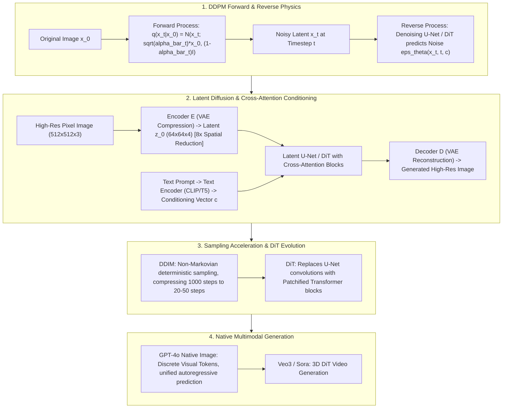

# 🌐 Diffusion Models: DDPM Derivation, Latent Diffusion, DiT & GPT-4o Native Generation

> **Core Executive Summary**: Generative AI rests on two pillars: Autoregressive LLMs and **Diffusion Models**. Inspired by non-equilibrium thermodynamics, diffusion models add Gaussian noise (forward process) and learn to reverse the corruption step-by-step (reverse denoising process). This guide dissects DDPM derivations, DDIM acceleration, Stable Diffusion latent denoising, DiT architectures, and native multimodal token generation.

---

## 💡 Interactive Mermaid Architecture Flowchart



---

## 💡 Classic Interview Followups & Core Cheatsheet

* **Key Topic 1**: Derive the closed-form forward sampling formula $x_t = \sqrt{\bar{\alpha}_t} x_0 + \sqrt{1 - \bar{\alpha}_t} \epsilon$ in DDPM.
  * *Standard Answer*: Single step $x_t = \sqrt{\alpha_t} x_{t-1} + \sqrt{1-\alpha_t} \epsilon_{t-1}$. Recursively expanding $x_{t-1}$ and summing independent Gaussians $\mathcal{N}(0, \sigma_1^2 I) + \mathcal{N}(0, \sigma_2^2 I) = \mathcal{N}(0, (\sigma_1^2 + \sigma_2^2) I)$ yields $x_t = \sqrt{\bar{\alpha}_t} x_0 + \sqrt{1-\bar{\alpha}_t} \epsilon_t$.

> 💡 **Intuition**: Each noise step $x_t = \sqrt{\alpha}x_{t-1} + \sqrt{1-\alpha}\,\epsilon$ is like progressive pixelation. The key trick: sums of Gaussians are Gaussian, so "pixelate 100 times" equals "pixelate once all the way" — the noisy image at step $t$ can be sampled directly from $x_0$ and a single noise vector.
>
> 🎤 **Interview answer**: Conclusion: the closed form $x_t = \sqrt{\bar\alpha_t}\,x_0 + \sqrt{1-\bar\alpha_t}\,\epsilon$ samples any timestep in one step. Why: independent Gaussians add ($\sigma^2 = \sum\sigma_i^2$), and induction over the product gives $\bar\alpha_t = \prod \alpha_s$. Example: with $\beta$ linear from 0.0001 to 0.02, $\bar\alpha_{500} \approx 0.13$ — after 500 steps only 13% of the original signal remains, 87% is noise; that mixture is exactly what the denoiser sees.

* **Key Topic 2**: Compare Markov sampling in DDPM (1000 steps) vs deterministic non-Markov sampling in DDIM (20-50 steps).
  * *Standard Answer*: DDPM requires 1000 sequential Markov steps. DDIM constructs a non-Markovian forward process. Setting stochasticity parameter $\sigma_t = 0$ turns reverse sampling into a deterministic ODE trajectory, enabling 20-50 step strided sampling.

> 💡 **Intuition**: DDPM must walk all 1,000 stairs one by one; DDIM notices the training objective only depends on "the height of each stair," not on "how you climb," so it allows skipping stairs — and it also turns off the randomness, making sampling a deterministic track.
>
> 🎤 **Interview answer**: Conclusion: DDIM builds a non-Markovian forward process; with $\sigma_t = 0$ sampling becomes a deterministic ODE and 20–50 steps suffice. Why: the training loss depends only on the marginal $q(x_t|x_0)$, not on the Markov chain. Example: 1000-step DDPM takes ≈10–30 GPU-seconds per image; DDIM at 50 steps takes ≈1–2 seconds with visually identical quality — it is Stable Diffusion's default sampler.

* **Key Topic 3**: Why does Latent Diffusion Model (LDM) operate in VAE latent space instead of pixel space?
  * *Standard Answer*: Pixel space ($512 \times 512 \times 3$) contains imperceptible high-frequency noise. VAE compresses pixels 8x into latent space ($64 \times 64 \times 4$), reducing diffusion computation by 64x while preserving semantic layout.

> 💡 **Intuition**: 90% of pixel-space information (high-frequency texture, sensor noise) is imperceptible to humans yet burns compute. The VAE compresses the image 8× into latent space, discarding imperceptible details, and the diffusion model only draws the semantic skeleton.
>
> 🎤 **Interview answer**: Conclusion: LDM runs diffusion in VAE latent space ($64\times64\times4$), cutting compute 64×. Why: perceptual compression strips imperceptible high frequencies while keeping semantic structure. Example: $512\times512\times3$ pixels vs $64\times64\times4$ latents is a 64× spatial reduction — SD 1.5 generates on an 8GB consumer GPU, which the same model in pixel space cannot fit.

* **Key Topic 4**: What scaling advantages does Diffusion Transformer (DiT) hold over traditional U-Nets?
  * *Standard Answer*: DiT replaces U-Net convolution blocks with standard patchified ViT blocks. DiT obeys strict compute scaling laws—increasing GFLOPs linearly improves visual quality and prompt alignment.

> 💡 **Intuition**: A U-Net is a bespoke hand-wired circuit — scaling it means restructuring. DiT is standard LEGO bricks (Transformer blocks): add layers and width like stacking a GPT and directly harvest the scaling-law dividend.
>
> 🎤 **Interview answer**: Conclusion: DiT feeds latent patches into standard Transformer blocks, so visual generation follows scaling laws. Why: a uniform architecture with conditioning injection (AdaLN/Cross-Attention) scales parameters and GFLOPs smoothly. Example: Sora, SD3, and Flux all use DiT; DiT-XL has 3–5× the parameters of SD 1.5's U-Net and its FID keeps dropping as GFLOPs grow — "throw compute at it and it gets better" is exactly the GPT-style property.

* **Key Topic 5**: Compare Native image generation (GPT-4o discrete token prediction) vs Pipeline diffusion generation.
  * *Standard Answer*: Pipeline models (SD) use VLM + Diffusion. Native models (GPT-4o) tokenize images via VQ-GAN into discrete tokens within a single autoregressive LLM, enabling real-time interleaved multimodal conversation.

> 💡 **Intuition**: Pipeline generation is relay translation: a VLM understands the prompt, a diffusion model draws — each doing its own job. Native generation is simultaneous interpretation: images and text are generated together as tokens in one model, so you can look, edit, and chat in the same turn.
>
> 🎤 **Interview answer**: Conclusion: Native (GPT-4o) does end-to-end discrete-token generation supporting interleaved image-text; Pipeline (SD) has higher fidelity but modality isolation. Why: a unified autoregressive model jointly models interleaved image-text tokens. Example: "change this cat to a dog" can directly edit existing elements in GPT-4o; SD-family needs a full redraw or inpainting plumbing — the flexibility gap comes from whether one shared representation stream exists.

---

## 📚 Section 1: Diffusion Architecture & Sampler Comparison Matrix

> 📖 **How to read this table**: Read the "Diffusion Space" column first — pixels → latent → discrete tokens: abstraction rises and compute falls. Then the "Sampling Steps" column — 1000 → 20–50 → autoregressive: inference accelerates. These two columns are the interview-favorite evolution contrasts.

| Architecture | Diffusion Space | Sampling Steps | Core Component | Scaling Capability | Model Representative |
| :--- | :--- | :--- | :--- | :--- | :--- |
| **DDPM** | Pixel Space | 1000 (Markov) | 2D U-Net | Poor | Classic DDPM |
| **DDIM** | Pixel / Latent | 20-50 (Deterministic)| 2D U-Net | Fair | Fast Sampler (SD default) |
| **Latent Diffusion (LDM)**| VAE Latent (64x64) | 20-50 steps | VAE + U-Net + Cross-Attn | Good | Stable Diffusion 1.5/2.1 |
| **DiT (Diffusion Transformer)**| VAE Latent (Patchified)| 20-50 steps | VAE + Patchified ViT | **Very Strong (Scaling Law)** | SORA, Stable Diffusion 3, Flux |
| **GPT-4o Native Gen** | Discrete Visual Tokens| Autoregressive Tokens | Unified Autoregressive Transformer| Very Strong | GPT-4o Multimodal |

---

## ⚡ Section 2: Closed-Form Forward Formula

In plain words: one forward-noise step keeps an $\alpha$ fraction of the old image and mixes in a $1-\alpha$ fraction of fresh noise; because Gaussians add, doing this for $t$ steps is equivalent to keeping $\bar\alpha_t$ of the original image and mixing in $1-\bar\alpha_t$ of noise.

$$x_t = \sqrt{\bar{\alpha}_t} x_0 + \sqrt{1 - \bar{\alpha}_t} \epsilon, \quad \epsilon \sim \mathcal{N}(0, I)$$

> 💡 **Intuition**: $\bar\alpha_t$ drops monotonically from 1 to near 0: small $t$ keeps the image clear (signal-dominated), large $t$ approaches pure noise — the mathematical version of progressive pixelation. Training samples a random $t$ and feeds $x_t$ directly to the denoiser.
>
> 🎤 **Interview answer**: Conclusion: any $x_t$ is generated in closed form from $x_0$ and a single noise $\epsilon$ — no 1000-step recursion needed. Why: Gaussian additivity plus the product $\bar\alpha_t = \prod\alpha_s$. Example: at $t=1000$ with $\beta_{end}=0.02$, $1-\bar\alpha \approx 0.9999$ — the endpoint is nearly pure Gaussian noise; at $t=0$ it is the original image, with the scheduler making the signal-to-noise transition smooth.

---

## 🐍 Section 3: Pure Numpy Handwritten DDPM Forward Operator

```python
import numpy as np

class PureNumpyDDPMForwardScheduler:
    def __init__(self, num_timesteps: int = 1000, beta_start: float = 0.0001, beta_end: float = 0.02):
        self.betas = np.linspace(beta_start, beta_end, num_timesteps)
        self.alphas = 1.0 - self.betas
        self.alphas_cumprod = np.cumprod(self.alphas, axis=0)
        self.sqrt_alphas_cumprod = np.sqrt(self.alphas_cumprod)
        self.sqrt_one_minus_alphas_cumprod = np.sqrt(1.0 - self.alphas_cumprod)
        
    def add_noise(self, x_0: np.ndarray, noise: np.ndarray, timesteps: np.ndarray) -> np.ndarray:
        sqrt_alpha_bar = self.sqrt_alphas_cumprod[timesteps][:, None, None, None]
        sqrt_one_minus_alpha_bar = self.sqrt_one_minus_alphas_cumprod[timesteps][:, None, None, None]
        return sqrt_alpha_bar * x_0 + sqrt_one_minus_alpha_bar * noise

if __name__ == "__main__":
    scheduler = PureNumpyDDPMForwardScheduler()
    x_0 = np.random.randn(2, 3, 32, 32)
    noise = np.random.randn(2, 3, 32, 32)
    t = np.array([100, 500])
    x_t = scheduler.add_noise(x_0, noise, t)
    print("✅ DDPM Forward Output Shape:", x_t.shape)
```

> 💡 **Intuition**: The code implements the closed-form formula: precompute the square roots of $\bar\alpha_t$, and `add_noise` completes "keep signal + mix noise" in one line.
>
> 🎤 **Interview answer**: Conclusion: the snippet implements the DDPM forward scheduler and closed-form noising. Why: linear $\beta$ schedule → $\alpha = 1-\beta$ → cumulative product $\bar\alpha$ → square roots are the coefficients. Example: at $t=500$, $\sqrt{1-\bar\alpha} \approx 0.93$ — the image is 93% noise; during training every batch draws different random $t$, so each image is learned across every blur level.

---

## 🚀 Key Takeaways & Best Practices

1. **Architecture Selection**: Prefer **DiT (Diffusion Transformer)** for state-of-the-art text-to-image and video generation.
2. **Latent Space Efficiency**: Run diffusion inside **VAE Latent Space** (8x spatial reduction) to save 64x compute.
3. **Inference Acceleration**: Deploy **DDIM** or **DPMSolver** to reduce inference from 1000 steps to 20 steps.