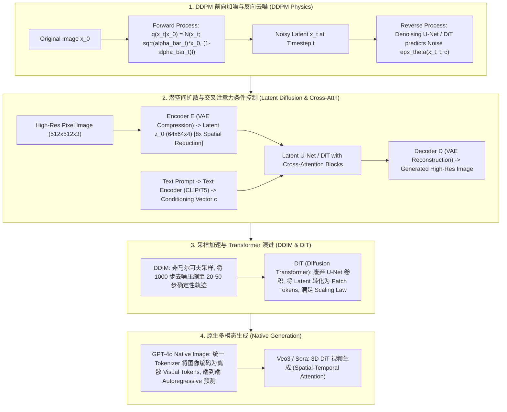

# 🌐 扩散模型全景：DDPM 数理推导、Latent Diffusion (LDM)、DiT 架构与 GPT-4o Native 生成

> **核心摘要**：生成式 AI 的两大支柱分别是自回归模型 (Autoregressive LLMs) 与 **扩散模型 (Diffusion Models)**。扩散模型借鉴了非平衡态热力学 (Non-equilibrium Thermodynamics) 原理，通过向数据添加高斯噪声（前向过程）并学习一步步恢复原始信号（反向去噪过程），实现了超越 GAN 的高画质与丰富多样性。本指南深度解构 DDPM 数学推导、DDIM 加速、Stable Diffusion 潜空间去噪、DiT (Diffusion Transformer) 架构，以及原生多模态 (Native Multimodal) 生成演化。

---

## 💡 交互式 Mermaid 架构流程图



---

## 💡 经典面试追问与考点速查

* **考点 1**：详细推导 DDPM 前向加噪过程的闭式采样公式：如何从 $x_{t-1}$ 递推得到 $x_t$ 关于 $x_0$ 的直接表示？
  * *标准回答*：
    * **单步加噪**：$x_t = \sqrt{1 - \beta_t} x_{t-1} + \sqrt{\beta_t} \epsilon_{t-1}$，令 $\alpha_t = 1 - \beta_t$，即 $x_t = \sqrt{\alpha_t} x_{t-1} + \sqrt{1 - \alpha_t} \epsilon_{t-1}$；
    * **展开两步**：$x_{t-1} = \sqrt{\alpha_{t-1}} x_{t-2} + \sqrt{1 - \alpha_{t-1}} \epsilon_{t-2}$，代入得：
      $$x_t = \sqrt{\alpha_t \alpha_{t-1}} x_{t-2} + \sqrt{\alpha_t (1 - \alpha_{t-1})} \epsilon_{t-2} + \sqrt{1 - \alpha_t} \epsilon_{t-1}$$
    * **高斯分布叠加**：由于两个独立正态分布 $\mathcal{N}(0, \sigma_1^2 I)$ 与 $\mathcal{N}(0, \sigma_2^2 I)$ 相加仍为正态分布，标准差为 $\sqrt{\sigma_1^2 + \sigma_2^2}$。因此后两项噪声可以合并为 $\sqrt{\alpha_t(1-\alpha_{t-1}) + 1-\alpha_t} \bar{\epsilon} = \sqrt{1 - \alpha_t \alpha_{t-1}} \bar{\epsilon}$；
    * **归纳可得**：定义 $\bar{\alpha}_t = \prod_{s=1}^t \alpha_s$，则一步到位的闭式公式为：
      $$x_t = \sqrt{\bar{\alpha}_t} x_0 + \sqrt{1 - \bar{\alpha}_t} \epsilon_t, \quad \epsilon_t \sim \mathcal{N}(0, I)$$
      **物理意义**：无需一步步迭代加噪 1000 次，任意时刻 $t$ 的带噪图像 $x_t$ 都可以通过 $x_0$ 和一个标准高斯噪声 $\epsilon_t$ 直接采样得出！

> 💡 **直观理解**：每步加噪 $x_t = \sqrt{\alpha}x_{t-1} + \sqrt{1-\alpha}\,\epsilon$ 像"逐步打码"。关键是：多个高斯噪声相加仍是高斯，所以"打 100 次码"可以等价成"一次打到底"——t 时刻的模糊图只需 $x_0$ 和一个随机噪声直接生成。
>
> 🎤 **面试速答**：结论：闭式公式 $x_t = \sqrt{\bar\alpha_t}\,x_0 + \sqrt{1-\bar\alpha_t}\,\epsilon$ 让任意时刻的噪声图一步采样。原理：独立高斯叠加 $\sigma^2 = \sum \sigma_i^2$，归纳连乘得 $\bar\alpha_t = \prod \alpha_s$。例子：$\beta$ 线性 0.0001→0.02 时，$t=500$ 处 $\bar\alpha_{500} \approx 0.13$——500 步后只保留 13% 原始信号、87% 是噪声，模型看到的就是这个混合体。

* **考点 2**：对比 DDPM (Markov 采样 1000 步) 与 DDIM (Non-Markov 确定性采样 20~50 步) 的采样数学原理与加速机制？
  * *标准回答*：
    * **DDPM 局限**：DDPM 假设反向去噪过程严格满足 Markov 链，即 $p(x_{t-1}|x_t)$ 仅依赖前一步 $x_t$。这就要求生成时必须从 $t=1000$ 顺次一步步采样到 $t=0$，推理极其缓慢；
    * **DDIM 突破**：DDIM 发现前向训练的目标函数只取决于边缘概率分布 $q(x_t|x_0)$，而并不强求前向过程是 Markov 链。DDIM 构建了一类非马尔可夫 (Non-Markovian) 前向过程，其反向去噪公式允许设定随机性系数 $\sigma_t = 0$。当 $\sigma_t = 0$ 时，反向采样变成了**完全确定性的轨迹**。因此可以跳跃采样（如 $t = 1000 \to 950 \to 900 \dots$），仅需 20~50 步即可生成媲美 1000 步的优质图像！

> 💡 **直观理解**：DDPM 必须"一步步走完 1000 级台阶"；DDIM 发现训练目标只依赖"每一级的高度"而不依赖"怎么爬"，于是允许跨级跳——还顺便把随机性关掉，变成确定性轨道。
>
> 🎤 **面试速答**：结论：DDIM 构造非马尔可夫前向，$\sigma_t=0$ 时采样变为确定性 ODE，20~50 步可出图。原理：训练损失只依赖边缘分布 $q(x_t|x_0)$，与马尔可夫链无关。例子：1000 步 DDPM 生成一张图 ≈10~30 秒 GPU；DDIM 50 步 ≈1~2 秒，质量损失肉眼不可辨——SD 默认采样器就是 DDIM 变体。

* **考点 3**：Latent Diffusion Model (LDM) 为何选择在 VAE 的潜空间 (Latent Space) 进行扩散去噪，而不是直接在像素空间 (Pixel Space) 操作？
  * *标准回答*：
    * **计算效率与像素冗余**：图像在像素空间（如 $512 \times 512 \times 3$）中包含了大量不可见的极高频细节噪声（如微小纹理、背景光斑），直接在像素空间训练 1000 步 U-Net 显存与计算开销巨大；
    * ** perceptual Compression 感知压缩**：LDM 首先训练一个 VAE 编解码器。Encoder $E$ 将 $512 \times 512 \times 3$ 图像压缩 8 倍至 $64 \times 64 \times 4$ 的 Latent $z$。潜在空间剥离了不可感知的高频噪音，保留了核心语义结构。在 $64 \times 64$ 的 Latent 上跑扩散模型，**计算量减少了 64 倍**，使得在消费级 GPU 上进行实时高画质生成成为可能！

> 💡 **直观理解**：像素空间 90% 的信息（高频纹理、噪点）人类根本感知不到，却在耗算力；VAE 先把图压缩 8 倍到潜空间，丢掉不可感知细节，扩散模型只管"画语义骨架"。
>
> 🎤 **面试速答**：结论：LDM 在 VAE 潜空间（$64\times64\times4$）扩散，计算量降 64 倍。原理：感知压缩剥离不可感知高频，保留语义结构。例子：$512\times512\times3$ 像素 vs $64\times64\times4$ 潜变量，空间维度 64 倍缩减；SD 1.5 在消费级 8GB 显存即可出图，像素空间同样模型显存不够。

* **考点 4**：Diffusion Transformer (DiT) 相比传统 U-Net 在视觉生成扩展性 (Scaling Laws) 上具备哪些核心优势？
  * *标准回答*：
    * **U-Net 瓶颈**：传统 Stable Diffusion 1.5/2.1 依赖卷积 U-Net。U-Net 带有复杂的 Residual Blocks 与 Down/Up Sampling 跨层连接，网络结构缺乏统一性，难以像 GPT 那样平滑放大参数量；
    * **DiT 优势 (SORA & SD3 底层)**：DiT 将 VAE 出来的 Latent $z$ 像 ViT 一样切成 Patch Tokens，接入标准的 Transformer Block（使用 AdaLN-Single 或 Cross-Attention 进行条件注入）。DiT 证明了**视觉生成同样遵循严格的 Scaling Laws**——随着 Compute (GFLOPs) 与 Parameter 规模增加，生成画质与 Prompt 对齐度呈线性上升！

> 💡 **直观理解**：U-Net 是"定制手工电路"，改规模要动结构；DiT 是"标准积木（Transformer）"，加层加宽就像堆 GPT——直接吃 scaling law 红利。
>
> 🎤 **面试速答**：结论：DiT 把潜图切成 patch 进标准 Transformer，视觉生成遵循 scaling law。原理：统一架构 + 条件注入（AdaLN/Cross-Attn），参数量与 GFLOPs 平滑扩展。例子：Sora/SD3/Flux 均基于 DiT；DiT-XL 相比 SD 1.5 的 U-Net 参数量大 3~5 倍，FID 随 GFLOPs 单调下降——"堆算力就变好"正是 GPT 式特性。

* **考点 5**：对比 "Native 图像生成 (如 GPT-4o 离散 Token 预测)" 与 "Pipeline 扩散生成 (如 Stable Diffusion 串联)" 的优缺点？
  * *标准回答*：
    * **Pipeline 扩散生成 (SD / Midjourney)**：使用独立的 VLM 理解 Prompt，再将 Context 输入独立的 Diffusion 去噪。优点是画质高、控制力强；缺点是模态隔离，无法实现真正意义上的实时图文交织对话；
    * **Native 图像生成 (GPT-4o)**：使用 VQ-GAN / dVAE 将图像离散化为 Token 序列，直接与文本 Token 混合，由一个统一的 Autoregressive LLM 端到端预测。优点是**真正实现跨模态端到端推理，图文协同理解与连续修改能力极强**；缺点是离散 Token 化对极高频画质有微小损失。

> 💡 **直观理解**：Pipeline 是"翻译接力"：VLM 理解 prompt、扩散模型画图，各干各的；Native 是"同声传译"：图像和文字在同一个模型里以 token 形式一起生成，可以边看边改边聊。
>
> 🎤 **面试速答**：结论：Native（如 GPT-4o）端到端离散 token 生成，支持图文交织；Pipeline（SD）画质高但模态隔离。原理：统一自回归对 interleaved 图文 token 联合建模。例子：GPT-4o 里"把这只猫换成狗"可直接编辑图上已有元素；SD 系需要重绘整图或 inpainting 工程——灵活性差距来自"是否共享一个表征流"。

---

## 📚 第一章：扩散模型架构与采样器演进对比矩阵

> 📖 **怎么读这张表**：先看"扩散空间"列——像素 → 潜空间 → 离散 token，抽象层级越来越高、计算越来越省；再看"采样步数"列——1000 → 20~50 → 自回归，推理越来越快。这两列的演进是面试最爱考的对比点。

| 架构 / 采样器 | 扩散空间 | 采样步数 | 核心组件 | 扩展性 (Scaling) | 典型应用代表 |
| :--- | :--- | :--- | :--- | :--- | :--- |
| **DDPM** | Pixel Space | 1000 步 (马尔可夫) | 2D U-Net + Linear Noise Schedule | 较差 | 经典 DDPM, Improved DDPM |
| **DDIM** | Pixel / Latent | 20 ~ 50 步 (确定性) | 2D U-Net | 一般 | 快速采样器 (SD 默认) |
| **Latent Diffusion (LDM)**| VAE Latent (64x64) | 20 ~ 50 步 | VAE + U-Net + Cross-Attention | 良好 | Stable Diffusion 1.5/2.1 |
| **DiT (Diffusion Transformer)**| VAE Latent (Patchified)| 20 ~ 50 步 | VAE + Patchified ViT Blocks | **极强 (遵循 Scaling Law)** | SORA, Stable Diffusion 3, Flux |
| **GPT-4o Native Gen** | 离散 Visual Tokens | Autoregressive Token预测 | Unified Autoregressive Transformer| 极强 | GPT-4o 图像/语音交互 |

---

## ⚡ 第二章：DDPM 前向采样与损失函数公式

### 2.1 闭式前向采样公式

大白话：前向加噪一步是"保留 $\alpha$ 比例的旧图 + 混入 $1-\alpha$ 比例的新噪声"；因为高斯噪声可叠加，连做 $t$ 步等价于"保留 $\bar\alpha_t$ 比例的原始图 + 混入 $1-\bar\alpha_t$ 比例的噪声"。

$$x_t = \sqrt{\bar{\alpha}_t} x_0 + \sqrt{1 - \bar{\alpha}_t} \epsilon, \quad \epsilon \sim \mathcal{N}(0, I)$$

> 💡 **直观理解**：$\bar\alpha_t$ 从 1 单调降到接近 0：$t$ 小图还清楚（信号为主），$t$ 大接近纯噪声——这就是"逐步打码"的数学版本。训练时随机抽 $t$ 直接采样 $x_t$ 喂给去噪网络。
>
> 🎤 **面试速答**：结论：任意 $t$ 的 $x_t$ 由 $x_0$ 与单一噪声 $\epsilon$ 闭式生成，无需递推 1000 步。原理：高斯可加性 + $\bar\alpha_t = \prod \alpha_s$ 连乘。例子：$t=1000$、$\beta_{end}=0.02$ 时 $1-\bar\alpha \approx 0.9999$，即终点图像 ≈ 纯高斯噪声；$t=0$ 时 ≈ 原图——调度器让信噪比平滑过渡。

### 2.2 DDPM Noise-Prediction (Score Matching) 简化损失函数

大白话：训练时我们已经知道"加了什么噪声 $\epsilon$"，让模型去猜：给模型看带噪图 $x_t$ 和时间 $t$，输出预测噪声 $\epsilon_\theta$，与真实 $\epsilon$ 求 MSE。猜得越准，反向去噪越准。

$$\mathcal{L}_{\text{simple}}(\theta) = \mathbb{E}_{t, x_0, \epsilon} \left[ \left\| \epsilon - \epsilon_\theta\left(\sqrt{\bar{\alpha}_t} x_0 + \sqrt{1 - \bar{\alpha}_t} \epsilon, t\right) \right\|^2 \right]$$

> 💡 **直观理解**：不需要理解复杂变分下界，简单损失 $\|\epsilon - \epsilon_\theta\|^2$ 就够了：去噪网络学的是"给定 $x_t$ 和 $t$，刚才混入的噪声长什么样"。
>
> 🎤 **面试速答**：结论：DDPM 训练 = 噪声预测 MSE，等价于 score matching。原理：预测噪声 = 预测分数（梯度）的缩放，学到梯度场后沿场反向走即去噪。例子：50 万步、batch 64、$t$ 均匀采样 0~1000 训练，同一 $t$ 的损失下降反映去噪精度——$L_{\text{simple}}$ 与生成质量 FID 强相关。

---

## 🐍 第三章：Pure Numpy 手写 DDPM 前向加噪与采样算子

```python
import numpy as np

class PureNumpyDDPMForwardScheduler:
    """ Pure Numpy 实现 DDPM 前向加噪 Scheduler """
    def __init__(self, num_timesteps: int = 1000, beta_start: float = 0.0001, beta_end: float = 0.02):
        self.num_timesteps = num_timesteps
        # 1. 线性 Beta 调度 (Linear Beta Schedule)
        self.betas = np.linspace(beta_start, beta_end, num_timesteps, dtype=np.float64)
        self.alphas = 1.0 - self.betas
        # 2. 累乘 alpha_bar
        self.alphas_cumprod = np.cumprod(self.alphas, axis=0)
        self.sqrt_alphas_cumprod = np.sqrt(self.alphas_cumprod)
        self.sqrt_one_minus_alphas_cumprod = np.sqrt(1.0 - self.alphas_cumprod)
        
    def add_noise(self, x_0: np.ndarray, noise: np.ndarray, timesteps: np.ndarray) -> np.ndarray:
        """
        利用闭式公式直接一步计算 x_t = sqrt(alpha_bar_t) * x_0 + sqrt(1 - alpha_bar_t) * noise
        x_0: shape (B, C, H, W)
        noise: shape (B, C, H, W)
        timesteps: shape (B,)
        """
        sqrt_alpha_bar = self.sqrt_alphas_cumprod[timesteps][:, None, None, None]
        sqrt_one_minus_alpha_bar = self.sqrt_one_minus_alphas_cumprod[timesteps][:, None, None, None]
        
        x_t = sqrt_alpha_bar * x_0 + sqrt_one_minus_alpha_bar * noise
        return x_t

# ==================== 测试验证 ====================
if __name__ == "__main__":
    np.random.seed(42)
    scheduler = PureNumpyDDPMForwardScheduler(num_timesteps=1000)
    
    # 模拟一个 Batch 的图像输入 (B=2, C=3, H=32, W=32)
    x_0 = np.random.randn(2, 3, 32, 32)
    noise = np.random.randn(2, 3, 32, 32)
    t = np.array([100, 500])  # 第 100 步与第 500 步
    
    x_t = scheduler.add_noise(x_0, noise, t)
    print("✅ DDPM 闭式前向加噪成功！带噪图像 x_t 形状:", x_t.shape)
    print("✅ t=500 处的采样标准差系数:", round(scheduler.sqrt_one_minus_alphas_cumprod[500], 4))
```

> 💡 **直观理解**：这段代码就是闭式公式的实现：预计算 $\bar\alpha_t$ 的平方根，`add_noise` 一行完成"保留信号 + 混入噪声"。
>
> 🎤 **面试速答**：结论：代码实现 DDPM 前向调度器与闭式加噪。原理：线性 $\beta$ 调度 → $\alpha = 1-\beta$ → 连乘 $\bar\alpha$ → 开方即系数。例子：$t=500$ 时 $\sqrt{1-\bar\alpha} \approx 0.93$，即 500 步图像 93% 是噪声；训练时每个 batch 随机抽不同 $t$，同一张图在不同模糊度下反复学习。

---

## 🚀 总结与工程最佳实践

1. **去噪架构选型**：工业级文生图/视频首选 **DiT (Diffusion Transformer)** 架构，享有极高的扩展性；
2. **潜空间压缩**：强烈推荐使用 **VAE (8x 压缩)**，在潜空间中运行扩散，计算效率提升 64 倍；
3. **采样加速**：线上实时推理务必使用 **DDIM** 或 **DPMSolver** 降至 20 步采样。