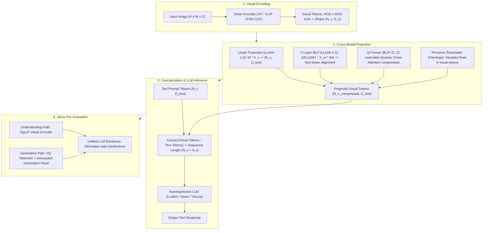

# 🌐 Vision-Language Models (VLM): ViT, Projectors, LLaVA 2-Stage & DeepSeek-Janus Pro

> **Core Executive Summary**: Vision-Language Models (VLMs) empower LLMs to perceive visual scenes. Rather than training multimodal models from scratch, VLMs utilize cross-modal projectors to map visual patch embeddings from pre-trained Vision Encoders (ViTs) into the text embedding space of LLMs. This guide dissects VLM tripartite stacks, LLaVA 2-stage training, AnyRes dynamic resolution, and DeepSeek-Janus Pro decoupled architectures.

---

## 💡 Interactive Mermaid Architecture Flowchart



---

## 💡 Classic Interview Followups & Core Cheatsheet

* **Key Topic 1**: Compare 4 cross-modal projectors (Linear, MLP, Q-Former, Perceiver Resampler) in parameter size and token compression.
  * *Standard Answer*: Linear (fast, zero compression), 2-Layer MLP (non-linear, zero compression, optimal instruction following), Q-Former (compresses visual tokens to fixed 32/64 tokens), Perceiver Resampler (cross-attention resampling).

> 💡 **Intuition**: The projector is the interpreter translating visual-token language into LLM language. Linear does word-by-word translation (all information, but verbose); Q-Former summarizes "the gist in one sentence" (32 tokens, saving context at the cost of detail).
>
> 🎤 **Interview answer**: Conclusion: Linear/MLP keep every token with zero compression; Q-Former/Perceiver compress to a fixed 32/64. Why: Q-Former cross-attends learnable queries with visual features — an information bottleneck that buys context efficiency. Example: a 336×336 image yields 576 patch tokens; Linear sends all 576 into the LLM while Q-Former squeezes them into 32 — an 18× saving in KV cache for long conversations, but fine-grained OCR grounding suffers.

* **Key Topic 2**: Explain LLaVA 2-stage training: Why must Stage 1 freeze ViT & LLM while only tuning the Projector?
  * *Standard Answer*: Stage 1 aligns representations using 595K image-caption pairs. Freezing ViT and LLM prevents unaligned random gradients from corrupting LLM language priors. Stage 2 performs visual instruction tuning by fine-tuning LLM + Projector.

> 💡 **Intuition**: Stage 1 is "learn to translate first, talk later": the ViT and LLM already speak their native languages fluently — fine-tuning both at once breaks both. Train only the interpreter (projector) to align visual words with the text space, then let the LLM learn conversation in Stage 2.
>
> 🎤 **Interview answer**: Conclusion: Stage 1 freezes both towers and trains only the projector (595K caption pairs); Stage 2 freezes the ViT and fine-tunes LLM + projector (150K instructions). Why: it stops unaligned random gradients from destroying pretrained weights — align first, then instruct. Example: LLaVA-1.5 uses a 2-layer MLP projector; after Stage 1 the VQA groundwork is laid, and after Stage 2 end-to-end metrics jump to the 80s — the alignment stage is make-or-break.

* **Key Topic 3**: How to handle token explosion under high-resolution image inputs? Explain AnyRes / LLaVA-NeXT dynamic patching.
  * *Standard Answer*: AnyRes slices high-resolution images into a $2 \times 2$ grid of sub-patches plus a global downsampled overview image, feeding each through ViT and concatenating features.

> 💡 **Intuition**: Shrinking a hi-res image to one small picture hides small text; cutting every patch directly explodes token count. The compromise: keep one global thumbnail plus 2×2/3×3 sub-images inspected separately — global context and OCR detail both survive.
>
> 🎤 **Interview answer**: Conclusion: AnyRes dynamic patching = global thumbnail + 2×2/3×3 sub-patches, each through the ViT, then concatenated. Why: the global view keeps semantics and the sub-patches keep OCR detail — two complementary feature streams. Example: a 1024×1024 image cut at 14×14 patches explodes to ~5400 tokens; AnyRes stays within 1000–2500 tokens with one thumbnail plus 4–9 sub-patches, while OCR accuracy improves notably (LLaVA-NeXT).

* **Key Topic 4**: How does DeepSeek-Janus Pro eliminate understanding vs generation representation conflict in unified autoregressive models?
  * *Standard Answer*: Understanding requires high-level semantic abstraction (SigLIP), while generation requires low-level pixel reconstruction (VQ-Tokenizer). Janus Pro decouples the encoding pathways while sharing a unified LLM backbone.

> 💡 **Intuition**: Understanding needs to "grasp the meaning" (high-level semantics), generation needs to "paint the right pixels" (low-level detail). Forcing one feature stream to do both is like making the same person a theater critic and a photographer — Janus splits the jobs while sharing one brain (the LLM backbone).
>
> 🎤 **Interview answer**: Conclusion: Janus Pro decouples a SigLIP path (understanding) from a VQ-tokenizer path (generation) onto a shared LLM backbone. Why: separating high-level semantics from low-level reconstruction removes the representation conflict. Example: Janus-Pro-7B beats DALL-E 3 at text-to-image and beats LLaVA at understanding — one 7B model doing both tasks, with decoupling as the core reason.

* **Key Topic 5**: How is the LLaVA-Instruct-150K dataset generated using GPT-4 text prompts?
  * *Standard Answer*: Feeds image bounding box coordinates and captions into GPT-4 text prompts to synthesize multi-turn conversations, detailed descriptions, and complex reasoning QA.

> 💡 **Intuition**: Use a language teacher to write vision exam questions: convert each image into text (bboxes + captions), feed it to GPT-4, and have it role-play a questioner producing three question types — conversation, description, reasoning — 150K training samples generated in one pass.
>
> 🎤 **Interview answer**: Conclusion: LLaVA-Instruct-150K is synthesized by GPT-4 from bbox + caption text inputs into three instruction types. Why: a strong text-only LLM understands structured visual descriptions and generates multi-turn QA. Example: each COCO image yields ~3 dialogue turns + 1 detailed description + reasoning questions — 150K samples covering 83K images, launching the "LLM-synthesized multimodal instruction data" paradigm.

---

## 📚 Section 1: VLM Projector Comparison Matrix

> 📖 **How to read this table**: Three key contrasts — output visual tokens ($N_v$ as-is vs fixed 32/64), spatial preservation (100% vs partial loss), and compute cost. "Detail or context efficiency?" is the first question of projector selection.

| Projector Type | Mapping Mechanism | Output Visual Tokens | Compute Cost | Spatial Preservation | Model Representative |
| :--- | :--- | :--- | :--- | :--- | :--- |
| **Linear Projection**| $W \cdot X_v$ | $N_v$ (uncompressed, ~256-576) | Minimal | 100% | LLaVA-1.0, PaLI |
| **2-Layer MLP** | $W_2 \cdot \text{GELU}(W_1 X_v)$ | $N_v$ (uncompressed) | Low | 100% | LLaVA-1.5, LLaVA-NeXT |
| **Q-Former** | Learnable Queries Cross-Attn | Fixed $K$ (e.g. 32/64) | Medium | Partial loss | BLIP-2, InstructBLIP |
| **Perceiver Resampler**| Fixed Queries Cross-Attn | Fixed $K$ (e.g. 64) | Medium | Partial loss | Flamingo, IDEFICS |
| **Janus Decoupled** | SigLIP + VQ Codebook | Decoupled dynamic paths | Medium-High | Dual-path optimal | DeepSeek-Janus Pro |

---

## ⚡ Section 2: VLM Projector Formula

In plain words: visual tokens are up-projected by $W_1$, passed through GELU for nonlinearity, then mapped by $W_2$ into the LLM's embedding dimension — two linear layers with an activation in between are the interpreter's entire structure.

2-Layer MLP Projector:
$$X_{\text{text\_space}} = \text{GELU}(X_{\text{vision}} W_1 + b_1) W_2 + b_2$$

> 💡 **Intuition**: A single linear layer can only do "scale + rotate" alignment; GELU lets the mapping bend, adding expressive power — switching LLaVA-1.5 from Linear to MLP is one of its biggest accuracy gains.
>
> 🎤 **Interview answer**: Conclusion: the 2-layer MLP (1024→2048→4096) is the LLaVA-1.5 standard projector. Why: $W_1$ up-projects, GELU adds nonlinearity, $W_2$ maps back to the LLM dimension while keeping every token. Example: 576 visual tokens of dim 1024 → 576 tokens of dim 4096 — roughly 10.5M parameters, only ~0.15% of a 7B model, yet the alignment impact is significant.

---

## 🐍 Section 3: Pure Numpy Handwritten VLM Projector Operator

```python
import numpy as np

def pure_numpy_vlm_mlp_projector(visual_tokens: np.ndarray, W1: np.ndarray, b1: np.ndarray, W2: np.ndarray, b2: np.ndarray) -> np.ndarray:
    h1 = visual_tokens @ W1 + b1
    gelu = lambda x: 0.5 * x * (1.0 + np.tanh(np.sqrt(2.0 / np.pi) * (x + 0.044715 * np.power(x, 3))))
    return gelu(h1) @ W2 + b2

if __name__ == "__main__":
    v_tokens = np.random.randn(576, 1024)
    W1 = np.random.randn(1024, 2048) * 0.02
    b1 = np.zeros(2048)
    W2 = np.random.randn(2048, 4096) * 0.02
    b2 = np.zeros(4096)
    out = pure_numpy_vlm_mlp_projector(v_tokens, W1, b1, W2, b2)
    print("✅ VLM MLP Projector Output Shape:", out.shape)
```

> 💡 **Intuition**: The code is a literal translation of the formula: two linear transforms with GELU in between; shapes go (576,1024)→(576,2048)→(576,4096), each visual token "translated" into the LLM's word space.
>
> 🎤 **Interview answer**: Conclusion: MLP Projector = $X \cdot W_1 + b_1 \to \text{GELU} \to \cdot W_2 + b_2$. Why: nonlinear alignment lets visual features embed into the text semantic stream. Example: 576×1024 in, 576×4096 out — a negligible fraction of a 7B LLM's inference cost. The projector is cheap; the bottleneck is the ViT and the LLM.

---

## 🚀 Key Takeaways & Best Practices

1. **Projector Choice**: Use **2-Layer MLP** for OCR/grounding accuracy; use **Q-Former** for long-context conversation efficiency.
2. **Stage 1 Safeguard**: Freeze LLM during Stage 1 alignment to protect pre-trained text knowledge.
3. **Unified Multimodal**: Prefer **DeepSeek-Janus Pro** decoupled encoders for combined understanding and generation.