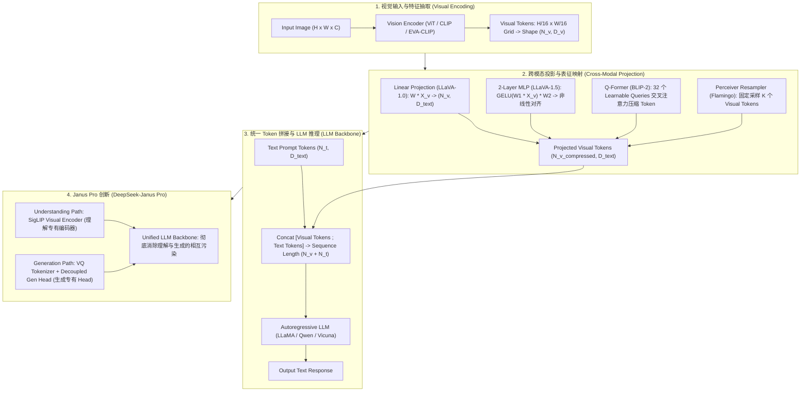

# 🌐 视觉语言大模型 VLM 全景：ViT、Projector 桥接层、LLaVA 阶段训练与 DeepSeek-Janus Pro 原理解构

> **核心摘要**：视觉语言大模型 (Vision-Language Models, VLM) 赋予了大语言模型“看懂世界”的能力。VLM 并非从零开始盲目训练，而是巧妙地通过跨模态投影层 (Cross-Modal Projector) 将预训练视觉编码器 (ViT) 抽取的高维图像 Token 映射至 LLM 的文本词嵌入空间 (Text Embedding Space)。本指南系统拆解 VLM 三段式架构、LLaVA 2-Stage 训练范式、高分辨率 Token 压缩方案，以及 DeepSeek-Janus Pro 统一解耦表征架构。

---

## 💡 交互式 Mermaid 架构流程图



---

## 💡 经典面试追问与考点速查

* **考点 1**：对比 4 种主流 Cross-Modal Projector (Linear Projection, MLP, Q-Former, Perceiver Resampler) 在参数量、计算复杂度与 Token 压缩效率上的利弊？
  * *标准回答*：
    1. **Linear Projection (如 LLaVA-1.0)**：单层矩阵 $W \in \mathbb{R}^{D_v \times D_t}$。参数极少，保留原始空间网格细节，但 Token 数量完全不压缩（ViT 产生多少 Patch 就输出多少 Token）；
    2. **2-Layer MLP (如 LLaVA-1.5)**：带有 GELU 的 2 层 MLP。相比 Linear 增加了非线性表达能力，已被证明能显著提升指令跟随表现；
    3. **Q-Former (如 BLIP-2 / InstructBLIP)**：使用一组固定数量（如 32 个）的可学习 Query 与视觉特征做 Cross-Attention。**优点是将任意数量的图像 Token 强行压缩为 32 个**，大大节省 LLM 上下文；缺点是可能丢失细粒度空间位置信息；
    4. **Perceiver Resampler (如 Flamingo)**：基于 Cross-Attention 的采样器，同样能将高维 Patch 降采样为固定长度。

> 💡 **直观理解**：Projector 是"翻译官"：把视觉 token 的语言翻译成 LLM 的语言。Linear 是逐词直译（信息全但啰嗦），Q-Former 是"一句话概括大意"（32 个 token 压缩，省上下文但丢细节）。
>
> 🎤 **面试速答**：结论：Linear/MLP 保留全部 token、零压缩；Q-Former/Perceiver 压缩到固定 32/64 个。原理：Q-Former 用可学习 query 与视觉特征交叉注意力，用信息瓶颈换取上下文效率。例子：336×336 图 24×24=576 个 patch token，Linear 全进 LLM；Q-Former 压成 32 个，长上下文对话的 KV cache 直接省 18 倍，但细粒度 OCR 定位会受损。

* **考点 2**：详细剖析 LLaVA 两阶段训练流程：为什么 Stage 1 必须冻结 ViT 与 LLM，仅微调 Projector？
  * *标准回答*：
    * **Stage 1 (Feature Alignment 概念对齐)**：使用大约 595K 的图像-文本 Caption 数据对。**冻结 ViT 与 LLM，仅更新 Projector 权重**。原因在于预训练的 ViT 和 LLM 已经各自具备极强单模态表征，此时 LLM 的文本空间与 ViT 空间完全异构。Stage 1 的唯一目的就是将 Projector 训练为一个“翻译官”，将 Visual Feature 线性粗对齐到 Text Space，防止未经对齐的随机梯度直接破坏 LLM 预训练权重；
    * **Stage 2 (Visual Instruction Tuning 视觉指令微调)**：使用 150K 包含复杂问答、逻辑推理的多轮对话数据。**冻结 ViT，同时微调 Projector 与 LLM**，使 LLM 掌握理解视觉指令并生成连贯文本的能力。

> 💡 **直观理解**：Stage 1 像"先学翻译，再学交谈"：ViT 和 LLM 各自已精通母语，直接混着微调会把两边都搞坏；先只练翻译官（Projector）把视觉词对齐到文本空间，Stage 2 才放开 LLM 学对话。
>
> 🎤 **面试速答**：结论：Stage 1 冻结双塔只训 Projector（595K caption 对），Stage 2 冻结 ViT 微调 LLM + Projector（150K 指令）。原理：避免未对齐的随机梯度破坏预训练权重，先对齐再指令微调。例子：LLaVA-1.5 用 2 层 MLP Projector，Stage 1 后 VQA 才有基础，Stage 2 端到端后指标涨到 80% 级——对齐阶段是成败关键。

* **考点 3**：如何处理高分辨率图像 (如 4K 架构) 输入下的 Token 爆炸问题？分析 Patch-Crop 分片 (如 AnyRes / LLaVA-NeXT) 的实现原理？
  * *标准回答*：
    * **Token 爆炸痛点**：若将 1024x1024 图像直接resize，会破坏微小文字（如 OCR 识别）；若直接按 14x14 Patch 切分，会产生 5,000+ 个 Token，超出 LLM 承受极限；
    * **AnyRes / Dynamic Patching 方案**：将高分辨率大图动态切分为 2x2 或 3x3 个子图网格（Sub-patches），每个子图独立输入 ViT 提取特征；同时将原始完整大图 resize 后作为全局 Overview 输入 ViT。最后将全局特征与子图局部细节特征拼接到一起，输入 LLM。该方法既保持了全局语义，又保留了微小 OCR 细节！

> 💡 **直观理解**：高清图直接缩成一张小图会看不清小字，直接全部切成 patch 会 token 爆炸；折中方案：原图保留一张"全局缩略图" + 切成 2×2/3×3 子图分别细看，全局与细节两不误。
>
> 🎤 **面试速答**：结论：AnyRes 动态分片：整图缩略 + 2×2/3×3 子图，各自过 ViT 后拼接。原理：全局图保语义，子图保 OCR 细节，双路特征互补。例子：1024×1024 图按 14×14 patch 切分会爆出约 5400 token；AnyRes 用 1 张缩略 + 4~9 张子图，可控在 1000~2500 token 内，同时 OCR 精度明显提升（LLaVA-NeXT）。

* **考点 4**：DeepSeek-Janus Pro 如何解决传统统一自回归多模态模型中 "理解 (Understanding) 与 生成 (Generation) 相互干扰" 的表征冲突缺陷？
  * *标准回答*：
    * **传统统一模型痛点**：如 Chameleon 等模型尝试用同一个 Vision Tokenizer 既做图像理解又做文生图生成。但理解任务需要高层语义抽象（关注分类与逻辑），而生成任务需要底层像素重建细节（关注纹理与颜色），两者在表征空间上天然冲突；
    * **Janus Pro 创新解耦**：Janus Pro 提出**解耦视觉编码器 (Decoupling Visual Encoders)**。对于理解任务，使用 SigLIP 提取高层语义 Embedding；对于生成任务，使用基于 VQ-Tokenizer 的离散 Codebook。两条路径各自独立，但在中间统一接入一个共享的 Transformer LLM Backbone！成功消除了任务干扰，取得了超越 DALL-E 3 的文生图表现与超越 LLaVA 的理解能力。

> 💡 **直观理解**：理解要"看懂意思"（高层语义），生成要"画对像素"（底层细节），用一个特征流两头都干，就像让同一个人既当剧评家又当摄影师——Janus 把这两个岗位拆开，共享同一个大脑（LLM backbone）。
>
> 🎤 **面试速答**：结论：Janus Pro 用 SigLIP（理解）+ VQ Tokenizer（生成）双路径解耦，共享统一 LLM。原理：分离高层语义与底层重建需求，消除表征冲突。例子：Janus-Pro-7B 文生图超越 DALL-E 3、理解能力超越 LLaVA——同一个 7B 模型两任务都做，解耦是核心原因。

* **考点 5**：分析 Visual Instruction Tuning (视觉指令微调) 数据集 (如 LLaVA-Instruct-150K) 的构建方法？
  * *标准回答*：利用纯文本 GPT-4 强大的泛化能力。将图像的 Bounding Boxes 坐标、详细 Caption 作为纯文本输入 Prompt 给 GPT-4，提示 GPT-4 扮演人类提问者，生成 3 种类型的指令数据：
    1. **Conversational Data (多轮视觉对话)**；
    2. **Detailed Description (详细图像描述)**；
    3. **Complex Reasoning (深度逻辑推理问答)**。
    该方法开创了用强 LLM 自动合成多模态指令数据的范式。

> 💡 **直观理解**：用"语言老师"制造"视觉考题"：把图像转成文字描述（bbox + caption）喂给 GPT-4，让它扮演提问者出三类题——对话、描述、推理，一次生成 150K 训练数据。
>
> 🎤 **面试速答**：结论：LLaVA-Instruct-150K 由 GPT-4 基于 bbox + caption 自动合成三类指令数据。原理：文本强大的 LLM 理解结构化视觉描述并生成多轮问答。例子：每张 COCO 图生成约 3 轮对话 + 1 段详细描述 + 若干推理题，150K 样本覆盖 83K 图——开创"LLM 合成多模态指令数据"范式。

---

## 📚 第一章：VLM Projector 架构特性对比矩阵

> 📖 **怎么读这张表**：三组关键对比——视觉 Token 输出数量（$N_v$ 原样 vs 固定 32/64）、空间位置保留（100% vs 部分损失）、计算开销。"要细节还是要上下文效率"是 Projector 选型的第一问。

| Projector 类型 | 映射机制 | 视觉 Token 输出数量 | 计算开销 | 空间位置保留 | 典型模型代表 |
| :--- | :--- | :--- | :--- | :--- | :--- |
| **Linear Projection**| $W \cdot X_v$ | $N_v$ (原样输出, 约 256~576) | 极小 | 100% 保持 | LLaVA-1.0, PaLI |
| **2-Layer MLP** | $W_2 \cdot \text{GELU}(W_1 X_v)$ | $N_v$ (原样输出) | 小 | 100% 保持 | LLaVA-1.5, LLaVA-NeXT |
| **Q-Former** | Learnable Queries Cross-Attn | 固定 $K$ 个 (如 32/64) | 中 | 部分损失 (全局池化) | BLIP-2, InstructBLIP |
| **Perceiver Resampler**| Fixed Queries Cross-Attn | 固定 $K$ 个 (如 64) | 中 | 部分损失 | Flamingo, IDEFICS |
| **Janus Decoupled** | SigLIP + VQ-Codebook | 动态解耦路径 | 中高 | 完美兼容理解与生成 | DeepSeek-Janus Pro |

---

## ⚡ 第二章：VLM 投影层算子公式

### 2.1 2-Layer MLP Projector 映射公式

大白话：视觉 token 先乘 $W_1$ 升维、过 GELU 引入非线性、再乘 $W_2$ 映射到 LLM 的嵌入维度——两个线性层中间夹一个激活，就是"翻译官"的全部结构。

$$X_{\text{text\_space}} = \text{GELU}(X_{\text{vision}} W_1 + b_1) W_2 + b_2$$

> 💡 **直观理解**：一层线性只能做"缩放 + 旋转"式对齐，MLP 的 GELU 让映射可以弯曲，表达能力更强——LLaVA-1.5 从 Linear 换 MLP 是主要精度提升来源之一。
>
> 🎤 **面试速答**：结论：2 层 MLP（1024→2048→4096）是 LLaVA-1.5 标配 Projector。原理：$W_1$ 升维 + GELU 非线性 + $W_2$ 降回 LLM 维，保持全部 token。例子：576 个 1024 维视觉 token → 576 个 4096 维 LLM token，参数量约 10.5M，只占 7B 模型的 0.15%——轻量但对齐效果显著。
其中 $X_{\text{vision}} \in \mathbb{R}^{N_v \times D_v}$，$W_1 \in \mathbb{R}^{D_v \times D_h}$，$W_2 \in \mathbb{R}^{D_h \times D_{\text{llm}}}$。

---

## 🐍 第三章：Pure Numpy 手写 VLM Visual Token Projection 算子

```python
import numpy as np

def pure_numpy_vlm_mlp_projector(visual_tokens: np.ndarray, W1: np.ndarray, b1: np.ndarray, W2: np.ndarray, b2: np.ndarray) -> np.ndarray:
    """
    Pure Numpy 实现 LLaVA-1.5 风格的 2-Layer MLP 跨模态投影层
    visual_tokens: shape (N_v, D_v)
    W1: shape (D_v, D_h)
    W2: shape (D_h, D_llm)
    """
    # 1. 线性变换 1
    h1 = visual_tokens @ W1 + b1  # shape (N_v, D_h)
    
    # 2. GELU 激活函数近似计算
    # GELU(x) = 0.5 * x * (1 + tanh(sqrt(2/pi) * (x + 0.044715 * x^3)))
    def gelu(x):
        return 0.5 * x * (1.0 + np.tanh(np.sqrt(2.0 / np.pi) * (x + 0.044715 * np.power(x, 3))))
        
    h1_act = gelu(h1)
    
    # 3. 线性变换 2 -> 映射到 LLM 词嵌入空间
    projected_tokens = h1_act @ W2 + b2  # shape (N_v, D_llm)
    return projected_tokens

# ==================== 测试验证 ====================
if __name__ == "__main__":
    np.random.seed(42)
    N_v, D_v, D_h, D_llm = 576, 1024, 2048, 4096
    v_tokens = np.random.randn(N_v, D_v)
    
    W1 = np.random.randn(D_v, D_h) * 0.02
    b1 = np.zeros(D_h)
    W2 = np.random.randn(D_h, D_llm) * 0.02
    b2 = np.zeros(D_llm)
    
    out_tokens = pure_numpy_vlm_mlp_projector(v_tokens, W1, b1, W2, b2)
    print("✅ VLM MLP Projector 投影完成！输出 Token 形状:", out_tokens.shape)
```

> 💡 **直观理解**：代码就是公式直译：两次线性变换中间夹 GELU；形状 (576,1024)→(576,2048)→(576,4096)，每个视觉 token 被"翻译"成 LLM 词空间向量。
>
> 🎤 **面试速答**：结论：MLP Projector = $X \cdot W_1 + b_1 \to \text{GELU} \to \cdot W_2 + b_2$。原理：非线性对齐让视觉特征嵌入文本语义流。例子：输入 576×1024、输出 576×4096，在 7B LLM 推理中占比极小——Projector 便宜，瓶颈在 ViT 与 LLM。

---

## 🚀 总结与工程最佳实践

1. **Projector 选型**：注重细粒度 OCR / 坐标定位选择 **2-Layer MLP**；注重长上下文对话效率选择 **Q-Former 压缩**；
2. **训练范式避坑**：Stage 1 对齐务必冻结 LLM，防止未对齐的随机投影梯度破坏预训练文本语义；
3. **理解与生成统一**：复杂多模态系统首选 **DeepSeek-Janus Pro** 的解耦编码器架构。