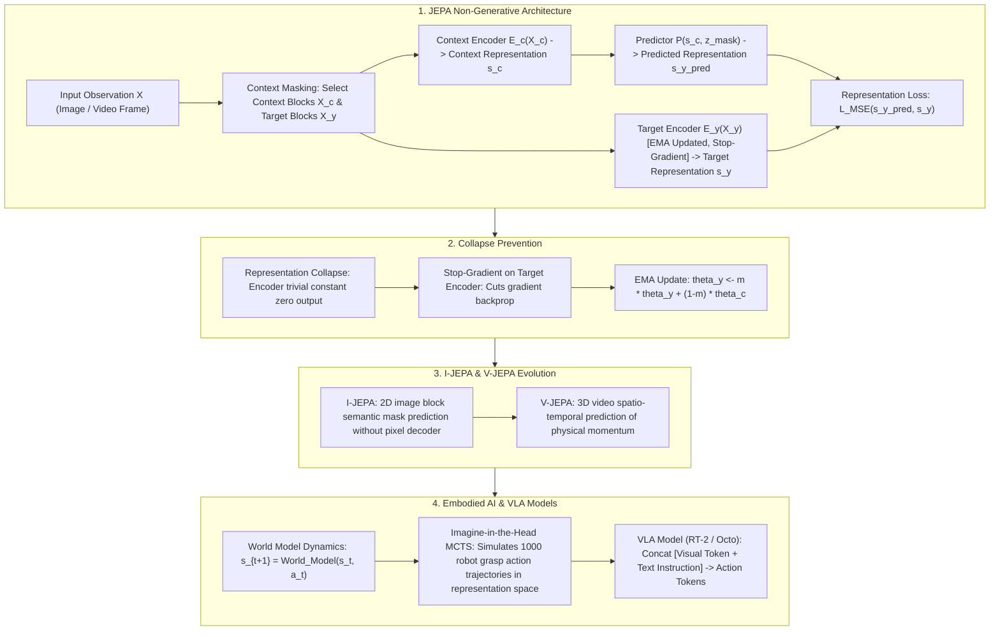

# 🌐 World Models & JEPA: Yann LeCun's Non-Generative Prediction, I-JEPA/V-JEPA & Embodied AI (VLA)

> **Core Executive Summary**: Turing Award winner Yann LeCun proposed **JEPA (Joint Embedding Predictive Architecture)**, advocating abandoning pixel-level reconstruction in favor of predicting world dynamics within an abstract representation space. World Models aim to construct an internal mental model of physical laws for AI. This guide dissects JEPA non-generative philosophy, I-JEPA mask prediction, V-JEPA spatio-temporal dynamics, EMA collapse prevention, and Embodied AI (VLA robotics).

---

## 💡 Interactive Mermaid Architecture Flowchart



---

## 💡 Classic Interview Followups & Core Cheatsheet

* **Key Topic 1**: Why does Yann LeCun critique pixel-reconstruction generative models and propose non-generative JEPA?
  * *Standard Answer*: Pixel reconstruction forces models to spend parameters capturing irrelevant high-frequency noise (e.g., leaves fluttering). JEPA predicts only abstract semantic representations, focusing on physical causality and object dynamics.

> 💡 **Intuition**: When humans predict the future, they think "the ball will roll down the stairs" — not the RGB value of every pixel. Pixel prediction wastes parameters on irrelevant high-frequency noise like fluttering leaves and glinting water; JEPA predicts semantic vectors only.
>
> 🎤 **Interview answer**: Conclusion: JEPA abandons pixel reconstruction and predicts only in representation space. Why: pixel-level generation must fit infinite microscopic uncertainty, consuming parameters on noise; semantic prediction ignores detail and focuses on causality. Example: a 512×512 image has ~780k pixels — JEPA predicts a 768-dim semantic vector instead of 780k pixel values; for the same video-understanding effect, compute differs by three orders of magnitude.

* **Key Topic 2**: Deconstruct I-JEPA & V-JEPA: Roles of Context Encoder, Target Encoder, Predictor, and Stop-gradient.
  * *Standard Answer*: Context Encoder processes unmasked regions $X_c$. Predictor maps $s_c$ and mask token $z$ to $\hat{s}_y$. Target Encoder processes $X_y$. Stop-gradient on Target Encoder prevents the encoders from collapsing into constant outputs.

> 💡 **Intuition**: Three roles: the Context Encoder reads "the visible part," the Predictor guesses "what the masked part means semantically," and the Target Encoder provides "the answer key." The answer side is forbidden from updating (stop-gradient) and only follows via EMA — otherwise the model would learn to "output zeros and pass the exam."
>
> 🎤 **Interview answer**: Conclusion: Context Encoder encodes context, Predictor forecasts the target representation, Target Encoder (EMA + stop-grad) supplies the target. Why: stop-gradient prevents representation collapse and EMA lets the target network track smoothly. Example: mask the bottom half of an image — the context encoder processes the top, the predictor forecasts the bottom's semantic vector, and MSE against the EMA target encoder's encoding does the rest, with no labels at all.

* **Key Topic 3**: What is Representation Collapse in self-supervised learning? How do JEPA, DINO, and BYOL prevent it?
  * *Standard Answer*: Collapse occurs when encoders output constant vectors (entropy = 0) to trivialize the loss. Prevented via Stop-Gradient + EMA (BYOL/JEPA), Centering & Sharpening (DINO), or VICReg variance regularization.

> 💡 **Intuition**: Collapse is the model cheating: every input maps to the same constant vector, the loss instantly hits zero, and nothing is learned — like an exam where turning in a blank sheet scores full marks; the "zero = perfect" criterion is broken.
>
> 🎤 **Interview answer**: Conclusion: representation collapse is the encoder-degenerates-to-a-constant failure; the three defenses are stop-grad + EMA (BYOL/JEPA), centering + sharpening (DINO), and variance penalties (VICReg). Why: cutting target-path gradients or forcing distribution shape blocks the "constant zero" solution. Example: if DINO's centering is removed, ViT features collapse to a constant within 10 epochs and linear-probe accuracy drops from 70%+ to chance level — the most common self-supervised training accident.

* **Key Topic 4**: How do World Models enable Embodied AI robots to simulate action trajectories in an internal mental space?
  * *Standard Answer*: Rather than trial-and-error in hardware, a World Model $s_{t+1} = \mathcal{W}(s_t, a_t)$ allows a robot to "imagine" 1,000 action trajectories internally, evaluating safety and success scores before executing optimal actions.

> 💡 **Intuition**: Give the robot an "inner miniature world": instead of risking hardware, rehearse 1,000 action trajectories in its head and execute the safest — like a pilot practicing emergencies in a simulator.
>
> 🎤 **Interview answer**: Conclusion: a world model enables "imagine-then-plan": simulate action trajectories via $s_{t+1} = \mathcal{W}(s_t, a_t)$, score safety and success, then execute. Why: trial and error in imagination costs ~0 and avoids real hardware damage. Example: for grasping, first simulate 100 grasp trajectories in latent MCTS and execute the one with >95% success; one real-world failure may break a gripper, while 1,000 imagined runs cost a single forward pass.

* **Key Topic 5**: Analyze VLA (Vision-Language-Action) architecture (e.g. RT-2) mapping visual instructions to discrete action tokens.
  * *Standard Answer*: Discretizes 7-DOF robot control dimensions into 256 bins mapped as vocabulary tokens (`<action_x_128>`). Concatenates visual tokens + text prompts into VLM to autoregressively output action tokens.

> 💡 **Intuition**: Turn "robot actions" into "language": the 7 control dimensions (position + orientation + gripper) are discretized into vocabulary tokens, so "pick up the apple" makes the model output a string of action tokens — writing actions like writing sentences.
>
> 🎤 **Interview answer**: Conclusion: VLA discretizes 7-DoF actions into 256-bin vocabulary tokens and feeds them with visual and text tokens into a VLM that autoregressively outputs actions. Why: actions-as-language aligns vision, language, and physical control end to end. Example: RT-2 builds on PaLI-X and emits tokens like `<action_x_128>` with no hand-written control logic; web-scale pretraining lets RT-2 follow grasp commands for objects never seen in its training set, such as unfamiliar tableware.

---

## 📚 Section 1: JEPA vs Generative Models Comparison Matrix

> 📖 **How to read this table**: The "Prediction Space" and "Decoder Required" columns are the soul — every pixel-space row needs a heavy decoder; every feature/action-space row needs none. The heavier the decoder, the more compute wasted; "decoder-free prediction" is JEPA's core selling point.

| Architecture | Prediction Space | Target Loss | Decoder Required | Ignores High-Freq Noise | Primary Application |
| :--- | :--- | :--- | :--- | :--- | :--- |
| **VAE / GAN** | Pixel Space | MSE / Perceptual Loss | Yes (Heavy Decoder) | No | Image generation & reconstruction |
| **Diffusion (DDPM)**| Pixel / Latent Space | Noise Matching MSE | Yes (VAE Decoder) | No | High-fidelity image/video generation |
| **I-JEPA** | Feature Space | Representation MSE | **No** | **Yes (Focus on semantics)**| Self-supervised vision pre-training |
| **V-JEPA** | Spatio-temporal Feature| Spatio-temporal MSE | **No** | **Yes (Focus on physics)** | Video physical dynamics & prediction |
| **VLA (RT-2 / Octo)**| Discrete Action Space | Cross-Entropy Loss | No | Yes | Embodied AI robotics control |

---

## ⚡ Section 2: JEPA Representation Loss Formula

In plain words: take the MSE between the predicted semantic vector of the masked target block and the answer-key vector from the target encoder — with stop-gradient on the answer so the predictor chases the target without dragging it off.

$$\mathcal{L}_{JEPA} = \left\| P(E_c(X_c), z_{\text{mask}}) - \text{sg}\big(E_y(X_y)\big) \right\|_2^2$$

> 💡 **Intuition**: $\text{sg}(\cdot)$ is a one-way street: gradients flow only into $P(E_c(\cdot))$, never into $E_y$. The target encoder evolves only via EMA, keeping the training target stable and collapse-free.
>
> 🎤 **Interview answer**: Conclusion: JEPA loss = representation-space MSE + stop-gradient. Why: the predictor chases an EMA target network, so the two networks cannot co-degenerate. Example: random init with $B=4$, $D=128$ gives loss ≈1.0; after training it drops below 0.3 — the drop shows the predictor increasingly understands masked blocks semantically.

---

## 🐍 Section 3: Pure Numpy Handwritten JEPA Loss Operator

```python
import numpy as np

def pure_numpy_jepa_loss(context_predicted_repr: np.ndarray, target_encoder_repr: np.ndarray) -> tuple:
    target_stable = target_encoder_repr.copy()  # Stop-gradient detach
    diff = context_predicted_repr - target_stable
    loss = float(np.mean(np.square(diff)))
    grad_pred = 2.0 * diff / context_predicted_repr.size
    return loss, grad_pred

if __name__ == "__main__":
    s_pred = np.random.randn(4, 128)
    s_target = np.random.randn(4, 128)
    loss, grad = pure_numpy_jepa_loss(s_pred, s_target)
    print("✅ JEPA Representation Loss:", round(loss, 4))
```

> 💡 **Intuition**: `target_stable = target_encoder_repr.copy()` simulates stop-gradient: the predictor gets gradients from the difference while the target branch stays frozen — the loss only corrects the prediction direction.
>
> 🎤 **Interview answer**: Conclusion: the code implements the JEPA loss and a manual gradient for the predictor. Why: the gradient $2\cdot\text{diff}/\text{size}$ flows only into the Predictor; the detached target is never updated. Example: with $B=4$, $D=128$, the random-init gradient norm ≈0.15 and shrinks as training loss falls — "better predictions, smaller corrections."

---

## 🚀 Key Takeaways & Best Practices

1. **Self-Supervised Vision**: Use **V-JEPA** for learning physical world dynamics without wasting compute on pixel reconstruction.
2. **Collapse Prevention**: Always pair self-supervised encoders with **Stop-gradient + EMA Target Networks**.
3. **Robotics Control**: Implement **VLA (Vision-Language-Action)** discrete tokenization for end-to-end robot policy learning.