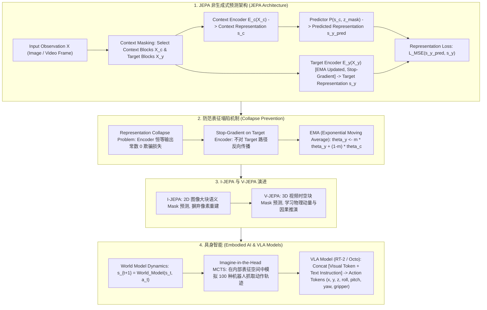

# 🌐 世界模型与 JEPA 全景：Yann LeCun 非生成式表征预测、I-JEPA / V-JEPA 与具身智能 (VLA) 落地

> **核心摘要**：图灵奖得主 Yann LeCun 提出了著名的 **JEPA (Joint Embedding Predictive Architecture)** 架构，主张放弃像素级生成（Pixel Reconstruction），转而在抽象表征空间 (Representation Space) 中预测世界的未来演变。世界模型 (World Models) 试图为 AI 构建一个符合物理定律的内部心理模型 (Mental Model)。本指南系统拆解 JEPA 非生成式预测哲学、I-JEPA 图像语义补全、V-JEPA 视频时空演化、防止表征塌陷的 EMA 机制，以及在具身智能 (VLA 机器人控制) 中的落地范式。

---

## 💡 交互式 Mermaid 架构流程图



---

## 💡 经典面试追问与考点速查

* **考点 1**：深入剖析 Yann LeCun 为何批判生成式模型 (Generative Models / Pixel Reconstruction)，并提出 JEPA 非生成式表征预测架构？
  * *标准回答*：
    * **生成式模型的缺陷**：像 DDPM、VAE、Auto-regressive 图像生成等模型，目标都是在像素空间预测具体的 RGB 数值。但真实世界包含了无穷无尽的微观不确定性（如树叶在风中的无规则抖动、水面的波光）。试图精确预测每一个像素不仅需要极度庞大的计算资源，而且被迫消耗大量参数去拟合无意义的高频噪声；
    * **JEPA 非生成式物理含义**：人类在思考未来时，脑海中浮现的是抽象概念（如“球会滚下楼梯”），而不是每一个像素的颜色。JEPA 扔掉了解码器 (Decoder)，**仅在经过抽象编码的表征空间 (Representation Space) 中预测未来的语义 Vector**！忽略细节噪音，只关注物体的运动、因果关系与物理规律。

> 💡 **直观理解**：预测未来时，人脑想的是"球会滚下楼梯"这个语义，不是每一粒像素的 RGB 值。像素预测把算力浪费在树叶抖动、水面波光这些无关高频噪声上，JEPA 只预测语义向量。
>
> 🎤 **面试速答**：结论：JEPA 放弃像素重建，只在表征空间预测。原理：像素级生成要拟合无穷微观不确定性，参数被噪声占用；语义预测忽略细节、聚焦因果。例子：一张 512×512 图有 78 万像素，JEPA 只需预测 768 维语义向量，而像素自回归要预测 78 万次——同样的视频理解效果，计算量差 3 个数量级。

* **考点 2**：详细解构 I-JEPA 与 V-JEPA 的架构组件：Context Encoder, Target Encoder, Predictor 以及 Stop-gradient 机制的物理作用？
  * *标准回答*：
    * **Context Encoder**：处理被未掩码的上下文区域 $X_c$，输出上下文向量 $s_c$；
    * **Predictor**：接收 $s_c$ 和目标块的位置 Mask 信息 $z$，尝试预测目标区域在表征空间中的 Vector $\hat{s}_y$；
    * **Target Encoder**：处理目标原始图像块 $X_y$，产生基准表征 $s_y$；
    * **Stop-gradient 物理作用**：如果直接对 Target Encoder 反向传播，系统会迅速退化（Encoder 学会输出恒等常数向量 $s_c = s_y = 0$，使得 Loss 为 0，即 **Representation Collapse**）。因此对 Target Encoder 施加 **Stop-gradient (切断梯度)**，且参数通过 Context Encoder 的**指数移动平均 (EMA)** 进行平滑更新！

> 💡 **直观理解**：三个角色：Context Encoder 读"看得见的部分"，Predictor 猜"被遮住的部分在语义上长什么样"，Target Encoder 提供"标准答案"；但答案那边不许更新（Stop-gradient），只能靠 EMA 慢慢跟上——否则模型会学会"全部输出 0 骗过考试"。
>
> 🎤 **面试速答**：结论：Context Encoder 编码上下文、Predictor 预测目标表征、Target Encoder（EMA + Stop-grad）提供目标。原理：Stop-grad 防止表示塌陷，EMA 让目标网络平滑追赶。例子：一张图遮住下半部分，context 编码上半，预测下半语义向量，与 EMA 目标网络对下半的编码做 MSE——图像自监督无需任何标签。

* **考点 3**：在自监督表征学习中，表征塌陷 (Representation Collapse) 是什么？JEPA 与 DINO/BYOL 是如何防止 Collapse 的？
  * *标准回答*：
    * **表征塌陷定义**：神经网络为了逃避复杂的学习，将所有输入样本都映射为一个固定常数向量（信息熵为 0）；
    * **防止 Collapse 的三大机制**：
      1. **Stop-Gradient + EMA (BYOL/I-JEPA)**：主网络更新，目标网络平滑追赶，防止两端协同退化；
      2. **Centering & Sharpening (DINO)**：对输出进行均值中心化并使用温度参数调节概率分布；
      3. **VICReg 正则**：显式加入 Variance (方差)、Invariance (不变性)、Covariance (协方差) 惩罚项。

> 💡 **直观理解**：塌陷 = 模型"作弊"：所有输入都输出同一个常数向量，损失立刻为 0，但什么都没学到。就像考试交白卷也能得零分，但"零分=满分"的标准坏了。
>
> 🎤 **面试速答**：结论：表征塌陷是 encoder 输出常数的退化；三大防线：Stop-grad + EMA（BYOL/JEPA）、Centering + Sharpening（DINO）、方差惩罚（VICReg）。原理：切断目标路径梯度或强制分布形状，阻止"常数为零解"。例子：DINO 的 centering 若去掉，ViT 特征在 10 epoch 内塌缩成常数，线性探测精度从 70%+ 掉到随机水平——这是自监督训练最常见的事故。

* **考点 4**：世界模型 (World Models) 如何为具身智能 (Embodied AI) 机器人提供在想象空间中进行动作轨迹 (Action Trajectory) 预测与规划的能力？
  * *标准回答*：传统强化学习需要机器人在真实物理世界中试错，成本极高且容易损坏硬件。有了世界模型 $s_{t+1} = \mathcal{W}(s_t, a_t)$ 后，机器人可以在**内部“心智”空间中预演 1000 种可能的动作序列**（Imagine-in-the-Head），评估每种轨迹在未来的安全得分与任务完成度，选取最优动作轨迹后再在真实物理世界中真正执行！

> 💡 **直观理解**：给机器人装一个"内心里的小世界"：不用真碰坏硬件，先在脑子里把 1000 种动作轨迹全部演一遍，选最稳的再动手——像飞行员在模拟舱里练特情。
>
> 🎤 **面试速答**：结论：世界模型让机器人"想象规划"：$s_{t+1} = \mathcal{W}(s_t, a_t)$ 预演动作轨迹，评估安全与成功率后执行。原理：想象空间试错成本 ≈0，规避真机损坏风险。例子：抓取任务先在潜空间 MCTS 模拟 100 条抓取轨迹，取成功率 >95% 的执行；真机试错 1 次可能损坏夹具，想象 1000 次成本只有 1 次前向。

* **考点 5**：分析 VLA (Vision-Language-Action) 模型 (如 Google RT-2) 将视觉指令映射为离散机器人动作 (Action Tokens) 的架构逻辑？
  * *标准回答*：
    * **Action Tokenization 离散化**：将机器人的连续控制量（如末端执行器 $x, y, z$ 坐标变化、俯仰角 $\text{roll}, \text{pitch}, \text{yaw}$ 以及夹爪开合 $\text{gripper}$，通常共 7 个 DOF）离散化为 256 个 Bin，映射为词表中的普通 Token（如 `<action_x_128>`）；
    * **统一 Architecture**：将相机输入的图像转化为 Visual Tokens，结合人类文本指令 "Pick up the apple"，输入给标准 VLM (如 PaLI-X)。VLM 直接自回归输出离散的 Action Tokens，实现了视觉-语言到物理控制的端到端对齐！

> 💡 **直观理解**：把"机器人动作"也变成"语言"：7 维控制量（位置 + 姿态 + 夹爪）离散化成词表 token，于是"给我拿起苹果"→ 模型直接输出一串动作 token，像写句子一样写动作。
>
> 🎤 **面试速答**：结论：VLA 把 7-DoF 动作离散为 256 bins 词表 token，与视觉 + 文本 token 一起喂 VLM 自回归输出。原理：动作即语言，端到端对齐视觉-语言-物理控制。例子：RT-2 用 PaLI-X，输出 `<action_x_128>` 这类 token，无需手写控制逻辑；大规模网页数据预训练让 RT-2 对未见物体（如没有训练样本的餐具）也能完成抓取指令。

---

## 📚 第一章：JEPA 与传统生成模型对比矩阵

> 📖 **怎么读这张表**：第二列"预测空间"与第四列"是否需要 Decoder"是灵魂——像素空间全部需要重解码器，特征/动作空间全部不需要。解码器越重，算力浪费越多；JEPA 系的核心卖点就是"无解码器预测"。

| 架构 / 范式 | 预测空间 | 目标损失 | 是否需要 Decoder | 忽略高频细节 | 核心适用场景 |
| :--- | :--- | :--- | :--- | :--- | :--- |
| **VAE / GAN** | 像素空间 (Pixel Space) | MSE / Perceptual Loss | 是 (重度 Decoder)| 否 (强拟合高频像素) | 图像生成与重构 |
| **Diffusion (DDPM)**| 像素 / Latent 空间 | Noise Matching MSE | 是 (VAE Decoder) | 否 | 画质高保真文生图/视频 |
| **I-JEPA** | 抽象表征空间 (Feature) | Representation MSE | **否 (无 Decoder)**| **是 (专注高层语义)**| 图像自监督表征预训练 |
| **V-JEPA** | 时空表征空间 (Feature) | Spatio-temporal MSE | **否** | **是 (专注物理规律)**| 视频物理推演与动作预测 |
| **VLA (RT-2 / Octo)**| 离散 Action Space | Cross-Entropy Loss | 否 | 是 | 具身智能机器人控制 |

---

## ⚡ 第二章：JEPA 损失函数公式

### 2.1 JEPA 表征预测损失

大白话：把"预测出的目标块语义向量"与"目标编码器给出的标准答案语义向量"做 MSE，注意标准答案带 Stop-gradient（不参与反向传播）——只让预测器去追赶，不让答案被预测器拉偏。

$$\mathcal{L}_{JEPA} = \left\| P(E_c(X_c), z_{\text{mask}}) - \text{sg}\big(E_y(X_y)\big) \right\|_2^2$$
其中 $\text{sg}(\cdot)$ 代表 Stop-gradient 算子。

> 💡 **直观理解**：$\text{sg}(\cdot)$ 是"单行道"：梯度只流向 $P(E_c(\cdot))$，不流向 $E_y$。这样 $E_y$ 只能通过 EMA 慢速演化，保证训练目标稳定不塌缩。
>
> 🎤 **面试速答**：结论：JEPA 损失 = 表征空间 MSE + Stop-gradient。原理：预测器追赶 EMA 目标网络，两网不会协同退化。例子：$B=4$、$D=128$ 的随机初始化下 loss ≈1.0；训练后降到 0.3 以下——损失下降说明"预测器在语义上越来越懂遮挡块"。

---

## 🐍 第三章：Pure Numpy 手写 JEPA Loss 与 Stop-Gradient 算子

```python
import numpy as np

def pure_numpy_jepa_loss(context_predicted_repr: np.ndarray, target_encoder_repr: np.ndarray) -> tuple:
    """
    Pure Numpy 实现 JEPA 抽象表征预测损失与 Stop-Gradient 模拟算子
    context_predicted_repr: shape (B, D)  - 来自 Predictor
    target_encoder_repr:    shape (B, D)  - 来自 Target Encoder (Stop-Gradient)
    """
    # 1. 切断 Target Encoder 的梯度方向 (在计算图上标定)
    target_stable = target_encoder_repr.copy()  # Stop-gradient detach
    
    # 2. 计算表征空间的 MSE Loss
    diff = context_predicted_repr - target_stable
    loss = np.mean(np.square(diff))
    
    # 3. 计算对 Predictor 的梯度 (d_Loss / d_pred)
    grad_pred = 2.0 * diff / context_predicted_repr.size
    
    return float(loss), grad_pred

# ==================== 测试验证 ====================
if __name__ == "__main__":
    np.random.seed(42)
    B, D = 4, 128
    s_pred = np.random.randn(B, D)
    s_target = np.random.randn(B, D)
    
    loss, grad_pred = pure_numpy_jepa_loss(s_pred, s_target)
    print("✅ JEPA 表征预测 Loss 计算成功:", round(loss, 4))
    print("✅ Predictor 反向梯度范数:", round(np.linalg.norm(grad_pred), 6))
```

> 💡 **直观理解**：代码里 `target_stable = target_encoder_repr.copy()` 就是模拟 Stop-gradient：预测器对 diff 求梯度，目标分支被"冻结"，损失只修正预测方向。
>
> 🎤 **面试速答**：结论：代码实现 JEPA 损失与对预测器的手工梯度。原理：梯度 $2 \cdot \text{diff} / \text{size}$ 只回传 Predictor；目标表征 detach 后不更新。例子：$B=4$、$D=128$，随机初始化梯度范数 ≈0.15，随训练 loss 下降梯度范数同步变小——"预测越来越准，修正越来越少"。

---

## 🚀 总结与工程最佳实践

1. **自监督预训练选型**：注重高层语义抽象与物理规则学习首选 **V-JEPA**，摆脱像素生成巨大的算力浪费；
2. **防范 Collapse**：自监督模型必须引入 **Stop-gradient + EMA Target Network** 机制；
3. **具身智能控制**：机器人系统推荐采用 **VLA (Vision-Language-Action)** 离散 Action Token 化方案。