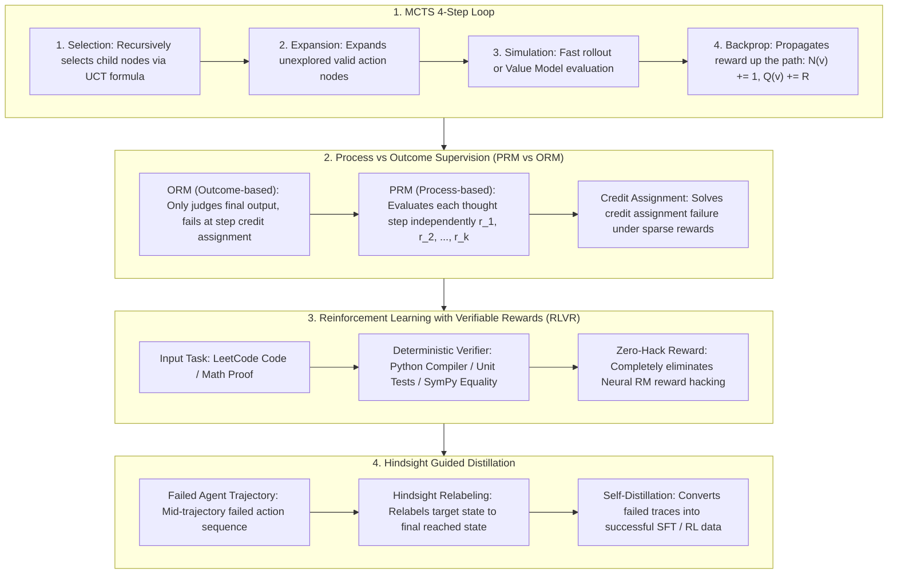

# 🌐 Agentic RL & Reasoning Search: MCTS, Process Supervision & RLVR

> **Core Executive Summary**: As LLMs evolve toward **Autonomous Agents** and **System 2 Slow-Thinking**, static single-pass generation gives way to trajectory planning, multi-step tool use, and self-reflection. **Agentic Reinforcement Learning (Agentic RL)** combines environment feedback with decision tree search, forming frontier paradigms represented by **MCTS (Monte Carlo Tree Search)**, **Process Supervision (PRM)**, and **RLVR (Verifiable Rewards)**. This guide dissects trajectory optimization, MCTS node selection, PRM step scoring, and RLVR.

---

## 💡 Interactive Mermaid Architecture Flowchart



---

## 💡 Classic Interview Followups & Core Cheatsheet

* **Key Topic 1**: Detail MCTS 4-step loop (Selection, Expansion, Simulation, Backprop) and derive the UCT formula.
  * *Standard Answer*: Selection, Expansion, Simulation, Backprop. UCT formula: $\text{UCT}(v) = \frac{Q(v)}{N(v)} + c \sqrt{\frac{\ln N(\text{parent}(v))}{N(v)}}$.

> 💡 **Intuition**: MCTS moves trial-and-error into a tree: walk the branch with the best win rate (exploitation), occasionally try under-explored branches (exploration), simulate to the end, and book the result back through every node on the path — like a Go player mentally replaying several games before moving.
>
> 🎤 **Interview answer**: Conclusion: MCTS = Selection (UCT) → Expansion → Simulation → Backpropagation. Why: UCT = mean win rate + exploration bonus; rarely-visited children get a larger bonus so every branch is eventually tried. Example: parent visited 100 times, child visited 5 → bonus $\sqrt{\ln 100/5} \approx 0.96$, times $c \approx 1.4$ ≈ 1.35 — enough to beat a slightly higher mean on a stale node.

* **Key Topic 2**: Compare PRM (Process Supervision) vs ORM (Outcome Supervision) in credit assignment for long reasoning chains.
  * *Standard Answer*: ORM only rewards final output (sparse). PRM evaluates each step independently $r_t$, providing dense, accurate credit assignment.

> 💡 **Intuition**: ORM grades only the final answer, like a teacher checking the last line; PRM grades each step, like checking every line of the derivation. A wrong middle step that accidentally yields the right answer gets full marks from ORM but is precisely flagged by PRM.
>
> 🎤 **Interview answer**: Conclusion: PRM beats ORM for long reasoning chains. Why: ORM's sparse signal cannot assign credit to specific steps; PRM emits dense per-step scores $r_t \in [-1,1]$. Example: a 10-step proof with an error at step 7 whose final answer is coincidentally correct — ORM gives 1, PRM gives −1 at step 7, pointing the gradient at the broken step.

* **Key Topic 3**: How does RLVR eliminate Neural RM Reward Hacking in code and math tasks?
  * *Standard Answer*: RLVR replaces neural reward models with deterministic execution engines (Python unit tests, SymPy symbolic matchers). Objective rule checks cannot be tricked.

> 💡 **Intuition**: A neural reward model is a learned judge the policy can trick (reward hacking). RLVR replaces it with an umpire that cannot be argued with: a compiler and unit tests.
>
> 🎤 **Interview answer**: Conclusion: RLVR uses deterministic verifiers (unit tests, SymPy) instead of neural RMs, eliminating reward hacking. Why: programmatic checks cannot be gamed by generation tricks. Example: a LeetCode-style task where reward = passing hidden test cases — a failed `assert` means zero reward and no exploit to optimize.

* **Key Topic 4**: How does Hindsight Guided Distillation convert failed Agent trajectories into successful exploration data?
  * *Standard Answer*: Relabels the target goal $G \to G' = S_{\text{final}}$ for failed trajectories, converting failed attempts into successful demonstration trajectories under the new goal.

> 💡 **Intuition**: A "failure" is often just a mis-specified goal. Aiming for the finish but stopping halfway — relabel "halfway" as the new goal and the failed trajectory becomes a perfect success. It turns a wrong-answer booklet into clean notes by redrawing the target.
>
> 🎤 **Interview answer**: Conclusion: Hindsight Relabeling redefines the goal as the reached state, converting failures into usable data. Why: reward is goal-relative, so relabeling redefines the return distribution. Example: a robot that failed to grasp a cup but touched its rim — relabel the goal as "touch the rim" and the trajectory becomes a valid positive sample for approach behavior.

* **Key Topic 5**: How does DeepSeek-R1 unify MCTS tree search with end-to-end GRPO reinforcement learning?
  * *Standard Answer*: MCTS does explicit tree search during inference. DeepSeek-R1 uses GRPO to internalize tree search behavior directly into Transformer weights.

> 💡 **Intuition**: MCTS is drawing an explicit search tree on the scratch pad during the exam. R1's GRPO training internalizes that search into the model's thinking habit — the tree disappears, but expand-verify-backtrack lives in the weights.
>
> 🎤 **Interview answer**: Conclusion: DeepSeek-R1 uses end-to-end GRPO RL so the autoregressive model implicitly learns MCTS-like verification and backtracking. Why: exploration plus process rewards during training induce multi-branch reasoning; no explicit tree is kept at inference. Example: R1 outputs "wait, this branch is wrong, let me reconsider" — tree-search branching internalized as token sequences.

---

## 📚 Section 1: Agentic RL Comparison Matrix

> 📖 **How to read this table**: Compare the "Reward Style" column — sparse (ORM) → dense (PRM) → 100% objective (RLVR). Finer and more verifiable rewards leave less room for reward hacking; MCTS (search side) and RLVR (training side) are complementary routes.

| Framework | Core Mechanism | Reward Style | Advantage | Limit / Target |
| :--- | :--- | :--- | :--- | :--- |
| **MCTS** | Selection/Expansion/Rollout/Backprop | Node Q-values | High search efficiency | Search latency |
| **ORM** | Final output check | Sparse outcome | Zero step labels needed | Credit assignment flaw |
| **PRM** | Step-by-step scoring | Dense process | Precise attribution | High annotation cost |
| **RLVR** | Compiler/unit tests | 100% objective | **Zero Reward Hacking** | Code / Math domains |
| **Hindsight Relabeling**| Relabel target $G'$ | Hindsight relabel | High sample efficiency | State-goal tasks |

---

## ⚡ Section 2: UCT Formula

In plain words: each node is scored by two accounts — the historical average win rate (exploitation) plus a "rookie protection bonus" for branches that have barely been tried (exploration). The more the parent has been visited, the larger the bonus, so no branch is left unvisited forever.

UCT formula:
$$\text{UCT}(v) = \frac{Q(v)}{N(v)} + c \sqrt{\frac{\ln N(\text{parent}(v))}{N(v)}}$$

> 💡 **Intuition**: The first term is the report card ($Q/N$); the second is the newcomer allowance. The smaller $N(v)$, the larger the allowance; the larger $N(\text{parent})$, the larger the allowance too — "after this many trials, missing a branch would be a shame."
>
> 🎤 **Interview answer**: Conclusion: UCT balances exploration and exploitation: mean + $c\sqrt{\ln N_{\text{parent}}/N_{\text{child}}}$. Why: it is the upper confidence bound of the true win rate from Hoeffding's inequality, so picking the max is optimal. Example: parent $N=100$, $c=1.414$, an untouched child $N=1$ gets bonus $1.414\times\sqrt{\ln 100}\approx6.5$ — overwhelming a veteran node with mean 0.9, so the new branch gets its first try.

---

## 🐍 Section 3: Pure Numpy Handwritten MCTS Node Selector

```python
import numpy as np

class PureNumpyMCTSNode:
    def __init__(self, name: str, parent=None, c_explore: float = 1.414):
        self.name = name
        self.parent = parent
        self.c_explore = c_explore
        self.children = []
        self.N = 0
        self.Q = 0.0
        
    def select_best_child(self):
        best_score = -float("inf")
        best_child = None
        for child in self.children:
            if child.N == 0:
                score = float("inf")
            else:
                mean_q = child.Q / child.N
                explore = self.c_explore * np.sqrt(np.log(self.N) / child.N)
                score = mean_q + explore
            if score > best_score:
                best_score = score
                best_child = child
        return best_child

if __name__ == "__main__":
    root = PureNumpyMCTSNode("Root")
    c1 = PureNumpyMCTSNode("C1", root); c1.N, c1.Q = 1, 1.0
    c2 = PureNumpyMCTSNode("C2", root); c2.N, c2.Q = 1, 0.2
    root.children = [c1, c2]; root.N = 2
    print("✅ MCTS Selection Test Complete. Best Child:", root.select_best_child().name)
```

> 💡 **Intuition**: `select_best_child` is the UCT formula in code: unvisited children get +∞ priority (try them first), visited ones are scored by mean + exploration; `backpropagate` books the reward up the parent chain to the root.
>
> 🎤 **Interview answer**: Conclusion: this snippet = UCT selection + backprop, the minimal core of MCTS. Why: `score = inf` guarantees every child is visited at least once before mean-vs-exploration tradeoffs kick in. Example: root $N=2$, child 1 win rate 1.0 vs child 2 win rate 0.2 with equal bonuses — child 1 wins, matching the "best grade, no injustice" intuition.

---

## 🚀 Key Takeaways & Best Practices

1. **Code & Math RL**: Use **RLVR** (Verifiable Rewards via compilers/unit tests) to eradicate Neural RM reward hacking.
2. **Reasoning Models**: Leverage **MCTS** and **PRM** for System 2 slow-thinking reasoning search.
3. **Sample Efficiency**: Relabel failed trajectories using **Hindsight Relabeling**.