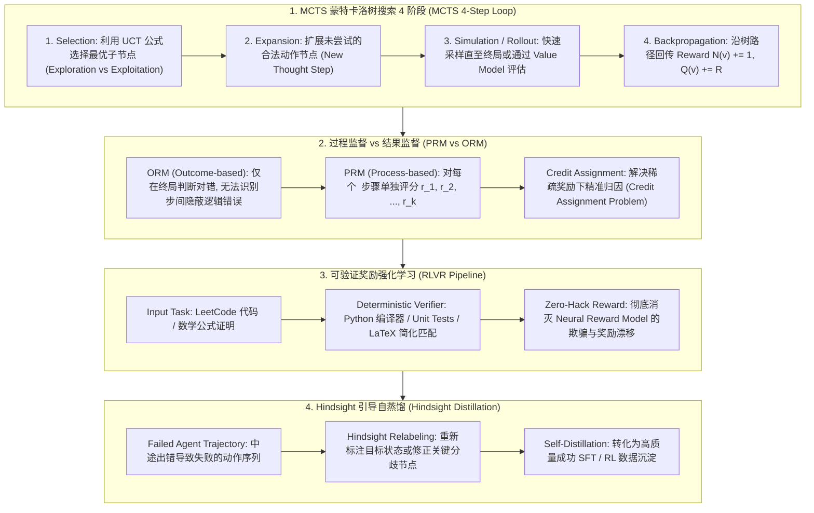

# 🌐 智能体 RL 与推理搜索全景：MCTS 蒙特卡洛树搜索、PRM 过程监督与 RLVR 可验证奖励

> **核心摘要**：随着大语言模型迈向 **Agentic 自主智能体** 与 **System 2 慢思考** 阶段，传统单步静态输出已被长链轨迹规划 (Trajectory Planning)、多步工具调用与试错反思所取代。**智能体强化学习 (Agentic RL)** 将环境反馈与决策树搜索结合，形成了以 **MCTS 蒙特卡洛树搜索**、**PRM 过程监督**、**RLVR 可验证奖励** 为代表的前沿技术族。本指南系统解构 Agentic RL 轨迹优化、MCTS 节点选择公式、PRM 细粒度步骤打分以及消除 Neural RM 漏洞的 RLVR 训练范式。

---

## 💡 交互式 Mermaid 架构流程图



---

## 💡 经典面试追问与考点速查

* **考点 1**：详细剖析 MCTS (蒙特卡洛树搜索) 4 步循环 (Selection, Expansion, Simulation, Backprop)，并推导 UCT 节点的计算公式？
  * *标准回答*：
    1. **Selection (选择)**：从根节点出发，根据 **UCT (Upper Confidence Bounds for Trees)** 公式递归选择选择期望最高的子节点：
       $$\text{UCT}(v) = \frac{Q(v)}{N(v)} + c \sqrt{\frac{\ln N(\text{parent}(v))}{N(v)}}$$
       其中 $Q(v)/N(v)$ 为节点 $v$ 的平均胜率，后半项为探索增益；
    2. **Expansion (扩展)**：到达叶子节点后，若该节点未终止，根据策略生成一个或多个新动作子节点；
    3. **Simulation (模拟 / Rollout)**：从新节点出发，利用默认策略模拟至终局并获得标量收益 $R$（或直接调用 Value Network 预测评估值）；
    4. **Backpropagation (反向传播)**：将收益 $R$ 沿着 Selection 路径向上回传，更新沿途所有节点的访问次数 $N(v) \leftarrow N(v) + 1$ 和累积价值 $Q(v) \leftarrow Q(v) + R$。

> 💡 **直观理解**：MCTS 把"试错"搬进树里：先顺着胜率最高的枝走（利用），走腻了就换条新枝试试（探索），rollout 出结果再把这笔账记回沿途所有节点。就像围棋棋手在脑海里多盘推演，而不是盲目下子。
>
> 🎤 **面试速答**：结论：MCTS 四步循环 = 选择（UCT）→ 扩展 → 模拟 → 回传。原理：UCT = 平均胜率 + 探索项，被访问少的节点探索项大，保证每个分支都被公平尝试。例子：根节点访问 100 次、某子节点只访问 5 次时，探索项 $\sqrt{\ln 100 / 5} \approx 0.96$，乘 $c \approx 1.4$ 后约 1.35 分——即使该分支平均胜率低 1 分也可能被选中继续探索。

* **考点 2**：对比 PRM (过程监督奖励模型) 与 ORM (结果监督奖励模型) 在长链逻辑推理中的信用分配 (Credit Assignment) 优势？
  * *标准回答*：
    * **ORM (Outcome-based Reward Model)**：仅对最终结果评判 1 或 0。若推导过程中间出现“步骤错误但偶发凑出正确答案”或“步骤 99% 正确仅最后计算粗心失误”，ORM 会给予错误的信号，引发严重的信用分配失效；
    * **PRM (Process-based Reward Model)**：对每一个推导步骤独立给出好坏评分 $r_t \in [-1, 1]$，提供了极高粒度的密集梯度信号 (Dense Rewards)，能精确指出逻辑链崩塌的具体节点。

> 💡 **直观理解**：ORM 只看最终对错，像老师只批改最后答案；PRM 每步给分，像老师批改每一步演算过程。中间一步算错但答案碰巧对，ORM 会给满分，PRM 能精准揪出错的这一步。
>
> 🎤 **面试速答**：结论：长链逻辑推理用 PRM 优于 ORM。原理：ORM 稀疏信号无法把信用归因到具体步骤；PRM 对每步给 $r_t \in [-1,1]$ 密集信号，定位逻辑崩塌节点。例子：一道 10 步数学题第 7 步算错、最终答案碰巧正确——ORM 打 1 分，PRM 在第 7 步给 −1，梯度准确指向错误位置。

* **考点 3**：RLVR (Reinforcement Learning with Verifiable Rewards) 如何在代码执行判题与数学等价性检查中消除 Neural RM 的奖励漂移 (Reward Hacking)？
  * *标准回答*：在传统 RLHF 中，使用神经网络训练的 Reward Model 极易被策略模型破解（即 Reward Hacking）。**RLVR 机制**彻底放弃神经网络 RM，改用**确定性工具判题 (Verifiable Rules)**（如 Python 单元测试、SymPy 匹配）。由于判题结果绝对客观无误，彻底消除了 Reward Hacking。

> 💡 **直观理解**：神经奖励模型是"学出来的裁判"，可以被策略钻空子（reward hacking）；RLVR 换成"编译器 + 单元测试"这种铁面裁判，对就是对、错就是错，没有讨价还价的空间。
>
> 🎤 **面试速答**：结论：RLVR 用确定性判题器（单元测试/SymPy）取代神经网络 RM，彻底消除 reward hacking。原理：判题结果由程序决定，策略无法"欺骗"奖励信号。例子：LeetCode 题，策略生成代码后直接跑隐藏测试用例，通过率就是奖励——`assert` 不通过就没有任何梯度可钻。

* **考点 4**：Hindsight Guided Distillation (后见之明引导蒸馏) 如何将 Agent 失败尝试转化为成功的探索轨迹数据？
  * *标准回答*：如果 Agent 本来想达到目标 $G$，结果最终落在了状态 $S_{final}$。在后见之明视角下，我们可以将这组失败的轨迹重新将目标重标记为 $G' = S_{final}$。这样原本失败的轨迹在新的目标视角下变成了一条完美的成功探索轨迹，极大提升了样本利用效率。

> 💡 **直观理解**：失败往往是"目标定错了"的另一种说法。本来想走到终点，结果停在半路——那把"半路"重新定义成新目标，这条轨迹立刻变成一条完美成功轨迹。像没考满分，但把错题集重新归类后，它就变成了正确笔记。
>
> 🎤 **面试速答**：结论：Hindsight Relabeling 把失败轨迹重标为目标 = 最终到达状态，变废为宝。原理：轨迹好坏是"相对目标"而言的，换目标后回报分布被重新定义。例子：机器人没抓起杯子但碰到了杯沿——重标目标为"触碰杯沿"，这条轨迹立刻成为学习"接近杯子"的有效正样本。

* **考点 5**：DeepSeek-R1 如何将 MCTS 推理期树搜索与 GRPO 端到端强化学习做泛化融合？
  * *Standard Answer*：MCTS 树搜索是在推理阶段 (Test-Time Compute) 通过显式构建树结构进行搜索；DeepSeek-R1 证明了通过 **GRPO 强化学习**，可以在不需要在推理期维持复杂 MCTS 树算子的情况下，让自回归模型内部隐式学习到 MCTS 的自我校验与分支反思机制。

> 💡 **直观理解**：MCTS 是"考试时在草稿纸上显式画搜索树"；R1 用 GRPO 训练把这种搜索内化成模型内部的思考习惯——草稿纸上的树消失了，但"展开 → 反思 → 回溯"的过程进了权重。
>
> 🎤 **面试速答**：结论：DeepSeek-R1 用 GRPO 端到端 RL 让自回归模型隐式学会 MCTS 式的校验与回溯。原理：训练期的探索 + 过程奖励引导模型生成多分支推理，推理期无需维护显式树。例子：R1 推理时会输出"等等，这个分支有问题，重新考虑"——树搜索的分支回溯被内化成了 token 序列。

---

## 📚 第一章：Agentic RL 与推理搜索技术矩阵

> 📖 **怎么读这张表**：重点对比中间"奖励类型"列——稀疏（ORM）→ 密集（PRM）→ 100% 客观（RLVR），粒度越细、越可验证，reward hacking 空间越小；同时注意 MCTS（搜索侧）与 RLVR（训练侧）是两条互补路线。

| 算法 / 范式 | 核心机制 | 奖励类型 | 优点 | 局限性 / 适用场景 |
| :--- | :--- | :--- | :--- | :--- |
| **MCTS (树搜索)** | Selection/Expansion/Rollout/Backprop | 节点累积 Q 值 | 搜索空间利用高 | 节点分支爆炸，推理延迟高 |
| **ORM (结果监督)** | 仅判定最终输出对错 | 稀疏结果奖励 | 无需步骤标注 | 存在信用分配失灵 |
| **PRM (过程监督)** | 步骤级别逻辑评分 | 密集过程奖励 | 细粒度归因 | 需要大量的步骤级标注 |
| **RLVR (可验证奖励)**| 编译器/单元测试/规则校验 | 100% 客观无偏 | **彻底杜绝 Reward Hack**| 仅限代码/数学等可判题领域 |
| **Hindsight Relabeling**| 重新标定目标状态 G' | 后见之明重标记 | 样本利用效率极大提升 | 仅适用于最终状态可泛化任务 |

---

## ⚡ 第二章：MCTS UCT 公式与 PRM 过程奖励求解

### 2.1 UCT 节点选择公式

大白话：一个节点值两笔账——"历史平均胜率"（利用，你赢过的经验）+ "还没被充分探索的加分"（探索，给冷门分支机会）。父节点总访问次数越多，冷落分支的加分越大，保证每个分支早晚都被试一次。

$$\text{UCT}(v) = \frac{Q(v)}{N(v)} + c \sqrt{\frac{\ln N(\text{parent}(v))}{N(v)}}$$

> 💡 **直观理解**：第一项 $Q/N$ 是"成绩单"，第二项是"新人保护分"。孩子节点访问次数 $N(v)$ 越少，保护分越大；父节点总访问越多，保护分也越大——"试过这么多次了，漏掉某个分支太可惜"。
>
> 🎤 **面试速答**：结论：UCT 平衡探索与利用：均值 + $c\sqrt{\ln N_{\text{父}}/N_{\text{子}}}$。原理：它来自霍夫丁不等式给出的真实胜率上置信界，选上界最大的节点最划算。例子：父节点 $N=100$、$c=1.414$，某个 $N=1$ 的新子节点探索项 $= 1.414 \times \sqrt{\ln 100 / 1} \approx 6.5$，远超另一个胜率 0.9 的熟手节点——新分支被优先试一次。

---

## 🐍 第三章：Pure Numpy 手写 MCTS 节点选择与 PRM 评估算子

```python
import numpy as np

class PureNumpyMCTSNode:
    """ Pure Numpy 实现 MCTS 树节点 UCT 计算与选择算子 """
    def __init__(self, name: str, parent=None, c_explore: float = 1.414):
        self.name = name
        self.parent = parent
        self.c_explore = c_explore
        self.children = []
        self.N = 0  # 访问次数
        self.Q = 0.0 # 累积价值
        
    def select_best_child(self):
        best_score = -float("inf")
        best_child = None
        for child in self.children:
            if child.N == 0:
                score = float("inf")
            else:
                mean_q = child.Q / child.N
                explore_term = self.c_explore * np.sqrt(np.log(self.N) / child.N)
                score = mean_q + explore_term
            if score > best_score:
                best_score = score
                best_child = child
        return best_child
        
    def backpropagate(self, reward: float):
        self.N += 1
        self.Q += reward
        if self.parent:
            self.parent.backpropagate(reward)

# ==================== 测试验证 ====================
if __name__ == "__main__":
    root = PureNumpyMCTSNode("Root")
    c1 = PureNumpyMCTSNode("Child_1", parent=root)
    c2 = PureNumpyMCTSNode("Child_2", parent=root)
    root.children = [c1, c2]
    
    root.N = 2
    c1.N, c1.Q = 1, 1.0
    c2.N, c2.Q = 1, 0.2
    
    selected = root.select_best_child()
    print("✅ MCTS 节点 UCT 选择测试完成！选定子节点:", selected.name)
```

> 💡 **直观理解**：`select_best_child` 就是 UCT 公式的代码化：未访问节点直接给 +∞ 优先级（强制先试一次），已访问节点按"均值 + 探索项"打分；`backpropagate` 沿父链把奖励一路记到根节点。
>
> 🎤 **面试速答**：结论：这段代码 = UCT 选择 + 回传，是 MCTS 的最小核心。原理：`score = inf` 保证每个孩子至少被访问一次，之后才进入均值与探索的权衡。例子：根节点 $N=2$，c1 胜率 1.0 vs c2 胜率 0.2，探索项相同，选中 c1——符合"成绩最好且未被亏待"的直觉。

---

## 🚀 总结与工程最佳实践

1. **代码与数学模型训练首选**：全面引入 **RLVR (可验证奖励)** 替代传统 Neural RM，从根本上杜绝 Reward Hacking；
2. **慢思考推理实现**：通过 **MCTS 树搜索 (Test-Time Compute)** 结合 **PRM 过程监督**，在推理阶段赋予模型探索深度解题空间的能力；
3. **样本效率提升**：智能体训练务必使用 **Hindsight Relabeling** 将探索失败轨迹重新标定为有效练习数据。