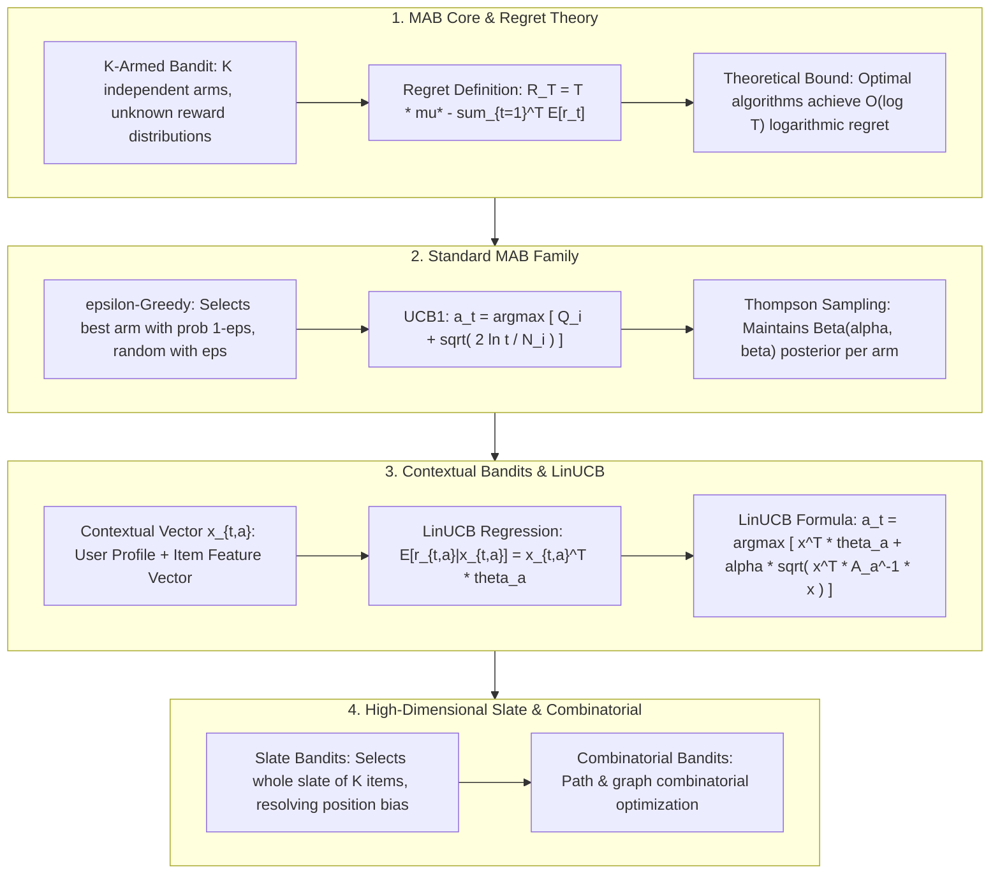

# 🌐 Multi-Armed Bandits & Online Decision: MAB, LinUCB & Contextual Bandits

> **Core Executive Summary**: In recommender systems, ad targeting, and search re-ranking, platforms face the classic **Exploration vs Exploitation** dilemma—exploit known high-performing items or explore new cold-start items? **Multi-Armed Bandits (MAB)** and **Contextual Bandits** provide mathematically optimal solutions. This guide dissects Regret lower bounds, **UCB1** Hoeffding inequality derivations, **Thompson Sampling** Bayesian posteriors, **LinUCB** feature regression, and industrial recommender patterns.

---

## 💡 Interactive Mermaid Architecture Flowchart



---

## 💡 Classic Interview Followups & Core Cheatsheet

* **Key Topic 1**: Derive the upper confidence bound term $\sqrt{\frac{2 \ln t}{N_i(t)}}$ in UCB1 using Hoeffding Inequality.
  * *Standard Answer*: $\mathbb{P}(\mu \ge \bar{X}_n + U) \le e^{-2 n U^2}$. Setting $p = e^{-2 n U^2} = t^{-4}$, we solve $U = \sqrt{\frac{2 \ln t}{n}}$.

> 💡 **Intuition**: Each arm is scored by its observed average plus an uncertainty margin that shrinks with visits. A heavily tried arm has a bound hugging its mean; a rarely tried arm gets an inflated upper bound — and selecting that bound-max arm is exploration in disguise.
>
> 🎤 **Interview answer**: Conclusion: UCB1 picks the arm maximizing mean + upper confidence bound. Why: Hoeffding's inequality guarantees the true mean lies under the bound with high probability, so maximizing the bound is the optimal exploration-exploitation tradeoff. Example: at $t=1000$, an arm tried 10 times has bonus $\sqrt{2\ln 1000/10} \approx 1.17$ — enough to outrank a slightly better-known arm and get another trial.

* **Key Topic 2**: Compare Contextual Bandits (e.g. LinUCB) vs Full MDP Reinforcement Learning in trade-offs and applicability.
  * *Standard Answer*: Contextual Bandits perform single-step decision (actions do not alter future state distributions). Full MDP RL performs multi-step decision.

> 💡 **Intuition**: Bandits make single-step decisions: whether you click an ad affects today's reward only, not tomorrow's user distribution. MDPs are sequential: your action changes the future state, so you must reason about long-term discounted returns.
>
> 🎤 **Interview answer**: Conclusion: contextual bandits have no state transitions (single-step); MDP RL has transitions (multi-step). Why: bandit actions never affect the next context, so values decompose per-step; MDPs need Bellman iteration and a discount $\gamma$. Example: recommending a news article doesn't change the next user's arrival — use LinUCB; a chess move changes the board — use MDP + search.

* **Key Topic 3**: How does LinUCB estimate context rewards using Ridge Regression?
  * *Standard Answer*: Assumes linear reward $E[r_{t,a}|x_{t,a}] = x_{t,a}^T \theta_a^*$. Estimates $\hat{\theta}_a = A_a^{-1} b_a$ and adds variance term.

> 💡 **Intuition**: Approximate the reward as linear in user-item features and refine the coefficients with ridge regression; uncertainty is measured by $x^\top A^{-1}x$ — directions rarely visited have larger variance and deserve exploration. Like estimating house prices: more samples sharpen the regression line; unseen layouts carry high variance, so look closer.
>
> 🎤 **Interview answer**: Conclusion: LinUCB fits a per-arm ridge-regression reward model and adds an uncertainty bonus. Why: $\hat\theta = A^{-1}b$ is the L2-regularized least-squares solution, and $\sqrt{x^\top A^{-1}x}$ is the prediction standard deviation along that feature direction. Example: with $d=4$ features and 10 observations, each update is a single $4\times4$ matrix inversion — millisecond-level online decisions.

* **Key Topic 4**: What Bayesian advantages does Thompson Sampling provide over UCB1 for cold-start items?
  * *Standard Answer*: Samples from posterior Beta distributions, preserving exploration probability for newly introduced items.

> 💡 **Intuition**: UCB1 is a roll call: it always picks the highest bound, deterministically, and cold-start arms can be starved. Thompson is a lottery: each arm draws a random sample from its Beta posterior; a new arm's wide posterior often draws high values, so exploration happens automatically.
>
> 🎤 **Interview answer**: Conclusion: for cold-start items, Thompson Sampling beats UCB1. Why: posterior sampling turns uncertainty directly into exploration probability, while UCB1 is deterministic and sensitive to the $\alpha$ hyperparameter. Example: a new arm with $\text{Beta}(1,1)$ prior may draw 0.9 on its first sample and get retried; under UCB1 its mean of 0 keeps it last forever.

* **Key Topic 5**: How do Slate Bandits handle position bias and list-wise interactions in recommender systems?
  * *Standard Answer*: Treats the entire slate as a joint action, combining click models to decouple position bias.

> 💡 **Intuition**: Single-arm decision asks "what to recommend"; a slate must decide "which 10 fill this screen" — and position itself changes click rates (position bias), so the whole list must be optimized as one joint action.
>
> 🎤 **Interview answer**: Conclusion: Slate Bandits treat a K-item list as a joint action and explicitly model position bias. Why: cascade/click models decompose slate reward into per-position contributions, optimized jointly. Example: on a homepage Top-10 feed, slot 1 naturally outperforms slot 5; slate decisions place high-potential items first while preserving list diversity.

---

## 📚 Section 1: Bandits Algorithms Comparison Matrix

> 📖 **How to read this table**: Sweep the "Exploration Mechanism" column — random (ε-Greedy) → Hoeffding bound (UCB1) → Bayesian sampling (TS) → regression variance (LinUCB): increasing sophistication and information use. Then check "Operational Cost": LinUCB's matrix inversions mark the standard bar for personalized production recommender systems.

| Algorithm | Class | Feature Input | Exploration Mechanism | Operational Cost | Target Scenario |
| :--- | :--- | :--- | :--- | :--- | :--- |
| **$\epsilon$-Greedy**| MAB | None | Random selection | Minimal | Baseline A/B replacement |
| **UCB1** | MAB | None | Hoeffding upper bound | Low | Static item exploration |
| **Thompson Sampling**| Bayesian MAB | None | Beta posterior sampling | Low | Ad / RecSys cold start |
| **LinUCB** | Contextual Bandits| Feature vector $x$ | Ridge regression variance | Medium | News feed & search re-ranking |
| **Slate Bandits** | Combinatorial | Feature + Slate structure| Joint slate sampling | High | Top-N list recommendations |

---

## ⚡ Section 2: LinUCB Formula

In plain words: each arm keeps its own ridge-regression parameters $\hat{\theta}_a$ and covariance $A_a$. Selection = predicted reward + uncertainty ($\alpha$ × std); update accumulates the new $(x, r)$ into $A$ and $b$ in one step.

LinUCB action selection formula:
$$a_t = \arg\max_{a \in \mathcal{A}_t} \left( x_{t,a}^T \hat{\theta}_a + \alpha \sqrt{x_{t,a}^T A_a^{-1} x_{t,a}} \right)$$

> 💡 **Intuition**: $A$ is the "knowledge ledger": the outer products $x x^\top$ keep accumulating, so the more data an arm has seen, the more confident the prediction and the smaller the uncertainty term.
>
> 🎤 **Interview answer**: Conclusion: LinUCB extends UCB from context-free to feature-based decisions. Why: $\hat\theta = A^{-1}b$ is the ridge-regression solution and $\sqrt{x^\top A^{-1}x}$ is the predictive variance in that feature direction, with $\alpha$ controlling exploration intensity. Example: with $d=4$ features and $\alpha=0.5$, a brand-new item has $A=I$, so its bonus equals $\|x\|$ — fresh items automatically get the maximum exploration score.

---

## 🐍 Section 3: Pure Numpy Handwritten LinUCB Operator

```python
import numpy as np

class PureNumpyLinUCB:
    def __init__(self, num_arms: int, d_feature: int, alpha: float = 1.0):
        self.num_arms = num_arms
        self.d_feature = d_feature
        self.alpha = alpha
        self.A = [np.identity(d_feature) for _ in range(num_arms)]
        self.b = [np.zeros((d_feature, 1)) for _ in range(num_arms)]
        
    def select_arm(self, context: np.ndarray) -> int:
        p_values = []
        for a in range(self.num_arms):
            A_inv = np.linalg.inv(self.A[a])
            theta = A_inv @ self.b[a]
            mean = (theta.T @ context)[0, 0]
            var = np.sqrt((context.T @ A_inv @ context)[0, 0])
            p_values.append(mean + self.alpha * var)
        return int(np.argmax(p_values))

if __name__ == "__main__":
    linucb = PureNumpyLinUCB(3, 4, 0.5)
    x = np.array([[0.5], [1.2], [-0.3], [0.8]])
    print("✅ LinUCB Selected Arm:", linucb.select_arm(x))
```

> 💡 **Intuition**: `select_arm` is the formula line by line: invert $A$ per arm, compute mean and variance, sum and score; `update` folds this observation's outer product into $A$ and $r \cdot x$ into $b$ — one click, one new ledger page.
>
> 🎤 **Interview answer**: Conclusion: the snippet fully implements Disjoint LinUCB's arm selection and update. Why: each arm owns its $A/b$ — "a regression per arm" with no cross-arm interference. Example: with 3 arms, 4 features and $\alpha=0.5$, on the first selection all variance terms equal $\|x\|$ so the decision rides on priors; after one update the arms immediately differentiate.

---

## 🚀 Key Takeaways & Best Practices

1. **Cold Start**: Use **Thompson Sampling** or **LinUCB** for rapid probability exploration of new items.
2. **Matrix Performance**: Use the **Sherman-Morrison formula** for rank-1 inverse updates.
3. **Online A/B Testing**: MAB dynamic allocation cuts opportunity cost by 80% over fixed 50:50 splits.