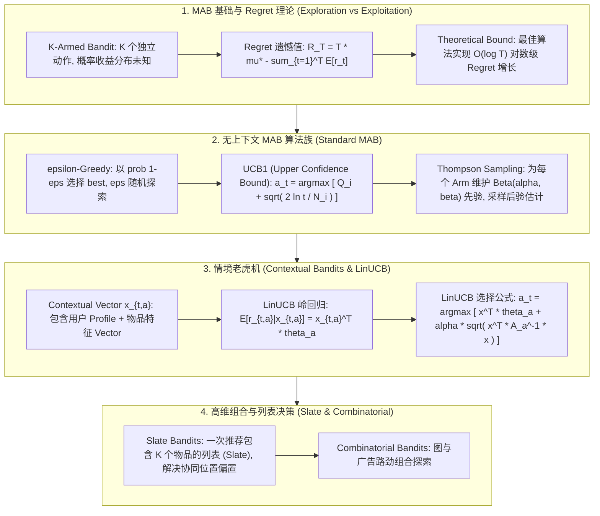

# 🌐 多臂老虎机与在线决策：MAB 探索与利用、LinUCB、Thompson Sampling 与 Contextual Bandits 落地

> **核心摘要**：在推荐系统、在线广告投递与搜索重排中，系统面临着经典的**探索与利用 (Exploration vs Exploitation)** 矛盾——是继续推荐过去表现优异的旧物品（Exploitation），还是推荐潜在高收益的新冷启动物品（Exploration）？**多臂老虎机 (Multi-Armed Bandits, MAB)** 与 **情境老虎机 (Contextual Bandits)** 提供了极其优美的数理解决方案。本指南深度解构 Regret 遗憾值最小化理论、**UCB1** 霍夫丁不等式推导、**Thompson Sampling** 贝叶斯后验采样、**LinUCB** 特征线形关联模型以及在工业级推荐系统中的落地范式。

---

## 💡 交互式 Mermaid 架构流程图



---

## 💡 经典面试追问与考点速查

* **考点 1**：推导 UCB1 算法中置信上限项 $\sqrt{\frac{2 \ln t}{N_i(t)}}$ 的数学来源（霍夫丁不等式）？
  * *标准回答*：
    * **霍夫丁不等式 (Hoeffding Inequality)**：设 $X_1, \dots, X_n$ 为在 $[0,1]$ 上的独立同分布随机变量，样本均值为 $\bar{X}_n$，期望为 $\mu$。则：
      $$\mathbb{P}(\mu \ge \bar{X}_n + U) \le e^{-2 n U^2}$$
    * 令右侧显著性水平 $p = e^{-2 n U^2} = t^{-4}$（随着时间步 $t$ 变长，上界概率极小），解出置信上限宽度 $U$：
      $$-2 n U^2 = \ln(t^{-4}) = -4 \ln t \implies U = \sqrt{\frac{2 \ln t}{n}}$$
    * **物理含义**：以极高概率 $1 - t^{-4}$ 保证真实收益 $\mu_i \le \hat{\mu}_i + \sqrt{\frac{2 \ln t}{N_i(t)}}$。因此选取具有最大上置信界限的 Arm 既兼顾了高收益（高 $\hat{\mu}_i$），又探索了尝试次数少、不确定性大（低 $N_i$）的潜在好 Arm！

> 💡 **直观理解**：每个臂的"上置信界" = 观察到的平均收益 + 一个随尝试次数缩小的不确定度。被试得越多（$N_i$ 大），上界越贴近均值；试得越少，上界越虚高——选虚高的臂，其实就是把探索做进了选择里。
>
> 🎤 **面试速答**：结论：UCB1 选"均值 + 置信上界"最大的臂。原理：霍夫丁不等式保证真实均值以高概率落在上界之内，取上界最大化 = 最划算的探索。例子：$t=1000$ 时某臂只试过 10 次，探索项 $\sqrt{2\ln 1000 / 10} \approx 1.17$；即使它的均值比最优臂低 0.5，仍会被选中——这就是"给新臂机会"的数学化。

* **考点 2**：对比 Contextual Bandits (如 LinUCB) 与全状态 MDP 强化学习的异同与适用场景？
  * *标准回答*：
    * **相同点**：都需要在未知环境中进行 Exploration vs Exploitation 权衡，且动作选择依赖当前上下文 (State / Context)；
    * **不同点**：
      1. **状态转移 (State Transition)**：Contextual Bandits 假设当前动作 **不影响** 下一个时刻的上下文分布（单步决策，即无状态转移）；而全状态 MDP RL 的当前动作会改变未来状态（多步长远决策）；
      2. **计算复杂度**：Contextual Bandits 计算极快（秒级更新线形岭回归），而全状态 MDP 需要估算长远折扣回报 $\gamma$ 与价值函数；
    * **适用场景**：推荐系统点击率 (CTR) 预测、新闻冷启动、广告竞价采用 Contextual Bandits 即可获得极高 ROI。

> 💡 **直观理解**：Bandits 是"只做一步决策"：点不点这条广告只影响本次收益，不影响明天的用户分布；MDP 是"步步相扣"：这次动作改变未来状态，所以必须算长远的折扣回报。
>
> 🎤 **面试速答**：结论：Contextual Bandits 无状态转移、单步决策；MDP RL 有状态转移、多步决策。原理：bandit 的动作不影响下一时刻的上下文，价值退化为每步独立；MDP 需要 Bellman 迭代与折扣因子 $\gamma$。例子：新闻推荐点不点某篇文章不影响下一个用户到来，用 LinUCB 足够；下棋一步改变棋盘局面，必须用 MDP + 搜索。

* **考点 3**：LinUCB 算法如何利用岭回归 (Ridge Regression) 估计用户与物品特征的上下文收益？
  * *标准回答*：假设动作 $a$ 在上下文 $x_{t,a} \in \mathbb{R}^d$ 下的期望收益呈线性关系 $E[r_{t,a}|x_{t,a}] = x_{t,a}^T \theta_a^*$。对于每个 Arm $a$，维持协方差矩阵 $A_a = b_a b_a^T + I_d$ 和观测向量 $b_a$；估计参数 $\hat{\theta}_a = A_a^{-1} b_a$；动作选择公式为 $a_t = \arg\max_a \left( x_{t,a}^T \hat{\theta}_a + \alpha \sqrt{x_{t,a}^T A_a^{-1} x_{t,a}} \right)$。

> 💡 **直观理解**：把"用户-物品特征 $x$ → 收益"近似成线性关系，用岭回归逐步修正系数 $\theta$；不确定性用 $x^\top A^{-1} x$ 度量——走过的特征方向越少，这个值越大，越值得探索。像猜房价：样本越多回归线越准；没见过的户型预测方差大，多看几眼。
>
> 🎤 **面试速答**：结论：LinUCB 用岭回归估计每个臂的线性收益模型，并加不确定性上界。原理：$\hat\theta = A^{-1}b$ 是带 L2 正则的最小二乘解，$\sqrt{x^\top A^{-1}x}$ 是该方向的预测标准差。例子：$d=4$ 维特征、试了 10 次后，更新 $\hat\theta$ 只需一次 $4\times4$ 矩阵求逆，毫秒级完成线上决策。

* **考点 4**：Thompson Sampling 在处理冷启动 (Cold Start) 物品时相比 UCB1 具备哪些贝叶斯优势？
  * *标准回答*：UCB1 是确定性算法，对置信边界超参数 $\alpha$ 敏感；Thompson Sampling 是贝叶斯概率采样算法，为每个 Arm 维护 Beta 分布后验，采样值随机性强，避免新物品因一两次早期试错被永久冷落。

> 💡 **直观理解**：UCB1 是"点名册"：每次都选上界最高者，确定性强，新臂容易一直被冷落；Thompson 是"抽签"：每个臂按自己的 Beta 后验抽一个随机数，新臂后验宽、抽中高值的概率不小，探索天生自动发生。
>
> 🎤 **面试速答**：结论：冷启动场景 Thompson Sampling 优于 UCB1。原理：按后验随机采样把不确定性直接转化为探索概率；UCB1 确定性选上界最大，且对 $\alpha$ 敏感。例子：新臂先验 $\text{Beta}(1,1)$ 是均匀分布，即使只试过 1 次，抽样值也可能接近 0.9，获得被反复验证的机会；而 UCB1 下它均值 0 会一直垫底。

* **考点 5**：在推荐系统中，Slate Bandits (列表决策) 如何解决多位置协同与上下文位置偏置 (Position Bias)？
  * *标准回答*：Slate Bandits 将整个列表 $S = (a_1, \dots, a_K)$ 作为统一动作进行决策，结合 Cascade Model 或 Click Model 将整体推荐得分分解为基于解耦位置偏置的组合联合收益。

> 💡 **直观理解**：单臂决策只问"推什么"，Slate 要同时决定"一屏放哪 10 个"——位置本身影响点击（位置偏置），所以把整张列表当一个联合动作来优化。
>
> 🎤 **面试速答**：结论：Slate Bandits 把 K 个物品的列表当作联合动作，显式建模位置偏置。原理：用 Cascade/Click Model 把列表收益分解为逐位置收益的叠加，联合采样优化。例子：首页 Top-10 推荐中第 1 位点击率天然高于第 5 位，Slate 决策会把高潜力物品排前、同时保持组合多样性。

---

## 📚 第一章：MAB 与 Contextual Bandits 算法矩阵

> 📖 **怎么读这张表**：横着看"探索机制"一列——随机（ε-Greedy）→ 霍夫丁上界（UCB1）→ 贝叶斯采样（TS）→ 岭回归方差（LinUCB），信息利用越来越精细；再看"部署开销"列：带矩阵求逆的 LinUCB 是线上个性化推荐的主流门槛。

| 算法名称 | 算法类别 | 特征输入 (Context) | 探索机制 | 部署开销 | 核心适用场景 |
| :--- | :--- | :--- | :--- | :--- | :--- |
| **$\epsilon$-Greedy**| 无上下文 MAB | 无 | 随机选择 | 极低 | 基础 A/B 测试替代 |
| **UCB1** | 无上下文 MAB | 无 | 霍夫丁上置信界 | 低 | 静态物品探底 |
| **Thompson Sampling**| 贝叶斯 MAB | 无 | Beta 后验随机采样 | 低 | 广告/推荐冷启动 |
| **LinUCB** | Contextual Bandits| User+Item Feature $x$| 岭回归方差二次型 | 中 (矩阵求逆) | 动态新闻推荐/个性化重排 |
| **Slate Bandits** | 组合 Bandits | 特征向量 + 列表结构 | 联合列表概率采样 | 高 | 首页整屏/ Top-N 列表推荐 |

---

## ⚡ 第二章：LinUCB 与 UCB1 算法数学公式

### 2.1 UCB1 选择公式

大白话：对每个臂打一个"总分" = 已知均值 + 尚未验证的空间，选总分最高的。均值越高越值得利用，不确定性越大越值得探索，两者相加就是 UCB。

$$a_t = \arg\max_{i \in \{1, \dots, K\}} \left( \hat{\mu}_i + \sqrt{\frac{2 \ln t}{N_i(t)}} \right)$$

> 💡 **直观理解**：$\ln t$ 增长极慢而 $N_i$ 线性增长，所以"补考机会"随尝试次数迅速耗尽——每个臂被充分验证后，选择自然收敛到纯利用。
>
> 🎤 **面试速答**：结论：UCB1 选均值 + $\sqrt{2\ln t/N_i}$ 最大的臂，遗憾值 $O(\log T)$。原理：置信界来自霍夫丁不等式，失败越多、上界越低。例子：$t=10^6$ 时 $\ln t \approx 13.8$，试过 100 次的臂探索项 $\approx 0.53$，试过 10 次的臂 $\approx 1.66$——后者即使均值低 1 分也会被优先补试。

### 2.2 LinUCB 选择与参数更新公式

大白话：每个臂维护自己的岭回归参数 $\hat{\theta}_a$ 和协方差 $A_a$。选择时 = 预测收益 + 不确定度（$\alpha$ 倍标准差）；更新时把新观测 $(x, r)$ 累进 $A$ 与 $b$，一步到位。

$$\hat{\theta}_a = A_a^{-1} b_a$$
$$a_t = \arg\max_{a \in \mathcal{A}_t} \left( x_{t,a}^T \hat{\theta}_a + \alpha \sqrt{x_{t,a}^T A_a^{-1} x_{t,a}} \right)$$

> 💡 **直观理解**：$A$ 矩阵像"知识账本"：走过的特征外积 $x x^\top$ 不断累加，见过的数据越多、账本越厚，预测越自信，不确定项越小。
>
> 🎤 **面试速答**：结论：LinUCB 把 UCB 从无上下文推广到带特征 $x$ 的场景。原理：$\hat\theta = A^{-1}b$ 是岭回归解，$\sqrt{x^\top A^{-1}x}$ 是该特征方向的预测方差，$\alpha$ 控制探索强度。例子：$d=4$、$\alpha=0.5$，某物品首次出现时 $A=I$，方差项 $=\|x\|$——全新物品天然获得最大探索分。

---

## 🐍 第三章：Pure Numpy 手写 LinUCB 与 UCB1 在线决策算子

```python
import numpy as np

class PureNumpyLinUCB:
    """ Pure Numpy 实现 Disjoint LinUCB 算法 """
    def __init__(self, num_arms: int, d_feature: int, alpha: float = 1.0):
        self.num_arms = num_arms
        self.d_feature = d_feature
        self.alpha = alpha
        self.A = [np.identity(d_feature, dtype=np.float64) for _ in range(num_arms)]
        self.b = [np.zeros((d_feature, 1), dtype=np.float64) for _ in range(num_arms)]
        
    def select_arm(self, context_vector: np.ndarray) -> int:
        p_values = []
        for a in range(self.num_arms):
            A_inv = np.linalg.inv(self.A[a])
            theta_a = A_inv @ self.b[a]
            mean = (theta_a.T @ context_vector)[0, 0]
            var = np.sqrt((context_vector.T @ A_inv @ context_vector)[0, 0])
            p = mean + self.alpha * var
            p_values.append(p)
        return int(np.argmax(p_values))
        
    def update(self, arm: int, context_vector: np.ndarray, reward: float):
        self.A[arm] += context_vector @ context_vector.T
        self.b[arm] += reward * context_vector

if __name__ == "__main__":
    np.random.seed(42)
    linucb = PureNumpyLinUCB(num_arms=3, d_feature=4, alpha=0.5)
    x_dummy = np.array([[0.5], [1.2], [-0.3], [0.8]])
    selected_arm = linucb.select_arm(x_dummy)
    print("✅ LinUCB 选定 Arm 索引:", selected_arm)
    linucb.update(arm=selected_arm, context_vector=x_dummy, reward=1.0)
    print("✅ LinUCB 观测更新完成，A 矩阵 Trace:", round(np.trace(linucb.A[selected_arm]), 4))
```

> 💡 **直观理解**：`select_arm` 就是公式逐行落地：对每个臂求 $A^{-1}$、算均值与方差、加起来打分；`update` 把这次的 $x x^\top$ 加进 $A$、把 $r x$ 加进 $b$——一次点击就是一页新账。
>
> 🎤 **面试速答**：结论：代码完整实现了 Disjoint LinUCB 的选臂与更新。原理：每个臂独立的 $A/b$ 即"每个臂各自的回归"，互不干扰。例子：3 臂、4 维特征、$\alpha=0.5$，首次选择时所有方差项都等于 $\|x\|$，此时拼的是先验均值——首次随机，但更新一次后各臂立即差异化。

---

## 🚀 总结与工程最佳实践

1. **冷启动首选**：对于刚上线、零交互数据的推荐物品，使用 **Thompson Sampling** 或 **LinUCB** 进行快速概率探索；
2. **矩阵求逆性能优化**：在工程实现中，对 $A_a^{-1}$ 的更新推荐使用 **Sherman-Morrison 公式** 增量维护逆矩阵，避免高频显式求逆；
3. **线上 A/B 实验联动**：利用 MAB 自动按探索收益缩放流量配比，相比传统固定 50:50 A/B 测试能减少 80% 的 Opportunity Cost。