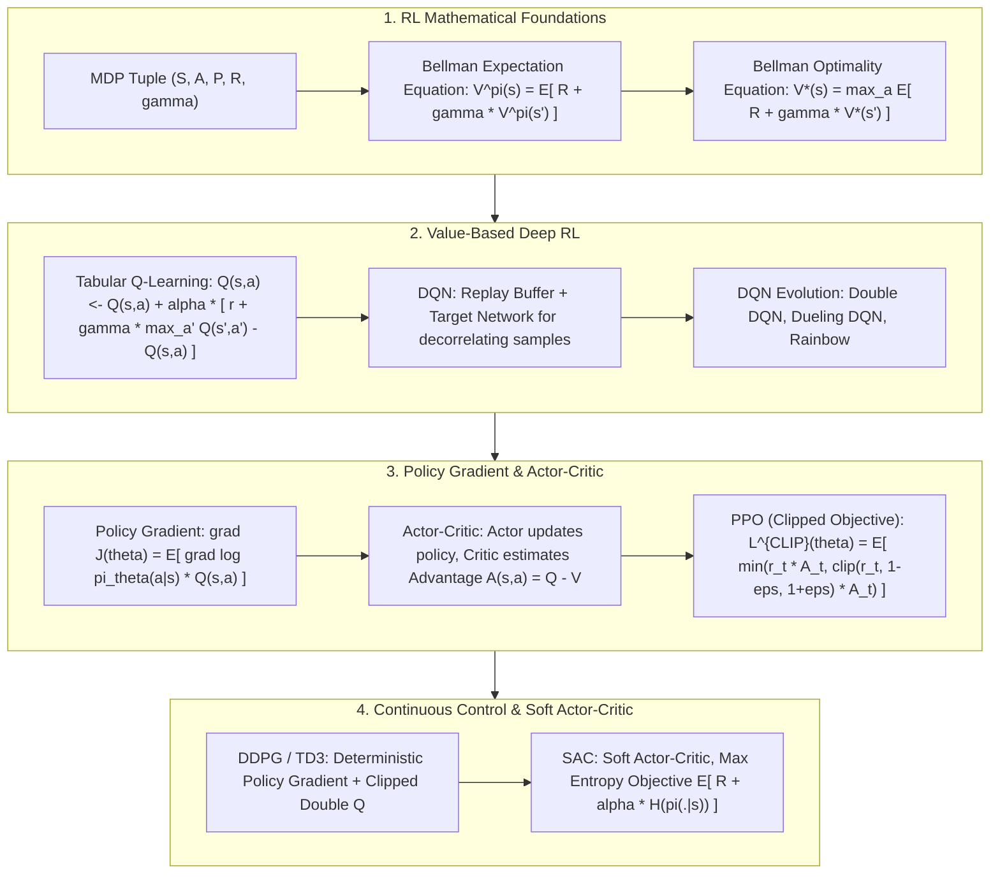

# 🌐 Foundations & Deep RL: MDP, Bellman Equations, DQN, Policy Gradient, PPO & SAC

> **Core Executive Summary**: Reinforcement Learning (RL) studies how an agent learns an optimal policy $\pi(a|s)$ via trial-and-error interaction with a dynamic environment to maximize cumulative discounted rewards. From classical tabular Q-Learning to Deep Q-Networks (DQN) and PPO/GRPO powering modern LLM RLHF and System 2 slow-thinking, RL establishes rigorous mathematical foundations. This guide dissects MDPs, Bellman Optimality Equations, Policy Gradient Theorems, PPO Clipped Loss, and SAC maximum entropy continuous control.

---

## 💡 Interactive Mermaid Architecture Flowchart



---

## 💡 Classic Interview Followups & Core Cheatsheet

* **Key Topic 1**: Derive the Policy Gradient Theorem: Why does gradient updating not require differentiating state transition probabilities $P(s'|s, a)$?
  * *Standard Answer*: Target objective $J(\theta) = \int P(\tau; \theta) R(\tau) d\tau$. Using the log-derivative trick $\nabla_\theta P = P \nabla_\theta \log P$, we get $\nabla_\theta J(\theta) = \mathbb{E}_{\tau \sim \pi_\theta} [\nabla_\theta \log P(\tau; \theta) R(\tau)]$. Taking logarithm derivative cancels out environment transition distribution $P(s_{t+1}|s_t, a_t)$.

> 💡 **Intuition**: A trajectory probability is a product of initial-state, transition, and policy terms. Taking the log turns products into sums; differentiating w.r.t. $\theta$, only the policy terms survive because the environment's transitions don't depend on $\theta$. Like directing a movie: you only tune the actors (policy), not the weather (environment).
>
> 🎤 **Interview answer**: Conclusion: policy-gradient updates never differentiate $P(s'|s,a)$. Why: the log-derivative trick $\nabla P = P\nabla\log P$ turns the integral into an expectation, and the transition probability has no $\theta$ to differentiate. Example: REINFORCE can estimate a gradient from just a few $(s,a,r)$ samples without ever knowing the environment model.

* **Key Topic 2**: Compare Value-Based (e.g. DQN) vs Policy-Based (e.g. PPO) algorithms in discrete vs continuous action spaces.
  * *Standard Answer*: Value-Based learns $Q(s, a)$ (high sample efficiency, discrete only). Policy-Based directly parameterizes policy $\pi_\theta(a|s)$ (naturally supports continuous actions and stochastic policies).

> 💡 **Intuition**: Value-based methods score actions and pick the max — impossible in a continuous action space, where the max would require scanning infinitely many candidates. Policy-based methods output the action distribution directly (mean + variance), which works fine for continuous controls like joint torques.
>
> 🎤 **Interview answer**: Conclusion: prefer DQN-family for discrete actions and PPO/SAC for continuous or stochastic policies. Why: the $\arg\max$ over $Q$ in a continuous space is intractable, while a parameterized policy naturally emits a continuous distribution. Example: a 7-DoF robot arm's torques live in a continuous space; SAC outputs them directly, while DQN would need to discretize infinitely many bins.

* **Key Topic 3**: Derive PPO Clipped Surrogate Objective and explain why clipping guarantees policy update stability.
  * *Standard Answer*: Ratio $r_t(\theta) = \frac{\pi_\theta(a_t|s_t)}{\pi_{\theta_{\text{old}}}(a_t|s_t)}$. Objective $L^{\text{CLIP}}(\theta) = \hat{\mathbb{E}}_t \left[ \min \left( r_t(\theta) \hat{A}_t, \text{clip}(r_t(\theta), 1-\epsilon, 1+\epsilon) \hat{A}_t \right) \right]$. Prevents excessively large policy updates.

> 💡 **Intuition**: $r_t$ measures how much the new policy deviates from the old on the same data. Clipping is an insurance policy: when the action improved ($A>0$) the bonus is capped at $1+\epsilon$; when it worsened ($A<0$) the penalty is also capped — each update can only walk so far, never step off a cliff.
>
> 🎤 **Interview answer**: Conclusion: PPO bounds every policy update by clipping the probability ratio inside $\min(r\cdot A,\ \text{clip}(r,1\pm\epsilon)\cdot A)$. Why: once the ratio crosses the boundary the gradient is zero, so no single update can collapse the policy. Example: with $\epsilon=0.2$ and a token's probability doubling ($r=2$), the update uses $1.2\times A$ instead of $2\times A$ — this is what keeps LLM RLHF training stable.

* **Key Topic 4**: Explain how Generalized Advantage Estimation (GAE) balances Bias and Variance.
  * *Standard Answer*: $\hat{A}_t^{\text{GAE}(\gamma, \lambda)} = \sum_{l=0}^\infty (\gamma \lambda)^l \delta_{t+l}^V$. $\lambda=0$ corresponds to 1-step TD (low variance, high bias); $\lambda=1$ corresponds to Monte Carlo (zero bias, high variance). Setting $\lambda \approx 0.95$ yields optimal balance.

> 💡 **Intuition**: GAE is a weighted average of $n$-step advantage estimates (1-step TD, 2-step, …, full Monte Carlo) with weights $(\gamma\lambda)^l$ — it looks one step ahead while also keeping an eye on the whole trajectory.
>
> 🎤 **Interview answer**: Conclusion: GAE interpolates between TD and Monte Carlo via exponentially decaying weights. Why: $\lambda=0$ gives 1-step TD (low variance, high bias), $\lambda=1$ gives MC (zero bias, huge variance); $\lambda\approx0.95$ balances both. Example: with $\gamma=0.99$ and $\lambda=0.95$, the TD error two steps ahead contributes $\approx 0.88$ weight — distant advantages decay exponentially, which is why it is the PPO default.

* **Key Topic 5**: How does the Maximum Entropy objective in Soft Actor-Critic (SAC) encourage exploration in unknown states?
  * *Standard Answer*: Adds entropy penalty $\alpha \mathcal{H}(\pi(\cdot|s_t))$ to the objective, forcing the policy to remain stochastic and explore diverse actions.

> 💡 **Intuition**: Entropy measures "indecision." SAC pays a reward for entropy, so the policy is rewarded for staying diverse and won't prematurely lock onto one action.
>
> 🎤 **Interview answer**: Conclusion: SAC adds an entropy bonus $\alpha \mathcal{H}(\pi)$ to the return to encourage exploration. Why: maximizing entropy keeps the policy distribution broad, so random actions keep getting rewarded. Example: in continuous control $\alpha$ starts around 0.2 and auto-tunes — if policy entropy drops, $\alpha$ rises to force exploration back; that is the core of SAC's robustness against local optima.

---

## 📚 Section 1: Deep RL Algorithms Comparison Matrix

> 📖 **How to read this table**: Look at "Policy Type + Sampling" first — On-Policy methods must resample with the latest policy (PPO, REINFORCE), Off-Policy ones can reuse old data (Q-Learning, DQN, SAC). Then check "Action Space": the jump from discrete-only rows (Q-Learning, DQN) to continuous rows (DDPG, SAC) is the interview-favorite selection boundary.

| Algorithm | Class | Policy Type | Sampling | Action Space | Key Advantage |
| :--- | :--- | :--- | :--- | :--- | :--- |
| **Q-Learning** | Value-Based | Deterministic | Off-Policy | Discrete | Simple tabular convergence |
| **DQN** | Value-Based | Deterministic | Off-Policy | Discrete | Replay Buffer + Target Net |
| **REINFORCE** | Policy-Based | Stochastic | On-Policy | Discrete/Continuous | Direct policy optimization |
| **PPO** | Actor-Critic | Stochastic | On-Policy | Discrete/Continuous | **Industry standard** stable clipped policy |
| **DDPG / TD3**| Actor-Critic | Deterministic | Off-Policy | Continuous | Robotic continuous control |
| **SAC** | Actor-Critic | Stochastic (Max Ent) | Off-Policy | Continuous | High exploration & robustness |

---

## ⚡ Section 2: PPO Clipped Loss & Bellman Equation

In plain words: the ratio $r_t$ tells you how much the new policy deviates from the old on the same action; the $\min$ with the clipped version caps the effective multiplier at $1\pm\epsilon$, so every update stays inside a safety corridor.

PPO Clipped Objective:
$$L^{\text{CLIP}}(\theta) = \hat{\mathbb{E}}_t \left[ \min \left( r_t(\theta) \hat{A}_t, \text{clip}(r_t(\theta), 1-\epsilon, 1+\epsilon) \hat{A}_t \right) \right]$$

> 💡 **Intuition**: $r_t=1$ means the policies agree at that point; the further $r_t$ drifts from 1, the bigger the change. $\text{clip}(\cdot, 1-\epsilon, 1+\epsilon)$ locks the deviation — a cheap stand-in for TRPO's KL trust region, replacing a Hessian-constrained step with a pair of scissors.
>
> 🎤 **Interview answer**: Conclusion: PPO replaces TRPO's KL constraint with a clipped probability ratio for the same safety distance. Why: $\min$ picks the lower branch for positive advantages and the upper for negative ones, so gradients only flow while the ratio is inside $[1-\epsilon, 1+\epsilon]$. Example: with $\epsilon=0.2$ and a token's probability doubling ($r=2$), the update uses $1.2\times A$, not $2\times A$ — RLHF on 7B models shows no loss spikes.

---

## 🐍 Section 3: Pure Numpy Handwritten PPO Clipped Loss Operator

```python
import numpy as np

def pure_numpy_ppo_clipped_loss(log_probs_new: np.ndarray, log_probs_old: np.ndarray, advantages: np.ndarray, epsilon: float = 0.2) -> float:
    ratios = np.exp(log_probs_new - log_probs_old)
    surr1 = ratios * advantages
    ratios_clipped = np.clip(ratios, 1.0 - epsilon, 1.0 + epsilon)
    surr2 = ratios_clipped * advantages
    return float(np.mean(np.minimum(surr1, surr2)))

if __name__ == "__main__":
    log_p_old = np.array([-0.5, -1.2, -0.3])
    log_p_new = np.array([-0.4, -1.8, -0.3])
    adv = np.array([1.5, -0.8, 0.5])
    ppo_loss = pure_numpy_ppo_clipped_loss(log_p_new, log_p_old, adv)
    print("✅ PPO Clipped Objective Complete:", round(ppo_loss, 4))
```

> 💡 **Intuition**: The first function is PPO's loss itself: `exp(log_p_new − log_p_old)` recovers the probability ratio, and `min` + `clip` form the double safety gate. The second is an incremental Bellman update: a TD error (target − current estimate) scaled by the learning rate.
>
> 🎤 **Interview answer**: Conclusion: these two operators are the heart of PPO and Q-Learning. Why: PPO works in log space for numerical stability; Q-Learning applies the TD error $r + \gamma \max Q' - Q$ as a correction. Example: new logprob −0.4 vs old −0.5 gives $r \approx 1.105$, multiplied by advantage 1.5 → 1.66; even if $r$ hit 2.0, clip caps it at 1.2 — the truncation logic is visible in one line.

---

## 🚀 Key Takeaways & Best Practices

1. **Algorithm Selection**: Use **PPO** or **GRPO** for discrete/LLM alignment; use **SAC** for continuous robotics.
2. **PPO Stability**: Always normalize Advantage via GAE and set Clipping $\epsilon \in [0.1, 0.2]$.
3. **Exploration**: Use **SAC Maximum Entropy** for sparse-reward tasks.