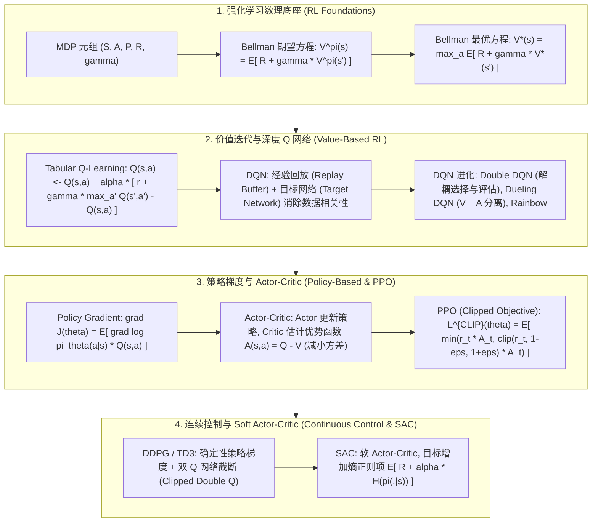

# 🌐 经典与深度强化学习全景：MDP 体系、Bellman 最优方程、DQN、Policy Gradient、PPO 与 SAC 原理解构

> **核心摘要**：强化学习 (Reinforcement Learning, RL) 是研究智能体 (Agent) 在与动态环境交互过程中，如何通过试错 (Trial-and-Error) 学习最优策略 $\pi(a|s)$ 以最大化累积折扣回报的数理科学。从经典表格型 Q-Learning 到结合深度神经网络的 DQN，再到支撑现代大模型 RLHF 对齐与 System 2 慢思考的 PPO 与 GRPO，强化学习已经建立了高度严密的数学基石。本指南系统解构 MDP 体系、Bellman 最优方程、Policy Gradient 定理、PPO 截断代理损失以及 SAC 熵最大化连续控制。

---

## 💡 交互式 Mermaid 架构流程图



---

## 💡 经典面试追问与考点速查

* **考点 1**：推导 Policy Gradient 定理：为什么梯度更新不需要对状态转移概率 $P(s'|s, a)$ 求导？
  * *标准回答*：
    * **期望目标**：策略性能目标定义为轨迹 $\tau = (s_0, a_0, s_1, a_1, \dots)$ 的期望累积回报：
      $$J(\theta) = \mathbb{E}_{\tau \sim \pi_\theta} [R(\tau)] = \int P(\tau; \theta) R(\tau) d\tau$$
    * **似然率技巧 (Log-Derivative Trick)**：
      $$\nabla_\theta J(\theta) = \int \nabla_\theta P(\tau; \theta) R(\tau) d\tau = \int P(\tau; \theta) \nabla_\theta \log P(\tau; \theta) R(\tau) d\tau = \mathbb{E}_{\tau \sim \pi_\theta} [\nabla_\theta \log P(\tau; \theta) R(\tau)]$$
    * **消去转移概率**：轨迹概率 $P(\tau; \theta) = P(s_0) \prod_{t=0}^T P(s_{t+1}|s_t, a_t) \pi_\theta(a_t|s_t)$。取对数梯度后：
      $$\nabla_\theta \log P(\tau; \theta) = \sum_{t=0}^T \nabla_\theta \log \pi_\theta(a_t|s_t)$$
      环境转移分布 $P(s_{t+1}|s_t, a_t)$ 对 $\theta$ 的导数为 0！这使得**强化学习可以在完全未知环境转移概率黑盒模型的情况下，仅通过采样策略对数梯度更新权重**！

> 💡 **直观理解**：轨迹概率 = 初始分布 × 转移概率 × 策略概率的连乘。取对数后乘法变加法，再对 $\theta$ 求导，只有策略项含 $\theta$——环境怎么转移不归我们管，梯度里自然没有它。就像拍电影：导演只能指挥演员（策略），天气（环境）不受控，那就只对演员的部分求导。
>
> 🎤 **面试速答**：结论：策略梯度更新不需要对 $P(s'|s, a)$ 求导。原理：对数导数技巧 $\nabla_\theta P = P \nabla_\theta \log P$ 把积分变成期望，转移概率不依赖 $\theta$，求导后自动消去。例子：REINFORCE 用几条 $(s, a, r)$ 样本就能估计一次梯度，全程不需要知道环境模型长什么样。

* **考点 2**：对比 Value-Based (如 DQN) 与 Policy-Based (如 PPO) 算法在离散与连续动作空间中的利弊？
  * *标准回答*：
    * **Value-Based (DQN 族)**：学习动作价值函数 $Q(s, a)$，策略由 $\arg\max_a Q(s, a)$ 隐式决定。优点是样本效率高 (Off-Policy 经验回放)；缺点是**无法直接处理连续动作空间**（寻找无穷维连续动作的 $\arg\max$ 在计算上无法求解），且容易产生价值过估计 (Overestimation Bias)；
    * **Policy-Based (PPO / SAC)**：直接参数化策略 $\pi_\theta(a|s)$（如高斯分布的均值与方差）。优点是**天然支持连续动作控制**，且能够学习随机策略 (Stochastic Policy)；缺点是样本效率稍低 (On-Policy 需要频繁重新采样)。

> 💡 **直观理解**：Value-Based 是"打分 → 选最高分"，动作空间连续时"最高分"要扫无穷多个候选，算不出来；Policy-Based 是"直接给出动作分布"，连续动作（如扭矩 0~10 N·m）只要输出高斯分布的均值加方差即可。
>
> 🎤 **面试速答**：结论：离散动作空间优先 DQN 族，连续或需要随机策略时优先 PPO/SAC。原理：$Q$ 的 $\arg\max$ 在连续空间不可计算，而参数化策略天然输出连续分布。例子：机器人 7 自由度关节力矩是连续空间，SAC 一行代码输出连续动作，DQN 则需要把无穷空间切成桶。

* **考点 3**：详细推导 PPO 的 Clipped Surrogate Objective 表达式，并解释为何 Clipping 机制能保证策略更新的稳定性？
  * *标准回答*：在 TRPO 中，限制新旧策略步长需要求解复杂的 Hessian 矩阵 KL 逆约束。**PPO (Proximal Policy Optimization)** 提出了简洁的概率比率截断目标：
    $$r_t(\theta) = \frac{\pi_\theta(a_t|s_t)}{\pi_{\theta_{\text{old}}}(a_t|s_t)}$$
    $$L^{\text{CLIP}}(\theta) = \hat{\mathbb{E}}_t \left[ \min \left( r_t(\theta) \hat{A}_t, \text{clip}(r_t(\theta), 1-\epsilon, 1+\epsilon) \hat{A}_t \right) \right]$$
    * **Clipping 物理含义**：当优势 $\hat{A}_t > 0$（说明动作表现优异）时，即便 $r_t(\theta)$ 极大，目标函数也被截断在 $(1+\epsilon) \hat{A}_t$，**防止梯度过大导致策略剧烈崩塌**；当 $\hat{A}_t < 0$ 时，限制比率不低于 $1-\epsilon$。该机制保证了新策略不会偏离旧策略太远，实现了极佳的训练稳定性。

> 💡 **直观理解**：$r_t$ 是新旧策略对同一条数据的概率比。clip 就像给策略更新上保险：动作变好了（优势为正）最多奖励 $1+\epsilon$ 倍的提升，变差了（优势为负）惩罚也封顶——策略一步只能走那么远，永远不会一步跨出悬崖。
>
> 🎤 **面试速答**：结论：PPO 通过 $\min(r \cdot A,\ \text{clip}(r,1\pm\epsilon) \cdot A)$ 把每步策略更新限制在概率比 $1\pm\epsilon$ 内。原理：比率越过保险线后梯度为 0，策略更新自动停止。例子：$\epsilon=0.2$，某 token 新概率是旧概率的 2 倍（$r=2$）时，梯度按 $1.2 \times A$ 截断而非 $2 \times A$——大模型 RLHF 全用它保证训练不崩。

* **考点 4**：解释 GAE (Generalized Advantage Estimation) 如何在偏差 (Bias) 与方差 (Variance) 之间取得平衡？
  * *标准回答*：GAE 定义了指数加权平均的优势函数估计量：
    $$\hat{A}_t^{\text{GAE}(\gamma, \lambda)} = \sum_{l=0}^\infty (\gamma \lambda)^l \delta_{t+l}^V, \quad \text{where } \delta_t^V = r_t + \gamma V(s_{t+1}) - V(s_t)$$
    * 当 $\lambda = 0$ 时，$\hat{A}_t = \delta_t^V = r_t + \gamma V(s_{t+1}) - V(s_t)$（即 1-step TD 误差），**方差最小但强依赖 $V$ 函数估计（偏差高）**；
    * 当 $\lambda = 1$ 时，为 Monte Carlo 采样全轨迹和，**零偏差但方差极高**；通过调节折扣因子 $\lambda \in [0, 1]$（通常取 0.95），可以在 Bias 和 Variance 之间平衡。

> 💡 **直观理解**：GAE 是把"1 步 TD、2 步 TD、3 步 TD……全轨迹 MC"这些不同长度的优势估计按 $(\gamma\lambda)^l$ 加权求和——既看眼前一步，也回头望整个轨迹，用指数衰减的权重折中。
>
> 🎤 **面试速答**：结论：GAE 用指数加权折中 TD 与 MC。原理：$\lambda=0$ 是 1 步 TD（方差低、偏差高），$\lambda=1$ 是 MC（零偏差、方差极高），$\lambda\approx0.95$ 平衡两者。例子：$\gamma=0.99, \lambda=0.95$ 时，第 2 步的 TD 误差权重约 $0.94^2 \approx 0.88$，远处的优势贡献指数衰减——PPO 的标配。

* **考点 5**：Soft Actor-Critic (SAC) 引入的最大熵 (Maximum Entropy) 目标项如何鼓励 Agent 在未知状态中自由探索？
  * *标准回答*：传统 RL 仅最大化预期回报。SAC 在奖励中显式加入**策略熵 $\mathcal{H}(\pi(\cdot|s_t))$ 惩罚项**：
    $$J(\pi) = \sum_{t=0}^T \mathbb{E}_{(s_t, a_t)} \left[ R(s_t, a_t) + \alpha \mathcal{H}(\pi(\cdot|s_t)) \right]$$
    熵 $\mathcal{H}$ 代表策略分布的不确定性。最大化熵使得策略尽可能是随机分散的，阻止策略过早收敛到局部最优的确定性动作，从而显著增强了探索能力与泛化鲁棒性！

> 💡 **直观理解**：熵越大，策略越"犹豫不决"。SAC 给犹豫发奖金：动作越多样，额外奖励越高——模型就不会过早认定"只有一个正确答案"而困在局部最优里。
>
> 🎤 **面试速答**：结论：SAC 在回报上叠加熵奖励 $\alpha \mathcal{H}(\pi)$ 鼓励探索。原理：熵项让策略保持分布宽度，随机性越高得分越高。例子：连续控制中 $\alpha$ 初始约 0.2 且训练时自动调节——策略熵一旦掉下去，$\alpha$ 自动加大强制探索，这是 SAC 抗局部最优的核心。

---

## 📚 第一章：经典与深度 RL 算法特性对比矩阵

> 📖 **怎么读这张表**：看"策略类型 + 采样方式"两列——On-Policy 必须用最新策略重新采样（PPO/REINFORCE），Off-Policy 可复用历史数据（Q-Learning/DQN/SAC）；再看"动作空间"列：离散行（Q-Learning/DQN）到连续行（DDPG/SAC）的跨越是面试最常考的选型分界线。

| 算法名称 | 类别 | 策略类型 | 采样方式 | 动作空间 | 核心优势 |
| :--- | :--- | :--- | :--- | :--- | :--- |
| **Q-Learning** | Value-Based | 确定性 (Greedy) | Off-Policy | 仅限离散 | 经典简单，表格收敛保证 |
| **DQN** | Value-Based | 确定性 | Off-Policy | 离散 | 经验回放 + 目标网络高样本效率 |
| **REINFORCE** | Policy-Based | 随机策略 | On-Policy | 离散/连续 | 无需学习 V 函数，数学直观 |
| **PPO** | Actor-Critic | 随机策略 | On-Policy | 离散/连续 | **工业标准**！Clipped 策略极稳 |
| **DDPG / TD3**| Actor-Critic | 确定性 | Off-Policy | 连续 | 适合机器人高维连续控制 |
| **SAC** | Actor-Critic | 随机策略 (熵最大化)| Off-Policy | 连续 | 超强探索能力，抗局部最优 |

---

## ⚡ 第二章：PPO Clipped 目标函数与 Bellman 方程

### 2.1 Bellman 最优状态价值方程

大白话：站在状态 $s$ 的最优价值 = "这一步立刻拿到的奖励" + "打了折扣的未来最好结果"。未来有不确定性，所以对每个可能到达的 $s'$ 按概率加权；先拿到的钱比将来的钱值钱，所以乘上折扣 $\gamma$。这个方程是"自我指涉"的：右边算出来的 $V^*$ 又出现在右边，靠动态规划迭代让两边收敛到同一个值。

$$V^*(s) = \max_{a \in \mathcal{A}} \left\{ R(s, a) + \gamma \sum_{s' \in \mathcal{S}} P(s'|s, a) V^*(s') \right\}$$

> 💡 **直观理解**：把 $V^*$ 想成"对未来的标价"。方程说：当下状态的最优标价 = 立即奖励 + 折扣 ×（各后继状态最优标价的期望）。因为 $V^*(s')$ 又满足同一个方程，像镜子照镜子，数值迭代（价值迭代）让标价逐步收敛——这就是 Bellman 方程自洽的原因。
>
> 🎤 **面试速答**：结论：Bellman 最优方程把多步决策拆成"一步奖励 + 一步之后的最优"，由此自我指涉、自洽收敛。原理：最优策略满足"每步取 argmax"的最优性原理，方程以自身为未知数构成不动点。例子：$2\times2$ 迷宫、目标格奖励 1、其余 0、$\gamma=0.9$，价值迭代几轮后格子价值收敛到 1、0.9、0.81 这种几何级数——因为每多走一步就多打一次 0.9 折。

### 2.2 PPO Clipped Surrogate Loss 算子公式

大白话：先算"新策略相对旧策略的概率比" $r_t$，再拿它乘优势 $A_t$ 当放大倍数；$\min$ 和 clip 两道闸门保证这个放大倍数最多 $1\pm\epsilon$，策略每步更新都待在安全区里。

$$L^{\text{CLIP}}(\theta) = \hat{\mathbb{E}}_t \left[ \min \left( r_t(\theta) \hat{A}_t, \text{clip}\big(r_t(\theta), 1-\epsilon, 1+\epsilon\big) \hat{A}_t \right) \right]$$

> 💡 **直观理解**：概率比 $r_t=1$ 表示新旧策略在这一点完全一致；$r_t$ 偏离 1 越远，策略变化越大。$\text{clip}(\cdot, 1-\epsilon, 1+\epsilon)$ 直接把偏离幅度锁死——这就是"信任域"的廉价实现版（TRPO 用 KL 约束，PPO 用一把剪刀）。
>
> 🎤 **面试速答**：结论：PPO 用概率比截断替代 TRPO 的 KL 约束，实现同等的策略安全距离。原理：$\min$ 在优势为正时取下限、为负时取上限，梯度只在未越界的一侧流动。例子：$\epsilon=0.2$，某 token 概率从 0.1 提到 0.2（$r=2$），按 1.2 截断而非 2——RLHF 微调 7B 模型时 loss 曲线不会出现尖峰。

---

## 🐍 第三章：Pure Numpy 手写 PPO Clipped Loss 与 Q-Learning 算子

```python
import numpy as np

def pure_numpy_ppo_clipped_loss(log_probs_new: np.ndarray, log_probs_old: np.ndarray, advantages: np.ndarray, epsilon: float = 0.2) -> float:
    """ Pure Numpy 实现 PPO Clipped Surrogate Objective 算子 """
    ratios = np.exp(log_probs_new - log_probs_old)
    surr1 = ratios * advantages
    ratios_clipped = np.clip(ratios, 1.0 - epsilon, 1.0 + epsilon)
    surr2 = ratios_clipped * advantages
    return float(np.mean(np.minimum(surr1, surr2)))

class PureNumpyQTableAgent:
    """ Pure Numpy 表格型 Q-Learning 智能体 """
    def __init__(self, num_states: int, num_actions: int, lr: float = 0.1, gamma: float = 0.99):
        self.q_table = np.zeros((num_states, num_actions))
        self.lr = lr
        self.gamma = gamma
        
    def update(self, s: int, a: int, r: float, s_next: int, done: bool):
        target = r if done else r + self.gamma * np.max(self.q_table[s_next])
        self.q_table[s, a] += self.lr * (target - self.q_table[s, a])

# ==================== 测试验证 ====================
if __name__ == "__main__":
    np.random.seed(42)
    log_p_old = np.array([-0.5, -1.2, -0.3])
    log_p_new = np.array([-0.4, -1.8, -0.3])
    adv = np.array([1.5, -0.8, 0.5])
    ppo_loss = pure_numpy_ppo_clipped_loss(log_p_new, log_p_old, adv, epsilon=0.2)
    print("✅ PPO Clipped Objective 计算完成:", round(ppo_loss, 4))
    
    agent = PureNumpyQTableAgent(num_states=5, num_actions=2)
    agent.update(s=0, a=1, r=1.0, s_next=1, done=False)
    print("✅ Q-Table 更新状态 (0, 1):", round(agent.q_table[0, 1], 4))
```

> 💡 **直观理解**：第一段代码就是 PPO 损失的完整本体：`exp(log_p_new − log_p_old)` 还原概率比，`min` 与 `clip` 双保险；第二段 Q-Learning 就是 Bellman 方程的增量版：用"目标 − 当前估计"的 TD 误差乘学习率修正 Q 表。
>
> 🎤 **面试速答**：结论：这两个算子分别是 PPO 与 Q-Learning 的全部核心。原理：PPO 在 log 域算比率（数值稳定），Q-Learning 用 $r + \gamma \max Q' - Q$ 做增量修正。例子：新 logprob −0.4 对旧 −0.5 对应 $r \approx 1.105$，乘优势 1.5 得 1.66；即使 $r$ 涨到 2.0，仍被 clip 封顶在 1.2——截断逻辑在代码里一行可见。

---

## 🚀 总结与工程最佳实践

1. **算法选型法则**：离散高维/LLM 对齐首选 **PPO** 或 **GRPO**；连续机械臂控制首选 **SAC**；
2. **PPO 训练避坑指南**：必须启用 GAE (Advantage 归一化) 与 Clipping ($\epsilon=0.1\sim 0.2$)，防止策略梯度爆炸；
3. **关乎探索 (Exploration)**：高难度非稀疏奖励场景务必引入 **SAC 熵最大化** 或 **Intrinsic Curiosity (内驱好奇心)**。